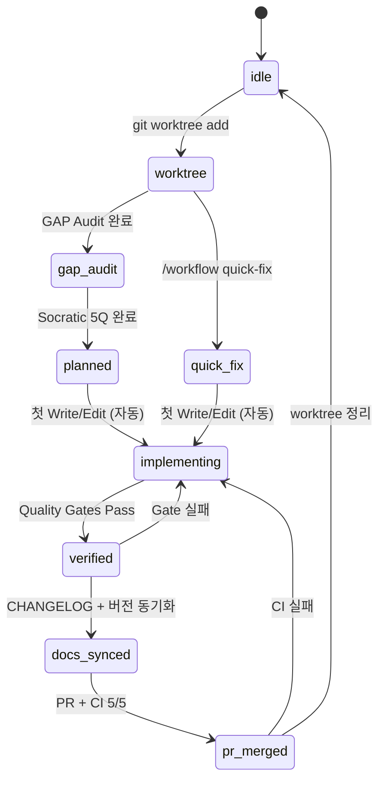
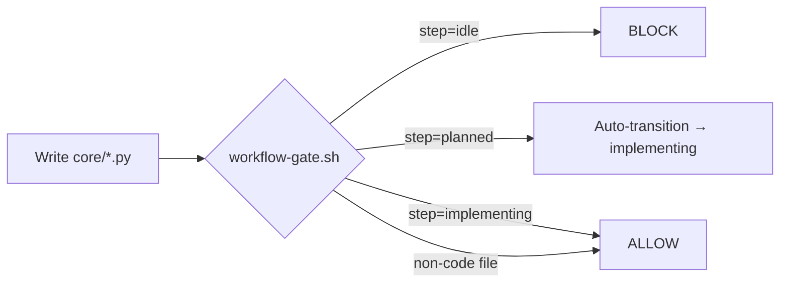
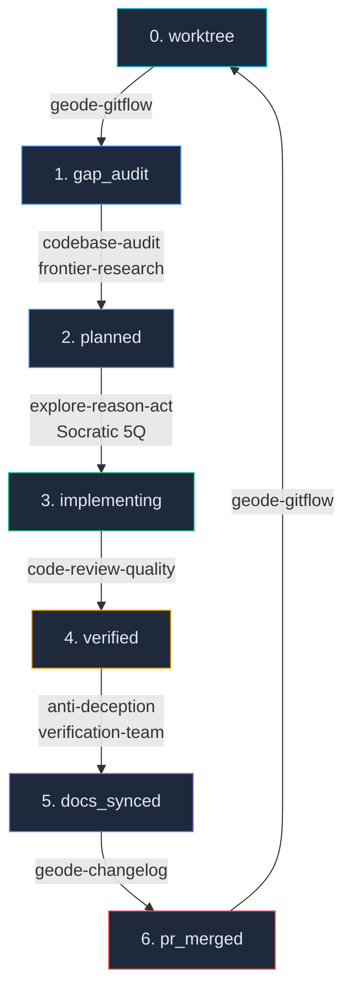

# GEODE Unified Scaffold

> 8-step 개발 워크플로우를 **Hook-Driven State Machine**으로 통합한 스캐폴드 설계.

## Problem

GEODE 워크플로우 8단계가 **95% 문서화, 30% 시행**.

| 현재 | 문제 |
|------|------|
| CLAUDE.md 규칙 | LLM이 안 따르면 끝 |
| 9개 스킬 독립 존재 | 어떤 스킬을 언제 쓸지 모름 |
| check-progress.sh | 권고만, 차단 안 함 |
| 워크플로우 상태 없음 | 어디까지 했는지 모름 |

---

## Architecture: 3-Layer Enforcement

```
Layer 1: Hard Gate     ←── PreToolUse hooks (물리적 차단)
Layer 2: Soft Gate     ←── PostToolUse hooks (경고/자동 전환)
Layer 3: Orchestration ←── workflow-orchestrator skill (가이드)
```

### State Machine



### State File

```
.claude/workflow-state.json (gitignored)
```

```json
{
  "version": 1,
  "current_step": "implementing",
  "task_id": "lifecycle-commands",
  "branch": "feature/lifecycle-commands",
  "escape_hatch": false,
  "history": [
    {"step": "worktree", "at": "2026-04-09T22:57:45+09:00"},
    {"step": "implementing", "at": "2026-04-09T23:10:00+09:00"}
  ],
  "gates_passed": {
    "quality_lint": true,
    "quality_type": false
  }
}
```

---

## Hook Architecture

### Hard Gates (PreToolUse)

| Hook | 트리거 | 차단 조건 |
|------|--------|----------|
| `workflow-gate.sh` | Write/Edit on `core/`, `tests/` | step 이 implementing, quick_fix 등이 아닐 때 |
| `push-gate.sh` | `git push` | step 이 worktree, gap_audit, planned일 때 |
| `pr-gate.sh` | `gh pr create` | step 이 docs_synced, quick_fix 아닐 때 |

### Gate Flow



### Advisory (Stop)

`check-progress.sh` — 세션 종료 시 workflow 상태 요약 포함.

---

## Skill Orchestration

### `/workflow` Command

| 명령 | 동작 |
|------|------|
| `/workflow status` | 현재 단계 + 게이트 + 히스토리 |
| `/workflow advance` | 전제조건 검증 → 다음 단계 전환 |
| `/workflow quick-fix` | escape hatch (step 1,2 건너뛰기) |
| `/workflow init <task> <branch>` | 상태 파일 초기화 |
| `/workflow reset` | IDLE 복귀 |

### Step → Skill Mapping



---

## Escape Hatch (Quick Fix)

> CAN 규칙: "단순 버그/문서 수정은 Plan 생략 가능"

`/workflow quick-fix` → GAP Audit(1) + Socratic Gate(2) 건너뛰기.

| 여전히 시행 | 건너뛰는 것 |
|------------|-----------|
| worktree 필수 | GAP Audit |
| quality gates | Socratic Gate |
| CHANGELOG | Verification Team |
| PR + CI | |

---

## Error Recovery

| 상황 | 처리 | 원칙 |
|------|------|------|
| 상태 파일 손상 | `idle` fallback | Fail-open |
| 단계-코드 불일치 | `planned→implementing` 자동 | 최소 마찰 |
| 품질 게이트 실패 | `implementing` 유지 | Ratchet (P4) |
| CI 실패 | `pr_merged→implementing` 회귀 | 재시도 허용 |
| 세션 종료 | 상태 파일 디스크 유지 | 세션 연속성 |

---

## Implementation Files

```
.claude/
├── hooks/
│   ├── workflow-lib.sh        # 공유 함수 (state read/write)
│   ├── workflow-gate.sh       # PreToolUse: Write/Edit 게이트
│   ├── push-gate.sh           # PreToolUse: git push 게이트
│   ├── pr-gate.sh             # PreToolUse: gh pr create 게이트
│   └── check-progress.sh     # Stop: workflow 상태 요약 추가
├── skills/
│   └── workflow-orchestrator/
│       └── SKILL.md           # 통합 오케스트레이터 스킬
├── commands/
│   └── workflow.md            # /workflow 명령 정의
├── settings.json              # Hook 등록 (PreToolUse 3개)
└── workflow-state.json        # 상태 파일 (gitignored)
```

---

## Design Principles

| 결정 | 이유 |
|------|------|
| Shell script | Claude Code hook API 네이티브, scaffold↔runtime 분리 |
| PreToolUse hook | 문서=규율, Hook=시행. 70% 갭의 원인 |
| Fail-open | GEODE error_recovery 4-stage 패턴 |
| 자동 전환 | 의식(ceremony)이 아닌 전제조건만 시행 |
| Per-worktree state | 병렬 작업 격리 (SessionKey 패턴) |

---

## References

- [[geode]] — GEODE 프로젝트 개요
- Karpathy P1 (Constraint-based), P4 (Ratchet), P5 (Git as State Machine)
- OpenClaw Policy Chain, Session Key Hierarchy
- Claude Code Hooks API: PreToolUse / PostToolUse / Stop
