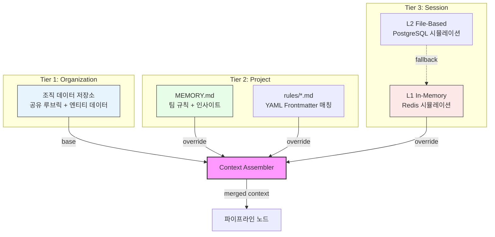
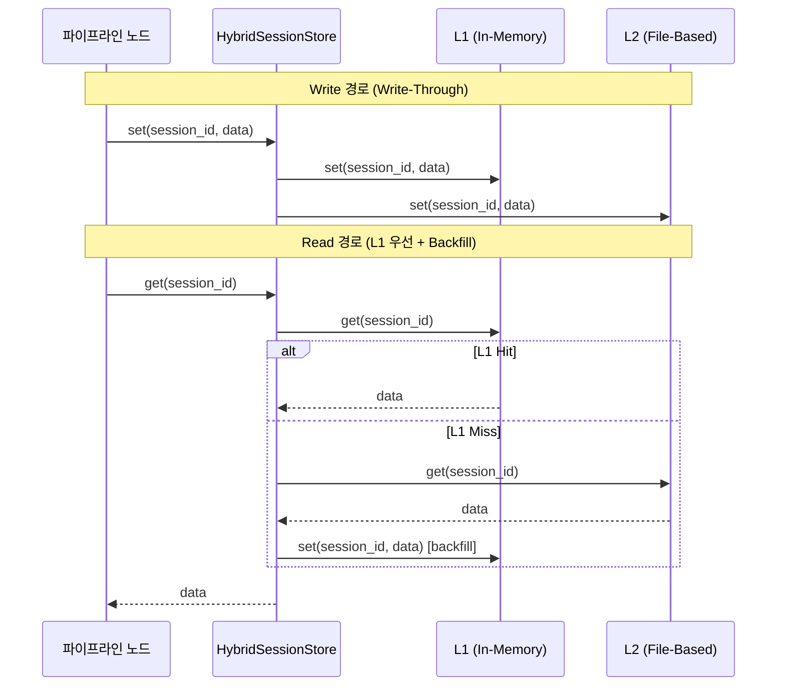
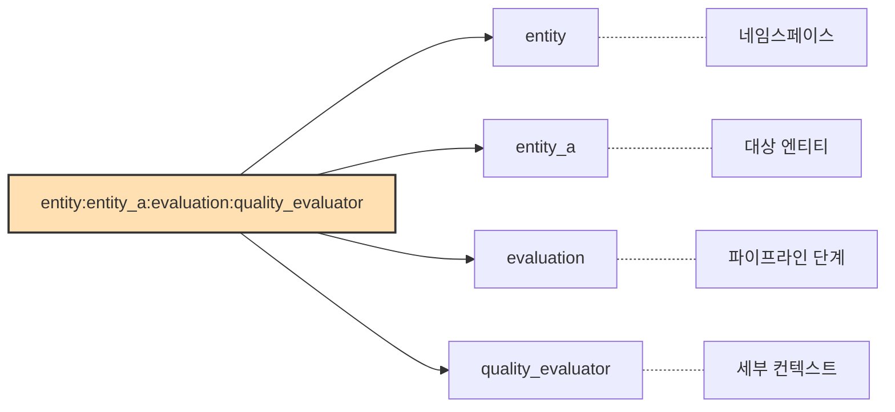
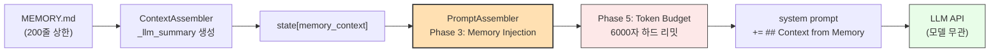
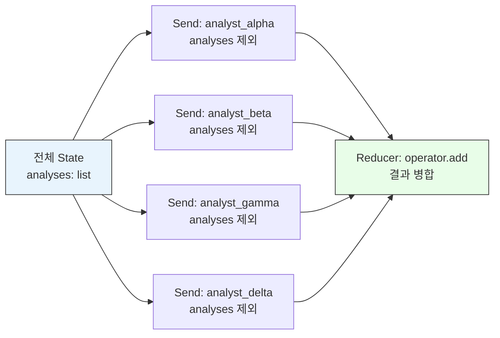
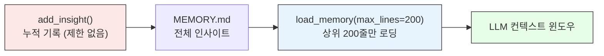
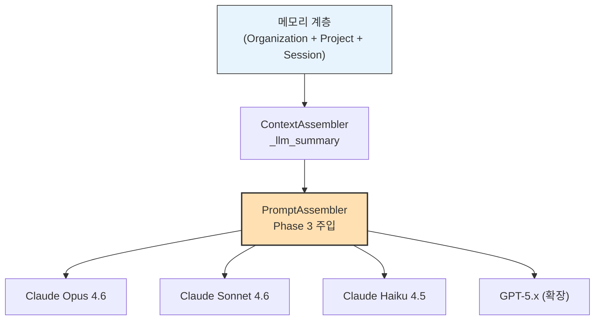
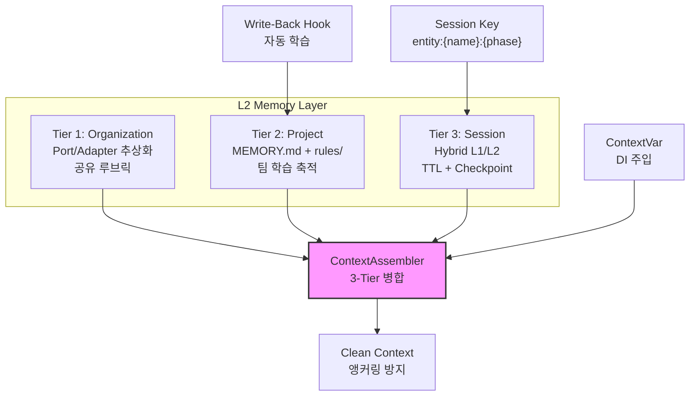

# 에이전트 시스템의 계층적 메모리 아키텍처

LLM 기반 에이전트 시스템은 단일 프롬프트로 끝나지 않습니다. 여러 분석 단계를 거치고, 이전 실행 결과를 학습하며, 조직 전체의 기준을 따라야 합니다. 이 글에서는 실제 프로덕션 에이전트 시스템에서 구현한 **3-Tier 계층적 메모리 아키텍처**를 코드와 함께 살펴보겠습니다.

## 목차

1. [왜 에이전트에게 계층적 메모리가 필요한가](#1-왜-에이전트에게-계층적-메모리가-필요한가)
2. [3-Tier 아키텍처 개관](#2-3-tier-아키텍처-개관)
3. [Tier 1: Organization Memory — Port/Adapter + 공유 Rubric](#3-tier-1-organization-memory----portadapter--공유-rubric)
4. [Tier 2: Project Memory — MEMORY.md + YAML Rules 패턴](#4-tier-2-project-memory----memorymd--yaml-rules-패턴)
5. [Tier 3: Session Memory — Hybrid L1/L2 Write-Through](#5-tier-3-session-memory----hybrid-l1l2-write-through)
6. [Hierarchical Session Key 설계](#6-hierarchical-session-key-설계)
7. [Context Assembly: 3-Tier 병합 알고리즘](#7-context-assembly-3-tier-병합-알고리즘)
8. [Clean Context 패턴 — 앵커링 방지 메모리 격리](#8-clean-context-패턴----앵커링-방지-메모리-격리)
9. [ContextVar 기반 의존성 주입](#9-contextvar-기반-의존성-주입)
10. [메모리 기반 자동 학습 루프](#10-메모리-기반-자동-학습-루프)
11. [핵심 정리 + 체크리스트](#11-핵심-정리--체크리스트)

---

## 1. 왜 에이전트에게 계층적 메모리가 필요한가

단순한 에이전트는 하나의 프롬프트에 모든 컨텍스트를 주입합니다. 하지만 프로덕션 환경에서는 세 가지 차원의 정보가 동시에 필요합니다.

| 차원 | 예시 | 수명 |
|------|------|------|
| **조직 공통** | 공유 평가 루브릭, 엔티티 데이터 | 반영구적 |
| **프로젝트 학습** | 이전 분석 인사이트, 팀 규칙 | 프로젝트 수명 |
| **세션 임시** | 현재 실행 중간 결과, 체크포인트 | 시간 단위 TTL |

하나의 flat dict에 이 모든 것을 담으면 다음과 같은 문제가 발생합니다.

- 조직 루브릭이 바뀌면 모든 세션에 수동 전파가 필요합니다
- 이전 분석 인사이트가 현재 세션 데이터와 충돌합니다
- 만료되어야 할 세션 데이터가 영구적으로 잔류합니다

계층적 메모리는 이 문제를 **스코프 분리 + 자동 병합**으로 해결합니다.

---

## 2. 3-Tier 아키텍처 개관



핵심 원칙은 **하위 Tier가 상위 Tier를 override**한다는 것입니다. Organization이 기본값을 제공하고, Project가 팀 맞춤 규칙으로 덮어쓰며, Session이 현재 실행 맥락으로 최종 결정합니다.

---

## 3. Tier 1: Organization Memory -- Port/Adapter + 공유 Rubric

Organization Memory는 조직 전체에서 공유하는 데이터 저장소입니다. Port/Adapter 패턴으로 인터페이스와 구현을 분리합니다.

**Port (인터페이스) 정의:**

```python
from typing import Any, Protocol, runtime_checkable

@runtime_checkable
class OrganizationMemoryPort(Protocol):
    """조직 레벨 공유 메모리 포트.

    Note: 메서드/파라미터명은 도메인에 맞게 조정합니다.
    이 글에서는 범용 에이전트 시스템 관점으로 일반화합니다.
    """

    def get_entity_context(self, entity_name: str) -> dict[str, Any]: ...

    def get_common_rubric(self) -> dict[str, Any]: ...

    def save_analysis_result(
        self, entity_name: str, result: dict[str, Any]
    ) -> bool: ...
```

`runtime_checkable` 데코레이터를 사용하여 `isinstance()` 검사가 런타임에도 가능합니다. 이는 의존성 주입 시 타입 안전성을 보장합니다.

**Adapter (구현체):**

```python
class OrganizationMemory:
    """조직 데이터 저장소 기반 공유 메모리."""

    def __init__(self, fixture_dir: Path | None = None) -> None:
        self._fixture_dir = fixture_dir or DEFAULT_FIXTURE_DIR
        self._cache: dict[str, dict[str, Any]] = {}
        self._analysis_results: dict[str, list[dict[str, Any]]] = {}
        self._load_fixtures()

    def get_common_rubric(self) -> dict[str, Any]:
        return {
            "axes_count": 14,
            "scale": "1-5",
            "confidence_threshold": 0.7,
            "tier_mapping": {
                "S": {"min_score": 80},
                "A": {"min_score": 65},
                "B": {"min_score": 50},
                "C": {"min_score": 35},
                "D": {"min_score": 0},
            },
        }
```

> **인사이트**: Organization Memory는 JSON 픽스처를 기반으로 하지만, Port를 통해 추상화되어 있으므로 프로덕션에서는 DB 기반 어댑터로 교체할 수 있습니다. 테스트 시에는 인메모리 Mock을 주입하면 됩니다.

---

## 4. Tier 2: Project Memory -- MEMORY.md + YAML Rules 패턴

Project Memory는 파일 기반의 영속 메모리로, 두 가지 구성 요소를 가집니다.

### MEMORY.md: 메인 컨텍스트 파일

```
.claude/
├── MEMORY.md           # 프로젝트 메모리 (상위 200줄 → 시스템 컨텍스트)
└── rules/              # 모듈식 규칙
    ├── category-a.md   # 카테고리별 규칙
    └── ...
```

```python
class ProjectMemory:
    """파일 기반 프로젝트 메모리."""

    MAX_MEMORY_LINES = 200

    def load_memory(self, max_lines: int = MAX_MEMORY_LINES) -> str:
        """MEMORY.md의 상위 N줄을 로딩 (컨텍스트 윈도우 효율성)."""
        if not self._memory_file.exists():
            return ""
        content = self._memory_file.read_text(encoding="utf-8")
        lines = content.split("\n")[:max_lines]
        return "\n".join(lines)
```

상위 200줄만 로딩하는 이유는 LLM 컨텍스트 윈도우의 효율적 사용을 위한 설계 결정입니다. 가장 중요한 정보가 파일 상단에 위치하도록 구조화합니다.

### rules/*.md: YAML Frontmatter 기반 규칙 매칭

```markdown
---
name: category-specific-rules
paths:
  - "**/*keyword_a*"
  - "*keyword_b*"
---

# 특정 카테고리 분석 규칙

## 데이터 소스 우선순위
1. 소스 A (1차 데이터)
2. 소스 B (커뮤니티 데이터)
```

규칙 파일은 YAML frontmatter의 `paths` 필드를 통해 조건부 로딩됩니다.

```python
def load_rules(self, context: str = "*") -> list[dict[str, Any]]:
    """context 문자열에 매칭되는 규칙만 선택적 로딩."""
    matched: list[dict[str, Any]] = []
    for rule_file in sorted(self._rules_dir.glob("*.md")):
        raw = rule_file.read_text(encoding="utf-8")
        fm_match = _FRONTMATTER_RE.match(raw)
        if fm_match:
            paths = _extract_paths(fm_match.group(1))
            body = raw[fm_match.end():]
        else:
            paths, body = [], raw

        if context == "*" or not paths or _matches_any_pattern(context, paths):
            matched.append({
                "name": rule_file.stem,
                "paths": paths,
                "content": body.strip(),
            })
    return matched
```

> **인사이트**: `context="*"`이면 모든 규칙을 로딩하고, 특정 엔티티명을 전달하면 해당 카테고리의 규칙만 선택적으로 적용됩니다. 이 패턴으로 파이프라인 노드마다 필요한 규칙만 주입할 수 있습니다.

---

## 5. Tier 3: Session Memory -- Hybrid L1/L2 Write-Through

Session Memory는 현재 실행 세션의 중간 결과와 체크포인트를 저장합니다. 2-tier 구조로 **속도**와 **내구성**을 동시에 확보합니다.



```python
class HybridSessionStore:
    """L1(fast) → L2(durable) 하이브리드 세션 스토어."""

    def __init__(self, l1: SessionStorePort, l2: SessionStorePort) -> None:
        self._l1 = l1
        self._l2 = l2

    def get(self, session_id: str) -> dict[str, Any] | None:
        """L1에서 조회, miss 시 L2 fallback + L1 backfill."""
        data = self._l1.get(session_id)
        if data is not None:
            return data
        data = self._l2.get(session_id)
        if data is not None:
            self._l1.set(session_id, data)  # backfill
        return data

    def set(self, session_id: str, data: dict[str, Any]) -> None:
        """Write-through: L1과 L2에 동시 기록."""
        self._l1.set(session_id, data)
        self._l2.set(session_id, data)
```

| 비교 항목 | L1 (In-Memory) | L2 (File-Based) |
|-----------|----------------|-----------------|
| 속도 | O(1) dict lookup | 파일 I/O |
| 내구성 | 프로세스 종료 시 소실 | 디스크에 영속 |
| TTL 지원 | dataclass 기반 | 파일 timestamp 기반 |
| 체크포인트 | 메모리 내 별도 dict | `checkpoints/` 하위 디렉토리 |
| 용도 | Hot path 캐시 | Cold 복구, 감사 로그 |

L1의 TTL 만료 처리 방식은 다음과 같습니다. `_RedisEntry`와 `RedisSessionStore`는 HybridSessionStore의 L1 레이어로 사용되는 컴포넌트입니다(기본 단독 세션 스토어인 `InMemorySessionStore`와는 별도).

```python
@dataclass
class _RedisEntry:
    data: dict[str, Any]
    created_at: float = field(default_factory=time.time)
    ttl_seconds: float = DEFAULT_TTL_SECONDS

class RedisSessionStore:
    def get(self, session_id: str) -> dict[str, Any] | None:
        entry = self._store.get(session_id)
        if entry is None:
            return None
        if time.time() - entry.created_at > entry.ttl_seconds:
            del self._store[session_id]  # lazy eviction
            return None
        return entry.data
```

lazy eviction 전략은 별도 GC 스레드 없이도 만료 데이터를 정리합니다.

Write-Through 대신 Write-Behind(비동기 L2 기록) 방식도 고려할 수 있으나, Write-Behind는 L1-L2 간 일시적 불일치가 발생합니다. 에이전트 파이프라인에서 체크포인트 데이터는 장애 복구의 기준이 되므로, 일관성(consistency)을 보장하는 Write-Through가 적합합니다.

---

## 6. Hierarchical Session Key 설계

세션 키는 단순 UUID가 아니라, 파이프라인 단계와 엔티티명을 인코딩한 **계층적 문자열**입니다.

```
entity:{name}:{phase}[:{sub_context}]
```

실제 생성 예시:

```
entity:entity_a:cortex
entity:entity_b:analysis
entity:entity_a:evaluation:quality_evaluator
entity:entity_c:scoring
entity:entity_a:synthesis
```

```python
ALL_PHASES = frozenset({
    "cortex", "signals", "analysis",
    "evaluation", "scoring", "verification", "synthesis",
})

def build_session_key(
    entity_name: str, phase: str, sub_context: str | None = None
) -> str:
    """계층적 세션 키 생성."""
    normalized = _normalize_name(entity_name)
    key = f"entity:{normalized}:{phase}"
    if sub_context:
        key += f":{_normalize_name(sub_context)}"
    return key

def build_thread_config(
    entity_name: str, phase: str, sub_context: str | None = None
) -> dict[str, Any]:
    """LangGraph thread config에 계층적 세션 키 주입."""
    thread_id = build_session_key(entity_name, phase, sub_context)
    return {"configurable": {"thread_id": thread_id}}
```



이 구조의 장점:

- **체크포인트 필터링**: 특정 엔티티의 특정 단계만 조회 가능
- **세션 격리**: 서로 다른 엔티티의 분석이 충돌하지 않음
- **디버깅**: 키만 보면 어떤 엔티티의 어떤 단계인지 즉시 파악 가능

---

## 7. Context Assembly: 3-Tier 병합 알고리즘

`ContextAssembler`는 3개 Tier의 메모리를 하나의 dict로 병합하는 핵심 컴포넌트입니다.

```python
class ContextAssembler:
    """3-Tier 메모리 병합기."""

    def __init__(
        self,
        *,
        organization_memory: OrganizationMemoryPort | None = None,
        project_memory: ProjectMemoryPort | None = None,
        session_store: SessionStorePort | None = None,
        freshness_threshold_s: float = 3600.0,
    ) -> None:
        self._org_memory = organization_memory
        self._project_memory = project_memory
        self._session_store = session_store
        self._freshness_threshold = freshness_threshold_s

    def assemble(self, session_id: str, entity_name: str) -> dict[str, Any]:
        context: dict[str, Any] = {}

        # Tier 1 (base): Organization Memory
        if self._org_memory:
            try:
                org_ctx = self._org_memory.get_entity_context(entity_name)
                if org_ctx:
                    context.update(org_ctx)
                    context["_org_loaded"] = True
            except Exception as e:
                log.warning("Failed to load organization context: %s", e)
                context["_org_loaded"] = False

        # Tier 2 (override): Project Memory
        if self._project_memory:
            try:
                proj_ctx = self._project_memory.get_context_for_entity(entity_name)
                if proj_ctx:
                    for key, value in proj_ctx.items():
                        if value:  # 비어 있지 않은 값만 override
                            context[key] = value
                    context["_project_loaded"] = True
            except Exception as e:
                log.warning("Failed to load project context: %s", e)
                context["_project_loaded"] = False

        # Tier 3 (override): Session Data
        if self._session_store:
            try:
                session_data = self._session_store.get(session_id)
                if session_data:
                    context.update(session_data)
                    context["_session_loaded"] = True
            except Exception as e:
                log.warning("Failed to load session context: %s", e)
                context["_session_loaded"] = False

        assembled_at = time.time()
        context["_assembled_at"] = assembled_at
        context["_session_id"] = session_id
        context["_entity_name"] = entity_name
        context["_llm_summary"] = self._build_llm_summary(context)
        return context
```

병합 순서가 중요합니다. `dict.update()`는 같은 키가 있으면 **나중 값이 이깁니다**. 따라서 Organization(base) -> Project(override) -> Session(override) 순으로 호출하면 자연스럽게 하위 Tier가 우선합니다.

### Freshness 검사

```python
def is_data_fresh(self, max_age_s: float | None = None) -> bool:
    """마지막 병합 시점이 freshness threshold 내인지 확인."""
    if self._last_assembly_time == 0.0:
        return False
    threshold = max_age_s or self._freshness_threshold
    return (time.time() - self._last_assembly_time) < threshold
```

기본 freshness 임계값은 3600초(1시간)입니다. 캐시된 컨텍스트가 오래되면 재병합을 트리거합니다.

### LLM Summary 사전 생성

```python
@staticmethod
def _build_llm_summary(context: dict[str, Any]) -> str:
    """LLM에 주입할 사전 포맷된 요약 생성."""
    parts: list[str] = []
    if context.get("_org_loaded"):
        org_strategy = context.get("organization_strategy", "")
        if org_strategy:
            parts.append(f"Organization: {org_strategy}")
    if context.get("_project_loaded"):
        project_goal = context.get("project_goal", "")
        if project_goal:
            parts.append(f"Project: {project_goal}")
    if context.get("_session_loaded"):
        prev_results = context.get("previous_results", [])
        for pr in prev_results[-3:]:
            parts.append(f"Previous: {pr}")
    return " | ".join(parts) if parts else ""
```

> **인사이트**: `_llm_summary`는 프롬프트 어셈블러가 파싱 없이 직접 사용할 수 있도록 사전 포맷된 문자열입니다. 이는 PromptAssembler와의 계약(ADR-007)으로, 컨텍스트 병합과 프롬프트 구성의 책임을 명확히 분리합니다.

### 메모리에서 LLM까지: 6-Phase 주입 경로

병합된 컨텍스트가 실제 LLM 프롬프트에 도달하기까지의 전체 경로는 다음과 같습니다.



PromptAssembler의 Phase 3에서 메모리 컨텍스트가 시스템 프롬프트에 주입됩니다. 아래는 핵심 경로를 중심으로 단순화한 코드입니다(프로덕션 구현은 10개 설정 파라미터와 `AssembledPrompt` 반환 타입 등 추가 요소를 포함합니다).

```python
class PromptAssembler:
    """6-Phase 프롬프트 조립기 (단순화된 예시)."""

    def __init__(
        self,
        *,
        skill_registry: SkillRegistry | None = None,
        hooks: HookSystemPort | None = None,
        max_memory_chars: int = 300,
        prompt_warning_chars: int = 4000,
        prompt_hard_limit_chars: int = 6000,
    ) -> None:
        self._skill_registry = skill_registry
        self._hooks = hooks
        self._max_memory_chars = max_memory_chars
        self._warning_chars = prompt_warning_chars
        self._hard_limit = prompt_hard_limit_chars

    def assemble(
        self,
        *,
        base_system: str,
        base_user: str,
        state: dict[str, Any],
        node: str,
        role_type: str,
    ) -> AssembledPrompt:
        system = base_system

        # Phase 1: Prompt Override (append-only)
        # Phase 2: Skill Fragment Injection

        # Phase 3: Memory Context Injection
        memory_ctx = state.get("memory_context")
        if memory_ctx and isinstance(memory_ctx, dict):
            memory_block = self._format_memory_block(memory_ctx)
            if memory_block:
                if len(memory_block) > self._max_memory_chars:
                    memory_block = memory_block[: self._max_memory_chars] + "..."
                system = system + "\n\n" + memory_block

        # Phase 4: Extra Instructions / Bootstrap
        # Phase 5: Token Budget Enforcement (안전장치)
        if len(system) > self._hard_limit:
            system = system[: self._hard_limit]
            log.warning("Prompt truncated at hard limit: %d chars", self._hard_limit)
        elif len(system) > self._warning_chars:
            log.info("Prompt approaching limit: %d chars", len(system))

        # Phase 6: Hash + PROMPT_ASSEMBLED event
        # 실제 AssembledPrompt는 assembled_hash, fragment_count 등 메타데이터 필드 포함
        return AssembledPrompt(system=system, user=base_user)

    @staticmethod
    def _format_memory_block(memory_ctx: dict[str, Any]) -> str:
        llm_summary = memory_ctx.get("_llm_summary")
        if llm_summary and isinstance(llm_summary, str):
            return f"## Context from Memory\n{llm_summary}"
        return ""
```

주목할 점은 **300자 상한**(Phase 3)과 **6000자 하드 리밋**(Phase 5)의 이중 안전장치입니다. Phase 3은 메모리 블록 자체의 크기를 제한하고, Phase 5는 모든 Phase를 거친 최종 시스템 프롬프트가 LLM 컨텍스트 윈도우를 초과하지 않도록 보장합니다. 4000자에서 경고, 6000자에서 강제 절삭이 발동합니다.

| Phase | 역할 | 토큰 예산 |
|-------|------|----------|
| Phase 1 | 프롬프트 오버라이드 | append-only (기본값) |
| Phase 2 | 스킬 프래그먼트 | 스킬당 500자, 최대 3개 |
| **Phase 3** | **메모리 컨텍스트** | **300자 상한** |
| Phase 4 | 부트스트랩 인스트럭션 | 항목당 100자, 최대 5개 |
| **Phase 5** | **토큰 예산 강제** | **6000자 하드 리밋, 4000자 경고** |
| Phase 6 | 해시 + 이벤트 발행 | 0 (메타데이터) |

---

## 8. Clean Context 패턴 -- 앵커링 방지 메모리 격리

병렬로 실행되는 에이전트들이 서로의 결과를 볼 수 있으면 **앵커링 바이어스**가 발생합니다. 첫 번째 분석가의 점수가 나머지 분석가의 판단에 영향을 주는 것입니다.

Clean Context 패턴은 이를 방지합니다.



```python
def make_analyst_sends(state: AgentState) -> list[Any]:
    """4개 분석가에 대한 Send 객체 생성 (Clean Context)."""
    from langgraph.types import Send

    sends = []
    for analyst_type in ANALYST_TYPES:
        # Clean Context: 필요한 데이터만 전달, 다른 분석 결과는 제외
        send_state = {
            "entity_name": state["entity_name"],
            "entity_info": state["entity_info"],
            "data_store": state["data_store"],
            "signals": state["signals"],
            "dry_run": state.get("dry_run", False),
            "verbose": state.get("verbose", False),
            "_analyst_type": analyst_type,
            "analyses": [],       # 빈 리스트로 초기화
            "errors": [],
            # 메모리 컨텍스트는 전파 (읽기 전용)
            "memory_context": state.get("memory_context"),
            # 프롬프트 조립 확장 키 (ADR-007)
            "_prompt_overrides": state.get("_prompt_overrides", {}),
            "_extra_instructions": state.get("_extra_instructions", []),
        }
        sends.append(Send("analyst", send_state))
    return sends
```

핵심은 `"analyses": []`입니다. 기존 분석 결과를 의도적으로 비워서 각 분석가가 독립적으로 판단하도록 강제합니다. 반면 `memory_context`는 전파합니다. 조직/프로젝트 레벨의 컨텍스트는 모든 분석가가 알아야 하는 공유 지식이기 때문입니다.

| 전파하는 데이터 | 차단하는 데이터 |
|----------------|----------------|
| `entity_info` (대상 정보) | `analyses` (다른 분석가 결과) |
| `data_store` (조직 데이터) | `evaluations` (평가 결과) |
| `signals` (외부 시그널) | `final_score` (최종 점수) |
| `memory_context` (3-Tier 컨텍스트) | `synthesis` (종합 결론) |
| `_prompt_overrides` (프롬프트 커스터마이징) | |
| `_extra_instructions` (부트스트랩 지시) | |
| `dry_run`, `verbose` (실행 플래그) | |

---

## 9. ContextVar 기반 의존성 주입

LangGraph의 노드 함수는 `(state) -> dict` 시그니처를 가집니다. 생성자 주입이 불가능한 순수 함수에 외부 의존성을 주입하기 위해 Python `contextvars`를 활용합니다.

```python
from contextvars import ContextVar
from typing import TYPE_CHECKING, Any

if TYPE_CHECKING:
    from memory.context import ContextAssembler

# Thread-safe 컨텍스트 변수 선언
_context_assembler_ctx: ContextVar[Any] = ContextVar(
    "context_assembler", default=None
)

def set_context_assembler(assembler: ContextAssembler | None) -> None:
    """런타임에서 ContextAssembler 주입."""
    _context_assembler_ctx.set(assembler)

def cortex_node(state: AgentState) -> dict[str, Any]:
    """데이터 로딩 노드 (3-Tier 메모리 병합 지원)."""
    entity_name = state["entity_name"]
    fixture = load_fixture(entity_name)

    result: dict[str, Any] = {
        "entity_info": fixture["entity_info"],
        "data_store": fixture["data_store"],
    }

    # ContextVar에서 assembler 조회
    assembler = _context_assembler_ctx.get()
    if assembler:
        session_id = state.get("session_id", "")
        if session_id:
            memory_context = assembler.assemble(session_id, entity_name)
            assembler.mark_assembled(memory_context.get("_assembled_at"))
            result["memory_context"] = memory_context

    return result
```

`session_id` 가드(`if session_id:`)가 핵심입니다. 초기 상태에 `session_id`가 설정되지 않으면 메모리 어셈블리가 전혀 실행되지 않습니다. 상태 TypedDict는 `total=False`이므로 `state.get("session_id", "")`를 통해 동적으로 접근할 수 있으며, 파이프라인 진입 시 초기 상태 dict에 명시적으로 포함해야 합니다.

```python
# 파이프라인 초기 상태 구성 시 session_id 필수 포함
# session_id는 TypedDict(total=False) 선택 필드 — 누락 시 메모리 비활성화
initial_state: AgentState = {
    "entity_name": entity_name,
    "session_id": build_session_key(entity_name, "analysis"),
    # ... 기타 필드
}
```

런타임에서의 와이어링은 다음과 같이 이루어집니다.

```python
class AgentRuntime:
    @staticmethod
    def _build_memory(
        *, session_store: SessionStorePort,
    ) -> tuple[ProjectMemory, OrganizationMemory, ContextAssembler]:
        project_memory = ProjectMemory()
        organization_memory = OrganizationMemory()

        context_assembler = ContextAssembler(
            organization_memory=organization_memory,
            project_memory=project_memory,
            session_store=session_store,
        )

        # ContextVar를 통해 cortex 노드에 주입
        from nodes.cortex import set_context_assembler
        set_context_assembler(context_assembler)

        return project_memory, organization_memory, context_assembler
```

> **인사이트**: `ContextVar`는 asyncio와 threading 모두에서 안전합니다. LangGraph가 내부적으로 스레드풀을 사용하더라도 각 스레드가 독립적인 컨텍스트를 유지합니다. 이 패턴 덕분에 노드 함수의 시그니처를 변경하지 않고도 인프라 의존성을 주입할 수 있습니다. 대안으로 글로벌 레지스트리, 함수 래퍼(partial), DI 프레임워크(dependency-injector) 등이 있으나, 글로벌 레지스트리는 테스트 격리가 어렵고, partial은 LangGraph 내부의 함수 인트로스펙션과 충돌하며, DI 프레임워크는 LangGraph 노드의 `(state) -> dict` 시그니처 제약과 호환되지 않습니다.

---

## 10. 메모리 기반 자동 학습 루프

파이프라인 실행이 끝날 때마다 결과를 MEMORY.md에 자동으로 기록하는 학습 루프를 구현합니다. Hook 시스템이 이를 가능하게 합니다.

```mermaid
graph TB
    PIPE_END[Pipeline 완료 이벤트]
    HOOK["Hook: memory_write_back<br/>priority=85"]
    PROJ[ProjectMemory.add_insight]
    MD["MEMORY.md<br/>## 최근 인사이트"]
    NEXT["다음 실행 시<br/>컨텍스트에 반영"]

    PIPE_END -->|PIPELINE_END| HOOK
    HOOK --> PROJ
    PROJ --> MD
    MD -.->|load_memory()| NEXT

    style HOOK fill:#ffe0b2,stroke:#333,stroke-width:2px
    style MD fill:#e8fde8,stroke:#333
```

```python
# 런타임 와이어링: 파이프라인 종료 시 인사이트 자동 기록
def _on_pipeline_end_memory(event: HookEvent, data: dict[str, Any]) -> None:
    if project_memory is None:
        return
    if data.get("dry_run", False):
        return  # dry_run은 기록하지 않음

    entity = data.get("entity_name", "unknown")
    tier = data.get("tier", "?")
    score = data.get("final_score", 0.0)
    cause = data.get("synthesis_cause", "")

    insight = f"[{entity}] tier={tier}, score={score:.2f}"
    if cause:
        insight += f", cause={cause}"
    project_memory.add_insight(insight)

hooks.register(
    HookEvent.PIPELINE_END,
    _on_pipeline_end_memory,
    name="memory_write_back",
    priority=85,
)
```

이 핸들러가 정상 동작하려면 **PIPELINE_END 이벤트 트리거 시점에 파이프라인 최종 상태를 `data`로 전달**해야 합니다. 즉, `graph.stream()` 완료 후 최종 상태에서 `entity_name`, `tier`, `final_score`, `synthesis_cause` 등을 추출하여 `hooks.trigger(HookEvent.PIPELINE_END, final_state)` 형태로 호출해야 합니다. `data`가 불완전하면 `unknown`, `?`, `0.00` 같은 기본값이 기록되므로, 트리거 호출부의 데이터 계약을 반드시 검증해야 합니다.

`add_insight`는 중복 방지와 로테이션을 내장합니다.

```python
def add_insight(self, insight: str) -> bool:
    """인사이트 추가: 중복 제거 + 최신순 정렬 + 최대 50건 로테이션."""
    timestamp = datetime.now().strftime("%Y-%m-%d")
    entry = f"- {timestamp}: {insight}"

    # 중복 체크: 같은 날짜 + 같은 엔티티 토큰 → skip
    # existing_lines: 현재 MEMORY.md의 ## 최근 인사이트 섹션에서 파싱한 라인 리스트
    entity_token = ""
    if insight.startswith("[") and "]" in insight:
        entity_token = insight[1:insight.index("]")]

    if entity_token:
        for line in existing_lines:
            if timestamp in line and entity_token in line:
                return False  # 이미 존재

    existing_lines.insert(0, entry)  # newest-first

    # MAX_INSIGHTS(50) 초과 시 가장 오래된 항목 제거
    insight_entries = [ln for ln in existing_lines if ln.startswith("- ")]
    if len(insight_entries) > MAX_INSIGHTS:
        # 오래된 항목부터 드롭
        ...
```

이렇게 축적된 인사이트는 다음 실행 시 `load_memory()`를 통해 LLM 컨텍스트에 자동으로 주입됩니다. 에이전트가 과거 분석 결과를 참고하여 더 나은 판단을 내릴 수 있게 됩니다.

### 컨텍스트 초과 방지: 쓰기 누적 vs 읽기 상한

학습 루프는 인사이트를 **무제한으로 누적**하지만, LLM 프롬프트에 주입되는 양은 별도로 제한됩니다. 섹션 4에서 다룬 `MAX_MEMORY_LINES = 200` 상한이 이 역할을 담당합니다.



이 설계에서 두 가지 메커니즘이 협력하여 컨텍스트 초과를 방지합니다.

| 메커니즘 | 적용 시점 | 효과 |
|----------|----------|------|
| `MAX_INSIGHTS = 50` 로테이션 | 쓰기 시 | MEMORY.md 파일 자체의 무한 팽창 방지 |
| `MAX_MEMORY_LINES = 200` 절삭 | 읽기 시 | LLM 컨텍스트 윈도우 초과 방지 |

newest-first 정렬과 결합하면, 가장 최근의 인사이트가 항상 200줄 상한 안에 포함됩니다. 오래된 인사이트는 파일에는 존재하지만 LLM에는 전달되지 않으므로, 학습 루프가 장기간 운영되더라도 프롬프트 크기가 일정하게 유지됩니다.

> **인사이트**: 쓰기 경로와 읽기 경로의 상한을 분리한 것이 핵심입니다. 쓰기는 감사 로그(audit log) 역할을 하므로 느슨하게, 읽기는 LLM 토큰 예산에 직결되므로 엄격하게 제한합니다. 이 비대칭 설계 덕분에 "학습은 축적하되 컨텍스트는 넘치지 않는" 균형을 달성할 수 있습니다.

### 다중 모델 메모리 독립성

프로덕션 에이전트 시스템은 단일 LLM에 종속되지 않습니다. Failover, 비용 최적화, 태스크별 모델 라우팅 등의 이유로 다중 모델을 운용하게 되며, 이때 메모리 계층은 **모델과 완전히 독립적**이어야 합니다.



이 시스템에서 LLM 클라이언트는 PromptAssembler가 조립한 system prompt를 **그대로** 전달합니다. 모델별 메모리 분기나 포맷 변환은 존재하지 않습니다.

```python
def call_llm(
    system: str,   # ← 메모리가 주입된 system prompt (모델 무관)
    user: str,
    *,
    model: str | None = None,
) -> str:
    target_model = model or settings.model
    # Failover: primary → opus-4.6 → sonnet-4.5
    result = _retry_with_backoff(_do_call, model=target_model)
    return result
```

이 설계는 업계 주요 에이전트 시스템에서도 동일하게 관찰됩니다.

| 시스템 | 메모리 저장소 | 모델 관계 | 핵심 패턴 |
|--------|-------------|----------|----------|
| **Claude Code** | `~/.claude/projects/*/memory/` | 모델 무관 (Opus/Sonnet/Haiku 공유) | MEMORY.md 200줄 + 토픽 파일 온디맨드 |
| **Anthropic API Memory Tool** | 클라이언트 사이드 `/memories/` | 전 모델 동일 인터페이스 | "ASSUME INTERRUPTION" 프로토콜 |
| **OpenClaw** | 세션 키 네임스페이스 | 에이전트 무관 | `agent:{id}:{context}` 계층 키 |

세 시스템 모두 **메모리 계층을 모델 선택과 직교(orthogonal)**하게 설계합니다. 이 원칙을 따르면 모델 교체나 failover 시에도 메모리가 유실되지 않으며, 동일한 메모리 위에서 서로 다른 모델이 분석을 수행할 수 있습니다.

Anthropic API의 Memory Tool은 이 원칙을 "ASSUME INTERRUPTION"이라는 프로토콜로 명시합니다: 컨텍스트 윈도우가 언제든 리셋될 수 있으므로, 진행 상태를 반드시 메모리에 기록해야 한다는 것입니다. 이는 모델 전환뿐 아니라 컨텍스트 압축(Compaction) 시에도 메모리가 유일한 영속 계층임을 의미합니다.

> **인사이트**: 메모리와 모델의 분리는 단순한 아키텍처 결정이 아니라 **운영 필수 요건**입니다. Failover 체인에서 primary 모델이 실패하고 fallback 모델로 전환될 때, 메모리가 모델에 종속되어 있으면 이전 세션의 학습 내용이 모두 유실됩니다. Port/Adapter 패턴으로 LLM 클라이언트를 추상화하고, PromptAssembler를 단일 주입 지점으로 두면, 메모리 → 프롬프트 → 모델 경로에서 모델만 교체 가능한 구조가 자연스럽게 성립합니다.

---

## 11. 핵심 정리 + 체크리스트

### 아키텍처 요약



### 설계 원칙 정리

| 원칙 | 적용 | 이점 |
|------|------|------|
| Tier Override | 하위가 상위를 덮어씀 | 유연한 커스터마이징 |
| Port/Adapter | Protocol + `runtime_checkable` | 테스트 용이, 어댑터 교체 |
| Write-Through | L1 + L2 동시 기록 | 속도 + 내구성 |
| Clean Context | Send API에서 analyses 제외 | 앵커링 바이어스 차단 |
| ContextVar DI | 노드 함수 시그니처 유지 | LangGraph 호환성 |
| Auto Write-Back | Hook으로 인사이트 자동 기록 | 반복 실행 시 학습 |
| Model-Agnostic | 메모리 ↔ 모델 직교 설계 | Failover 시 메모리 보존 |

### 구현 체크리스트

- [ ] 3개 Port (`OrganizationMemoryPort`, `ProjectMemoryPort`, `SessionStorePort`)를 Protocol로 정의
- [ ] Organization Memory 어댑터 구현 (DB 또는 Fixture 기반)
- [ ] `.claude/MEMORY.md` + `.claude/rules/` 디렉토리 구조 생성
- [ ] YAML Frontmatter 기반 규칙 매칭 로직 구현
- [ ] HybridSessionStore의 L1(In-Memory) + L2(File) 구성
- [ ] TTL 기반 lazy eviction 구현
- [ ] `build_session_key()`로 계층적 세션 키 생성
- [ ] ContextAssembler의 3-Tier 병합 순서 검증 (Org -> Project -> Session)
- [ ] Freshness threshold 설정 (기본 1시간)
- [ ] `_llm_summary` 사전 생성으로 PromptAssembler 연동
- [ ] Clean Context: Send API에서 `analyses: []`로 초기화
- [ ] ContextVar로 노드 함수에 인프라 의존성 주입
- [ ] PromptAssembler Phase 3 메모리 주입 (300자 상한) + Phase 5 토큰 예산 강제 (6000자 하드 리밋) 검증
- [ ] 다중 모델 Failover 시 메모리 컨텍스트 동일성 확인
- [ ] Pipeline 종료 Hook에 memory write-back 핸들러 등록
- [ ] 인사이트 중복 제거 + 50건 로테이션 로직 검증
- [ ] dry_run 모드에서 write-back 비활성화 확인

---

*Source: `blog/posts/architecture/01-agent-memory-architecture.md` | Category: [[blog-architecture]]*

## Related

- [[blog-architecture]]
- [[blog-hub]]
- [[geode]]
- [[geode-architecture]]
