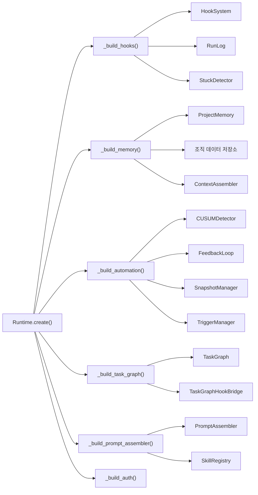
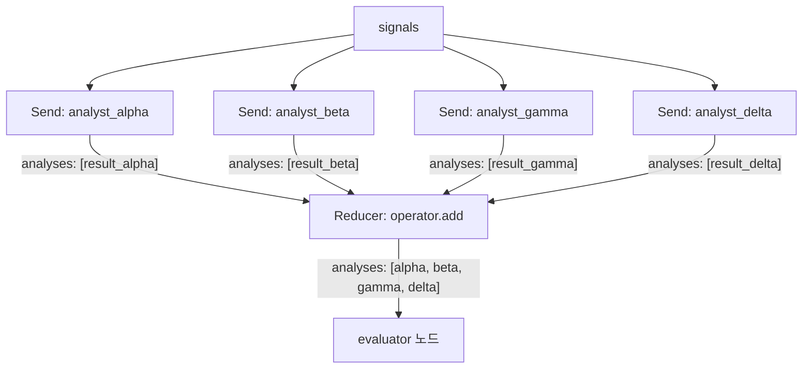
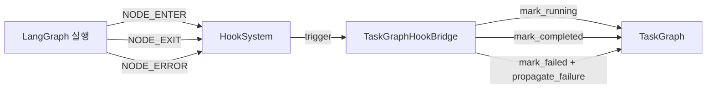
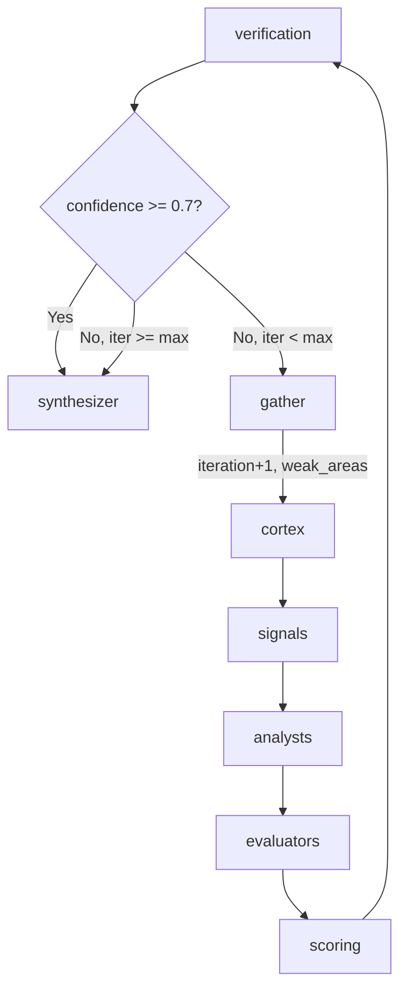
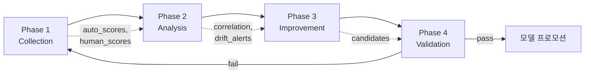
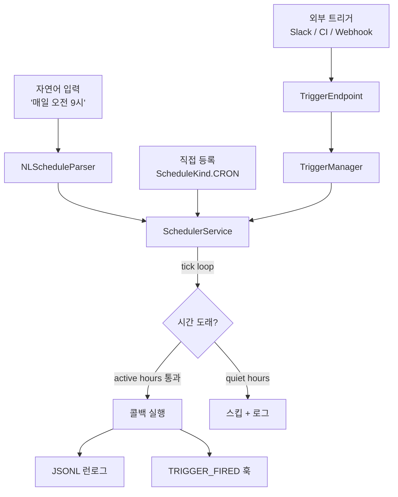
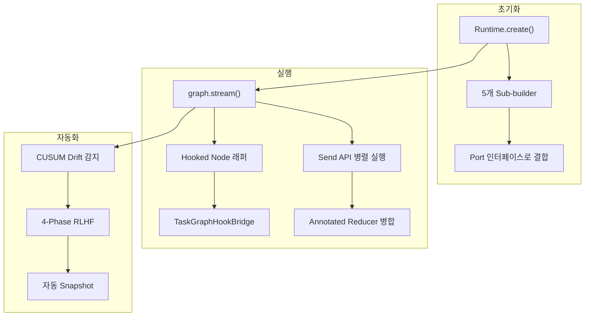

# 프로덕션 에이전트 런타임 아키텍처

LangGraph 에이전트를 프로토타입에서 프로덕션으로 올리는 순간, `graph.invoke()` 한 줄로는 부족해집니다. 20개 이상의 인프라 컴포넌트를 결정론적으로 조립하고, 실행 중 장애를 격리하며, 품질 드리프트를 자동으로 감지해야 합니다. 이 글에서는 실제 프로덕션 에이전트 시스템의 런타임 아키텍처를 코드와 함께 분석하겠습니다.

## 목차

1. [프로덕션 에이전트 런타임의 요구사항](#1-프로덕션-에이전트-런타임의-요구사항)
2. [Runtime Factory 패턴 — 20+ 컴포넌트 결정론적 조립](#2-runtime-factory-패턴----20-컴포넌트-결정론적-조립)
3. [graph.stream() vs graph.invoke() — 프로덕션 선택](#3-graphstream-vs-graphinvoke----프로덕션-선택)
4. [Send API 병렬 실행 심화 — Reducer 전략](#4-send-api-병렬-실행-심화----reducer-전략)
5. [Hooked Node 래퍼 패턴 — 18-Event Observer](#5-hooked-node-래퍼-패턴----18-event-observer)
6. [TaskGraphHookBridge — Observer over Controller](#6-taskgraphhookbridge----observer-over-controller)
7. [Feedback Loop — Confidence 기반 적응형 재시도](#7-feedback-loop----confidence-기반-적응형-재시도)
8. [L4.5 Automation: CUSUM Drift + 4-Phase RLHF + Scheduler](#8-l45-automation-cusum-drift--4-phase-rlhf)
9. [Degraded Response 패턴 — 장애 격리](#9-degraded-response-패턴----장애-격리)
10. [핵심 정리 + 체크리스트](#10-핵심-정리--체크리스트)

---

## 1. 프로덕션 에이전트 런타임의 요구사항

프로토타입 에이전트와 프로덕션 에이전트의 차이는 "노드 로직"이 아니라 **런타임 인프라**에 있습니다.

| 요구사항 | 프로토타입 | 프로덕션 |
|----------|-----------|---------|
| 초기화 | `graph = build().compile()` | 20+ 컴포넌트 결정론적 조립 |
| 실행 | `graph.invoke(state)` | `graph.stream()` + 실시간 진행률 |
| 병렬화 | 순차 실행 | Send API + Reducer 전략 |
| 관측성 | `print()` 디버깅 | 18-Event Hook Observer |
| 장애 대응 | 예외 → 크래시 | Degraded Response + 장애 격리 |
| 품질 관리 | 수동 검증 | CUSUM Drift + 4-Phase RLHF |

> **인사이트**: 프로덕션 에이전트의 코드 중 노드 로직은 30% 이하입니다. 나머지 70%는 런타임 인프라 -- 초기화, 관측, 장애 격리, 자동화 -- 에 해당합니다.

---

## 2. Runtime Factory 패턴 -- 20+ 컴포넌트 결정론적 조립

에이전트 런타임은 HookSystem, SessionStore, DriftDetector, FeedbackLoop 등 20개 이상의 컴포넌트로 구성됩니다. 이를 매번 수동으로 생성하면 초기화 순서 오류, 의존성 누락, 테스트 격리 실패가 발생합니다.

### Factory Method + Sub-builder 패턴

```python
class AgentRuntime:
    """프로덕션 런타임: 모든 인프라 컴포넌트를 결정론적으로 조립."""

    @classmethod
    def create(
        cls,
        entity_name: str,
        *,
        phase: str = "analysis",
        enable_checkpoint: bool = True,
        session_ttl: float = 3600.0,
    ) -> AgentRuntime:
        session_key = build_session_key(entity_name, phase)
        run_id = uuid.uuid4().hex[:12]

        # Sub-builder 1: Hook 시스템 (RunLog + StuckDetector 핸들러)
        hooks, run_log, stuck_detector = cls._build_hooks(
            session_key=session_key, run_id=run_id,
            log_dir=log_dir, stuck_timeout_s=stuck_timeout_s,
        )

        # Sub-builder 2: 세션 저장소
        session_store: SessionStorePort = InMemorySessionStore(ttl=session_ttl)

        # Sub-builder 3: LLM 어댑터 (Port/Adapter 패턴)
        llm_adapter: LLMClientPort = ClaudeAdapter()

        # Sub-builder 4: 프롬프트 어셈블러 (ADR-007)
        prompt_assembler = cls._build_prompt_assembler(hooks=hooks)

        # Sub-builder 5: L4.5 자동화 컴포넌트
        automation = cls._build_automation(
            hooks=hooks, session_key=session_key, entity_name=entity_name,
        )

        # Sub-builder 6: Task Graph (Observer 패턴)
        task_graph, task_bridge = cls._build_task_graph(
            hooks=hooks, entity_name=entity_name,
        )

        return cls(hooks=hooks, session_store=session_store, **automation)
```

핵심은 **Sub-builder 분리**입니다. `_build_hooks()`, `_build_memory()`, `_build_prompt_assembler()`, `_build_automation()`, `_build_task_graph()`, `_build_auth()` 총 6개의 Sub-builder가 각각 독립적으로 테스트 가능하며, 조립 순서가 코드에 명시적으로 드러납니다.



> **인사이트**: Factory 내부에서 각 Sub-builder가 반환하는 타입이 **Port 인터페이스**라는 점이 중요합니다. `HookSystemPort`, `SessionStorePort`, `LLMClientPort` 등 포트 타입으로 받기 때문에, 테스트 시 어떤 컴포넌트든 Mock으로 교체할 수 있습니다.

---

## 3. graph.stream() vs graph.invoke() -- 프로덕션 선택

LangGraph는 두 가지 실행 방식을 제공합니다.

| 특성 | `graph.invoke()` | `graph.stream()` |
|------|------------------|-------------------|
| 반환 | 최종 상태 1개 | 노드별 중간 상태 yield |
| 진행률 | 불가 | 노드 완료 시점마다 확인 가능 |
| 디버깅 | 최종 결과만 | 어느 노드에서 실패했는지 즉시 파악 |
| UI 통합 | 블로킹 대기 | Rich Progress Bar, 스트리밍 표시 가능 |
| 체크포인팅 | 전체 실행 후 1회 | 노드별 자동 체크포인트 |

프로덕션에서는 `graph.stream()`이 사실상 유일한 선택입니다.

```python
def compile_graph(
    *,
    checkpoint_db: str | None = None,
    hooks: HookSystemPort | None = None,
    confidence_threshold: float = 0.7,
    max_iterations: int = 5,
    memory_fallback: bool = False,
    enable_drift_scan: bool = False,
    interrupt_before: list[str] | None = None,
    bootstrap_mgr: BootstrapManager | None = None,
    prompt_assembler: PromptAssembler | None = None,
) -> CompiledStateGraph:
    graph = build_graph(
        hooks=hooks,
        confidence_threshold=confidence_threshold,
        bootstrap_mgr=bootstrap_mgr,
        prompt_assembler=prompt_assembler,
    )
    compile_kwargs: dict[str, Any] = {}

    if checkpoint_db is not None:
        conn = sqlite3.connect(str(checkpoint_db), check_same_thread=False)
        atexit.register(conn.close)
        compile_kwargs["checkpointer"] = SqliteSaver(conn)
    elif memory_fallback:
        compile_kwargs["checkpointer"] = MemorySaver()

    # Human-in-the-loop: 특정 노드 실행 전에 일시 정지
    if interrupt_before:
        compile_kwargs["interrupt_before"] = interrupt_before

    # CLI/UI에서는 .stream()으로 노드별 진행률 추적
    return graph.compile(**compile_kwargs)
```

`memory_fallback=True` 옵션은 SQLite 없이도 MemorySaver를 사용해 thread 기반 체크포인팅을 유지합니다. 이 덕분에 개발 환경에서는 DB 없이, 프로덕션에서는 SQLite로 동일한 코드가 동작합니다.

`interrupt_before` 파라미터는 **human-in-the-loop** 지원을 위한 확장 포인트입니다. 예를 들어 `interrupt_before=["verification"]`을 전달하면 검증 노드 실행 전에 파이프라인이 일시 정지되어, 사람이 중간 결과를 검토한 후 재개할 수 있습니다. LangGraph의 체크포인터와 결합하면 중단 시점의 전체 상태가 보존됩니다.

---

## 4. Send API 병렬 실행 심화 -- Reducer 전략

에이전트 시스템에서 4개의 분석 모듈이 병렬로 실행된 후 결과를 하나의 상태로 합쳐야 합니다. LangGraph의 Send API와 `Annotated` Reducer가 이 문제를 해결합니다.

### Clean Context: 앵커링 바이어스 방지

```python
def make_analyst_sends(state: AgentState) -> list[Send]:
    """4개 분석 모듈을 병렬 Send로 실행. Clean Context 적용."""
    sends = []
    for atype in ANALYST_TYPES:
        # Clean Context: analyses 필드를 비워서 다른 분석 결과를 보지 못하게 함
        send_state = {
            "entity_name": state["entity_name"],
            "entity_info": state["entity_info"],
            "data_store": state["data_store"],
            "signals": state["signals"],
            "dry_run": state.get("dry_run", False),
            "_analyst_type": atype,
            "analyses": [],   # 핵심: 빈 리스트로 시작
            "errors": [],
            # 프롬프트 조립 확장 (ADR-007)
            "_prompt_overrides": state.get("_prompt_overrides", {}),
            "_extra_instructions": state.get("_extra_instructions", []),
        }
        sends.append(Send("analyst", send_state))
    return sends
```

각 분석 모듈이 `analyses: []`를 받기 때문에 다른 모듈의 결과에 영향받지 않습니다. 이것이 **Clean Context 패턴**입니다.

### Reducer: operator.add vs _merge_dicts

```python
class AgentState(TypedDict, total=False):
    # 리스트 누적 (4개 분석 결과 → 하나의 리스트)
    analyses: Annotated[list[AnalysisResult], operator.add]

    # 딕셔너리 병합 (3개 평가 결과 → 하나의 딕셔너리)
    evaluations: Annotated[dict[str, EvaluatorResult], _merge_dicts]

    # 에러 누적
    errors: Annotated[list[str], operator.add]
```



| Reducer | 용도 | 병합 방식 |
|---------|------|----------|
| `operator.add` | 분석 결과 리스트 | `[a] + [b] + [c] + [d]` |
| `_merge_dicts` | 평가 결과 딕셔너리 | `{**a, **b, **c}` |

> **인사이트**: Send API에서 Reducer를 빠뜨리면 마지막 Send 결과만 살아남습니다. `Annotated[list, operator.add]`는 병렬 실행의 필수 인프라입니다. `asyncio.gather`나 `ThreadPoolExecutor`로도 병렬 실행은 가능하지만, Send API는 LangGraph 상태 관리(자동 체크포인팅, Reducer 병합, 상태 스냅샷)와 통합되므로 별도 동기화 로직이 필요 없습니다.

---

## 5. Hooked Node 래퍼 패턴 -- 18-Event Observer

모든 노드에 로깅, 메트릭, 에러 핸들링을 일일이 구현하면 코드가 폭발합니다. 대신 **Hooked Node 래퍼**가 모든 노드를 감싸 18개 이벤트를 자동으로 발생시킵니다.

### 18개 Hook Event

```python
class HookEvent(Enum):
    # 파이프라인 수준 (3)
    PIPELINE_START = "pipeline_start"
    PIPELINE_END = "pipeline_end"
    PIPELINE_ERROR = "pipeline_error"

    # 노드 수준 (4)
    NODE_BOOTSTRAP = "node_bootstrap"
    NODE_ENTER = "node_enter"
    NODE_EXIT = "node_exit"
    NODE_ERROR = "node_error"

    # 분석 수준 (3)
    ANALYST_COMPLETE = "analyst_complete"
    EVALUATOR_COMPLETE = "evaluator_complete"
    SCORING_COMPLETE = "scoring_complete"

    # 검증 수준 (2)
    VERIFICATION_PASS = "verification_pass"
    VERIFICATION_FAIL = "verification_fail"

    # 자동화 수준 (5)
    DRIFT_DETECTED = "drift_detected"
    OUTCOME_COLLECTED = "outcome_collected"
    MODEL_PROMOTED = "model_promoted"
    SNAPSHOT_CAPTURED = "snapshot_captured"
    TRIGGER_FIRED = "trigger_fired"

    # 프롬프트 조립 (1)
    PROMPT_ASSEMBLED = "prompt_assembled"
```

### 래퍼 구현

```python
def _make_hooked_node(
    node_fn: Callable[[AgentState], dict[str, Any]],
    node_name: str,
    hooks: HookSystemPort,
    bootstrap_mgr: BootstrapManager | None = None,
    prompt_assembler: PromptAssembler | None = None,
) -> Callable[[AgentState], dict[str, Any]]:
    """노드 함수를 Hook 트리거로 래핑. Bootstrap + PromptAssembler 확장 지원."""

    def _wrapped(state: AgentState) -> dict[str, Any]:
        entity_name = state.get("entity_name", "")
        hook_data = {"node": node_name, "entity_name": entity_name}

        # NODE_BOOTSTRAP: 실행 전 컨텍스트 준비 (직접 호출, 훅 이벤트 아님)
        if bootstrap_mgr is not None:
            ctx = bootstrap_mgr.prepare_node(node_name, entity_name, dict(state))
            if ctx.skip:
                return {}  # 부트스트랩이 노드 스킵을 결정
            state = bootstrap_mgr.apply_context(dict(state), ctx)

        # PromptAssembler 주입: 노드가 동적 프롬프트를 사용할 수 있게 함
        if prompt_assembler is not None:
            state["_prompt_assembler"] = prompt_assembler

        # NODE_ENTER
        hooks.trigger(HookEvent.NODE_ENTER, hook_data)

        start_time = time.time()
        try:
            result = node_fn(state)
            hook_data["duration_ms"] = (time.time() - start_time) * 1000
            # NODE_EXIT
            hooks.trigger(HookEvent.NODE_EXIT, hook_data)
            return result
        except Exception as exc:
            hook_data["error"] = str(exc)
            hooks.trigger(HookEvent.NODE_ERROR, hook_data)
            hooks.trigger(HookEvent.PIPELINE_ERROR, hook_data)
            raise

    return _wrapped
```

그래프 빌드 시 모든 노드에 적용합니다.

```python
# 간략화: 실제 build_graph는 confidence_threshold, max_iterations 등 추가 파라미터를 받음 (섹션 7 참조)
def build_graph(*, hooks: HookSystemPort | None = None) -> StateGraph:
    graph = StateGraph(AgentState)

    def _node(fn, name):
        return _make_hooked_node(fn, name, hooks) if hooks else fn

    graph.add_node("router", _node(router_node, "router"))
    graph.add_node("cortex", _node(cortex_node, "cortex"))
    graph.add_node("analyst", _node(analyst_node, "analyst"))
    # ... 나머지 노드 동일
```

위 코드는 핵심 패턴을 보여주는 단순화된 버전입니다. 프로덕션 래퍼는 추가로 다음을 수행합니다:

- **PIPELINE_START/END**: router 노드 진입 시 `PIPELINE_START`, synthesizer 완료 시 `PIPELINE_END` (메모리 write-back용 데이터 포함)
- **노드별 완료 이벤트**: `_NODE_COMPLETION_EVENTS` 매핑을 통해 `ANALYST_COMPLETE`, `EVALUATOR_COMPLETE`, `SCORING_COMPLETE` 자동 발행
- **VERIFICATION_PASS/FAIL**: guardrails + biasbuster 결과에 따른 검증 이벤트 분기
- **drift_scan_hint**: scoring 노드 완료 시 `final_score > 0`이면 드리프트 스캔 힌트 첨부
- **Send API 서브타입 전파**: `_analyst_type`, `_evaluator_type`을 hook_data에 포함하여 TaskGraphHookBridge가 태스크를 식별

이 패턴의 장점은 **노드 코드가 Hook을 전혀 인지하지 못한다**는 것입니다. 노드는 순수 함수로 유지되고, 관측성은 인프라 계층이 담당합니다.

---

## 6. TaskGraphHookBridge -- Observer over Controller

TaskGraph는 파이프라인 실행 진행률을 추적하는 DAG 자료구조입니다. 하지만 TaskGraph가 LangGraph 실행을 **제어하지 않습니다** -- 오직 **관찰만** 합니다.



### Node-to-Task 매핑

LangGraph 노드와 TaskGraph 태스크는 1:1이 아닙니다. Bridge가 이 매핑을 처리합니다.

```python
# 무시되는 노드 (태스크 없음)
_IGNORED_NODES = frozenset({"router", "gather"})

# 1:1 매핑
_SIMPLE_NODES = {"cortex": "cortex", "signals": "signals"}

# 1:N 매핑 (하나의 노드가 여러 태스크를 완료)
_MULTI_TASK_NODES = {
    "scoring": ["scoring", "causal_inference"],
    "verification": ["verification", "cross_check"],
    "synthesizer": ["synthesis", "report"],
}
```

Evaluator 노드는 특수 처리가 필요합니다. Send API로 3번 호출되므로, Bridge는 내부 카운터로 3번의 NODE_EXIT(또는 NODE_ERROR)를 추적한 후 태스크를 완료 처리합니다. 에러 발생 시에도 카운터가 증가하며, 에러 경로에서는 `propagate_failure`로 하위 태스크를 즉시 실패 처리합니다.

```python
def _on_node_exit(self, event: HookEvent, data: dict[str, Any]) -> None:
    node = data.get("node", "")

    if node == "evaluator":
        self._evaluator_done_count += 1
        if self._evaluator_done_count < _EVALUATOR_EXPECTED_COUNT:
            return  # 아직 3개 모두 완료되지 않음
        # 모두 완료 -> 태스크 완료
        tid = f"{self._prefix}_evaluators"
        task = self._graph.get_task(tid)
        if task and task.status == TaskStatus.RUNNING:
            self._graph.mark_completed(tid)
        return
```

이 설계의 핵심 원칙: **TaskGraph는 절대 LangGraph를 제어하지 않습니다.** 실행 흐름은 LangGraph가 소유하고, TaskGraph는 Hook 이벤트를 수동적으로 관찰하여 상태를 갱신합니다. 이 "Observer over Controller" 패턴 덕분에 TaskGraph를 제거해도 파이프라인 실행에 영향이 없습니다.

---

## 7. Feedback Loop -- Confidence 기반 적응형 재시도

단일 패스로 충분한 품질이 나오지 않을 때, 에이전트는 자동으로 루프백합니다. 핵심은 **confidence 기반 판단**입니다.

핵심은 `_should_continue`를 단순 함수가 아니라 **클로저(closure)**로 구현하는 것입니다. 그래프 빌드 시점에 `confidence_threshold`와 `max_iterations`를 주입하면, 전역 상태 없이 설정값을 캡처할 수 있습니다.

```python
def build_graph(
    *,
    hooks: HookSystemPort | None = None,
    confidence_threshold: float = 0.7,
    max_iterations: int = 5,
) -> StateGraph:
    graph = StateGraph(AgentState)
    # ... 노드 등록 ...

    # 클로저로 임계값 캡처 — 전역 상태 없는 설정 주입
    def _configured_should_continue(state: AgentState) -> str:
        # Guardrails 실패 시 경고 (demo 모드에서는 계속 진행)
        guardrails = state.get("guardrails")
        if guardrails and not guardrails.all_passed:
            log.warning("Guardrails failed — proceeding in demo mode")

        confidence = state.get("analyst_confidence", 0.0)
        iteration = state.get("iteration", 1)
        max_iter = state.get("max_iterations", max_iterations)

        # 0-100 스케일을 0-1로 정규화
        conf_normalized = confidence / 100.0 if confidence > 1.0 else confidence

        if conf_normalized >= confidence_threshold:
            return "synthesizer"  # 충분한 신뢰도 → 종합으로

        if iteration >= max_iter:
            return "synthesizer"  # 최대 반복 도달 → 강제 진행

        return "gather"  # 신뢰도 부족 → 재시도

    graph.add_conditional_edges(
        "verification",
        _configured_should_continue,
        {"synthesizer": "synthesizer", "gather": "gather"},
    )
```

`confidence_threshold`가 함수 인자가 아닌 클로저 변수라는 점이 핵심입니다. 테스트에서는 `build_graph(confidence_threshold=0.1)`로 쉽게 루프백을 유발할 수 있고, 프로덕션에서는 환경 설정에서 값을 주입합니다.

Gather 노드는 단순히 iteration을 증가시키는 것이 아니라, **약한 영역을 식별**하여 다음 반복에서 집중할 대상을 기록합니다.

```python
def _gather_node(state: AgentState) -> dict[str, Any]:
    iteration = state.get("iteration", 1)
    subscores = state.get("subscores", {})

    # 적응형 분석: 낮은 점수 영역 식별
    weak_areas = [k for k, v in subscores.items() if v < 50.0]

    history_entry = {
        "iteration": iteration,
        "confidence": state.get("analyst_confidence", 0.0),
        "weak_areas": weak_areas,
    }

    return {"iteration": iteration + 1, "iteration_history": [history_entry]}
```



> **인사이트**: `iteration_history`를 `Annotated[list, operator.add]` Reducer로 선언하면, 루프백할 때마다 이전 이력이 자동 누적됩니다. 노드가 반환하는 것은 항상 단일 원소 리스트 `[entry]`이고, Reducer가 합쳐줍니다.

---

## 8. L4.5 Automation: CUSUM Drift + 4-Phase RLHF

에이전트 출력 품질은 시간이 지나면 자연스럽게 저하됩니다. 모델 업데이트, 데이터 분포 변화, 프롬프트 노후화 등이 원인입니다. L4.5 자동화 계층은 이를 **자동으로 감지하고 교정**합니다.

### CUSUM Drift Detection

CUSUM(Cumulative Sum)은 순차 데이터에서 평균 변화를 감지하는 통계적 방법입니다(Page, 1954). EWMA(지수가중이동평균)나 Bayesian change-point detection 등의 대안이 있으나, CUSUM은 메모리 효율성(누적기 2개만 유지)과 임계값 해석 용이성에서 프로덕션 실시간 모니터링에 적합합니다.

```python
class CUSUMDetector:
    WARNING_THRESHOLD = 2.5
    CRITICAL_THRESHOLD = 4.0

    def detect(self, metric_name: str, value: float) -> DriftAlert:
        mean, std = self._baselines[metric_name]
        z = (value - mean) / std  # 정규화 편차

        # CUSUM 누적기 갱신 (slack k로 소폭 변동 무시)
        k = self._allowance_k
        self._cusum_pos[metric_name] = max(
            0.0, self._cusum_pos[metric_name] + z - k,
        )
        self._cusum_neg[metric_name] = max(
            0.0, self._cusum_neg[metric_name] - z - k,
        )
        cusum_score = max(self._cusum_pos[metric_name], self._cusum_neg[metric_name])

        if cusum_score >= self.CRITICAL_THRESHOLD:
            severity = DriftSeverity.CRITICAL
        elif cusum_score >= self.WARNING_THRESHOLD:
            severity = DriftSeverity.WARNING
        else:
            severity = DriftSeverity.NONE

        return DriftAlert(metric_name=metric_name, severity=severity, cusum_score=cusum_score)
```

Drift가 감지되면 Hook 체인이 자동으로 반응합니다.

```python
# 반응 체인: drift -> 자동 스냅샷 -> 재분석 트리거
hooks.register(HookEvent.DRIFT_DETECTED, _on_drift_snapshot, priority=80)
hooks.register(HookEvent.DRIFT_DETECTED, drift_trigger_handler, priority=70)
```

### 4-Phase RLHF Feedback Loop



| Phase | 역할 | 핵심 로직 |
|-------|------|----------|
| **Collection** | 자동 점수 + 사람 점수 수집 | 통계적 검정력 평가 (n >= 30 권장) |
| **Analysis** | 상관관계 + 드리프트 감지 | Spearman rho, CUSUM scan |
| **Improvement** | 개선 후보 제안 | 가중치 재조정, 베이스라인 재보정 |
| **Validation** | 개선 효과 검증 | 목표 메트릭 달성 여부 확인 |

```python
class FeedbackLoop:
    def run_cycle(self, cycle_input: FeedbackCycleInput) -> FeedbackCycleResult:
        collection = self.collect(cycle_input)      # Phase 1
        analysis = self.analyze(cycle_input)         # Phase 2
        candidates = self.propose_improvement(analysis)  # Phase 3
        validation = self.validate_and_deploy(candidates)  # Phase 4

        # 검증 통과 시 모델 프로모션
        if validation.get("all_passed") and self._model_registry:
            version_id = cycle_input.model_version_id
            self._model_registry.promote(version_id, PromotionStage.CANARY)

        return FeedbackCycleResult(success=validation.get("all_passed", False))
```

위 코드는 4-Phase 구조의 핵심 흐름입니다. 프로덕션 `run_cycle`은 추가로 개선 전후의 상관관계(correlation) 추적, `apply_improvement()`를 통한 실제 개선 적용, 모델 프로모션 전 `PromotionStage.STAGING` 확인 게이트, `DRIFT_DETECTED`/`OUTCOME_COLLECTED` 훅 이벤트 발행, 그리고 내부 통계 카운터 갱신을 수행합니다.

Collection 단계에서 **통계적 검정력(power) 게이트**가 작동합니다. 샘플 수가 10 미만이면 상관분석을 건너뛰고, 30 미만이면 경고를 발생시킵니다. 이는 Cohen(1988)의 검정력 분석에 근거합니다: Spearman rho=0.5를 alpha=0.05, power=0.80으로 감지하려면 n >= 29가 필요합니다.

### Advanced Scheduler — 3-Type Cron Service

CUSUM이 드리프트를 **감지**하고 RLHF가 품질을 **교정**한다면, 스케줄러는 이 모든 자동화를 **시간 축에서 구동**합니다. 분석 파이프라인을 수동으로만 실행하면 반복 모니터링이 불가능하기 때문입니다.



스케줄러는 3가지 스케줄 타입을 지원합니다.

| 타입 | 용도 | 예시 |
|------|------|------|
| **AT** | 1회성 절대 시각 | `2026-03-15T09:00` → 실행 후 자동 비활성화 |
| **EVERY** | 고정 주기 반복 | `every 30m` — 앵커 기반 드리프트 방지 |
| **CRON** | 크론 표현식 | `0 9 * * MON-FRI` — 평일 오전 9시 |

```python
class ScheduleKind(Enum):
    AT = "at"       # 1회성 절대 시각
    EVERY = "every"  # 고정 주기 (앵커 기반)
    CRON = "cron"    # 크론 표현식

class SchedulerService:
    def compute_next_run(self, job: ScheduledJob, now_ms: float | None = None) -> float | None:
        kind = job.schedule.kind
        if kind == ScheduleKind.AT:
            return job.schedule.at_ms if job.schedule.at_ms > now else None
        elif kind == ScheduleKind.EVERY:
            # 앵커 기반 정렬 — 재시작 시에도 주기 드리프트 방지
            anchor = job.schedule.anchor_ms or job.created_at_ms
            elapsed = now - anchor
            periods = int(elapsed / job.schedule.every_ms)
            return anchor + (periods + 1) * job.schedule.every_ms
        else:  # CRON
            return now + (60_000 - now % 60_000)  # 다음 분 경계
```

> **설계 선택**: EVERY 타입에서 단순 `last_run + interval` 대신 **앵커 기반 정렬**을 사용합니다. 서비스가 재시작되어도 원래 주기 격자에 맞춰 실행되므로, 장기 운영 시 밀리초 단위 누적 드리프트를 방지합니다.

**Active Hours (Quiet-Hours 게이트)**: 각 잡은 실행 가능 시간대를 지정할 수 있습니다. 자정 넘김(wrap-around)을 지원하며, IANA 타임존을 인식합니다.

```python
@dataclass
class ActiveHours:
    start: str = ""   # "HH:MM"
    end: str = ""     # "HH:MM"
    timezone: str = "" # IANA timezone (e.g., "Asia/Seoul")

def is_within_active_hours(self, active_hours: ActiveHours, now_ms: float | None = None) -> bool:
    start_min = _parse_hhmm(active_hours.start)
    end_min = _parse_hhmm(active_hours.end)
    current_min = _now_minutes(active_hours.timezone)
    if start_min <= end_min:
        return start_min <= current_min < end_min  # 일반 범위
    return current_min >= start_min or current_min < end_min  # 자정 넘김
```

**자연어 스케줄링**: `NLScheduleParser`는 LLM 호출 없이 룰 기반으로 자연어를 `ScheduledJob`으로 변환합니다. "매 5분마다", "daily at 9:00", "weekly on monday at 14:00" 등의 패턴을 인식하며, 타임존 약어 매핑(KST → Asia/Seoul)과 크론 표현식 자동 보정을 수행합니다.

**영속화와 관측성**: 잡 상태는 원자적 JSON 저장(tmp + rename 패턴)으로 영속화되고, 실행 이력은 per-job JSONL 런로그(자동 프루닝: 2,000줄 / 2MB)로 기록됩니다. 실행 시마다 `TRIGGER_FIRED` 훅 이벤트가 발행되어 기존 Hook 체인과 자연스럽게 연결됩니다.

---

## 9. Degraded Response 패턴 -- 장애 격리

LLM 호출이 스키마 검증에 실패하거나 API 에러가 발생했을 때, 전체 파이프라인을 중단하는 것은 최악의 선택입니다. **Degraded Response**는 품질이 낮더라도 파이프라인이 완주하도록 보장합니다.

```python
def _run_analyst(analyst_type: str, state: AgentState) -> AnalysisResult:
    system, user = _build_analyst_prompt(analyst_type, state)

    if state.get("dry_run"):
        return get_dry_run_result(analyst_type, state.get("entity_name", ""))

    data = get_llm_json()(system, user)
    try:
        return AnalysisResult(**data)
    except ValidationError as ve:
        # Degraded Response: 검증 실패해도 파이프라인은 계속 진행
        return AnalysisResult(
            analyst_type=analyst_type,
            score=1.0,
            key_finding="[DEGRADED] LLM response failed validation",
            reasoning="Schema validation failed -- degraded result",
            evidence=["validation_error"],
            confidence=0.0,
            is_degraded=True,
        )
```

Degraded Response의 세 가지 원칙은 다음과 같습니다:

1. **`is_degraded` 플래그**: 다운스트림 노드가 결과의 신뢰도를 파악할 수 있습니다
2. **최저 점수 주입**: `score=1.0`, `confidence=0.0`으로 최종 점수에 미치는 영향을 최소화합니다
3. **에러 누적**: `errors` 필드의 `operator.add` Reducer가 모든 에러를 수집합니다

Hook 시스템도 동일한 원칙을 적용합니다. 하나의 Hook 핸들러가 실패해도 나머지는 계속 실행됩니다.

```python
def trigger(self, event: HookEvent, data: dict[str, Any]) -> list[HookResult]:
    results = []
    for hook in self._hooks.get(event, []):
        try:
            hook.handler(event, data)
            results.append(HookResult(
                success=True, event=event, handler_name=hook.name,
            ))
        except Exception as exc:
            # 한 핸들러 실패가 다른 핸들러를 막지 않음
            log.warning("Hook '%s' failed: %s", hook.name, exc)
            results.append(HookResult(
                success=False, event=event, handler_name=hook.name,
                error=str(exc),
            ))
    return results
```

> **인사이트**: Degraded Response는 에이전트의 "graceful degradation"입니다. 하나의 분석 모듈이 실패해도 나머지 3개의 결과로 최종 평가를 생성합니다. `is_degraded` 플래그가 있기 때문에 최종 리포트에서 신뢰도 경고를 표시할 수 있습니다.

---

## 10. 핵심 정리 + 체크리스트

### 아키텍처 원칙 요약



### 프로덕션 체크리스트

- [ ] Runtime Factory가 모든 컴포넌트를 결정론적으로 조립하는가
- [ ] Sub-builder 각각을 독립적으로 단위 테스트할 수 있는가
- [ ] `graph.stream()`을 사용하여 노드별 진행률을 추적하는가
- [ ] Send API 사용 시 `Annotated[list, operator.add]` Reducer가 선언되어 있는가
- [ ] Clean Context로 병렬 분석 노드 간 앵커링 바이어스를 방지하는가
- [ ] 모든 노드가 Hooked Node 래퍼로 감싸져 있는가
- [ ] TaskGraph가 실행을 제어하지 않고 관찰만 하는가 (Observer over Controller)
- [ ] Confidence 기반 Feedback Loop에 max_iterations 안전장치가 있는가
- [ ] CUSUM Drift Detection 베이스라인이 설정되어 있는가
- [ ] RLHF Feedback Loop의 Collection 단계에서 통계적 검정력을 확인하는가
- [ ] LLM 호출 실패 시 Degraded Response가 반환되는가
- [ ] Hook 핸들러 실패가 다른 핸들러 실행을 차단하지 않는가
- [ ] `shutdown()` 메서드가 모든 백그라운드 컴포넌트를 정리하는가

---

*Source: `blog/posts/architecture/02-agent-runtime-architecture.md` | Category: [[blog-architecture]]*

## Related

- [[blog-architecture]]
- [[blog-hub]]
- [[geode]]
- [[geode-architecture]]
