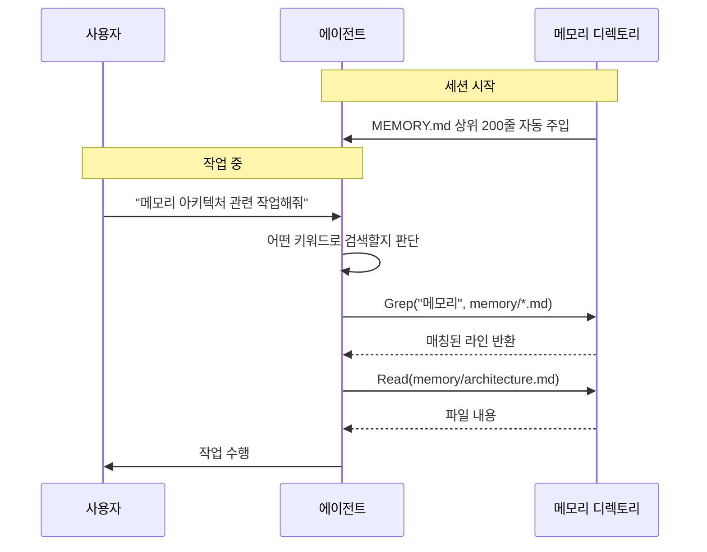
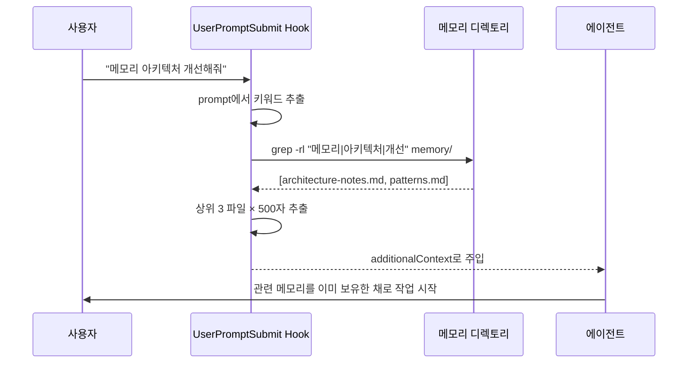
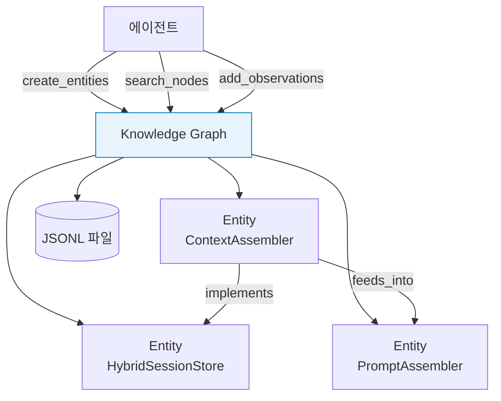
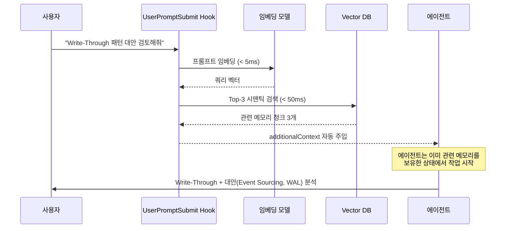
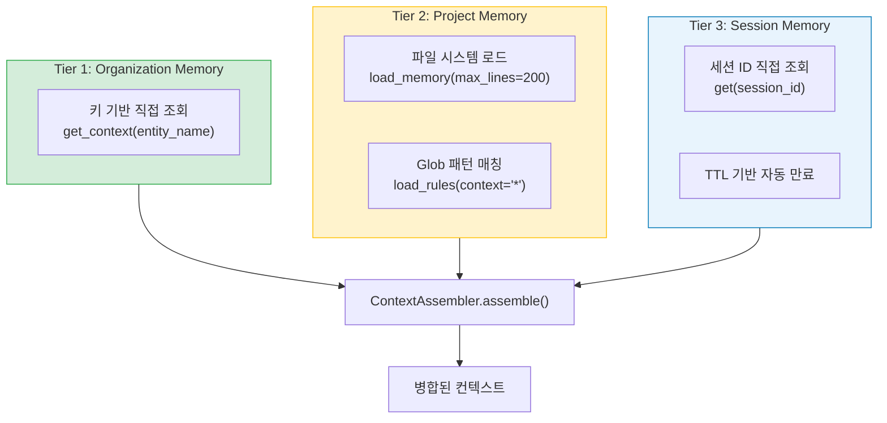
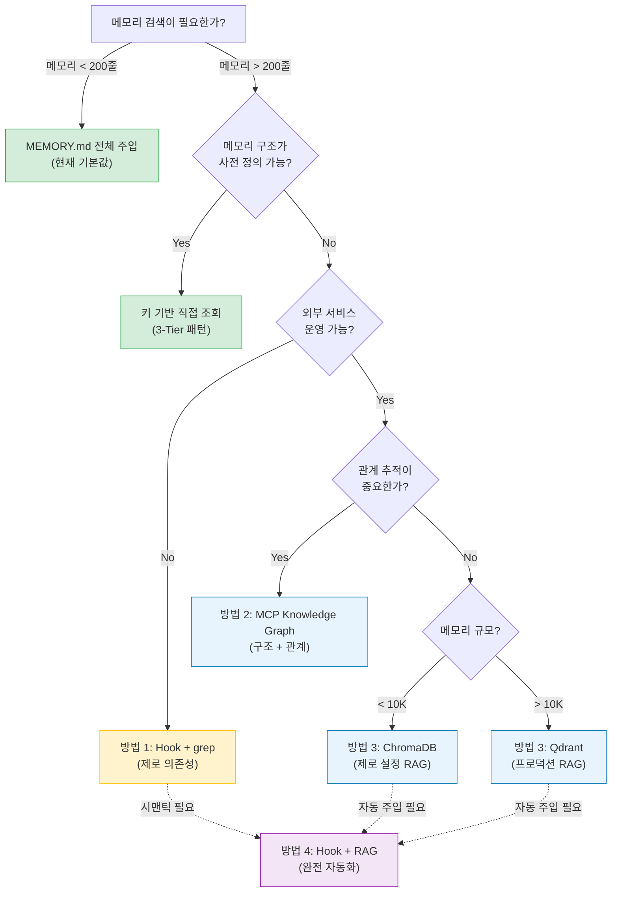

# 에이전트 메모리 검색 아키텍처

에이전트에게 메모리를 **저장**하는 것과 **적시에 꺼내 쓰는 것**은 완전히 다른 문제입니다. 1편에서 3-Tier 계층적 메모리 아키텍처를, 2편에서 프로덕션 런타임을 다뤘다면, 이번 글에서는 에이전트가 **자신의 메모리를 어떻게 검색하고 주입받는가**를 다룹니다. 키워드 매칭부터 지식 그래프, 벡터 RAG까지 — 각 방법의 트레이드오프를 코드와 함께 분석하겠습니다.

## 목차

1. [문제 정의: 왜 메모리 저장만으로는 부족한가](#1-문제-정의-왜-메모리-저장만으로는-부족한가)
2. [현재 상태: Keyword 기반 수동 검색](#2-현재-상태-keyword-기반-수동-검색)
3. [방법 1: Hook 기반 동적 메모리 주입](#3-방법-1-hook-기반-동적-메모리-주입)
4. [방법 2: MCP Knowledge Graph Memory](#4-방법-2-mcp-knowledge-graph-memory)
5. [방법 3: Vector DB MCP + Semantic RAG](#5-방법-3-vector-db-mcp--semantic-rag)
6. [방법 4: Hook + RAG 하이브리드](#6-방법-4-hook--rag-하이브리드)
7. [사례 연구: 3-Tier 메모리의 검색 패턴](#7-사례-연구-3-tier-메모리의-검색-패턴)
8. [검색 전략 선택 가이드](#8-검색-전략-선택-가이드)
9. [핵심 정리 + 체크리스트](#9-핵심-정리--체크리스트)

---

## 1. 문제 정의: 왜 메모리 저장만으로는 부족한가

에이전트의 메모리 시스템은 두 가지 독립적인 문제를 풀어야 합니다.


| 문제 | 설명 | 현재 상태 |
|------|------|----------|
| **저장** | 메모리를 구조화하여 영속적으로 보관 | 해결됨 (3-Tier, JSONL, Markdown) |
| **검색** | 현재 작업에 관련된 기억만 선택적으로 꺼냄 | 부분적 (키워드 수동 검색) |
| **주입** | 검색된 기억을 에이전트 컨텍스트에 자동 삽입 | 미해결 (수동 또는 고정 200줄) |

세 번째 문제가 가장 까다롭습니다. 에이전트가 **어떤 기억이 필요한지 미리 알 수 없는** 상황에서, 사용자의 요청만 보고 관련 메모리를 자동으로 찾아 주입해야 합니다.

> **핵심 통찰**: Anthropic은 Claude Code 초기에 RAG + 로컬 벡터 DB를 사용했으나, 에이전틱 검색(Agentic Search — 도구 호출 기반 Grep/Glob/Read 루프)이 더 높은 성능을 보여 이를 채택했습니다(Latent Space Podcast, 2025.05 — Boris Cherny, Anthropic). 이유는 신선도(stale index 없음), 단순성, 보안/프라이버시, 정확한 심볼 참조입니다. 다만 이 선택은 **코드 검색**에 최적화된 것이며, **축적된 메모리 검색**에는 다른 전략이 필요합니다.

---

## 2. 현재 상태: Keyword 기반 수동 검색

대부분의 에이전트 메모리 시스템은 다음과 같은 구조를 따릅니다.



### 구조적 한계

```text
# 현재 메모리 디렉토리 구조
memory/
├── MEMORY.md              # 200줄 하드캡 — 세션 시작 시 자동 주입
├── debugging.md           # 에이전트가 Grep으로 수동 검색해야 함
├── patterns.md            # 키워드를 미리 알아야 검색 가능
├── architecture-notes.md  # 의미적 유사성 매칭 불가
└── team-workflows.md      # 교차 참조 불가능
```

| 한계 | 설명 |
|------|------|
| **200줄 하드캡** | `MEMORY.md`의 첫 200줄만 세션 시작 시 자동 주입. 초과분은 무시됨 |
| **키워드 선행 지식 필요** | `Grep("메모리")`를 호출하려면 에이전트가 이미 "메모리"라는 키워드를 알아야 함 |
| **시맨틱 매칭 부재** | "컨텍스트 조립"을 검색해도 "메모리 병합"에 대한 내용은 찾지 못함 |
| **교차 프로젝트 불가** | 메모리가 프로젝트별로 격리되어 있어 공유 지식 그래프 구축 불가 |
| **신선도 모델 없음** | 메모리 엔트리에 TTL이나 타임스탬프 기반 무효화 없음 |

이 한계를 극복하는 네 가지 방법을 살펴보겠습니다.

---

## 3. 방법 1: Hook 기반 동적 메모리 주입

가장 단순하면서 외부 의존성이 없는 방법입니다. `UserPromptSubmit` 훅을 이용해 사용자 프롬프트가 제출될 때마다 관련 메모리를 자동으로 스캔하여 에이전트 컨텍스트에 주입합니다.

### 작동 원리



### 설정

```jsonc
// ~/.claude/settings.json
{
  "hooks": {
    "UserPromptSubmit": [
      {
        "hooks": [
          {
            "type": "command",
            "command": "python3 ~/.claude/scripts/memory_inject.py",
            "timeout": 5000
          }
        ]
      }
    ]
  }
}
```

### 구현

```python
#!/usr/bin/env python3
"""memory_inject.py — UserPromptSubmit hook for dynamic memory injection."""

import json
import os
import re
import subprocess
import sys

def main() -> None:
    input_data = json.load(sys.stdin)
    prompt = input_data.get("prompt", "")
    if not prompt or len(prompt) < 5:
        json.dump({}, sys.stdout)
        return

    memory_dir = os.path.expanduser(
        "~/.claude/projects/my-project/memory/"
    )
    if not os.path.isdir(memory_dir):
        json.dump({}, sys.stdout)
        return

    # 프롬프트에서 검색어 추출 (공백 분리 후 정규식 이스케이프)
    words = [re.escape(w) for w in prompt[:80].split()[:6]]
    keywords = "|".join(words)

    result = subprocess.run(
        ["grep", "-rl", "-i", "-E", keywords, memory_dir],
        capture_output=True, text=True, timeout=3,
    )
    matched = [f for f in result.stdout.strip().split("\n") if f][:3]

    context_parts: list[str] = []
    for filepath in matched:
        if os.path.isfile(filepath):
            with open(filepath) as fh:
                name = os.path.basename(filepath)
                content = fh.read()[:500]
                context_parts.append(f"## {name}\n{content}")

    if context_parts:
        output = {
            "hookSpecificOutput": {
                "hookEventName": "UserPromptSubmit",
                "additionalContext": "\n---\n".join(context_parts),
            }
        }
    else:
        output = {}

    json.dump(output, sys.stdout)

if __name__ == "__main__":
    main()
```

> **설계 선택**: `additionalContext` 필드를 사용하면 일반 stdout 출력과 달리 트랜스크립트에 명시적으로 노출되지 않고 에이전트 컨텍스트에 삽입됩니다. 이는 메모리 주입이 사용자의 작업 흐름을 방해하지 않게 합니다.

### 한계

| 항목 | 값 |
|------|-----|
| 검색 품질 | 키워드 매칭 (grep -i) |
| 지연 시간 | < 100ms (로컬 파일 시스템) |
| 시맨틱 매칭 | 불가 — "컨텍스트 조립" ≠ "메모리 병합" |
| 동기 실행 | 훅 완료까지 에이전트가 대기 |

---

## 4. 방법 2: MCP Knowledge Graph Memory

Anthropic 공식 MCP 레퍼런스 서버인 `@modelcontextprotocol/server-memory`는 **지식 그래프** 기반의 구조화된 메모리를 제공합니다.

### 아키텍처



### 설정

```jsonc
// ~/.claude/settings.json
{
  "mcpServers": {
    "memory": {
      "command": "npx",
      "args": ["-y", "@modelcontextprotocol/server-memory"],
      "env": {
        "MEMORY_FILE_PATH": "~/.claude/knowledge-graph.jsonl"
      }
    }
  }
}
```

### 제공 도구 (9개)

| 도구 | 파라미터 | 용도 |
|------|---------|------|
| `create_entities` | `entities[]` (name, type, observations) | 노드 생성 |
| `create_relations` | `relations[]` (from, to, relationType) | 방향 엣지 생성 |
| `add_observations` | `observations[]` (entityName, contents) | 기존 엔티티에 사실 추가 |
| `delete_entities` | `entityNames[]` | 노드 + 관련 엣지 삭제 |
| `delete_observations` | `deletions[]` | 특정 사실 삭제 |
| `delete_relations` | `relations[]` | 엣지 삭제 |
| `read_graph` | (없음) | 전체 그래프 반환 |
| `search_nodes` | `query` (string) | 이름/타입/관찰 텍스트 검색 |
| `open_nodes` | `names[]` | 특정 노드 + 상호 관계 조회 |

### 사용 예시

```python
# MCP 도구 호출 예시 (에이전트가 tool_use로 실행)
create_entities([
    {
        "name": "ContextAssembler",
        "entityType": "component",
        "observations": [
            "3-Tier 메모리를 병합하는 핵심 컴포넌트",
            "Organization → Project → Session 순서로 dict.update()",
            "freshness_threshold 기본값 3600초",
        ],
    }
])

create_relations([
    {
        "from": "ContextAssembler",
        "to": "PromptAssembler",
        "relationType": "feeds_memory_context_into",
    }
])

# 에이전트가 메모리를 검색하는 흐름
results = search_nodes("메모리 병합")  # 키워드 기반 검색
nodes = open_nodes(["ContextAssembler"])  # 직접 조회 + 관계 포함
```

### 트레이드오프

| 장점 | 한계 |
|------|------|
| 엔티티 간 **관계**를 표현 가능 | `search_nodes`는 **키워드 매칭**이며 시맨틱 검색 아님 |
| 구조화된 사실(observations) 관리 | 에이전트가 **명시적으로** MCP 도구를 호출해야 함 |
| JSONL 파일 영속화로 신뢰성 높음 | 자동 주입 메커니즘 없음 (Hook과 결합 필요) |
| 공식 레퍼런스 서버로 안정적 | 대규모 그래프에서 `read_graph` 성능 이슈 가능 |

> **언제 적합한가**: 메모리 간의 **관계**가 중요한 경우 — 예를 들어 "ContextAssembler가 PromptAssembler에 데이터를 공급한다"는 관계를 유지해야 할 때. 순수 텍스트 검색이면 overkill입니다.

---

## 5. 방법 3: Vector DB MCP + Semantic RAG

의미적 유사성 기반 검색이 필요하면 벡터 데이터베이스를 MCP 서버로 연결합니다.

### 아키텍처


### 옵션 A: Qdrant (프로덕션급)

```jsonc
// ~/.claude/settings.json
{
  "mcpServers": {
    "qdrant-memory": {
      "command": "uvx",
      "args": ["mcp-server-qdrant"],
      "env": {
        "QDRANT_URL": "http://localhost:6333",
        "COLLECTION_NAME": "agent-memory",
        "EMBEDDING_MODEL": "sentence-transformers/all-MiniLM-L6-v2"
      }
    }
  }
}
```

제공 도구:

| 도구 | 기능 |
|------|------|
| `qdrant-store` | 텍스트 → 자동 임베딩 → 벡터 저장 |
| `qdrant-find` | 쿼리 → 임베딩 → 코사인 유사도 검색 |

```bash
# 로컬 Qdrant 실행
docker run -d -p 6333:6333 -v qdrant_data:/qdrant/storage qdrant/qdrant:latest

# 또는 파일 기반 (서버 불필요)
# env: QDRANT_LOCAL_PATH=~/.claude/qdrant-data
```

### 옵션 B: ChromaDB (제로 설정)

```jsonc
// ~/.claude/settings.json
{
  "mcpServers": {
    "chroma-memory": {
      "command": "uvx",
      "args": [
        "chroma-mcp",
        "--client-type", "persistent",
        "--data-dir", "~/.claude/chroma-db"
      ]
    }
  }
}
```

ChromaDB MCP는 12개 도구를 제공합니다. `--client-type`을 생략하면 에페머럴(인메모리) 모드로 실행되어 별도 서버 없이 즉시 사용 가능하지만, 프로세스 종료 시 데이터가 사라집니다. `persistent` 모드는 `--data-dir`에 데이터를 영속합니다.

### 비교

| 항목 | Qdrant | ChromaDB |
|------|--------|----------|
| **설정 난이도** | Docker 또는 로컬 파일 | `uvx chroma-mcp` (제로 설정) |
| **임베딩 모델** | FastEmbed만 지원 | 8종 (default/fast, accurate, OpenAI, Cohere, HuggingFace, Jina, VoyageAI, Gemini) |
| **스케일** | 수백만 벡터, 프로덕션급 | 프로토타이핑 ~ 중규모 |
| **MCP 도구 수** | 2개 (store, find) | 12개 (컬렉션 CRUD + 문서 CRUD + 쿼리) |
| **로컬 모드** | `QDRANT_LOCAL_PATH` | 에페머럴 (인메모리) 또는 persistent |
| **검색 속도** | < 50ms (로컬, 소규모) | < 50ms (로컬, 소규모) |

> **설계 선택**: 메모리가 수천 개 이하라면 ChromaDB의 제로 설정이 유리합니다. 수만 개 이상이거나 프로덕션 서빙이 필요하면 Qdrant의 HNSW 인덱싱이 적합합니다. 영문 메모리는 `all-MiniLM-L6-v2` (384차원)가 속도/품질 균형점이며, **한국어 메모리**를 다루는 경우 `multilingual-e5-large` 또는 `paraphrase-multilingual-MiniLM-L12-v2`가 의미 매칭 정확도에서 우위입니다.

### 핵심: 시맨틱 매칭의 위력

```
키워드 검색: "컨텍스트 조립" → ❌ "메모리 병합" 찾지 못함
시맨틱 검색: "컨텍스트 조립" → ✅ "메모리 병합", "3-Tier 합산", "dict.update 순서" 모두 매칭
```

이것이 벡터 RAG의 핵심 가치입니다. 에이전트가 **정확한 키워드를 몰라도** 의미적으로 관련된 메모리를 찾을 수 있습니다.

---

## 6. 방법 4: Hook + RAG 하이브리드

가장 강력한 접근 — Hook의 자동 트리거와 Vector DB의 시맨틱 검색을 결합합니다.

### 아키텍처



### 구현

```python
#!/usr/bin/env python3
"""memory_rag_inject.py — Hook + RAG hybrid memory injection."""

import json
import os
import sys

import chromadb

def main() -> None:
    input_data = json.load(sys.stdin)
    prompt = input_data.get("prompt", "")
    if not prompt or len(prompt) < 10:
        json.dump({}, sys.stdout)
        return

    # ChromaDB 로컬 인스턴스 (persistent 모드)
    db_path = os.path.expanduser("~/.claude/chroma-db")
    client = chromadb.PersistentClient(path=db_path)

    try:
        collection = client.get_collection("agent-memory")
    except Exception:
        json.dump({}, sys.stdout)
        return

    # 시맨틱 검색 — 임베딩은 ChromaDB가 자동 생성
    results = collection.query(
        query_texts=[prompt[:200]],
        n_results=3,
    )

    if not results["documents"] or not results["documents"][0]:
        json.dump({}, sys.stdout)
        return

    # Top-3 결과를 additionalContext로 포맷
    chunks: list[str] = []
    for doc, meta in zip(
        results["documents"][0],
        results["metadatas"][0],
    ):
        source = meta.get("source", "unknown")
        chunks.append(f"[{source}] {doc[:400]}")

    output = {
        "hookSpecificOutput": {
            "hookEventName": "UserPromptSubmit",
            "additionalContext": "\n---\n".join(chunks),
        }
    }
    json.dump(output, sys.stdout)

if __name__ == "__main__":
    main()
```

### 레이턴시 예산

```
UserPromptSubmit Hook (동기 실행)
├── 프롬프트 파싱       ~1ms
├── 임베딩 생성         ~2-5ms  (all-MiniLM-L6-v2, 로컬)
├── 벡터 검색           ~10-50ms (ChromaDB/Qdrant 로컬)
├── 결과 포맷팅         ~1ms
└── JSON 출력           ~1ms
────────────────────────────────
총합                    ~15-60ms (사용자 체감 없음)
```

> **성능 주의사항**: `UserPromptSubmit` 훅은 **동기 실행**입니다. 훅이 완료될 때까지 에이전트가 대기합니다. `async: true` 옵션을 사용하면 비동기로 전환할 수 있으나, 주입된 컨텍스트가 현재 턴이 아닌 **다음 턴**에 도착합니다. 메모리 주입은 현재 턴에 필요하므로 동기 실행이 적합하며, 60ms 이내로 유지하는 것이 핵심입니다.

### 하이브리드 검색: BM25 + 시맨틱

단순 벡터 검색보다 **하이브리드 검색**이 더 정확합니다. 키워드 정확성(BM25)과 의미적 유사성(벡터)을 결합합니다.

```python
# Reciprocal Rank Fusion (RRF) — 두 랭킹을 하나로 합산
def reciprocal_rank_fusion(
    bm25_ranks: list[str],
    vector_ranks: list[str],
    k: int = 60,
    alpha: float = 0.3,  # 0.0 = BM25만, 1.0 = 벡터만
) -> list[tuple[str, float]]:
    """BM25와 벡터 검색 결과를 RRF로 합산합니다.

    k는 순위 간 영향력 차이를 조절하는 하이퍼파라미터입니다.
    k가 작으면(예: 1) 상위 순위 차이가 극대화되고,
    k가 크면(예: 200) 순위 간 차이가 완화됩니다. 60은 표준 기본값입니다.
    """
    scores: dict[str, float] = {}
    for rank, doc_id in enumerate(bm25_ranks):
        scores[doc_id] = scores.get(doc_id, 0.0) + (1 - alpha) / (k + rank)
    for rank, doc_id in enumerate(vector_ranks):
        scores[doc_id] = scores.get(doc_id, 0.0) + alpha / (k + rank)
    return sorted(scores.items(), key=lambda x: x[1], reverse=True)
```

| alpha | 동작 | 적합한 경우 |
|-------|------|------------|
| 0.0 | BM25만 (키워드 정확 매칭) | 함수명, 클래스명 등 정확한 심볼 검색 |
| 0.3 | BM25 우세 + 시맨틱 보조 | 일반적인 메모리 검색 (권장 기본값) |
| 0.7 | 시맨틱 우세 + 키워드 보조 | 개념적 유사성이 중요한 검색 |
| 1.0 | 벡터만 (순수 시맨틱) | 키워드를 전혀 모르는 탐색적 검색 |

---

## 7. 사례 연구: 3-Tier 메모리의 검색 패턴

1편에서 다룬 3-Tier 메모리 아키텍처는 **검색 문제를 구조적으로 회피**하는 접근입니다.

### 계층별 검색 전략



```python
import time
from typing import Any

class ContextAssembler:
    """3-Tier 메모리 병합 (간략화 — 전체 구현은 1편 참조)."""

    def assemble(self, session_id: str, entity_name: str) -> dict[str, Any]:
        context: dict[str, Any] = {}

        # Tier 1: 키 기반 직접 조회 (검색 불필요)
        if self._org_memory:
            org_ctx = self._org_memory.get_context(entity_name)
            if org_ctx:
                context.update(org_ctx)

        # Tier 2: 파일 시스템 로드 (검색 불필요)
        if self._project_memory:
            proj_ctx = self._project_memory.get_context_for_entity(entity_name)
            if proj_ctx:
                for key, value in proj_ctx.items():
                    if value:
                        context[key] = value

        # Tier 3: 세션 ID 직접 조회 (검색 불필요)
        if self._session_store:
            session_data = self._session_store.get(session_id)
            if session_data:
                context.update(session_data)

        # 신선도 타임스탬프 기록
        self._last_assembly_time = time.time()
        context["_llm_summary"] = self._build_llm_summary(context)
        return context
```

> **핵심 통찰**: 3-Tier 아키텍처에서는 각 계층이 **키 기반 직접 조회**(entity_name, session_id)를 사용하므로 시맨틱 검색이 불필요합니다. 이는 메모리 구조를 설계 시점에 결정할 수 있는 **폐쇄형 시스템**에서 유효한 전략입니다. 반면 개발 도구처럼 사용자의 질문을 예측할 수 없는 **개방형 시스템**에서는 시맨틱 검색이 필요합니다.

### 두 접근의 근본적 차이

| 특성 | 구조적 직접 조회 (3-Tier) | 시맨틱 검색 (RAG) |
|------|--------------------------|-------------------|
| **검색 키** | entity_name, session_id (사전 정의) | 자연어 쿼리 (동적) |
| **정확도** | 100% (키가 일치하면 반드시 반환) | 확률적 (유사도 임계값 의존) |
| **적용 조건** | 메모리 구조를 설계 시점에 확정 가능 | 메모리 구조가 동적이거나 예측 불가 |
| **대표 사례** | 파이프라인 에이전트, 도메인 특화 시스템 | 개발 도구, 범용 어시스턴트 |
| **레이턴시** | O(1) 해시맵 조회 | O(log n) 벡터 검색 |

---

## 8. 검색 전략 선택 가이드



### 종합 비교

| 방법 | 검색 품질 | 설정 난이도 | 자동 주입 | 외부 의존성 | 레이턴시 |
|------|----------|------------|----------|------------|---------|
| 현재 (수동 Grep) | 키워드 | 없음 | 수동 | 없음 | 즉시 |
| **1. Hook + grep** | 키워드 | 낮음 | 자동 | 없음 | < 100ms |
| **2. MCP Knowledge Graph** | 구조적 | 낮음 | 반자동 | npx | < 200ms |
| **3. Vector DB MCP** | 시맨틱 | 중간 | 반자동 | DB 서버 | < 100ms |
| **4. Hook + RAG** | 시맨틱 | 높음 | 완전 자동 | DB + 임베딩 | < 60ms |
| 3-Tier 직접 조회 | 100% 정확 | 높음 (설계 필요) | 자동 | 없음 | < 1ms |

> **실무 권장 경로**: 대부분의 프로젝트는 **방법 1 (Hook + grep)**으로 시작하여 메모리가 늘어나면 **방법 3 (ChromaDB)**으로 전환하고, 완전 자동화가 필요하면 **방법 4 (Hook + RAG)**로 진화하는 경로가 자연스럽습니다. 도메인 특화 에이전트라면 처음부터 **3-Tier 직접 조회**를 설계하는 것이 가장 효율적입니다.

---

## 9. 핵심 정리 + 체크리스트

### 메모리 검색 스펙트럼

```
정확도 높음 ←──────────────────────────────→ 유연성 높음

  키 기반       키워드       지식 그래프     시맨틱 RAG
  직접 조회     grep 매칭    엔티티+관계     벡터 유사도
  O(1)         O(n)         O(V+E)¹        O(log n)
  │             │             │               │
  3-Tier       Hook+grep    MCP Memory     Hook+ChromaDB

¹ V=노드 수, E=엣지 수
```

### 체크리스트

- [ ] **메모리 크기 확인**: 200줄 이하면 MEMORY.md 기본값으로 충분
- [ ] **검색 패턴 결정**: 키 기반 (폐쇄형) vs 시맨틱 (개방형)
- [ ] **Hook 설정**: `UserPromptSubmit` 훅으로 동적 주입 파이프라인 구축
- [ ] **레이턴시 예산**: 동기 훅은 60ms 이내, 임베딩 모델은 로컬 실행 권장
- [ ] **하이브리드 검색**: BM25 + 벡터의 RRF 합산으로 키워드/시맨틱 균형
- [ ] **MEMORY.md는 인덱스로**: 200줄 안에 토픽 파일 링크만 유지, 상세 내용은 토픽 파일로 분리
- [ ] **신선도 관리**: TTL 또는 타임스탬프 기반 메모리 무효화 적용
- [ ] **점진적 진화**: grep → ChromaDB → Hook+RAG 순서로 필요에 따라 확장

---

*Source: `blog/posts/memory-context/06-agent-memory-retrieval.md` | Category: [[blog-memory-context]]*

## Related

- [[blog-memory-context]]
- [[blog-hub]]
- [[geode]]
- [[geode-memory-system]]
