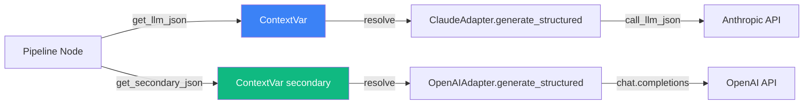

# Hexagonal Architecture로 LLM 통합하기 — Port/Adapter 패턴 실전 적용

> Date: 2026-03-09 | Author: geode-team | Tags: hexagonal-architecture, port-adapter, LLM, clean-architecture, dependency-injection

## 목차

1. 도입: LLM 통합의 딜레마
2. Port 설계 — Protocol 기반 추상화
3. Adapter 구현 — Claude와 OpenAI
4. ContextVar 기반 의존성 주입
5. Runtime Wiring — 조립의 순간
6. Circuit Breaker와 Failover
7. 마무리

---

## 1. 도입: LLM 통합의 딜레마

AI Agent 시스템을 구축할 때 가장 빈번하게 마주치는 문제는 LLM Provider 종속성입니다. Anthropic Claude를 사용하다가 OpenAI GPT로 전환해야 하거나, Cross-LLM 검증을 위해 두 모델을 동시에 호출해야 하는 상황이 실전에서 반복적으로 발생합니다.

GEODE는 Hexagonal Architecture(헥사고날 아키텍처)의 Port/Adapter 패턴을 적용하여 이 문제를 해결합니다. 비즈니스 로직(Pipeline Node)은 LLM Provider를 전혀 알지 못한 채 동작하고, 런타임에 어댑터를 교체하는 것만으로 모델을 전환할 수 있습니다.

## 2. Port 설계 — Protocol 기반 추상화

### 2.1 핵심 Port: LLMClientPort

Port(포트)는 애플리케이션이 외부 세계와 소통하는 인터페이스 계약입니다. GEODE에서는 Python의 `Protocol`(PEP 544)을 사용하여 구조적 타이핑을 적용합니다.

```python
# geode/infrastructure/ports/llm_port.py
from typing import Any, Callable, Iterator, Protocol, runtime_checkable

@runtime_checkable
class LLMClientPort(Protocol):
    """LLM 클라이언트 어댑터를 위한 Protocol.

    Implementations: ClaudeAdapter, OpenAIAdapter, MockAdapter.
    """

    @property
    def model_name(self) -> str: ...

    def generate(
        self, system: str, user: str, *,
        model: str | None = None,
        max_tokens: int = 4096,
        temperature: float = 0.3,
    ) -> str: ...

    def generate_structured(
        self, system: str, user: str, *,
        model: str | None = None,
        max_tokens: int = 4096,
        temperature: float = 0.3,
    ) -> dict[str, Any]: ...

    def generate_parsed(
        self, system: str, user: str, *,
        output_model: type[T],
        model: str | None = None,
        max_tokens: int = 4096,
        temperature: float = 0.3,
    ) -> T: ...

    def generate_stream(
        self, system: str, user: str, *,
        model: str | None = None,
        max_tokens: int = 4096,
        temperature: float = 0.3,
    ) -> Iterator[str]: ...

    def generate_with_tools(
        self, system: str, user: str, *,
        tools: list[dict[str, Any]],
        tool_executor: Callable[..., dict[str, Any]],
        model: str | None = None,
        max_tokens: int = 4096,
        temperature: float = 0.3,
        max_tool_rounds: int = 5,
    ) -> Any: ...
```

> `@runtime_checkable`을 사용하면 `isinstance(adapter, LLMClientPort)`로 런타임 검증이 가능합니다. ABC 상속 없이도 구조적 타이핑으로 계약을 강제하는 것이 핵심 설계 결정입니다.

### 2.2 경량 Callable Protocol — 노드 레벨 DI

전체 Port를 주입하면 노드가 불필요한 메서드에 의존하게 됩니다. GEODE는 노드별로 필요한 최소한의 인터페이스만 주입하기 위해 경량 Callable Protocol을 분리합니다.

```python
# geode/infrastructure/ports/llm_port.py
class LLMJsonCallable(Protocol):
    def __call__(
        self, system: str, user: str, *,
        model: str | None = ...,
        max_tokens: int = ...,
        temperature: float = ...,
    ) -> dict[str, Any]: ...

class LLMTextCallable(Protocol):
    def __call__(
        self, system: str, user: str, *,
        model: str | None = ...,
        max_tokens: int = ...,
        temperature: float = ...,
    ) -> str: ...

class LLMParsedCallable(Protocol):
    def __call__(
        self, system: str, user: str, *,
        output_model: type[T],
        model: str | None = ...,
        max_tokens: int = ...,
        temperature: float = ...,
    ) -> T: ...

class LLMToolCallable(Protocol):
    def __call__(
        self, system: str, user: str, *,
        tools: list[dict[str, Any]],
        tool_executor: Callable[..., dict[str, Any]],
        model: str | None = ...,
        max_tokens: int = ...,
        temperature: float = ...,
        max_tool_rounds: int = ...,
    ) -> Any: ...
```

> Interface Segregation Principle(ISP)의 적용입니다. Analyst 노드는 `LLMJsonCallable`만, Synthesizer 노드는 `LLMTextCallable`만 필요합니다. 전체 `LLMClientPort`를 주입하지 않음으로써 각 노드의 의존성 범위를 최소화합니다.

## 3. Adapter 구현 — Claude와 OpenAI

### 3.1 ClaudeAdapter: Facade 패턴

```python
# geode/infrastructure/adapters/llm/claude_adapter.py
from core.llm.client import (
    call_llm, call_llm_json, call_llm_parsed,
    call_llm_streaming, call_llm_with_tools,
)

class ClaudeAdapter:
    """Anthropic Claude 어댑터. LLMClientPort를 구현합니다."""

    @property
    def model_name(self) -> str:
        return settings.model

    def generate(self, system: str, user: str, **kwargs: Any) -> str:
        return call_llm(system, user, **kwargs)

    def generate_structured(self, system: str, user: str, **kwargs: Any) -> dict[str, Any]:
        return call_llm_json(system, user, **kwargs)

    def generate_parsed(self, system: str, user: str, **kwargs: Any) -> T:
        return call_llm_parsed(system, user, **kwargs)

    def generate_stream(self, system: str, user: str, **kwargs: Any) -> Iterator[str]:
        return call_llm_streaming(system, user, **kwargs)

    def generate_with_tools(self, system: str, user: str, **kwargs: Any) -> Any:
        return call_llm_with_tools(system, user, **kwargs)
```

> Adapter-as-Facade 패턴입니다. 기존에 검증된 `geode.llm.client` 함수들을 Port 인터페이스로 감싸기만 합니다. 재구현 없이 1-2줄로 위임하므로 버그 유입 가능성이 최소화됩니다.

### 3.2 OpenAIAdapter: Native 구현

```python
# geode/infrastructure/adapters/llm/openai_adapter.py
class OpenAIAdapter:
    """OpenAI GPT 어댑터. LLMClientPort를 구현합니다."""

    def __init__(self, default_model: str = DEFAULT_OPENAI_MODEL) -> None:
        self._default_model = default_model

    def generate(self, system: str, user: str, *,
                 model: str | None = None, max_tokens: int = 4096,
                 temperature: float = 0.3) -> str:
        client = _get_openai_client()
        target = model or self._default_model

        def _do_call(*, model: str) -> str:
            response = client.chat.completions.create(
                model=model,
                max_completion_tokens=max_tokens,
                temperature=temperature,
                messages=[
                    {"role": "system", "content": system},
                    {"role": "user", "content": user},
                ],
                timeout=90.0,
            )
            return response.choices[0].message.content or ""

        return self._retry_with_backoff(_do_call, model=target)

    def generate_parsed(self, system: str, user: str, *,
                        output_model: type[T], **kwargs: Any) -> T:
        client = _get_openai_client()
        response = client.beta.chat.completions.parse(
            model=kwargs.get("model") or self._default_model,
            messages=[
                {"role": "system", "content": system},
                {"role": "user", "content": user},
            ],
            response_format=output_model,
        )
        return response.choices[0].message.parsed
```

> OpenAI Adapter는 자체 retry + circuit breaker를 내장합니다. `generate_parsed`에서 OpenAI의 `beta.chat.completions.parse()`를 활용하여 Pydantic 모델로 직접 파싱하는 점이 Claude Adapter와의 핵심 차이입니다.

### 3.3 Adapter 비교

| 항목 | ClaudeAdapter | OpenAIAdapter |
|---|---|---|
| 구현 방식 | Facade (기존 함수 위임) | Native (직접 SDK 호출) |
| Structured Output | JSON 파싱 + 재시도 | `response_format` 활용 |
| Circuit Breaker | 공유 (client.py 레벨) | 독립 인스턴스 |
| Prompt Caching | `cache_control=ephemeral` | 미지원 |
| Fallback Models | Sonnet → Haiku 체인 | GPT-4o → GPT-4o-mini |

## 4. ContextVar 기반 의존성 주입

GEODE는 전통적인 DI 컨테이너 대신 Python의 `contextvars`를 활용합니다. 이는 LangGraph의 비동기 실행 환경에서 스레드 안전성을 보장하는 핵심 메커니즘입니다.

```python
# geode/infrastructure/ports/llm_port.py
from contextvars import ContextVar

_llm_json_ctx: ContextVar[LLMJsonCallable | None] = ContextVar("llm_json", default=None)
_llm_text_ctx: ContextVar[LLMTextCallable | None] = ContextVar("llm_text", default=None)
_llm_parsed_ctx: ContextVar[LLMParsedCallable | None] = ContextVar("llm_parsed", default=None)
_llm_tool_ctx: ContextVar[LLMToolCallable | None] = ContextVar("llm_tool", default=None)

# Cross-LLM 검증용 Secondary Adapter
_secondary_llm_json_ctx: ContextVar[LLMJsonCallable | None] = ContextVar(
    "secondary_llm_json", default=None
)

def set_llm_callable(
    json_fn: LLMJsonCallable,
    text_fn: LLMTextCallable,
    parsed_fn: LLMParsedCallable | None = None,
    tool_fn: LLMToolCallable | None = None,
    secondary_json_fn: LLMJsonCallable | None = None,
    secondary_parsed_fn: LLMParsedCallable | None = None,
) -> None:
    """LLM callable 주입. GeodeRuntime.create()에서 호출됩니다."""
    _llm_json_ctx.set(json_fn)
    _llm_text_ctx.set(text_fn)
    if parsed_fn is not None:
        _llm_parsed_ctx.set(parsed_fn)
    if tool_fn is not None:
        _llm_tool_ctx.set(tool_fn)
    _secondary_llm_json_ctx.set(secondary_json_fn)

def get_llm_json() -> LLMJsonCallable:
    """주입된 JSON callable 반환. 미주입 시 RuntimeError."""
    fn = _llm_json_ctx.get()
    if fn is None:
        raise RuntimeError(
            "LLM JSON callable not injected. "
            "Call set_llm_callable() first (done by GeodeRuntime.create())."
        )
    return fn
```

> `ContextVar`를 선택한 이유는 세 가지입니다. (1) 스레드 격리 — 각 스레드가 독립적인 LLM callable을 가집니다. (2) asyncio 호환 — `ContextVar`는 태스크 간 자동으로 복사됩니다. (3) Zero-dependency — 별도 DI 프레임워크 없이 표준 라이브러리만 사용합니다.



> 노드는 `get_llm_json()`만 호출합니다. 어떤 Provider의 메서드가 반환되는지는 Runtime이 결정하며, 노드 코드에는 `anthropic`이나 `openai`라는 임포트가 존재하지 않습니다.

## 5. Runtime Wiring — 조립의 순간

모든 Port와 Adapter가 만나는 지점은 `GeodeRuntime.create()` 팩토리 메서드입니다.

```python
# geode/runtime.py
@classmethod
def create(cls, ip_name: str, *, phase: str = "analysis", ...) -> GeodeRuntime:
    # 1. Adapter 생성
    llm_adapter: LLMClientPort = ClaudeAdapter()
    secondary_adapter: LLMClientPort | None = None
    if settings.openai_api_key:
        secondary_adapter = OpenAIAdapter()

    # 2. Tool Executor 바인딩
    tool_fn = _make_tool_executor(llm_adapter, tool_registry, policy_chain)

    # 3. ContextVar 주입
    set_llm_callable(
        llm_adapter.generate_structured,
        llm_adapter.generate,
        parsed_fn=llm_adapter.generate_parsed,
        tool_fn=tool_fn,
        secondary_json_fn=(
            secondary_adapter.generate_structured if secondary_adapter else None
        ),
        secondary_parsed_fn=(
            secondary_adapter.generate_parsed if secondary_adapter else None
        ),
    )

    return cls(llm_adapter=llm_adapter, secondary_adapter=secondary_adapter, ...)
```

> Composition Root 패턴입니다. 애플리케이션의 모든 의존성이 한 지점에서 조립됩니다. `settings.openai_api_key`가 존재하면 자동으로 Cross-LLM 모드가 활성화되고, 없으면 Claude 단독 모드로 동작합니다. 설정 변경만으로 동작을 전환할 수 있습니다.

### Tool Executor 바인딩

```python
# geode/runtime.py
def _make_tool_executor(
    llm_adapter: LLMClientPort,
    registry: ToolRegistryPort,
    policy_chain: PolicyChainPort,
) -> LLMToolCallable:

    def _default_tool_executor(name: str, **kwargs: Any) -> dict[str, Any]:
        return registry.execute(name, policy=policy_chain, **kwargs)

    def _tool_fn(system: str, user: str, *, tools: list[dict[str, Any]],
                 tool_executor: Any = None, **kwargs: Any) -> Any:
        executor = tool_executor or _default_tool_executor
        return llm_adapter.generate_with_tools(
            system, user, tools=tools, tool_executor=executor, **kwargs,
        )

    return _tool_fn
```

> Tool Executor는 Registry와 PolicyChain을 Adapter에 바인딩하는 클로저입니다. 이를 통해 Tool 실행 시 정책 검증(PolicyChain)과 도구 조회(Registry)가 자동으로 적용됩니다.

## 6. Circuit Breaker와 Failover

각 Adapter는 독립적인 Circuit Breaker와 Failover 전략을 갖습니다.

```python
# geode/llm/client.py
class CircuitBreaker:
    def __init__(self, failure_threshold: int = 5, recovery_timeout: float = 60.0) -> None:
        self._failures = 0
        self._threshold = failure_threshold
        self._recovery_timeout = recovery_timeout
        self._state: str = "closed"  # closed → open → half-open

    def can_execute(self) -> bool:
        if self._state == "closed":
            return True
        if self._state == "open":
            if time.time() - self._last_failure > self._recovery_timeout:
                self._state = "half-open"
                return True
            return False
        return True  # half-open: 1회 시도 허용

    def record_success(self) -> None:
        self._failures = 0
        self._state = "closed"

    def record_failure(self) -> None:
        self._failures += 1
        self._last_failure = time.time()
        if self._failures >= self._threshold:
            self._state = "open"
```

**4단계 Failover 전략:**

```
Stage 1: 동일 모델 재시도 (exponential backoff: 1s → 2s → 4s)
Stage 2: Fallback 모델 전환 (Claude Sonnet → Haiku, GPT-4o → GPT-4o-mini)
Stage 3: Circuit Breaker Open (60초간 호출 차단)
Stage 4: Half-Open 복구 시도 (1회 성공 시 closed)
```

| 단계 | 트리거 | 동작 | 지연 |
|---|---|---|---|
| Retry | Transient Error | 동일 모델 재시도 | 1s → 2s → 4s |
| Fallback | 3회 실패 | 다음 모델로 전환 | 즉시 |
| Open | 5회 연속 실패 | 전체 호출 차단 | 60초 대기 |
| Half-Open | 60초 경과 | 1회 프로브 시도 | 즉시 |

## 7. 마무리

### 핵심 정리

| 항목 | 값/설명 |
|---|---|
| Port 정의 | `@runtime_checkable Protocol` (PEP 544) |
| Callable 분리 | `LLMJsonCallable`, `LLMTextCallable`, `LLMParsedCallable`, `LLMToolCallable` |
| DI 메커니즘 | `ContextVar` (스레드 안전, asyncio 호환) |
| Adapter 패턴 | Claude=Facade, OpenAI=Native |
| Failover | 4단계 (Retry → Fallback → Circuit Break → Half-Open) |
| Wiring 지점 | `GeodeRuntime.create()` (Composition Root) |

### 체크리스트

- [ ] `LLMClientPort` Protocol로 5개 메서드 추상화 완료
- [ ] Callable Protocol로 노드별 최소 의존성 설계
- [ ] `ContextVar` 기반 스레드 안전한 DI 구현
- [ ] Claude/OpenAI 어댑터 각각 독립 Circuit Breaker 적용
- [ ] `GeodeRuntime.create()`에서 Composition Root 패턴으로 조립
- [ ] Cross-LLM 검증을 위한 Secondary Adapter 주입 경로 확보

---

*Source: `blog/posts/architecture/07-hexagonal-architecture-llm-port-adapter.md` | Category: [[blog-architecture]]*

## Related

- [[blog-architecture]]
- [[blog-hub]]
- [[geode]]
- [[geode-architecture]]
- [[geode-llm-models]]
