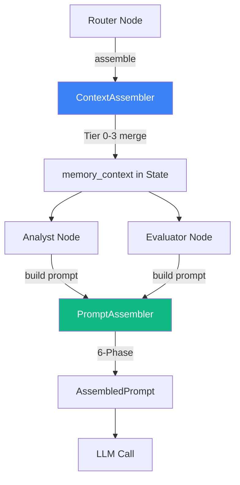

# 4-Tier Memory Architecture와 Context Assembly — AI Agent의 기억 체계 설계

> Date: 2026-03-09 | Author: geode-team | Tags: memory-architecture, context-assembly, prompt-engineering, LangGraph, CQRS

## 목차

1. 도입: Agent에게 기억이 필요한 이유
2. 4-Tier Memory 계층 구조
3. Session Store — TTL과 Hybrid L1/L2
4. Context Assembly — 3-Tier 병합의 중심
5. Prompt Assembly — 6-Phase Pipeline
6. Pipeline 통합 흐름
7. 마무리

---

## 1. 도입: Agent에게 기억이 필요한 이유

AI Agent 파이프라인에서 가장 까다로운 문제 중 하나는 컨텍스트 관리입니다. 조직의 미션, 프로젝트 규칙, IP 고유 데이터, 그리고 현재 세션의 분석 결과가 모두 하나의 LLM 프롬프트 안에 적절히 조합되어야 합니다.

GEODE는 이 문제를 4-Tier Memory 계층으로 해결합니다. 각 Tier는 독립적인 저장소와 생명주기를 가지며, ContextAssembler가 런타임에 이를 병합하여 일관된 컨텍스트를 생성합니다.

## 2. 4-Tier Memory 계층 구조

```
Tier 0 (Identity)      SOUL.md — 조직 미션/원칙 (불변)
  ↓ override
Tier 1 (Organization)  Fixture 기반 IP 데이터 (공유, 캐시)
  ↓ override
Tier 2 (Project)       MEMORY.md + Rules (영속, 200줄 제한)
  ↓ override
Tier 3 (Session)       InMemorySessionStore (휘발, TTL)
```

> 낮은 Tier가 높은 Tier를 override합니다. Session 데이터가 Organization 데이터보다 우선하므로, 특정 분석 실행에서 고정 데이터를 일시적으로 덮어쓸 수 있습니다.

### 2.1 Tier 0 — Identity (SOUL.md)

```python
# geode/memory/organization.py
class MonoLakeOrganizationMemory:
    def get_soul(self) -> str:
        """SOUL.md 로드 — 조직 미션 (캐시, 실패 시 빈 문자열)."""
        if self._soul_cache is not None:
            return self._soul_cache
        soul_path = self._soul_path or Path("SOUL.md")
        if soul_path.exists():
            self._soul_cache = soul_path.read_text(encoding="utf-8")
        else:
            self._soul_cache = ""
        return self._soul_cache
```

> SOUL.md는 한 번 로드되면 캐시됩니다. Agent가 모든 분석에서 일관된 미션을 유지하도록 보장하는 불변 계층입니다.

### 2.2 Tier 1 — Organization (Fixtures)

```python
# geode/memory/organization.py
class MonoLakeOrganizationMemory:
    def get_ip_context(self, ip_name: str) -> dict[str, Any]:
        """IP별 fixture 데이터 반환 (ip_info, monolake, signals, psm_covariates)."""
        return self._cache.get(ip_name.lower(), {})

    def get_common_rubric(self) -> dict[str, Any]:
        """조직 공통 평가 기준 (14-axis, 1-5 scale)."""
        return {
            "axes_count": 14,
            "scale": "1-5",
            "confidence_threshold": 0.7,
            "tier_mapping": {"S": [80, 100], "A": [60, 80], "B": [40, 60], "C": [0, 40]},
        }
```

> 조직 수준의 공유 데이터입니다. 모든 분석이 동일한 IP fixture와 평가 기준을 사용하도록 보장합니다.

### 2.3 Tier 2 — Project (MEMORY.md + Rules)

```python
# geode/memory/project.py
class ProjectMemory:
    def load_memory(self, max_lines: int = 200) -> str:
        """MEMORY.md 로드 (최대 200줄 — 컨텍스트 윈도우 효율)."""
        lines = content.split("\n")[:max_lines]
        return "\n".join(lines)

    def load_rules(self, context: str = "*") -> list[dict[str, Any]]:
        """YAML frontmatter 기반 규칙 매칭.

        ---
        name: anime-ip-rules
        paths:
          - "**/*anime*"
          - "*cowboy*"
        ---
        """
        matched: list[dict[str, Any]] = []
        for rule_file in sorted(self._rules_dir.glob("*.md")):
            fm_match = _FRONTMATTER_RE.match(raw)
            paths = _extract_paths(fm_match.group(1))
            if context == "*" or _matches_any_pattern(context, paths):
                matched.append({"name": name, "paths": paths, "content": body})
        return matched

    def add_insight(self, insight: str) -> bool:
        """인사이트 추가 — 중복 제거, 최신 우선, 최대 50건 회전."""
```

> MEMORY.md는 200줄로 제한하여 컨텍스트 윈도우를 보호합니다. Rules는 YAML frontmatter의 glob 패턴으로 IP별 맞춤 규칙을 매칭합니다.

### 2.4 Tier 3 — Session (In-Memory + TTL)

```python
# geode/memory/session.py
@dataclass
class SessionEntry:
    data: dict[str, Any]
    created_at: float = field(default_factory=time.time)

class InMemorySessionStore:
    def __init__(self, ttl: float = 3600.0) -> None:
        self._store: dict[str, SessionEntry] = {}
        self._ttl: float = ttl

    def get(self, session_id: str) -> dict[str, Any] | None:
        """세션 데이터 반환. 만료 시 자동 제거 (lazy eviction)."""
        entry = self._store.get(session_id)
        if entry is None:
            return None
        if time.time() - entry.created_at > self._ttl:
            del self._store[session_id]
            return None
        return entry.data
```

> TTL 기반 자동 만료로 메모리 누수를 방지합니다. 읽기 시점에 만료를 확인하는 Lazy Eviction 전략으로 별도 GC 스레드 없이 동작합니다.

## 3. Session Store — TTL과 Hybrid L1/L2

프로덕션 환경에서는 In-Memory Store만으로 부족합니다. GEODE는 2-Tier Hybrid Store로 확장 경로를 제공합니다.

```python
# geode/memory/hybrid_session.py
class HybridSessionStore:
    """L1 (fast, in-memory) → L2 (durable, file-based) 2-tier store."""

    def __init__(self, l1: SessionStorePort, l2: SessionStorePort) -> None:
        self._l1 = l1
        self._l2 = l2

    def get(self, session_id: str) -> dict[str, Any] | None:
        """L1 hit → 반환. L1 miss → L2 조회 → L1 backfill."""
        data = self._l1.get(session_id)
        if data is not None:
            return data
        data = self._l2.get(session_id)
        if data is not None:
            self._l1.set(session_id, data)  # Backfill
        return data

    def set(self, session_id: str, data: dict[str, Any]) -> None:
        """Write-Through: 양쪽 동시 기록."""
        self._l1.set(session_id, data)
        self._l2.set(session_id, data)
```

> Read: L1 → L2 fallback with backfill. Write: Write-through (양쪽 동시). L1을 Redis로, L2를 PostgreSQL로 교체해도 인터페이스가 동일합니다.

### Hierarchical Session Key

```python
# geode/memory/session_key.py
def build_session_key(ip_name: str, phase: str, sub_context: str | None = None) -> str:
    """ip:{name}:{phase}[:{sub_context}] 형식의 계층적 키 생성.

    Examples:
        ip:berserk:analysis
        ip:cowboy_bebop:evaluation:quality_judge
    """
    normalized = _normalize_name(ip_name)
    key = f"ip:{normalized}:{phase}"
    if sub_context:
        key += f":{_normalize_name(sub_context)}"
    return key
```

> 계층적 키 구조로 체크포인트 필터링이 가능합니다. `ip:berserk:evaluation:*`로 특정 IP의 모든 Evaluator 체크포인트를 조회할 수 있으며, 이는 Anchoring Bias 방지를 위한 Clean Context 분리에 핵심적입니다.

## 4. Context Assembly — 3-Tier 병합의 중심

ContextAssembler는 모든 Tier를 하나의 딕셔너리로 병합합니다.

```python
# geode/memory/context.py
class ContextAssembler:
    def assemble(self, session_id: str, ip_name: str) -> dict[str, Any]:
        """4-Tier 병합: Identity → Organization → Project → Session."""
        context: dict[str, Any] = {}

        # Tier 0: SOUL.md
        soul = self._org_memory.get_soul()
        if soul:
            context["_soul"] = soul

        # Tier 1: Organization fixtures (base)
        org_ctx = self._org_memory.get_ip_context(ip_name)
        context.update(org_ctx)

        # Tier 2: Project memory + rules (override)
        proj_ctx = self._project_memory.get_context_for_ip(ip_name)
        for key, value in proj_ctx.items():
            if value:  # 비어있지 않은 경우만 override
                context[key] = value

        # Tier 3: Session data (override)
        session_data = self._session_store.get(session_id)
        if session_data:
            context.update(session_data)

        # LLM 요약 생성 (ADR-007)
        context["_llm_summary"] = self._build_llm_summary(context)
        return context
```

> 각 Tier는 독립적으로 실패할 수 있으며, 실패한 Tier는 건너뜁니다 (Graceful Degradation). `_llm_summary`는 PromptAssembler가 파싱 없이 직접 읽을 수 있는 사전 포맷된 문자열입니다.

### CQRS 패턴

```python
# geode/memory/context.py
class ContextAssembler:
    def assemble(self, session_id: str, ip_name: str) -> dict[str, Any]:
        """순수 조회 (Query) — 상태를 변경하지 않습니다."""
        ...

    def mark_assembled(self, assembled_at: float | None = None) -> None:
        """명시적 명령 (Command) — freshness 타임스탬프 기록."""
        self._last_assembly_time = assembled_at or time.time()

    def is_data_fresh(self, max_age_s: float | None = None) -> bool:
        """데이터 신선도 확인 — assemble()만으로는 fresh가 아닙니다."""
        threshold = max_age_s or self._freshness_threshold
        return (time.time() - self._last_assembly_time) < threshold
```

> `assemble()`은 순수 조회입니다. `mark_assembled()`를 명시적으로 호출해야 fresh로 표시됩니다. 이 CQRS 분리로 테스트에서 조회와 상태 변경을 독립적으로 검증할 수 있습니다.

## 5. Prompt Assembly — 6-Phase Pipeline

ContextAssembler가 생성한 컨텍스트는 PromptAssembler의 6-Phase Pipeline을 거쳐 최종 프롬프트가 됩니다.

```python
# geode/llm/prompt_assembler.py
class PromptAssembler:
    def assemble(self, *, base_system: str, base_user: str,
                 state: dict[str, Any], node: str, role_type: str) -> AssembledPrompt:
        """6-Phase 프롬프트 조립 파이프라인."""

        # Phase 1: Prompt Override (BootstrapManager)
        # Phase 2: Skill Fragment Injection (registry lookup)
        # Phase 3: Memory Context Injection (state["memory_context"])
        # Phase 4: Extra Instructions (bootstrap)
        # Phase 5: Token Budget Enforcement (4000 warning, 6000 hard limit)
        # Phase 6: Hash + Observability (SHA-256, hook emit)

        return AssembledPrompt(
            system=system,
            user=user,
            assembled_hash=assembled_hash,
            fragment_count=len(fragments_used),
            total_chars=len(system) + len(user),
        )
```

**Phase별 상세:**

| Phase | 입력 | 동작 | 제한 |
|---|---|---|---|
| 1. Override | `_prompt_overrides` | Append 또는 Full Replace | append-only (기본) |
| 2. Skills | SkillRegistry | node+role 매칭, 우선순위 정렬 | 최대 3개, 500자/skill |
| 3. Memory | `memory_context._llm_summary` | 사전 포맷된 문자열 삽입 | 최대 300자 |
| 4. Bootstrap | `_extra_instructions` | 추가 지시사항 주입 | 최대 5개, 100자/지시 |
| 5. Budget | 전체 시스템 프롬프트 | 경고/강제 트림 | 4000자 경고, 6000자 한도 |
| 6. Hash | system + user | SHA-256 해시 + 메타데이터 | hook으로 관찰 |

> 토큰 예산을 Phase별로 강제하여 컨텍스트 윈도우 오버플로우를 방지합니다. SHA-256 해시로 프롬프트 내용을 노출하지 않으면서 관찰 가능성을 확보합니다.

## 6. Pipeline 통합 흐름

### Router → ContextAssembler → State → PromptAssembler → LLM

```python
# geode/nodes/router.py
def router_node(state: GeodeState) -> dict[str, Any]:
    # 1. Fixture 데이터 로드
    fixture = load_fixture(ip_name)

    # 2. Session ID 생성
    session_id = f"entity:{normalized}:{uuid.uuid4().hex[:8]}"

    # 3. ContextAssembler로 4-Tier 병합
    assembler = _context_assembler_ctx.get()
    memory_context = assembler.assemble(session_id, ip_name)
    assembler.mark_assembled()

    return {"memory_context": memory_context, "session_id": session_id, ...}
```

```python
# geode/nodes/analysts.py (소비 측)
def _build_analyst_prompt(analyst_type: str, state: GeodeState) -> tuple[str, str]:
    assembler = state.get("_prompt_assembler")
    result = assembler.assemble(
        base_system=ANALYST_SYSTEM.format(analyst_type=analyst_type),
        base_user=ANALYST_USER.format(...),
        state=dict(state),
        node="analyst",
        role_type=analyst_type,
    )
    return result.system, result.user
```



> Router에서 한 번 조립된 memory_context가 State를 통해 모든 하위 노드로 전파됩니다. 각 노드는 PromptAssembler를 통해 자신의 역할에 맞는 최종 프롬프트를 생성합니다.

## 7. 마무리

### 핵심 정리

| 항목 | 값/설명 |
|---|---|
| Memory Tier | 4단계 (Identity → Organization → Project → Session) |
| Override 순서 | Session > Project > Organization > Identity |
| Session TTL | 3600초 (기본), Lazy Eviction |
| Hybrid Store | L1 (In-Memory) → L2 (File), Write-Through |
| Session Key | `ip:{name}:{phase}[:{sub_context}]` |
| Context Assembly | CQRS (assemble=Query, mark_assembled=Command) |
| Prompt Assembly | 6-Phase (Override → Skills → Memory → Bootstrap → Budget → Hash) |
| Token Budget | Skill 500자/3개, Memory 300자, 전체 6000자 한도 |

### 체크리스트

- [ ] SOUL.md로 조직 미션 불변 계층 구성
- [ ] Fixture 기반 Organization Memory 캐시 구현
- [ ] MEMORY.md 200줄 제한으로 컨텍스트 윈도우 보호
- [ ] Rules의 YAML frontmatter glob 패턴 매칭 적용
- [ ] TTL + Lazy Eviction Session Store 구현
- [ ] HybridSessionStore L1→L2 Write-Through 패턴 적용
- [ ] ContextAssembler CQRS 분리 (Query/Command)
- [ ] PromptAssembler 6-Phase 토큰 예산 강제 적용
- [ ] SHA-256 해시로 관찰 가능성 확보 (내용 비노출)

---

*Source: `blog/posts/memory-context/09-four-tier-memory-architecture-context-assembly.md` | Category: [[blog-memory-context]]*

## Related

- [[blog-memory-context]]
- [[blog-hub]]
- [[geode]]
- [[geode-architecture]]
- [[geode-memory-system]]
