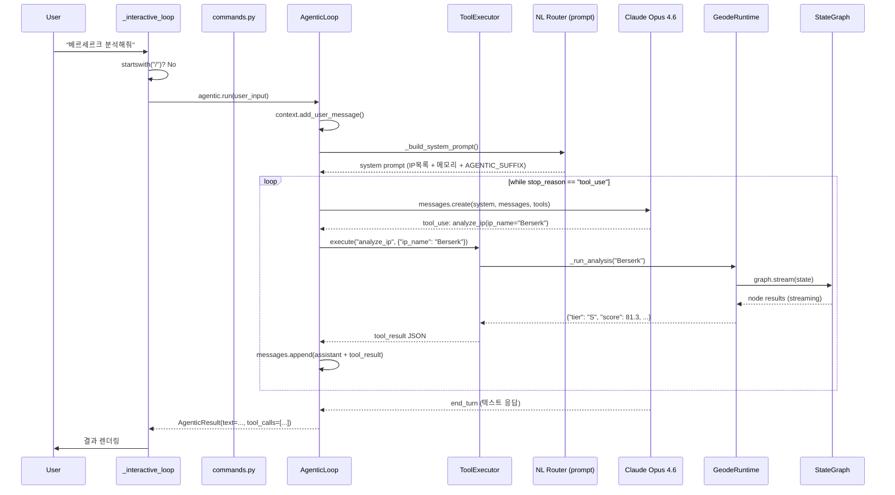

# Plan-and-Execute x NL Router x Agentic Loop — 자율 실행 에이전트의 의사결정 구조

> Date: 2026-03-12 | Author: geode-team | Tags: [plan-and-execute, nl-router, agentic-loop, tool-use, harness]

## 목차

1. [도입 — 왜 Plan-and-Execute인가](#1-도입--왜-plan-and-execute인가)
2. [NL Router의 진화 — 단발성에서 자율 실행으로](#2-nl-router의-진화--단발성에서-자율-실행으로)
3. [Plan-and-Execute vs ReAct — 아키텍처 선택](#3-plan-and-execute-vs-react--아키텍처-선택)
4. [NL Router — 자연어에서 도구 호출로](#4-nl-router--자연어에서-도구-호출로)
5. [Agentic Loop — while(tool_use) 자율 실행](#5-agentic-loop--whiletool_use-자율-실행)
6. [Plan Mode — 계획 수립과 승인](#6-plan-mode--계획-수립과-승인)
7. [통합 흐름 — 사용자 입력에서 파이프라인 실행까지](#7-통합-흐름--사용자-입력에서-파이프라인-실행까지)
8. [설계 원천 (Design Origin)](#8-설계-원천-design-origin)
9. [마무리](#9-마무리)

---

## 1. 도입 — 왜 Plan-and-Execute인가

IP 평가 파이프라인은 본질적으로 결정론적입니다. router에서 시작하여 signals, analysts x4, evaluators x3, scoring, verification, synthesizer를 거치는 고정 토폴로지 DAG입니다. 각 노드의 실행 순서, 입력/출력 스키마, 분기 조건이 코드로 확정되어 있습니다.

그러나 사용자는 결정론적이지 않습니다. "베르세르크 분석해줘"라는 단순한 요청부터 "베르세르크 분석하고 카우보이 비밥이랑 비교해줘"라는 복합 요청, "아까 그거 다시 해줘"라는 대명사 참조까지 다양한 의도를 자연어로 표현합니다.

GEODE는 이 문제를 두 층의 의사결정 구조로 해결합니다.

```
+---------------------------+     +---------------------------+
|  L3: Pipeline DAG         |     |  L4: Agentic Orchestration|
|  (결정론적 실행)            |     |  (자율적 의사결정)         |
|                           |     |                           |
|  StateGraph               |     |  AgenticLoop              |
|  ├─ router                |     |  ├─ NL Router (의도 해석)  |
|  ├─ signals               |     |  ├─ ToolExecutor (실행)    |
|  ├─ analyst x4 (Send)     |     |  ├─ PlanMode (계획/승인)   |
|  ├─ evaluator x3 (Send)   |     |  └─ SubAgent (병렬 위임)   |
|  ├─ scoring               |     |                           |
|  ├─ verification          |     |  while stop_reason ==     |
|  └─ synthesizer           |     |       "tool_use":         |
|                           |     |    execute → feed back    |
|  고정 토폴로지 + 피드백루프  |     |    → continue             |
+---------------------------+     +---------------------------+
```

L3 파이프라인은 "어떤 순서로 분석할 것인가"를 결정하고, L4 에이전트는 "사용자가 원하는 것이 무엇인가"를 결정합니다. 자율성(L4)과 결정론(L3)의 분리가 핵심 설계 원칙입니다.

---

## 2. NL Router의 진화 — 단발성에서 자율 실행으로

### 2.1 v0.8.0의 한계

이전 포스트 [NL Router -- LLM 자율 Tool Use 기반 자연어 라우팅](nl-router-llm-autonomous-tool-use.md)에서 소개한 v0.8.0의 NLRouter는 `classify()` 단발성 호출 구조였습니다.

```python
# v0.8.0: 단발성 classify → dispatch
router = NLRouter()
intent = router.classify("베르세르크 분석해줘")
# → NLIntent(action="analyze", args={"ip_name": "Berserk"})
dispatch(intent)  # 1회 실행 후 종료
```

이 구조에는 네 가지 한계가 있었습니다.

| 한계 | 증상 |
|------|------|
| 단발성 실행 | "분석하고 비교해줘" 처리 불가 — 첫 번째 의도만 포착 |
| 자기수정 불가 | 도구 실행 실패 시 재시도나 대안 모색 불가 |
| 컨텍스트 단절 | 이전 대화 참조 불가 — "아까 그거" 해석 불가 |
| 결과 미활용 | 도구 실행 결과를 다음 판단에 반영하지 못함 |

본질적으로, NLRouter는 "의도를 1회 해석하는 분류기"였지 "의도를 실행하는 에이전트"가 아니었습니다.

### 2.2 OpenClaw: Binding Router + Attempt Loop

OpenClaw 코드베이스에서 발견한 해법은 두 계층 라우팅이었습니다.

```
Gateway (제어 플레인)
  └─ Binding Router: 정적 매핑 규칙 → 1 메시지 → 1 에이전트

Agent Runtime (실행 플레인)
  └─ Attempt Loop: LLM 호출 + 도구 실행 사이클
     └─ Sub-agent Pool: Spawn + Announce 병렬 실행
```

Binding Router는 채널, 계정, 피어를 조합한 정적 규칙으로 메시지를 에이전트에 매핑합니다. 결정론적이고 예측 가능하지만, 자연어 의도 해석은 지원하지 않습니다. "분석해줘"와 "analyze" 사이의 매핑은 사전에 config로 정의해야 합니다.

Attempt Loop는 LLM이 도구 호출을 멈출 때까지 반복하는 구조입니다. 자기수정과 멀티스텝이 가능하지만, Binding Router의 결정론적 라우팅에 묶여 있어 NL 입력에 대한 유연한 의도 해석은 어렵습니다.

### 2.3 Claude Code: while(tool_use) 완전 자율

Claude Code의 접근은 더 급진적입니다.

```
User Input → LLM (tools + context) → while stop_reason == "tool_use":
    execute_tool(tool_call) → feed result back → LLM decides next action
→ LLM emits text (end_turn) → Done
```

모든 의사결정을 LLM에 위임합니다. 라우팅, 실행, 자기수정, 결과 해석이 하나의 루프에서 발생합니다. 유연성은 최고이지만, 비용이 높고 예측 불가능성이 있습니다. IP 평가처럼 구조화된 작업에서 LLM이 파이프라인 노드 순서를 임의로 변경하는 것은 바람직하지 않습니다.

### 2.4 비교 테이블

| 기준 | OpenClaw | Claude Code | GEODE v0.9.0 |
|------|----------|-------------|---------------|
| 라우팅 방식 | 정적 Binding (config) | LLM 완전 자율 | Slash(결정론) + NL(LLM) |
| 자연어 지원 | 불가 | 완전 지원 | 완전 지원 |
| 멀티인텐트 | 불가 (1:1 매핑) | LLM 판단 | while(tool_use) 루프 |
| 자기수정 | Attempt Loop 내부 | LLM 판단 | tool_result 피드백 |
| 결정론적 실행 | Binding 보장 | LLM 의존 | /command 보장 |
| 비용 모델 | LLM 1회/attempt | 라운드 x LLM | max_rounds=10 캡 |
| 컨텍스트 유지 | 세션 키 계층 | 대화 히스토리 | ConversationContext 20턴 |
| 병렬 실행 | Sub-agent Pool | 순차 | SubAgentManager + Send API |

### 2.5 하이브리드: `startswith("/")` 분기

GEODE의 해법은 OpenClaw의 결정론적 라우팅과 Claude Code의 자율 루프를 하나의 `_interactive_loop()`에서 결합하는 것입니다.

```python
# core/cli/__init__.py — _interactive_loop()
while True:
    user_input = console.input("> ").strip()

    if user_input.startswith("/"):
        # Slash command -> deterministic routing (OpenClaw Binding)
        cmd = user_input.split()[0].lower()
        args = user_input[len(cmd):].strip()
        _handle_command(cmd, args, verbose)
    else:
        # Agentic loop: multi-turn + multi-intent
        result = agentic.run(user_input)
        _render_agentic_result(result)
```

> 설계 의도: `startswith("/")`는 의도가 명확한 경우입니다. `/analyze Berserk`는 해석이 필요 없습니다. COMMAND_MAP에서 직접 핸들러를 찾아 실행합니다. 자연어 입력은 AgenticLoop에 진입하여 LLM이 의도를 해석하고, 필요한 만큼 도구를 호출합니다.

NL Router의 프롬프트는 AgenticLoop에 상속됩니다. `_build_system_prompt()`가 생성한 시스템 프롬프트를 AgenticLoop가 재사용합니다.

```python
# core/cli/agentic_loop.py — AgenticLoop._build_system_prompt()
def _build_system_prompt(self) -> str:
    base = _build_system_prompt()  # NL Router 프롬프트 재사용
    skill_ctx = ""
    if self._skill_registry is not None:
        skill_ctx = self._skill_registry.get_context_block()
    base = base.replace("{skill_context}", skill_ctx or "No skills loaded.")
    return base + "\n" + AGENTIC_SUFFIX
```

> 설계 의도: NL Router에서 구축한 IP 목록, 메모리 컨텍스트, 도구 정의가 AgenticLoop에 그대로 전달됩니다. NL Router와 AgenticLoop는 동일한 "세계관"을 공유합니다.

### 2.6 진화 결과: v0.8.0 -> v0.9.0

| 항목 | v0.8.0 | v0.9.0 |
|------|--------|--------|
| 라우팅 | NLRouter.classify() 단발성 | AgenticLoop.run() 멀티턴 |
| 의도 처리 | 1 입력 -> 1 의도 | 1 입력 -> N 도구 호출 |
| 컨텍스트 | 없음 | ConversationContext 20턴 |
| 자기수정 | 불가 | tool_result -> LLM 재판단 |
| 결과 활용 | dispatch 후 폐기 | LLM이 결과 기반 다음 행동 결정 |
| 도구 수 | 12 -> 20 | 20 + MCP 동적 확장 |
| NL Router 역할 | 의사결정자 | 의사결정 인프라의 일부 |

핵심 전환은 NL Router가 "의사결정자"에서 "의사결정 인프라"로 바뀐 것입니다. v0.8.0에서 NL Router는 최종 판단을 내리는 유일한 주체였습니다. v0.9.0에서는 AgenticLoop가 최종 주체이고, NL Router의 시스템 프롬프트와 도구 정의가 AgenticLoop의 기반을 형성합니다.

---

## 3. Plan-and-Execute vs ReAct — 아키텍처 선택

GEODE 파이프라인은 Plan-and-Execute 아키텍처를 채택합니다.

```python
# core/graph.py — build_graph()
# > 설계 의도: ReAct는 도구를 순차 호출하여 병렬성이 제한됩니다.
# > Plan-and-Execute는 고정 토폴로지 DAG에서 Send API로
# > analysts x4, evaluators x3을 병렬 실행합니다.

def build_graph(
    *,
    hooks: HookSystemPort | None = None,
    confidence_threshold: float = CONFIDENCE_THRESHOLD,
    max_iterations: int = DEFAULT_MAX_ITERATIONS,
) -> StateGraph[GeodeState]:
    graph = StateGraph(GeodeState)

    # 고정 토폴로지: 노드 추가
    graph.add_node("router", _node(router_node, "router"))
    graph.add_node("signals", _node(signals_node, "signals"))
    graph.add_node("analyst", _node(analyst_node, "analyst"))
    graph.add_node("evaluator", _node(evaluator_node, "evaluator"))
    graph.add_node("scoring", _node(scoring_node, "scoring"))
    graph.add_node("verification", _node(_verification_node, "verification"))
    graph.add_node("synthesizer", _node(synthesizer_node, "synthesizer"))
    graph.add_node("gather", _node(_gather_node, "gather"))

    # Send API: signals -> 4 analysts 병렬
    graph.add_conditional_edges("signals", make_analyst_sends, ["analyst"])
    # Send API: analysts -> 3 evaluators 병렬
    graph.add_conditional_edges("analyst", make_evaluator_sends, ["evaluator"])

    # 피드백 루프: confidence < 0.7 -> gather -> signals (최대 5회)
    graph.add_conditional_edges(
        "verification",
        _configured_should_continue,
        {"synthesizer": "synthesizer", "gather": "gather"},
    )
    graph.add_edge("gather", "signals")
```

토폴로지를 ASCII로 표현하면 다음과 같습니다.

```
START -> router -> signals -+-> analyst(market)     -+
                            +-> analyst(creative)    +-> evaluator(psm)     -+
                            +-> analyst(technical)   +-> evaluator(quality)  +-> scoring
                            +-> analyst(community)   +-> evaluator(momentum) +
                                                                             |
                            +<------- gather <------------ verification <----+
                            |                                    |
                            |                        confidence >= 0.7?
                            |                           Yes -> synthesizer -> END
                            +--- No (max 5 iter) ------+
```

### Plan-and-Execute vs ReAct 비교

| 기준 | Plan-and-Execute (GEODE) | ReAct |
|------|--------------------------|-------|
| 실행 구조 | 고정 DAG + Send API 병렬 | 순차 Reason-Act 루프 |
| 계획 수립 | 토폴로지 사전 확정 | 없음 (매 스텝 결정) |
| 병렬성 | analysts x4, evaluators x3 동시 | 순차 실행만 가능 |
| 예측 가능성 | 높음 (고정 경로) | 낮음 (LLM 의존) |
| 자기수정 | 피드백 루프 (confidence gate) | 매 스텝 Reason 단계 |
| 비용 | O(nodes) LLM 호출 | O(steps) LLM 호출 (비결정적) |
| 적합 시나리오 | 구조화된 평가 | 탐색적 QA |

> 설계 의도: IP 평가는 "어떤 순서로 평가할 것인가"가 도메인 전문성으로 이미 결정되어 있습니다. 시장 분석, 창작 품질 분석, 기술 분석, 커뮤니티 분석은 독립적으로 병렬 실행 가능하고, 이들의 결과를 종합하여 평가하는 순서는 변하지 않습니다. ReAct는 이 확정된 지식을 LLM에 매번 재발견하게 만드는 낭비입니다.

---

## 4. NL Router — 자연어에서 도구 호출로

### 3단계 Fallback

NL Router는 3단계 graceful degradation을 구현합니다.

```
사용자 입력
    |
    v
[Stage 1] LLM Tool Use (Claude Opus 4.6)
    |-- 성공 -> NLIntent(action, args, confidence=0.95)
    |-- 실패 (API 에러, 인증 실패, 잔액 부족)
    v
[Stage 2] Scored Pattern Matching (오프라인)
    |-- 매칭 -> NLIntent(action, args, confidence=0.5~0.8)
    |-- 미매칭
    v
[Stage 3] Help with error context
    -> NLIntent(action="help", confidence=0.3)
```

Stage 2의 scored matching은 단순한 키워드 매칭이 아닙니다.

```python
# core/cli/nl_router.py — _offline_fallback()
# > 설계 의도: 12개 패턴을 우선순위로 정렬하고,
# > 다중 매칭 시 ambiguous 플래그로 대안을 제시합니다.

_OFFLINE_PATTERNS: list[_OfflinePattern] = [
    _OfflinePattern("compare", _OFFLINE_COMPARE, 0.8, 1, _args_compare),
    _OfflinePattern("report",  _OFFLINE_REPORT,  0.7, 2, _args_ip_name),
    _OfflinePattern("plan",    _OFFLINE_PLAN,    0.7, 3, _args_ip_name),
    _OfflinePattern("delegate",_OFFLINE_DELEGATE, 0.5, 4, _args_delegate),
    # ... 12 patterns total
]

def _offline_fallback(text: str, *, error: str = "") -> NLIntent:
    # Phase 1: 고특이성 패턴 우선 (compare, report, plan, delegate)
    # Phase 2: 알려진 IP 정확 매칭 -> analyze
    # Phase 3: 남은 패턴 scored matching -> 다중 매칭 시 ambiguous
    # Phase 4: Fuzzy IP matching (difflib, cutoff=0.7)
    # Phase 5: help fallback
```

### Fuzzy IP 매칭

사용자가 "고스트 인 더 쉘"이라고 입력해도 fixture의 "Ghost in the Shell"을 찾아야 합니다.

```python
# core/cli/nl_router.py — _fuzzy_match_ip()
def _fuzzy_match_ip(text: str, cutoff: float = 0.7) -> str | None:
    known = list(_get_known_ips())
    lower = text.lower()

    # 1. 정확 부분문자열 매칭
    for ip in known:
        if ip in lower:
            return ip

    # 2. n-gram 구문 + difflib.get_close_matches (cutoff=0.7)
    words = lower.split()
    for n in range(min(len(words), 4), 0, -1):
        for i in range(len(words) - n + 1):
            phrase = " ".join(words[i:i+n])
            matches = difflib.get_close_matches(phrase, known, n=1, cutoff=cutoff)
            if matches:
                return matches[0]
    return None
```

> 설계 의도: n-gram 크기를 4에서 1로 줄여가며 매칭합니다. "Ghost in the Shell"(4-gram)을 먼저 시도하고, 실패하면 "Ghost in the"(3-gram), "Ghost in"(2-gram), "Ghost"(1-gram) 순으로 탐색합니다. 긴 구문 매칭이 더 정확하므로 우선합니다.

### Multi-Intent (오프라인)

"분석하고 비교해줘"처럼 복합 의도를 오프라인에서도 분리합니다.

```python
# core/cli/nl_router.py
_COMPOUND_SPLITTERS = re.compile(
    r"(?:\s+(?:그리고|and|then|다음에|후에)\s+|하고\s+|\s*[,;]\s*)"
)

def _offline_multi_intent(text: str, *, error: str = "") -> list[NLIntent]:
    parts = _COMPOUND_SPLITTERS.split(text)
    intents = [_offline_fallback(part) for part in parts if part.strip()]
    return intents if len(intents) > 1 else []
```

---

## 5. Agentic Loop — while(tool_use) 자율 실행

AgenticLoop는 Claude Code의 `while(tool_use)` 패턴을 GEODE에 맞게 구현합니다.

### 핵심 루프

```python
# core/cli/agentic_loop.py — AgenticLoop.run()
class AgenticLoop:
    DEFAULT_MAX_ROUNDS = 10

    def run(self, user_input: str) -> AgenticResult:
        self.context.add_user_message(user_input)
        messages = self.context.get_messages()
        system_prompt = self._build_system_prompt()

        for round_idx in range(self.max_rounds):
            response = self._call_llm(system_prompt, messages)

            if response.stop_reason != "tool_use":
                # end_turn: LLM이 도구 호출 없이 텍스트로 응답
                text = self._extract_text(response)
                return AgenticResult(text=text, rounds=round_idx + 1)

            # tool_use: 도구 실행 -> 결과 피드백 -> 다음 라운드
            tool_results = self._process_tool_calls(response)
            messages.append({"role": "assistant", "content": ...})
            messages.append({"role": "user", "content": tool_results})

        return AgenticResult(text="Max rounds reached.", error="max_rounds")
```

흐름을 다이어그램으로 표현하면 다음과 같습니다.

```
User: "베르세르크 분석하고 카우보이 비밥이랑 비교해줘"
  |
  v
[Round 1] LLM -> tool_use: analyze_ip(ip_name="Berserk")
  |  ▸ analyze_ip(ip_name="Berserk")
  |  ✓ analyze_ip -> S (81.3)
  v
[Round 2] LLM -> tool_use: analyze_ip(ip_name="Cowboy Bebop")
  |  ▸ analyze_ip(ip_name="Cowboy Bebop")
  |  ✓ analyze_ip -> A (68.4)
  v
[Round 3] LLM -> tool_use: compare_ips(ip_a="Berserk", ip_b="Cowboy Bebop")
  |  ▸ compare_ips(ip_a="Berserk", ip_b="Cowboy Bebop")
  |  ✓ compare_ips -> ok
  v
[Round 4] LLM -> end_turn (텍스트 응답)
  "Berserk(S, 81.3)가 Cowboy Bebop(A, 68.4)보다 높은 평가를 받았습니다..."
```

> 설계 의도: max_rounds=10은 비용 상한입니다. LLM이 무한 루프에 빠지는 것을 방지합니다. 일반적인 복합 요청은 3-5라운드면 충분합니다.

### Self-Correction

AgenticLoop의 핵심 능력은 자기수정입니다. 도구 실행이 실패하면 LLM이 결과를 보고 대안을 결정합니다.

```
User: "고스트 인 쉘 분석해"
  |
  v
[Round 1] LLM -> analyze_ip(ip_name="Ghost in Shell")
  |  ✗ analyze_ip -- Fixture not found: "Ghost in Shell"
  v
[Round 2] LLM sees error, tries alternative
  |  LLM -> search_ips(query="ghost shell")
  |  ✓ search_ips -> 1 items
  v
[Round 3] LLM -> analyze_ip(ip_name="ghost in shell")
  |  ✓ analyze_ip -> B (51.6)
  v
[Round 4] LLM -> end_turn
```

이것이 v0.8.0의 단발성 classify()에서는 불가능했던 동작입니다. 도구 결과가 messages에 추가되어 LLM의 다음 판단 근거가 됩니다.

### ToolExecutor 4-Tier 안전 등급

AgenticLoop가 도구를 실행할 때 ToolExecutor가 안전 등급을 적용합니다.

```python
# core/cli/tool_executor.py
# > 설계 의도: SAFE 도구는 즉시 실행, DANGEROUS 도구는 사용자 승인 필요.

SAFE_TOOLS = frozenset({
    "list_ips", "search_ips", "show_help", "check_status",
    "switch_model", "memory_search", "manage_rule",
    "web_fetch", "general_web_search", "note_read", "read_document",
})

DANGEROUS_TOOLS = frozenset({"run_bash"})

# STANDARD: 나머지 모든 도구 (analyze, compare, report, ...)
# MCP_FALLBACK: 등록 핸들러 없으면 MCP 서버에서 검색

class ToolExecutor:
    def execute(self, tool_name: str, tool_input: dict) -> dict:
        if tool_name in DANGEROUS_TOOLS:
            return self._execute_dangerous(tool_name, tool_input)  # HITL gate
        if tool_name == "delegate_task":
            return self._execute_delegate(tool_input)  # SubAgent 위임
        handler = self._handlers.get(tool_name)
        if handler is None and self._mcp_manager is not None:
            server = self._mcp_manager.find_server_for_tool(tool_name)
            if server is not None:
                return self._mcp_manager.call_tool(server, tool_name, tool_input)
        return handler(**tool_input)
```

실행 경로를 정리하면 다음과 같습니다.

| Tier | 도구 예시 | 게이트 | 근거 |
|------|----------|--------|------|
| SAFE | list_ips, search_ips, memory_search | 없음 | 읽기 전용, 부작용 없음 |
| STANDARD | analyze_ip, compare_ips, generate_report | 없음 | 분석 실행, 비용 발생 |
| DANGEROUS | run_bash | HITL 승인 | 시스템 명령 실행 |
| MCP_FALLBACK | (동적 MCP 도구) | MCP 서버 위임 | 외부 서비스 호출 |

---

## 6. Plan Mode — 계획 수립과 승인

복잡한 분석 요청에 대해 PlanMode는 실행 전 계획을 수립하고 사용자 승인을 받습니다.

### Planner: 6-Route 분류

```python
# core/orchestration/planner.py
# > 설계 의도: 비용/시간이 다른 6개 경로를 규칙 기반으로 분류합니다.
# > 프로덕션에서는 LLM 분류로 교체 가능합니다.

class Route(Enum):
    SCRIPT_ROUTE  = "script_route"    # /command ($0.05, ~15s)
    DIRECT_ANSWER = "direct_answer"   # 메모리 캐시 히트 ($0.02, ~3s)
    DATA_REFRESH  = "data_refresh"    # 데이터 TTL 만료 ($0.30, ~45s)
    PARTIAL_RERUN = "partial_rerun"   # 특정 측면 재분석 ($0.15, ~30s)
    PROSPECT      = "prospect"        # 비게임 IP ($0.80, ~80s)
    FULL_PIPELINE = "full_pipeline"   # 전체 파이프라인 ($1.50, ~120s)

class Planner:
    def classify(self, user_input: str, *, ip_name: str | None = None):
        # Rule 1: /command -> script_route
        # Rule 2: 메모리 캐시 히트 -> direct_answer
        # Rule 3: refresh/update 키워드 -> data_refresh
        # Rule 4: re-analyze/partial 키워드 -> partial_rerun
        # Rule 5: novel/manga/anime 키워드 -> prospect
        # Rule 6: 기본 -> full_pipeline
```

### PlanMode: DRAFT -> APPROVED -> COMPLETED

```python
# core/orchestration/plan_mode.py
class PlanStatus(Enum):
    DRAFT     = "draft"
    PRESENTED = "presented"
    APPROVED  = "approved"
    EXECUTING = "executing"
    COMPLETED = "completed"
    REJECTED  = "rejected"
    FAILED    = "failed"

class PlanMode:
    def create_plan(self, ip_name: str, *, template: str = "full_pipeline"):
        # full_pipeline: 10 steps (router, signals, analyst x4, evaluators, scoring, verification, synthesis)
        # prospect: 6 steps (signals/community 생략)

    def approve_plan(self, plan: AnalysisPlan) -> None:
        # DRAFT | PRESENTED -> APPROVED

    def execute_plan(self, plan: AnalysisPlan) -> dict:
        # APPROVED -> EXECUTING -> COMPLETED
        # execution_order(): 의존성 기반 배치 병렬 실행
```

계획의 실행 순서는 의존성 그래프에서 자동 도출됩니다.

```
Batch 0: [router_load]
Batch 1: [signals_fetch]                          -- depends on router_load
Batch 2: [analyst_market, analyst_creative,        -- depends on signals_fetch
           analyst_technical, analyst_community]    -- 4개 병렬
Batch 3: [evaluators]                              -- depends on all analysts
Batch 4: [scoring]                                 -- depends on evaluators
Batch 5: [verification]                            -- depends on scoring
Batch 6: [synthesis]                               -- depends on verification
```

> 설계 의도: `execution_order()`는 topological sort의 배치 변형입니다. 같은 배치 내의 스텝은 병렬 실행 가능하고, 배치 간에는 순차 실행됩니다. LangGraph의 Send API가 Batch 2의 4개 analyst 병렬 실행을 담당합니다.

AgenticLoop에서 PlanMode는 `create_plan`과 `approve_plan` 도구로 노출됩니다.

```
User: "베르세르크 분석 계획 세워줘"
  |
  v
[Round 1] LLM -> create_plan(ip_name="Berserk", template="full_pipeline")
  |  ● Plan: Berserk
  |    1. Route + load IP data and signals
  |    2. Fetch market signals and trends
  |    3. Market analyst evaluation
  |    4. Creative quality analyst evaluation
  |    5. Technical depth analyst evaluation
  |    6. Community momentum analyst evaluation
  |    7. Multi-axis evaluator scoring
  |    8. Compute composite score and tier
  |    9. Run guardrails and bias checks
  |   10. Generate value narrative and action plan
  v
[Round 2] LLM -> end_turn (계획 요약 텍스트)
  "10단계 분석 계획을 생성했습니다. 예상 비용 $1.50, 소요 시간 ~95초..."

User: "승인"
  |
  v
[Round 1] LLM -> approve_plan(plan_id="plan-0001")
  ✓ approve_plan -> completed
```

---

## 7. 통합 흐름 — 사용자 입력에서 파이프라인 실행까지

전체 흐름을 Mermaid 시퀀스 다이어그램으로 표현합니다.



### ConversationContext: 20턴 슬라이딩 윈도우

```python
# core/cli/conversation.py
@dataclass
class ConversationContext:
    max_turns: int = 20  # 20 user+assistant pairs = 40 messages
    messages: list[dict[str, Any]] = field(default_factory=list)

    def _trim(self) -> None:
        max_msgs = self.max_turns * 2
        if len(self.messages) <= max_msgs:
            return
        self.messages = self.messages[-max_msgs:]
        # Anthropic API 요구사항: 첫 메시지는 user role
        while self.messages and self.messages[0]["role"] != "user":
            self.messages.pop(0)
```

> 설계 의도: 20턴은 일반적인 IP 분석 세션에서 충분합니다. 대화가 길어지면 오래된 턴부터 제거하되, Anthropic API 요구사항(첫 메시지 = user)을 항상 보장합니다.

### Slash 명령 라우팅 (OpenClaw Binding)

```python
# core/cli/commands.py — COMMAND_MAP
COMMAND_MAP: dict[str, str] = {
    "/quit": "quit",    "/exit": "quit",    "/q": "quit",
    "/help": "help",    "/list": "list",    "/verbose": "verbose",
    "/analyze": "analyze", "/a": "analyze",
    "/run": "run",      "/r": "run",
    "/search": "search", "/s": "search",
    "/model": "model",  "/auth": "auth",
    "/report": "report", "/batch": "batch",
    "/schedule": "schedule", "/trigger": "trigger",
    "/status": "status", "/compare": "compare",
    "/mcp": "mcp",      "/skills": "skills",
    # ... 약어 포함 총 28개 매핑
}
```

> 설계 의도: OpenClaw Binding Router 패턴을 Python dict로 구현한 것입니다. Most-Specific Wins 대신 정확 매칭입니다. config가 아닌 코드이지만, 목적은 동일합니다 -- LLM 판단 없이 결정론적 라우팅.

---

## 8. 설계 원천 (Design Origin)

GEODE의 에이전트 아키텍처는 단일 원천이 아닌 복수의 시스템에서 패턴을 추출하고 결합한 결과입니다.

### 원천 매핑 테이블

| GEODE 컴포넌트 | 원천 시스템 | 원천 패턴 | 변환 |
|---------------|------------|----------|------|
| AgenticLoop `while(tool_use)` | Claude Code | while loop + end_turn | max_rounds 캡 + ConversationContext 추가 |
| COMMAND_MAP (Slash 라우팅) | OpenClaw | Binding Router | 채널/피어 매칭 -> dict 정확 매칭으로 단순화 |
| NL Router (LLM Tool Use) | GEODE 고유 | - | Tool Use API로 intent classification 대체 |
| PlanMode (계획/승인) | LangGraph Planner 패턴 | Plan-and-Execute | 6-Route + template 기반 계획 생성 |
| SubAgentManager | OpenClaw | Spawn + Announce | IsolatedRunner + HookSystem 통합 |
| UI 마커 (marker/token) | Claude Code | marker/token display | Rich Console 적용 |
| Session Key 계층 | OpenClaw | agent:id:context | ip:name:phase 형식 |
| ToolExecutor 안전 등급 | OpenClaw | Policy Chain | 4-tier 단순화 (SAFE/STANDARD/DANGEROUS/MCP) |
| ConversationContext | Claude Code | 대화 히스토리 | 20턴 슬라이딩 + Anthropic API 보장 |
| Scored Pattern Matching | GEODE 고유 | - | 우선순위 패턴 + ambiguous 대안 제시 |

### 변환 원칙

원천 패턴을 GEODE에 적용할 때 다음 원칙을 따랐습니다.

1. **결정론 우선**: LLM 의존성을 줄일 수 있으면 줄입니다. Slash 명령은 LLM을 거치지 않습니다. 파이프라인 토폴로지는 코드로 확정됩니다.

2. **명시적 병렬**: OpenClaw의 "기본 직렬, 명시적 병렬" 원칙을 따릅니다. Send API로 analyst x4를 병렬 실행하는 것은 코드에 명시됩니다. LLM이 병렬성을 판단하지 않습니다.

3. **비용 상한**: Claude Code의 무제한 루프 대신 max_rounds=10, max_turns=20으로 비용 상한을 설정합니다.

4. **Graceful Degradation**: 모든 LLM 의존 경로에 오프라인 대안이 있습니다. NL Router의 3-stage fallback, AgenticLoop 실패 시 offline regex, API 에러 시 도구 목록 캐시.

5. **관심사 분리**: "어디로 보낼지"(NL Router, COMMAND_MAP)와 "무엇을 할지"(ToolExecutor, Pipeline)를 분리합니다. OpenClaw의 Gateway/Agent 이중 체계와 동일한 원리입니다.

---

## 9. 마무리

### 핵심 정리

| 항목 | 값/설명 |
|------|---------|
| 의사결정 구조 | 2-Layer: Pipeline DAG (결정론) + AgenticLoop (자율) |
| 라우팅 | Slash(COMMAND_MAP) + NL(LLM Tool Use) + Offline(Scored Matching) |
| Agentic 패턴 | while(tool_use) + max_rounds=10 + ConversationContext 20턴 |
| 파이프라인 | Plan-and-Execute, 고정 토폴로지 DAG + Send API 병렬 |
| 계획 수립 | Planner 6-Route + PlanMode DRAFT->APPROVED->COMPLETED |
| 도구 안전 | 4-Tier (SAFE/STANDARD/DANGEROUS/MCP_FALLBACK) |
| 자기수정 | tool_result -> LLM 재판단 (AgenticLoop) + confidence gate (Pipeline) |
| 설계 원천 | Claude Code (agentic loop) + OpenClaw (binding, session) + LangGraph (DAG) |
| NL Router 역할 변환 | v0.8.0 의사결정자 -> v0.9.0 의사결정 인프라 |

### 체크리스트

- [x] Plan-and-Execute 아키텍처: 고정 DAG + Send API 병렬 (`core/graph.py`)
- [x] NL Router 3-Stage Fallback: LLM -> Scored Matching -> Help (`core/cli/nl_router.py`)
- [x] AgenticLoop while(tool_use): max_rounds=10, self-correction (`core/cli/agentic_loop.py`)
- [x] ToolExecutor 4-Tier: SAFE/STANDARD/DANGEROUS/MCP (`core/cli/tool_executor.py`)
- [x] PlanMode: DRAFT -> APPROVED -> COMPLETED 상태머신 (`core/orchestration/plan_mode.py`)
- [x] Planner 6-Route: 비용/시간 기반 경로 분류 (`core/orchestration/planner.py`)
- [x] ConversationContext: 20턴 슬라이딩 윈도우 (`core/cli/conversation.py`)
- [x] Slash 명령 Binding: COMMAND_MAP 결정론적 라우팅 (`core/cli/commands.py`)
- [x] SubAgentManager: IsolatedRunner + HookSystem + CoalescingQueue (`core/cli/sub_agent.py`)
- [x] UI 마커: Claude Code-style render (`core/ui/agentic_ui.py`)

---

*Source: `blog/posts/orchestration/15-plan-execute-nl-router-agentic-loop.md` | Category: [[blog-orchestration]]*

## Related

- [[blog-orchestration]]
- [[blog-hub]]
- [[geode]]
- [[geode-agentic-loop]]
