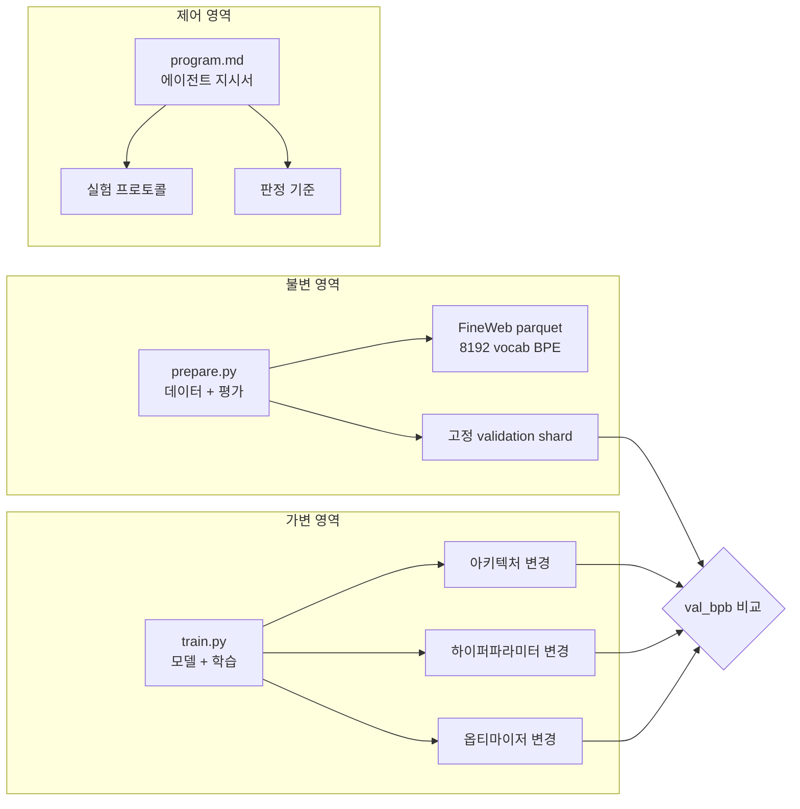
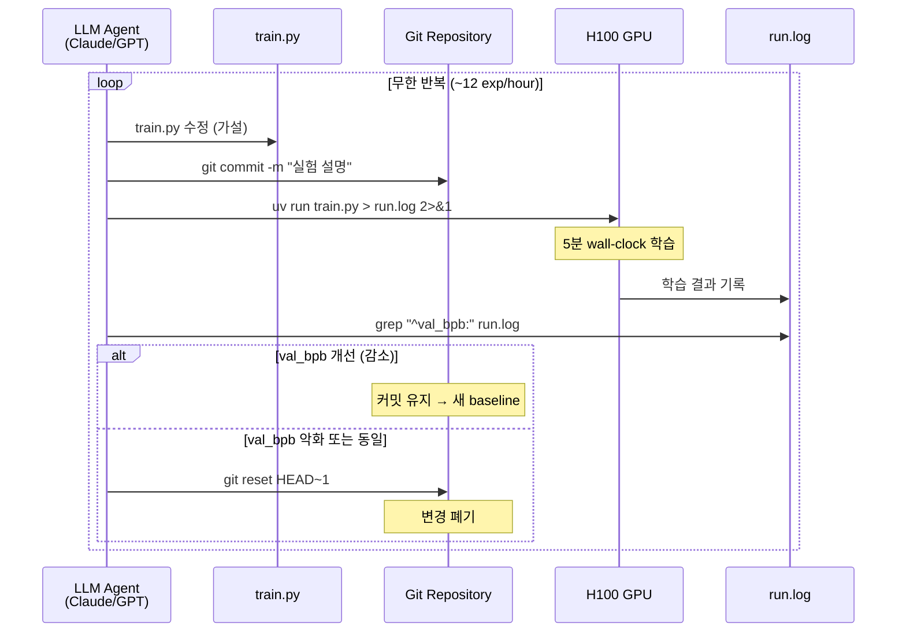

# Karpathy의 autoresearch 해부 — 파일 3개로 밤새 100+ ML 실험을 자율 수행하는 구조

> Date: 2026-03-12 | Author: geode-team | Tags: [autoresearch, karpathy, autonomous-ml, agentic-loop, muon-optimizer, experiment-tracking, automl]

## 목차

1. [도입 — 왜 ML 연구 루프를 자동화하는가](#1-도입--왜-ml-연구-루프를-자동화하는가)
2. [아키텍처 — 3파일 구조의 의도, 제약이 곧 설계](#2-아키텍처--3파일-구조의-의도-제약이-곧-설계)
3. [실험 프로토콜 — program.md에서 판정까지](#3-실험-프로토콜--programmd에서-판정까지)
4. [모델 아키텍처 심화 — GPT 변형의 설계 결정](#4-모델-아키텍처-심화--gpt-변형의-설계-결정)
5. [MuonAdamW 옵티마이저 — 행렬과 스칼라의 분리](#5-muonadamw-옵티마이저--행렬과-스칼라의-분리)
6. [Git as Experiment Tracker — 커밋이 곧 실험 기록](#6-git-as-experiment-tracker--커밋이-곧-실험-기록)
7. [Context Budget 관리 — stdout 리다이렉트와 grep 추출](#7-context-budget-관리--stdout-리다이렉트와-grep-추출)
8. [실전 결과 — depth-12에서 2일간의 자율 실험](#8-실전-결과--depth-12에서-2일간의-자율-실험)
9. [기존 도구 비교 — AutoML/NAS vs autoresearch](#9-기존-도구-비교--automlnas-vs-autoresearch)
10. [커뮤니티 확장과 한계](#10-커뮤니티-확장과-한계)
11. [GEODE 시사점 — 에이전트 시스템 설계에 남기는 교훈](#11-geode-시사점--에이전트-시스템-설계에-남기는-교훈)
12. [마무리](#12-마무리)

---

## 1. 도입 — 왜 ML 연구 루프를 자동화하는가

ML 연구의 일상은 반복입니다. 가설을 세우고, 코드를 고치고, 학습을 돌리고, 메트릭을 확인하고, 다시 가설을 세웁니다. 이 루프를 하루에 10번 반복하면 생산적인 하루입니다. 그런데 이 루프의 각 단계가 "코드 수정 - 실행 - 판정"이라는 결정론적 구조라면, LLM 에이전트가 대신 수행할 수 있지 않을까요?

2026년 3월 6일, Andrej Karpathy가 공개한 [`autoresearch`](https://github.com/karpathy/autoresearch)는 이 질문에 대한 최소한의 답입니다. MIT 라이선스, 파일 3개, train.py 약 630줄. 단일 H100 GPU에서 에이전트가 밤새 **100+ ML 실험을 자율 수행**합니다. 공개 6일 만에 GitHub 26K+ stars를 기록했습니다.

이 글에서는 autoresearch의 구조를 ML 엔지니어 관점에서 해부합니다. 왜 파일이 3개뿐인지, 왜 Git이 실험 트래커인지, MuonAdamW 옵티마이저가 어떤 문제를 푸는지, 그리고 GEODE와 같은 에이전트 시스템이 이 설계에서 무엇을 배울 수 있는지를 다룹니다.

---

## 2. 아키텍처 — 3파일 구조의 의도, 제약이 곧 설계

autoresearch의 전체 구조는 파일 3개입니다.

| 파일 | 역할 | 수정 가능 여부 |
|------|------|---------------|
| `prepare.py` | 데이터 전처리 + 평가 하네스(evaluation harness) | **읽기 전용** |
| `train.py` | 모델 정의 + 학습 루프 (~630줄) | **유일한 수정 대상** |
| `program.md` | 에이전트 지시서 (실험 프로토콜 정의) | 인간이 관리 |

```
autoresearch/
├── prepare.py      # 데이터 + 평가 (불변)
├── train.py        # 모델 + 학습 (~630줄, 에이전트가 수정)
├── program.md      # 에이전트 지시서 (인간이 작성)
├── run.log         # 학습 출력 리다이렉트
└── .git/           # 실험 기록 저장소
```

> 파일이 3개뿐인 이유는 의도적입니다. ~630줄이라는 제약은 현대 LLM의 컨텍스트 윈도우(context window)에 전체 코드가 들어가도록 설계된 것입니다. 에이전트가 코드 전체를 "holistic하게" 이해한 상태에서 수정하므로, 부분적 이해로 인한 파편적 변경을 방지합니다.

### 2.1 왜 prepare.py를 불변으로 두는가

prepare.py가 불변인 이유는 **평가의 공정성** 때문입니다. 데이터 전처리, 토크나이저(tokenizer), 검증 셋(validation set)이 실험마다 바뀌면 val_bpb(validation bits-per-byte) 비교가 의미를 잃습니다. 모든 실험이 동일한 조건에서 평가되어야 "이 변경이 정말 개선인가"를 판정할 수 있습니다.



불변 영역(prepare.py)이 고정된 평가 기준을 제공하고, 가변 영역(train.py)만이 에이전트의 탐색 대상이 됩니다. program.md는 이 탐색의 규칙을 정의합니다.

### 2.2 program.md — 프롬프트 엔지니어링이 곧 연구 설계

program.md는 단순한 안내문이 아닙니다. 에이전트의 **연구 전략**을 정의하는 문서입니다. 무엇을 시도하고, 어떤 순서로 탐색하며, 실패 시 어떻게 복구하는지를 자연어로 기술합니다.

```markdown
# program.md (구조 요약)

## Setup (1회)
- 리서치 브랜치 생성
- 결과 추적 초기화

## Experimentation (무한 반복)
1. train.py 수정 (가설 기반)
2. git commit -m "실험 설명"
3. uv run train.py > run.log 2>&1
4. grep "^val_bpb:" run.log
5. 개선이면 유지, 악화면 git reset HEAD~1
6. 1번으로 돌아감
```

> Karpathy의 핵심 통찰입니다: **프로그래밍의 대상이 Python에서 Markdown으로 이동**했습니다. 연구자는 train.py를 직접 수정하는 대신 program.md를 정교하게 다듬어 에이전트의 탐색 전략을 조종합니다. GitHub Issue #22에서 "에이전트에게 'have fun'이라고 지시하면 창의성이 높아진다"는 보고가 있었는데, 이는 prompt engineering(프롬프트 엔지니어링)이 곧 연구 설계가 되었음을 보여줍니다.

---

## 3. 실험 프로토콜 — program.md에서 판정까지

에이전트의 실험 루프를 시퀀스 다이어그램으로 표현하면 다음과 같습니다.



### 3.1 5분 wall-clock의 의미

학습 시간이 5분(wall-clock, 컴파일 시간 제외)으로 고정된 이유는 **공정 비교**입니다. 모델 크기를 줄이면 더 많은 스텝을 밟을 수 있고, 배치 크기를 키우면 스텝당 학습량이 늘어납니다. 5분이라는 동일한 시간 예산 아래에서 이 트레이드오프를 에이전트가 자유롭게 탐색합니다.

```python
# train.py — 학습 시간 제한 (개념)
TRAINING_BUDGET_SECONDS = 300  # 5분 wall-clock
# torch.compile 워밍업 제외, 순수 학습 시간만 측정
```

> 이 설계는 ML 스피드런(speedrun) 커뮤니티의 관행에서 왔습니다. nanochat의 "Time to GPT-2" 리더보드가 동일한 시간 예산 경쟁을 채택하고 있으며, autoresearch는 이 경쟁의 자동화 버전입니다.

### 3.2 val_bpb — 어휘 크기 독립적 메트릭

val_bpb(validation bits-per-byte)는 모델이 검증 데이터의 각 바이트를 예측하는 데 필요한 비트 수입니다. 일반적인 perplexity(혼란도)와 달리 **어휘 크기에 독립적**이므로, 에이전트가 토크나이저 설정을 변경해도 공정한 비교가 가능합니다.

```python
# 개념: val_bpb 계산
# bpb = cross_entropy_loss * (vocab_tokens / raw_bytes) / ln(2)
# 낮을수록 좋음
```

### 3.3 래칫(Ratchet) 메커니즘

실험 결과의 판정은 단순합니다: val_bpb가 이전 best보다 낮으면 유지, 같거나 높으면 폐기. 이 **단조 감소(monotonic decrease) 보장**이 래칫 메커니즘의 핵심입니다.

```bash
# program.md의 판정 프로토콜
# 1. 학습 실행
uv run train.py > run.log 2>&1

# 2. 메트릭 추출
grep "^val_bpb:\|^peak_vram_mb:" run.log

# 3. 판정
# val_bpb < previous_best → 커밋 유지 (새 baseline)
# val_bpb >= previous_best → git reset HEAD~1 (폐기)
```

> 래칫 메커니즘의 장점은 **안전성**입니다. 에이전트가 아무리 공격적인 변경을 시도해도, 성능이 떨어지면 자동으로 복구됩니다. 반면 약점은 명확합니다: **local optima(지역 최적해)에 갇힐 수 있습니다**. 성능이 일시적으로 하락해야 도달할 수 있는 더 나은 해를 탐색하지 못합니다. 이것이 커뮤니티에서 "낮은 창의성" 문제로 논의되는 핵심 원인입니다.

---

## 4. 모델 아키텍처 심화 — GPT 변형의 설계 결정

train.py에 구현된 모델은 표준 GPT가 아닌, 여러 최근 기법을 통합한 변형입니다.

### 4.1 핵심 아키텍처 구성 요소

| 구성 요소 | 기법 | 설명 |
|----------|------|------|
| 위치 인코딩 | **RoPE** (Rotary Position Embedding) | 상대적 위치 정보를 회전 행렬로 인코딩 |
| 어텐션 | **Flash Attention 3** | HBM 접근 최소화, O(N) 메모리 |
| 윈도우 패턴 | **SSSL** (Sliding Window) | Short-Short-Short-Long 반복, 마지막 레이어는 항상 전체 컨텍스트 |
| 활성화 함수 | **ReLU-squared** | `F.relu(x).square()` — 희소하고 계산이 저렴 |
| 잔차 경로 | **Value Embeddings** (ResFormer) | 교대 레이어에 입력 의존적 게이팅 |
| 정밀도 | **bfloat16** | 학습 안정성과 속도의 균형 |
| 컴파일 | **torch.compile** | 그래프 캡처를 통한 커널 융합 |

### 4.2 Sliding Window — SSSL 패턴

```python
# train.py — window_pattern 설정 (개념)
window_pattern: str = "SSSL"  # Short-Short-Short-Long 반복

# 레이어 12개일 때:
# Layer  0: Short (local attention, window=128)
# Layer  1: Short
# Layer  2: Short
# Layer  3: Long  (full context, window=seq_len)
# Layer  4: Short
# ...
# Layer 11: Long  (마지막 레이어, 항상 full context)
```

> SSSL 패턴의 설계 의도는 **계산 효율과 전역 정보 접근의 균형**입니다. 대부분의 레이어가 짧은 윈도우로 지역 패턴을 처리하고, 매 4번째 레이어에서 전체 시퀀스를 참조합니다. Flash Attention 3과 결합하면, Short 레이어의 어텐션 계산이 시퀀스 길이에 비례하지 않고 윈도우 크기에만 비례하므로 상당한 속도 향상을 얻습니다.

### 4.3 Value Embeddings — ResFormer의 잔차 경로

```python
# train.py — Value Embeddings (개념)
# 교대 레이어(alternating layers)에서 입력 임베딩의
# 잔차 경로를 추가하여 그래디언트 흐름을 개선
# 입력 의존적 게이팅으로 레이어별 기여도 조절

# 배치: alternating (0, 2, 4, ...) 레이어에 적용
# U-shaped, every-layer 대비 alternating이 최선
```

> Value Embeddings는 깊은 네트워크에서의 그래디언트 소실(vanishing gradient) 문제에 대한 경량 해법입니다. 모든 레이어에 적용하는 대신 교대 배치를 선택한 것은, autoresearch의 자율 실험에서 실제로 교대 배치가 가장 좋은 val_bpb를 기록했기 때문입니다.

### 4.4 ReLU-squared — 희소 활성화

```python
# 표준 GELU vs ReLU-squared
# GELU: 0.5 * x * (1 + tanh(sqrt(2/pi) * (x + 0.044715 * x^3)))
# ReLU²: F.relu(x).square()   ← 연산 2개로 끝남

def relu_squared(x: torch.Tensor) -> torch.Tensor:
    return F.relu(x).square()
```

> ReLU-squared의 장점은 두 가지입니다. 첫째, **계산 비용**이 GELU 대비 극히 낮습니다. 둘째, 음수 입력이 정확히 0이 되므로 **희소성(sparsity)**이 자연스럽게 발생하여, MLP 레이어의 활성 뉴런 비율이 줄어들고 실질적인 계산량이 감소합니다. 5분이라는 시간 예산 안에서 더 많은 학습 스텝을 밟을 수 있게 됩니다.

---

## 5. MuonAdamW 옵티마이저 — 행렬과 스칼라의 분리

autoresearch의 옵티마이저는 단일 옵티마이저가 아닌, **파라미터 유형에 따른 이원 구조**입니다.

### 5.1 분리 전략

| 파라미터 유형 | 옵티마이저 | 이유 |
|-------------|-----------|------|
| 2D 가중치 행렬 (QKV, MLP) | **Muon** | 직교화로 스펙트럼 정규화 효과 |
| 임베딩, 바이어스, 스칼라 | **AdamW** | 저차원 파라미터에 적합 |

```python
# train.py — MuonAdamW 구성 (개념)
class MuonAdamW:
    """2D matrices → Muon, embeddings/scalars → AdamW"""

    def __init__(self, params, lr: float, wd: float, betas: tuple[float, float]):
        self.muon_params = []   # 2D weight matrices
        self.adamw_params = []  # embeddings, biases, scalars

        for p in params:
            if p.ndim >= 2:
                self.muon_params.append(p)
            else:
                self.adamw_params.append(p)

    def step(self):
        # Muon: momentum + Newton-Schulz orthogonalization
        for p in self.muon_params:
            grad = p.grad
            # 1. Momentum update
            buf = self.state[p]["momentum_buffer"]
            buf.mul_(self.beta).add_(grad)
            # 2. Newton-Schulz 직교화 (5 iterations)
            orthogonalized = newton_schulz_orthogonalize(buf, steps=5)
            # 3. Weight update
            p.data.add_(orthogonalized, alpha=-self.lr)

        # AdamW: 표준 Adam + weight decay
        for p in self.adamw_params:
            # 표준 AdamW 업데이트
            ...
```

> Muon은 "MomentUm Orthogonalized by Newton-schulz"의 약어입니다. 핵심 아이디어는 모멘텀 버퍼를 Newton-Schulz 반복법으로 **직교화(orthogonalize)**하는 것입니다. 이것이 왜 중요한가? 직교화된 업데이트는 가중치 행렬의 특이값(singular value) 분포를 균일하게 유지하여, **스펙트럼 정규화(spectral regularization)**와 유사한 효과를 줍니다. 결과적으로 학습 초기의 불안정성이 줄고, 동일 스텝 수에서 더 낮은 손실에 도달합니다.

### 5.2 Newton-Schulz 반복과 Polar Express

Newton-Schulz 반복은 행렬의 극분해(polar decomposition)를 구하는 고전적 방법입니다. 행렬 $X$에 대해 $X_0 = X$, $X_{k+1} = \frac{3}{2}X_k - \frac{1}{2}X_k X_k^T X_k$를 반복하면 직교 행렬에 수렴합니다.

```python
def newton_schulz_orthogonalize(
    M: torch.Tensor, steps: int = 5
) -> torch.Tensor:
    """Newton-Schulz 반복으로 행렬을 직교화합니다."""
    # M을 스펙트럼 노름으로 정규화
    a, b, c = (3.4445, -4.7750, 2.0315)  # 최적 계수
    X = M / M.norm()
    for _ in range(steps):
        A = X @ X.T
        X = a * X + b * (A @ X) + c * (A @ (A @ X))
    return X
```

> Polar Express는 Newton-Schulz보다 빠른 대안으로, 2025년 중반에 제안되었습니다. 8 반복(24 행렬곱)으로 머신 정밀도에 수렴하여, Newton-Schulz의 20 반복(40 행렬곱) 대비 40% 빠릅니다. autoresearch의 현재 구현은 Newton-Schulz를 사용하지만, Polar Express로의 교체가 커뮤니티에서 논의되고 있습니다.

### 5.3 왜 임베딩에는 AdamW를 유지하는가

임베딩 레이어는 어휘 크기 x 차원(예: 8192 x 768)의 2D 행렬이지만, 실질적으로는 룩업 테이블입니다. 학습 중 미니배치에서 접근되는 행은 극히 일부이므로, 직교화의 전제인 "전체 행렬에 대한 균일한 업데이트"가 성립하지 않습니다. AdamW의 적응적 학습률(adaptive learning rate)이 이런 희소 접근 패턴에 더 적합합니다.

---

## 6. Git as Experiment Tracker — 커밋이 곧 실험 기록

autoresearch에서 Git은 버전 관리 도구가 아닌 **실험 추적 시스템(experiment tracker)**입니다.

### 6.1 기존 실험 추적 vs Git

| 기능 | MLflow / W&B | Git (autoresearch) |
|------|-------------|-------------------|
| 실험 메타데이터 | 별도 DB/서버 | 커밋 메시지 |
| 코드 스냅샷 | 아티팩트 저장 | 커밋 diff 자체 |
| 메트릭 로깅 | API 호출 | `grep val_bpb run.log` |
| 롤백 | 수동 체크포인트 | `git reset HEAD~1` |
| 최선 해 | "best model" 태그 | 브랜치 tip = 최선 해 |
| 인프라 비용 | 서버 유지비 | 0 (로컬 .git) |
| 확장성 | 수천 실험 | 수백 실험 (컨텍스트 한계) |

```bash
# autoresearch에서 Git이 실험 트래커로 동작하는 패턴:

# 1. 실험 시작 = 커밋
git commit -m "Try wider attention window in layers 4-8"

# 2. 실험 성공 = 커밋 유지 (브랜치 tip 이동)
# → 현재 HEAD가 곧 최선의 train.py

# 3. 실험 실패 = 커밋 폐기
git reset HEAD~1
# → 이전 커밋으로 복귀, 실패한 코드 사라짐

# 4. 실험 히스토리 = git log
git log --oneline
# abc1234 Try ReLU-squared activation → val_bpb 0.9697
# def5678 Adjust weight decay schedule → val_bpb 0.9701
# ...
```

> 이 설계의 우아함은 **추가 인프라가 0**이라는 점입니다. MLflow 서버도, W&B 구독도 필요 없습니다. Git은 이미 모든 개발 환경에 존재합니다. 그러나 대가가 있습니다: 실패한 실험은 `git reset`으로 **완전히 사라집니다**. 성공한 변경만 히스토리에 남으므로, "왜 이 접근은 실패했는가"를 나중에 분석할 수 없습니다. 이것이 장기 기억(long-term memory) 부재로 이어지는 구조적 문제입니다.

### 6.2 Co-author 패턴

autoresearch의 커밋에는 흥미로운 패턴이 있습니다. Claude Opus 4.6이 co-author로 등장합니다.

```
commit abc1234
Author: Andrej Karpathy <karpathy@...>
Co-Authored-By: Claude Opus 4.6 <noreply@anthropic.com>

    Add QKnorm scaler for sharper attention
```

> Karpathy 본인이 Claude Code를 사용한다는 직접적 증거입니다. GEODE에서도 동일한 Co-Authored-By 패턴을 커밋 규약으로 사용하고 있어, 에이전트-인간 협업의 투명한 추적이라는 관점에서 공감되는 설계입니다.

---

## 7. Context Budget 관리 — stdout 리다이렉트와 grep 추출

에이전트가 밤새 100+ 실험을 수행하려면, 각 실험의 출력이 LLM의 컨텍스트 윈도우를 넘치지 않아야 합니다. autoresearch는 이 문제를 두 가지 기법으로 해결합니다.

### 7.1 stdout 리다이렉트

```bash
# 학습 출력을 파일로 리다이렉트 — tee 사용 금지
uv run train.py > run.log 2>&1
```

> `tee`를 명시적으로 금지하는 이유가 있습니다. `tee`를 사용하면 학습 중 수천 줄의 로그가 에이전트의 컨텍스트에 실시간으로 유입되어, **컨텍스트 예산이 단일 실험으로 고갈**됩니다. 리다이렉트로 컨텍스트를 보호하고, 필요한 정보만 grep으로 추출하는 것이 핵심입니다.

### 7.2 grep 메트릭 추출

```bash
# 필요한 메트릭만 선택적으로 추출
grep "^val_bpb:\|^peak_vram_mb:" run.log

# 출력 예시:
# val_bpb: 0.9697
# peak_vram_mb: 39214
```

이 패턴을 정보 흐름 관점에서 정리하면 다음과 같습니다.

| 단계 | 정보량 | 컨텍스트 소비 |
|------|--------|-------------|
| train.py 실행 | 수천 줄 로그 | 0 (리다이렉트) |
| grep 추출 | 2줄 (val_bpb, peak_vram_mb) | 극소 |
| 판정 | 1비트 (개선/악화) | 극소 |
| 커밋 메시지 | 1줄 | 극소 |

> 시간당 12 실험을 8시간 수행하면 ~96 실험입니다. 각 실험에서 컨텍스트에 유입되는 정보가 grep 결과 2줄 + 커밋 메시지 1줄 = ~3줄이라면, 총 ~288줄입니다. 이 정도면 현대 LLM의 128K+ 컨텍스트 윈도우에서 충분히 수용 가능합니다. **정보 압축이 자율 실행의 지속 가능성을 결정**합니다.

---

## 8. 실전 결과 — depth-12에서 2일간의 자율 실험

Karpathy는 depth-12 모델에서 autoresearch를 약 2일간 실행한 결과를 공개했습니다.

### 8.1 정량적 결과

| 항목 | 수치 |
|------|------|
| 실행 기간 | ~2일 |
| 처리된 자율 변경 | ~700건 |
| 유지된 개선 | ~20건 |
| 채택률 | ~2.9% |
| Time to GPT-2 (이전) | 2.02시간 |
| Time to GPT-2 (이후) | 1.80시간 |
| 효율 향상 | **11%** |
| depth-12 → depth-24 전이 | **모두 additive** |

> 채택률 ~2.9%는 낮아 보이지만, 래칫 메커니즘의 특성상 정상적입니다. 700건 중 680건은 val_bpb를 개선하지 못했고, 이들은 자동으로 폐기되었습니다. 중요한 것은 채택된 20건이 **모두 additive(가산적)**했다는 점입니다. 즉, 20개 변경을 순차적으로 적용하면 개선이 누적됩니다.

### 8.2 발견된 주요 최적화

에이전트가 자율적으로 발견한 개선 사항들입니다.

| 발견 | 설명 | 영향 |
|------|------|------|
| QKnorm scaler | 파라미터 없는 QKnorm에 학습 가능한 스케일러 추가 | 어텐션 선명도 향상 |
| Value Embedding 정규화 | Value Embeddings에 정규화 적용 | 학습 안정성 개선 |
| Banded attention 확장 | 밴디드 어텐션 윈도우 확대 | 정보 접근 범위 증가 |
| AdamW betas 보정 | 기본 betas 값 보정 | 수렴 속도 개선 |
| Weight decay 스케줄링 | 가중치 감쇠 스케줄 조정 | 과적합 감소 |
| 초기화 스케일링 | 가중치 초기화 스케일 조정 | 학습 초기 안정성 |

### 8.3 커뮤니티 세션 보고

GitHub Discussion #43에서는 126 실험으로 val_bpb를 **0.9979에서 0.9697로** 개선한 세션이 보고되었습니다. 주요 발견은 "모든 파라미터에 weight decay 적용"과 "초기화 스케일링(init scaling)" 조합이었습니다.

---

## 9. 기존 도구 비교 — AutoML/NAS vs autoresearch

autoresearch는 기존 AutoML(자동 머신러닝) 도구와 근본적으로 다른 접근입니다.

### 9.1 비교 테이블

| 항목 | Optuna | Ray Tune | NNI | autoresearch |
|------|--------|----------|-----|-------------|
| **탐색 대상** | 하이퍼파라미터 | 하이퍼파라미터 | 하이퍼파라미터 + 아키텍처 | **코드 전체** |
| **탐색 방법** | TPE / CMA-ES | PBT / BOHB | NAS / ENAS | **LLM 추론** |
| **탐색 공간 정의** | Python API | Python API | YAML / Python | **자연어 (program.md)** |
| **수정 단위** | 숫자 (lr, wd, ...) | 숫자 | 그래프 토폴로지 | **소스 코드 diff** |
| **실험 추적** | DB (SQLite) | TensorBoard | DB | **Git** |
| **병렬화** | 멀티프로세스 | 분산 클러스터 | 분산 | **단일 GPU, 순차** |
| **인프라 비용** | 서버 필요 | 클러스터 필요 | 서버 필요 | **로컬 GPU 1대** |
| **재현성** | trial ID | trial ID | trial ID | **git commit hash** |

### 9.2 autoresearch의 차별점

**탐색 공간의 차원이 다릅니다.** Optuna는 "learning_rate: [1e-5, 1e-2]"처럼 사전 정의된 숫자 범위를 탐색합니다. autoresearch는 **코드 자체를 수정**합니다. 새로운 활성화 함수를 구현하거나, 어텐션 메커니즘을 변경하거나, 옵티마이저의 업데이트 규칙을 재작성할 수 있습니다. 이것은 하이퍼파라미터 탐색이 아닌 **프로그램 합성(program synthesis)**에 가깝습니다.

```
# Optuna의 탐색 공간
trial.suggest_float("lr", 1e-5, 1e-2, log=True)  # 1차원 연속 값

# autoresearch의 탐색 공간
# train.py의 ~630줄 전체가 탐색 공간
# → 활성화 함수 교체, 어텐션 패턴 변경, 새 정규화 기법 추가 등
# → 탐색 공간이 코드의 모든 유효한 변이(mutation)
```

> 그러나 이 유연성은 양날의 검입니다. Optuna의 TPE(Tree-structured Parzen Estimator)는 수학적으로 **수렴이 보장**됩니다. autoresearch의 LLM 기반 탐색은 수렴 보장이 없으며, 에이전트의 "직관"에 의존합니다. 대신 Optuna가 절대 발견할 수 없는 **질적 변경(qualitative changes)** — 새로운 아키텍처 구성 요소의 도입 — 을 탐색할 수 있습니다.

### 9.3 상호 보완 가능성

이 두 접근은 배타적이지 않습니다. autoresearch로 아키텍처와 알고리즘의 질적 변경을 탐색한 뒤, Optuna로 발견된 구성의 하이퍼파라미터를 정밀 튜닝하는 2단계 접근이 가능합니다.

---

## 10. 커뮤니티 확장과 한계

### 10.1 커뮤니티 포크

| 포크 | 타겟 플랫폼 | 특징 |
|------|-----------|------|
| autoresearch-macos | Apple Silicon (MPS) | PyTorch MPS 백엔드, macOS 지원 |
| autoresearch-mlx | Apple Silicon (MLX) | PyTorch 의존성 제거, MLX 네이티브 |
| autoresearch-win-rtx | Windows + RTX | Windows 환경 + NVIDIA RTX 지원 |

> Apple Silicon 포크에서 흥미로운 발견이 있었습니다. **5분 wall-clock이라는 동일한 시간 예산 아래에서, 작은 모델이 큰 모델을 이기는 현상**이 관찰되었습니다. 작은 모델은 동일 시간에 더 많은 옵티마이저 스텝을 밟을 수 있고, 충분한 스텝 수가 모델 크기의 불이익을 상쇄합니다. 이는 시간 예산 기반 탐색의 고유한 특성입니다.

### 10.2 한계와 열린 문제

#### 10.2.1 낮은 창의성 — Local Optima

래칫 메커니즘은 val_bpb가 일시적으로 악화되는 변경을 모두 거부합니다. "현재 아키텍처를 완전히 재설계하면 장기적으로 더 좋을 수 있다"는 탐색이 불가능합니다.

GitHub Issue #22에서 제안된 완화책:
- program.md에 "have fun", "be creative" 등의 지시를 추가하여 탐색 다양성을 유도
- program.md 자체를 에이전트가 개선하는 메타 최적화

#### 10.2.2 장기 기억 부재

실패한 실험은 `git reset`으로 사라지므로, 에이전트는 "이전에 시도하고 실패한 것"을 기억하지 못합니다. 같은 변경을 반복 시도할 수 있습니다.

Karpathy의 비전은 이 문제를 개인에서 집단으로 확장하여 해결하는 것입니다:

> "다음 단계는 에이전트들의 비동기 대규모 협업 (SETI@home 스타일)이다. 목표는 단일 PhD 학생을 모방하는 것이 아니라, PhD 학생들의 **연구 커뮤니티**를 모방하는 것이다."

#### 10.2.3 Prompt Injection 보안

에이전트가 `run.log`를 읽을 때, 학습 코드가 의도적으로 로그에 명령어를 삽입하면 에이전트의 행동을 조작할 수 있습니다. 또한, 캐시된 아티팩트(artifact)를 신뢰하는 문제도 지적되고 있습니다. 공유 인프라에서 무인 실행 시 **샌드박싱(sandboxing)**, **구조화된 출력(structured output)**, **무결성 검증(integrity check)**이 필요합니다.

#### 10.2.4 확장성의 구조적 한계

| 제약 | 영향 | 잠재적 해법 |
|------|------|-----------|
| 단일 GPU 순차 실행 | ~12 exp/hour | 멀티 GPU 병렬 분기 |
| Git 선형 히스토리 | 하나의 탐색 경로 | 멀티 브랜치 + 병합 전략 |
| 5분 고정 예산 | 큰 모델 불리 | 적응적 예산 또는 스케일별 예산 |
| 단일 메트릭 (val_bpb) | 다목적 최적화 불가 | Pareto 프론티어 기반 판정 |

---

## 11. GEODE 시사점 — 에이전트 시스템 설계에 남기는 교훈

autoresearch의 설계에서 GEODE와 같은 에이전트 시스템이 배울 수 있는 패턴이 있습니다.

### 11.1 "제약이 곧 설계" 원칙

autoresearch의 3파일 구조, 630줄 제한, 5분 시간 예산은 모두 **의도적 제약**입니다. 이 제약이 에이전트의 행동을 건전한 범위로 한정합니다.

GEODE에서도 동일한 원칙이 적용됩니다.

| autoresearch 제약 | GEODE 대응 |
|------------------|------------|
| train.py만 수정 가능 | 각 노드는 자신의 output keys만 반환 (노드 계약) |
| 5분 wall-clock | Confidence Gate ≥ 0.7 → 진행, max 5 iter (루프백 제한) |
| val_bpb 단일 메트릭 | PSM 6가중 복합 스코어 + Tier 판정 |
| program.md | CLAUDE.md + 스킬 시스템 |
| grep 추출 | Context Budget 관리 (Session TTL, 3-Tier Memory) |

### 11.2 래칫 vs 피드백 루프

autoresearch의 래칫은 **단조 개선**을 보장하지만 탐색 범위가 좁습니다. GEODE의 5-Phase RLHF 피드백 루프(feedback loop)는 전문가 패널의 평가를 통해 더 넓은 탐색을 허용하지만, 수렴 보장이 약합니다.

### 11.3 Git as Memory vs 3-Tier Memory

autoresearch의 Git 기반 실험 추적은 인프라 비용 0이라는 장점이 있지만, 장기 기억 부재라는 구조적 한계가 있습니다. GEODE의 3-Tier Memory(Organization → Project → Session)는 이 문제를 계층적 TTL과 영속성 계층으로 해결합니다.

```
autoresearch:     .git (성공만 기록, 실패 소실)
GEODE:            Organization (불변) → Project (영속) → Session (TTL)
                  모든 분석 결과가 계층별로 보존
```

### 11.4 Context Budget — 공통 과제

autoresearch의 `> run.log` + `grep` 패턴과 GEODE의 Clean Context(Send API에서 기존 분석 결과를 제외하여 앵커링 방지)는 **같은 문제의 다른 해법**입니다. 에이전트가 장시간 자율 실행하려면, 컨텍스트 윈도우를 능동적으로 관리해야 합니다.

---

## 12. 마무리

### 핵심 정리 테이블

| 항목 | autoresearch | 핵심 통찰 |
|------|-------------|----------|
| **구조** | 파일 3개 (prepare.py, train.py, program.md) | 제약이 곧 설계 — 630줄은 컨텍스트 윈도우 적합 |
| **실험 루프** | 수정 → 커밋 → 5분 학습 → grep → 판정 → 반복 | 래칫 메커니즘으로 단조 개선 보장 |
| **메트릭** | val_bpb (bits-per-byte) | 어휘 크기 독립적 → 아키텍처 변경도 공정 비교 |
| **옵티마이저** | MuonAdamW (Muon + AdamW 이원 구조) | 2D 행렬은 직교화, 나머지는 적응적 학습률 |
| **실험 추적** | Git (커밋=실험, reset=폐기) | 인프라 비용 0, 실패 기록 소실이라는 대가 |
| **컨텍스트 관리** | stdout 리다이렉트 + grep | 정보 압축이 자율 실행의 지속 가능성을 결정 |
| **실전 결과** | 2일, ~700건, 20건 채택, 11% 향상 | depth-12 발견이 depth-24로 전이 |
| **한계** | 창의성, 장기 기억, 보안, 단일 GPU | 래칫의 강점(안전)이 약점(탐색 범위)과 동전의 양면 |

### 체크리스트 — autoresearch에서 배울 설계 원칙

- [ ] **탐색 대상을 제한하되, 탐색 방법은 열어두기**: 코드 수정 범위를 한정하되 LLM의 추론 능력에 의존
- [ ] **평가 기반을 불변으로 고정하기**: 데이터/메트릭이 바뀌면 비교가 무의미
- [ ] **컨텍스트 예산을 능동적으로 관리하기**: 출력 리다이렉트 + 선택적 추출
- [ ] **래칫으로 안전성 확보하기**: 성능 하락 시 자동 복구
- [ ] **인프라를 최소화하기**: Git으로 충분한 것에 MLflow를 쓰지 않기
- [ ] **코드 크기를 컨텍스트 윈도우에 맞추기**: 에이전트가 전체를 이해해야 부분적 오류가 줄어듦
- [ ] **실패 기록을 보존할 구조 마련하기**: autoresearch의 가장 큰 gap
- [ ] **보안을 설계 시점에 고려하기**: prompt injection 경로 차단

---

> **Note**: autoresearch는 "AI가 AI를 연구하는" 초기 사례입니다. 630줄의 Python과 Markdown 한 장으로 이루어진 이 최소한의 구조가 11%의 실질적 성능 향상을 달성했다는 점에서, 에이전트 시스템의 설계 철학 — 제약을 통한 통제, 정보 압축을 통한 지속 가능성 — 이 실증되었습니다. GEODE의 파이프라인 설계에서도 이 원칙들이 유사하게 적용되고 있으며, autoresearch는 그 적용의 가장 극단적이고 우아한 사례입니다.

---

*Source: `blog/posts/harness-frontier/19-karpathy-autoresearch-autonomous-ml-loop.md` | Category: [[blog-harness-frontier]]*

## Related

- [[blog-harness-frontier]]
- [[blog-hub]]
- [[geode]]
