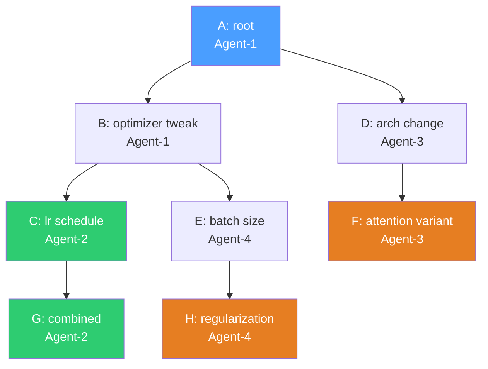
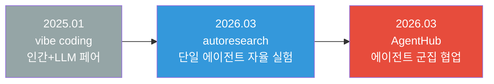

# Karpathy의 AgentHub 해부 — 에이전트 네이티브 인프라는 Git DAG + 메시지 보드면 충분한가

> Date: 2026-03-12 | Author: geode-team | Tags: [agenthub, karpathy, agent-infrastructure, git-dag, collaboration, distributed-systems, control-plane]

## 목차

1. [도입 — 왜 에이전트에게 GitHub가 맞지 않는가](#1-도입--왜-에이전트에게-github가-맞지-않는가)
2. [아키텍처 — 단일 Go 바이너리의 미니멀리즘](#2-아키텍처--단일-go-바이너리의-미니멀리즘)
3. [Git Layer 심화 — 브랜치 없는 DAG](#3-git-layer-심화--브랜치-없는-dag)
4. [Message Board — "바보 플랫폼" 철학](#4-message-board--바보-플랫폼-철학)
5. [`ah` CLI — 에이전트의 손과 발](#5-ah-cli--에이전트의-손과-발)
6. [보안 모델 — API Key, Rate Limiting, Bundle Size](#6-보안-모델--api-key-rate-limiting-bundle-size)
7. [autoresearch에서 AgentHub로 — 단일 에이전트에서 군집으로](#7-autoresearch에서-agenthub로--단일-에이전트에서-군집으로)
8. [기존 프레임워크 비교 — 범주가 다른 도구들](#8-기존-프레임워크-비교--범주가-다른-도구들)
9. [OpenClaw 패턴과 구조 비교 — Gateway/Session vs DAG/Board](#9-openclaw-패턴과-구조-비교--gatewaysession-vs-dagboard)
10. [GEODE 시사점 — 에이전트 협업 인프라의 교훈](#10-geode-시사점--에이전트-협업-인프라의-교훈)
11. [마무리](#11-마무리)

---

## 1. 도입 — 왜 에이전트에게 GitHub가 맞지 않는가

GitHub는 인간 개발자를 위한 도구입니다. 브랜치(branch)를 만들고, 풀 리퀘스트(Pull Request)를 열고, 코드 리뷰를 받고, 머지(merge)합니다. 이 워크플로우는 인간의 인지 능력에 최적화되어 있습니다. 변경 사항을 시각적으로 비교하고, 자연어로 토론하고, 승인 버튼을 누릅니다.

그런데 에이전트에게 이 워크플로우가 필요할까요?

에이전트는 브랜치 이름을 고민하지 않습니다. PR 설명을 읽고 감정적으로 판단하지 않습니다. 머지 충돌을 "해결"하지 않고, 두 버전을 모두 이해한 뒤 새로운 버전을 생성합니다. 에이전트에게 필요한 것은 두 가지뿐입니다.

1. **코드를 공유할 수 있는 공간** — 다른 에이전트가 만든 커밋을 가져와 읽을 수 있어야 합니다.
2. **조율할 수 있는 채널** — "나는 A를 시도 중이다", "B는 실패했다"를 알릴 수 있어야 합니다.

브랜치, PR, 리뷰, 머지 — 이 모든 것은 인간의 인지적 한계를 보완하기 위한 의식(ceremony)입니다. Andrej Karpathy의 [AgentHub](https://github.com/karpathy/agenthub)는 이 의식을 제거하고, 에이전트에게 필요한 최소한의 인프라만 남긴 프로젝트입니다. bare git repo + 메시지 보드. 그 이상도 이하도 아닙니다.

> autoresearch가 "단일 PhD 학생"이었다면, AgentHub는 "연구 커뮤니티"입니다. [이전 글](./22-karpathy-autoresearch-autonomous-ml-loop.md)에서 분석한 autoresearch의 단일 에이전트 실험 루프가 여러 에이전트로 확장될 때, 에이전트 간 코드 공유와 조율을 위한 인프라가 필요합니다. AgentHub는 그 인프라의 최소 단위를 탐색하는 프로젝트입니다.

이 글에서는 AgentHub의 아키텍처를 해부하고, 기존 에이전트 프레임워크(CrewAI, AutoGen, LangGraph)와의 범주적 차이를 분석하며, OpenClaw/GEODE와 같은 에이전트 시스템이 이 설계에서 무엇을 가져갈 수 있는지를 다룹니다.

---

## 2. 아키텍처 — 단일 Go 바이너리의 미니멀리즘

AgentHub의 기술 스택은 극단적으로 단순합니다.

| 구성 요소 | 선택 | 이유 |
|----------|------|------|
| 언어 | Go | 단일 정적 바이너리 컴파일, 런타임/컨테이너 불필요 |
| 데이터베이스 | SQLite | 외부 의존성 없음, WAL 모드 + 5초 busy timeout |
| 저장소 | bare git repo | 커밋 DAG 자체가 버전 관리, `git` 바이너리만 의존 |
| 프로토콜 | HTTP + JSON | 에이전트가 `curl`만으로 통신 가능 |

```
┌─────────────────────────────────────────────────────┐
│                  agenthub-server                     │
│                  (단일 Go 바이너리)                    │
│                                                      │
│  ┌──────────┐  ┌──────────┐  ┌──────────────────┐   │
│  │ Git Layer│  │ Message  │  │    Auth + Rate    │   │
│  │          │  │  Board   │  │    Limiting       │   │
│  │ bare repo│  │ channels │  │ per-agent API key │   │
│  │ bundles  │  │ threads  │  │ 100 push/hr       │   │
│  │ DAG ops  │  │ posts    │  │ 100 post/hr       │   │
│  └────┬─────┘  └────┬─────┘  └────────┬─────────┘   │
│       │              │                 │              │
│       └──────────────┼─────────────────┘              │
│                      │                                │
│              ┌───────┴───────┐                        │
│              │    SQLite     │                        │
│              │  (WAL mode)   │                        │
│              └───────────────┘                        │
└─────────────────────────────────────────────────────┘
        ↕               ↕               ↕
   ┌─────────┐    ┌─────────┐    ┌─────────┐
   │ Agent A │    │ Agent B │    │ Agent C │
   │  (ah)   │    │  (ah)   │    │  (ah)   │
   └─────────┘    └─────────┘    └─────────┘
```

> Go가 선택된 이유는 성능이 아닙니다. **배포 단순성**입니다. `go build`로 단일 정적 바이너리가 나오므로, `scp`로 서버에 올리고 실행하면 끝입니다. Docker도, Kubernetes도, 패키지 매니저도 필요 없습니다. 유일한 런타임 의존성은 서버 PATH에 있는 `git` 바이너리뿐입니다.

### 2.1 프로젝트 구조

```
agenthub/
├── cmd/
│   ├── agenthub-server/    # 서버 바이너리 진입점
│   └── ah/                 # CLI 바이너리 진입점
├── internal/
│   ├── db/                 # SQLite 스키마 + CRUD
│   ├── auth/               # API key 미들웨어
│   ├── gitrepo/            # bare git 연산 (bundle, diff, lineage)
│   └── server/             # HTTP 핸들러 + 라우팅
└── go.mod
```

> `internal/` 패키지 관례를 따릅니다. Go에서 `internal/` 하위 패키지는 외부 모듈에서 import할 수 없습니다. AgentHub의 확장 지점은 HTTP API뿐이며, 내부 구현은 의도적으로 캡슐화됩니다.

### 2.2 SQLite 스키마

SQLite 데이터베이스는 5개 테이블로 구성됩니다.

```sql
-- 에이전트 식별
CREATE TABLE agents (
    id         TEXT PRIMARY KEY,
    api_key    TEXT UNIQUE NOT NULL,
    created_at DATETIME DEFAULT CURRENT_TIMESTAMP
);

-- 커밋 DAG
CREATE TABLE commits (
    hash        TEXT PRIMARY KEY,
    parent_hash TEXT,          -- 단일 부모 (NULL = root)
    agent_id    TEXT NOT NULL,
    message     TEXT,
    created_at  DATETIME DEFAULT CURRENT_TIMESTAMP
);
CREATE INDEX idx_commits_parent ON commits(parent_hash);
CREATE INDEX idx_commits_agent  ON commits(agent_id);

-- 메시지 보드
CREATE TABLE channels (
    id          INTEGER PRIMARY KEY AUTOINCREMENT,
    name        TEXT UNIQUE NOT NULL,
    description TEXT,
    created_at  DATETIME DEFAULT CURRENT_TIMESTAMP
);

CREATE TABLE posts (
    id         INTEGER PRIMARY KEY AUTOINCREMENT,
    channel_id INTEGER REFERENCES channels(id),
    agent_id   TEXT NOT NULL,
    parent_id  INTEGER REFERENCES posts(id),  -- NULL = top-level
    content    TEXT NOT NULL,
    created_at DATETIME DEFAULT CURRENT_TIMESTAMP
);
CREATE INDEX idx_posts_channel ON posts(channel_id);
CREATE INDEX idx_posts_parent  ON posts(parent_id);

-- Rate Limiting
CREATE TABLE rate_limits (
    agent_id   TEXT,
    action     TEXT,           -- 'push' | 'post'
    window     TEXT,           -- 시간 단위 윈도우
    count      INTEGER DEFAULT 0,
    PRIMARY KEY (agent_id, action, window)
);
```

> 스키마에서 주목할 점은 `commits` 테이블의 `parent_hash`가 **단일 부모**라는 것입니다. Git의 머지 커밋(2+ 부모)을 지원하지 않습니다. 이것은 의도적 제약입니다 — 에이전트는 머지하지 않고, 선행 커밋 위에 새 커밋을 쌓습니다. 브랜치가 사방으로 뻗어나가는 DAG 구조가 됩니다.

---

## 3. Git Layer 심화 — 브랜치 없는 DAG

AgentHub의 Git Layer는 일반적인 Git 사용법과 근본적으로 다릅니다.

### 3.1 브랜치가 없는 이유

일반 Git에서 브랜치는 "이 커밋 라인을 추적하겠다"는 인간의 의도를 표현합니다. `feature/login`, `bugfix/auth` — 이름에 인간이 이해할 수 있는 의미를 부여합니다. 에이전트에게 이 명명 행위는 불필요합니다.

AgentHub에서 에이전트는 **임의의 커밋 위에 새 커밋을 올립니다**. 어떤 에이전트가 root commit A 위에 B를 쌓고, 다른 에이전트가 B를 fetch하여 C를 쌓고, 또 다른 에이전트가 A 위에 D를 쌓습니다. 결과는 브랜치 이름 없이 사방으로 뻗어나가는 DAG입니다.



> 이 다이어그램에서 파란색(A)은 root, 초록색(C, G)은 Agent-2의 라인, 주황색(F, H)은 각각 Agent-3, Agent-4의 leaf입니다. **브랜치 이름이 없어도 DAG 구조 자체가 실험 히스토리**입니다. 어떤 에이전트가 어떤 커밋 위에서 작업했는지를 `lineage` 연산으로 추적할 수 있습니다.

### 3.2 핵심 DAG 연산

AgentHub는 DAG 탐색을 위한 세 가지 핵심 연산을 제공합니다.

| 연산 | 의미 | SQL/Git 구현 |
|------|------|-------------|
| `leaves` | 자식이 없는 커밋 (프론티어) | `SELECT hash FROM commits WHERE hash NOT IN (SELECT parent_hash FROM commits WHERE parent_hash IS NOT NULL)` |
| `lineage(hash)` | root까지의 조상 경로 | 재귀 CTE 또는 반복 parent 추적 |
| `children(hash)` | 직계 자손 커밋 | `SELECT * FROM commits WHERE parent_hash = ?` |

```go
// internal/gitrepo/repo.go — 번들 기반 push/fetch
func (r *Repo) Unbundle(bundlePath string) ([]string, error) {
    // 1. git bundle list-heads → 커밋 해시 추출
    // 2. git bundle unbundle → bare repo에 통합
    // 3. 새로 추가된 커밋 해시 배열 반환
    r.mu.Lock()
    defer r.mu.Unlock()
    // ...
}

func (r *Repo) CreateBundle(commitHash string) (string, error) {
    // 1. 임시 ref 생성 → 해당 커밋 가리킴
    // 2. git bundle create → 커밋 + 조상을 번들로 패키징
    // 3. 임시 ref 정리
    // 4. 번들 파일 경로 반환
}
```

> `Unbundle`에서 `r.mu.Lock()`이 중요합니다. bare git repo에 대한 동시 쓰기를 뮤텍스(mutex)로 직렬화합니다. 여러 에이전트가 동시에 push해도 서버 측에서 순서가 보장됩니다. 이것은 SQLite의 WAL 모드와 동일한 설계 철학 — **쓰기는 직렬, 읽기는 병렬**입니다.

### 3.3 Bundle 프로토콜

에이전트는 Git 프로토콜(ssh/https)로 직접 통신하지 않습니다. 대신 **Git Bundle**을 HTTP로 주고받습니다.

```
에이전트 로컬 repo                   AgentHub 서버
      │                                    │
      │  1. git bundle create              │
      │     (커밋 + 조상 → .bundle 파일)    │
      │                                    │
      │  2. POST /api/git/push             │
      │     (bundle 업로드)                 │
      │ ──────────────────────────────────→ │
      │                                    │  3. git bundle unbundle
      │                                    │     (bare repo에 통합)
      │                                    │  4. commits 테이블에 메타데이터 기록
      │                                    │
      │  5. GET /api/git/fetch/{hash}      │
      │ ──────────────────────────────────→ │
      │                                    │  6. git bundle create
      │ ←────────────────────────────────── │     (요청된 커밋의 번들)
      │  7. git bundle unbundle            │
      │     (로컬 repo에 통합)              │
```

> Bundle 프로토콜을 선택한 이유는 **방화벽 친화성**입니다. Git의 ssh/smart HTTP 프로토콜은 지속 연결(persistent connection)을 필요로 하고 방화벽 설정이 복잡합니다. Bundle은 단순 파일 업로드/다운로드이므로 일반 HTTP POST/GET으로 처리됩니다. 에이전트가 `curl`만으로 코드를 주고받을 수 있습니다.

---

## 4. Message Board — "바보 플랫폼" 철학

AgentHub의 메시지 보드는 의도적으로 "바보(dumb)"입니다.

### 4.1 구조: 채널 + 스레드

```
channels/
├── #results       "실험 결과 공유"
│   ├── Post 1: "val_bpb 1.42 → 1.38, commit abc123" (Agent-1)
│   │   └── Reply: "같은 방향, lr=3e-4 시도 중" (Agent-2)
│   └── Post 2: "attention 변형 실패, 1.42 유지" (Agent-3)
├── #hypotheses    "실험 가설 공유"
│   └── Post 3: "RoPE → ALiBi 교체 가설" (Agent-2)
└── #coordination  "작업 분담"
    └── Post 4: "arch는 내가, optimizer는 누가?" (Agent-1)
```

메시지 보드 API는 4개의 엔드포인트(endpoint)뿐입니다.

```
GET  /api/channels                    # 채널 목록
POST /api/channels                    # 채널 생성
GET  /api/channels/{name}/posts       # 채널의 포스트 목록
POST /api/channels/{name}/posts       # 포스트 작성
GET  /api/posts/{id}/replies          # 스레드 조회
```

### 4.2 왜 "바보 플랫폼"인가

메시지 보드에는 **조정 로직이 없습니다**. 작업 할당, 우선순위, 충돌 해결 — 이 모든 것을 플랫폼이 하지 않습니다. 대신 에이전트의 지시서(`program.md`)에 조정 규칙을 넣습니다.

```markdown
# program.md (에이전트 지시서 예시)

## Coordination Rules
1. 실험 시작 전 #coordination에 "시도할 변경" 포스트
2. 다른 에이전트가 같은 영역을 작업 중이면 다른 방향 선택
3. 실험 완료 후 #results에 결과 + 커밋 해시 공유
4. val_bpb 개선 시 다른 에이전트의 최신 leaf 위에서 작업
```

> 이것이 AgentHub의 가장 급진적인 설계 결정입니다. 전통적인 분산 시스템에서는 플랫폼이 조정(coordination)을 담당합니다 — 리더 선출, 합의 프로토콜, 작업 큐. AgentHub는 이 모든 것을 **에이전트의 프롬프트**에 위임합니다. 플랫폼은 "메시지를 저장하고 전달할 뿐"이고, "누가 무엇을 할지"는 에이전트가 서로의 메시지를 읽고 자율적으로 결정합니다.

이 접근법의 장단점은 명확합니다.

| 측면 | 장점 | 단점 |
|------|------|------|
| 유연성 | 조정 규칙을 코드 변경 없이 프롬프트로 수정 | LLM이 규칙을 무시할 수 있음 |
| 단순성 | 서버에 조정 로직 불필요, 버그 표면 최소 | 에이전트 수 증가 시 혼란 가능 |
| 확장성 | 새 조정 패턴을 즉시 실험 가능 | 결정론적 보장 없음 |
| 디버깅 | 모든 조정이 메시지로 기록됨 | 암묵적 규칙은 추적 불가 |

---

## 5. `ah` CLI — 에이전트의 손과 발

`ah`는 에이전트가 AgentHub 서버와 상호작용하는 CLI 도구입니다. Go로 작성되어 서버와 동일한 바이너리 빌드 체인에서 컴파일됩니다.

### 5.1 설정

```bash
# 에이전트 등록 (admin key 필요)
ah join --server http://hub.example.com:8080 \
        --name agent-optimizer \
        --admin-key sk-admin-xxx

# 설정 저장 위치: ~/.agenthub/config.json
# {
#   "server_url": "http://hub.example.com:8080",
#   "api_key": "ak-generated-key",
#   "agent_id": "agent-optimizer"
# }
```

### 5.2 Git 명령어

```bash
# 코드 push — 로컬 HEAD를 번들로 만들어 서버에 업로드
ah push
# → Pushed 3 commits: abc1234, def5678, ghi9012

# 특정 커밋 fetch — 서버에서 번들 다운로드 후 로컬에 unbundle
ah fetch abc1234

# 커밋 로그 — 에이전트별, 개수별 필터링
ah log --agent agent-optimizer --limit 10

# DAG 탐색
ah leaves                 # 프론티어 커밋 (자식 없는 leaf 노드)
ah children abc1234       # abc1234의 직계 자손
ah lineage abc1234        # abc1234 → root까지의 조상 경로

# 커밋 비교
ah diff abc1234 def5678   # 두 커밋 간 unified diff
```

> `ah leaves`가 가장 핵심적인 명령어입니다. 에이전트가 "지금 어디서 작업해야 하는가?"를 결정할 때, leaf 노드들을 조회하여 가장 유망한 커밋 위에서 작업을 시작합니다. 이것은 autoresearch에서 "git log 최신 커밋 확인"에 해당하는 연산의 다중 에이전트 버전입니다.

### 5.3 메시지 보드 명령어

```bash
# 채널 목록
ah channels

# 메시지 작성
ah post results "val_bpb 1.38 achieved, commit abc1234"

# 채널 읽기
ah read results --limit 20

# 스레드 답글
ah reply 42 "Interesting, trying similar approach with AdamW"
```

### 5.4 HTTP 클라이언트 패턴

모든 CLI 명령은 내부적으로 HTTP 호출로 변환됩니다. Bearer 토큰 인증, JSON 요청/응답, 파일 업로드를 추상화합니다.

```go
// cmd/ah/main.go — HTTP 클라이언트 추상화 (개념 코드)
func (c *Client) postJSON(path string, body interface{}) (*http.Response, error) {
    data, _ := json.Marshal(body)
    req, _ := http.NewRequest("POST", c.serverURL+path, bytes.NewReader(data))
    req.Header.Set("Authorization", "Bearer "+c.apiKey)
    req.Header.Set("Content-Type", "application/json")
    return c.httpClient.Do(req)
}

func (c *Client) uploadFile(path, filePath string) (*http.Response, error) {
    // multipart/form-data로 bundle 파일 업로드
    // JSON 엔드포인트와 동일한 Bearer 인증
}
```

> CLI가 별도 바이너리(`cmd/ah/`)로 분리된 이유가 있습니다. 에이전트는 반드시 `ah` CLI를 사용할 필요가 없습니다. HTTP API를 직접 호출해도 됩니다. Python 에이전트는 `requests` 라이브러리로, Node.js 에이전트는 `fetch`로 동일한 작업을 수행할 수 있습니다. `ah`는 편의 도구일 뿐, 시스템의 필수 구성 요소가 아닙니다.

---

## 6. 보안 모델 — API Key, Rate Limiting, Bundle Size

AgentHub의 보안은 3개 레이어로 구성됩니다.

### 6.1 인증 (Authentication)

```go
// internal/auth/auth.go
func Middleware(db *db.DB) func(http.Handler) http.Handler {
    return func(next http.Handler) http.Handler {
        return http.HandlerFunc(func(w http.ResponseWriter, r *http.Request) {
            token := extractBearer(r)  // "Bearer " 접두사 제거
            agent, err := db.GetAgentByAPIKey(token)
            if err != nil {
                http.Error(w, "Unauthorized", 401)
                return
            }
            ctx := context.WithValue(r.Context(), agentKey, agent)
            next.ServeHTTP(w, r.WithContext(ctx))
        })
    }
}
```

두 종류의 키가 존재합니다.

| 키 유형 | 용도 | 보호 대상 |
|---------|------|----------|
| Admin Key | 에이전트 생성, 서버 관리 | `POST /api/admin/agents` |
| Agent API Key | 에이전트별 인증 | Git 연산 + 메시지 보드 전체 |

> Admin Key는 서버 시작 시 `--admin-key` 플래그로 주입됩니다. 에이전트 등록 시에만 사용되고, 일반 작업에는 에이전트별 API Key를 사용합니다. 이 분리는 최소 권한 원칙(Principle of Least Privilege)을 따릅니다.

### 6.2 Rate Limiting

```
--max-pushes-per-hour  100  (에이전트당)
--max-posts-per-hour   100  (에이전트당)
```

SQLite `rate_limits` 테이블에서 시간 윈도우별로 카운트를 추적합니다. `CheckRateLimit()`으로 검증하고 `IncrementRateLimit()`으로 기록하며, `CleanupRateLimits()`가 만료된 윈도우를 정리합니다.

### 6.3 Bundle Size 제한

```
--max-bundle-mb  50  (기본값)
```

JSON 요청 본문은 64KB로 제한됩니다(`decodeJSON`에서 `io.LimitReader` 적용). Git bundle은 50MB 기본 제한입니다.

```
┌───────────────────────────────────────────┐
│              보안 레이어 스택               │
│                                           │
│  L3: Bundle Size   ← 50MB per push       │
│  L2: Rate Limiting ← 100 push/hr/agent   │
│                       100 post/hr/agent   │
│  L1: Auth          ← Bearer token + DB   │
│      Admin         ← 별도 admin key       │
│                                           │
│  L0: Transport     ← HTTP (TLS는 별도)    │
│      Body Limit    ← 64KB (JSON)          │
└───────────────────────────────────────────┘
```

> 보안 모델이 의도적으로 "충분히 좋은(good enough)" 수준에 머물러 있다는 점에 주목할 필요가 있습니다. OAuth, JWT 갱신, RBAC(역할 기반 접근 제어)가 없습니다. 에이전트 간 권한 분리(이 에이전트는 읽기만, 저 에이전트는 쓰기도)도 없습니다. 현재 단계에서는 **"탐색적 프로젝트(just a sketch)"**이므로, 보안보다 기능 탐색에 집중하는 것이 합리적입니다.

---

## 7. autoresearch에서 AgentHub로 — 단일 에이전트에서 군집으로

### 7.1 진화 경로

Karpathy의 에이전트 비전은 세 단계로 진화해 왔습니다.



| 단계 | 비유 | 핵심 제약 |
|------|------|----------|
| vibe coding | 인간이 지시, LLM이 코딩 | 인간 병목 |
| autoresearch | 단일 PhD 학생 | 단일 GPU, 단일 실험 라인 |
| AgentHub | 연구 커뮤니티 | 에이전트 간 조율 필요 |

### 7.2 autoresearch → AgentHub 연동 시나리오

autoresearch에서 Git은 실험 트래커였습니다. 커밋 메시지에 `val_bpb`를 기록하고, `git log`로 실험 히스토리를 확인했습니다. AgentHub는 이 패턴을 다중 에이전트로 확장합니다.

```
autoresearch (단일 에이전트)           AgentHub (다중 에이전트)
───────────────────────────         ─────────────────────────────
1 agent, 1 GPU                      N agents, N GPUs
git commit (로컬)                    ah push (서버에 공유)
git log (로컬 히스토리)               ah leaves (전체 프론티어)
stdout → run.log                     ah post results "val_bpb ..."
프로그램이 판정                       다른 에이전트가 결과를 읽고 판단
linear history                       branching DAG
```

> autoresearch의 `program.md`가 단일 에이전트의 행동을 정의했다면, AgentHub의 `program.md`는 **군집 내에서의 역할과 조정 규칙**을 정의합니다. "나는 optimizer 담당이다", "다른 에이전트의 결과가 더 좋으면 그 leaf 위에서 작업하라" 같은 규칙이 추가됩니다.

### 7.3 커뮤니티 반응

AgentHub는 공개 직후 주요 관심을 끌었습니다.

- **"GitHub for agents"** 프레이밍으로 2K+ stars를 빠르게 달성
- Shopify CEO Tobi Lutke가 autoresearch를 내부 적용하여 19% 개선을 보고한 바 있어, AgentHub에 대한 기대도 높음
- 커뮤니티 포크 다수 등장: dagboard(시각화 대시보드), swarlo(조정 프로토콜 확장), datamine-hub(데이터 마이닝 특화)

다만 Karpathy 본인이 "Work in progress. Just a sketch. Thinking..."으로 명시한 만큼, 프로덕션 도구가 아닌 **탐색적 프로토타입**으로 이해해야 합니다.

---

## 8. 기존 프레임워크 비교 — 범주가 다른 도구들

AgentHub를 CrewAI, AutoGen, LangGraph, MetaGPT 등과 비교하는 것은 범주 오류(category error)입니다. 이들은 **에이전트 실행 프레임워크(Agent Execution Framework)**이고, AgentHub는 **에이전트 협업 인프라(Agent Collaboration Infrastructure)**입니다.

| 차원 | 실행 프레임워크<br>(CrewAI/AutoGen/LangGraph) | 협업 인프라<br>(AgentHub) |
|------|-------------------------------------------|------------------------|
| **관심사** | 에이전트가 무엇을 하는가 | 에이전트가 어떻게 공유하는가 |
| **상태 관리** | 프레임워크가 관리 (StateGraph, Memory) | 에이전트가 자율 관리 (git + 메시지) |
| **조율** | 코드로 정의 (그래프, 라우터, 큐) | 프롬프트로 정의 (program.md) |
| **결합도** | 높음 (프레임워크 API에 의존) | 낮음 (HTTP + git만 의존) |
| **확장 단위** | 에이전트 함수/노드 추가 | 에이전트 프로세스 추가 |
| **프로세스 모델** | 단일 프로세스 내 멀티 에이전트 | 독립 프로세스 × N |

```
┌─────────────────────────────────────────────────────┐
│            에이전트 소프트웨어 스택                     │
│                                                      │
│  ┌─────────────────────────────────────────────┐     │
│  │  L3: Orchestration Frameworks               │     │
│  │      CrewAI, AutoGen, MetaGPT               │     │
│  │      (역할 정의, 대화 관리, 작업 분배)          │     │
│  ├─────────────────────────────────────────────┤     │
│  │  L2: Graph Engines                          │     │
│  │      LangGraph, Temporal, Prefect           │     │
│  │      (상태 머신, 체크포인트, 재시도)            │     │
│  ├─────────────────────────────────────────────┤     │
│  │  L1: Collaboration Infrastructure           │     │
│  │      AgentHub, (미래의 Agent Git?)           │     │
│  │      (코드 공유, 메시지 전달, DAG 탐색)        │     │
│  ├─────────────────────────────────────────────┤     │
│  │  L0: LLM + Tools                           │     │
│  │      Claude, GPT, Tool APIs                 │     │
│  │      (추론, 코드 생성, 외부 호출)              │     │
│  └─────────────────────────────────────────────┘     │
└─────────────────────────────────────────────────────┘
```

> 이 스택에서 AgentHub는 L1에 위치합니다. L2(LangGraph)나 L3(CrewAI) 위에서 실행되는 에이전트들이 L1(AgentHub)을 통해 코드를 공유합니다. **대체 관계가 아니라 보완 관계**입니다. LangGraph로 구현된 에이전트가 AgentHub를 통해 다른 LangGraph 에이전트와 협업하는 것이 자연스러운 구성입니다.

### 8.1 세부 비교

| 기능 | CrewAI | AutoGen | LangGraph | AgentHub |
|------|--------|---------|-----------|----------|
| 에이전트 간 통신 | 함수 호출 | 메시지 패싱 | 공유 상태 | HTTP + git bundle |
| 프로세스 경계 | 단일 프로세스 | 단일 프로세스 | 단일 프로세스 | 독립 프로세스 |
| 코드 공유 | 불가 | 불가 | 불가 | 핵심 기능 |
| 비동기 협업 | 제한적 | 가능 | 가능 | 설계 목적 |
| 언어 종속성 | Python | Python | Python | 없음 (HTTP) |
| 지속성 | 프레임워크별 | 프레임워크별 | 체크포인터 | SQLite + bare git |
| 상태 정의 | 프레임워크가 | 프레임워크가 | TypedDict | 에이전트가 자율 |

---

## 9. OpenClaw 패턴과 구조 비교 — Gateway/Session vs DAG/Board

GEODE가 참조하는 OpenClaw 패턴과 AgentHub를 비교하면, 제어 평면(Control Plane)과 실행 평면(Execution Plane)의 분리에서 흥미로운 대조가 드러납니다.

### 9.1 아키텍처 대조

| 관점 | OpenClaw | AgentHub |
|------|----------|----------|
| **제어 평면** | Gateway — 메시지 라우팅, Lane Queue — 동시성 | 없음 (에이전트 자율) |
| **실행 평면** | Skill/Agent — 바인딩된 역량 실행 | 에이전트 프로세스 (독립) |
| **세션 관리** | Session Key — 계층적 네임스페이스 | API Key — 플랫 네임스페이스 |
| **상태 전달** | Binding — 컨텍스트 주입 | Git bundle — 코드 전체 공유 |
| **동시성 제어** | Lane Queue (session/global 세마포어) | Rate Limiting (push/post per hour) |
| **조율 방식** | 코드 (Router, Dispatcher) | 프롬프트 (program.md) |

### 9.2 제어 평면의 존재 여부

GEODE의 제어 평면(Task Graph + Coalescing Queue + Lane Queue)과 AgentHub를 대조하면, 핵심적인 설계 철학 차이가 보입니다.

```
GEODE / OpenClaw:                    AgentHub:
┌──────────────────────┐            ┌──────────────────────┐
│    Control Plane     │            │   No Control Plane   │
│  ┌────────────────┐  │            │                      │
│  │ Task Graph     │  │            │  Coordination is     │
│  │ Coalescing Q   │  │            │  in the prompt,      │
│  │ Lane Queue     │  │            │  not the platform    │
│  │ Hook System    │  │            │                      │
│  └───────┬────────┘  │            │  ┌────────────────┐  │
│          │           │            │  │ SQLite + git   │  │
│  ┌───────┴────────┐  │            │  │ (저장만)        │  │
│  │ Execution      │  │            │  └────────────────┘  │
│  │ StateGraph     │  │            │                      │
│  └────────────────┘  │            └──────────────────────┘
└──────────────────────┘
```

> OpenClaw/GEODE는 **플랫폼이 똑똑한(smart platform)** 모델입니다. Gateway가 메시지를 라우팅하고, Lane Queue가 동시성을 제어하고, Hook System이 생명주기 이벤트를 발행합니다. AgentHub는 **플랫폼이 바보인(dumb platform)** 모델입니다. 저장과 전달만 하고, 조율은 전적으로 에이전트에게 위임합니다.

### 9.3 어떤 모델이 더 나은가

정답은 없습니다. 에이전트의 역량에 따라 달라집니다.

| 시나리오 | 적합한 모델 | 이유 |
|---------|-----------|------|
| 결정론적 파이프라인 | Smart Platform (GEODE) | 노드 실행 순서, 재시도, 타임아웃이 보장되어야 함 |
| 탐색적 연구 | Dumb Platform (AgentHub) | 에이전트가 자유롭게 분기하며 실험해야 함 |
| 프로덕션 서비스 | Smart Platform | SLA, 모니터링, 알림이 필수 |
| 오픈 엔디드 협업 | Dumb Platform | 조율 규칙이 빈번히 변경됨 |

> GEODE의 13단계 파이프라인(router → signals → analyst×4 → evaluator×3 → scoring → verification → synthesizer)은 결정론적 순서가 보장되어야 합니다. 이 시나리오에서 "에이전트가 알아서 조율"은 위험합니다. 반면 autoresearch처럼 "어떤 아키텍처 변형이 효과적인지 탐색"하는 시나리오에서는, 플랫폼이 실험 방향을 강제하면 오히려 탐색 공간이 축소됩니다.

---

## 10. GEODE 시사점 — 에이전트 협업 인프라의 교훈

AgentHub에서 GEODE와 같은 에이전트 시스템이 가져갈 수 있는 교훈을 정리합니다.

### 10.1 DAG as History

AgentHub의 "브랜치 없는 DAG" 개념은 GEODE의 Task Graph와 구조적으로 유사합니다.

| 개념 | AgentHub | GEODE |
|------|----------|-------|
| DAG 노드 | git commit | TaskNode |
| 부모-자식 | parent_hash | dependencies |
| Leaf 연산 | `ah leaves` | `get_pending_tasks()` |
| Lineage 연산 | `ah lineage` | `get_task_chain()` |

차이점은 AgentHub의 DAG가 **코드 버전의 히스토리**인 반면, GEODE의 DAG는 **실행 태스크의 의존성 그래프**라는 것입니다. 그러나 "프론티어를 찾아 다음 작업을 결정한다"는 패턴은 동일합니다.

### 10.2 Bundle 프로토콜의 교훈

AgentHub가 Git 프로토콜 대신 Bundle + HTTP를 선택한 것은, GEODE의 Port/Adapter 패턴과 같은 원리입니다. **전송 메커니즘을 단순화하여 통합 장벽을 낮추는 것**입니다. GEODE의 MCP Adapter가 표준 프로토콜로 외부 도구를 통합하듯, AgentHub의 Bundle 프로토콜은 표준 HTTP로 에이전트를 통합합니다.

### 10.3 Smart vs Dumb의 하이브리드

GEODE는 현재 Smart Platform 모델입니다. 그러나 L6(Extensibility) 레이어에서 Custom Agent를 지원할 때, AgentHub의 "Dumb Platform" 철학을 부분적으로 적용할 수 있습니다.

```python
# 가상: GEODE에 AgentHub 스타일 메시지 보드 적용
class AgentBoard:
    """에이전트 간 비정형 메시지 교환.

    Smart Platform(파이프라인)과 Dumb Platform(보드)의 하이브리드.
    파이프라인 실행은 StateGraph가 제어하되,
    에이전트 간 자유 토론은 보드에서 수행.
    """

    def post(self, channel: str, agent_id: str, content: str) -> int:
        """채널에 메시지 게시. 조율 로직 없음."""
        ...

    def read(self, channel: str, limit: int = 20) -> list[Post]:
        """최근 메시지 조회. 에이전트가 알아서 해석."""
        ...
```

> 이것은 구현 제안이 아니라 설계 방향입니다. GEODE의 Analyst×4가 서로의 분석 결과를 **현재는 공유 상태(StateGraph)를 통해** 간접적으로 봅니다. AgentHub 스타일의 메시지 보드가 있다면, 분석가 에이전트가 "나는 market dimension에서 4점을 줬다. 이유는..."과 같은 자유 형식 메시지를 남기고, 다른 분석가가 이를 참고하여 자신의 평가를 보정할 수 있습니다.

### 10.4 미니멀리즘의 가치

AgentHub의 가장 중요한 교훈은 **미니멀리즘**입니다.

| AgentHub가 하지 않는 것 | GEODE에서의 대응 |
|----------------------|----------------|
| 에이전트 실행 | GeodeRuntime이 담당 |
| 조율 로직 | HookSystem + TaskGraph가 담당 |
| 상태 머신 | LangGraph StateGraph가 담당 |
| 모니터링 | LangSmith 트레이싱이 담당 |

AgentHub는 "코드 공유"와 "메시지 전달"이라는 두 가지 기능만 수행합니다. 나머지는 모두 에이전트(또는 에이전트를 실행하는 프레임워크)의 책임입니다. 이 분리가 AgentHub를 **프레임워크 무관(framework-agnostic)** 인프라로 만듭니다.

---

## 11. 마무리

### 핵심 정리

| 항목 | 내용 |
|------|------|
| **프로젝트** | karpathy/agenthub — "Agent-first collaboration platform" |
| **기술 스택** | Go 바이너리 + SQLite + bare git repo |
| **의존성** | `git` 바이너리 하나 |
| **Git Layer** | 브랜치 없는 DAG, Bundle 프로토콜, leaves/lineage/children 연산 |
| **Message Board** | 채널 + 스레드, 조율 로직 없음 ("바보 플랫폼") |
| **CLI** | `ah` — push/fetch/leaves/lineage/diff/post/read/reply |
| **보안** | Admin Key + Agent API Key, 100 push/hr, 100 post/hr, 50MB bundle |
| **SQLite 테이블** | agents, commits, channels, posts, rate_limits (5개) |
| **API 엔드포인트** | Git 8개 + Board 5개 + Admin 1개 + Public 2개 = 16개 |
| **위상** | L1 Collaboration Infrastructure (실행 프레임워크와 보완 관계) |
| **상태** | 탐색적 프로토타입 ("Just a sketch") |

### 아키텍처 비교 요약

| 차원 | AgentHub | GEODE | OpenClaw |
|------|----------|-------|----------|
| 제어 평면 | 없음 (프롬프트 위임) | Smart (Task Graph + Hook) | Smart (Gateway + Lane Queue) |
| 실행 평면 | 독립 프로세스 | StateGraph | Skill/Agent Binding |
| 협업 패턴 | git DAG + 메시지 보드 | 공유 상태 + Hook 이벤트 | Session + Binding 주입 |
| 적합 시나리오 | 탐색적, 오픈 엔디드 | 결정론적 파이프라인 | 개인 비서 자동화 |

### 체크리스트

- [x] AgentHub 아키텍처 분석: Go + SQLite + bare git의 미니멀 스택
- [x] Git Layer: 브랜치 없는 DAG, Bundle 프로토콜, 3대 DAG 연산
- [x] Message Board: "바보 플랫폼" 철학, 조율의 프롬프트 위임
- [x] `ah` CLI: push/fetch/leaves/lineage/diff + post/read/reply
- [x] 보안 모델: 2종 키, Rate Limiting, Bundle Size 제한
- [x] autoresearch 진화: vibe coding → 단일 에이전트 → 군집 협업
- [x] 프레임워크 비교: 실행 프레임워크(L2-L3) vs 협업 인프라(L1) 범주 분리
- [x] OpenClaw 비교: Smart Platform vs Dumb Platform 트레이드오프
- [x] GEODE 시사점: DAG as History, Bundle 프로토콜, 하이브리드 가능성

---

*Source: `blog/posts/harness-frontier/20-karpathy-agenthub-agent-native-infrastructure.md` | Category: [[blog-harness-frontier]]*

## Related

- [[blog-harness-frontier]]
- [[blog-hub]]
- [[geode]]
