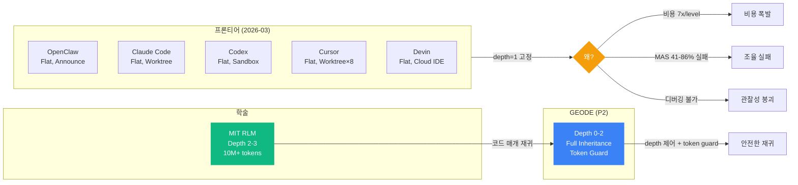

# 서브에이전트 시스템의 진화 — task_handler에서 Full AgenticLoop 상속, 그리고 재귀 컨텍스트 확장까지

> Date: 2026-03-15 | Author: geode-team | Tags: sub-agent, recursive-agent, RLM, context-window, agentic-loop, architecture, decision-journal

## 목차

1. 도입: 서브에이전트는 "작은 에이전트"가 아니다
2. 발전 과정 — 3세대 아키텍처
3. 분기점 1: task_handler vs Full AgenticLoop
4. 분기점 2: 재귀 depth 허용 vs Flat 고정
5. 분기점 3: 결과 표준화와 토큰 가드
6. 프론티어 벤치마크 — 왜 모두 Flat인가
7. RLM 패러다임 — 코드 매개 재귀와 무한 컨텍스트
8. 비용 분석과 Sweet Spot
9. 마무리

---

## 1. 도입: 서브에이전트는 "작은 에이전트"가 아니다

이전 글([#24 SubAgent 아키텍처 의사결정 저널](24-subagent-architecture-decision-journal.md))에서 GEODE의 서브에이전트 시스템이 어떻게 태어났는지를 기록했습니다. `IsolatedRunner`, `CoalescingQueue`, OpenClaw 세션 키 격리까지 — v0.10.0에서 병렬 실행 기반이 갖춰졌습니다.

그런데 한 가지 근본적인 문제가 남아 있었습니다. **서브에이전트는 부모와 다른 존재였습니다.** 부모 AgenticLoop은 38개 도구, MCP 4개 서버, 스킬 시스템, 메모리, HITL 게이트를 갖춘 완전한 에이전트였지만, 서브에이전트는 `analyze`/`search`/`compare`/`report` 네 가지 함수만 호출할 수 있는 단순한 작업자였습니다.

이 글은 그 서브에이전트가 부모와 **동일한 AgenticLoop**을 상속받는 완전한 에이전트로 진화한 과정, 그리고 재귀 호출을 통해 이론적으로 컨텍스트 제한을 넘어서는 설계까지의 여정을 기록합니다.

---

## 2. 발전 과정 — 3세대 아키텍처

### 1세대: 함수 호출 (v0.8.0)

```
AgenticLoop → delegate_task → task_handler("analyze", args)
                                ↓
                          _run_analysis(ip_name, dry_run=True)
                                ↓
                          return {"tier": "S", "score": 81.3}
```

> `make_pipeline_handler()`가 4가지 task_type을 라우팅하는 단순 함수였습니다. 서브에이전트는 에이전트가 아니라 **함수 호출 프록시**에 불과했습니다. 웹 검색도, 메모리 조회도, 다른 도구 호출도 불가능했습니다.

### 2세대: 병렬 + 세션 격리 (v0.10.0)

```
AgenticLoop → delegate_task → SubAgentManager.delegate(tasks)
  → IsolatedRunner.run_async() × N (MAX_CONCURRENT=5)
    → _execute_subtask() [thread-isolated]
      → task_handler(task_type, args)  # 여전히 4가지 함수만
  → CoalescingQueue (dedup)
  → TaskGraph (DAG)
  → HookEvent.SUBAGENT_STARTED/COMPLETED/FAILED
```

> v0.10.0에서 병렬 실행, 중복 제거, DAG 의존성, 훅 이벤트가 추가되었습니다. 하지만 실행 단위 자체는 여전히 단순 함수였습니다. [#24 의사결정 저널](24-subagent-architecture-decision-journal.md)에서 이 시점의 7개 분기점을 다루었습니다.

### 3세대: Full AgenticLoop 상속 (v0.10.1, P2)

```
AgenticLoop (depth=0, 16K tokens, 15 rounds)
  → delegate_task
    → AgenticLoop (depth=1, 8K tokens, 10 rounds)
        ├─ 동일 action_handlers (38+ tools)
        ├─ 동일 MCP (Brave, Steam, arXiv, Playwright)
        ├─ 동일 skill_registry
        ├─ 동일 Memory ContextVars (ProjectMemory, OrgMemory)
        ├─ 독립 ConversationContext (별도 context window)
        ├─ 자체 ToolExecutor (auto_approve=True)
        └─ depth < max_depth(2) → 재귀 delegate_task 가능
             → AgenticLoop (depth=2) → delegate_task 차단
```

> 이것이 이번 글의 핵심 변경입니다. 서브에이전트가 부모의 모든 요소를 **그대로 상속**받습니다. 이제 서브에이전트 안에서 웹 검색을 하고, Steam 데이터를 조회하고, 메모리에 접근하고, 심지어 또 다른 서브에이전트를 호출할 수 있습니다.

---

## 3. 분기점 1: task_handler vs Full AgenticLoop

### 선택지

| 옵션 | 설명 | 장점 | 단점 |
|------|------|------|------|
| **A. task_handler 유지** | 기존 4가지 함수 라우터 유지 | 단순, 빠름, 비용 낮음 | 도구 없음, 확장 불가, 리서치 불가 |
| **B. MiniAgenticLoop 신규** | 경량 에이전트 루프 별도 구현 | 서브에이전트 전용 최적화 가능 | 코드 중복, 유지보수 2배, 분기 복잡도 |
| **C. Full AgenticLoop 상속** | 부모와 동일한 AgenticLoop 재사용 | 완전한 에이전트, 코드 중복 없음 | 비용 높음, 재귀 제어 필요 |

### 결정: C — Full AgenticLoop 상속

```python
# core/cli/sub_agent.py — _execute_with_agentic_loop()
def _execute_with_agentic_loop(self, task: SubTask) -> str:
    _propagate_context_vars()

    conversation = ConversationContext(max_turns=10)

    child_sam = None
    if self._depth < self._max_depth:
        child_sam = SubAgentManager(
            runner=IsolatedRunner(),
            action_handlers=self._action_handlers,
            depth=self._depth + 1,
            max_depth=self._max_depth,
            ...
        )

    executor = ToolExecutor(
        action_handlers=self._action_handlers,
        sub_agent_manager=child_sam,
        auto_approve=True,
    )

    loop = AgenticLoop(
        conversation, executor,
        max_rounds=settings.subagent_max_rounds,
        max_tokens=settings.subagent_max_tokens,
        mcp_manager=self._mcp_manager,
        skill_registry=self._skill_registry,
    )

    agentic_result = loop.run(task.description)
    ...
```

> 옵션 B(MiniAgenticLoop)를 초기에 검토했지만, 결국 "서브에이전트는 부모와 동일한 존재여야 한다"는 원칙 하에 기존 `AgenticLoop`을 그대로 재사용하는 방향으로 결정했습니다.
>
> **핵심 근거**: 별도 클래스를 만들면 AgenticLoop의 변경이 생길 때마다 MiniAgenticLoop도 동기화해야 합니다. 이는 정확히 "두 번째 진실의 원천"을 만드는 것이고, 시간이 지나면 반드시 발산합니다.

### 트레이드오프

| 얻은 것 | 잃은 것 |
|---------|---------|
| 서브에이전트에서 38+ 도구 사용 가능 | API 호출 비용 증가 (서브에이전트 당 1-2회 LLM 호출) |
| MCP, 스킬, 메모리 접근 | 단순 함수 대비 latency 증가 |
| 재귀 서브에이전트 가능 | depth 제어 로직 필요 |
| 코드 중복 제거 (단일 AgenticLoop) | `auto_approve=True`로 HITL 스킵 (보안 고려) |

---

## 4. 분기점 2: 재귀 depth 허용 vs Flat 고정

### 프론티어의 선택: 모두 Flat

2026년 3월 기준, **모든 프론티어 에이전트 시스템이 depth=1(Flat)을 고정**하고 있습니다.

| 시스템 | Depth | 제한 방식 |
|--------|-------|----------|
| Claude Code | 1 | Agent tool이 서브에이전트 내부에 노출되지 않음 (Issue #4182, #19077) |
| OpenClaw | 1 | 명시적 Flat 계층 — 서브에이전트가 서브에이전트 호출 불가 |
| Codex | 1 | Multi-agent는 실험적 기능, 재귀 미지원 |
| Cursor | 1 | Git worktree 기반 병렬, 수동 머지 |
| Devin | 1 | Cloud IDE 격리, 단일 계층 |

### GEODE의 선택: 제어된 재귀 (max_depth=2)

```python
# core/config.py
max_subagent_depth: int = 2   # root(0) → child(1) → grandchild(2)까지 허용
max_total_subagents: int = 15  # 세션 내 총 서브에이전트 수 제한
```

> 프론티어가 Flat을 선택한 이유는 크게 5가지입니다:
>
> 1. **비용 폭발** (7x/level)
> 2. **관찰성 붕괴** (depth 2+에서 디버깅 불가)
> 3. **Inter-agent misalignment** (MAS 실패율 41-86.7%, arXiv:2503.13657)
> 4. **추론 모델(o1/o3)이 내부적으로 재귀를 대체**
> 5. **모델 능력 문턱** (72B+ 에서만 계층 구조 유효)
>
> 하지만 GEODE는 이 중 1, 2, 3번을 설계로 완화할 수 있다고 판단했습니다.

### 재귀 안전 장치

| 장치 | 메커니즘 |
|------|----------|
| **depth 제어** | `depth < max_depth`일 때만 자식 `SubAgentManager`에 `delegate_task` 포함. `depth >= max_depth`이면 도구 자체가 없으므로 LLM이 호출 시도 불가 |
| **총수 제한** | `max_total_subagents=15`로 세션 내 폭발 방지 |
| **라운드 축소** | 서브에이전트는 `max_rounds=10` (부모는 15). depth 증가에 따라 라운드 예산 감소 |
| **토큰 가드** | `_guard_tool_result()`가 4096 토큰 초과 결과를 summary로 압축. 부모 context 폭발 방지 |
| **HITL 스킵** | `auto_approve=True`로 서브에이전트 내부 승인 프롬프트 제거 (부모 레벨에서 이미 위임 승인됨) |

### 왜 Flat이 아닌가

```
Flat (depth=1):
  AgenticLoop → delegate_task → 함수 호출 → 결과
  유효 컨텍스트 = 1 × 200K = 200K

재귀 (depth=2):
  AgenticLoop(0) → delegate_task
    → AgenticLoop(1) → delegate_task
      → AgenticLoop(2) → 결과
  유효 컨텍스트 = 3 × 200K = 600K (각 레벨이 독립 context window)
```

> 이것이 이번 설계에서 가장 중요한 통찰입니다. **각 서브에이전트가 독립 context window를 가지므로, 재귀 depth가 깊어질수록 유효 컨텍스트 용량이 선형 증가합니다.** 정보 손실(compression)만이 유일한 제약이지, context 크기가 아닙니다.

---

## 5. 분기점 3: 결과 표준화와 토큰 가드

### 문제: 결과 형태 불일치 + context 폭발

AS-IS에서 `delegate_task`의 반환 형태가 단건과 배치에서 달랐습니다.

```python
# AS-IS: 단건
{"result": {"tier": "S", "score": 81.3}, "task_id": "delegate_1"}

# AS-IS: 배치
{"results": [...], "total": 5, "succeeded": 3}
```

> LLM 입장에서 응답 구조가 일관되지 않으면 파싱 실패 확률이 높아집니다. 프론티어 시스템 전체가 이 문제를 미해결 상태로 두고 있다는 점에서, GEODE가 선제적으로 표준화하면 차별점이 됩니다.

### SubAgentResult 표준 스키마

```python
# core/cli/sub_agent.py
@dataclass
class SubAgentResult:
    task_id: str
    task_type: str
    status: Literal["ok", "error", "timeout", "partial"]
    depth: int = 0
    summary: str = ""          # 항상 존재 — 토큰 가드 시 보존 대상
    data: dict[str, Any] = field(default_factory=dict)
    duration_ms: float = 0.0
    error_category: str | None = None
    error_message: str | None = None
    retryable: bool = False
```

> `summary` 필드가 핵심입니다. 토큰 가드가 발동해 `data`가 잘려도 `summary`는 항상 보존됩니다. 이는 LLM이 서브에이전트 결과를 빠르게 파악할 수 있는 최소한의 정보를 보장합니다.

### ErrorCategory — 에러 분류와 재시도 정책

```python
class ErrorCategory(StrEnum):
    TIMEOUT = "timeout"          # 재시도 가능
    API_ERROR = "api_error"      # 재시도 가능 (2회)
    VALIDATION = "validation"    # 재시도 무의미
    RESOURCE = "resource"        # 재시도 무의미
    DEPTH_EXCEEDED = "depth_exceeded"  # 재귀 한도 초과
    UNKNOWN = "unknown"          # 1회 재시도
```

> OpenClaw에서 무한 재시도 루프 버그(Issue #41291)가 보고된 바 있습니다. `VALIDATION` 에러에 재시도를 걸면 동일한 문제가 발생합니다. 에러 유형별 재시도 정책을 분리한 이유입니다.

### 토큰 가드 — context 폭발 방지

```python
# core/cli/agentic_loop.py
MAX_TOOL_RESULT_TOKENS = 4096

def _guard_tool_result(result: dict[str, Any]) -> dict[str, Any]:
    serialized = json.dumps(result, ensure_ascii=False, default=str)
    estimated_tokens = len(serialized) // 4
    if estimated_tokens <= MAX_TOOL_RESULT_TOKENS:
        return result
    if "summary" in result:
        return {
            "summary": result["summary"],
            "_truncated": True,
            "_original_tokens": estimated_tokens,
        }
    return {"_truncated": True, "preview": serialized[:16000]}
```

> Claude Code에서 서브에이전트 결과 반환 시 context overflow 버그가 보고되었습니다. 50-100K 토큰 결과가 부모의 context를 한 번에 채워버리는 문제입니다. GEODE는 tool_result 레벨에서 가드를 설치하여 이를 예방합니다.

### 응답 통일

```python
# core/cli/tool_executor.py — 단건이든 배치든 동일 구조
{
    "tasks": [sub_result.to_dict() for sub_result in results],
    "total": len(results),
    "succeeded": succeeded,
    "summary": "3/5 tasks completed. [task_0:ok, task_1:error, ...]"
}
```

---

## 6. 프론티어 벤치마크 — 왜 모두 Flat인가

2026년 3월 15일 기준 6개 시스템을 조사했습니다.



프론티어 시스템이 depth=1을 고정하는 것은 미성숙이 아니라 **의도적 결정**입니다. 하지만 GEODE는 토큰 가드, depth 제어, 결과 표준화로 그 위험을 완화할 수 있다고 판단했습니다.

| 차원 | OpenClaw | Claude Code | Codex | GEODE (P2) |
|------|----------|-------------|-------|------------|
| **계층 깊이** | 1 | 1 | 1 | **2 (설정 가능)** |
| **서브에이전트 도구** | 없음 | Final msg만 | 미공개 | **부모 전체 상속** |
| **결과 표준화** | Text | Text | LLM 종합 | **SubAgentResult** |
| **토큰 가드** | 없음 | 없음 (버그) | Compaction | **4096 토큰 가드** |
| **에러 분류** | Backoff (버그) | Recovery hooks | HTTP retry | **ErrorCategory 5종** |
| **ContextVar 전파** | Session-level | Worktree | Sandbox | **명시적 전파** |

---

## 7. RLM 패러다임 — 코드 매개 재귀와 무한 컨텍스트

### 핵심 명제

> 각 서브에이전트가 독립 context window를 갖고, 재귀적으로 서브에이전트를 호출할 수 있다면, 유효 컨텍스트 용량은 이론적으로 무한해진다. 정보 손실만이 유일한 제약이지 context 크기가 아니다.

이 명제는 MIT의 RLM 논문(arXiv:2512.24601)이 실증적으로 증명했습니다. BrowseComp-Plus 벤치마크에서 6-11M 토큰 입력을 처리하여 base GPT-5가 0%인 문제에서 **91.33% 정확도**를 달성했습니다.

### 두 가지 재귀 패러다임

```
에이전트 프로토콜 재귀:
  Agent A → spawn Agent B → spawn Agent C
  비용: 7x/level (각 에이전트가 전체 context 복제)
  문제: 관찰성 붕괴, 조율 실패 (MAS 실패율 41-86.7%)

코드 매개 재귀 (RLM):
  LLM → Python 코드 생성 → 데이터 필터링 → 청크별 재귀 LLM 호출
  비용: 입력의 0.03% (코드가 불필요한 데이터를 사전 제거)
  결과: 10M+ 토큰 처리, 91.33% 정확도
```

> RLM의 핵심 통찰은 **LLM이 코드로 데이터를 필터한 후 재귀 호출**한다는 점입니다. 전통적 요약(lossy compression)이 아니라, 프로그래밍적 필터링(lossless selection)으로 관련 청크만 추출합니다. 이 차이가 비용을 7x/level에서 0.03%로 줄입니다.

### GEODE에서 RLM이 가능한 이유

GEODE는 이미 RLM의 세 가지 구성 요소를 갖추고 있습니다.

| RLM 요소 | GEODE 대응 | 상태 |
|----------|-----------|------|
| REPL/코드 실행 | `run_bash` 도구 | 구현됨 |
| 재귀 LLM 호출 | `delegate_task` + depth 제어 | **P2에서 구현** |
| 파일 읽기/저장 | `read_document` 도구 | 구현됨 |

부족한 것은 **RLM 패턴을 명시적으로 안내하는 프롬프트 엔지니어링**입니다. 이것은 P2-D(향후)에서 스킬이나 시스템 프롬프트로 제공할 예정입니다.

---

## 8. 비용 분석과 Sweet Spot

### 에이전트 프로토콜 재귀 vs RLM 코드 매개 재귀

| Depth | 에이전트 재귀 (7x/level) | RLM 코드 매개 | 절감률 |
|-------|------------------------|---------------|--------|
| 0 (root) | $0.01 | $0.01 | — |
| 1 (fan-out 5) | $0.07 | $0.015 | 78% |
| 2 (fan-out 5×3) | $0.49 | $0.025 | 95% |
| 3 | $3.43 | $0.04 | 99% |

> 나이브한 에이전트 재귀는 depth 3에서 $3.43에 달하지만, RLM은 코드 필터링 덕분에 $0.04에 머뭅니다. GEODE의 현재 구현은 에이전트 프로토콜 재귀이므로 depth 2까지가 현실적인 비용 한계입니다. P2-D에서 RLM 패턴을 도입하면 depth 3+도 실용적이 됩니다.

### Sweet Spot

| 깊이 | 적합한 작업 | GEODE 설정 |
|------|-----------|-----------|
| **Depth 0** | 단일 도구 호출, 직접 응답 | 기본 |
| **Depth 1** | IP 분석, 검색, 비교, 단순 리서치 | `delegate_task` 1회 |
| **Depth 2** | 배치 분석 종합, 멀티소스 리서치 | `max_subagent_depth=2` |
| **Depth 3+** | 10M+ 토큰 코퍼스 처리 | P2-D (RLM 패턴 필요) |

---

## 9. 마무리

### 핵심 정리

| 항목 | 값/설명 |
|------|---------|
| **AS-IS** | 서브에이전트 = 4가지 함수 호출 프록시 (도구 없음, 재귀 불가) |
| **TO-BE** | 서브에이전트 = 부모와 동일한 Full AgenticLoop (38+ tools, MCP, 재귀 depth 2) |
| **SubAgentResult** | 표준 스키마 — `summary` 항상 보존, `ErrorCategory` 5종, `depth` 추적 |
| **토큰 가드** | 4096 토큰 초과 시 `summary` 보존 truncation — context 폭발 방지 |
| **재귀 안전장치** | `max_depth=2`, `max_total_subagents=15`, 라운드 축소 (15→10) |
| **프론티어 대비** | 유일하게 depth>1 허용 + 결과 표준화 + 토큰 가드 조합 |
| **이론적 근거** | RLM(arXiv:2512.24601) — 재귀 = 무한 컨텍스트, 정보 손실만이 제약 |

### 설계 결정 체크리스트

- [x] task_handler → Full AgenticLoop 상속 (코드 중복 없이 기존 클래스 재사용)
- [x] 재귀 depth 2 허용 (프론티어는 1 고정, GEODE는 토큰 가드로 위험 완화)
- [x] SubAgentResult 표준화 (업계 전체 미해결 — GEODE 선제 구현)
- [x] ErrorCategory 분류 (OpenClaw 무한 재시도 버그 방지)
- [x] ContextVar 명시 전파 (Python contextvars는 스레드 간 자동 상속 안 됨)
- [x] auto_approve=True (서브에이전트 HITL 스킵 — 부모에서 이미 위임 승인)
- [x] 기존 task_handler 호환 유지 (action_handlers 미제공 시 fallback)
- [ ] P2-D: RLM 코드 매개 재귀 (run_bash + delegate_task 조합 → 향후)

### 참조

- [#24 SubAgent 아키텍처 의사결정 저널](24-subagent-architecture-decision-journal.md)
- [MIT RLM — Recursive Language Models (arXiv:2512.24601)](https://arxiv.org/abs/2512.24601)
- [MAS Failure Taxonomy (arXiv:2503.13657)](https://arxiv.org/abs/2503.13657)
- Claude Code Sub-Agent Issues: [#4182](https://github.com/anthropics/claude-code/issues/4182), [#19077](https://github.com/anthropics/claude-code/issues/19077), [#4850](https://github.com/anthropics/claude-code/issues/4850)
- OpenClaw 무한 재시도 버그: [#41291](https://github.com/openclaw/openclaw/issues/41291)
- [P2 Plan: Sub-Agent Orchestration Hardening](../plans/P2-subagent-orchestration-hardening.md)

---

*Source: `blog/posts/orchestration/23-subagent-full-inheritance-recursive-context.md` | Category: [[blog-orchestration]]*

## Related

- [[blog-orchestration]]
- [[blog-hub]]
- [[geode]]
- [[geode-agentic-loop]]
