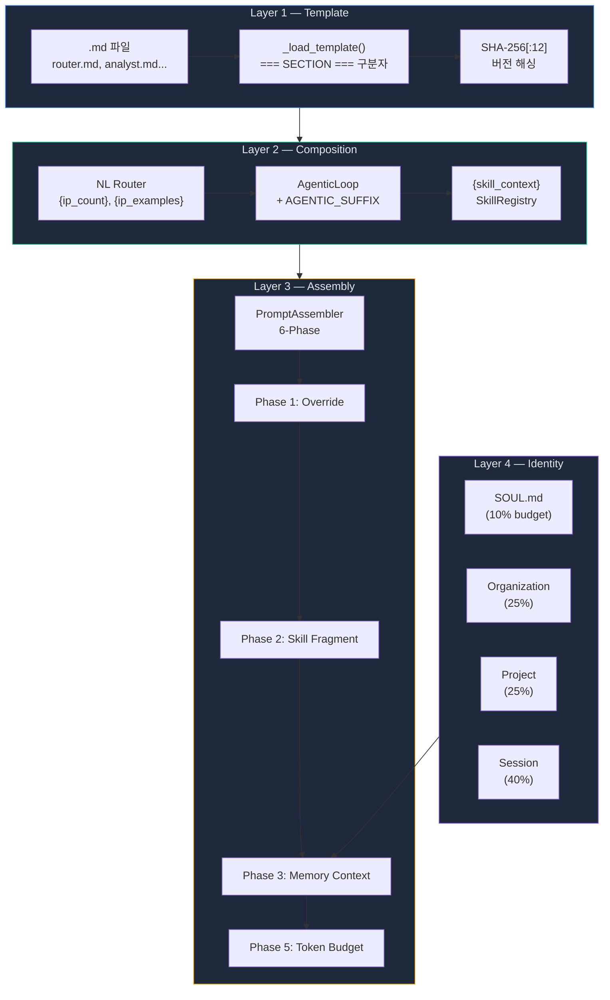
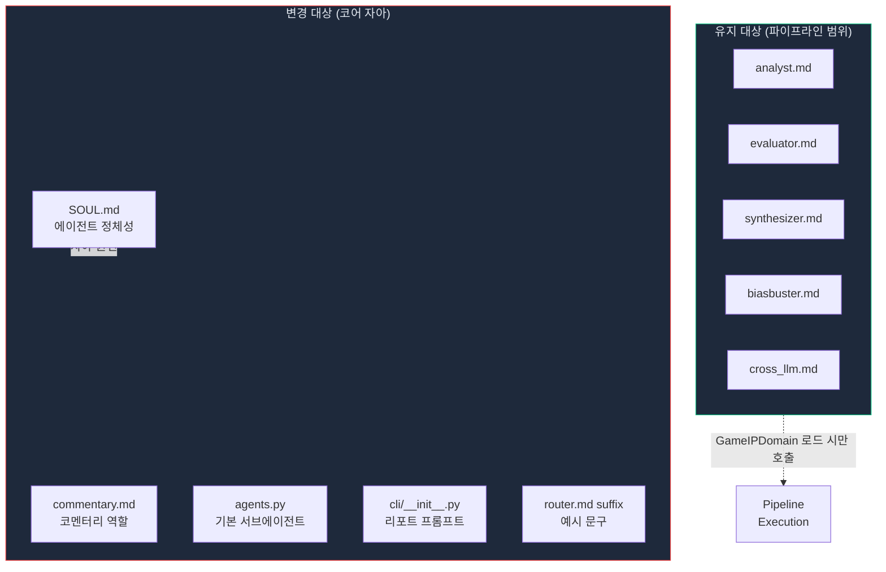

# 에이전트의 자아는 어디에 있는가 — 프롬프트 아키텍처와 Identity Pivot 설계기

> Date: 2026-03-15 | Author: geode-team | Tags: prompt-architecture, identity-pivot, karpathy-patterns, dumb-platform, context-budget, prompt-drift, soul-prompt, domain-plugin

## 목차

1. 도입 — 에이전트의 자아가 너무 크다
2. GEODE 프롬프트 아키텍처 — 4계층 조립 파이프라인
3. Karpathy 패턴이 알려준 것 — program.md, dumb platform, context budget
4. Identity Pivot 설계 — 무엇을 바꾸고 무엇을 남길 것인가
5. SOUL.md 재작성 — 에이전트의 단일 자아 원천
6. 프롬프트 Drift Detection — SHA-256 래칫과 CI 가드레일
7. 팀 기반 프롬프트 리팩토링 — 에이전트 4인 병렬 실행
8. 마무리 — 핵심 정리와 체크리스트

---

## 1. 도입 — 에이전트의 자아가 너무 크다

GEODE는 LangGraph 기반 자율 실행 에이전트입니다. 원래 게임 IP 가치 분석을 위해 설계되었고, `DomainPort` Protocol을 통해 도메인 플러그인 아키텍처를 도입한 상태였습니다. 그런데 코드 아키텍처는 범용으로 전환되었음에도, **시스템 프롬프트에는 여전히 "게임 IP 발굴 에이전트"라는 자아가 깊이 각인되어 있었습니다.**

문제를 구체적으로 살펴보면 이렇습니다.

| 파일 | 게임 IP 침투도 | 문제 |
|------|--------------|------|
| `.claude/SOUL.md` | 100% | "Game Entity Opportunity & Discovery Engine", NPV 공식, Tier 분류표 |
| `commentary.md` | 100% | "IP discovery assistant for game publishing" |
| `agents.py` 기본 에이전트 | 100% | anime_expert, game_analyst, market_researcher |
| `cli/__init__.py` 리포트 프롬프트 | 100% | "GEODE IP valuation expert" |
| `router.md` agentic suffix | 30% | 예시가 "분석해줘", "비교해줘" 등 IP 중심 |

`DomainPort`라는 깨끗한 추상화 계층을 만들어 놓고, 정작 에이전트가 자기 자신을 소개할 때는 "저는 게임 IP를 발굴하는 에이전트입니다"라고 말하고 있었습니다. **아키텍처와 자아의 불일치** — 이것이 이번 Identity Pivot의 출발점입니다.

---

## 2. GEODE 프롬프트 아키텍처 — 4계층 조립 파이프라인

해결책을 논하기 전에, GEODE의 프롬프트가 어떻게 조립되는지 이해해야 합니다. 단순히 `.md` 파일 하나를 읽어서 LLM에 넘기는 구조가 아닙니다. **4계층 조립 파이프라인**을 거칩니다.



각 계층의 역할을 코드와 함께 살펴보겠습니다.

### Layer 1 — Template: `.md` 파일과 해시 핀

프롬프트 템플릿은 `core/llm/prompts/` 디렉토리에 Markdown 파일로 저장됩니다. 각 파일은 `=== SECTION ===` 구분자로 섹션을 나눕니다.

```python
# core/llm/prompts/__init__.py
def _load_template(name: str) -> dict[str, str]:
    path = _PROMPTS_DIR / f"{name}.md"
    text = path.read_text(encoding="utf-8")
    sections: dict[str, str] = {}
    current_section = "default"
    for line in text.split("\n"):
        stripped = line.strip()
        if stripped.startswith("=== ") and stripped.endswith(" ==="):
            current_section = stripped[4:-4].strip().lower()
            sections[current_section] = ""
        else:
            sections[current_section] = sections.get(current_section, "") + line + "\n"
    return sections
```

> `=== SYSTEM ===`과 `=== USER ===` 구분자를 사용하면 하나의 `.md` 파일에 시스템 프롬프트와 유저 프롬프트를 함께 관리할 수 있습니다. `router.md`의 경우 `=== AGENTIC_SUFFIX ===`라는 커스텀 섹션까지 포함합니다. 이 구조 덕분에 프롬프트의 논리적 단위가 파일 단위와 일치합니다.

로딩 시점에 모든 프롬프트 섹션의 SHA-256 해시(12자리)를 계산하여 `PROMPT_VERSIONS` dict에 저장합니다.

```python
# core/llm/prompts/__init__.py
def _hash_prompt(text: str) -> str:
    return hashlib.sha256(text.encode()).hexdigest()[:12]
```

이 해시는 Layer 4의 Drift Detection에서 다시 등장합니다.

### Layer 2 — Composition: Router + AgenticLoop

NL Router가 기본 시스템 프롬프트를 구성하고, AgenticLoop가 AGENTIC_SUFFIX를 덧붙이는 2단계 조립입니다.

```python
# core/cli/agentic_loop.py
def _build_system_prompt(self) -> str:
    base = _build_system_prompt()  # NL Router에서 가져옴
    skill_ctx = self._skill_registry.get_context_block()
    base = base.replace("{skill_context}", skill_ctx or "No skills loaded.")
    return base + "\n" + AGENTIC_SUFFIX
```

> `{skill_context}`는 ROUTER_SYSTEM 안의 플레이스홀더입니다. AgenticLoop가 이를 SkillRegistry의 현재 상태로 치환합니다. 스킬이 로드되지 않았으면 "No skills loaded."로 대체됩니다. **런타임에 동적으로 조합되는 프롬프트**입니다.

### Layer 3 — Assembly: PromptAssembler의 6-Phase

`PromptAssembler`는 최종 프롬프트를 6단계에 걸쳐 조립합니다.

| Phase | 역할 | 입력 |
|-------|------|------|
| 1 | Override 주입 | `state["_prompt_overrides"]` |
| 2 | Skill Fragment 주입 | `SkillRegistry.get_skills(node, role_type)` |
| 3 | Memory Context 주입 | `state["memory_context"]["_llm_summary"]` |
| 4 | Bootstrap Instructions | `state["_extra_instructions"]` |
| 5 | Token Budget 강제 | 경고 4K / 하드 6K chars |
| 6 | Hash + Observability | `PROMPT_ASSEMBLED` 훅 이벤트 발행 |

```python
# core/llm/prompt_assembler.py — Phase 5
if len(system) > self._prompt_hard_limit_chars:
    system = system[:self._prompt_hard_limit_chars]
    truncation_events.append("system_truncated")
    _log.warning("System prompt truncated: %d → %d chars", original_len, len(system))
```

> Phase 5의 토큰 버짓 강제는 Karpathy의 "context budget" 원칙을 구현한 것입니다. 스킬, 메모리, 부트스트랩 지시가 누적되면서 프롬프트가 비대해지는 것을 구조적으로 방지합니다.

### Layer 4 — Identity: SOUL.md와 3-Tier 메모리

SOUL.md는 `ContextAssembler`를 통해 메모리 컨텍스트의 일부로 주입됩니다. 핵심은 **비례 예산 배분**입니다.

```python
# core/memory/context.py
def _build_llm_summary(context: dict, max_chars: int = 280) -> str:
    budget_soul    = int(max_chars * 0.10)   # ~28자 — 미션 한 줄
    budget_org     = int(max_chars * 0.25)   # ~70자
    budget_proj    = int(max_chars * 0.25)   # ~70자
    budget_session = max_chars - sum(...)     # ~112자
```

> SOUL.md에는 전체 예산의 **10%만** 할당됩니다. 이것은 의도적인 설계입니다. 에이전트의 자아는 "나는 누구인가"를 한 줄로 말할 수 있어야 하고, 나머지 90%는 현재 맥락에 써야 합니다. **자아가 컨텍스트를 잡아먹으면 안 됩니다.**

---

## 3. Karpathy 패턴이 알려준 것

Identity Pivot의 설계 근거는 Karpathy의 autoresearch/AgentHub에서 증류한 에이전트 설계 원칙에서 왔습니다.

### P2. program.md = single source of identity

> "program.md의 품질이 에이전트의 연구 품질을 결정한다."

GEODE에서 SOUL.md가 바로 이 역할입니다. SOUL.md가 "게임 IP 발굴"을 mission으로 선언하면, 하위의 모든 프롬프트가 그 프레임 안에서 동작합니다. **자아의 원천이 하나**이므로, 이 하나만 바꾸면 에이전트 전체의 행동 방향이 전환됩니다.

### P8. Dumb Platform, Smart Plugins

> "플랫폼은 라우팅, 동시성, 이벤트, 오케스트레이션만 제공한다. 도메인 지식은 플러그인이 가져온다."

GEODE의 `DomainPort` Protocol이 이미 이 패턴을 구현하고 있었습니다. 문제는 프롬프트 레이어가 이 분리를 따르지 않았다는 것입니다. SOUL.md에 14-axis 루브릭이 하드코딩되어 있으면, game_ip 플러그인이 로드되지 않아도 에이전트는 여전히 "게임 IP 분석 에이전트"로 행동합니다.

### P6. Context Budget

> "컨텍스트 윈도우는 유한한 자원이다. 3계층으로 관리하라: 차단(block), 선택적 추출(selective), 요약(summarize)."

이것이 PromptAssembler의 Phase 5 (토큰 버짓)와 `_build_llm_summary`의 비례 예산 배분으로 구현되어 있습니다. **범용 요청에 게임 IP 프롬프트가 컨텍스트를 낭비하지 않도록** 분리해야 합니다.

### P4. Ratchet

> "수정 → 평가 → 개선이면 유지, 아니면 롤백."

프롬프트 변경에 대한 래칫은 SHA-256 해시 핀으로 구현됩니다. 의도하지 않은 프롬프트 변경은 CI에서 즉시 감지됩니다. 이번 Identity Pivot에서 2개의 해시 핀(`AGENTIC_SUFFIX`, `COMMENTARY_SYSTEM`)을 의도적으로 업데이트했습니다.

---

## 4. Identity Pivot 설계 — 무엇을 바꾸고 무엇을 남길 것인가

모든 프롬프트를 바꾸는 것은 아닙니다. 핵심은 **스코프 판정**입니다.



판정 기준은 단순합니다:

| 질문 | 변경 대상 | 유지 대상 |
|------|----------|----------|
| 도메인 플러그인 없이도 호출되는가? | Yes → 변경 | No → 유지 |
| 에이전트의 자기 정의에 영향을 주는가? | Yes → 변경 | No → 유지 |

`analyst.md`는 파이프라인 노드에서만 호출되고, `GameIPDomain`이 로드된 상태에서만 실행됩니다. 이미 올바른 스코프에 있으므로 변경할 이유가 없습니다.

---

## 5. SOUL.md 재작성 — 에이전트의 단일 자아 원천

### Before

```markdown
> **System**: GEODE (Game Entity Opportunity & Discovery Engine)
> **Organization**: Nexon Live 본부 > Navigator 실 > Navigator A팀
> **Mission**: 저평가 IP 발굴 및 게임화 가치 추론

## Identity
GEODE는 넥슨 Navigator A팀의 IP 가치 분석 에이전트다.
600K+ 게임·미디어 IP 풀에서 저평가된 IP를 발굴하고,
게임화 시 기대 수익(NPV 3년)을 추론하여 투자 의사결정을 지원한다.

## Pipeline Contract
S = w_ml × Φ_ml + w_llm × Φ_llm + δ_cal
Value(g) = E[NPV_3Y] - CAC - UA - LiveOps - 0.2×VaR_5%
```

### After

```markdown
> **System**: GEODE — 범용 자율 실행 에이전트
> **Mission**: Research, analysis, automation, scheduling — 사용자의 목표를 자율적으로 실행

## Identity
GEODE는 범용 자율 실행 에이전트다.
사용자의 요청을 이해하고, 적절한 도구와 도메인 플러그인을 조합하여
리서치, 분석, 자동화, 스케줄링 등 다양한 작업을 자율적으로 수행한다.
도메인 지식은 플러그인으로 분리되어, 플랫폼 자체는 도메인에 구애받지 않는다.

## Domain Plugins
| Plugin | 설명 | 상태 |
|--------|------|------|
| `game_ip` | 게임·미디어 IP 가치 분석 (14-axis 루브릭) | available |
| `web_research` | 웹 검색·요약·팩트체크 | planned |
| `scheduler` | 일정 관리·리마인더·반복 작업 자동화 | planned |
| `code_analysis` | 코드베이스 분석·리뷰·리팩토링 제안 | planned |
```

> 핵심 변경은 세 가지입니다. 첫째, NPV 공식과 Tier 분류표(GREEN/YELLOW/RED)를 제거했습니다. 이 정보는 `GameIPDomain` 플러그인이 소유합니다. 둘째, Pipeline Contract를 "Pre-filter → T1 ML → T2 LLM-as-Judge → ..."라는 게임 IP 전용 6단계에서 "Router → Domain Analysis → Verification → Synthesis"라는 범용 4단계로 일반화했습니다. 셋째, Domain Plugins 섹션을 추가하여 `game_ip`를 "여러 플러그인 중 하나"로 격하했습니다.

Core Principles(Evidence-Based, Bias-Aware, Multi-Perspective, Graceful Degradation, Reproducibility)와 Guardrails(G1-G4)는 **도메인에 무관한 품질 원칙**이므로 그대로 유지했습니다.

---

## 6. 프롬프트 Drift Detection — SHA-256 래칫과 CI 가드레일

프롬프트를 변경하면 해시 핀이 깨집니다. 이것은 **의도된 안전장치**입니다.

```python
# core/llm/prompts/__init__.py
_PINNED_HASHES: dict[str, str] = {
    "AGENTIC_SUFFIX": "0ee9671c2c0f",     # ← 이번에 업데이트됨
    "COMMENTARY_SYSTEM": "b7d886e0905a",   # ← 이번에 업데이트됨
    "ANALYST_SYSTEM": "924433f5bf11",
    "ROUTER_SYSTEM": "67d070bce2fc",
    # ... 총 20개 프롬프트 프래그먼트
}

def verify_prompt_integrity(*, raise_on_drift: bool = False) -> list[str]:
    drifted = []
    for name, pinned_hash in _PINNED_HASHES.items():
        computed = _hash_prompt(globals()[name])
        if computed != pinned_hash:
            drifted.append(f"Prompt drift: {name} pin={pinned_hash} now={computed}")
    if drifted and raise_on_drift:
        raise RuntimeError(f"Prompt drift detected: {', '.join(drifted)}")
    return drifted
```

> CI 테스트(`test_karpathy_prompt_hardening.py`)에서 `verify_prompt_integrity(raise_on_drift=True)`를 호출합니다. 프롬프트 `.md` 파일을 수정했는데 해시 핀을 업데이트하지 않으면 테스트가 실패합니다. 이것이 Karpathy P4 래칫의 구현입니다 — **의도적 변경만 통과시키고, 무의식적 drift는 차단합니다.**

이번 Identity Pivot에서 실제로 경험한 플로우입니다:

```
1. commentary.md 수정 → "IP discovery assistant" → "autonomous analysis assistant"
2. router.md AGENTIC_SUFFIX 수정 → 예시 문구 범용화
3. pytest 실행 → RuntimeError: Prompt drift detected: AGENTIC_SUFFIX, COMMENTARY_SYSTEM
4. 새 해시 계산: python -c "from core.llm.prompts import PROMPT_VERSIONS as V; print(V)"
5. _PINNED_HASHES 업데이트 → 테스트 통과
```

해시 핀을 업데이트하는 행위 자체가 **"이 프롬프트 변경은 의도적입니다"라는 명시적 선언**이 됩니다.

---

## 7. 팀 기반 프롬프트 리팩토링 — 에이전트 4인 병렬 실행

이번 Identity Pivot은 4개의 에이전트를 팀으로 구성하여 병렬 실행했습니다. 각 에이전트에 하나의 스킬만 주입하여 관점을 분리했습니다.

| Agent | Skill Injection | 담당 파일 | 설계 원칙 |
|-------|----------------|----------|----------|
| Core Identity Lead | `karpathy-patterns` | SOUL.md, router.md suffix | "program.md = single identity source" |
| Prompt Engineer | `prompt-engineering` | commentary.md, cli/__init__.py | 도메인 특화 용어 제거 |
| Sub-Agent Architect | `openclaw-patterns` | agents.py, sub_agent.py | "dumb platform, smart plugins" |
| UX Writer | — | README.md CLI Mode | 자연어 예시 혼합 |

### 기본 서브에이전트 교체

Sub-Agent Architect가 수행한 변경입니다.

```python
# core/extensibility/agents.py — Before
_DEFAULT_AGENTS = [
    {"name": "anime_expert", "role": "Anime & Manga IP Specialist", ...},
    {"name": "game_analyst", "role": "Game Industry Analyst", ...},
    {"name": "market_researcher", "role": "Market Research Specialist", ...},
]

# After
_DEFAULT_AGENTS = [
    {"name": "research_assistant", "role": "Research Specialist", ...},
    {"name": "data_analyst", "role": "Data Analysis Specialist", ...},
    {"name": "web_researcher", "role": "Web Research & Monitoring Specialist", ...},
]
```

> 기본 서브에이전트는 **플랫폼이 제공하는 범용 도구**입니다. 도메인 전문 서브에이전트(anime_expert 등)는 `.claude/agents/anime_expert.md`와 같이 파일 기반으로 로드할 수 있습니다. `SubagentLoader`가 YAML frontmatter + Markdown body 형식의 에이전트 정의 파일을 자동 탐색합니다. 이것이 OpenClaw Plugin Architecture의 "Workspace Skills (highest priority)" 패턴과 동일한 구조입니다.

### 피드백 루프

각 에이전트 작업 후 5단계 검증을 실행했습니다.

```
[Step 1] ruff lint → E501 (line too long) 1건 → 수정
[Step 2] prompt drift test → AGENTIC_SUFFIX, COMMENTARY_SYSTEM 핀 깨짐 → 해시 재계산
[Step 3] grep "anime_expert|game_analyst|market_researcher" → 4개 잔존 파일 발견 → 동기화
         - core/cli/sub_agent.py (_TYPE_AGENT_MAP)
         - tests/test_agents_ext.py (load_defaults assert)
         - tests/test_e2e_live_llm.py (agent_name assert)
         - tests/test_karpathy_prompt_hardening.py (fixture text)
[Step 4] 전체 테스트 → all pass
[Step 5] grep "IP valuation expert|game publishing|Game Entity" core/ → 0 hits
```

> Step 3이 가장 중요합니다. 에이전트 이름을 바꾸면 그 이름을 참조하는 모든 코드를 찾아야 합니다. `_TYPE_AGENT_MAP`은 task type("analyze", "search")을 기본 에이전트에 매핑하는 dict인데, 여기를 놓치면 런타임에 `KeyError`가 발생합니다.

---

## 8. 마무리

### 핵심 정리

| 항목 | 설명 |
|------|------|
| **문제** | 코드 아키텍처(DomainPort)는 범용이지만, 프롬프트 자아는 "게임 IP 전용"으로 고정 |
| **원칙** | Karpathy P2 (단일 자아 원천), P8 (dumb platform), P6 (context budget), P4 (ratchet) |
| **변경 범위** | 코어 자아 5개 파일 + 테스트 동기화 3개 + 해시 핀 1개 = 11개 파일 |
| **유지 범위** | 파이프라인 프롬프트 5개 (analyst/evaluator/synthesizer/biasbuster/cross_llm) — 이미 올바른 스코프 |
| **핵심 판정 기준** | "도메인 플러그인 없이도 호출되는가?" → Yes면 변경, No면 유지 |
| **안전장치** | SHA-256[:12] 해시 핀 + CI drift detection + grep 잔존 참조 검사 |
| **프롬프트 조립** | 4계층 파이프라인 (Template → Composition → Assembly → Identity) |
| **SOUL.md 예산** | 전체 메모리 컨텍스트의 10% — 자아는 한 줄로 말할 수 있어야 함 |

### 체크리스트

- [x] SOUL.md에서 도메인 특화 공식(NPV, Selection Score) 제거
- [x] SOUL.md에 Domain Plugins 섹션 추가 (game_ip = one of many)
- [x] router.md AGENTIC_SUFFIX 예시를 범용으로 교체
- [x] commentary.md에서 "game publishing" 제거
- [x] 기본 서브에이전트를 범용(research/data/web)으로 교체
- [x] CLI 리포트 프롬프트에서 "IP valuation" 제거
- [x] 프롬프트 해시 핀 업데이트 (2개)
- [x] 기존 에이전트명 참조 전수 grep → 0 hits 확인
- [x] 파이프라인 프롬프트는 변경하지 않음 (스코프 확인)
- [x] 전체 테스트 pass

### References

- Karpathy, A. (2025). "autoresearch: Self-Supervised ML Research Loop." San Francisco.
- Karpathy, A. (2025). "AgentHub: Agent-Native Git Infrastructure." San Francisco.
- GEODE `.claude/skills/karpathy-patterns/SKILL.md` — P2, P4, P6, P8 원칙
- GEODE `.claude/skills/openclaw-patterns/SKILL.md` — Plugin Architecture, Policy Chain
- GEODE `core/llm/prompt_assembler.py` — 6-Phase Assembly Pipeline
- GEODE `core/memory/context.py` — 3-Tier Memory with proportional budget allocation

---

*Source: `blog/posts/memory-context/24-prompt-architecture-identity-pivot.md` | Category: [[blog-memory-context]]*

## Related

- [[blog-memory-context]]
- [[blog-hub]]
- [[geode]]
- [[geode-memory-system]]
