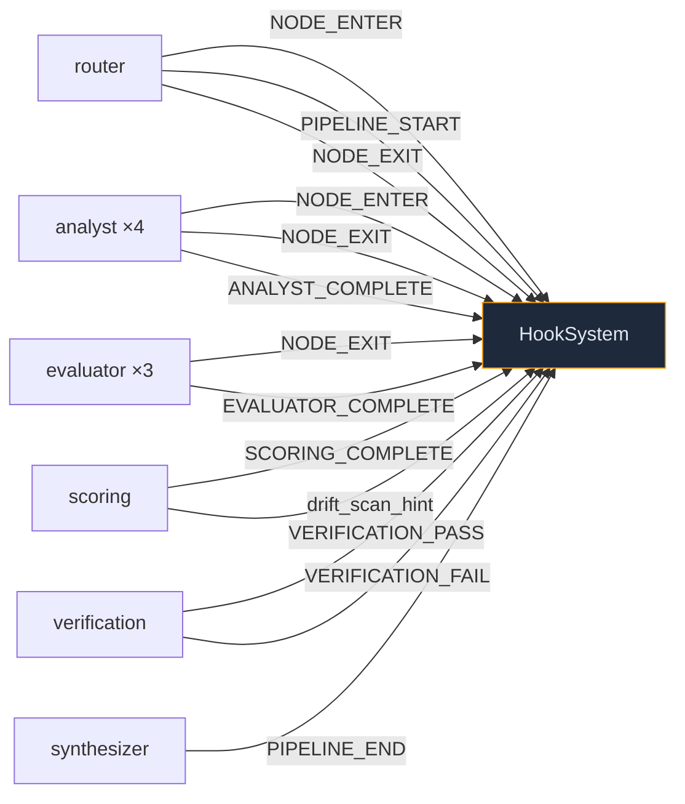

# GEODE Hook System — 27개 이벤트로 파이프라인을 관통하는 이벤트 버스

> Date: 2026-03-16 | Author: geode-team | Tags: [hooks, event-driven, orchestration, plugin, bootstrap, stuck-detection, run-log, pub-sub]

## 목차

1. [도입 — 노드 사이의 보이지 않는 연결](#1-도입--노드-사이의-보이지-않는-연결)
2. [27개 이벤트 — 전체 분류 체계](#2-27개-이벤트--전체-분류-체계)
3. [HookSystem — 우선순위 기반 동기 실행](#3-hooksystem--우선순위-기반-동기-실행)
4. [파이프라인 관통 — 노드 래핑 패턴](#4-파이프라인-관통--노드-래핑-패턴)
5. [Bootstrap — 실행 전 컨텍스트 주입](#5-bootstrap--실행-전-컨텍스트-주입)
6. [소비자들 — 로그, 탐지, 메모리, 자동화](#6-소비자들--로그-탐지-메모리-자동화)
7. [플러그인 확장 — YAML과 클래스 기반 디스커버리](#7-플러그인-확장--yaml과-클래스-기반-디스커버리)
8. [합성 패턴 — 팬아웃, 체이닝, 루프백](#8-합성-패턴--팬아웃-체이닝-루프백)
9. [왜 Sync인가 — async 전환 시도와 좌절](#9-왜-sync인가--async-전환-시도와-좌절)
10. [서브에이전트와 Hook의 관계 — as_completed 패턴](#10-서브에이전트와-hook의-관계--as_completed-패턴)
11. [마무리](#11-마무리)

---

## 1. 도입 — 노드 사이의 보이지 않는 연결

GEODE의 LangGraph 파이프라인은 8개 노드가 순차/병렬로 실행됩니다. 각 노드는 자신의 출력만 상태에 기록하고, 다른 노드의 내부 동작을 알지 못합니다. 이것이 Clean Architecture의 핵심입니다.

그러나 프로덕션 환경에서는 노드 **사이**에서 일어나야 할 일이 있습니다.

| 요구 사항 | 노드 안에서 처리? | 문제 |
|----------|-----------------|------|
| Analyst 실행 시간 로깅 | 가능 | 모든 노드에 로깅 코드 중복 |
| Scoring 후 drift 감지 | 가능 | scoring.py가 CUSUM 의존 |
| 파이프라인 종료 후 메모리 저장 | 가능 | synthesizer.py가 memory 의존 |
| 노드 실행 전 프롬프트 오버라이드 | 불가능 | 노드 시작 **전**에 개입 필요 |

노드에 이 로직을 직접 넣으면 **순환 의존(circular dependency)**이 발생합니다. scoring 노드가 drift 감지를 알아야 하고, 감지 결과가 다시 scoring에 영향을 주는 구조입니다.

Hook System은 이 문제를 **이벤트 기반 pub/sub**로 해결합니다. 노드는 이벤트를 **발행(publish)**만 하고, 누가 구독(subscribe)하는지 알지 못합니다.

```
Node(scoring) → emit(SCORING_COMPLETE) → ?
                                         ├─ RunLog: 로깅
                                         ├─ StuckDetector: 완료 마킹
                                         └─ DriftDetector: CUSUM 검사
```

---

## 2. 27개 이벤트 — 전체 분류 체계

```python
# core/orchestration/hooks.py
class HookEvent(Enum):
    # Pipeline (3)
    PIPELINE_START = "pipeline_start"
    PIPELINE_END = "pipeline_end"
    PIPELINE_ERROR = "pipeline_error"

    # Node (4)
    NODE_BOOTSTRAP = "node_bootstrap"
    NODE_ENTER = "node_enter"
    NODE_EXIT = "node_exit"
    NODE_ERROR = "node_error"

    # Analysis (3)
    ANALYST_COMPLETE = "analyst_complete"
    EVALUATOR_COMPLETE = "evaluator_complete"
    SCORING_COMPLETE = "scoring_complete"

    # Verification (2)
    VERIFICATION_PASS = "verification_pass"
    VERIFICATION_FAIL = "verification_fail"

    # Automation (6)
    DRIFT_DETECTED = "drift_detected"
    OUTCOME_COLLECTED = "outcome_collected"
    MODEL_PROMOTED = "model_promoted"
    SNAPSHOT_CAPTURED = "snapshot_captured"
    TRIGGER_FIRED = "trigger_fired"
    POST_ANALYSIS = "post_analysis"

    # Memory (4)
    MEMORY_SAVED = "memory_saved"
    RULE_CREATED = "rule_created"
    RULE_UPDATED = "rule_updated"
    RULE_DELETED = "rule_deleted"

    # Prompt (2)
    PROMPT_ASSEMBLED = "prompt_assembled"
    PROMPT_DRIFT_DETECTED = "prompt_drift_detected"

    # SubAgent (3)
    SUBAGENT_STARTED = "subagent_started"
    SUBAGENT_COMPLETED = "subagent_completed"
    SUBAGENT_FAILED = "subagent_failed"
```

> 27개 이벤트를 8개 카테고리로 분류한 이유는 **관심사 분리**입니다. RunLog는 모든 이벤트를 구독하지만, DriftDetector는 `SCORING_COMPLETE`만, BootstrapManager는 `NODE_BOOTSTRAP`만 구독합니다. 각 소비자가 자신에게 필요한 이벤트만 선택적으로 수신합니다.

| 카테고리 | 이벤트 수 | 발행자 | 대표 소비자 |
|---------|----------|--------|-----------|
| Pipeline | 3 | `_make_hooked_node` | RunLog, StuckDetector |
| Node | 4 | `_make_hooked_node` | BootstrapManager, RunLog |
| Analysis | 3 | `_make_hooked_node` | DriftDetector |
| Verification | 2 | `_verification_node` | TriggerManager |
| Automation | 6 | TriggerManager, DriftDetector | RunLog |
| Memory | 4 | ProjectMemory | RunLog |
| Prompt | 2 | PromptAssembler | Drift 감사 |
| SubAgent | 3 | SubAgentManager | RunLog, HookSystem |

---

## 3. HookSystem — 우선순위 기반 동기 실행

### 핵심 인터페이스

```python
# core/infrastructure/ports/hook_port.py
@runtime_checkable
class HookSystemPort(Protocol):
    def trigger(self, event: Enum, data: dict[str, Any]) -> None: ...
    def register(self, event: Enum, handler: Callable,
                 *, name: str = "", priority: int = 50) -> None: ...
    def unregister(self, event: Enum, name: str) -> bool: ...
```

> `HookSystemPort`를 Protocol로 정의한 이유는 Port/Adapter 패턴입니다. 테스트에서 `MockHookSystem`으로 교체하거나, 향후 async 구현으로 전환할 때 소비자 코드를 변경하지 않아도 됩니다.

### 구현 — 우선순위 정렬 + 에러 격리

```python
# core/orchestration/hooks.py
class HookSystem:
    def trigger(self, event: HookEvent, data: dict[str, Any]) -> list[HookResult]:
        results: list[HookResult] = []
        for hook in sorted(self._hooks.get(event, []), key=lambda h: h.priority):
            try:
                hook.handler(event, data)
                results.append(HookResult(success=True, event=event,
                                         handler_name=hook.name))
            except Exception as exc:
                log.warning("Hook '%s' failed on %s: %s", hook.name, event.value, exc)
                results.append(HookResult(success=False, event=event,
                                         handler_name=hook.name, error=str(exc)))
        return results
```

> 두 가지 핵심 설계 결정이 있습니다. 첫째, **동기 실행**입니다. 핸들러가 순서대로 실행되므로 priority 50의 RunLog가 priority 80의 Snapshot보다 먼저 기록됩니다. 비동기로 전환하면 실행 순서를 보장할 수 없습니다. 둘째, **에러 격리**입니다. 한 핸들러의 예외가 나머지 핸들러와 파이프라인 자체에 영향을 주지 않습니다.

---

## 4. 파이프라인 관통 — 노드 래핑 패턴

모든 노드는 `_make_hooked_node()` 래퍼를 통해 실행됩니다. 이 함수가 노드 실행 전후에 Hook 이벤트를 발행합니다.

```python
# core/graph.py — _make_hooked_node() (simplified)
def _make_hooked_node(node_fn, node_name, hooks, bootstrap_mgr):
    def _wrapped(state: GeodeState) -> dict[str, Any]:
        hook_data = {"node": node_name, "ip_name": state.get("ip_name", "")}

        # Phase 1: Bootstrap (pre-execution injection)
        if bootstrap_mgr:
            ctx = bootstrap_mgr.prepare_node(node_name, ...)
            if ctx.skip:
                return {}
            state = bootstrap_mgr.apply_context(state, ctx)

        # Phase 2: NODE_ENTER
        hooks.trigger(HookEvent.NODE_ENTER, hook_data)
        if node_name == "router":
            hooks.trigger(HookEvent.PIPELINE_START, hook_data)

        # Phase 3: Execute
        start = time.time()
        result = node_fn(state)

        # Phase 4: NODE_EXIT + completion events
        hook_data["duration_ms"] = (time.time() - start) * 1000
        hooks.trigger(HookEvent.NODE_EXIT, hook_data)

        if node_name in _NODE_COMPLETION_EVENTS:
            hooks.trigger(_NODE_COMPLETION_EVENTS[node_name], hook_data)

        # Phase 5: Special — scoring drift hint, verification pass/fail
        if node_name == "scoring" and result.get("final_score", 0) > 0:
            hook_data["drift_scan_hint"] = True
        if node_name == "synthesizer":
            hooks.trigger(HookEvent.PIPELINE_END, hook_data)

        return result

    return _wrapped
```

> 노드 함수 `node_fn`은 Hook의 존재를 전혀 모릅니다. `_make_hooked_node`가 데코레이터처럼 노드를 감싸서 라이프사이클 이벤트를 주입합니다. 이 패턴 덕분에 `analysts.py`나 `scoring.py`에 Hook 관련 코드가 단 한 줄도 없습니다.

### 노드별 이벤트 발행 맵



---

## 5. Bootstrap — 실행 전 컨텍스트 주입

`NODE_BOOTSTRAP`는 다른 이벤트와 근본적으로 다릅니다. 다른 이벤트가 **관찰(observation)**을 위한 것이라면, Bootstrap은 **개입(intervention)**을 위한 것입니다.

### BootstrapContext

```python
# core/orchestration/bootstrap.py
@dataclass
class BootstrapContext:
    node_name: str
    ip_name: str
    prompt_overrides: dict[str, str] = field(default_factory=dict)
    extra_instructions: list[str] = field(default_factory=list)
    parameters: dict[str, Any] = field(default_factory=dict)
    skip: bool = False  # True이면 노드 실행 자체를 건너뜀
```

> `BootstrapContext`는 **mutable(변경 가능)**입니다. Hook 핸들러가 이 객체를 참조로 받아 in-place로 수정합니다. 이 설계는 여러 핸들러가 독립적으로 ctx에 지시를 추가할 수 있게 합니다.

### 사용 시나리오

```python
# 특정 IP에 대해 Analyst 온도 조정
def custom_bootstrap(ctx: BootstrapContext) -> None:
    if ctx.ip_name == "Berserk" and ctx.node_name == "analyst":
        ctx.parameters["temperature"] = 0.1  # 더 결정적으로
        ctx.extra_instructions.append("Focus on Souls-like mechanics.")

bootstrap_mgr.register_override("analyst", custom_bootstrap)
```

> `register_override(node_name, fn)`은 내부적으로 `NODE_BOOTSTRAP` 이벤트에 핸들러를 등록하되, 핸들러 안에서 `data["node"] != node_name`이면 early return합니다. 노드 이름 필터링을 캡슐화하여 사용자가 이벤트 필터링을 직접 구현할 필요가 없습니다.

---

## 6. 소비자들 — 로그, 탐지, 메모리, 자동화

### RunLog — 전 이벤트 감사 로그

```python
# core/runtime.py — 모든 이벤트에 대해 등록
for event in HookEvent:
    hooks.register(event, run_log_handler, name="run_log_writer", priority=50)
```

RunLog는 **모든 27개 이벤트**를 구독합니다. JSONL 형식으로 디스크에 기록하며, 2MB 또는 2000줄 초과 시 자동 정리됩니다.

```json
{"event": "node_exit", "node": "analyst", "ip_name": "Berserk",
 "duration_ms": 2341.5, "status": "ok", "run_id": "a1b2c3"}
```

> priority 50은 GEODE의 기본 핸들러 중 **가장 낮은** 우선순위입니다. 다른 핸들러(Snapshot 80, Memory 85)보다 먼저 실행되어 이벤트 발생 시점을 정확히 기록합니다.

### StuckDetector — 데드락 감지

```python
# core/orchestration/stuck_detection.py
hooks.register(HookEvent.NODE_ENTER, _on_enter, name="stuck_detector_enter", priority=90)
hooks.register(HookEvent.NODE_EXIT, _on_exit, name="stuck_detector_exit", priority=90)
hooks.register(HookEvent.NODE_ERROR, _on_error, name="stuck_detector_error", priority=90)
```

`NODE_ENTER`에서 타이머를 시작하고, `NODE_EXIT`이나 `NODE_ERROR`에서 타이머를 해제합니다. 2시간(기본값) 동안 EXIT이 오지 않으면 `PIPELINE_ERROR`를 발행합니다.

> StuckDetector는 Hook을 **소비하면서 동시에 발행**합니다. NODE_ENTER를 소비하고, 타임아웃 시 PIPELINE_ERROR를 발행합니다. 이것이 Hook 시스템의 **체이닝(chaining)** 패턴입니다.

### Memory Write-Back — L3 → L2 피드백

```python
# PIPELINE_END → memory_write_back (priority 85)
def _pipeline_end_handler(event, data):
    if data.get("dry_run"):
        return  # dry-run에서는 메모리 저장 안 함
    insight = f"{data['ip_name']}: {data['tier']} ({data['final_score']:.1f})"
    project_memory.save_insight(insight)
```

> 파이프라인 결과가 자동으로 프로젝트 메모리(`.claude/MEMORY.md`)에 기록됩니다. 다음 분석 시 `memory_context`로 이전 결과를 참조할 수 있습니다. 이것이 L3(Orchestration) → L2(Memory) 피드백 루프의 구현입니다.

### 기본 핸들러 전체 목록

| 핸들러 | 이벤트 | Priority | 역할 |
|--------|--------|----------|------|
| `run_log_writer` | ALL (27) | 50 | JSONL 감사 로그 |
| `stuck_detector_enter` | NODE_ENTER | 90 | 실행 타이머 시작 |
| `stuck_detector_exit` | NODE_EXIT | 90 | 타이머 해제 |
| `stuck_detector_error` | NODE_ERROR | 90 | 타이머 해제 |
| `drift_auto_snapshot` | DRIFT_DETECTED | 80 | 자동 스냅샷 |
| `drift_pipeline_trigger` | DRIFT_DETECTED | 70 | 후속 분석 트리거 |
| `pipeline_end_snapshot` | PIPELINE_END | 80 | 최종 상태 스냅샷 |
| `memory_write_back` | PIPELINE_END | 85 | 분석 인사이트 저장 |
| `drift_logger` | DRIFT_DETECTED | 90 | Drift 로깅 |
| `snapshot_logger` | SNAPSHOT_CAPTURED | 90 | 스냅샷 ID 로깅 |
| `trigger_logger` | TRIGGER_FIRED | 90 | 트리거 로깅 |
| `outcome_logger` | OUTCOME_COLLECTED | 90 | 피드백 로깅 |

---

## 7. 플러그인 확장 — YAML과 클래스 기반 디스커버리

외부 개발자가 코어 코드를 수정하지 않고 Hook 핸들러를 추가할 수 있습니다.

### YAML 기반 플러그인

```yaml
# plugins/slow_node_monitor/hook.yaml
name: slow-node-monitor
events:
  - node_exit
  - verification_fail
priority: 75
enabled: true
handler: monitor.py
```

```python
# plugins/slow_node_monitor/monitor.py
def handle(event, data):
    if event.value == "node_exit":
        duration = data.get("duration_ms", 0)
        if duration > 5000:
            log.warning("Slow node: %s took %.1fs", data["node"], duration / 1000)
```

### 클래스 기반 플러그인

```python
# plugins/custom_analytics/hook.py
class AnalyticsPlugin:
    @property
    def metadata(self) -> HookPluginMetadata:
        return HookPluginMetadata(
            name="analytics",
            events=[HookEvent.PIPELINE_END, HookEvent.SCORING_COMPLETE],
            priority=60,
        )

    def handle(self, event: HookEvent, data: dict[str, Any]) -> None:
        if event == HookEvent.PIPELINE_END:
            self._send_to_dashboard(data)
```

### 디스커버리 프로세스

```python
# core/orchestration/hook_discovery.py
loader = HookPluginLoader()
loader.load_from_dirs([Path("./plugins"), Path("~/.geode/plugins")])
loader.register_all(hooks)  # 모든 플러그인의 핸들러를 HookSystem에 등록
```

> 디스커버리는 **lazy loading**입니다. `discover_hooks()`는 메타데이터만 파싱하고, `load_from_dirs()`에서 비로소 핸들러 모듈을 `importlib`로 로딩합니다. 비활성(`enabled: false`) 플러그인은 모듈 로딩조차 하지 않습니다.

---

## 8. 합성 패턴 — 팬아웃, 체이닝, 루프백

### 팬아웃 — 하나의 이벤트, 다수의 소비자

```
PIPELINE_END
  ├─ (priority 50) run_log_writer → JSONL 기록
  ├─ (priority 80) pipeline_end_snapshot → 상태 스냅샷
  └─ (priority 85) memory_write_back → MEMORY.md 갱신
```

세 핸들러가 순서대로 실행됩니다. RunLog가 먼저 기록하므로 스냅샷이나 메모리 저장 중 오류가 발생해도 이벤트 기록은 보존됩니다.

### 체이닝 — 이벤트가 이벤트를 발행

```
SCORING_COMPLETE
  → drift_scan_hint = True
    → DriftDetector 검사
      → DRIFT_DETECTED 발행
        → drift_auto_snapshot → SNAPSHOT_CAPTURED
        → drift_pipeline_trigger → 후속 분석 실행
          → PIPELINE_END
            → memory_write_back
```

> 체이닝은 **무한 루프 위험**이 있습니다. GEODE에서는 PIPELINE_END → 메모리 저장으로 체인이 종결되며, 메모리 저장은 MEMORY_SAVED 이벤트를 발행하지만 이를 구독하는 핸들러가 파이프라인을 재실행하지 않습니다. 체인의 종결 조건이 구조적으로 보장됩니다.

### 의도적 미구현 — Hook 기반 루프백

파이프라인의 verification → gather → signals 루프백은 **Hook이 아닌 LangGraph 조건부 엣지**로 구현됩니다.

```python
# core/graph.py — conditional edge
graph.add_conditional_edges("verification", _should_loop_back,
                           {"gather": "gather", "synthesizer": "synthesizer"})
```

> 루프백을 Hook으로 구현하면 `VERIFICATION_FAIL` → 핸들러가 상태를 수정 → 파이프라인 재실행이라는 복잡한 제어 흐름이 생깁니다. LangGraph의 조건부 엣지는 이 흐름을 그래프 토폴로지로 선언적으로 표현합니다. Hook은 **관찰과 부수 효과**에, LangGraph는 **제어 흐름**에 사용하는 것이 GEODE의 원칙입니다.

---

## 9. Sync Hook + Async 노드 — 프론티어 코드베이스에서 증류한 결론

### 전제 정정: LangGraph는 async 노드를 지원한다

이전에 "LangGraph 노드는 sync여야 한다"고 가정했으나 직접 검증 결과 **async def 노드 + Send API + .astream()이 완전히 작동**합니다.

```python
# 검증: Send + async 4개 병렬 → 3.9x speedup
async def async_worker(state):
    await asyncio.sleep(0.1)
    return {'values': [f'{state["_worker_type"]}_done']}

def fan_out(state):
    return [Send('worker', {'_worker_type': f'w_{i}', 'values': []}) for i in range(4)]

# 결과: 0.103초 (순차 0.4초 대비 3.9x)
```

P3 asyncio 시도(v0.11.0)가 리버트된 이유는 LangGraph 제약이 아니라 **Big-Bang 전환의 파급 범위**(9개 노드 + 2000 테스트 일괄 변경)였습니다.

### 그렇다면 Hook은 왜 sync로 남기는가

핵심 질문은 "LangGraph가 async를 지원하니 Hook도 async로 바꿔야 하지 않는가"입니다. GitHub 코드베이스 4곳을 조사한 결과, 답은 **아니오**입니다.

### 프론티어 코드베이스 실증 분석

**Anthropic Claude Agent SDK** ([github.com/anthropics/claude-agent-sdk-python](https://github.com/anthropics/claude-agent-sdk-python))

에이전트 루프는 async (`async for message in query()`), 도구 함수도 async (`async def greet_user`). 그러나 **Hook은 sync 콜백**입니다.

```python
# Claude Agent SDK — Hook은 sync function
async def check_bash_command(input_data, tool_use_id, context):
    # sync 로직으로 permission 결정
    return {"hookSpecificOutput": {"permissionDecision": "deny"}}

options = ClaudeAgentOptions(
    hooks={"PreToolUse": [HookMatcher(matcher="Bash", hooks=[check_bash_command])]}
)
```

> Anthropic이 공식 SDK에서 "async 루프 + sync Hook" 패턴을 채택한 것은 **Hook의 역할이 관찰/제어이지 I/O가 아니기 때문**입니다. permission 결정, 로깅, 메트릭 수집은 메모리 연산이라 async의 이점이 없습니다.

**OpenAI Codex** ([github.com/openai/codex](https://github.com/openai/codex))

Rust tokio 기반 async. 도구를 `FuturesOrdered`로 병렬 디스패치하지만, PR #10505에서 3+ 병렬 tool_call 시 **race condition으로 응답 유실** 버그(#8479)가 발견되었습니다.

```
// Codex 버그: ResponseEvent::Completed가 tool future 완료 전에 도착
Stream completed → loop breaks → drain_in_flight 호출
  → 일부 future 결과 누락 → 세션 복구 불가
```

> async 병렬 도구 실행의 실전 위험을 보여줍니다. completion 보장 없이 async 병렬을 도입하면 데이터 유실이 발생합니다.

**CrewAI** ([github.com/crewAIInc/crewAI](https://github.com/crewAIInc/crewAI))

태스크별 `async_execution=True` 플래그로 opt-in 병렬. `asyncio.gather()`로 여러 Crew를 동시 실행.

**LangGraph** ([github.com/langchain-ai/langgraph](https://github.com/langchain-ai/langgraph))

Superstep 모델로 동일 depth 노드를 자동 병렬 실행. `max_concurrency` 설정으로 제어.

### 프론티어 컨센서스

| 프로젝트 | LLM 호출 | Hook/Event | 결론 |
|---------|---------|-----------|------|
| **Claude Agent SDK** | **async** | **sync** callback | 공식 패턴 |
| **OpenAI Codex** | **async** | N/A | 병렬 race condition 경험 |
| **CrewAI** | **async** | N/A | 플래그 기반 opt-in |
| **LangGraph** | **async** 지원 | N/A | superstep 자동 병렬 |

**모든 프론티어가 "LLM 호출 = async, Hook = sync"를 채택합니다.** Hook을 async로 바꾼 프로젝트는 없습니다.

### GEODE의 결정

ADR-009에서 단계적 전환을 결정했습니다:

1. **Phase 1**: `acall_llm_parsed()` async 함수 추가 (기존 sync 유지)
2. **Phase 2**: 9개 노드 `async def` + `graph.astream()` (feature flag)
3. **Hook은 sync 유지**: 프론티어 컨센서스와 일치. async 노드 안에서 sync `hooks.trigger()` 호출은 안전

```python
# Phase 2 이후의 _make_hooked_node
async def _wrapped(state):
    hooks.trigger(HookEvent.NODE_ENTER, data)  # sync — 안전
    result = await node_fn(state)              # async 노드
    hooks.trigger(HookEvent.NODE_EXIT, data)   # sync — 안전
    return result
```

> async 함수 안에서 sync 함수를 호출하는 것은 문제 없습니다 (반대가 문제). Python의 `await`는 코루틴에만 적용되고, 일반 함수 호출은 그대로 동기 실행됩니다. Claude Agent SDK가 이 패턴을 공식 채택한 것이 가장 강력한 근거입니다.

---

## 10. 서브에이전트와 Hook의 관계 — as_completed 패턴

### 문제: 결과 수집의 직렬 블로킹

서브에이전트의 LLM 호출은 `IsolatedRunner` 스레드로 병렬 실행됩니다. 그러나 결과 수집 루프가 제출 순서대로 블로킹하여 **관측성이 지연**되었습니다.

```
AS-IS (순차 블로킹):
  wait(task1: 30초) → COMPLETED(task1)
  wait(task2: 5초)  → COMPLETED(task2)  ← task2는 25초 전에 끝났지만 여기서야 훅 발행
  wait(task3: 15초) → COMPLETED(task3)
```

task2가 5초에 끝나도, task1이 30초 걸리면 task2의 `SUBAGENT_COMPLETED` 훅이 30초 후에 발행됩니다. RunLog에 기록되는 타이밍이 실제 완료 시점과 최대 25초 차이가 납니다.

### 해결: polling round-robin

```python
# core/cli/sub_agent.py — delegate() Phase 3
pending: dict[str, SubTask] = {sid: task for task, sid in session_ids}

while pending and time.time() < deadline:
    completed_sids: list[str] = []
    for sid in list(pending):
        isolation = self._runner.get_result(sid)
        if isolation is not None:
            completed_sids.append(sid)
            task = pending.pop(sid)
            # 즉시 훅 발행 + on_progress 콜백
            self._emit_hook(HookEvent.SUBAGENT_COMPLETED, task, ...)

    if not completed_sids and pending:
        time.sleep(poll_interval)  # 0.05초 → 최대 0.5초
        poll_interval = min(poll_interval * 1.5, max_poll)
```

> `concurrent.futures.as_completed()` 대신 직접 polling을 구현한 이유: `IsolatedRunner`는 `Future`를 반환하지 않고 `session_id` 문자열을 반환합니다. 기존 API를 변경하지 않으면서 as_completed 의미론을 구현하기 위해 round-robin polling을 선택했습니다.

```
TO-BE (round-robin):
  poll(1,2,3) → task2 완료! → COMPLETED(task2) 즉시 발행
  poll(1,3)   → task3 완료! → COMPLETED(task3) 즉시 발행
  poll(1)     → task1 완료! → COMPLETED(task1) 즉시 발행
```

### 성능 특성

| 항목 | AS-IS | TO-BE |
|------|-------|-------|
| **관측성 지연** | 최대 `max(duration) - min(duration)` | 0 (완료 즉시 훅 발행) |
| **on_progress 콜백** | 순차 | 완료 순 |
| **CPU 오버헤드** | polling 없음 | 0.05-0.5초 간격 polling (무시 가능) |
| **타임아웃 처리** | 개별 `_wait_for_result` | 글로벌 deadline + 일괄 FAILED |

> 이 변경은 sync Hook의 한계를 우회합니다. 병렬 실행 자체(threading)는 유지하면서, 결과 **수집 순서만** 완료 순으로 바꿔 관측성 지연을 제거했습니다. Hook을 async로 바꿀 필요가 없습니다.

---

## 11. 마무리

### 핵심 정리

| 항목 | 값 |
|------|-----|
| 이벤트 수 | 27개 (8 카테고리) |
| 실행 모델 | 동기, 우선순위 정렬, 에러 격리 |
| 기본 핸들러 | 12+ (RunLog, StuckDetector, Drift, Snapshot, Memory 등) |
| 플러그인 형식 | YAML + Class 기반, lazy loading |
| 관측성 | JSONL RunLog (전 이벤트), HookResult 반환 |
| 주입 패턴 | NODE_BOOTSTRAP → BootstrapContext (mutable, in-place) |
| DI | HookSystemPort Protocol — 구현 교체 가능 |
| 코드 규모 | 10+ 파일, ~4000 LOC |

### 설계 원칙

1. **노드는 Hook을 모른다**: 발행은 래퍼(`_make_hooked_node`)가 담당. 노드 코드에 Hook import 없음.
2. **관찰과 제어의 분리**: Hook = 관찰 + 부수 효과. 제어 흐름 = LangGraph 조건부 엣지.
3. **에러는 격리한다**: 핸들러 하나의 실패가 파이프라인을 멈추지 않음.
4. **확장은 등록으로**: 코어 수정 없이 플러그인 디렉토리에 파일 추가만으로 확장.

### 체크리스트

- [x] 27개 HookEvent 전체 분류
- [x] HookSystem 우선순위 + 에러 격리 구현
- [x] `_make_hooked_node` 래핑 패턴
- [x] BootstrapManager — NODE_BOOTSTRAP 개입
- [x] RunLog 전 이벤트 감사 로그
- [x] StuckDetector 데드락 감지
- [x] Memory write-back L3→L2 피드백
- [x] YAML/Class 기반 플러그인 디스커버리
- [x] 팬아웃/체이닝 합성 패턴
- [x] HookSystemPort Protocol DI
- [x] LangGraph async 노드 지원 검증 (Send + async = 3.9x speedup)
- [x] 프론티어 4곳 코드베이스 실증 ("LLM=async, Hook=sync" 컨센서스)
- [x] 서브에이전트 결과 수집 as_completed 패턴 적용
- [x] ADR-009 async 전환 전략 수립 (단계적 + feature flag)

---

*Source: `blog/posts/orchestration/28-hook-system-event-driven-orchestration.md` | Category: [[blog-orchestration]]*

## Related

- [[blog-orchestration]]
- [[blog-hub]]
- [[geode]]
- [[geode-architecture]]
