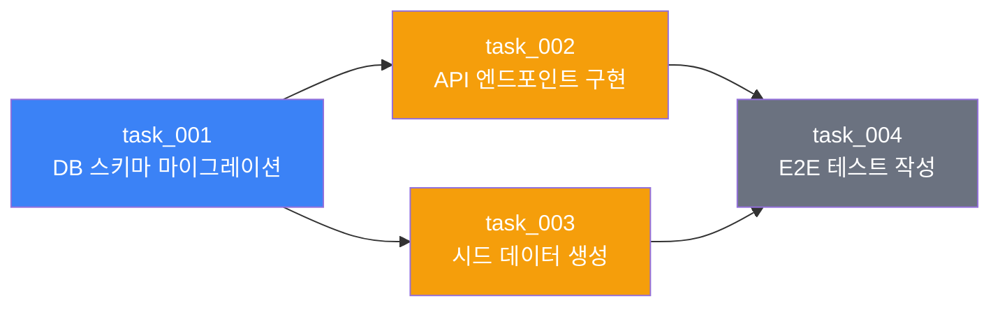
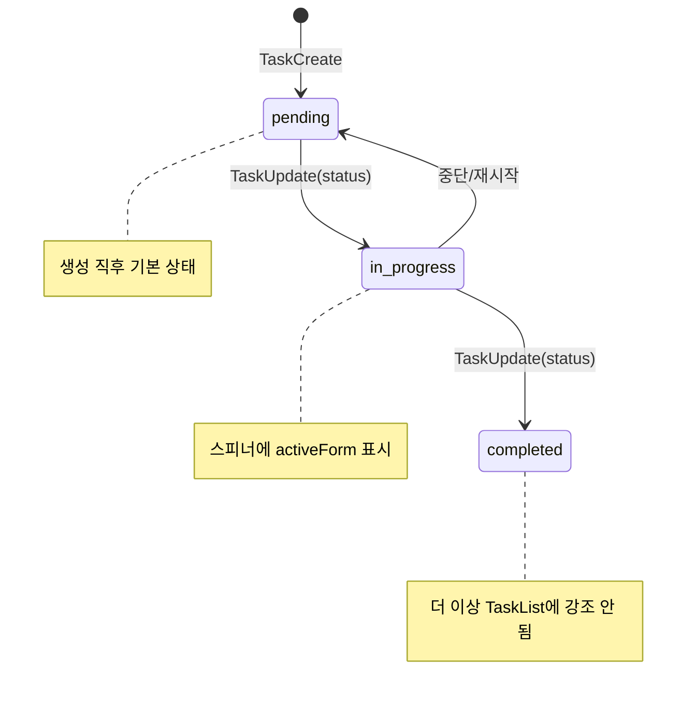
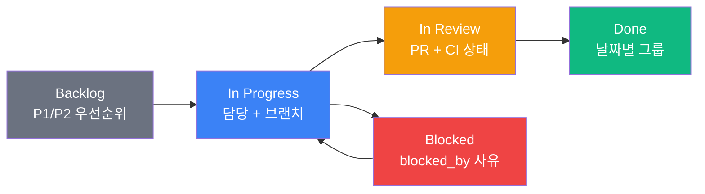
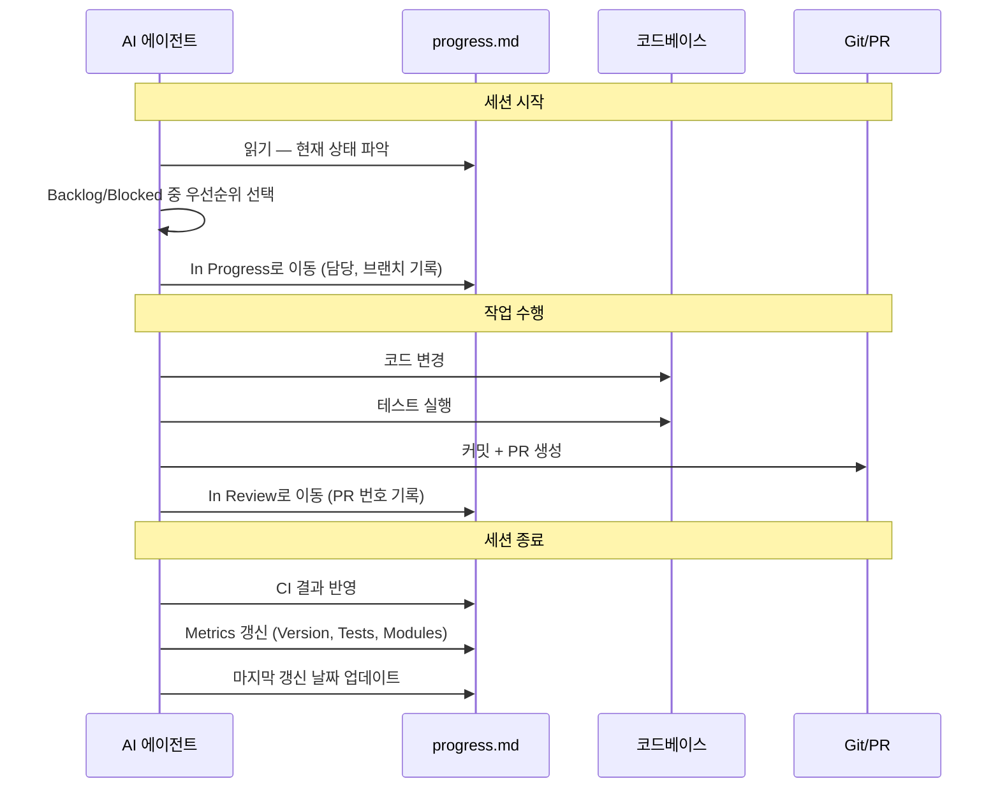

# AI 에이전트 팀의 칸반 보드 — Claude Code Tasks에서 GEODE Progress Board까지

> Date: 2026-03-18 | Author: geode-team | Tags: [kanban, task-management, multi-agent, progress-board, claude-code-tasks, tick-md, routa, veritas-kanban, karpathy-p8]

## 목차

1. [도입 — 에이전트도 칸반이 필요하다](#1-도입--에이전트도-칸반이-필요하다)
2. [Claude Code Tasks — DAG 기반 태스크 시스템](#2-claude-code-tasks--dag-기반-태스크-시스템)
3. [프론티어 칸반 시스템 비교](#3-프론티어-칸반-시스템-비교)
4. [GEODE Progress Board — Markdown 칸반](#4-geode-progress-board--markdown-칸반)
5. [설계 판단 — 왜 Markdown인가](#5-설계-판단--왜-markdown인가)
6. [마무리](#6-마무리)

---

## 1. 도입 — 에이전트도 칸반이 필요하다

인간 개발 팀에게는 Jira, Linear, Notion 같은 칸반 보드가 있습니다. "누가 무엇을 하고 있는지", "다음에 무엇을 해야 하는지", "무엇이 막혀 있는지"를 한 눈에 파악할 수 있는 도구입니다. 이 도구 없이 팀이 협업한다는 것은 상상하기 어렵습니다.

AI 에이전트 팀은 어떨까요?

Claude Code, Codex, Cursor 같은 AI 코딩 에이전트는 단일 세션 안에서는 훌륭하게 작동합니다. 하지만 **여러 세션에 걸쳐 작업**하거나, **여러 에이전트가 동시에 협업**할 때 근본적인 문제가 발생합니다.

- 이전 세션에서 무엇을 완료했는가?
- 다음 세션에서 무엇을 시작해야 하는가?
- 어떤 작업이 다른 작업에 의존하는가?
- 병렬로 실행 가능한 작업은 무엇인가?

이 문제를 해결하기 위해 2026년 초부터 새로운 패턴들이 등장하고 있습니다. Claude Code의 Tasks API, tick-md의 단일 파일 조율, Routa의 Kanban-as-Orchestration, Veritas Kanban의 YAML 파이프라인. 그리고 GEODE는 이 프론티어들을 분석한 뒤 **Markdown 기반 Progress Board**를 선택했습니다.

이 글에서는 각 시스템의 설계 철학과 트레이드오프를 비교하고, GEODE가 왜 "Dumb Platform + Smart Agent" 패턴을 채택했는지 설명합니다.

---

## 2. Claude Code Tasks — DAG 기반 태스크 시스템

### Todo에서 Tasks로

Claude Code v2.1.16(2026년 1월)에서 기존 `TodoWrite` 도구가 **Tasks API**로 전환되었습니다. TodoWrite는 단순 체크리스트였지만, Tasks는 **의존성 그래프(DAG)**를 지원하는 본격적인 태스크 시스템입니다.

### 핵심 API 4개

```
TaskCreate  — 태스크 생성 (subject, description, addBlockedBy)
TaskUpdate  — 상태 변경 + 의존성 추가 (status, addBlockedBy, addBlocks)
TaskGet     — 단일 태스크 상세 조회
TaskList    — 전체 태스크 목록 (최소 필드만 반환, 컨텍스트 절약)
```

> `TaskList`가 최소 필드만 반환하는 것은 의도적 설계입니다. LLM의 컨텍스트 윈도우를 보호하기 위해 상세 정보가 필요한 경우에만 `TaskGet(taskId)`을 호출하도록 유도합니다. 이는 Karpathy P6(Context Budget 관리)과 동일한 철학입니다.

### TaskCreate 예시

```python
# Claude Code 내부 — TaskCreate 호출 예시
TaskCreate(
    subject="Fix authentication bug in login flow",
    description="""
    Context: Login fails with 401 on token refresh.
    Acceptance criteria:
    - Token refresh retries up to 3 times
    - Expired token triggers re-authentication
    - Unit test coverage for refresh path
    """,
    addBlockedBy=["task_001"],  # task_001 완료 후 시작
)
```

> `subject`는 명령형("Fix X", "Add Y")으로 작성합니다. 할 일을 기술하기 때문입니다. 반면 `activeForm`은 진행형("Fixing X")으로 작성합니다. 스피너에 표시되어 현재 진행 중인 작업을 나타내기 때문입니다.

### DAG 의존성

`addBlockedBy`와 `addBlocks`는 태스크 간 방향성 의존관계를 형성합니다.



> task_002와 task_003은 task_001에 `blockedBy` 관계입니다. task_004는 두 태스크 모두 완료되어야 시작됩니다. 이 DAG 구조 덕분에 Claude Code는 task_002와 task_003을 **병렬 세션**에서 동시에 실행할 수 있습니다.

### 세션 간 공유

```bash
# 환경변수로 태스크 리스트 공유
export CLAUDE_CODE_TASK_LIST_ID="project-auth-refactor"

# Session A: 태스크 생성 + 실행
claude "Fix the auth bug"  # → TaskCreate → 작업 → TaskUpdate(completed)

# Session B: 동일 태스크 리스트 접속
claude "What's next?"      # → TaskList → 미완료 태스크 확인 → 실행
```

태스크는 `~/.claude/tasks/<TASK_LIST_ID>/tasks.json`에 즉시 영속화됩니다. Session A가 태스크를 완료하면, Session B는 `TaskList` 호출 시점에 즉시 반영된 상태를 확인합니다.

### 상태 흐름



---

## 3. 프론티어 칸반 시스템 비교

2026년 초, AI 에이전트용 칸반 시스템이 빠르게 등장하고 있습니다. 각 시스템의 설계 철학과 특징을 비교합니다.

### 3-1. tick-md — 단일 TICK.md 파일

[tick-md](https://www.tick.md/)는 하나의 `TICK.md` 파일로 멀티 에이전트 조율을 구현합니다. 서버도, 데이터베이스도, 벤더 락인도 없습니다. Markdown + Git + CLI만으로 동작합니다.

**핵심 설계:**
- 모든 태스크가 YAML 메타데이터를 가진 Markdown 항목으로 존재
- **Claim-Execute-Release 프로토콜**: 에이전트가 태스크를 선점(claim)하고, 실행하고, 반납(release)
- Watch 모드로 실시간 변경 감지
- MCP 서버 제공으로 Claude/Copilot 직접 연동 가능

> tick-md의 강점은 **극단적 단순성**입니다. Git diff가 곧 작업 이력이고, 어떤 에이전트/IDE에서든 TICK.md를 열면 현재 상태를 즉시 파악할 수 있습니다.

### 3-2. Agent Kanban — VS Code 확장

[Agent Kanban](https://github.com/appsoftwareltd/vscode-agent-kanban)은 VS Code 확장으로, 각 태스크를 **YAML frontmatter가 포함된 개별 Markdown 파일**로 저장합니다.

```yaml
# .agentkanban/tasks/fix-auth-bug.md
---
title: Fix authentication bug
lane: doing
created: 2026-03-15T10:00:00Z
updated: 2026-03-15T14:30:00Z
---

[user] Login fails on token refresh
[agent] Investigating... found expired token not triggering re-auth
[agent] Fix applied: added retry logic with 3 attempts
```

> 태스크 파일 자체가 **대화 로그**를 포함합니다. 이전 에이전트가 어떤 맥락에서 어떤 결정을 했는지 다음 에이전트가 파일 하나로 파악할 수 있습니다. "컨텍스트 부패(context rot)" 문제를 파일 수준에서 해결하는 접근입니다.

- `.agentkanban/` 폴더 전체를 Git에 커밋
- GitHub Copilot의 `@kanban` 채팅 참가자로 통합
- 보드 레인은 `board.yaml`로 설정 가능 (기본: Todo / Doing / Done)

### 3-3. Routa — Kanban = 조율 레이어

[Routa](https://github.com/phodal/routa)는 칸반 보드 자체를 **에이전트 조율 레이어**로 사용합니다. 각 컬럼에 전문 에이전트가 바인딩되어, 카드가 해당 컬럼에 도착하면 자동으로 작업을 시작합니다.

```
사용자 의도 → Coordinator(Routa)가 카드 분해
  → Backlog → Todo → Dev Agent → Review Agent → Done
                      (코드 작성)   (코드 리뷰)
```

**핵심 설계:**
- **Coordinator 에이전트**: 보드 위에서 작업을 계획하고, Spec을 작성하고, 전문가에게 위임
- **Custom Specialists**: 시스템 프롬프트, 모델 티어, 행동을 별도 정의 (`~/.routa/specialists/`)
- **Multi-wave 실행**: 한 웨이브의 결과를 다음 웨이브에 피드백
- MCP/ACP/A2A 프로토콜 지원

> Routa의 차별점은 **칸반이 단순한 시각화가 아니라 실행 엔진**이라는 점입니다. 카드의 컬럼 이동이 곧 에이전트 실행 트리거입니다. 인간 팀의 칸반 워크플로우를 AI 에이전트에게 그대로 적용한 것입니다.

### 3-4. Veritas Kanban — YAML 파이프라인

[Veritas Kanban](https://github.com/BradGroux/veritas-kanban)은 "GitHub Actions for AI Agents"를 표방합니다. 멀티 스텝 에이전트 파이프라인을 **버전 관리 가능한 YAML**로 정의합니다.

**핵심 기능:**
- Sequential steps, parallel fan-out/fan-in, loop iteration
- Gate approval (Human-in-the-Loop)
- Crash-recovery checkpointing
- Observational memory with importance scoring
- UI, REST API, CLI, MCP 서버로 에이전트 스폰 가능

> Veritas의 강점은 **선언적 파이프라인 정의**입니다. 에이전트의 실행 순서, 병렬 구간, 사람 승인 지점을 YAML 한 파일에 기술합니다. CI/CD 파이프라인에 익숙한 개발자에게 자연스러운 멘탈 모델을 제공합니다.

### 비교 테이블

| 항목 | Claude Code Tasks | tick-md | Agent Kanban | Routa | Veritas Kanban |
|------|------------------|---------|--------------|-------|----------------|
| **저장 형식** | JSON (`tasks.json`) | Markdown (TICK.md) | Markdown (파일별) | DB + Markdown | YAML + DB |
| **의존성 모델** | DAG (addBlockedBy) | 순차/수동 | 없음 (레인 기반) | 컬럼 바인딩 | YAML fan-out/fan-in |
| **멀티 에이전트** | TASK_LIST_ID 공유 | Claim/Release | Copilot @kanban | Coordinator 패턴 | Agent spawn API |
| **Git 친화** | 별도 파일 | TICK.md 커밋 | .agentkanban/ 커밋 | 부분적 | 부분적 |
| **IDE 통합** | Claude Code 네이티브 | CLI + MCP | VS Code 확장 | Web + Desktop | Web UI + CLI |
| **실행 모델** | 에이전트 자율 | 에이전트 자율 | Copilot 연동 | 컬럼 트리거 | 파이프라인 엔진 |
| **복잡도** | 중 | **저** | 저-중 | **고** | 고 |
| **철학** | Smart Platform | Dumb Platform | Dumb Platform | Smart Platform | Smart Platform |

---

## 4. GEODE Progress Board — Markdown 칸반

### 설계 철학: Karpathy P8 (Dumb Platform)

GEODE Progress Board는 Karpathy P8 패턴을 따릅니다.

```
Smart Platform: 플랫폼 = 라우팅 + 동시성 + 이벤트 + 조율
Dumb Platform:  플랫폼 = 저장만, 조율은 에이전트의 판단에
```

`progress.md`는 **저장소**일 뿐입니다. 어떤 태스크를 어떤 순서로 실행할지, 언제 상태를 전이할지는 에이전트가 결정합니다. 파일 형식이 JSON이나 YAML이 아닌 Markdown인 이유도 같습니다. 에이전트가 자연어로 읽고 쓰기에 Markdown이 가장 자연스럽기 때문입니다.

### 5컬럼 구조



각 컬럼은 Markdown 테이블로 구성되며, 고유한 필드 세트를 가집니다.

| 컬럼 | 핵심 필드 | 역할 |
|------|----------|------|
| **Backlog** | task_id, 설명, 우선순위, plan 링크 | 대기 중인 작업 풀 |
| **In Progress** | task_id, 담당, 브랜치, 시작일 | 현재 진행 중 |
| **In Review** | task_id, PR 번호, CI 상태 | 코드 리뷰 대기 |
| **Done** | task_id, PR, 완료일 | 날짜별 그룹핑, 30일 초과 시 아카이브 |
| **Blocked** | task_id, blocked_by, 사유 | 차단 사유 명시 |

### 실제 progress.md 스니펫

```markdown
# GEODE Progress Board

> 멀티 에이전트 공유 칸반 보드. 모든 세션/에이전트가 이 파일을 읽고 갱신한다.
> 마지막 갱신: 2026-03-18

---

## Kanban

### Backlog

| task_id | 설명 | 우선순위 | plan | 비고 |
|---------|------|:--------:|------|------|
| model-failover | Model Failover 자동화 | P1 | — | OpenClaw Failover 패턴 |
| context-overflow | Context Overflow Detection | P1 | — | Karpathy P6 |

### In Progress

| task_id | 설명 | 담당 | 브랜치 | 시작일 | 비고 |
|---------|------|------|--------|--------|------|
| kanban-blog | 칸반 시스템 기술 블로그 작성 | @mangowhoiscloud | — | 2026-03-18 | — |

### Done (2026-03-18)

| task_id | 설명 | PR | 담당 | 완료일 |
|---------|------|----|------|--------|
| nl-router-delete | nl_router.py 완전 삭제 + v0.19.1 릴리스 | #255 | @mangowhoiscloud | 2026-03-18 |
```

> 테이블 구조가 핵심입니다. `task_id`는 케밥 케이스로 고유하며, `plan` 필드는 `docs/plans/{task_id}.md`로 상세 계획 문서와 연결됩니다. 에이전트는 이 구조를 파싱하지 않고 **자연어로 읽습니다.** Markdown 테이블은 LLM이 구조를 이해하기에 충분한 형식입니다.

### GAP Registry — 프론티어 대비 누락 추적

Progress Board의 독특한 요소는 **GAP Registry**입니다. 프론티어 시스템(Claude Code, OpenClaw, Karpathy 패턴)을 리서치할 때 발견한 "우리에게 없는 것"을 체계적으로 기록합니다.

```markdown
## GAP Registry

### P1 (High)

| gap_id | 설명 | 출처 | 관련 task_id |
|--------|------|------|-------------|
| gap-failover | Model Failover 자동 전환 | OpenClaw | model-failover |
| gap-ctx-overflow | Token 초과 자동 압축 | Karpathy P6 | context-overflow |

### Resolved

| gap_id | 해소 PR | 해소일 |
|--------|---------|--------|
| gap-gateway | #241 | 2026-03-18 |
| gap-nl-router | #255 | 2026-03-18 |
```

> GAP Registry는 **기술 부채 추적기**이자 **로드맵 생성기**입니다. 프론티어 리서치에서 발견한 갭이 Backlog의 `task_id`와 매핑되어 있어, "왜 이 작업을 해야 하는가"의 근거가 됩니다. Resolved 섹션은 진행 과정을 증명합니다.

### 워크플로우 통합 — 세션 시작/종료 프로토콜

Progress Board는 에이전트의 세션 라이프사이클에 통합됩니다.



> 핵심 규칙은 두 가지입니다. **(1) 세션 시작 시 읽기** — 이전 세션의 상태를 이어받습니다. **(2) 세션 종료 시 쓰기** — 다음 세션이 현재 상태를 파악할 수 있도록 갱신합니다. 이 프로토콜이 없으면 멀티 세션 작업에서 작업이 중복되거나 누락됩니다.

### 운영 규칙 7가지

| # | 규칙 | 근거 |
|---|------|------|
| 1 | `task_id`는 케밥 케이스, 고유, 변경 불가 | GAP/plan 매핑 안정성 |
| 2 | 상태 흐름: Backlog → In Progress → In Review → Done | 역방향 시 Blocked 경유 |
| 3 | 담당은 GitHub 계정 (`@username`) | PR assignee와 일치 |
| 4 | 갱신 시점: 세션 시작 시 읽기, 종료 시 쓰기 | 멀티 세션 일관성 |
| 5 | plan 연결: `docs/plans/{task_id}.md` | 상세 설계 문서 연동 |
| 6 | GAP 연결: `gap_id` ↔ `task_id` 매핑 | 기술 부채 추적 |
| 7 | Done 이력: 30일 초과 시 `docs/progress-archive/` | 보드 비대화 방지 |

---

## 5. 설계 판단 — 왜 Markdown인가

### Claude Code Tasks vs GEODE Progress Board

| 관점 | Claude Code Tasks | GEODE Progress Board |
|------|------------------|---------------------|
| **저장 형식** | JSON (tasks.json) | Markdown (progress.md) |
| **접근 방식** | API 호출 (TaskCreate/Update) | 파일 직접 읽기/쓰기 |
| **의존성 추적** | `addBlockedBy` DAG | `blocked_by` 컬럼 (수동) |
| **세션 공유** | `CLAUDE_CODE_TASK_LIST_ID` 환경변수 | 파일 시스템 (모든 세션이 같은 파일) |
| **사람 편집** | JSON 직접 편집 어려움 | Markdown 편집 자연스러움 |
| **Git 이력** | 가능하나 JSON diff 가독성 낮음 | Markdown diff 가독성 높음 |
| **IDE 통합** | Claude Code 전용 | 범용 (모든 에디터) |
| **구조화 수준** | 높음 (스키마 강제) | 중간 (관례 기반) |
| **복잡도** | 중 (API 학습 필요) | **저** (Markdown만 알면 됨) |

### API 기반 vs 파일 기반 트레이드오프

**API 기반(Claude Code Tasks, Veritas Kanban)의 장점:**

- 스키마 검증으로 데이터 무결성 보장
- DAG 의존성 자동 추적 및 순환 감지
- 상태 전이 규칙 강제 (pending → in_progress → completed)
- 동시 접근 시 충돌 방지 메커니즘

**파일 기반(GEODE, tick-md, Agent Kanban)의 장점:**

- 외부 의존성 제로 — 파일 시스템만 있으면 동작
- Git으로 완전한 버전 관리 — 모든 변경 이력 추적
- 사람이 직접 읽고 편집 가능 — 에이전트 없이도 보드 운영 가능
- 어떤 LLM/에이전트에서든 접근 가능 — 벤더 락인 없음
- 디버깅 용이 — `git diff docs/progress.md`로 무엇이 변했는지 즉시 파악

### Karpathy P2 (단일 파일 제약) 적용

```
autoresearch: train.py 1개 = 유일한 수정 대상
GEODE:       progress.md 1개 = 유일한 칸반 파일
```

Karpathy의 autoresearch는 에이전트가 수정할 수 있는 파일을 `train.py` 하나로 제한했습니다. 이 제약이 오히려 에이전트의 행동을 예측 가능하게 만들었습니다. GEODE Progress Board도 동일한 원칙을 따릅니다.

**단일 파일의 이점:**

1. **전체 상태를 한 번에 파악** — 에이전트가 파일 하나를 읽으면 프로젝트의 전체 작업 상태를 이해합니다
2. **충돌 표면 최소화** — 여러 에이전트가 같은 파일을 수정해도 Git merge가 대부분 자동 해결됩니다 (테이블 행 추가/이동이 대부분이므로)
3. **컨텍스트 윈도우 효율** — 작은 파일 하나를 읽는 것이 여러 API를 호출하는 것보다 토큰 효율적입니다
4. **이식성** — Claude Code, Cursor, Codex, 어떤 에이전트든 Markdown을 읽을 수 있습니다

### 한계와 확장 경로

단일 Markdown 파일의 한계도 명확합니다.

| 한계 | 현재 대응 | 향후 확장 |
|------|----------|----------|
| 동시 편집 충돌 | Git merge + 수동 해결 | 파일 잠금 또는 CAS |
| 의존성 자동 추적 없음 | 수동 `blocked_by` 기록 | TaskGraph 연동 |
| 스키마 검증 없음 | 관례 기반 | Hook으로 형식 검증 |
| 대량 태스크 시 비대화 | 30일 아카이브 규칙 | 자동 아카이브 Hook |

> 이 한계들은 **의도적 수용**입니다. Karpathy P10(Simplicity Selection)에 따라, "해키한 추가로 미세한 개선"보다 "단순한 현재 구조 유지"를 선택했습니다. 실제로 GEODE 규모(태스크 ~20개/월)에서는 이 한계가 문제가 되지 않습니다. 문제가 될 만큼 복잡해지면 그때 확장합니다.

---

## 6. 마무리

### 핵심 정리

| 항목 | 값 |
|------|-----|
| 프론티어 시스템 | Claude Code Tasks, tick-md, Agent Kanban, Routa, Veritas Kanban |
| GEODE 선택 | Markdown 기반 Progress Board (`docs/progress.md`) |
| 설계 철학 | Karpathy P8 (Dumb Platform) + P2 (단일 파일 제약) |
| 컬럼 구조 | Backlog / In Progress / In Review / Done / Blocked |
| 고유 요소 | GAP Registry (프론티어 대비 누락 추적) |
| 워크플로우 통합 | 세션 시작 시 읽기, 세션 종료 시 쓰기 |
| 운영 규칙 | 7가지 (task_id 고유성, 상태 흐름, plan 연결 등) |
| 확장 경로 | TaskGraph 연동, Hook 기반 검증, 자동 아카이브 |

### 설계 원칙

1. **"Dumb Platform + Smart Agent"가 핵심입니다.** 파일은 저장만 하고, 판단은 에이전트에게 맡깁니다. 이 분리가 시스템의 유연성과 이식성을 보장합니다.

2. **progress.md 하나로 시작하고, 복잡해지면 확장합니다.** 첫 날부터 완벽한 시스템을 구축하는 것이 아니라, 최소한의 구조에서 시작하여 필요가 증명될 때 기능을 추가합니다. 이것이 Karpathy P10(Simplicity Selection)의 핵심입니다.

3. **AI 에이전트 팀도 칸반이 필요합니다.** 하지만 그 칸반은 Jira 같은 무거운 시스템이 아닐 수 있습니다. 때로는 Markdown 파일 하나가 팀 전체의 작업 상태를 추적하기에 충분합니다. 중요한 것은 도구가 아니라 **"이전에 뭘 했고, 다음에 뭘 해야 하는지"에 대한 공유 합의**입니다.

### 체크리스트

- [x] 프론티어 시스템 리서치 완료 (Claude Code Tasks, tick-md, Agent Kanban, Routa, Veritas Kanban)
- [x] 칸반 스키마 설계 (5컬럼 + GAP Registry + Metrics)
- [x] progress.md 양식 확정 (운영 규칙 7가지)
- [x] 워크플로우 통합 (세션 시작/종료 프로토콜)
- [ ] 멀티 에이전트 조율 프로토콜 (Claim/Release 미도입 — 현재 단일 에이전트 운영)

---

*Source: `blog/posts/orchestration/30-geode-kanban-system.md` | Category: [[blog-orchestration]]*

## Related

- [[blog-orchestration]]
- [[blog-hub]]
- [[geode]]
