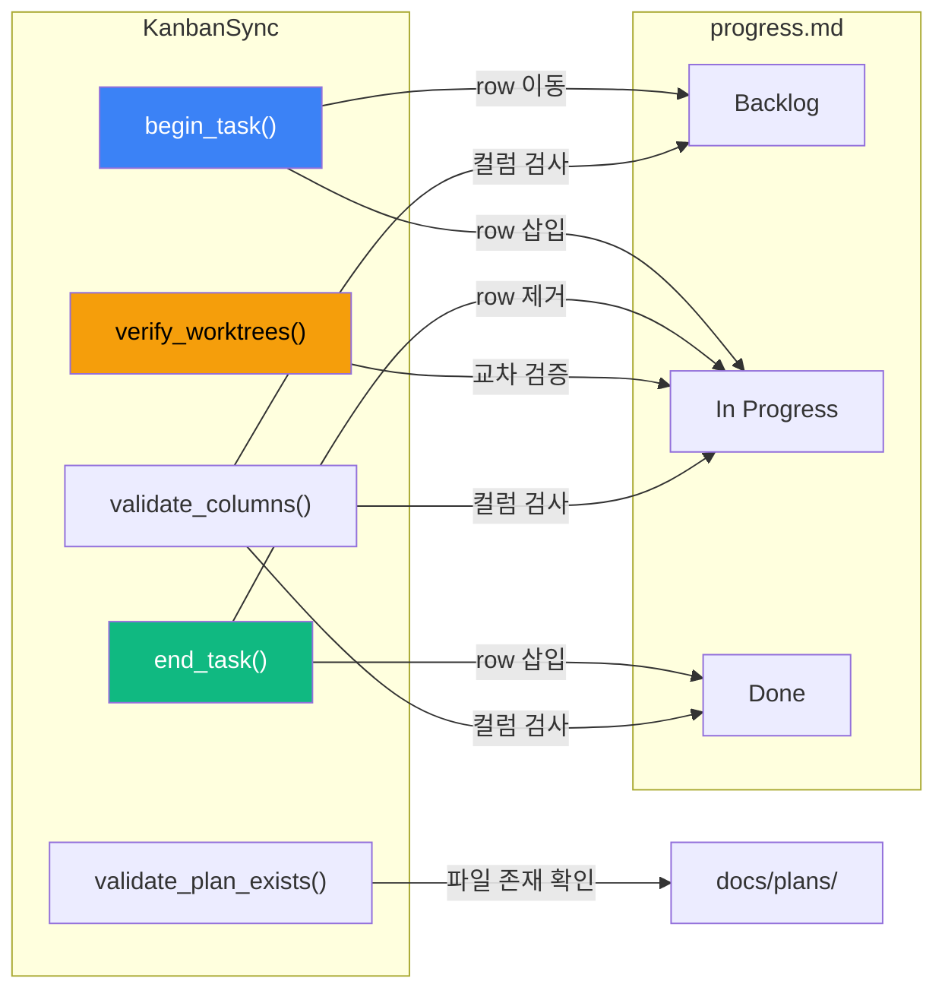
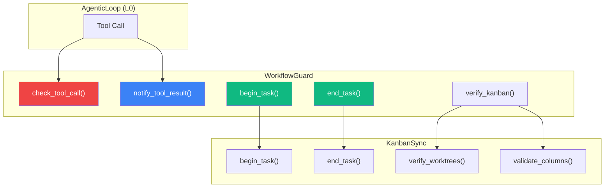

# 파일 기반 칸반으로 자율 에이전트 워크플로우를 제어하는 방법 — REODE 칸반 시스템 설계기

> Date: 2026-03-19 | Author: reode-team | Tags: [kanban, autonomous-agent, workflow, worktree, progress-board]

## 목차
1. 도입 — 자율 에이전트에 칸반이 필요한 이유
2. 칸반 보드 구조 — Markdown 테이블 SOT
3. KanbanSync — 프로그래매틱 상태 전이 엔진
4. WorkflowGuard — 비차단 규칙 강제 계층
5. 3-Checkpoint 시스템 — 정합성 보장 메커니즘
6. 테스트 전략 — 21개 테스트 케이스
7. 마무리

---

## 1. 도입 — 자율 에이전트에 칸반이 필요한 이유

코딩 에이전트가 자율적으로 브랜치를 만들고, 코드를 수정하고, PR을 올리는 시대입니다. 그런데 "지금 어떤 작업이 진행 중이고, 어떤 작업이 끝났는지"를 누가 추적할까요?

REODE는 이 문제를 **파일 기반 칸반 보드**로 해결합니다. `docs/progress.md` 하나의 Markdown 파일이 모든 에이전트 세션의 SOT(Single Source of Truth)가 되고, `KanbanSync` 모듈이 상태 전이를 프로그래매틱하게 수행합니다. 외부 서비스 의존 없이, Git만으로 동작하는 칸반입니다.

---

## 2. 칸반 보드 구조 — Markdown 테이블 SOT

### 2.1 전체 레이아웃

REODE의 칸반 보드는 `docs/progress.md`에 Markdown 테이블로 존재합니다. 네 개의 섹션이 작업 상태를 표현합니다.

```
┌─────────────────────────────────────────────────┐
│                docs/progress.md                  │
├─────────┬──────────────┬───────────┬────────────┤
│ Backlog │ In Progress  │ In Review │    Done    │
│         │              │           │ (by date)  │
├─────────┼──────────────┼───────────┼────────────┤
│ task-a  │  task-c      │  task-d   │  task-e    │
│ task-b  │              │           │  task-f    │
└─────────┴──────────────┴───────────┴────────────┘
```

### 2.2 섹션별 컬럼 정의

각 섹션은 고유한 필수 컬럼(Required Column)을 가집니다. 이 컬럼들은 코드에서 상수로 정의되며, 하나라도 "—"이면 유효성 검증에서 경고가 발생합니다.

| 섹션 | 필수 컬럼 | 비고 |
|------|----------|------|
| **Backlog** | task_id, 설명, 작업 내용, 우선순위 | "작업 내용" 미기입 시 In Progress 전환 불가 |
| **In Progress** | task_id, 설명, 작업 내용, 담당, 브랜치, 시작일 | worktree 할당 시 자동 기입 |
| **Done** | task_id, 설명, 작업 내용, PR, 담당, 완료일 | 날짜별 서브섹션으로 그룹화 |

```python
# core/cli/kanban_sync.py
_REQUIRED_BACKLOG = {0: "task_id", 1: "설명", 2: "작업 내용", 3: "우선순위"}
_REQUIRED_IN_PROGRESS = {
    0: "task_id", 1: "설명", 2: "작업 내용",
    3: "담당", 4: "브랜치", 5: "시작일",
}
_REQUIRED_DONE = {0: "task_id", 1: "설명", 2: "작업 내용", 3: "PR", 4: "담당", 5: "완료일"}
```

> 컬럼 정의를 딕셔너리 상수로 관리하는 이유는 **인덱스 기반 검증**을 위해서입니다. Markdown 테이블의 각 셀은 `|`로 분리한 뒤 인덱스로 접근하므로, 컬럼 순서가 곧 검증 스키마가 됩니다.

### 2.3 실제 Backlog 예시

코드(`_REQUIRED_BACKLOG`)와 테스트 픽스처는 "작업 내용" 컬럼을 포함한 6컬럼 구조를 기대합니다. 운영 중인 `progress.md`에서는 Backlog 단계에서 아직 작업 내용이 확정되지 않은 경우 컬럼을 축약하여 5컬럼으로 운영하기도 합니다.

```markdown
### Backlog

| task_id | 설명 | 우선순위 | plan | 비고 |
|---------|------|:--------:|------|------|
| t5-java-spring-sample | Spring Boot 마이그레이션 샘플 실행 | P2 | — | petclinic/ssm 대상 |
```

테스트 픽스처에서 기대하는 정규(canonical) 구조는 다음과 같습니다.

```markdown
### Backlog

| task_id | 설명 | 작업 내용 | 우선순위 | plan | 비고 |
|---------|------|----------|:--------:|------|------|
| task-a | Task Alpha | Alpha 작업 상세 | P1 | — | test |
```

### 2.4 실제 Done 예시 (날짜별 그룹화)

운영 파일에서는 Done 섹션도 Backlog와 마찬가지로 "작업 내용" 컬럼 없이 5컬럼으로 운영됩니다.

```markdown
### Done (2026-03-19)

| task_id | 설명 | PR | 담당 | 완료일 |
|---------|------|----|------|--------|
| sdk-agentic-upgrade | SDK Gateway Refactor — 프로바이더별 AgenticAdapter 분리 | #164→#168 | @mangowhoiscloud | 2026-03-19 |
| gap-diff-edit | str_replace 파일 편집 도구 (Gap G7) | #159 | @mangowhoiscloud | 2026-03-19 |
```

코드(`_REQUIRED_DONE`)와 `end_task()`는 "작업 내용"을 보존하여 6컬럼 구조로 기록하도록 설계되어 있으므로, 향후 운영 파일도 정규 구조로 통일될 예정입니다.

> Done 섹션을 날짜별로 그룹화하면 "오늘 뭘 했는가"를 한눈에 볼 수 있습니다. REODE에서는 하루에 40개 이상의 태스크가 완료되기도 하기 때문에, 날짜 단위 구분 없이는 테이블이 과도하게 길어집니다.

---

## 3. KanbanSync — 프로그래매틱 상태 전이 엔진

### 3.1 클래스 개요

`KanbanSync`는 `docs/progress.md`를 읽고 쓰는 단일 클래스입니다. 정규식 기반으로 Markdown 테이블을 파싱하고, 행(row) 단위의 이동(move)을 수행합니다.



> `KanbanSync`가 DB나 API 대신 파일을 직접 조작하는 설계를 선택한 이유는 **Git 추적성** 때문입니다. `docs/progress.md`의 변경 내역이 커밋 히스토리에 그대로 남으므로, "누가 언제 어떤 태스크를 시작/완료했는지"를 `git log`로 추적할 수 있습니다.

### 3.2 begin_task() — Backlog에서 In Progress로

`begin_task()`는 두 가지 전제 조건(precondition)을 강제합니다.

```python
# core/cli/kanban_sync.py
def begin_task(
    self,
    task_id: str,
    *,
    work_description: str = "",
    assignee: str = "@mangowhoiscloud",
    branch: str = "",
    skip_plan_check: bool = False,
) -> bool:
    # Precondition 1: Plan 파일 존재 확인
    if not skip_plan_check:
        plan_warning = self.validate_plan_exists(task_id)
        if plan_warning:
            log.warning(plan_warning)
            return False

    # Precondition 2: 작업 내용 필수
    if not work_description:
        log.warning(
            "[KanbanSync] '작업 내용' is required for task '%s'.",
            task_id,
        )
        return False
    ...
```

> **Plan 강제(Plan Enforcement)**는 REODE 칸반의 핵심 설계 결정입니다. `docs/plans/{task_id}.md` 파일이 없으면 In Progress로 전환할 수 없습니다. 이는 "계획 없는 작업 시작"을 구조적으로 차단합니다. Karpathy의 autoresearch에서 영감을 받은 "할 수 없는 것(CAN NOT)을 먼저 정의한다"는 원칙의 구현입니다.

**전이 과정을 단계별로 분해하면:**

```
1. plan 파일 존재 확인 → 실패 시 return False
2. work_description 비어있지 않은지 확인 → 실패 시 return False
3. Backlog 섹션에서 task_id 매칭 행 탐색 (정규식)
4. 매칭된 행에서 설명(description) 추출
5. Backlog에서 해당 행 제거
6. In Progress 섹션에서 빈 플레이스홀더(| — | — | ... |) 제거
7. 새 행 삽입: task_id, 설명, 작업 내용, 담당, 브랜치, 오늘 날짜
8. 파일 쓰기
```

### 3.3 end_task() — In Progress에서 Done으로

```python
# core/cli/kanban_sync.py
def end_task(
    self,
    task_id: str,
    *,
    pr_ref: str = "—",
    assignee: str = "@mangowhoiscloud",
) -> bool:
```

`end_task()`는 세 가지 특수 케이스를 처리합니다.

| 케이스 | 처리 |
|--------|------|
| In Progress가 비게 되는 경우 | 빈 플레이스홀더 행 `\| — \| — \| ... \|` 복원 |
| 오늘 날짜의 Done 섹션이 이미 존재 | 기존 섹션의 테이블 헤더 다음에 행 추가 |
| 오늘 날짜의 Done 섹션이 없는 경우 | 새 `### Done (YYYY-MM-DD)` 섹션 생성 후 삽입 |

> 빈 플레이스홀더(Empty Placeholder) 관리는 사소해 보이지만 중요합니다. In Progress 섹션이 완전히 비면 Markdown 테이블 구조가 깨지기 때문에, `| — | — | — | — | — | — | — |` 행을 자동으로 복원합니다.

### 3.4 verify_worktrees() — 교차 검증

```python
# core/cli/kanban_sync.py
def verify_worktrees(self, worktree_branches: list[str]) -> list[str]:
```

이 메서드는 두 방향의 불일치를 모두 탐지합니다.

```
                    Git Worktrees          In Progress 태스크
                    ─────────────          ─────────────────
                    feature/task-a   ←→   task-a    ✓ 일치
                    feature/orphan   ←✗              경고: worktree는 있지만 태스크 없음
                                     ✗→   task-b    경고: 태스크는 있지만 worktree 없음
```

> 이 교차 검증이 필요한 이유는 **세션 간 격차(session gap)** 때문입니다. 에이전트 A가 worktree를 할당하고 칸반을 갱신했지만, 에이전트 B의 세션이 끊기면서 worktree만 남고 칸반은 갱신되지 않은 상태가 발생할 수 있습니다. Checkpoint 3(세션 시작 검증)에서 이를 탐지하고 즉시 수정합니다.

### 3.5 validate_columns() — 컬럼 완결성 검증

```python
# core/cli/kanban_sync.py
def _validate_section(
    self,
    content: str,
    section_name: str,
    required: dict[int, str],
) -> list[str]:
    for line in section.splitlines():
        cols = [c.strip() for c in line.split("|")[1:-1]]
        if cols[0] in ("task_id", "—"):
            continue  # 헤더 행, 플레이스홀더 스킵
        for idx, col_name in required.items():
            if idx < len(cols) and cols[idx].strip() in ("—", ""):
                warnings.append(
                    f"Column '{col_name}' is empty for task '{task_id}'"
                )
```

> 검증이 "경고(warning)"로 동작하고 "차단(block)"하지 않는 설계는 의도적입니다. `KanbanSync`는 **비차단(non-blocking)** 원칙을 따릅니다. 문제를 탐지하되, 실행 흐름을 중단하지 않습니다. 차단 판단은 상위 계층인 `WorkflowGuard`가 담당합니다.

---

## 4. WorkflowGuard — 비차단 규칙 강제 계층

### 4.1 아키텍처 위치

`WorkflowGuard`는 `KanbanSync` 위에 놓인 **규칙 강제 계층(Rule Enforcement Layer)**입니다. 도구 호출(tool call)을 가로채서 워크플로우 규칙 위반을 탐지합니다.



### 4.2 3개의 규칙

`WorkflowGuard`는 세 가지 규칙을 평가합니다. 이 중 R1, R2는 경고(advisory), R3만 차단(hard block)입니다.

```python
# core/cli/workflow_guard.py
def _check_bash(self, command: str) -> GuardDecision:
    """
    R1: git commit outside worktree → 경고 (데이터 손실 위험)
    R2: git push without quality gate → 경고
    R3: gh pr merge without CI green → 차단 (HARD BLOCK)
    """
```

| 규칙 | 조건 | 결과 | 이유 |
|------|------|------|------|
| **R1** | worktree 밖에서 `git commit` | 경고 | main/develop 오염 방지 |
| **R2** | quality gate 미통과 상태에서 `git push` | 경고 | CI 실패 확률 감소 |
| **R3** | CI 미통과 상태에서 `gh pr merge` | **차단** | 코드 품질 최후 방어선 |

> R3만 hard block인 설계는 **"마지막 관문에서만 막는다"**는 철학을 반영합니다. commit과 push는 되돌릴 수 있지만, merge는 되돌리기 어렵습니다. 되돌림 비용이 높은 행위에만 차단을 적용하고, 나머지는 경고로 남겨 에이전트의 자율성을 보존합니다.

### 4.3 GuardState — 상태 추적

`WorkflowGuard`는 내부적으로 `_GuardState`를 유지하며, 도구 실행 결과로부터 상태를 자동 갱신합니다.

```python
# core/cli/workflow_guard.py
@dataclass
class _GuardState:
    quality_gate_passed: bool = False  # ruff/pytest/mypy 통과 여부
    ci_green: bool = False             # gh pr checks 결과
    in_worktree: bool = False          # .git이 파일인지 디렉토리인지
    pushed_refs: set[str] = field(default_factory=set)
```

> `.git`이 **파일**이면 worktree, **디렉토리**이면 본 저장소입니다. Git worktree는 메인 저장소의 `.git` 디렉토리를 가리키는 텍스트 파일(gitdir 포인터)을 `.git` 경로에 생성합니다. 이 차이를 `_detect_worktree()`가 탐지합니다.

### 4.4 자동 상태 감지

`notify_tool_result()`는 도구 실행 결과를 관찰하여 상태를 자동 갱신합니다.

```python
# core/cli/workflow_guard.py
def _auto_detect_quality_gate(self, command: str, output: str, success: bool) -> None:
    is_lint = "ruff check" in command
    is_test = "pytest" in command or "python -m pytest" in command
    if (is_lint or is_test) and success:
        self._state.quality_gate_passed = True
    elif (is_lint or is_test) and not success:
        self._state.quality_gate_passed = False  # 실패 시 리셋
```

> quality gate를 실패 시 **리셋**하는 이유: lint를 통과한 후 코드를 수정하고 다시 push하면, 수정된 코드는 검증되지 않은 상태입니다. "마지막으로 실행한 gate의 결과"만 유효하도록 보장합니다.

---

## 5. 3-Checkpoint 시스템 — 정합성 보장 메커니즘

REODE 칸반의 핵심은 **3개의 체크포인트**입니다. 이 체크포인트들은 worktree 생명주기와 칸반 상태의 동기화를 보장합니다.

```
    Checkpoint 1                     Checkpoint 2                Checkpoint 3
    작업 시작                         작업 완료                    세션 시작
    ─────────────                    ─────────────               ─────────────
    ┌──────────┐                     ┌──────────┐               ┌──────────┐
    │ worktree │                     │ worktree │               │ worktree │
    │  alloc   │                     │   free   │               │   list   │
    └────┬─────┘                     └────┬─────┘               └────┬─────┘
         │                                │                          │
         ▼                                ▼                          ▼
    ┌──────────┐                     ┌──────────┐               ┌──────────┐
    │plan 작성 │                     │In Progress│              │ 교차검증  │
    │Backlog→IP│                     │  → Done   │              │ 불일치?   │
    │main 커밋 │                     │main 커밋  │              │ 즉시수정  │
    └──────────┘                     └──────────┘               └──────────┘
```

### 5.1 Checkpoint 1 — 작업 시작

worktree를 할당할 때 수행합니다.

| 순서 | 행위 | 검증 |
|------|------|------|
| 1 | `docs/plans/{task_id}.md` 작성 | plan 파일 존재 여부 |
| 2 | Backlog → In Progress 이동 | `begin_task()` 성공 여부 |
| 3 | 필수 컬럼 기입 | 작업 내용, 담당, 브랜치, 시작일 |
| 4 | main 브랜치에서 커밋 + push | feature 브랜치에서 수정 불가 |

> progress.md를 **main에서만 갱신**하는 규칙은 칸반 보드의 "단일 진실 원천" 특성을 보호합니다. feature 브랜치에서 수정하면 merge 충돌이 발생하고, 여러 세션의 칸반 상태가 분기(diverge)됩니다.

### 5.2 Checkpoint 2 — 작업 완료

worktree를 해제할 때 수행합니다.

| 순서 | 행위 |
|------|------|
| 1 | In Progress → Done 이동 (PR 번호 포함) |
| 2 | GAP Registry: 해소된 GAP → Resolved |
| 3 | Blocked: 선행 완료로 해소된 항목 갱신 |
| 4 | Metrics: Version, Modules, Tests, Tools 수치 갱신 |

### 5.3 Checkpoint 3 — 세션 시작

새 세션이 시작될 때 수행합니다.

```python
# WorkflowGuard.verify_kanban() 내부 로직
def verify_kanban(self) -> list[str]:
    # 1. git worktree list 실행 → feature/* 브랜치 추출
    result = run_cmd(["git", "worktree", "list", "--porcelain"])
    branches = re.findall(r"branch refs/heads/(feature/[\w-]+)", stdout)

    # 2. In Progress 태스크와 교차 검증
    warnings.extend(self._kanban.verify_worktrees(branches))

    # 3. 컬럼 완결성 검증
    warnings.extend(self._kanban.validate_columns())
```

> Checkpoint 3의 존재 이유는 **세션 간 격차** 대응입니다. 에이전트 세션은 언제든 끊길 수 있고, 이전 세션이 Checkpoint 2를 완수하지 못한 채 종료되었을 수 있습니다. 새 세션이 이 불일치를 탐지하고 복구합니다.

---

## 6. 테스트 전략 — 21개 테스트 케이스

`tests/test_kanban_sync.py`는 355줄, 21개 테스트로 `KanbanSync`의 모든 공개 메서드를 검증합니다.

### 6.1 테스트 구조

```python
# tests/test_kanban_sync.py
SAMPLE_PROGRESS = """# REODE Progress Board
...
### Backlog
| task_id | 설명 | 작업 내용 | 우선순위 | plan | 비고 |
| task-a | Task Alpha | Alpha 작업 상세 | P1 | — | test |
| task-b | Task Beta | Beta 작업 상세 | P2 | — | test |

### In Progress
| task_id | 설명 | 작업 내용 | 담당 | 브랜치 | 시작일 | 비고 |
| — | — | — | — | — | — | — |
...
"""

@pytest.fixture
def kanban(tmp_path: Path, progress_file: Path) -> KanbanSync:
    return KanbanSync(project_root=tmp_path)
```

> 테스트 픽스처는 `tmp_path`에 샘플 `progress.md`를 생성합니다. 실제 프로젝트의 `docs/progress.md`를 건드리지 않으면서, 동일한 구조의 파일을 대상으로 검증합니다.

### 6.2 테스트 매트릭스

| 카테고리 | 테스트 수 | 검증 대상 |
|----------|-----------|----------|
| **begin_task** | 8 | 정상 전이, 미존재 태스크, 파일 없음, 플레이스홀더 제거, 다중 태스크, plan 미존재, skip_plan_check, work_description 미입력 |
| **end_task** | 5 | 정상 전이, 미존재 태스크, 파일 없음, 플레이스홀더 복원, 새 Done 섹션 생성 |
| **verify_worktrees** | 4 | 고아 worktree, 고아 태스크, 정상 동기, 파일 없음 |
| **validate_plan** | 2 | plan 존재, plan 미존재 |
| **validate_columns** | 2 | 빈 컬럼 탐지, 정상 행 |

```python
# 핵심 테스트: plan 없이 begin_task 시도 시 실패해야 함
def test_begin_task_fails_without_plan(self, kanban, progress_file):
    result = kanban.begin_task("task-a", work_description="some work")
    assert result is False

# 핵심 테스트: work_description 없이 begin_task 시도 시 실패해야 함
def test_begin_task_fails_without_work_description(self, kanban, progress_file, plan_dir):
    (plan_dir / "task-a.md").write_text("# Plan")
    result = kanban.begin_task("task-a")  # work_description 미입력
    assert result is False
```

---

## 7. 마무리

### 핵심 정리

| 항목 | 값/설명 |
|------|---------|
| SOT 파일 | `docs/progress.md` (Markdown 테이블) |
| 핵심 모듈 | `KanbanSync` (367줄), `WorkflowGuard` (563줄) |
| 상태 전이 | Backlog → In Progress → Done (직행 불가) |
| 전제 조건 | Plan 파일 존재 + 작업 내용 기입 + worktree 할당 |
| 정합성 보장 | 3-Checkpoint (시작/완료/세션 시작) |
| 규칙 강제 | R1(commit 경고), R2(push 경고), R3(merge 차단) |
| 테스트 | 21개 테스트 케이스, 355줄 |
| 갱신 원칙 | main 브랜치에서만 갱신 (feature/develop 금지) |

### CAN NOT 제약 요약

- Backlog에서 Done으로 직행할 수 **없습니다** — 반드시 In Progress를 경유합니다.
- worktree 없이 In Progress로 전환할 수 **없습니다**.
- `docs/plans/{task_id}.md` 없이 In Progress로 전환할 수 **없습니다**.
- "작업 내용" 컬럼을 비운 채 작업을 시작할 수 **없습니다**.
- feature/develop 브랜치에서 `progress.md`를 수정할 수 **없습니다**.

### 체크리스트

- [ ] `docs/progress.md`가 프로젝트 루트에 존재하는가
- [ ] 모든 Backlog 태스크에 "작업 내용"이 기입되어 있는가
- [ ] In Progress 태스크마다 대응하는 worktree가 있는가
- [ ] 모든 In Progress 태스크에 `docs/plans/{task_id}.md`가 존재하는가
- [ ] Done 섹션에 PR 번호와 완료일이 기입되어 있는가
- [ ] `pytest tests/test_kanban_sync.py -q` 가 전부 통과하는가

---

*Source: `blog/posts/reode/31-kanban-system.md` | Category: [[blog-reode]]*

## Related

- [[blog-reode]]
- [[blog-hub]]
- [[geode]]
- [[geode-architecture]]
