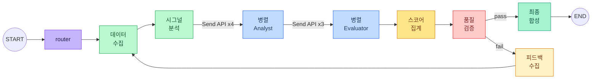
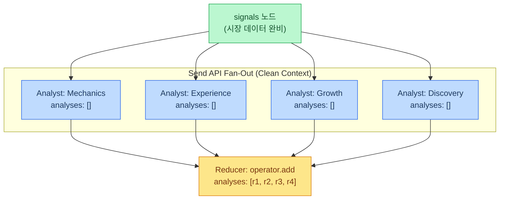
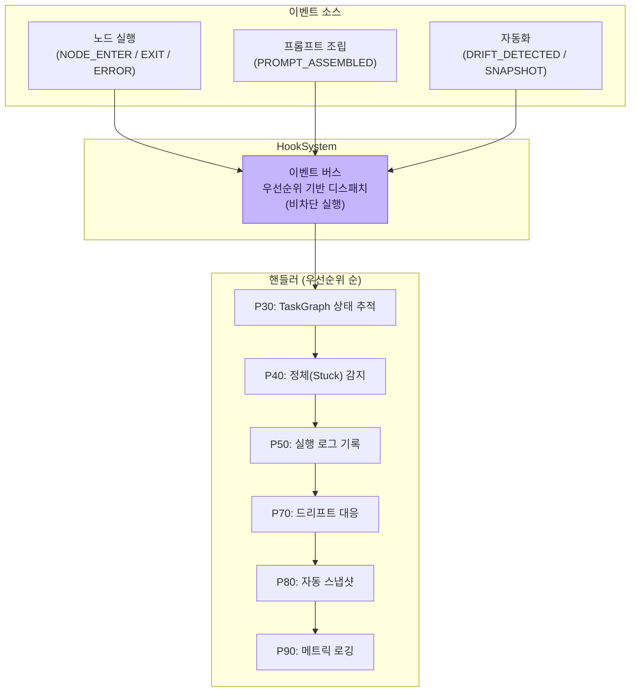
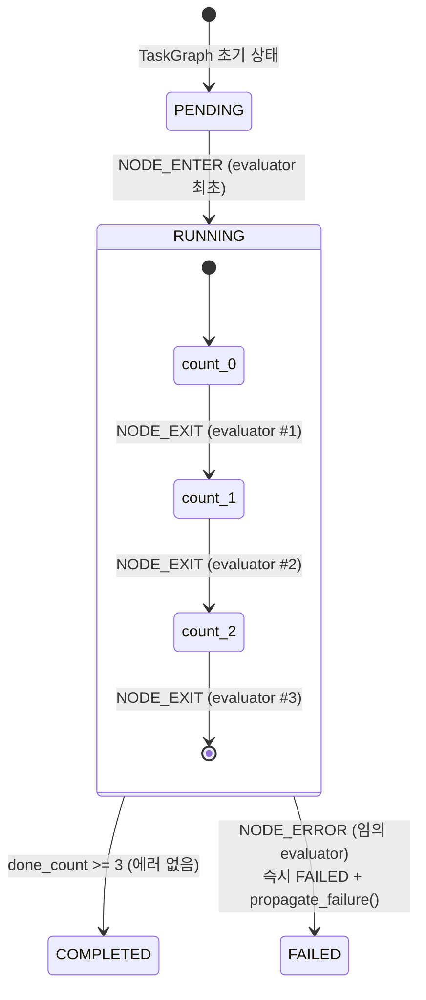
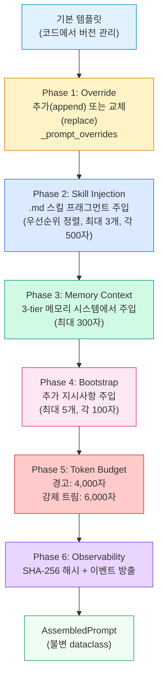
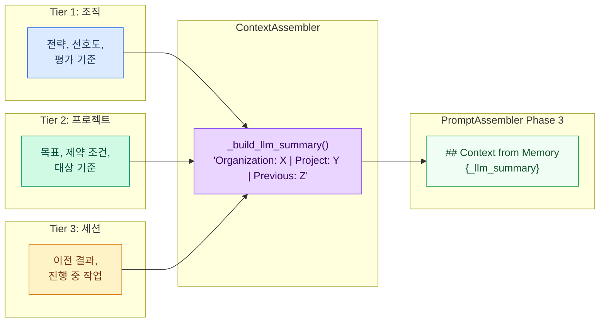
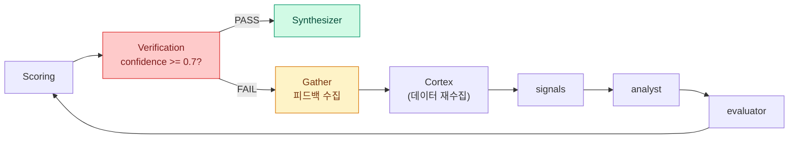
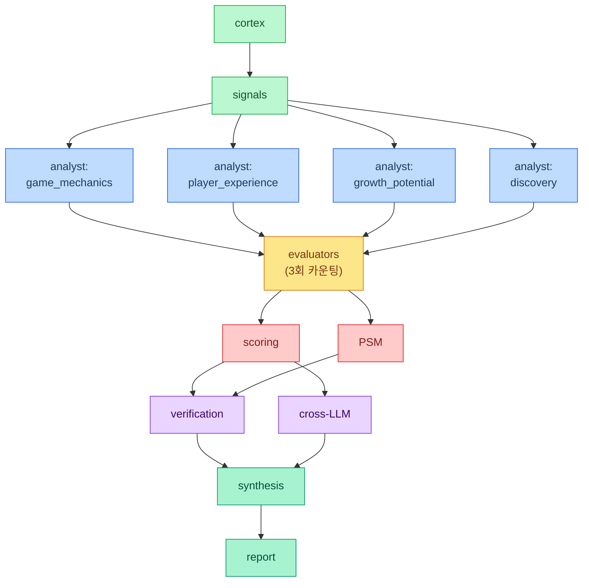
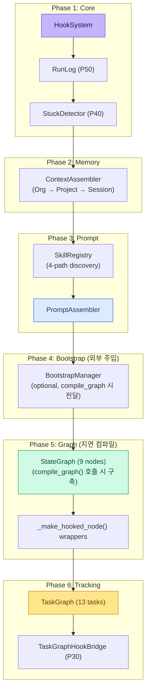

# LangGraph를 활용한 프로덕션 AI 에이전트 파이프라인 구축: ReAct에서 Multi-Agent 오케스트레이션까지

> LangGraph의 StateGraph, Send API, 이벤트 기반 훅 시스템을 활용하여 다중 에이전트 분석 시스템을 설계한 과정을 소개합니다. 병렬 실행, 프롬프트 조립, 런타임 관측성(observability) 등의 실용적 패턴을 포함합니다.

---

## 도입부

최근의 AI 애플리케이션은 단순한 프롬프트-응답 체인을 넘어서고 있습니다. 프로덕션 시스템에서는 **다중 에이전트 오케스트레이션** — 서로 다른 측면을 분석하는 복수의 전문 LLM 에이전트를 조율하고, 상호 평가를 수행하며, 일관된 결과물을 합성하는 능력이 요구됩니다.

이 글에서는 [LangGraph](https://langchain-ai.github.io/langgraph/)를 기반으로 구축한 프로덕션 다중 에이전트 파이프라인의 아키텍처를 다룹니다.

1. ReAct 패턴만으로 구조화된 분석이 어려운 이유
2. LangGraph StateGraph의 오케스트레이션 백본 역할
3. Send API를 통한 병렬 에이전트 실행과 앵커링 바이어스 방지
4. 이벤트 기반 훅 시스템과 Evaluator 카운팅 패턴
5. 6-Phase 동적 프롬프트 조립 시스템
6. 적응형(Adaptive) 피드백 루프와 품질 검증

---

## 1. ReAct 패턴의 한계와 구조화 파이프라인의 필요성

### ReAct 패턴 개관

**ReAct** (Reasoning + Acting) 패턴은 Yao et al. (2022)이 제안한 방법론으로, 추론 트레이스와 도구 사용을 교차 실행합니다.

```
Thought: 시장 데이터를 조회해야 합니다.
Action: search_market_data(query="anime IP market size")
Observation: 글로벌 시장 규모 $28.6B...
Thought: 이제 게임 메카닉 잠재력을 분석해야 합니다.
Action: analyze_mechanics(ip_data={...})
...
```

ReAct는 **탐색적 과업** — 다음 단계가 이전 결과에 의존하는 작업에 적합합니다. 그러나 **구조화된 분석 파이프라인**에서는 구조적 한계가 존재합니다.

| ReAct 강점 | 파이프라인 요구사항 | 간극 |
|---|---|---|
| 순차적 추론 | 4개 에이전트 동시 실행 | 네이티브 병렬 처리 부재 |
| 동적 도구 선택 | 고정된 분석 프레임워크 | 과도한 유연성 |
| 단일 에이전트 루프 | 다중 에이전트 간 컨텍스트 격리 | 격리 메커니즘 부재 |
| 암묵적 상태 관리 | Typed State + Reducer | 구조화된 상태 관리 부재 |

### Plan-and-Execute: 구조화 분석에 적합한 패턴

구조화된 분석에는 **Plan-and-Execute** 패턴이 더 적합합니다.

1. **Plan**: 의존 관계를 포함한 실행 계획 수립
2. **Execute**: 의존 순서에 따라 step을 실행하되, 가능한 병렬화
3. **Verify**: 품질 기준에 대해 결과 검증
4. **Synthesize**: 검증된 결과를 최종 출력으로 합성

이 패턴은 LangGraph의 `StateGraph`에 자연스럽게 대응됩니다.



그래프의 각 노드는 **전용 시스템 프롬프트, 도구, 평가 기준**을 갖는 전문 에이전트입니다. 그래프 토폴로지가 분석 프레임워크를 강제하는 동시에 LangGraph가 상태 관리와 병렬 실행을 처리합니다.

---

## 2. LangGraph StateGraph: 오케스트레이션 백본

### Typed State와 Reducer 패턴

LangGraph의 `StateGraph`는 **Reducer 함수**를 지원하는 typed state 정의를 사용합니다. 이를 통해 병렬 결과의 자동 병합이 가능합니다.

```python
from typing import Annotated, TypedDict
from operator import add

class GeodeState(TypedDict, total=False):
    ip_name: str
    # Reducer: 병렬 결과를 operator.add로 자동 병합
    analyses: Annotated[list[AnalysisResult], add]
    evaluations: Annotated[dict[str, EvaluatorResult], _merge_dicts]
    errors: Annotated[list[str], add]
    iteration_history: Annotated[list[dict[str, Any]], add]
    # 스칼라 필드 (reducer 불필요)
    final_score: float
    iteration: int
```

`Annotated[list[...], add]` 패턴이 핵심입니다. 4개의 analyst 에이전트가 각각 `{"analyses": [result]}`를 반환하면, LangGraph의 `operator.add` reducer가 이를 자동으로 하나의 `analyses` 리스트로 병합합니다. 수동 동기화가 필요하지 않습니다.

> **참고**: 실제 구현의 클래스명은 `GeodeState`이며, 본 글에서도 동일한 이름을 사용합니다.

**주의사항**: `evaluations` 필드처럼 `dict` 타입에 대해서는 `operator.add`가 아닌 커스텀 병합 함수(`_merge_dicts`)를 사용해야 합니다. 이는 3개의 evaluator가 각기 다른 키를 반환하기 때문입니다.

### 그래프 구성

```python
from langgraph.graph import StateGraph, END, START

graph = StateGraph(GeodeState)

# 노드 등록 (9개)
graph.add_node("router", router_node)
graph.add_node("cortex", cortex_node)
graph.add_node("signals", signals_node)
graph.add_node("analyst", analyst_node)       # Send API 수신
graph.add_node("evaluator", evaluator_node)   # Send API 수신
graph.add_node("scoring", scoring_node)
graph.add_node("verification", verification_node)
graph.add_node("synthesizer", synthesizer_node)
graph.add_node("gather", gather_node)         # 피드백 루프 노드

# 엣지 정의
graph.add_edge(START, "router")
graph.add_conditional_edges("router", route_after_router,
    {"cortex": "cortex", "evaluators": "evaluator", "scoring": "scoring"})
graph.add_edge("cortex", "signals")
graph.add_conditional_edges("signals", make_analyst_sends, ["analyst"])
graph.add_conditional_edges("analyst", make_evaluator_sends, ["evaluator"])
graph.add_edge("evaluator", "scoring")
graph.add_edge("scoring", "verification")
graph.add_conditional_edges("verification", _configured_should_continue,
    {"synthesizer": "synthesizer", "gather": "gather"})
graph.add_edge("gather", "cortex")
graph.add_edge("synthesizer", END)
```

### 시각화

LangGraph는 Mermaid 다이어그램 생성을 내장 지원합니다.

```python
compiled = graph.compile()
print(compiled.get_graph().draw_mermaid())
```

이 명령으로 전체 그래프 토폴로지를 Mermaid 다이어그램으로 출력하실 수 있으며, 이해관계자에게 파이프라인 구조를 즉시 공유하실 수 있습니다.

---

## 3. Send API를 통한 병렬 에이전트 실행

### 문제: 앵커링 바이어스

복수의 LLM 에이전트가 동일한 대상을 평가할 때, 다른 에이전트의 중간 결과를 열람할 수 있으면 **앵커링 바이어스** — 후속 에이전트가 선행 점수에 고정되는 현상이 발생합니다. 이는 인간의 인지 편향뿐 아니라 LLM에서도 관찰되는 잘 알려진 문제입니다.

### 해결: Clean Context via Send API

LangGraph의 `Send` API는 병렬 에이전트에 대해 **격리된 실행 컨텍스트**를 생성합니다.

```python
from langgraph.types import Send

def make_analyst_sends(state: GeodeState) -> list[Send]:
    analyst_types = ["game_mechanics", "player_experience",
                     "growth_potential", "discovery"]
    sends = []
    for atype in analyst_types:
        # Clean Context: 필요한 데이터만 전달, 다른 analyst 결과는 전달하지 않음
        send_state = {
            "ip_name": state["ip_name"],
            "ip_info": state["ip_info"],
            "monolake": state["monolake"],
            "signals": state["signals"],
            "dry_run": state.get("dry_run", False),
            "verbose": state.get("verbose", False),
            "_analyst_type": atype,
            "analyses": [],    # 빈 리스트 — 다른 analyst 결과 접근 불가
            "errors": [],
            # ADR-007 키 전파 (프롬프트 조립용)
            "_prompt_overrides": state.get("_prompt_overrides", {}),
            "_extra_instructions": state.get("_extra_instructions", []),
            "memory_context": state.get("memory_context"),
        }
        sends.append(Send("analyst", send_state))
    return sends
```



각 analyst 에이전트는 **빈** `analyses` 리스트를 수신합니다. 다른 analyst가 생산한 결과에 대한 가시성이 전혀 없습니다. 4개 모두 완료되면 `operator.add` reducer가 자동으로 병합합니다.

이 패턴의 효과:
- **바이어스 격리**: 선행 점수에 대한 앵커링 방지
- **자동 병합**: Reducer가 동기화 처리
- **내결함성**: 한 에이전트의 실패가 다른 에이전트를 차단하지 않음

**중요 구현 상세**: `_prompt_assembler` 객체 자체는 Send state에 포함되지 않습니다. 이는 Send API의 worker thread에서 `contextvars`가 기본값으로 초기화되는 문제를 회피하기 위해, `_make_hooked_node()` 래퍼가 `effective_state["_prompt_assembler"] = prompt_assembler`로 직접 주입하는 방식을 채택했습니다.

---

## 4. 이벤트 기반 훅 시스템

### 훅이 필요한 이유

프로덕션 파이프라인은 핵심 로직을 수정하지 않고도 확장 가능해야 합니다. **Observer 패턴** 기반의 이벤트 훅이 이를 가능하게 합니다.



### 훅 등록과 실행

```python
class HookSystem:
    def register(self, event, handler, *, name, priority=100):
        """핸들러 등록 (낮은 priority = 먼저 실행)."""

    def trigger(self, event, data=None) -> list[HookResult]:
        """해당 이벤트의 모든 핸들러를 우선순위 순으로 실행.
        한 핸들러의 에러가 다른 핸들러를 중단하지 않음."""
```

핵심 설계 결정:
- **비차단(Non-blocking)**: 한 핸들러의 실패가 전파되지 않습니다
- **우선순위 정렬**: 임계 핸들러(TaskGraph 추적 P30)가 선택적 핸들러(로깅 P90)보다 먼저 실행됩니다
- **메타데이터 전용**: 보안이 중요한 이벤트(프롬프트 조립)는 해시만 방출하고 원본 내용은 전달하지 않습니다
- **NODE_ERROR 시 이중 발생**: 노드 에러 시 `NODE_ERROR`와 `PIPELINE_ERROR`가 동시에 trigger됩니다

### Evaluator 카운팅 패턴

Send API로 3개의 evaluator를 병렬 실행할 때, "모두 완료"를 판단하는 메커니즘이 필요합니다. TaskGraph 훅 브릿지는 **카운팅 패턴**을 사용합니다.



```python
_EVALUATOR_EXPECTED_COUNT = 3

def _on_node_exit(self, event, data):
    if data["node"] == "evaluator":
        self._evaluator_done_count += 1
        if self._evaluator_done_count < _EVALUATOR_EXPECTED_COUNT:
            return  # 아직 대기
        # 3회 도달 — COMPLETED 전이
        self.task_graph.mark_completed(f"{prefix}_evaluators")
```

이 패턴은 **"N개 중 하나라도 실패하면 즉시 FAILED + 하위 task 전파"** 시맨틱을 구현합니다. Evaluator 에러 시 `propagate_failure()`가 하위 모든 task를 SKIPPED로 전이시킵니다.

---

## 5. 동적 프롬프트 조립

### 문제

프로덕션 AI 에이전트의 프롬프트는 여러 소스에서 동적으로 구성되어야 합니다.
- **기본 템플릿**: 코드에서 관리 (버전 관리, 코드 리뷰)
- **스킬 프래그먼트**: `.md` 파일에서 관리 (도메인 전문 지식, 핫 리로드 가능)
- **메모리 컨텍스트**: 이전 세션에서 관리 (조직적 지식)
- **런타임 오버라이드**: 부트스트랩 훅에서 관리 (요청별 커스터마이징)

이 모든 것을 템플릿 문자열에 하드코딩하면 유지보수가 어렵고 런타임 커스터마이징이 불가능합니다.

### 6-Phase 조립 파이프라인

중앙 `PromptAssembler`가 6단계 순차 Phase를 통해 프롬프트를 조립합니다.



### 스킬 프래그먼트 시스템

도메인 전문 지식은 YAML frontmatter를 가진 `.md` 파일로 외부화됩니다.

```markdown
---
name: analyst-game-mechanics
node: analyst
type: game_mechanics
priority: 50
version: 1.0
role: system
enabled: true
---

게임 메카닉 잠재력 분석 시 다음에 집중하십시오:
- 원작 소재에서의 핵심 게임플레이 루프 매핑
- 전투 시스템 깊이 및 스킬 상한선
- 성장 시스템 (캐릭터 발전, 장비, 능력치)
- 현 시장 트렌드와의 장르 적합도 분석
```

`SkillRegistry`가 4개 디렉토리(번들, 프로젝트, 사용자, 추가 경로)에서 스킬 파일을 탐색하고, 매칭되는 프래그먼트를 조립 시점에 시스템 프롬프트로 주입합니다.

특징:
- **핫 리로드**: 코드 변경 없이 `.md` 파일 업데이트만으로 전문 지식 갱신 가능
- **프로젝트별 커스터마이징**: 프로젝트 레벨 스킬이 번들 기본값을 오버라이드
- **버전 추적**: 각 스킬의 버전이 `fragments_used`에 기록 (`"skill-name:1.0"`)
- **PyYAML 무의존**: 정규식 기반 커스텀 frontmatter 파서 사용 (`_FRONTMATTER_RE`)

### 메모리 컨텍스트 주입

3-tier 메모리 시스템이 조직적 컨텍스트를 제공합니다.



하위 tier가 상위 tier를 오버라이드하며, 조립된 요약은 사전 포맷된 문자열입니다. PromptAssembler는 파싱 없이 그대로 주입합니다.

`_llm_summary`가 없는 경우, **대체 경로(fallback path)**가 `_org_loaded`, `_project_loaded`, `_session_loaded` 플래그를 검사하여 개별 키에서 메모리 블록을 재구성합니다.

### 보안: 기본 Append-Only 모드

프롬프트 오버라이드는 기본적으로 **추가(append-only) 모드**로 동작합니다.

```python
assembler = PromptAssembler(allow_full_override=False)  # 기본값
# 오버라이드 내용이 기본 템플릿에 추가됨
# 전체 교체는 명시적 opt-in 필요: allow_full_override=True
```

이를 통해 부트스트랩 훅이 신중하게 작성된 기본 템플릿을 실수로 교체하는 것을 방지합니다. 전체 교체는 개발/테스트 환경에서 명시적 opt-in으로만 가능합니다.

---

## 6. 적응형 피드백 루프와 품질 검증

### Conditional Edge를 활용한 반복 정제

스코어링 후 검증 노드가 품질 기준을 확인합니다. 신뢰도(confidence)가 임계값에 미달하면 파이프라인이 루프백합니다.



```python
CONFIDENCE_THRESHOLD = 0.7

def _configured_should_continue(state: GeodeState) -> str:
    # Guardrails 선행 체크 (데모 모드에서는 경고 후 계속 진행)
    guardrails = state.get("guardrails")
    if guardrails and not guardrails.all_passed:
        log.warning("Guardrails failed — proceeding in demo mode")

    confidence = state.get("analyst_confidence", 0.0)
    iteration = state.get("iteration", 1)
    max_iter = state.get("max_iterations", max_iterations)  # closure 캡처

    # 0-100 스케일과 0-1 스케일 양립 처리
    conf_normalized = confidence / 100.0 if confidence > 1.0 else confidence

    if conf_normalized >= confidence_threshold:  # closure 캡처 (기본 0.7)
        return "synthesizer"         # 통과
    if iteration >= max_iter:
        return "synthesizer"         # 최대 반복 도달 — 강제 진행
    return "gather"                  # 피드백 루프
```

### 적응형 피드백 (Adaptive Feedback)

단순히 재시도하는 것이 아니라, gather 노드가 **취약 영역을 식별**합니다.

```python
def _gather_node(state: GeodeState) -> dict[str, Any]:
    iteration = state.get("iteration", 1)
    confidence = state.get("analyst_confidence", 0.0)
    final_score = state.get("final_score", 0.0)
    tier = state.get("tier", "")
    subscores = state.get("subscores", {})

    # 적응형 분석: 취약 subscores 식별
    weak_areas = [k for k, v in subscores.items() if v < 50.0] if subscores else []

    history_entry: dict[str, Any] = {
        "iteration": iteration,
        "confidence": confidence,
        "final_score": final_score,
        "tier": tier,
        "weak_areas": weak_areas,
    }

    # Annotated[list, operator.add] reducer가 누적 처리
    return {"iteration": iteration + 1, "iteration_history": [history_entry]}
```

`weak_areas`가 기록되면, 다음 반복에서 하위 노드들이 취약 영역에 집중할 수 있습니다. 이는 **바운드된 피드백 루프** — 최대 N회 재시도 후 가용한 최선의 결과로 진행하여 무한 루프를 방지합니다.

---

## 7. 런타임 관측성 (Observability)

### 해시 기반 프롬프트 관측성

모든 조립된 프롬프트는 SHA-256 해시와 메타데이터를 생성합니다.

```python
@dataclass(frozen=True)
class AssembledPrompt:
    system: str
    user: str
    assembled_hash: str        # SHA-256[:12] (최종 프롬프트)
    base_template_hash: str    # SHA-256[:12] (원본 템플릿)
    fragment_count: int        # 주입된 프래그먼트 수
    total_chars: int
    fragments_used: list[str]  # ["skill-name:1.0", "memory-context", ...]
```

`assembled_hash != base_template_hash`이면, 스킬/메모리/오버라이드에 의해 프롬프트가 수정된 것입니다. `fragments_used` 리스트가 무엇이 주입되었고 왜 주입되었는지에 대한 완전한 감사 추적(audit trail)을 제공합니다.

### TaskGraph: DAG 기반 진행 상태 추적

13개 task으로 구성된 DAG가 훅 이벤트를 통해 파이프라인 실행을 관찰합니다.



TaskGraph는 **순수 관찰자(Pure Observer)**입니다. LangGraph 실행을 제어하지 않습니다. `NODE_ENTER/EXIT/ERROR` 이벤트를 HookSystem을 통해 수신하고 상태 전이를 추적합니다.

```
PENDING → READY → RUNNING → COMPLETED
                           → FAILED → propagate_failure() → 하위 SKIPPED
```

`TaskStatus`에는 **READY** 상태가 존재합니다. 이는 모든 의존성이 충족되어 실행 대기 중인 상태를 의미합니다. 에러 전파는 자동입니다: `cortex`가 실패하면 하위 모든 task(`signals`, `analyst_*`, `evaluators`, ...)가 `SKIPPED`로 전이됩니다.

---

## 8. 런타임 초기화

런타임이 모든 시스템을 결정론적 순서로 와이어링합니다.



각 Phase는 이전 Phase에 의존합니다. HookSystem이 존재해야 핸들러를 등록할 수 있고, SkillRegistry가 로드되어야 PromptAssembler가 참조할 수 있습니다. BootstrapManager는 `GeodeRuntime.create()` 내부에서 생성되지 않고, `compile_graph()` 호출 시 외부에서 선택적으로 주입됩니다. Graph 구축(Phase 5)도 `create()` 시점이 아닌 `compile_graph()` 호출 시 지연 수행됩니다.

---

## 9. 핵심 정리

### 패턴별 적합 용도

| 패턴 | 적합 용도 | 예시 |
|---|---|---|
| **ReAct** | 탐색적 과업, 동적 도구 선택 | 리서치 어시스턴트, 코딩 에이전트 |
| **Plan-and-Execute** | 알려진 단계의 구조화 분석 | 평가 파이프라인, 감사 워크플로우 |
| **Send API Fan-Out** | 병렬 독립 에이전트 | 다관점 분석, 앙상블 투표 |
| **Event Hook** | 횡단 관심사 (로깅, 추적) | 관측성, 드리프트 감지, 자동 스냅샷 |
| **Prompt Assembly** | 복수 소스의 동적 프롬프트 조립 | 스킬 주입, 메모리 컨텍스트, 요청별 커스터마이징 |

### 아키텍처 원칙

1. **Typed State + Reducer**: 프레임워크에 병렬 결과 병합을 위임하십시오
2. **Clean Context 격리**: 병렬 에이전트 간 앵커링 바이어스를 방지하십시오
3. **Observer over Controller**: TaskGraph는 실행을 관찰하되, 제어하지 않아야 합니다
4. **Append-Only 안전성**: 프롬프트 수정의 기본 모드는 추가(append)로 설정하십시오
5. **해시 기반 관측성**: 프롬프트 내용을 노출하지 않고 변경을 추적하십시오
6. **바운드된 피드백 루프**: 반드시 최대 재시도 횟수를 설정하십시오
7. **Confidence 정규화**: 0-1 스케일과 0-100 스케일의 양립을 처리하십시오
8. **Evaluator 카운팅**: "N개 모두 완료" 시맨틱을 카운터로 구현하십시오

### 프로덕션 체크리스트

- [ ] `TypedDict` state에 `Annotated[list, add]` reducer를 정의하십시오
- [ ] `Send` API로 fan-out 시 격리된 state를 전달하십시오 (cross-contamination 방지)
- [ ] `HookSystem` 핸들러를 우선순위 순으로 등록하십시오 (30-90)
- [ ] 도메인 전문 지식을 `.md` 스킬 파일(YAML frontmatter)로 외부화하십시오
- [ ] 프롬프트 조립에 token budget 제한을 설정하십시오 (경고 + 강제 트림)
- [ ] `should_continue` conditional edge로 바운드된 피드백 루프를 구현하십시오
- [ ] 훅 이벤트를 TaskGraph DAG에 브릿지하여 진행 상태를 추적하십시오
- [ ] `graph.compile().get_graph().draw_mermaid()`로 파이프라인을 시각화하십시오
- [ ] dict 타입 병합을 위한 커스텀 reducer를 정의하십시오 (`operator.add`는 list 전용)
- [ ] NODE_ERROR 시 PIPELINE_ERROR 동시 발생을 인지하고 핸들러를 설계하십시오

---

## 참고문헌

- Yao, S. et al. (2022). *ReAct: Synergizing Reasoning and Acting in Language Models*. [arXiv:2210.03629](https://arxiv.org/abs/2210.03629)
- LangGraph Documentation: [StateGraph](https://langchain-ai.github.io/langgraph/concepts/low_level/), [Send API](https://langchain-ai.github.io/langgraph/concepts/low_level/#send)
- Anthropic. (2025). *Building Effective Agents*. [anthropic.com/research](https://www.anthropic.com/research/building-effective-agents)
- Wang, L. et al. (2024). *A Survey on Large Language Model based Autonomous Agents*. [arXiv:2308.11432](https://arxiv.org/abs/2308.11432)

---

*Source: `blog/posts/architecture/34-building-production-ai-agents-with-langgraph.md` | Category: [[blog-architecture]]*

## Related

- [[blog-architecture]]
- [[blog-hub]]
- [[geode]]
- [[geode-architecture]]
