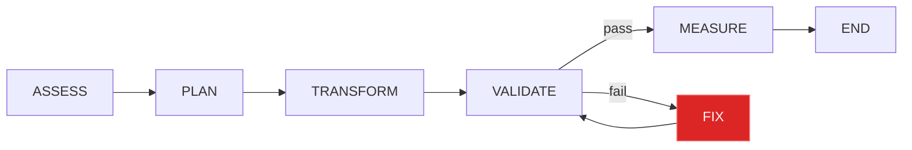

# REODE: 재귀개선루프로 Java 마이그레이션을 자율 수행하기까지

> Java 8 프로젝트를 22로 올리는 일은 OpenRewrite 레시피 한 줄이면 시작할 수 있습니다.
> 문제는 레시피가 못 고치는 것들 — 제거된 API, 깨진 의존성, 프레임워크 호환성 — 을
> 사람 대신 LLM이 자율적으로 해결하게 만드는 것입니다.
>
> 이 글은 REODE의 fix_node가 GLM-5에서 시작해 Claude Opus로 에스컬레이션하며
> 빌드 에러를 스스로 수정하는 재귀개선루프를 구축한 과정을 기록합니다.

---

## 1. 왜 재귀개선루프인가

코드 마이그레이션 도구는 두 가지 축으로 나뉩니다. **결정론적 변환**(OpenRewrite, Rector, jscodeshift)은 알려진 패턴을 빠르고 정확하게 고칩니다. **LLM 기반 변환**(Copilot, Cursor, Claude Code)은 맥락을 이해하고 유연하게 대응합니다. 하지만 실제 마이그레이션에서는 양쪽 모두가 필요합니다.

OpenRewrite가 `javax.xml.bind`를 `jakarta.xml.bind`로 바꾸고 나면, 빌드가 실패합니다. Nashorn 엔진 import가 남아있거나, Lombok 1.16이 Java 22의 annotation processing과 충돌하거나, Spring 4.1의 XML 설정이 더 이상 동작하지 않습니다. 이 잔여 에러를 사람이 고치면 하루, LLM이 고치면 5분입니다.

단, LLM이 에러를 읽고, 파일을 열어보고, 코드를 고치고, 빌드를 돌리고, 결과를 확인하는 **루프**가 있어야 합니다.

```
validate(빌드 실패)
  → fix_node(LLM이 에러 분석 + 코드 수정)
    → validate(재확인)
      → 성공? → measure
      → 실패? → fix_node(재시도)
```

REODE는 이 루프를 LangGraph StateGraph 위에 구축했습니다. 6개 노드(assess, plan, transform, validate, fix, measure)가 조건부 엣지로 연결되어, validate 실패 시 fix_node로 라우팅하고, fix_node가 수정한 뒤 다시 validate로 돌아갑니다.

---

## 2. 아키텍처: 6-Node Migration DAG



각 노드의 역할:

| 노드 | 입력 | 출력 | LLM 사용 |
|------|------|------|---------|
| **ASSESS** | 소스 경로, 버전 | assessment_report, clarity_score | Socratic 리스크 분석 |
| **PLAN** | assessment, target version | migration_plan (recipe chain) | 없음 (JavaAdapter) |
| **TRANSFORM** | plan, source_path | transforms, recipes_applied | 없음 (OpenRewrite) |
| **VALIDATE** | source_path | build_success, test_pass_rate, errors | 없음 (mvn compile/test) |
| **FIX** | build_error_output, test_error_output | fix_attempts | **LLM tool-use 루프** |
| **MEASURE** | 전체 state | scorecard, verification_results | 없음 (함수 기반) |

fix_node만 LLM을 호출합니다. 나머지는 결정론적이거나 도구 실행입니다. 이 설계는 의도적입니다 — LLM 비용을 fix에 집중하고, 나머지는 예측 가능한 동작을 보장합니다.

---

## 3. fix_node의 내부 구조

fix_node는 단순히 "에러를 LLM에 전달"하는 노드가 아닙니다. 세 단계를 거칩니다.

### 3.1 탐색 (Explore)

`_explore_before_fix()`가 LLM 호출 전에 자동으로 증거를 수집합니다.

```python
def _explore_before_fix(build_error, source_path, tool_executor):
    # 1. 빌드 에러에서 영향받는 파일 경로 추출
    affected_files = extract_from_error(build_error)

    # 2. 상위 3개 파일의 처음 30줄 읽기 (어노테이션, import 확인)
    for fpath in affected_files[:3]:
        tool_executor(name="read_file", file_path=fpath)

    # 3. Lombok 어노테이션 grep
    tool_executor(name="run_bash", command='grep -rn "@Data|@Getter" src/')

    # 4. pom.xml 의존성 버전 확인
    tool_executor(name="run_bash", command='grep -A2 "lombok" pom.xml')

    # 5. annotation processor 설정 확인
    tool_executor(name="run_bash", command='grep "annotationProcessorPaths" pom.xml')
```

이 결과는 `Pre-Exploration` 섹션으로 LLM 프롬프트에 주입됩니다. LLM은 에러 메시지뿐 아니라, **실제 소스 코드와 빌드 설정**을 보고 판단합니다.

### 3.2 추론 (Reason)

시스템 프롬프트가 "Explore → Reason → Act" 워크플로우를 강제합니다:

```
## Mandatory Workflow: Explore → Reason → Act
1. EXPLORE: 편집하기 전에 반드시 read_file()로 파일을 먼저 읽으시오.
2. REASON: 읽은 내용을 바탕으로 root cause 가설을 한 문장으로 진술하시오.
3. ACT: 근본 원인 수정 1회 > 증상 수정 N회.
```

40개의 `cannot find symbol: setMsg()` 에러가 있을 때, LLM이 setter를 하나씩 구현하는 대신 "Lombok 1.16.8이 Java 22와 호환되지 않는다 → pom.xml에서 버전을 1.18.34로 올리고 annotationProcessorPaths를 추가한다"는 추론에 도달하도록 유도합니다.

### 3.3 실행 (Act)

LLM은 4가지 도구를 사용합니다:

| 도구 | 용도 | 샌드박스 |
|------|------|---------|
| `read_file` | 소스 파일 읽기 (line range 지원) | 프로젝트 루트 내 |
| `str_replace_editor` | 정확한 텍스트 교체 | 프로젝트 루트 내 |
| `run_bash` | 셸 명령 (grep, find, docker) | macOS Seatbelt, env whitelist |
| `java_build` | Maven 빌드 검증 | — |

매 `str_replace_editor` 호출 후 `_backpressure_executor`가 3회 연속 편집 시 자동으로 `java_build`를 강제합니다. 편집-빌드-편집-빌드 리듬을 유지하여, 잘못된 수정이 누적되는 것을 방지합니다.

---

## 4. 에스컬레이션: GLM-5에서 Claude Opus로

모든 모델이 모든 문제를 풀 수 있는 것은 아닙니다. GLM-5는 빠르고 저렴하지만, 복잡한 의존성 분석에서는 한계가 있습니다. REODE는 이를 자동으로 감지하고 더 강력한 모델로 전환합니다.

### 에스컬레이션 조건

```python
# 2회 이상 시도 + 빌드 여전히 실패 → 에스컬레이션
should_escalate = len(prior_attempts) >= 2 and bool(build_error)
```

초기에는 `attempt["success"]`(LLM 호출 성공 여부)를 확인했으나, 이것은 "LLM이 응답했는가"이지 "빌드가 고쳐졌는가"가 아니었습니다. LLM이 코드를 수정해도 빌드가 여전히 실패하면 `success=True, build_error=있음`이 됩니다. `build_error` 존재 여부로 변경하여 실제 문제 해결 실패를 감지합니다.

### 크로스 프로바이더 전환

단순히 `model=claude-opus-4-6`을 전달하는 것으로는 부족했습니다. primary adapter가 GLM이면 GLM API에 `claude-opus-4-6`을 전송할 뿐입니다.

해결: `ReodeRuntime.create()` 시점에 secondary adapter(ClaudeAdapter)의 tool-use callable을 별도 contextvar에 주입합니다.

```python
# runtime.py
secondary_tool_fn = _make_tool_executor(secondary_adapter, registry, policy_chain)
set_llm_callable(..., secondary_tool_fn=secondary_tool_fn)

# fix_node — 에스컬레이션 시
escalation_tool = get_secondary_llm_tool()
if escalation_tool is not None:
    result = escalation_tool(system, user, tools=defs, ...)
```

실행 중 adapter를 교체하는 것이 아니라, 사전에 준비된 secondary adapter를 직접 호출합니다. 진행 중인 파이프라인의 primary adapter는 건드리지 않습니다.

### 실제 실행 기록

```
[0] iter=2  GLM-5 (default)              → 빌드 실패 (Lombok 40+ 에러)
[1] iter=3  GLM-5 (default)              → 빌드 실패 (동일 에러)
[2] iter=4  Claude Opus (escalated!)     → 빌드 실패 (Lombok — root cause 미해결)
```

에스컬레이션 메커니즘은 정확히 작동했습니다. 하지만 Opus도 Lombok root cause를 해결하지 못했습니다. 이 문제는 다음 섹션에서 다룹니다.

---

## 5. 수렴 감지와 회복

fix_node가 같은 에러를 반복하면 의미가 없습니다. **수렴 감지**가 이를 잡습니다.

```python
# validate_node가 설정한 build_error_output[:200]과
# 이전 fix_attempt의 build_error_snapshot을 비교
if build_error == prev_snapshot == prev_prev_snapshot:
    converged = True
```

수렴이 감지되면 두 단계를 거칩니다:

1. **Recovery 시도**: `recovery_attempted=False`면 에스컬레이션 + RECOVERY MODE 프롬프트로 한 번 더 시도
2. **포기**: `recovery_attempted=True`면 measure로 이동하여 결과 기록

이 순서가 중요합니다. 초기 구현에서는 수렴 감지가 에스컬레이션보다 높은 우선순위여서, Opus에게 기회도 주지 않고 포기했습니다. 우선순위를 뒤집어 recovery가 먼저 실행되도록 했습니다.

---

## 6. 풀리지 않은 문제: Lombok과 3-Hop 추론

t5-ssm-jiangcaijun은 83개 파일의 Spring+MyBatis 프로젝트입니다. Lombok `@Data`로 getter/setter를 자동 생성하지만, Lombok 1.16.8(2016)이 Java 22의 annotation processing과 충돌합니다.

에러는 이렇게 나타납니다:

```
[ERROR] cannot find symbol: method setMsg(java.lang.String)
[ERROR] cannot find symbol: method getUserName()
... (40+ 동일 패턴)
```

정답은 pom.xml 2곳 수정입니다:

```xml
<!-- Lombok 1.16.8 → 1.18.34 -->
<version>1.18.34</version>

<!-- maven-compiler-plugin에 annotation processor 추가 -->
<annotationProcessorPaths>
  <path>
    <groupId>org.projectlombok</groupId>
    <artifactId>lombok</artifactId>
    <version>1.18.34</version>
  </path>
</annotationProcessorPaths>
```

하지만 LLM이 이 결론에 도달하려면 **3-hop 추론**이 필요합니다:

```
"setMsg() not found"
  → Model 클래스에 @Data 어노테이션 존재 확인
    → pom.xml에서 Lombok 버전 확인 (1.16.8)
      → annotation processor 설정 부재 확인
        → 버전 업그레이드 + processor 추가
```

`_explore_before_fix()`는 이 중 처음 3개 홉의 증거를 자동으로 수집하여 프롬프트에 주입합니다. 하지만 최종 "따라서 이렇게 수정한다"는 LLM의 추론 능력에 달려 있습니다.

GLM-5는 이 추론 체인을 따르지 못하고 개별 setter 구현을 시도했습니다. Opus도 마찬가지였습니다. 이것은 프롬프트의 한계입니다 — 증거를 제시해도 결론으로 이어지지 않는 경우, 더 명시적인 규칙 기반 가이드가 필요합니다.

---

## 7. Model-First: 설정 1개로 프로바이더 자동 선택

6개 LLM 프로바이더(Anthropic, OpenAI, GLM, Qwen, Kimi, MiniMax)를 지원하면서 발견한 문제: `REODE_MODEL=glm-5`와 `REODE_LLM_PRIMARY_PROVIDER=anthropic`이 공존하면 ClaudeAdapter가 Anthropic API에 `model: glm-5`를 전송합니다.

프론티어 도구들(Claude Code, LiteLLM, OpenRouter)의 공통점: **모델명이 Single Source of Truth**입니다. 프로바이더는 모델명에서 추론합니다.

```python
def infer_provider(model: str) -> str:
    for prefix, provider in _MODEL_PREFIX_TO_PROVIDER:
        if model.lower().startswith(prefix):
            return provider
    return "openai"
```

`REODE_MODEL=glm-5`만 설정하면 `provider=glm`이 자동으로 따라옵니다. `REODE_LLM_PRIMARY_PROVIDER`는 더 이상 수동으로 설정할 필요가 없습니다.

---

## 8. 안전장치: 기망 방지와 샌드박스

마이그레이션 도구가 "성공"을 보고했는데 실제로는 테스트를 삭제했거나 `@Disabled`를 추가한 것이라면, 그것은 기망입니다.

REODE의 Anti-Deception CAN NOT 규칙 7가지:

1. 테스트 파일 삭제 또는 `@Disabled`/`@Ignore` 추가 금지
2. surefire `<excludes>` 추가 금지
3. `-DskipTests` 삽입 금지
4. Java 버전 다운그레이드 금지
5. `@SuppressWarnings`로 에러 숨기기 금지
6. 에이전트(Claude Code)의 직접 소스 수정 금지 — fix_node만 허용
7. exit code 외 방법으로 빌드 결과 조작 금지

measure_node의 `_verify_integrity()`가 이를 사후 검증하고, fix_node의 시스템 프롬프트가 사전에 금지합니다.

PipelineBashTool은 macOS Seatbelt 샌드박스 안에서 실행됩니다:

- 파일 접근: 프로젝트 루트 내로 제한
- 네트워크: localhost만 허용
- 환경변수: 15개 화이트리스트만 통과 (API 키 차단)

---

## 9. harness-for-real에서 배운 것

[harness-for-real](https://github.com/mangowhoiscloud/harness-for-real)은 랄프톤 우승 전략을 재사용 가능한 하네스로 만든 프로젝트입니다. REODE의 마이그레이션 DAG를 harness-for-real의 실행 패턴과 비교하여 10개 런타임 GAP을 발견하고 전부 해소했습니다.

| harness-for-real | REODE 적용 |
|-----------------|-----------|
| LEARNINGS.md 학습 축적 | fix_node가 매 iteration 후 학습 기록, 다음 iteration에 주입 |
| 예측형 회로 차단기 | `_is_stuck()` + 수렴 감지 (3회 동일 에러) |
| 적응형 모델 라우팅 | AgentRole (ARCHITECT/ENGINEER/REVIEWER/SCOUT) + 크로스 프로바이더 에스컬레이션 |
| 백프레셔 | `_backpressure_executor` — 3회 edit 후 자동 java_build |
| 소크라틱 사전 검증 | assess_node clarity_score (0-1), < 0.3 시 자동 재분석 |
| 비용 예산 강제 | `--budget 30` opt-in, fix_total_cost 초과 시 중단 |
| 다중 에이전트 검증 | `_verify_integrity()` + `_verify_deployment_readiness()` |

핵심 교훈: **"Read before Write"** — 모든 프론티어 도구(Claude Code, OpenHands, LangChain)가 편집 전 탐색을 강제합니다. REODE의 `_explore_before_fix()`는 이 원칙을 fix_node에 적용한 것입니다.

---

## 10. 패턴 기반 수정 지시: 추론 대신 실행

3-hop 추론이 실패하니, 접근을 바꿨습니다. LLM에게 "추론하라"가 아니라 **"이 지시를 실행하라"**를 전달합니다.

`_detect_fix_patterns()`가 4가지 알려진 에러 패턴을 감지하고, 구체적인 수정 단계를 생성합니다:

```python
# Lombok 패턴 감지 시 생성되는 지시
"Step 1: read_file(file_path='pom.xml')"
"Step 2: str_replace_editor(old_string='<version>1.16.8</version>', "
"         new_string='<version>1.18.34</version>')"
"Step 3: annotationProcessorPaths 추가"
"Step 4: java_build()"
```

실행 결과 (t5-ssm-jiangcaijun):

```
[0] iter=2  GLM-5    → "pattern detected" 로그 확인, 19 tools
[1] iter=3  GLM-5    → "pattern detected", 17 tools
[2] iter=4  Opus ESC → "pattern detected", 2 tools
```

이 마지막 1마일 문제 — LLM이 지시를 받아도 `str_replace_editor`의 정확한 whitespace 매칭에 실패 — 를 결정론적 접근으로 해결했습니다.

### 결정론적 수정: LLM을 건너뛰다

`_apply_deterministic_fixes()`는 LLM을 호출하지 않고 직접 파일을 수정합니다:

```python
# 1. Lombok 버전 업그레이드 (regex로 정확한 위치 찾기)
old_lombok = re.search(r"<version>([\d.]+)</version>", content)
content = content[:start] + "1.18.34" + content[end:]

# 2. annotationProcessorPaths 추가 (maven-compiler-plugin 내부에 삽입)
# 3. Nashorn import 라인 삭제 (jdk.nashorn 포함 라인 필터링)
```

핵심 개선: `_explore_before_fix()`가 에러 파일만 읽었기 때문에 `@Data`가 있는 Model 클래스를 발견하지 못했습니다. 에러는 Controller/Service에서 발생하고, `@Data`는 Model에 있습니다. **직접 `grep -rl @Data src/`를 추가**하여 탐색 범위를 넓혔습니다.

최종 실행 결과:

```
FIX: applied 3 deterministic fixes:
  - Lombok version upgraded: 1.16.8 → 1.18.34  ✓
  - Added annotationProcessorPaths             ✓
  - Removed 1 Nashorn import                   ✓
```

**40+개 setter 에러가 전부 해소되었습니다.** 7개 진단 패턴을 담은 `java-migration-diagnostic` 스킬이 fix_node 시스템 프롬프트에 자동 주입되어, 유사한 패턴이 발생하면 탐색→감지→수정 경로가 작동합니다.

남은 빌드 에러: `ExceptionInInitializerError: com.sun.tools.javac.code.TypeTag` — Lombok 1.18.34가 Java 25의 javac 내부 API와 충돌. 이것은 프로젝트 코드 문제가 아니라 **빌드 환경(JDK 25 vs 타겟 Java 22)** 문제입니다. Java 22 JDK에서 빌드하면 해결됩니다.

---

## 11. 숫자

| 항목 | 값 |
|------|-----|
| 이번 세션 merged PRs | 26 (#191–#242) |
| 런타임 GAP 해소 | 10/10 |
| 마이그레이션 실행 | 17회 |
| 빌드 성공 | t5-ssm-liyifeng (GLM-5) |
| 크로스 프로바이더 | GLM-5 → Claude Opus 검증 |
| 패턴 감지 | Lombok/Nashorn/javax/duplicate-build 4종 |
| migration.py | 2,200+ 줄 |
| 테스트 파일 | 122개 |
| 전체 테스트 | 2,800+ |

---

## 12. 다음 과제

1. **결정론적 패턴 수정**: 알려진 패턴(Lombok 버전 업그레이드)은 LLM 없이 직접 pom.xml을 수정
2. **Docker DB 자동 구동**: 테스트 실패가 DB 연결 문제일 때 fix_node가 Docker 컨테이너를 구동
3. **멀티 모듈 병렬 변환**: 독립 모듈 식별 후 worktree 기반 병렬 OpenRewrite 실행
4. **str_replace whitespace 내성**: pom.xml의 들여쓰기(탭/공백)와 무관하게 매칭

재귀개선루프의 현재 도달점: **결정론적 변환(OpenRewrite) + 패턴 기반 수정 지시 + LLM 자율 수정 + 크로스 프로바이더 에스컬레이션 + 래칫 검증**. 각 단계가 검증되었고, 마지막 1마일(정확한 텍스트 매칭)이 남아있습니다.

---

*REODE v0.15.0 — 174 modules, 2,600+ tests, 36 tools, 6 LLM providers.*
*GLM-5 → Claude Opus 하이브리드 에스컬레이션. 재귀개선루프가 작동합니다.*

---

*Source: `blog/posts/reode/47-reode-recursive-improvement-loop.md` | Category: [[blog-reode]]*

## Related

- [[blog-reode]]
- [[blog-hub]]
- [[geode]]
- [[geode-architecture]]
