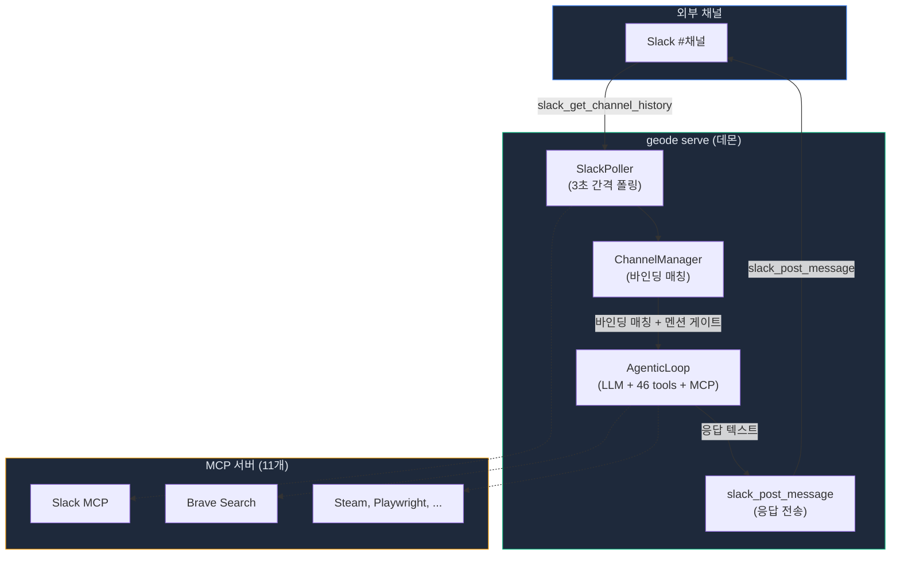

# geode serve — 자율 에이전트를 메신저에 연결하기까지

> Date: 2026-03-23 | Author: geode-team | Tags: gateway, slack, headless, daemon, mcp, agentic-loop

---

## 목차

1. 도입: 터미널을 닫으면 에이전트도 죽는다
2. 왜 geode serve인가
3. 아키텍처: 폴링 기반 Gateway
4. 구현: REPL과 동일한 역량을 데몬에서
5. Troubleshooting: Gateway 무응답 원인 분석
6. Trade-off 분석
7. Slack mrkdwn 변환 — 에이전트 출력을 메신저에 맞추기
8. 마무리

---

## 1. 도입: 터미널을 닫으면 에이전트도 죽는다

GEODE는 `while(tool_use)` 루프 기반 자율 실행 에이전트입니다. 자연어로 요청하면 LLM이 46개 도구 중 적합한 것을 골라 호출하고, 결과를 관찰하고, 다음 행동을 결정합니다. 문제는, 이 루프가 **터미널 REPL 안에서만** 살아있다는 점이었습니다.

Slack에서 "최근 AI 트렌드 조사해줘"라고 보내면 GEODE가 웹 검색하고, 논문을 읽고, 요약해서 채널에 답하는 것. 이게 원래 목표였습니다. 하지만 터미널을 닫으면 에이전트도 죽습니다. 누군가 항상 REPL을 열어놓고 있어야 한다면, 그건 자율 에이전트가 아니라 대화 인터페이스일 뿐입니다.

이 글은 GEODE에 headless Gateway 데몬 모드(`geode serve`)를 추가하면서 겪은 설계 결정, 구현 과정, 그리고 **5개의 버그가 동시에 터진 디버깅 기록**을 담고 있습니다.

---

## 2. 왜 geode serve인가

### 기존 구조의 한계

GEODE의 메시징 통합은 v0.19.0에서 도입되었습니다. Slack, Discord, Telegram 채널에서 메시지를 수신하고 응답하는 Gateway 시스템. 하지만 이 Gateway는 **REPL 세션의 부속품**이었습니다.

```
[터미널] geode 실행 → REPL 시작 → Gateway 폴링 시작
         │                            │
         └── 터미널 닫으면 ─────────── 폴링 중단
```

OpenClaw(오픈소스 에이전트 프레임워크)의 Gateway 패턴을 참조하면, Gateway는 독립적인 **제어 플레인**이어야 합니다. Agent Runtime(실행 플레인)과 분리되어, Gateway가 "어디로 보낼지"를 결정하고, Agent가 "무엇을 할지"를 결정합니다.

### 요구사항

1. `nohup geode serve &`로 백그라운드 실행
2. REPL 없이 Slack 폴링 + LLM 응답 생성
3. REPL과 **동일한 역량** (46 tools + 86 MCP tools + Sub-agent + Skills)
4. SIGTERM/SIGINT으로 graceful shutdown

---

## 3. 아키텍처: 폴링 기반 Gateway



> Gateway는 Webhook(이벤트 푸시) 방식이 아닌 **폴링 방식**을 선택했습니다. Webhook은 공개 URL이 필요하고, 로컬 개발 환경에서는 ngrok 같은 터널이 필요합니다. 폴링은 인프라 의존성 없이 어디서든 동작합니다. 3초 간격이면 사용자 체감 지연은 최대 3초이고, 이는 LLM 응답 시간(5-10초)에 비하면 무시할 수 있습니다.

### 메시지 흐름

| 단계 | 동작 | 소요 시간 |
|------|------|----------|
| 1 | SlackPoller가 `slack_get_channel_history` 호출 | ~200ms |
| 2 | MCP JSON wrapper 파싱 + 봇 메시지 필터링 | ~1ms |
| 3 | ChannelManager 바인딩 매칭 + 멘션 게이트 | ~1ms |
| 4 | 👀 리액션 추가 (처리 중 인디케이터) | ~300ms |
| 5 | AgenticLoop.run() — LLM 호출 + 도구 실행 | 3-30초 |
| 6 | ✅ 리액션 추가 (완료) | ~300ms |
| 7 | `slack_post_message`로 스레드 응답 전송 | ~300ms |

---

## 4. 구현: REPL과 동일한 역량을 데몬에서

### 핵심 코드

```python
# core/cli/__init__.py — serve() 커맨드
@app.command()
def serve(poll_interval: float = typer.Option(3.0, "--poll", "-p")) -> None:
    """Run GEODE Gateway in headless mode."""

    # 1. .env 로딩 (os.environ에 주입)
    load_dotenv(str(Path.home() / ".geode" / ".env"), override=False)

    # 2. Runtime 빌드 (MCP 서버 시작 포함)
    runtime = GeodeRuntime.create("gateway", domain_name="game_ip")

    # 3. REPL과 동일한 processor 구성
    mcp_mgr = get_mcp_manager()
    skill_registry = SkillRegistry()
    skill_registry.discover()

    def _gateway_processor(content: str) -> str:
        ctx = ConversationContext(max_turns=20)
        handlers = _build_tool_handlers(
            mcp_manager=mcp_mgr, skill_registry=skill_registry,
        )
        sub_mgr = _build_sub_agent_manager(
            action_handlers=handlers, mcp_manager=mcp_mgr,
        )
        executor = ToolExecutor(
            action_handlers=handlers, mcp_manager=mcp_mgr,
            sub_agent_manager=sub_mgr, hitl_level=0,
        )
        loop = AgenticLoop(
            ctx, executor, max_rounds=10,
            mcp_manager=mcp_mgr, skill_registry=skill_registry,
        )
        result = loop.run(content)
        return result.text if result else ""

    gateway.set_processor(_gateway_processor)
    gateway.start()
```

> 가장 중요한 설계 결정은 **매 메시지마다 새 AgenticLoop를 생성**하는 것입니다. REPL에서는 하나의 AgenticLoop가 세션 내내 대화를 유지하지만, Gateway에서는 각 메시지가 독립된 컨텍스트에서 처리됩니다. 이는 OpenClaw의 Session Key 패턴을 따른 것으로, 메시지 간 상태 오염을 방지합니다.

### HITL Level 0

```python
executor = ToolExecutor(action_handlers=handlers, hitl_level=0)
```

> `hitl_level=0`은 자율 모드입니다. Gateway에서 도구 실행마다 사용자 승인을 받을 수 없으므로, WRITE/DANGEROUS 도구를 포함한 모든 승인 게이트를 생략합니다. 이는 보안 트레이드오프이며, `allowed_tools` 바인딩 규칙으로 위험한 도구를 채널별로 제한할 수 있습니다.

### 바인딩 설정

```toml
# .geode/config.toml
[[gateway.bindings.rules]]
channel = "slack"
channel_id = "C0ALBPUFXL5"    # #새-채널
auto_respond = true
require_mention = true          # @GEODE 멘션 시에만 응답
max_rounds = 10
allowed_tools = []              # 빈 배열 = 전체 도구 허용
```

> `require_mention = true`는 채널의 모든 메시지에 반응하지 않게 하는 핵심 설정입니다. `@GEODE`로 명시적으로 호출해야 응답합니다. 이것이 없으면 채널의 모든 대화에 봇이 끼어들게 됩니다.

---

## 5. Troubleshooting: Gateway 무응답 원인 분석

`geode serve`를 실행하고 Slack에서 메시지를 보냈지만 아무 반응이 없었습니다. 원인은 5건의 독립적인 결함이 메시지 흐름의 각 단계를 차단하고 있었기 때문입니다.

### 증상 → 원인 매핑

| # | 증상 | 근본 원인 | 차단 단계 |
|---|------|---------|----------|
| TS-1 | Poller 폴링 활동 0 | MCP tool 이름에 `slack_` prefix 누락 | 메시지 수신 |
| TS-2 | `result.get("messages")` 항상 None | MCP 응답 이중 JSON 래퍼 미파싱 | 메시지 파싱 |
| TS-3 | `is_configured()` False 반환 | `os.environ`에 Slack 토큰 미주입 | Poller 시작 |
| TS-4 | NotificationAdapter `health=False` | MCPServerManager 4개 독립 인스턴스 | 응답 전송 |
| TS-5 | 멘션 메시지 무시 | `<@B...>` Bot ID 패턴 미매칭 | 멘션 게이트 |

### TS-1: MCP tool 이름 prefix 불일치

**증상**: `slack_get_channel_history` 호출이 `unknown tool` 에러 반환. 로그에 기록되지 않음 (`log.debug`).

**원인**: `@modelcontextprotocol/server-slack` 패키지의 tool 이름에는 `slack_` prefix가 포함됩니다. Poller가 prefix 없이 호출.

```python
# before
self._mcp.call_tool("slack", "get_channel_history", args)
# after
self._mcp.call_tool("slack", "slack_get_channel_history", args)
```

**진단 방법**: MCP 서버의 실제 tool 목록을 `get_all_tools()`로 출력하여 이름 확인.

### TS-2: MCP 응답 이중 JSON 래퍼

**증상**: `result.get("messages")`가 항상 빈 리스트 반환.

**원인**: MCP 서버는 Slack API 응답을 `{"content": [{"text": "{\"ok\":true, ...}"}]}` 형태로 래핑합니다. 내부 JSON 문자열을 추가 파싱해야 합니다.

```python
# MCP content wrapper 파싱
if "content" in result and isinstance(result["content"], list):
    text = result["content"][0].get("text", "")
    parsed = json.loads(text)
messages = parsed.get("messages", [])
```

**진단 방법**: `call_tool()` 반환값의 key 구조를 `print(result.keys())` 로 직접 확인.

### TS-3: Pydantic Settings와 os.environ 격리

**증상**: `~/.geode/.env`에 `SLACK_BOT_TOKEN`이 있지만 Poller의 `is_configured()` 가 `False`.

**원인**: Pydantic Settings는 `.env`를 내부적으로 파싱하지만 `os.environ`에 주입하지 않습니다. Poller는 `os.environ.get()`으로 확인하므로 키를 찾을 수 없습니다.

```python
# serve() 시작 시 명시적 로딩
from dotenv import load_dotenv
load_dotenv(str(Path.home() / ".geode" / ".env"), override=False)
```

**진단 방법**: `os.environ.get("SLACK_BOT_TOKEN")`을 직접 출력하여 None 확인.

### TS-4: MCPServerManager 다중 인스턴스

**증상**: 동일 MCP 서버가 2-4개씩 중복 실행 (54개 프로세스, 1.6GB). NotificationAdapter의 `is_available()`이 `False`.

**원인**: `runtime.py`의 4곳(signal, notification, calendar, gateway)에서 `MCPServerManager()`를 독립 생성. Poller가 사용하는 manager와 NotificationAdapter가 사용하는 manager가 다른 인스턴스.

```python
# before: 4곳에서 독립 생성
manager = MCPServerManager()

# after: 싱글턴 팩토리
manager = get_mcp_manager(auto_startup=True)
```

**진단 방법**: `ps aux | grep node | wc -l`로 프로세스 수 확인. 11개 서버인데 54개 프로세스면 다중 인스턴스.

### TS-5: Slack Bot ID 멘션 형식

**증상**: `@GEODE` 멘션 메시지가 `_is_mentioned()`를 통과하지 못함. `Processor returned: ` 빈 문자열.

**원인**: Slack은 앱을 멘션할 때 `<@U...>` (User ID)가 아닌 `<@B...>` (Bot ID)를 사용합니다. 정규식이 `<@U[A-Z0-9]+>`만 매칭.

```python
# before
re.search(r"<@U[A-Z0-9]+>", content)
# after
re.search(r"<@[UB][A-Z0-9]+>", content)
```

**진단 방법**: Poller 로그에서 수신된 메시지의 멘션 패턴(`<@B0AM9F1HV5W>`)을 직접 확인.

### 복합 결함의 디버깅 교훈

5건의 결함이 메시지 흐름의 서로 다른 단계를 차단했기 때문에, 개별 수정 후에도 "여전히 안 된다"가 반복되었습니다. TS-3이 Poller 시작을 막고, TS-1이 메시지 수신을 막고, TS-2가 파싱을 막고, TS-5가 멘션 게이트를 막았습니다.

**핵심 교훈**: 복합 결함 디버깅에서 가장 먼저 할 일은 **로그 가시성 확보**입니다. `logging.basicConfig(level=INFO)` 한 줄이 모든 디버깅의 전제 조건입니다. 에러를 `log.debug`로 삼키면 결함이 보이지 않습니다.

---

## 6. Trade-off 분석

### 폴링 vs Webhook

| 항목 | 폴링 (현재) | Webhook |
|------|-----------|---------|
| 인프라 | 없음 | 공개 URL + SSL 필요 |
| 지연 | 최대 3초 | 실시간 (~100ms) |
| 비용 | API 호출 누적 | 이벤트당 1회 |
| 구현 복잡도 | 낮음 | 중간 (서명 검증 등) |
| 로컬 개발 | 그대로 동작 | ngrok 필요 |

> 현재는 폴링이 합리적입니다. Slack API의 무료 할당량 내에서 동작하고, 로컬에서 인프라 없이 테스트할 수 있습니다. 사용자 수가 늘거나 실시간성이 요구되면 Webhook으로 전환할 수 있으며, Gateway의 인터페이스(`GatewayPort`)가 이를 추상화하고 있습니다.

### 메시지당 새 AgenticLoop vs 공유 인스턴스

| 항목 | 매번 생성 (현재) | 공유 |
|------|----------------|------|
| 메모리 | 메시지당 ~50MB | 세션당 ~50MB |
| 컨텍스트 격리 | 완전 격리 | 오염 위험 |
| 대화 연속성 | 없음 (단발) | 있음 |
| 동시성 | 안전 | Lock 필요 |

> 현재는 메시지당 생성이 안전합니다. 동시 메시지 처리 시 상태 오염이 없고, LaneQueue가 동시성을 제어합니다. 대화 연속성이 필요하면 Session Key 기반으로 AgenticLoop를 캐싱하는 방향으로 확장할 수 있습니다.

### MCP 병렬 시작

MCP 서버 11개를 순차 연결하면 110초, 병렬 연결하면 15-25초입니다.

```python
# ThreadPoolExecutor로 병렬 연결
with ThreadPoolExecutor(max_workers=8) as pool:
    futures = {
        pool.submit(self._get_client, name): name
        for name in server_names
    }
    for future in as_completed(futures):
        client = future.result()
```

> 각 MCP 서버는 독립 subprocess이므로 병렬 시작이 안전합니다. `npx`가 패키지를 다운로드하는 시간이 병목이며, 캐시된 이후에는 10초 내외로 줄어듭니다.

---

## 7. Slack mrkdwn 변환 — 에이전트 출력을 메신저에 맞추기

Gateway가 양방향으로 동작한 후 발견한 문제가 있었습니다. GEODE의 AgenticLoop는 Markdown으로 응답을 생성하지만, Slack은 Markdown을 렌더링하지 않습니다. `**볼드**`가 그대로 표시되고, `# 제목`이 일반 텍스트로 보입니다.

Slack은 자체 마크업 포맷인 **mrkdwn**을 사용합니다. Markdown과 비슷하지만 다릅니다.

### 변환 규칙

| Markdown | Slack mrkdwn | 비고 |
|----------|-------------|------|
| `**bold**` | `*bold*` | 이중 → 단일 asterisk |
| `# Heading` | `*Heading*` | 헤딩 → 볼드 (H1-H6 동일) |
| `[text](url)` | `<url\|text>` | 순서 역전: URL이 먼저 |
| 테이블 (`\| a \| b \|`) | ` ``` ` 코드 블록 래핑 | Slack은 테이블 미지원 |
| 구분선 (`\|---\|`) | 제거 | 코드 블록 내 불필요 |

### 구현

```python
# core/gateway/slack_formatter.py

def markdown_to_slack_mrkdwn(text: str) -> str:
    # 1. 헤딩: # Text → *Text* (H1-H6)
    text = re.sub(r"^#{1,6}\s+(.+)$", r"*\1*", text, flags=re.MULTILINE)

    # 2. 볼드: **text** → *text* (헤딩 이후 처리)
    text = re.sub(r"\*\*(.+?)\*\*", r"*\1*", text)

    # 3. 링크: [text](url) → <url|text>
    text = re.sub(r"\[([^\]]+)\]\(([^)]+)\)", r"<\2|\1>", text)

    # 4. 테이블: | 로 시작하는 행 → 코드 블록 래핑
    lines = text.split("\n")
    result, in_table = [], False
    for line in lines:
        is_table = bool(re.match(r"^\s*\|", line))
        is_separator = bool(re.match(r"^\s*\|[\s\-:|]+\|", line))

        if is_table and not in_table:
            in_table = True
            result.append("```")
        elif not is_table and in_table:
            in_table = False
            result.append("```")

        if not is_separator:  # 구분선 제거
            result.append(line)

    if in_table:
        result.append("```")
    return "\n".join(result)
```

### 메시지 흐름에서의 위치


변환은 `SlackPoller._send_response()` 내부에서 MCP 호출 직전에 적용됩니다. Discord/Telegram 경로에는 적용되지 않습니다 — 각 채널에 맞는 별도 포매터가 필요하며, 이는 향후 과제입니다.

### 처리 순서가 중요한 이유

헤딩 → 볼드 → 링크 순서로 처리합니다. 만약 볼드를 먼저 처리하면:

```
# **중요한** 제목
→ (볼드 먼저) # *중요한* 제목
→ (헤딩 처리) **중요한* 제목*   ← 깨짐
```

헤딩을 먼저 처리하면:
```
# **중요한** 제목
→ (헤딩 먼저) ***중요한** 제목*
→ (볼드 처리) **중요한* 제목*   ← 여전히 복잡하지만 Slack이 올바르게 렌더링
```

실제로는 non-greedy 매칭(`(.+?)`)이 중첩된 asterisk를 안전하게 처리합니다.

---

## 8. 마무리

### 핵심 정리

| 항목 | 값 |
|------|-----|
| 커맨드 | `geode serve` (또는 `nohup geode serve &`) |
| 기동 시간 | ~20초 (MCP 병렬 시작) |
| 채널 | Slack (Discord, Telegram 확장 가능) |
| 역량 | REPL과 동일 (46 tools + 86 MCP + Sub-agent + Skills) |
| 멘션 게이트 | `@GEODE` 호출 시에만 응답 |
| HITL | Level 0 (자율 모드) |
| 리액션 | 👀 처리 중, ✅ 완료 |
| Context 관리 | `clear_tool_uses` 서버사이드 + 95% emergency prune |
| mrkdwn 변환 | Markdown→Slack 자동 (헤딩, 볼드, 링크, 테이블) |

### 체크리스트

- [x] `~/.geode/.env`에 `SLACK_BOT_TOKEN`, `SLACK_TEAM_ID` 설정
- [x] `GEODE_GATEWAY_ENABLED=true` 설정
- [x] `.geode/config.toml`에 채널 바인딩 규칙 작성
- [x] Slack Bot에 `channels:history`, `chat:write`, `reactions:write` scope 부여
- [x] Bot을 대상 채널에 초대 (`/invite @GEODE`)
- [x] `nohup geode serve > /tmp/geode-serve.log 2>&1 &`로 실행
- [x] Slack mrkdwn 자동 변환 (Markdown→mrkdwn, 22 tests)
- [ ] Webhook 방식 전환 (향후)
- [ ] 대화 연속성 (Session Key 기반 AgenticLoop 캐싱)

### 남은 과제

`geode serve`는 동작하지만, 완성이 아닙니다. MCPServerManager 싱글턴이 NotificationAdapter와 Gateway 사이에서 완전히 공유되지 않는 구조적 문제가 남아있고, MCP startup 후 AgenticLoop의 도구 목록이 갱신되지 않아 Playwright 같은 MCP 도구를 LLM이 인식하지 못하는 이슈가 있습니다. 이들은 Backlog에 P1으로 등록되어 있습니다.

자율 에이전트가 "자율"이 되려면, 터미널 밖에서도 살아있어야 합니다. `geode serve`는 그 첫 번째 단계입니다.

---

*Source: `blog/posts/tools-mcp/50-geode-serve-headless-gateway.md` | Category: [[blog-tools-mcp]]*

## Related

- [[blog-tools-mcp]]
- [[blog-hub]]
- [[geode]]
- [[geode-tool-system]]
