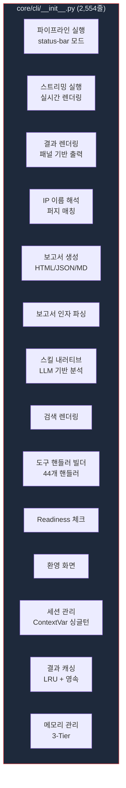
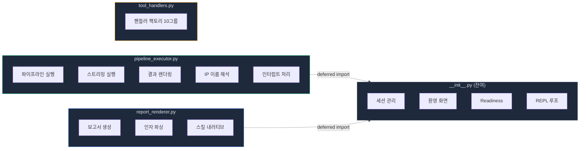
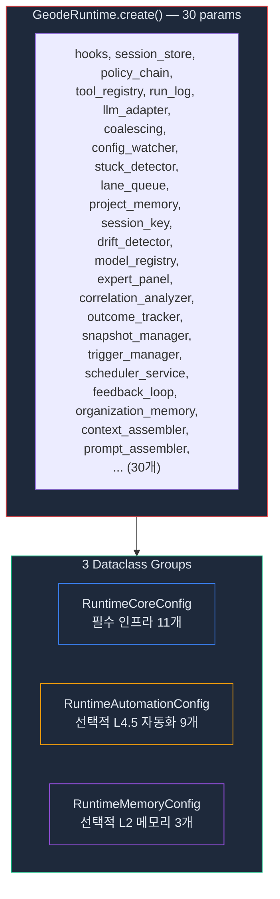

# God Object 해체 — 2,554줄 __init__.py를 분해하고 3,000줄을 삭제한 기록

> 14개의 책임이 하나의 파일에 살고 있었습니다.
> 파이프라인 실행, 보고서 렌더링, 도구 핸들러, IP 해석, 세션 관리, 캐싱...
> 이 글은 2,554줄 God Object를 분할하고, 데드코드를 찾아 삭제하고,
> 184개 모듈을 178개로 줄인 리팩토링 과정을 기록합니다.

> Date: 2026-03-24 | Author: geode-team | Tags: refactoring, god-object, dead-code, clean-architecture, cli, dataclass

---

## 목차

1. 도입: 2,554줄 파일의 무게
2. 문제 진단: 14개 책임 식별
3. 설계: 추출 전략과 순환 참조 해법
4. 1단계 — God Object 분할
5. 2단계 — 핸들러 단일 소스화
6. 3단계 — 데드코드 6모듈 삭제
7. 4단계 — RuntimeBuilder 30→3
8. 결과와 교훈

---

## 1. 도입: 2,554줄 파일의 무게

GEODE의 CLI 진입점 `core/cli/__init__.py`는 프로젝트 초기부터 기능이 추가될 때마다 자라났습니다. 파이프라인 실행 로직, 보고서 생성, 도구 핸들러 팩토리, 검색 렌더링, 환영 화면까지 하나의 파일에 들어있었습니다.

2,554줄. 이 파일 하나가 전체 184개 모듈의 1.4%를 차지했습니다. 문제는 줄 수가 아니라 **변경의 충돌**이었습니다. 보고서 포맷을 수정하려면 파이프라인 코드 사이를 탐색해야 했고, 핸들러를 추가하면 diff가 2,000줄짜리 파일에서 발생했습니다.

이 글은 4단계에 걸친 리팩토링으로 **3,991줄을 삭제**하고, 모듈 수를 178개로 줄인 과정을 기록합니다.

---

## 2. 문제 진단: 14개 책임 식별

`__init__.py`에서 식별한 책임은 14개였습니다.



Kent Beck의 Simple Design 규칙 중 "각 클래스/모듈은 하나의 변경 이유만 가져야 한다"에 비추면, 이 파일은 **14개의 변경 이유**를 가지고 있었습니다.

---

## 3. 설계: 추출 전략과 순환 참조 해법

### 추출 대상 선정

14개 책임 중 **응집도가 높은 클러스터**를 우선 추출합니다.



### 순환 참조 해법: Deferred Import

추출된 모듈이 `__init__.py`의 캐시나 함수를 참조해야 하는 경우가 있습니다. 모듈 최상단에서 import하면 순환 참조가 발생합니다.

```python
# report_renderer.py — 순환 참조 해법
def _generate_report(ip_name, ...):
    from core.cli import _result_cache, _run_analysis  # 함수 내부에서 import
    cached = _result_cache.get(ip_name)
    if cached is None:
        cached = _run_analysis(ip_name, ...)
    ...
```

함수가 호출되는 시점에는 `__init__.py`가 이미 로딩 완료된 상태이므로 순환이 발생하지 않습니다. 이 패턴을 **deferred import**라 합니다.

---

## 4. 1단계 — God Object 분할

### pipeline_executor.py (642줄)

파이프라인 실행, 결과 렌더링, IP 해석을 담당하는 14개 함수를 추출했습니다.

```python
# core/cli/pipeline_executor.py — 핵심 구조

def _run_analysis(ip_name, *, dry_run, verbose, ...):
    """분석 실행 — interactive/CLI 공용 진입점."""
    resolved = _resolve_ip_name(ip_name)
    runtime = GeodeRuntime.create(...)
    if stream:
        return _execute_pipeline_streaming(runtime, ...)
    return _execute_pipeline(runtime, ...)

def _execute_pipeline(runtime, graph, state, ...):
    """Status-bar 모드 실행 — 프로그레스 라인 + 인터럽트 처리."""
    for event in graph.stream(state):
        _merge_event_output(state, event)
        _progress_line(state, terminal_width)

def _resolve_ip_name(ip_name: str) -> str | None:
    """4단계 퍼지 매칭: exact → canonical → substring → None."""
    from core.cli.ip_names import get_ip_name_map  # deferred
    ...
```

### report_renderer.py (258줄)

보고서 생성, 인자 파싱, 스킬 내러티브를 담당하는 4개 함수 + 5개 상수.

```python
# core/cli/report_renderer.py — 핵심 구조

def _generate_report(ip_name, *, format_type, template, ...):
    """보고서 파이프라인: 캐시 → 분석 → 렌더 → 저장."""
    from core.cli import _result_cache, _run_analysis  # deferred
    ...

def _build_skill_narrative(result, skill_registry):
    """LLM 기반 전문가 분석 — 스킬 컨텍스트 주입."""
    ...
```

### Re-export로 하위 호환성 유지

`__init__.py`에서 기존 import 경로를 유지합니다.

```python
# core/cli/__init__.py — 명시적 re-export
from core.cli.pipeline_executor import _run_analysis as _run_analysis
from core.cli.pipeline_executor import _execute_pipeline as _execute_pipeline
from core.cli.report_renderer import _generate_report as _generate_report
```

`import X as X` 구문은 Ruff/mypy에게 "의도적 re-export"임을 알립니다.

**결과**: `__init__.py` 2,554 → 1,768줄 (**-786줄, -31%**)

---

## 5. 2단계 — 핸들러 단일 소스화

`__init__.py`에 인라인으로 존재하던 44개 도구 핸들러를 `tool_handlers.py`로 통합했습니다.

### Curried Factory 패턴

핸들러는 설정을 클로저로 캡처합니다. 매 호출마다 설정을 전달할 필요가 없습니다.

```python
# core/cli/tool_handlers.py

def _build_analysis_handlers(verbose: bool, force_dry: bool, skill_registry):
    def handle_analyze_ip(**kwargs):
        dry_run = kwargs.get("dry_run", force_dry)  # 클로저 캡처
        return _run_analysis(ip_name, dry_run=dry_run, verbose=verbose)
    return {"analyze_ip": handle_analyze_ip, ...}

def _build_tool_handlers(verbose, force_dry, skill_registry, ...):
    """10개 그룹의 핸들러를 하나의 dict로 합산."""
    handlers = {}
    handlers.update(_build_analysis_handlers(verbose, force_dry, skill_registry))
    handlers.update(_build_memory_handlers())
    handlers.update(_build_plan_handlers())
    # ... 7개 더
    return handlers
```

10개 핸들러 그룹: analysis(6) + memory(3) + plan(5) + hitl(3) + system(6) + execution(3) + delegated(5) + profile(4) + signal(4) + mcp(1) = **44개 핸들러**.

**결과**: 인라인 핸들러 **-898줄** 삭제, `tool_handlers.py` 1,156줄로 단일 소스화.

---

## 6. 3단계 — 데드코드 6모듈 삭제

### 탐지 방법론

데드코드 탐지에서 가장 위험한 실수는 **basename 검색**입니다.

```bash
# 잘못된 방법 — false positive 발생
grep -r "repl" core/           # "REPL"이라는 문자열에도 매칭

# 올바른 방법 — full module path 검색
module_path="core.cli.repl"
grep -rn "from ${module_path}\|import ${module_path}" core/ --include="*.py"
```

이 방법으로 **6개 데드 모듈**을 식별했습니다.

### 삭제 목록

| 모듈 | 줄 수 | 삭제 근거 |
|------|:-----:|----------|
| `core/cli/repl.py` | 487 | 어디서도 import 없음 |
| `core/automation/trigger_endpoint.py` | 313 | 어디서도 import 없음 |
| `core/orchestration/agent_reflection.py` | 111 | v0.23에서 제거된 기능 |
| `core/orchestration/context_compactor.py` | 189 | 80% compaction 제거 후 잔류 |
| `core/infrastructure/adapters/mcp/linkedin_adapter.py` | 88 | 통합 비활성화 |
| `core/infrastructure/adapters/mcp/memory_adapter.py` | 55 | session store로 통합 |
| **합계** | **1,243** | |

의존하던 테스트 5개도 함께 삭제: **-1,064줄**.

**결과**: 모듈 184 → 178 (**-6**), 테스트 3,057 → 2,972 (**-85**)

---

## 7. 4단계 — RuntimeBuilder 30→3

`GeodeRuntime.create()`의 파라미터가 30개에 달했습니다. 3개의 데이터클래스로 분리했습니다.



```python
@dataclass
class RuntimeCoreConfig:
    """필수 인프라 — 항상 필요."""
    hooks: HookSystemPort
    session_store: SessionStorePort
    policy_chain: PolicyChainPort
    tool_registry: ToolRegistryPort
    # ... 11개 필드

@dataclass
class RuntimeAutomationConfig:
    """L4.5 자동화 — 모두 선택적."""
    drift_detector: DriftDetectorPort | None = None
    model_registry: ModelRegistryPort | None = None
    # ... 9개 필드 (전부 Optional)

@dataclass
class RuntimeMemoryConfig:
    """L2 메모리 — 모두 선택적."""
    organization_memory: OrganizationMemoryPort | None = None
    context_assembler: ContextAssembler | None = None
    prompt_assembler: Any | None = None
```

**효과**: 파라미터 의도가 명확해집니다. "필수 vs 선택", "인프라 vs 자동화 vs 메모리"가 타입 레벨에서 구분됩니다.

---

## 8. 결과와 교훈

### 수치 요약

| 지표 | Before | After | 변화 |
|------|--------|-------|------|
| `__init__.py` | 2,554줄 | 1,762줄 | **-31%** |
| 인라인 핸들러 | 898줄 (산재) | 0줄 (통합) | **-898줄** |
| 데드 모듈 | 6개 / 1,243줄 | 0 | **-1,243줄** |
| 데드 테스트 | 5개 / 1,064줄 | 0 | **-1,064줄** |
| 총 삭제 | — | — | **-3,991줄** |
| 모듈 수 | 184 | 178 | -6 |
| 테스트 수 | 3,057 | 2,972 | -85 |
| 전체 테스트 | — | 2,972 PASS | Lint/mypy strict 통과 |

### 핵심 교훈

1. **Deferred import으로 순환 참조를 해결하라**: 모듈 구조를 뒤집는 대신, 함수 내부에서 import합니다. 호출 시점에는 순환이 발생하지 않습니다.

2. **데드코드는 full module path로 검색하라**: `grep -r "repl"`은 문서의 "REPL"에도 매칭됩니다. `grep -r "core.cli.repl"`만이 실제 import를 찾습니다.

3. **부분 리팩토링은 전체 리팩토링보다 위험하다**: 코드를 새 모듈에 추출하고 원본을 삭제하지 않으면, 두 곳에서 같은 함수가 호출됩니다. 디버깅에 시간이 기하급수적으로 늘어납니다.

4. **설정은 의미 단위로 묶어라**: 30개 파라미터를 나열하는 대신, "필수 인프라 / 선택적 자동화 / 선택적 메모리"로 그룹화하면 어떤 파라미터가 빠져도 어디를 봐야 하는지 명확합니다.

### 체크리스트

- [x] God Object 분할 (pipeline_executor + report_renderer)
- [x] 핸들러 단일 소스화 (tool_handlers.py)
- [x] 데드코드 6모듈 삭제 (-1,243줄)
- [x] RuntimeBuilder 30→3 데이터클래스
- [x] Deferred import으로 순환 참조 해결
- [x] 전체 테스트 PASS + Lint + mypy strict
- [ ] `serve-repl-unify` — serve/REPL 초기화 단일 소스화 (Backlog P0)

---

*Source: `blog/posts/architecture/53-god-object-refactoring-3000-lines-deleted.md` | Category: [[blog-architecture]]*

## Related

- [[blog-architecture]]
- [[blog-hub]]
- [[geode]]
- [[geode-architecture]]
