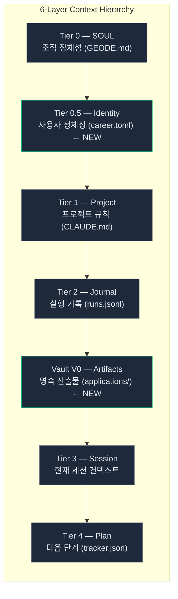
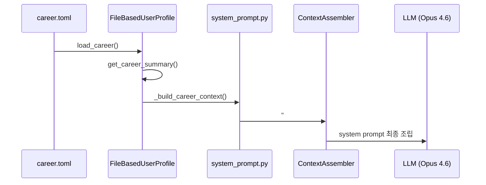
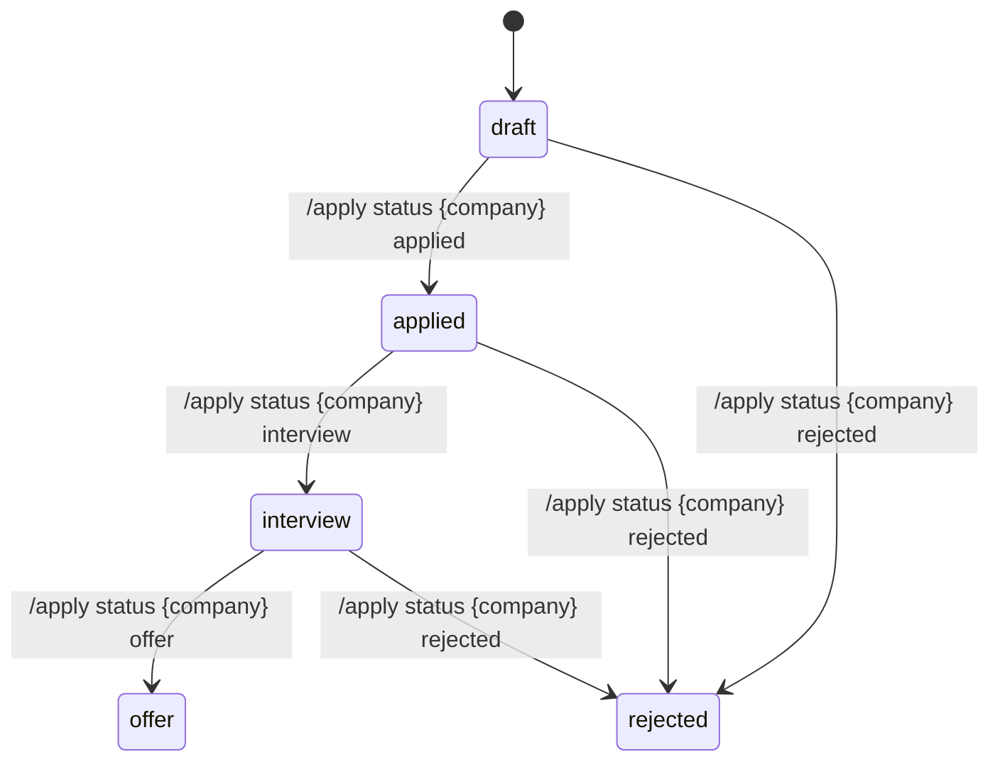

# Context Hub 구현기 — career.toml에서 /apply까지

> 에이전트가 "나"를 알면 답이 달라집니다.
> "최근 AI 트렌드 분석해줘"에 대한 응답은
> 신입 개발자와 5년차 ML 엔지니어에게 같을 수 없습니다.
> 이 글은 GEODE에 사용자 정체성(career.toml)을 주입하고,
> 컨텍스트를 조회(/context)하고, 지원 이력을 관리(/apply)하는
> Context Hub 3건의 구현 과정을 기록합니다.

> Date: 2026-03-24 | Author: geode-team | Tags: context-hub, career-toml, identity, vault, slash-command, memory-hierarchy

---

## 목차

1. 도입: 에이전트가 사용자를 모른다
2. 설계: 6-Layer Context Hierarchy에서 Tier 0.5의 위치
3. career.toml — 사용자 정체성 정의
4. 시스템 프롬프트 주입 파이프라인
5. /context — 전 계층 조회
6. /apply — Vault 기반 지원 이력 관리
7. 테스트와 결과

---

## 1. 도입: 에이전트가 사용자를 모른다

GEODE의 시스템 프롬프트에는 에이전트의 정체성(SOUL), 프로젝트 규칙(CLAUDE.md), 실행 기록(Journal)이 주입됩니다. 하지만 **사용자가 누구인지**는 어디에도 없었습니다.

같은 "Elden Ring 시장 가치를 분석해줘"라는 요청에도, 게임 업계 투자자와 게임 리뷰어에게는 다른 관점의 분석이 필요합니다. 에이전트가 사용자의 역할, 경력, 목표를 알면 응답의 초점이 달라집니다.

Context Hub는 이 문제를 해결하는 3건의 구현입니다:
1. **career.toml**: 사용자 정체성 정의 (입력)
2. **/context**: 전 계층 컨텍스트 조회 (가시성)
3. **/apply**: 지원 이력 관리 (Vault 활용)

---

## 2. 설계: 6-Layer Context Hierarchy에서 Tier 0.5의 위치

GEODE의 컨텍스트는 6개 계층으로 구성됩니다. career.toml은 **Tier 0.5 (Identity)**로, SOUL(조직 정체성)과 Project(프로젝트 규칙) 사이에 위치합니다.



**설계 원칙**: 상위 계층이 하위 계층을 덮어씁니다. SOUL이 "게임 IP 분석 에이전트"라고 정의하면, Identity의 "ML 엔지니어"는 분석 톤에 영향을 주되 목적을 바꾸지는 않습니다.

---

## 3. career.toml — 사용자 정체성 정의

### 스키마

```toml
# ~/.geode/identity/career.toml

[identity]
title = "AI Agent Engineer"
experience = "9months"
skills = ["Python", "LangGraph", "Claude Code", "MCP"]

[goals]
seeking = "AI Agent 엔지니어 포지션"
target_companies = ["Toss", "KRAFTON", "Naver"]
preferred_location = "Seoul / Remote"
```

### 로딩

```python
# core/memory/user_profile.py

def load_career(self) -> dict[str, Any]:
    """career.toml 파싱. 파일 없으면 빈 dict 반환 (graceful degradation)."""
    career_path = Path.home() / ".geode" / "identity" / "career.toml"
    if not career_path.exists():
        return {}
    try:
        import tomllib
        with open(career_path, "rb") as f:
            return tomllib.load(f)
    except Exception:
        return {}
```

**왜 TOML인가?** Python 3.11+ 내장 `tomllib`으로 외부 의존성 없이 파싱. YAML보다 구조가 엄격하고, JSON보다 사람이 편집하기 쉽습니다. `~/.geode/identity/`에 위치하여 프로젝트와 독립된 전역 설정입니다.

### 1줄 요약 생성

```python
def get_career_summary(self) -> str:
    """career.toml → 시스템 프롬프트용 1줄 요약."""
    career = self.load_career()
    identity = career.get("identity", {})
    goals = career.get("goals", {})

    parts = []
    if identity.get("title"):
        parts.append(identity["title"])
    if identity.get("experience"):
        parts.append(f"({identity['experience']})")
    if identity.get("skills"):
        parts.append(f"skills: {'/'.join(identity['skills'])}")
    if goals.get("seeking"):
        parts.append(f"seeking: {goals['seeking']}")
    return ", ".join(parts)
    # → "AI Agent Engineer (9months), skills: Python/LangGraph/Claude Code/MCP, seeking: AI Agent 엔지니어 포지션"
```

---

## 4. 시스템 프롬프트 주입 파이프라인

career.toml의 요약이 LLM에 도달하는 경로입니다.



```python
# core/cli/system_prompt.py

def _build_career_context() -> str:
    profile = FileBasedUserProfile()
    summary = profile.get_career_summary()
    if summary:
        return f"## User Career\n{summary}"
    return ""
```

이 함수는 `ContextAssembler`의 조립 파이프라인에서 호출됩니다. career.toml이 없으면 빈 문자열을 반환하고, 시스템 프롬프트에 아무것도 추가되지 않습니다. **Graceful degradation** — 설정이 없어도 에이전트는 정상 동작합니다.

---

## 5. /context — 전 계층 조회

### 용도

에이전트에 어떤 컨텍스트가 주입되고 있는지 사용자가 직접 확인합니다.

```
geode> /context

╭─ Context Layers ─────────────────────────╮
│ SOUL:      GEODE — 저평가 IP 발굴 Agent  │
│ Identity:  AI Agent Engineer (9months)    │
│ Project:   /workspace/geode              │
│ Journal:   3 recent runs                 │
│ Vault:     2 applications tracked        │
│ Session:   Turn 5, 23% context used      │
╰──────────────────────────────────────────╯
```

### 서브커맨드

```
/context          — 전 계층 요약
/context career   — career.toml 상세
/context profile  — 사용자 프로필 상세
/ctx              — 축약 별칭
```

### 구현

```python
# core/cli/commands.py

def handle_context(args: list[str], **kwargs) -> str:
    subcommand = args[0] if args else ""

    if subcommand == "career":
        profile = FileBasedUserProfile()
        career = profile.load_career()
        # career.toml 상세 출력
        ...
    elif subcommand == "profile":
        # 사용자 프로필 상세 출력
        ...
    else:
        # 전 계층 요약
        layers = []
        layers.append(("SOUL", _get_soul_summary()))
        layers.append(("Identity", _get_career_summary()))
        layers.append(("Project", _get_project_summary()))
        layers.append(("Journal", _get_journal_summary()))
        layers.append(("Vault", _get_vault_summary()))
        layers.append(("Session", _get_session_summary()))
        _render_context_table(layers)
```

**설계 의도**: `/context`는 디버깅 도구입니다. "에이전트가 왜 이렇게 답했지?"라는 질문에 대해, 주입된 컨텍스트를 직접 확인하여 원인을 추적할 수 있습니다.

---

## 6. /apply — Vault 기반 지원 이력 관리

### ApplicationTracker

Vault V0의 `applications/` 디렉토리에 지원 이력을 JSON으로 저장합니다.

```python
# core/memory/vault.py

@dataclass
class ApplicationEntry:
    company: str
    position: str
    status: str        # draft → applied → interview → offer → rejected
    applied_at: str    # ISO 8601
    url: str = ""
    notes: str = ""
```

### 5-State 상태 머신



### 커맨드

```
/apply                              — 전체 목록
/apply add Toss "AI Engineer"       — 신규 등록
/apply status Toss interview        — 상태 변경
/apply remove Toss                  — 삭제
```

### 컬러 코딩

| 상태 | Rich 스타일 | 의미 |
|------|-----------|------|
| draft | dim | 준비 중 |
| applied | blue | 제출 완료 |
| interview | yellow | 면접 진행 |
| offer | green | 합격 |
| rejected | red | 탈락 |

### 저장 구조

```
~/.geode/vault/applications/
└── tracker.json
    [
      {"company": "Toss", "position": "AI Engineer", "status": "interview", ...},
      {"company": "KRAFTON", "position": "AI Agent Engineer", "status": "applied", ...}
    ]
```

---

## 7. 테스트와 결과

### 테스트 커버리지 (26건)

| 그룹 | 건수 | 범위 |
|------|:----:|------|
| Career 로딩 | 5 | TOML 파싱, 누락 파일, 잘못된 포맷 |
| 시스템 프롬프트 주입 | 2 | 요약 생성, 빈 career |
| /context 커맨드 | 3 | 전체 요약, 서브커맨드, 빈 상태 |
| 커맨드 등록 | 2 | COMMAND_MAP, 디스패처 |
| ApplicationTracker CRUD | 9 | add/status/remove/list, 중복, 누락 |
| /apply 커맨드 | 4 | 서브커맨드 파싱, 상태 변경, 삭제 |
| ContextAssembler 통합 | 1 | career → context 파이프라인 |

### 핵심 설계 결정

1. **Graceful degradation**: career.toml이 없어도 에러 없이 빈 컨텍스트로 동작. 에이전트의 기본 기능에 영향 없음.

2. **전역 vs 프로젝트**: career.toml은 `~/.geode/identity/`에 위치. 사용자 정체성은 프로젝트를 넘어 일관적이어야 하므로 전역 스코프가 맞습니다.

3. **TOML 선택**: Python 3.11+ 내장 `tomllib`. 외부 패키지 의존 없음. YAML 대비 파싱 규칙이 엄격하여 실수가 줄어듭니다.

4. **Vault 저장**: 지원 이력은 Journal(불변 실행 기록)이 아닌 Vault(변경 가능 산출물)에 저장. 상태가 변하는 데이터는 Vault가 적합합니다.

### 체크리스트

- [x] career.toml 스키마 + 로더 + 요약 생성
- [x] 시스템 프롬프트 자동 주입 (`_build_career_context`)
- [x] /context 슬래시 커맨드 (전 계층 조회)
- [x] /apply 슬래시 커맨드 (CRUD + 5-state)
- [x] ApplicationTracker + Vault 영속화
- [x] 26 tests 전체 통과
- [ ] career.toml 대화형 생성 위자드 (향후)
- [ ] /context diff — 이전 세션 대비 변경 추적 (향후)

---

*Source: `blog/posts/memory-context/54-context-hub-career-toml-to-apply.md` | Category: [[blog-memory-context]]*

## Related

- [[blog-memory-context]]
- [[blog-hub]]
- [[geode]]
- [[geode-memory-system]]
