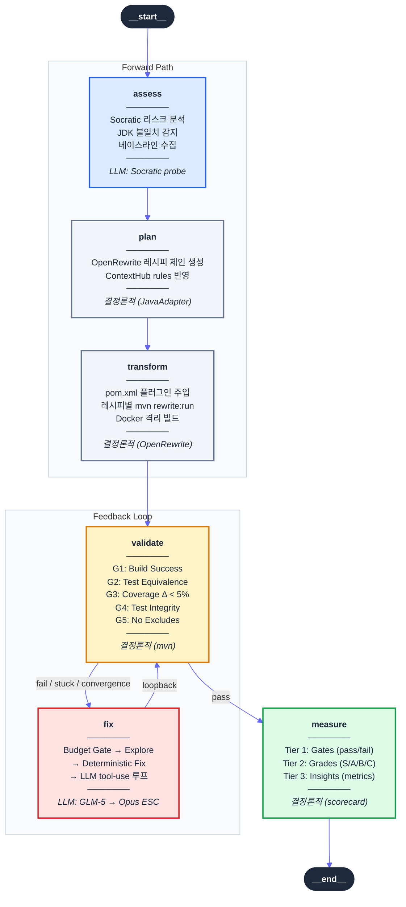
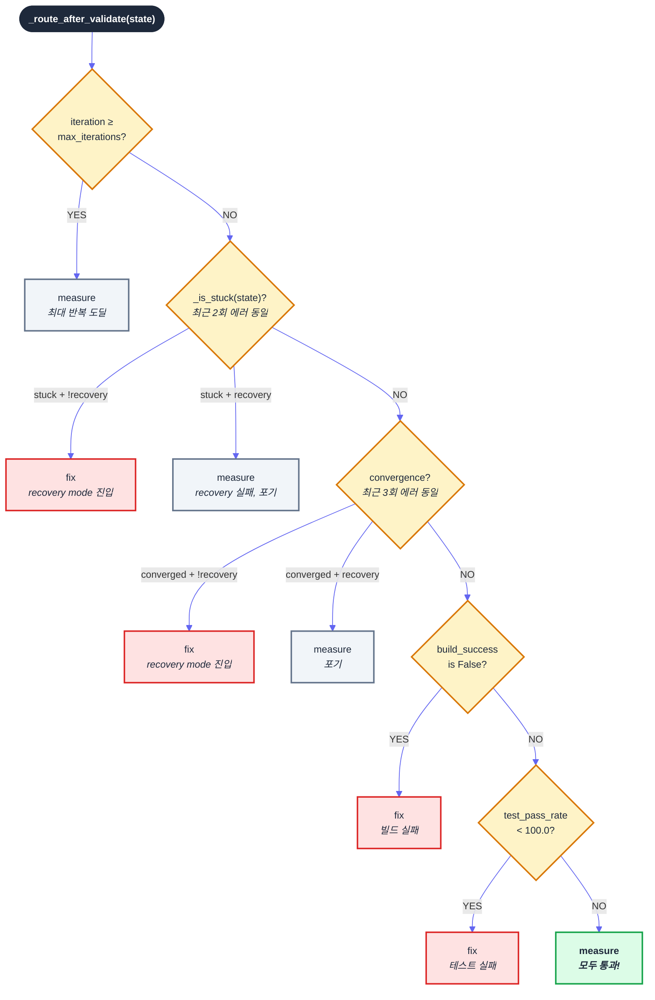

# REODE 마이그레이션 DAG: LangGraph 위의 6-노드 상태 머신 설계

> 마이그레이션 파이프라인은 선형이 아닙니다. 빌드가 실패하면 되돌아가고,
> 같은 에러가 반복되면 모델을 교체하고, 예산이 초과되면 중단합니다.
> 이 글은 REODE가 LangGraph StateGraph 위에 이 모든 분기를 **6개 노드와 7개 엣지**로
> 표현한 설계를 기록합니다.
>
> 기존 포스트([47번: 재귀개선루프](https://rooftopsnow.tistory.com/336))가
> "왜 재귀개선루프인가"를 다뤘다면, 이 글은 **"어떻게 구현했는가"**에 집중합니다.

---

## 1. 왜 DAG인가 — 순차 파이프라인의 한계

마이그레이션을 `assess → plan → transform → validate → measure` 순서로 실행하면 간단합니다. 하지만 현실에서는 validate가 실패합니다. 실패하면 돌아가서 고쳐야 합니다. 고쳐도 같은 에러가 반복되면 더 강력한 모델로 교체해야 합니다. 예산이 바닥나면 중단해야 합니다.

순차 파이프라인에서 이 분기를 처리하려면 `if-else` 중첩이 기하급수적으로 늘어납니다. LangGraph의 `StateGraph`는 이 문제를 **노드 + 조건부 엣지**로 해결합니다. 각 분기 조건은 엣지 함수에 캡슐화되고, 노드는 자신의 역할만 수행합니다.

```python
# 순차 파이프라인의 한계
def run_migration():
    assess()
    plan()
    transform()
    result = validate()
    if not result.success:
        for i in range(max_iter):
            fix()
            result = validate()
            if result.success:
                break
            if is_stuck(result):
                if not recovery_attempted:
                    fix(recovery=True)     # 중첩 시작
                    result = validate()
                    if result.success:
                        break              # 중첩 심화
                else:
                    break
    measure()
```

이 코드는 5개 분기에서 이미 읽기 어렵습니다. REODE의 실제 라우팅 조건은 **8가지**입니다. StateGraph로 전환하면 각 조건이 독립된 함수가 됩니다.

---

## 2. 그래프 토폴로지: 7개 엣지의 의미



7개 엣지 중 5개는 **고정 엣지**(무조건 이동), 2개는 **조건부 엣지**(상태에 따라 분기)입니다.

```python
# migration.py — 그래프 구성 (lines 2760-2777)
graph = StateGraph(MigrationState)

# 6개 노드 등록
graph.add_node("assess",    self._assess_node)
graph.add_node("plan",      self._plan_node)
graph.add_node("transform", self._transform_node)
graph.add_node("validate",  self._validate_node)
graph.add_node("fix",       self._fix_node)
graph.add_node("measure",   self._measure_node)

# 5개 고정 엣지
graph.add_edge(START, "assess")
graph.add_edge("assess", "plan")
graph.add_edge("plan", "transform")
graph.add_edge("transform", "validate")
graph.add_edge("fix", "validate")         # 루프백

# 1개 조건부 엣지 (2개 분기)
graph.add_conditional_edges(
    "validate",
    _route_after_validate,
    {"measure": "measure", "fix": "fix"},
)
graph.add_edge("measure", END)
```

이 구조에서 **유일한 결정 지점**은 `validate` 노드 이후입니다. 나머지는 모두 결정론적입니다. 이것은 의도적인 설계입니다 — 복잡성을 한 곳에 집중시켜 디버깅과 테스트를 단순화합니다.

---

## 3. MigrationState: 노드 간 계약서

LangGraph에서 State는 노드 간 데이터 전달의 유일한 채널입니다. 노드가 직접 다른 노드를 호출하거나, 전역 변수를 공유하지 않습니다. 모든 것은 State를 통합니다.

### 3.1 기본 상태 (ReodeState)

```python
class ReodeState(TypedDict):
    # 세션 식별
    session_id: str
    run_id: str
    pipeline_name: str

    # 소스/타겟 정보
    source_lang: str
    source_version: str
    source_framework: str
    source_path: str
    target_lang: str
    target_version: str
    target_framework: str
    target_path: str

    # 실행 추적
    current_phase: str
    phases_completed: list[str]
    iteration: int
    max_iterations: int

    # 누적 필드 (Reducer: operator.add)
    findings: Annotated[list[dict], operator.add]
    transforms: Annotated[list[dict], operator.add]
    errors: Annotated[list[dict], operator.add]

    # 검증 결과
    build_success: bool
    test_pass_rate: float
    lint_clean: bool
    files_analyzed: int
    files_transformed: int
    automation_ratio: float

    # 컨텍스트
    memory_context: dict    # ContextHub 3-tier 컨텍스트
```

### 3.2 마이그레이션 전용 필드

```python
class MigrationState(ReodeState):
    # HITL 레벨 (0=자율, 1=plan 확인, 2=매 phase 확인)
    hitl_level: int

    # 노드별 출력
    assessment_report: dict       # ASSESS → PLAN
    migration_plan: dict          # PLAN → TRANSFORM
    recipes_applied: list[str]    # TRANSFORM → MEASURE
    scorecard: dict               # MEASURE 최종 출력

    # VALIDATE ↔ FIX 루프 상태
    build_error_output: str       # validate가 기록, fix가 소비
    test_error_output: str        # validate가 기록, fix가 소비
    fix_attempts: Annotated[list[dict], operator.add]  # 누적

    # 품질 게이트
    clarity_score: float          # ASSESS Socratic 점수 (0-1)
    baseline_build_success: bool  # 마이그레이션 전 빌드 상태
    baseline_test_pass_rate: float
    baseline_coverage: float

    # 비용 추적 (G-030)
    fix_total_cost: float         # 누적 USD
    budget_usd: float             # 최대 USD (0=무제한)

    # 수렴/복구 (GAP-3)
    recovery_attempted: bool      # 1회 복구 플래그

    # 검증 팀
    verification_results: dict    # G-8/G-10 무결성+배포 검증
    e2e_pass_rate: float | None   # E2E 스모크 테스트

    # JDK 격리
    local_jdk_version: str
    docker_build_mode: bool
```

### 3.3 Reducer 패턴: 왜 `operator.add`인가

`fix_attempts`, `findings`, `transforms`, `errors`는 `Annotated[list, operator.add]`로 선언됩니다. 이는 LangGraph의 **Reducer** 패턴입니다.

일반 필드는 노드가 반환하면 **덮어씁니다**. 하지만 Reducer 필드는 **누적됩니다**:

```python
# 일반 필드: 덮어쓰기
# validate가 build_success=False → fix가 build_success=True → 최종값: True

# Reducer 필드: 누적
# fix iteration 1이 [attempt_1] 반환
# fix iteration 2가 [attempt_2] 반환
# → fix_attempts = [attempt_1, attempt_2]  (자동 병합)
```

이 구분이 중요한 이유: `fix_attempts`가 덮어쓰기 방식이면 이전 시도 기록이 사라집니다. 라우팅 함수가 "이전 2회 시도의 에러가 동일한가?"를 판단하려면 전체 이력이 필요합니다.

---

## 4. 라우팅 결정 트리: `_route_after_validate`

이 함수가 REODE DAG의 **두뇌**입니다. 8가지 조건을 우선순위 순서로 평가합니다.

```python
def _route_after_validate(state: MigrationState) -> str:
    iteration = state.get("iteration", 0)
    max_iter = state.get("max_iterations", 5)
    build_success = state.get("build_success", False)
    test_pass_rate = state.get("test_pass_rate", 0.0)
    build_error = state.get("build_error_output", "")
    fix_attempts = state.get("fix_attempts", [])
    recovery = state.get("recovery_attempted", False)
```

### 결정 트리



### 우선순위가 중요한 이유

초기 구현에서 수렴 감지(조건 3)가 빌드 확인(조건 4)보다 높은 우선순위였습니다. 결과: GLM-5가 2회 실패한 후 수렴이 감지되면, Claude Opus에게 기회조차 주지 않고 바로 measure로 이동했습니다.

수정: **max_iterations → stuck → convergence → build/test** 순서로 재배치. stuck과 convergence에서 `recovery_attempted=False`이면 fix로 보내되, recovery mode를 활성화합니다. 이 한 번의 추가 기회에서 에스컬레이션된 모델(Opus)이 문제를 해결할 수 있습니다.

---

## 5. Stuck 감지: 같은 에러를 몇 번 반복하면 멈출 것인가

```python
def _is_stuck(state: MigrationState) -> bool:
    fix_attempts = state.get("fix_attempts", [])
    if len(fix_attempts) < 2:
        return False

    # 최근 2회 시도의 에러 시그니처 비교 (처음 200자)
    last = fix_attempts[-1].get("error_summary", "")[:200]
    prev = fix_attempts[-2].get("error_summary", "")[:200]

    return last == prev and last != ""
```

**200자 절단**은 의도적인 설계입니다. Java 빌드 에러는 수천 줄이지만, 핵심 에러 패턴은 처음 몇 줄에 나타납니다. `cannot find symbol: method setMsg()`이 40회 반복되면 전체 에러는 다르지만 처음 200자는 동일합니다. 이 근사치가 실제 stuck 상태를 정확하게 포착합니다.

**수렴 감지**는 더 넓은 창을 사용합니다:

```python
# 최근 3개 빌드 에러 스냅샷 비교
current_error = state.get("build_error_output", "")[:200]
snapshots = [
    attempt.get("build_error_snapshot", "")[:200]
    for attempt in fix_attempts[-2:]
]
converged = (
    len(snapshots) >= 2
    and current_error == snapshots[-1] == snapshots[-2]
)
```

두 감지 메커니즘의 차이:

| 메커니즘 | 비교 대상 | 창 크기 | 의미 |
|---------|----------|---------|-----|
| **Stuck** | fix_attempt의 error_summary | 2회 | LLM이 같은 수정을 반복 |
| **Convergence** | validate의 build_error_output | 3회 | 수정은 다르지만 결과가 동일 |

Stuck은 "LLM이 학습하지 못하는" 상태, Convergence는 "다른 접근을 시도해도 효과 없는" 상태입니다. 둘 다 recovery mode를 트리거하지만, 실패의 원인이 다릅니다.

---

## 6. 노드별 입출력 계약

각 노드는 State에서 특정 필드를 읽고, 특정 필드를 쓰는 계약을 가집니다. 이 계약이 명확해야 노드를 독립적으로 테스트할 수 있습니다.

### ASSESS: 리스크를 수치로 바꾸기

```
읽기: source_path, source_lang, source_version, target_version
쓰기: assessment_report, findings, files_analyzed,
      clarity_score, baseline_build_success,
      baseline_test_pass_rate, baseline_coverage,
      docker_build_mode, current_phase
```

핵심 로직:
1. **JDK 불일치 감지**: 로컬 JDK 버전과 target_version 비교 → `docker_build_mode` 설정
2. **Socratic 리스크 분석**: LLM에게 마이그레이션 리스크를 질문 형태로 분석 요청
3. **Clarity 게이트** (G-7): `clarity_score < 0.3`이면 자동 재분석. 모호한 평가를 걸러냅니다
4. **베이스라인 수집**: 마이그레이션 전 빌드/테스트/커버리지를 기록하여 나중에 비교 기준으로 사용

### PLAN: 레시피 체인 생성

```
읽기: assessment_report, source_version, target_version,
      memory_context.rules
쓰기: migration_plan, current_phase
```

핵심 로직:
1. LanguageAdapter(JavaAdapter)에게 `get_recipe_chain(source_version, target_version)` 요청
2. 각 레시피를 `{"order": i, "action": "openrewrite", "recipe": name, "scope": "all"}` 형태로 구성
3. ContextHub의 `rules`에서 프로젝트 제약 사항 반영

**LLM을 사용하지 않습니다.** 레시피 체인은 JavaAdapter의 결정론적 로직에 의해 결정됩니다. 이것은 의도적입니다 — "어떤 레시피를 적용할지"는 Java 버전 간 매핑 테이블에서 결정 가능한 문제이므로, LLM 비용을 소모할 이유가 없습니다.

### TRANSFORM: OpenRewrite 실행

```
읽기: migration_plan, source_path, docker_build_mode, target_version
쓰기: transforms, recipes_applied, files_transformed, current_phase
```

핵심 로직:
1. `_ensure_openrewrite_plugin()`: pom.xml에 OpenRewrite 플러그인 주입 (멱등)
2. 각 레시피 실행: `mvn rewrite:run -Drewrite.activeRecipes={recipe}`
3. Docker 모드면 `docker_maven_command()`로 JDK 격리 빌드
4. 레시피별 성공/실패 추적 → `transforms` 리스트에 기록

**LLM을 사용하지 않습니다.** OpenRewrite가 결정론적으로 코드를 변환합니다.

### VALIDATE: 5개 가드레일 검증

```
읽기: source_path, transforms, docker_build_mode, target_version,
      baseline_test_pass_rate, baseline_coverage
쓰기: build_success, test_pass_rate, lint_clean,
      build_error_output, test_error_output,
      e2e_pass_rate, errors, iteration, current_phase
```

5개 가드레일:

| Gate | 조건 | 실패 시 |
|------|------|---------|
| **G1** | `build_success == True` | fix로 라우팅 |
| **G2** | `test_pass_rate == 100.0` | fix로 라우팅 |
| **G3** | 커버리지 하락 < 5% | scorecard에 기록 |
| **G4** | 테스트 파일 삭제 없음 | 기망 감지 |
| **G5** | surefire excludes 추가 없음 | 기망 감지 |

실행 순서:
1. Maven 빌드 (`java_build`) → 실패 시 `build_error_output` 기록, 테스트 건너뜀
2. Maven 테스트 (`java_test`) → 빌드 성공 시에만 실행
3. 린트 검사 (`java_lint`) → 비차단, 정보 기록만
4. E2E 스모크 테스트 → 빌드+테스트 모두 성공 시에만 실행
5. `iteration` 증가 → 루프백 카운터

**`iteration` 증가가 validate에 있는 이유**: fix가 아니라 validate에서 카운터를 올립니다. "몇 번 검증했는가"가 "몇 번 수정했는가"보다 정확한 진행 지표입니다. 수정 없이 재검증하는 경우(결정론적 수정 후)도 카운트되어야 합니다.

### FIX: 4단계 수정 전략

```
읽기: build_error_output, test_error_output, source_path,
      fix_attempts, iteration, recovery_attempted,
      budget_usd, fix_total_cost, docker_build_mode,
      memory_context.rules
쓰기: fix_attempts (append), fix_total_cost, current_phase
```

4단계 파이프라인:

```
[1] Budget Gate ─── 예산 초과? → 조기 반환
         │
[2] Explore ─── 빌드 에러에서 증거 수집
         │
[3] Deterministic Fix ─── 알려진 패턴(Lombok, Nashorn) 직접 수정
         │                  ├── 재빌드 성공? → 반환 (LLM 불필요)
         │                  └── 재빌드 실패? → 잔여 에러로 계속
         │
[4] LLM Fix ─── 에스컬레이션 판단 → 프롬프트 조립 → tool-use 루프
```

각 단계가 **독립적으로 문제를 해결할 수 있습니다**. 단계 3에서 Lombok 버전 업그레이드만으로 40개 에러가 해소되면 단계 4(LLM 호출)는 실행되지 않습니다. 이 구조가 비용을 절약합니다.

### MEASURE: 3-Tier 스코어카드

```
읽기: 전체 state
쓰기: scorecard, automation_ratio, verification_results,
      phases_completed, current_phase
```

3-Tier 구조:

```
Tier 1: Gates (5개 binary pass/fail)
├── G1: Build Success
├── G2: Test Equivalence (100% pass rate)
├── G3: Coverage Preservation (< 5% drop)
├── G4: Test Integrity (삭제 없음)
└── G5: No Test Exclusion (excludes 추가 없음)

Tier 2: Quality Grades (S/A/B/C)
├── automation_ratio    (90→S, 70→A, 50→B)
├── test_pass_rate      (100→S, 98→A, 95→B)
├── manual_interventions (0→S, 5→A, 20→B, 역전)
└── recipe_completeness (100→S, 100→A, 80→B)

Tier 3: Insights (메트릭만, 등급 없음)
├── files_analyzed, files_transformed
├── iteration_count, recipes_applied
├── spec_compliance (applied / planned)
├── missing_recipes
├── clarity_score
└── integrity_passed, deployment_passed
```

**Tier 1은 래칫(ratchet)입니다.** 한 번 pass한 gate는 이후 iteration에서 fail하면 안 됩니다. 빌드가 성공했다가 다음 수정에서 실패하면, 그 수정은 regression입니다. Tier 2는 등급이므로 상대적 비교에 사용하고, Tier 3은 분석용 원시 데이터입니다.

---

## 7. 비용 추적과 예산 강제 (G-030)

LLM 호출은 비용이 발생합니다. fix_node가 무한 루프에 빠지면 비용도 무한히 증가합니다. 예산 강제는 이를 방지합니다.

```python
# fix_node 진입 시 — Budget Gate
if budget_usd > 0 and fix_total_cost >= budget_usd:
    return {
        "fix_attempts": [{
            "iteration": iteration,
            "summary": "Budget exceeded",
            "success": False,
            "cost_usd": 0.0,
        }],
        "current_phase": "fix",
    }
```

비용 계산:

```python
# 매 LLM 호출 후
input_cost = input_tokens * 3.0 / 1_000_000    # $3/M tokens
output_cost = output_tokens * 15.0 / 1_000_000  # $15/M tokens
attempt_cost = input_cost + output_cost
fix_total_cost += attempt_cost
```

`--budget 30` 옵션으로 30 USD 상한을 설정할 수 있습니다. 0이면 무제한입니다. 예산 초과 시 fix_node는 LLM을 호출하지 않고 즉시 반환하며, 다음 validate에서 빌드가 여전히 실패하면 `max_iterations` 또는 stuck 감지에 의해 measure로 이동합니다.

실제 비용 분포 (t5-ssm-jiangcaijun 기준):

| Iteration | 모델 | Input | Output | 비용 |
|-----------|------|-------|--------|------|
| 1 | GLM-5 | ~4K | ~2K | ~$0.04 |
| 2 | GLM-5 | ~6K | ~3K | ~$0.06 |
| 3 | Claude Opus | ~12K | ~4K | ~$0.10 |
| **합계** | | | | **~$0.20** |

Lombok 결정론적 수정이 적용된 후에는 LLM 호출 자체가 생략되어 비용이 $0입니다.

---

## 8. 에스컬레이션: 모델 교체의 타이밍

fix_node는 모든 시도에서 같은 모델을 사용하지 않습니다. 실패가 누적되면 더 강력한 모델로 전환합니다.

```python
def _determine_escalation(
    prior_attempts: list[dict],
    build_error: str,
    state: MigrationState,
) -> tuple[bool, str | None]:
    # 조건: 2회 이상 시도 + 빌드 여전히 실패
    should_escalate = len(prior_attempts) >= 2 and bool(build_error)

    # 또는: recovery mode 진입
    if state.get("recovery_attempted") is False and _is_stuck(state):
        should_escalate = True

    if should_escalate:
        return True, "claude-opus-4-6"
    return False, None
```

에스컬레이션 시 변경되는 것:

| 항목 | 기본 | 에스컬레이션 |
|------|------|------------|
| 모델 | GLM-5 (또는 primary) | Claude Opus |
| Tool rounds | 10-20 | 30 |
| 컨텍스트 | 에러 + 탐색 결과 | 전체 프로젝트 구조 |
| Adapter | Primary (contextvar) | Secondary (별도 callable) |

**Secondary adapter를 사용하는 이유**: `model=claude-opus-4-6`을 Primary adapter(예: GLMAdapter)에 전달하면, GLM API에 Opus 모델명을 전송합니다. 이것은 404 에러입니다. `ReodeRuntime.create()` 시점에 Secondary adapter(ClaudeAdapter)의 tool-use callable을 별도 contextvar에 주입하고, 에스컬레이션 시 이 callable을 직접 호출합니다.

---

## 9. 백프레셔: 편집-빌드 리듬 강제

LLM이 10개 파일을 연속 편집한 후 빌드를 돌리면, 어디서 문제가 생겼는지 알 수 없습니다. 백프레셔는 3회 편집마다 자동으로 빌드를 강제합니다.

```python
edit_count_since_build = 0

def backpressure_executor(name, **kwargs):
    nonlocal edit_count_since_build

    if name == "str_replace_editor":
        edit_count_since_build += 1
        result = tool_executor(name, **kwargs)

        if edit_count_since_build >= 3:
            # 자동 빌드 강제
            tool_executor("java_build", project_path=source_path)
            edit_count_since_build = 0
        return result

    if name == "java_build":
        edit_count_since_build = 0  # 수동 빌드도 카운터 리셋

    return tool_executor(name, **kwargs)
```

이 패턴은 harness-for-real에서 가져왔습니다. Claude Code도 동일한 원칙("Read before Write")을 적용하지만, 빌드 검증까지 자동화한 것은 REODE의 백프레셔가 유일합니다.

---

## 10. Docker 격리: JDK 불일치 해결

Java 8 → 22 마이그레이션을 로컬 JDK 25에서 실행하면, Lombok 1.18.34가 JDK 25의 javac 내부 API와 충돌합니다. 이 에러는 프로젝트 문제가 아니라 환경 문제입니다.

ASSESS 노드가 이를 감지합니다:

```python
# assess_node
local_jdk = detect_local_jdk_version()  # 예: "25"
target = state.get("target_version", "22")

if local_jdk != target:
    docker_build_mode = True
```

`docker_build_mode=True`이면 TRANSFORM과 VALIDATE의 모든 Maven 명령이 Docker 컨테이너 내부에서 실행됩니다:

```python
def docker_maven_command(source_path, target_version, maven_args):
    return (
        f"docker run --rm -v {source_path}:/app -w /app "
        f"maven:3.9-eclipse-temurin-{target_version} "
        f"mvn {maven_args}"
    )
```

fix_node의 백프레셔 빌드도 Docker 모드를 존중합니다. 이 일관성이 중요합니다 — 한 번이라도 로컬 JDK로 빌드하면 다른 에러가 나타나서 LLM을 혼란시킵니다.

---

## 11. DAG 테스트 전략

StateGraph는 단위 테스트가 어려운 구조입니다. 노드 간 의존성이 State를 통해 암묵적으로 연결되기 때문입니다. REODE는 3단계 테스트 전략을 사용합니다.

### 11.1 노드 단위 테스트 (dry_run=True)

```python
def test_assess_node_dry_run():
    state = make_initial_state(dry_run=True)
    result = pipeline._assess_node(state)

    assert "assessment_report" in result
    assert result["current_phase"] == "assess"
    assert result["assessment_report"]["risk_level"] == "medium"
```

`dry_run=True`에서 모든 도구 호출은 stub을 반환합니다. LLM도 호출하지 않습니다. 이 모드에서 검증하는 것은 **State 계약** — 올바른 필드를 읽고, 올바른 필드를 쓰는가 — 입니다.

### 11.2 라우팅 로직 테스트

```python
def test_route_build_failure():
    state = {"build_success": False, "iteration": 1, "max_iterations": 5}
    assert _route_after_validate(state) == "fix"

def test_route_stuck_with_recovery():
    state = {
        "fix_attempts": [
            {"error_summary": "cannot find symbol"},
            {"error_summary": "cannot find symbol"},
        ],
        "recovery_attempted": False,
        "iteration": 3,
        "max_iterations": 5,
    }
    assert _route_after_validate(state) == "fix"

def test_route_stuck_recovery_exhausted():
    state = {
        "fix_attempts": [
            {"error_summary": "cannot find symbol"},
            {"error_summary": "cannot find symbol"},
        ],
        "recovery_attempted": True,
        "iteration": 3,
        "max_iterations": 5,
    }
    assert _route_after_validate(state) == "measure"
```

라우팅 함수는 순수 함수입니다. State 딕셔너리만 입력으로 받고, 문자열만 반환합니다. 이 설계가 테스트를 간단하게 만듭니다.

### 11.3 그래프 토폴로지 테스트

```python
def test_graph_has_six_nodes():
    graph = pipeline.build_graph()
    assert set(graph.nodes.keys()) == {
        "assess", "plan", "transform", "validate", "fix", "measure"
    }

def test_fix_loops_back_to_validate():
    graph = pipeline.build_graph()
    edges = graph.edges
    assert ("fix", "validate") in edges
```

토폴로지 테스트는 노드나 엣지가 실수로 제거되는 것을 방지합니다. `migration.py`가 2,785줄인 파일에서 `add_edge("fix", "validate")`를 실수로 삭제하면, 이 테스트가 즉시 잡아냅니다.

---

## 12. 설계 결정 요약

| 결정 | 선택 | 대안 | 이유 |
|------|------|------|------|
| 라우팅 지점 | validate 이후 1곳 | 매 노드 후 분기 | 복잡성 집중 → 디버깅 용이 |
| fix_attempts | Reducer (누적) | 덮어쓰기 | stuck/convergence 감지에 전체 이력 필요 |
| iteration 증가 | validate에서 | fix에서 | "검증 횟수"가 진행 지표 |
| LLM 사용 노드 | fix만 | assess+fix | 비용 집중, 나머지 예측 가능 |
| 에스컬레이션 | secondary adapter | model 파라미터 변경 | 크로스 프로바이더 호환 |
| Stuck 비교 | 200자 절단 | 전체 에러 비교 | Java 에러 특성상 충분, 성능 이점 |
| 예산 게이트 | fix 진입 시 | LLM 호출 직전 | 탐색/결정론적 수정은 무료, 차단 불필요 |
| 백프레셔 | 3회 편집 후 빌드 | 매 편집 후 빌드 | 빌드 비용(시간)과 피드백 빈도의 균형 |

---

## 13. 다음 과제

1. **멀티 모듈 병렬 DAG**: 독립 모듈을 식별하여 sub-DAG로 분리, LangGraph Send API로 병렬 실행
2. **Checkpoint 기반 중단/재개**: LangGraph의 `MemorySaver`를 활용하여 DAG 실행 중 중단 후 이어서 실행
3. **동적 노드 삽입**: 특정 프레임워크(Spring Boot, Quarkus)에 따라 TRANSFORM 후 추가 검증 노드 삽입
4. **비용 예측**: ASSESS 단계에서 예상 fix 비용을 추정하여 예산 설정 가이드 제공

---

*REODE의 마이그레이션 DAG는 6개 노드, 7개 엣지, 1개 조건부 라우터로 구성됩니다. 복잡성은 `_route_after_validate` 한 곳에 집중되고, 나머지는 각자의 역할만 수행합니다. 이 단순함이 2,785줄의 파이프라인을 유지보수 가능하게 만듭니다.*

---

*Source: `blog/posts/reode/55-reode-migration-dag-state-machine.md` | Category: [[blog-reode]]*

## Related

- [[blog-reode]]
- [[blog-hub]]
- [[geode]]
- [[geode-architecture]]
