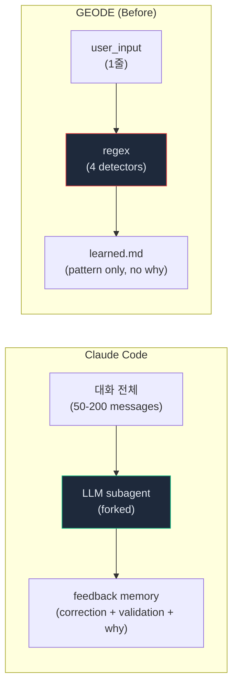
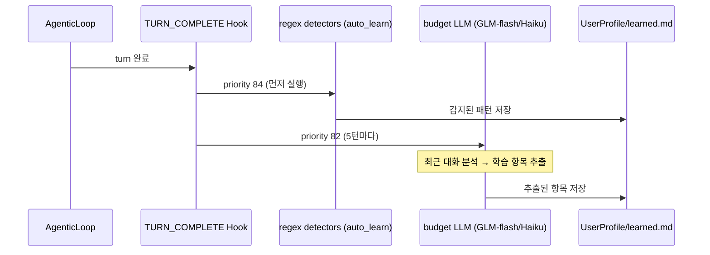

# 양방향 학습 — 교정만 기억하는 에이전트는 점점 소심해진다

> "교정은 눈에 잘 띕니다. 확인은 조용합니다 — 주의해서 찾아야 합니다."
> Claude Code memoryTypes.ts의 한 줄이
> GEODE의 학습 시스템을 완전히 바꾸게 된 계기입니다.

> Date: 2026-04-07 | Author: geode-team | Tags: learning, memory, feedback, bidirectional, extractMemories, claude-code, auto-learn

---

## 목차

1. 도입: 교정만 기억하는 에이전트
2. Claude Code의 양방향 학습
3. GEODE의 단방향 학습 — GAP 분석
4. 수정 1: 검증 감지 + 교정 감지
5. 수정 2: Why 기록
6. 수정 3: LLM subagent 추출
7. 와이어링 검증 — 읽기/쓰기 경로 불일치 근절
8. 마무리

---

## 1. 도입: 교정만 기억하는 에이전트

GEODE에는 `auto_learn`이라는 hook이 있었습니다. 매 턴 종료 시 유저의 입력을 regex로 분석하여 패턴을 기록합니다. "한국어로 답변해줘" → 언어 선호 기록. "항상 dark mode 써" → 명시적 선호 기록.

문제는 **교정만 기록**했다는 것입니다.

유저가 "이렇게 하지 마"라고 말하면 기록합니다. 하지만 유저가 "좋아, 그대로 진행해"라고 말하면? **아무것도 기록하지 않습니다.** 결과적으로 에이전트의 학습 데이터는 "하면 안 되는 것" 목록으로만 채워집니다.

이런 에이전트는 점점 **소심해집니다.** 과거에 잘 동작했던 접근법도 "혹시 틀릴까" 의심하게 됩니다. 교정 목록에 없는 것은 안전한 건지 위험한 건지 판단할 근거가 없기 때문입니다.

---

## 2. Claude Code의 양방향 학습

Claude Code의 `memoryTypes.ts`에 이 문제의 해법이 적혀 있었습니다:

> "Record from failure **AND** success: if you only save corrections, you will avoid past mistakes but **drift away from approaches the user has already validated**, and may grow overly cautious."

> "Corrections are easy to notice; **confirmations are quieter — watch for them.**"

Claude Code는 `feedback` 타입 메모리를 다음 두 경우 모두에서 저장합니다:

```
교정: "no not that", "don't", "stop doing X"
검증: "yes exactly", "perfect, keep doing that", 수정 없이 수용
```

그리고 반드시 **Why**를 포함합니다:

```markdown
# 교정 예시
integration tests must hit a real DB, not mocks.
Why: prior incident where mock/prod divergence masked a broken migration.

# 검증 예시
for refactors in this area, user prefers one bundled PR over many small ones.
Why: confirmed after I chose this approach — a validated judgment call.
```

> Why가 있어야 edge case에서 판단할 수 있습니다.
> "mock 금지"만 기록하면 단위 테스트에서도 mock을 피하게 됩니다.
> "integration test에서 real DB" + "Why: migration 실패"가 있으면
> 단위 테스트에서는 mock이 괜찮다고 판단할 수 있습니다.

---

## 3. GEODE의 단방향 학습 — GAP 분석

### 감지 비교



| 감지 대상 | Claude Code | GEODE (Before) |
|-----------|-------------|----------------|
| 교정 | LLM이 의미 파악 | regex: `"don't use"`, `"never use"` |
| **검증** | LLM이 "조용한 확인" 감지 | **없음** |
| **Why** | 필수 포함 | **없음** |
| 입력 범위 | 최근 50-200 메시지 | user_input 1줄 |
| 추출 엔진 | LLM (forked subagent) | regex (deterministic) |

### 와이어링 결함 (추가 발견)

감지 외에 **더 근본적인 문제**가 있었습니다:

```
auto_learn hook → UserProfile/learned.md (쓰기)    ✓ 동작
system_prompt G3 → .geode/LEARNING.md (읽기)       ✗ 항상 비어있음
```

**읽기와 쓰기 경로가 다른 파일을 가리키고 있었습니다.** `auto_learn`은 `learned.md`에 쓰지만, LLM context에 주입하는 G3 슬롯은 `LEARNING.md`를 읽습니다. `LEARNING.md`는 placeholder만 있는 빈 파일이었으므로, **학습 데이터가 실제로 LLM에 전달된 적이 없었습니다.**

---

## 4. 수정 1: 검증 감지 + 교정 감지

양방향 detector를 추가했습니다:

```python
# core/hooks/auto_learn.py

# 검증: 유저가 비자명한 접근을 확인
_RE_VALIDATION = re.compile(
    r"(?i)\b(exactly|perfect|that's right|keep doing"
    r"|good call|잘했|맞아|좋아|그대로|괜찮)"
    r"(?!.*\b(but|however|except|다만|근데)\b)",
)

# 교정: 유저가 접근을 수정
_RE_CORRECTION = re.compile(
    r"(?i)\b(don't|stop doing|not like that|wrong"
    r"|하지\s*마|아니야|잘못|틀렸)"
    r"(?!.*\bjust\s+kidding\b)",
)
```

> 부정 lookahead로 false positive를 줄입니다.
> "좋아, 하지만 여기는 고쳐" → "하지만"이 있으므로 validation으로 안 잡힙니다.
> "하지 마, 농담이야" → "just kidding"이 있으므로 correction으로 안 잡힙니다.

detector 우선순위: `correction > validation`. 교정이 더 강한 시그널이므로 먼저 매칭합니다.

---

## 5. 수정 2: Why 기록

validation과 correction 항목에 **assistant의 직전 발화**를 context로 추가합니다:

```python
# core/hooks/auto_learn.py — make_auto_learn_handler()

assistant_text: str = data.get("text", "")[:200]

for pattern_text, category in patterns:
    if assistant_text and category in ("validation", "correction"):
        pattern_with_why = (
            f"{pattern_text} [context: {assistant_text[:100]}]"
        )
    else:
        pattern_with_why = pattern_text
    profile.add_learned_pattern(pattern_with_why, category)
```

저장 결과 예시:

```
- [2026-04-06] [validation] Validated: 좋아. 그대로 진행해. [context: PR body를 4섹션 템플릿으로 작성했습니다]
- [2026-04-06] [correction] Corrected: 이렇게 하지 마 [context: main에 직접 push하려고 했습니다]
```

---

## 6. 수정 3: LLM subagent 추출

regex는 한계가 있습니다. "이전 세션에서 이 방식이 잘 됐으니 계속 하자" 같은 맥락적 검증은 regex로 잡을 수 없습니다.

Claude Code의 `extractMemories` 패턴을 Python으로 이식했습니다:



```python
# core/hooks/llm_extract_learning.py

_EXTRACT_PROMPT = """
You are a learning extraction agent. Analyze the recent conversation
and identify what should be remembered for future sessions.

For each item, output ONE LINE in this format:
[category] pattern text. Why: reason

Categories: correction, validation, preference, domain
Max 3 items. If nothing noteworthy, output: NONE
"""
```

> 5턴마다 실행하여 비용을 제어합니다 (GLM-flash는 무료, Haiku는 $0.001/call).
> regex detector(priority 84)가 먼저 실행되고, LLM 추출(priority 82)이 나중에 실행됩니다.
> 양쪽은 독립적 — regex가 잡은 것을 LLM이 중복 저장하지 않도록 dedup이 `add_learned_pattern`에 내장되어 있습니다.

---

## 7. 와이어링 검증 — 읽기/쓰기 경로 불일치 근절

이번 작업에서 발견된 **와이어링 결함 패턴**을 CANNOT 규칙으로 성문화했습니다:

| 규칙 | 내용 |
|------|------|
| **Read-Write parity** | 모든 읽기 경로(context 주입)에 대응하는 쓰기 경로(data producer)가 있어야 한다 |
| **Hook registration** | 핸들러가 존재 ≠ 핸들러가 발화. bootstrap에 등록 확인 필수 |
| **ContextVar injection** | `get_*()` accessor에 대응하는 `set_*()` 호출이 bootstrap에 있어야 한다 |
| **Singleton lifecycle** | 시작 시 생성된 singleton이 mutable 상태를 사용하면 refresh 경로 확인 필수 |

> 이 규칙들이 없었기 때문에 LEARNING.md (빈 파일), Vault (쓰기 경로 없음) 같은
> "구조는 있지만 동작하지 않는" 코드가 발견 없이 오래 방치되었습니다.

---

## 8. 마무리

### Before vs After

| 항목 | Before | After |
|------|--------|-------|
| 감지 | regex 4개 (교정 중심) | regex 6개 (양방향) + LLM subagent |
| 검증 감지 | 없음 | `_detect_validation` + LLM |
| Why 기록 | 없음 | `[context: assistant_text]` |
| 읽기 경로 | LEARNING.md (항상 비어있음) | UserProfile.get_learned_patterns() |
| 쓰기 경로 | UserProfile.add_learned_pattern() | 동일 (읽기-쓰기 경로 통일) |
| 추출 엔진 | regex only | regex + LLM (5턴마다) |

### 산업 동향 비교

| 시스템 | 추출 방식 | 검증 감지 | Why 기록 | 지속성 |
|--------|----------|----------|---------|-------|
| Claude Code | LLM forked subagent | O (bidirectional) | O (필수) | 파일 기반 |
| OpenClaw | SOUL.md (수동) | N/A | N/A | 수동 편집 |
| Mem0 | LLM 자동 추출 | 부분적 | 부분적 | 벡터 DB |
| Letta | FactExtraction block | 부분적 | O | SQLite |
| **GEODE** | regex + LLM 하이브리드 | **O** | **O** | 파일 기반 |

### 체크리스트

- [x] 검증 감지 (validation detector)
- [x] 교정 감지 (correction detector)
- [x] Why context 기록
- [x] LLM subagent 추출 (5턴마다, budget model)
- [x] 읽기-쓰기 경로 통일 (LEARNING.md → UserProfile)
- [x] Hook registration (bootstrap.py)
- [x] Wiring Verification CANNOT 규칙

Sources:
- [Memory for Autonomous LLM Agents (arXiv 2603.07670)](https://arxiv.org/html/2603.07670)
- [Persistent Memory in LLM Agents](https://www.emergentmind.com/topics/persistent-memory-for-llm-agents)
- [Mem0: Memory in Agents](https://mem0.ai/blog/memory-in-agents-what-why-and-how)
- [Agent Memory — Letta](https://www.letta.com/blog/agent-memory)

---

*Source: `blog/posts/memory-context/58-bidirectional-learning-extract-memories.md` | Category: [[blog-memory-context]]*

## Related

- [[blog-memory-context]]
- [[blog-hub]]
- [[geode]]
- [[geode-memory-system]]
