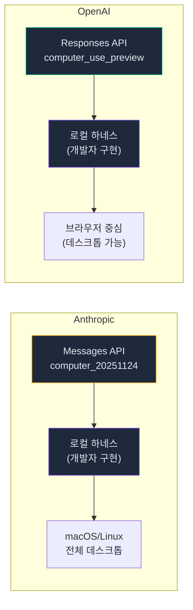
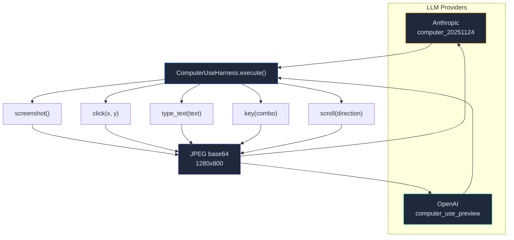

# Computer Use — 하나의 하네스로 두 프로바이더를 지원하는 방법

> Anthropic `computer_20251124`와 OpenAI `computer_use_preview`.
> 프로토콜은 다르지만 실행 하네스는 같습니다.
> `@ant/computer-use-swift`가 비공개인 상황에서
> PyAutoGUI로 동일한 기능을 구현한 기록입니다.

> Date: 2026-04-07 | Author: geode-team | Tags: computer-use, anthropic, openai, pyautogui, desktop-automation, tool-use

---

## 목차

1. 도입: 화면을 보고 클릭하는 에이전트
2. 프론티어 비교 — 누가 어떻게 구현하는가
3. Claude Code의 비공개 스택 역공학
4. 하네스 설계 — 하나로 두 프로바이더
5. 좌표 변환과 스크린샷 압축
6. Safety Gate — DANGEROUS HITL
7. 마무리

---

## 1. 도입: 화면을 보고 클릭하는 에이전트

Computer Use는 LLM이 **스크린샷을 보고, 마우스와 키보드를 조작**하는 기능입니다. 브라우저 자동화(Playwright, Puppeteer)와 근본적으로 다릅니다 — DOM selector가 아닌 **픽셀 좌표**로 동작합니다. Excel 스프레드시트도, Slack 데스크톱 앱도, 터미널도 제어할 수 있습니다.

2026년 4월 기준, Anthropic과 OpenAI 모두 Computer Use API를 제공합니다. 하지만 두 프로바이더의 프로토콜이 다르고, 실행 하네스(로컬에서 실제로 클릭하는 코드)는 개발자가 직접 구현해야 합니다.

이 글은 GEODE에서 **하나의 하네스로 양쪽 프로바이더를 지원**하도록 구현한 과정을 기록합니다.

---

## 2. 프론티어 비교 — 누가 어떻게 구현하는가

### 벤치마크 현황 (2026-04)

| 에이전트 | OSWorld | 방식 | 비고 |
|----------|---------|------|------|
| Claude Opus 4.6 | 72.7% | 전체 데스크톱 | 독립 평가 (xlang.ai) |
| Claude Sonnet 4.6 | 72.5% | 전체 데스크톱 | 독립 평가 |
| GPT-5.4 | 75.0% (self-reported) | 브라우저 중심 | OpenAI 자체 평가 (OSWorld-Verified) |
| Human baseline | 72.4% | — | |

> Anthropic은 xlang.ai의 독립 평가를 받았고, OpenAI는 자체 평가(OSWorld-Verified)입니다.
> 독립 검증 전까지 직접 비교는 어렵지만, 양쪽 모두 인간 수준에 근접했습니다.

### 아키텍처 차이



| | Anthropic | OpenAI | Google (Mariner) |
|---|---|---|---|
| Tool type | `computer_20251124` | `computer_use_preview` | Project Mariner |
| 범위 | 전체 데스크톱 | 브라우저 중심 | 웹 + 모바일 |
| API | Messages API (beta) | Responses API | Gemini API |
| Action 형식 | `tool_use(action, coordinate)` | `computer_call(actions[])` | 비공개 |
| 하네스 | 개발자 구현 | 개발자 구현 | 클라우드 VM |

> 핵심 관찰: **실행 하네스(screenshot + click)는 프로바이더와 무관하게 동일합니다.**
> LLM이 "좌표 (640, 400)을 클릭해"라고 말하면, 하네스는 그냥 클릭합니다.
> 프로바이더 차이는 API 프로토콜에만 있습니다.

---

## 3. Claude Code의 비공개 스택 역공학

Claude Code는 `@ant/computer-use-swift`와 `@ant/computer-use-input`이라는 비공개 NAPI 바이너리를 사용합니다.

```
utils/computerUse/
├── executor.ts          ← 핵심: 모든 input/output 오퍼레이션
├── swiftLoader.ts       ← @ant/computer-use-swift 로딩
├── inputLoader.ts       ← @ant/computer-use-input (Rust/enigo)
├── mcpServer.ts         ← in-process MCP 서버
├── drainRunLoop.ts      ← CFRunLoop 펌프 (@MainActor 호출용)
├── computerUseLock.ts   ← 파일 기반 세션 락
└── gates.ts             ← 구독 게이팅 (Max/Pro only)
```

> `@ant/computer-use-swift`는 Anthropic 내부 monorepo 패키지입니다.
> Claude Code CLI에도 Desktop App에도 바이너리가 포함되어 있지 않습니다.
> feature flag(`tengu_malort_pedway`) + Max/Pro 구독 뒤에 잠겨있으며,
> 서버사이드에서 on-demand 배포되는 것으로 추정됩니다.

**역공학 결론: 바이너리 접근 불가. 오픈소스 대안 필요.**

| 기능 | @ant/computer-use-swift | PyAutoGUI (대안) |
|------|------------------------|------------------|
| 스크린샷 | ScreenCaptureKit (macOS native) | `pyautogui.screenshot()` |
| 마우스 | CGEvent dispatch | `pyautogui.click()` |
| 키보드 | enigo (Rust NAPI) | `pyautogui.typewrite()` |
| 성능 | 네이티브, 60fps 애니메이션 | 충분 (50ms 간격) |
| 크로스플랫폼 | macOS only | macOS + Linux + Windows |

---

## 4. 하네스 설계 — 하나로 두 프로바이더

### 통합 디스패치



```python
# core/tools/computer_use.py
class ComputerUseHarness:
    def execute(self, action: str, **params: Any) -> dict[str, Any]:
        handlers = {
            "screenshot": lambda: self.screenshot(),
            "click": lambda: self.click(params["x"], params["y"]),
            "type": lambda: self.type_text(params["text"]),
            "key": lambda: self.key(params["keys"]),
            "scroll": lambda: self.scroll(params["x"], params["y"], params["direction"]),
            # Anthropic aliases
            "left_click": lambda: self.click(params["x"], params["y"], "left"),
            "right_click": lambda: self.click(params["x"], params["y"], "right"),
            "cursor_position": lambda: self._get_cursor_position(),
        }
```

> `execute()`는 action 이름으로 디스패치합니다.
> Anthropic의 `left_click`, `right_click` 같은 alias도 지원합니다.
> 모든 action은 실행 후 **스크린샷을 반환** — LLM이 결과를 보고 다음 action을 결정합니다.

### API 주입

Anthropic과 OpenAI 각각의 adapter에서 native tool을 주입합니다:

```python
# core/llm/providers/anthropic.py
if is_computer_use_enabled() and "computer" not in existing_names:
    api_tools.append({
        "type": "computer_20251124",
        "name": "computer",
        "display_width_px": 1280,
        "display_height_px": 800,
    })

# core/llm/providers/openai.py
if is_computer_use_enabled():
    oai_tools.append({
        "type": "computer_use_preview",
        "display_width": 1280,
        "display_height": 800,
        "environment": "mac",
    })
```

> `is_computer_use_enabled()`는 `GEODE_COMPUTER_USE_ENABLED=true` 환경변수와
> pyautogui 설치 여부를 확인합니다. 양쪽 조건이 충족되어야 tool이 주입됩니다.

---

## 5. 좌표 변환과 스크린샷 압축

LLM은 1280x800 해상도의 스크린샷을 봅니다. 실제 화면은 2560x1600(Retina)일 수 있습니다.

```python
def _scale_to_screen(self, x: int, y: int) -> tuple[int, int]:
    """LLM 좌표(1280x800) → 실제 화면 좌표."""
    sx = int(x * self._screen_width / self._target_width)
    sy = int(y * self._screen_height / self._target_height)
    return sx, sy
```

> Anthropic의 reference 구현은 XGA(1024x768), WXGA(1280x800), FWXGA(1366x768) 중
> 화면 비율에 가장 가까운 해상도를 선택합니다.
> GEODE는 1280x800 고정 — 토큰 비용($0.003/이미지)과 정밀도의 균형점입니다.

스크린샷은 JPEG 75% 품질로 압축하여 base64 인코딩합니다. PNG 대비 약 1/5 크기.

---

## 6. Safety Gate — DANGEROUS HITL

Computer Use는 **화면을 직접 조작**합니다. 잘못된 클릭 한 번이 파일 삭제, 메시지 전송, 설정 변경을 유발할 수 있습니다.

```python
# core/agent/safety_constants.py
DANGEROUS_TOOLS: frozenset[str] = frozenset({
    "run_bash",
    "computer",  # computer-use: screen control
})
```

> `DANGEROUS` tier는 **매 호출마다 유저 승인**이 필요합니다.
> `run_bash`와 동일한 수준입니다.
> 활성화도 opt-in: `GEODE_COMPUTER_USE_ENABLED=true` + `pip install pyautogui`.

---

## 7. 마무리

### 요약

| 항목 | 내용 |
|------|------|
| 하네스 | `ComputerUseHarness` — PyAutoGUI 기반, provider-agnostic |
| Anthropic | `computer_20251124` native tool injection |
| OpenAI | `computer_use_preview` Responses API tool injection |
| 안전 | DANGEROUS HITL + opt-in (`GEODE_COMPUTER_USE_ENABLED`) |
| 해상도 | 1280x800 (JPEG 75%) |
| 레퍼런스 | Claude Code `@ant/computer-use-swift` (비공개), Anthropic quickstart |

### 한계와 다음 단계

- [ ] OpenAI `computer_call` 응답 블록의 Anthropic 형식 정규화
- [ ] 스크린샷 region capture (전체 화면 대신 관심 영역만)
- [ ] 드래그 앤 드롭 정밀도 개선 (현재 ease-out-cubic 없음)

Sources:
- [Anthropic Computer Use vs OpenAI CUA — WorkOS](https://workos.com/blog/anthropics-computer-use-versus-openais-computer-using-agent-cua)
- [Computer Use Leaderboard](https://awesomeagents.ai/leaderboards/computer-use-leaderboard/)
- [2026 Computer Use Benchmarks Guide](https://o-mega.ai/articles/the-2025-2026-guide-to-ai-computer-use-benchmarks-and-top-ai-agents)

---

*Source: `blog/posts/tools-mcp/58-computer-use-provider-agnostic-harness.md` | Category: [[blog-tools-mcp]]*

## Related

- [[blog-tools-mcp]]
- [[blog-hub]]
- [[geode]]
- [[geode-tool-system]]
