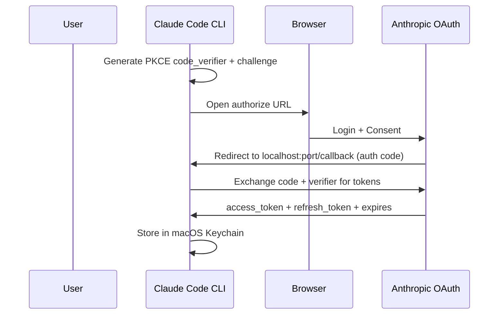
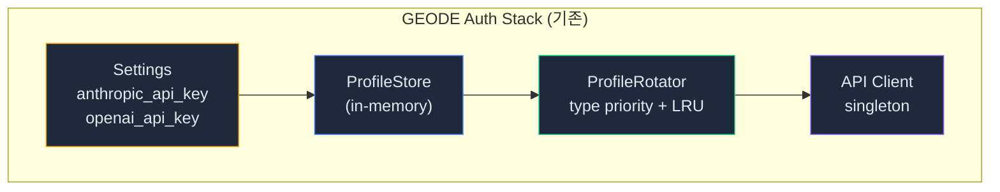
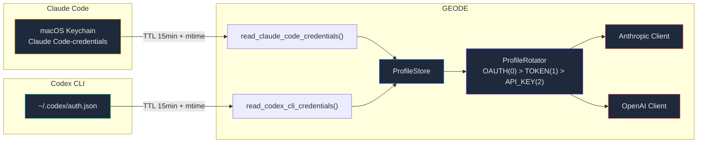
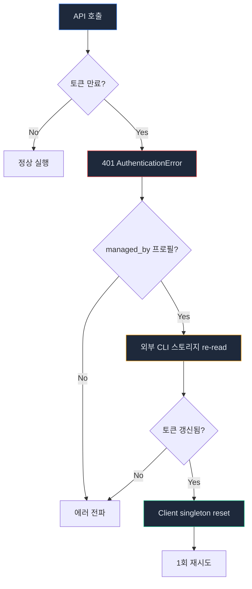
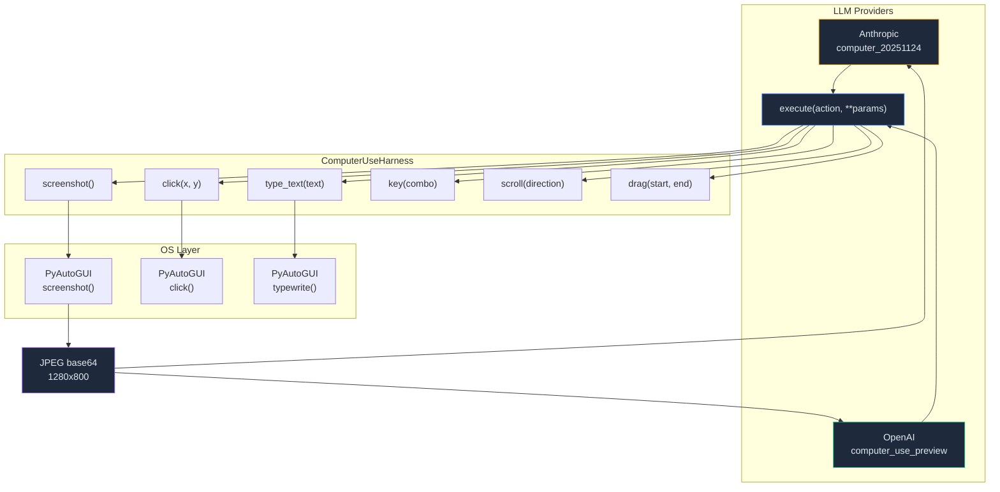

# OAuth 토큰 재사용 + Computer Use — 프론티어 에이전트 3개를 뜯어본 결과

> Claude Code의 Keychain, OpenClaw의 managedBy, Anthropic의 computer_20251124.
> 세 코드베이스에서 찾은 패턴을 GEODE에 이식한 기록입니다.
> API 비용을 구독 모델로 전환하고, 데스크톱 자동화를 양쪽 프로바이더에서 동시에 지원하기까지.

> Date: 2026-04-05 | Author: geode-team | Tags: oauth, computer-use, claude-code, openclaw, managed-credentials, pyautogui, anthropic, openai

---

## 목차

1. 도입: API 비용 문제와 Computer Use 부재
2. 코드베이스 고고학 — 세 프론티어의 인증 아키텍처
3. OAuth 토큰 재사용 설계 (managedBy 패턴)
4. 토큰 생명주기 — mtime 캐시 + 401 자동 갱신
5. Computer Use 하네스 — 하나로 두 프로바이더
6. UI/UX: /auth login 인터랙티브 플로우
7. 마무리

---

## 1. 도입: API 비용 문제와 Computer Use 부재

GEODE는 Anthropic Claude Opus 4.6을 주력 모델로 사용합니다. 직접 API 호출 비용은 입력 $5/Mtok, 출력 $25/Mtok입니다. 하루 활발한 사용 시 $10-30이 청구됩니다.

그런데 Claude Code로 이미 claude.ai에 로그인되어 있습니다. Pro($20/mo) 또는 Max($100/mo) 구독이 있고, 그 안에서 API 호출이 가능합니다. **같은 머신에서 동일한 API를 두 번 결제하고 있었습니다.**

Computer Use도 마찬가지였습니다. Anthropic과 OpenAI 모두 `computer_use` tool type을 지원하지만, GEODE에는 구현이 없었습니다. Playwright MCP로 브라우저만 자동화할 수 있었고, 데스크톱 전체 제어는 불가능했습니다.

이 글은 세 프론티어 에이전트(Claude Code, OpenClaw, Anthropic quickstart)의 코드를 분석하고, 두 가지 기능을 GEODE에 이식한 과정을 기록합니다.

---

## 2. 코드베이스 고고학 — 세 프론티어의 인증 아키텍처

### 2.1 Claude Code — OAuth PKCE + Keychain

Claude Code는 완전한 OAuth 2.0 Authorization Code + PKCE(Proof Key for Code Exchange) 플로우를 구현합니다.



> Claude Code는 토큰을 macOS Keychain의 `"Claude Code-credentials"` 서비스에 저장합니다.
> `claudeAiOauth` 필드에 accessToken, refreshToken, expiresAt, subscriptionType이 포함됩니다.
> 파일 fallback은 `~/.claude/.credentials.json`입니다.

핵심 상수:

```typescript
// claude-code/constants/oauth.ts
CLIENT_ID: '9d1c250a-e61b-44d9-88ed-5944d1962f5e'
AUTHORIZE_URL: 'https://claude.com/cai/oauth/authorize'
TOKEN_URL: 'https://platform.claude.com/v1/oauth/token'
KEYCHAIN_SERVICE: 'Claude Code-credentials'
```

### 2.2 OpenClaw — managedBy 패턴

OpenClaw의 인증 시스템에서 가장 주목한 패턴은 `managedBy`입니다.

```typescript
// openclaw/src/agents/auth-profiles/types.ts
export type OAuthCredential = {
  type: "oauth";
  provider: string;
  access: string;
  refresh: string;
  expires: number;
  managedBy?: ExternalOAuthManager; // "codex-cli" | "minimax-cli"
};
```

> `managedBy`가 설정되면 OpenClaw는 토큰을 직접 관리하지 않습니다.
> 외부 CLI(Codex CLI, MiniMax CLI)의 저장소에서 읽기만 하고, 갱신도 외부 CLI에 위임합니다.
> 이것이 GEODE가 채택한 핵심 패턴입니다.

OpenClaw가 Claude Code의 토큰을 읽는 코드:

```typescript
// openclaw/src/agents/cli-credentials.ts:363-388
export function readClaudeCliCredentials(): ClaudeCliCredential | null {
  // 1. macOS Keychain 먼저 시도
  const keychainCreds = readClaudeCliKeychainCredentials();
  if (keychainCreds) return keychainCreds;

  // 2. 파일 fallback
  const credPath = "~/.claude/.credentials.json";
  const data = loadJsonFile(credPath);
  return parseClaudeCliOauthCredential(data.claudeAiOauth);
}
```

### 2.3 Codex CLI — OpenAI OAuth + WHAM

Codex CLI는 `~/.codex/auth.json`에 OpenAI OAuth 토큰을 저장합니다. OpenClaw는 이 파일도 읽습니다.

```json
{
  "auth_mode": "oauth",
  "tokens": {
    "access_token": "eyJhbG...",
    "refresh_token": "rt-...",
    "account_id": "acc-123"
  },
  "last_refresh": "2026-04-01T12:00:00Z"
}
```

OpenClaw는 추가로 WHAM(Web Health and Monitoring) 엔드포인트(`chatgpt.com/backend-api/wham/usage`)를 프로빙하여 OpenAI 구독 사용량을 실시간으로 확인합니다.

---

## 3. OAuth 토큰 재사용 설계 (managedBy 패턴)

### 3.1 GEODE의 기존 인프라

GEODE에는 이미 `AuthProfile` + `ProfileStore` + `ProfileRotator`가 있었습니다. `CredentialType.OAUTH`도 enum에 정의되어 있었지만 실제 OAuth 코드 경로는 없었습니다.



### 3.2 managedBy 패턴 이식

OpenClaw의 패턴을 Python으로 포팅했습니다. 핵심: **GEODE는 토큰을 읽기만 하고, 갱신은 외부 CLI에 위임합니다.**



구현의 핵심 — Keychain 읽기:

```python
# core/gateway/auth/claude_code_oauth.py
_KEYCHAIN_SERVICE = "Claude Code-credentials"

def _read_from_keychain() -> dict[str, Any] | None:
    """macOS Keychain에서 Claude Code OAuth 토큰 읽기."""
    result = subprocess.run(
        ["security", "find-generic-password", "-s", _KEYCHAIN_SERVICE, "-w"],
        capture_output=True, text=True, timeout=5,
    )
    if result.returncode != 0:
        return None
    data = json.loads(result.stdout.strip())
    return data.get("claudeAiOauth")
```

> `security find-generic-password`는 macOS의 표준 Keychain 접근 CLI입니다.
> OpenClaw의 `readClaudeCliKeychainCredentials()`와 동일한 방식입니다.
> 파일 기반 fallback(`~/.claude/.credentials.json`)도 구현하여 Keychain 접근 불가 시에도 동작합니다.

`AuthProfile`에 `managed_by` 필드를 추가:

```python
# core/gateway/auth/profiles.py
@dataclass
class AuthProfile:
    name: str                          # "anthropic:claude-code"
    provider: str                      # "anthropic"
    credential_type: CredentialType    # OAUTH
    key: str = ""                      # access_token
    refresh_token: str = ""
    expires_at: float = 0.0
    managed_by: str = ""               # "claude-code" — 핵심 필드
    metadata: dict[str, Any] = field(default_factory=dict)
```

> `managed_by`가 설정된 프로필은 persistence 대상에서 제외됩니다 (OpenClaw `buildPersistedAuthProfileStore` 패턴).
> 토큰 소유권은 외부 CLI에 있으므로 GEODE가 별도로 저장하지 않습니다.

Bootstrap 시 자동 감지:

```python
# core/runtime_wiring/infra.py — build_auth()
creds = read_claude_code_credentials()
if creds:
    profile_store.add(AuthProfile(
        name="anthropic:claude-code",
        provider="anthropic",
        credential_type=CredentialType.OAUTH,
        key=creds["access_token"],
        managed_by="claude-code",
        metadata={"subscription_type": creds.get("subscription_type")},
    ))
```

`ProfileRotator`는 type priority로 자동 선택합니다: OAUTH(0) > TOKEN(1) > API_KEY(2). Claude Code에 로그인되어 있으면 OAuth 토큰이 자동으로 우선됩니다.

---

## 4. 토큰 생명주기 — mtime 캐시 + 401 자동 갱신

OAuth 토큰은 만료됩니다. 세 가지 방어 계층을 구현했습니다.



### Layer 1: mtime 기반 캐시 무효화

```python
# core/gateway/auth/claude_code_oauth.py
def _is_cache_valid() -> bool:
    if _cache["value"] is None:
        return False
    if (time.time() - _cache["read_at"]) >= _CACHE_TTL_S:  # 15min
        return False
    # 파일이 외부에서 변경되면 TTL 내에도 무효화
    current_mtime = _get_file_mtime()
    return not (current_mtime > 0 and current_mtime != _cache["mtime"])
```

> OpenClaw의 `readCachedCliCredential`은 `sourceFingerprint`로 file mtime을 추적합니다.
> 동일 패턴입니다. Claude Code가 토큰을 갱신하면 파일 mtime이 변경되고, GEODE가 즉시 감지합니다.

### Layer 2: 401 자동 갱신 + Client Reset

```python
# core/llm/fallback.py — retry_with_backoff_generic() 내부
if _is_auth_error(exc) and attempt == 0:
    refreshed = _try_oauth_refresh(provider_label)
    if refreshed:
        continue  # 갱신된 토큰으로 재시도
```

> `_try_oauth_refresh()`는 managed_by 프로필을 감지하고, 외부 CLI 스토리지를 re-read합니다.
> 토큰이 변경되었으면 `reset_clients()`로 singleton HTTP 클라이언트를 무효화하고 재시도합니다.

### Layer 3: ProfileRotator fallback

OAuth 토큰이 완전히 실패하면 ProfileRotator가 다음 우선순위 프로필(API key)로 자동 전환합니다. 사용자 개입 없이 graceful degradation됩니다.

---

## 5. Computer Use 하네스 — 하나로 두 프로바이더

### 5.1 프로바이더별 프로토콜 비교

| | Anthropic | OpenAI |
|---|---|---|
| Tool type | `computer_20251124` | `computer_use_preview` |
| API | Messages API (beta) | Responses API |
| Action format | `tool_use(action, coordinate)` | `computer_call(actions[])` |
| 공통 | screenshot → LLM → action → screenshot 루프 | 동일 |

핵심 관찰: **실행 하네스(screenshot + click)는 프로바이더와 무관하게 동일합니다.**

### 5.2 통합 하네스 설계



### 5.3 좌표 변환

LLM은 1280x800 해상도의 스크린샷을 봅니다. 실제 화면은 2560x1600(Retina)일 수 있습니다. 좌표 변환이 필요합니다.

```python
# core/tools/computer_use.py
def _scale_to_screen(self, x: int, y: int) -> tuple[int, int]:
    """LLM 좌표(1280x800) → 실제 화면 좌표."""
    sx = int(x * self._screen_width / self._target_width)
    sy = int(y * self._screen_height / self._target_height)
    return sx, sy
```

> Anthropic의 reference 구현(`claude-quickstarts/computer_use_demo`)은
> XGA(1024x768), WXGA(1280x800), FWXGA(1366x768) 중 가장 가까운 해상도로 매핑합니다.
> GEODE는 1280x800 고정 — 토큰 비용과 정밀도의 균형점입니다.

### 5.4 Safety Gate

Computer Use는 DANGEROUS tier입니다. HITL(Human-in-the-Loop) 승인이 필수:

```python
# core/agent/safety_constants.py
DANGEROUS_TOOLS: frozenset[str] = frozenset({
    "run_bash",
    "computer",  # computer-use: screen control
})
```

활성화는 opt-in:
```bash
export GEODE_COMPUTER_USE_ENABLED=true  # 명시적 동의 필요
uv pip install pyautogui                # 의존성 별도 설치
```

---

## 6. UI/UX: /auth login 인터랙티브 플로우

"터미널에서 `claude login` 실행 후 재시작하세요"는 좋은 UX가 아닙니다. GEODE 내에서 직접 로그인할 수 있어야 합니다.

```
/auth login

  OAuth Login Status
  ✗ Anthropic  not logged in
  ✗ OpenAI     not logged in

  Anthropic:  claude login — opens browser for OAuth
  Run claude login now? [Y/n] y
  Opening browser for Anthropic login...
  Anthropic login successful!

  OpenAI:  codex login — opens browser for OAuth
  Run codex login now? [Y/n] y
  Opening browser for OpenAI login...
  OpenAI login successful!
```

```python
# core/cli/commands.py — _auth_login_status()
cli_path = shutil.which(cli_name)  # "claude" or "codex"
if cli_path:
    result = subprocess.run([cli_path, "login"], timeout=120)
    if result.returncode == 0:
        # 즉시 토큰 re-read — 재시작 불필요
        invalidate_cache()
        read_credentials(force_refresh=True)
```

> Claude Code와 Codex CLI를 subprocess로 실행합니다.
> 브라우저가 열리고 OAuth 로그인이 완료되면 토큰이 Keychain에 저장됩니다.
> GEODE가 즉시 re-read하므로 프로세스 재시작이 필요 없습니다.

로그인 후 `/auth` 상태:

```
  Auth Profiles
  ✓ anthropic:claude-code  oauth     ey***xyz     active · Max · managed:claude-code
  ✓ openai:codex-cli       oauth     ey***abc     active · managed:codex-cli
  ● anthropic:default      api_key   sk-ant-***   active
  Priority: oauth > token > api_key
  Tip: /auth login to set up OAuth (saves API costs)
```

---

## 7. 마무리

### 요약

| 항목 | 내용 |
|------|------|
| 문제 | Anthropic API 직접 과금 + Computer Use 미지원 |
| 해법 | Claude Code/Codex CLI OAuth 토큰 재사용 + PyAutoGUI 하네스 |
| 레퍼런스 | OpenClaw `managedBy`, Claude Code Keychain, Anthropic quickstart |
| 파일 | 8개 신규/변경 + 27 테스트 |
| 안전 | opt-in + DANGEROUS HITL + mtime cache + 401 auto-refresh |
| PR | #654 (feature → develop), #655 (develop → main), CI 5/5 |

### 프론티어 비교

| 패턴 | Claude Code | OpenClaw | GEODE |
|------|-------------|----------|-------|
| OAuth 자체 구현 | PKCE + Keychain | Plugin-extensible | 외부 CLI 위임 |
| 토큰 저장 | Keychain + file | auth-profiles.json | 읽기만 (managed) |
| 토큰 갱신 | 자체 refresh | Plugin fallback | 외부 CLI re-read |
| Computer Use | @ant/computer-use-swift (비공개) | Screen recording (Swift) | PyAutoGUI (오픈소스) |
| 프로바이더 | Anthropic only | Multi-provider | Anthropic + OpenAI |

### 한계와 다음 단계

- [ ] WHAM 프로빙 (OpenAI 구독 사용량 실시간 조회)
- [ ] Per-failure-reason cooldown 분류 (auth vs rate_limit vs billing)
- [ ] OpenAI `computer_call` 응답 블록의 Anthropic 형식 정규화
- [ ] Codex CLI macOS Keychain 읽기 (현재 file fallback만)

---

*Source: `blog/posts/architecture/58-oauth-token-reuse-computer-use.md` | Category: [[blog-architecture]]*

## Related

- [[blog-architecture]]
- [[blog-hub]]
- [[geode]]
- [[geode-architecture]]
- [[geode-oauth-policy]]
