# REODE 마이그레이션 DAG (2): Checkpoint, 병렬 검증, 의존성 그래프가 합류한 v0.20

> [55번 포스트](https://rooftopsnow.tistory.com/351)에서 6-노드 DAG의 토폴로지와 라우팅을 다뤘습니다.
> 이후 4개의 "다음 과제"가 코드로 전환되었습니다:
> Checkpoint 중단/재개, 병렬 검증 디스패치, Import 의존성 그래프, 비용 예측.
> 이 글은 **DAG 인프라 자체가 어떻게 진화했는지** 기록합니다.
>
> [56번](https://rooftopsnow.tistory.com/352)(fix_node 내부)과
> [57번](https://rooftopsnow.tistory.com/353)(API Blackbox Testing)이
> 개별 노드의 진화를 다뤘다면, 이 글은 **그래프 계층의 변화**에 집중합니다.

---

## 목차

1. [55번 포스트 이후 무엇이 바뀌었나](#1-55번-포스트-이후-무엇이-바뀌었나)
2. [Checkpoint 2계층: git tag + LangGraph Checkpointer](#2-checkpoint-2계층-git-tag--langgraph-checkpointer)
3. [Pipeline Template: 다형적 그래프 구축](#3-pipeline-template-다형적-그래프-구축)
4. [ImportGraph: 의존성 순서 보장](#4-importgraph-의존성-순서-보장)
5. [병렬 검증 디스패치: SubAgentManager](#5-병렬-검증-디스패치-subagentmanager)
6. [JAR E2E: 비-웹 프로젝트의 동치성 검증](#6-jar-e2e-비-웹-프로젝트의-동치성-검증)
7. [비용 예측과 ContextBudget 직렬화](#7-비용-예측과-contextbudget-직렬화)
8. [v0.17 → v0.20: 그래프가 달라진 전후 비교](#8-v017--v020-그래프가-달라진-전후-비교)
9. [설계 결정 요약 + 체크리스트](#9-설계-결정-요약--체크리스트)

---

## 1. 55번 포스트 이후 무엇이 바뀌었나

55번 포스트는 4가지 "다음 과제"로 끝났습니다. 현재 상태입니다:

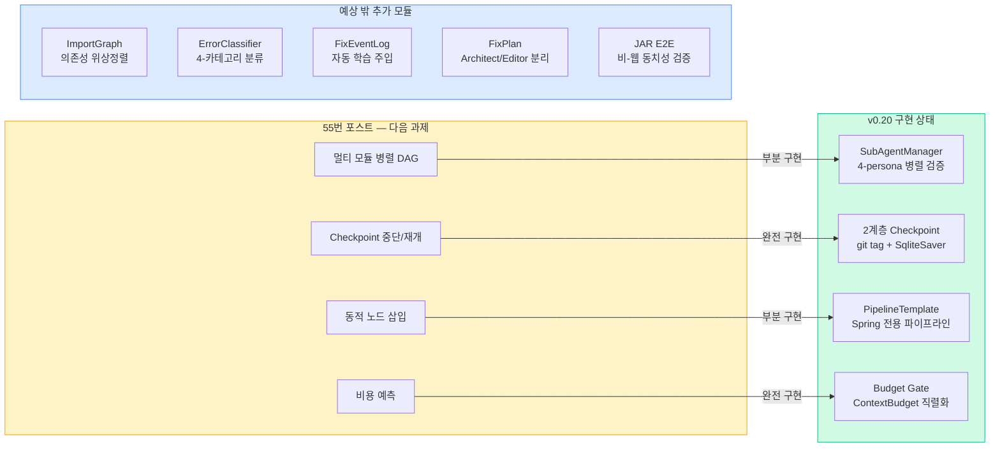

| 과제 | 상태 | 구현체 | 비고 |
|------|------|--------|------|
| 멀티 모듈 병렬 DAG | 부분 | SubAgentManager 4-persona 검증 | 모듈 단위 병렬화는 로드맵 |
| Checkpoint 중단/재개 | 완전 | `PipelineCheckpoint` + `SqliteSaver` | PR #300 |
| 동적 노드 삽입 | 부분 | `PipelineTemplate` + Spring 파이프라인 | 프레임워크별 노드 동적 삽입은 로드맵 |
| 비용 예측 | 완전 | `--budget`, ContextBudget, token_tracker | 직렬화까지 해결 |

4개 중 2개 완전 구현, 2개 부분 구현. 그리고 예상하지 않았던 5개 모듈이 추가되었습니다.

---

## 2. Checkpoint 2계층: git tag + LangGraph Checkpointer

55번 포스트의 DAG는 "한 번 시작하면 끝까지 달리는" 구조였습니다. 3시간짜리 마이그레이션이 iteration 4에서 실패하면 처음부터 다시 시작해야 합니다. v0.17에서 2계층 Checkpoint가 도입되었습니다.

### 계층 구조

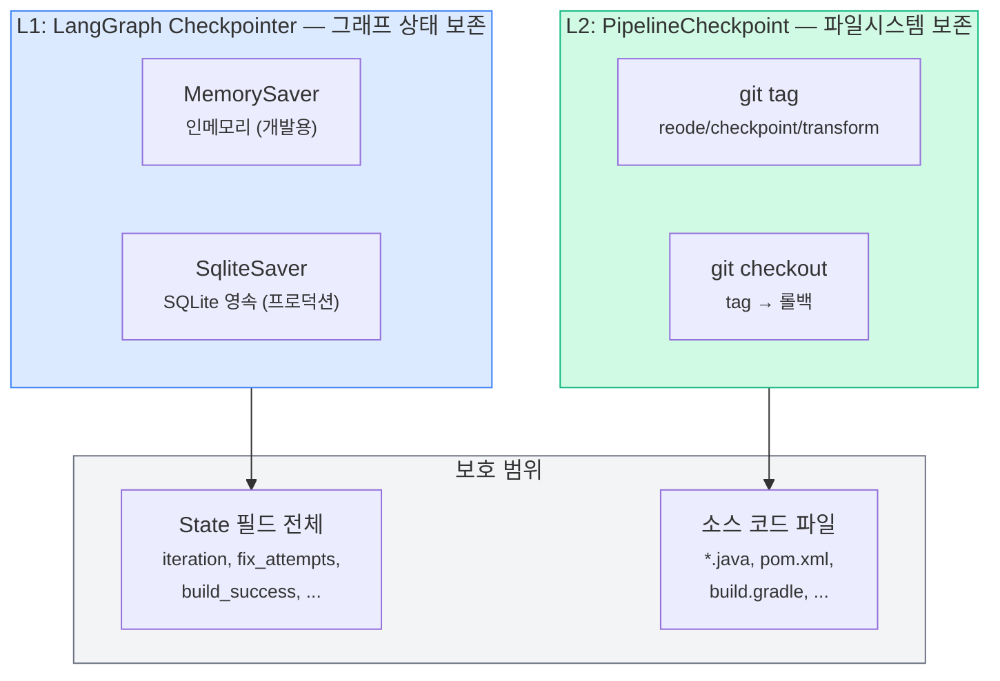

**L1(그래프 상태)**과 **L2(파일시스템)**가 각각 다른 대상을 보호합니다.

### L1: LangGraph Checkpointer

```python
# core/graph.py — compile_graph()
_serde = JsonPlusSerializer(
    allowed_json_modules=_allowed_modules,
    allowed_msgpack_modules=_allowed_modules,
)

if checkpoint_db is not None:
    conn = sqlite3.connect(str(db_path), check_same_thread=False)
    atexit.register(conn.close)
    compile_kwargs["checkpointer"] = SqliteSaver(conn, serde=_serde)
elif memory_fallback:
    compile_kwargs["checkpointer"] = MemorySaver(serde=_serde)
```

> `allowed_json_modules` / `allowed_msgpack_modules`에 `ReodeState`, `MigrationState`, `ContextBudget`을 명시적으로 등록합니다. LangGraph의 `JsonPlusSerializer`가 msgpack 역직렬화 시 이 목록에 없는 타입을 만나면 경고를 발생시키는데, REODE의 커스텀 타입이 여기에 해당했습니다. v0.20에서 이 직렬화 문제를 해결했습니다.

### L2: PipelineCheckpoint — git tag 기반

```python
# core/pipelines/checkpoint.py
class PipelineCheckpoint:
    CHECKPOINT_PREFIX = "reode/checkpoint"

    def save(self, stage: str) -> bool:
        tag_name = f"{CHECKPOINT_PREFIX}/{stage}"
        # 1. git add -A
        # 2. git commit --allow-empty -m "reode checkpoint: {stage}"
        # 3. git tag -f {tag_name}
        return True

    def restore(self, stage: str) -> bool:
        # git checkout {tag_name} -- .
        return True
```

> git을 선택한 이유는 세 가지입니다. (1) 대상 프로젝트가 이미 git 저장소. (2) 파일 단위 diff가 가능. (3) `git tag -f`로 같은 단계를 재실행해도 태그가 덮어씌워져 중복이 없음. 모든 연산은 **best-effort**: 실패 시 로그만 남기고 파이프라인은 계속 진행합니다.

### 파이프라인 통합 지점

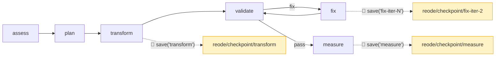

- **transform 후**: OpenRewrite 레시피 적용 직후 체크포인트. 레시피 자체는 결정론적이므로 이 지점이 "안전한 출발선"
- **fix-iter-N 후**: 각 fix 시도 후 체크포인트. 다음 fix가 상황을 악화시키면 이전 iteration으로 롤백 가능
- **measure 후**: 최종 결과 보존

---

## 3. Pipeline Template: 다형적 그래프 구축

55번 포스트의 DAG는 하드코딩된 단일 토폴로지였습니다. "Java 마이그레이션이 아닌 다른 파이프라인을 실행하려면?" 이라는 질문에 답하기 위해 **Pipeline Template 패턴**이 도입되었습니다.

### 아키텍처

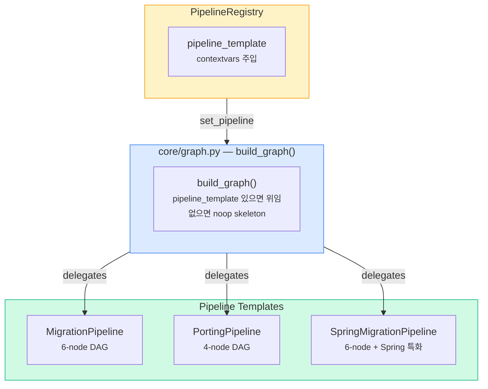

```python
# core/graph.py — build_graph() 핵심 분기
def build_graph(*, pipeline_template=None, **kwargs):
    if pipeline_template is not None:
        return pipeline_template.build_graph(**kwargs)

    # Fallback: START → noop → END
    graph = StateGraph(ReodeState)
    graph.add_node("noop", _noop_node)
    graph.add_edge(START, "noop")
    graph.add_edge("noop", END)
    return graph
```

> `build_graph()`는 자신이 **어떤 토폴로지를 구축하는지 모릅니다**. Pipeline Template에 위임할 뿐입니다. Template이 없으면 `noop` 하나로 구성된 최소 스켈레톤을 반환합니다. 이것은 Strategy 패턴의 교과서적 적용입니다.

### 현재 등록된 Template 비교

```mermaid
flowchart TB
    subgraph MIGRATION["MigrationPipeline — 6 nodes"]
        direction LR
        MA[assess] --> MP[plan] --> MTR[transform] --> MV[validate]
        MV -->|fix| MF[fix] --> MV
        MV -->|pass| MM[measure]
    end

    subgraph PORTING["PortingPipeline — 4 nodes"]
        direction LR
        PA[analyze] --> PMT[map_types] --> PG[generate] --> PVR[verify]
        PVR -->|loop| PG
    end

    subgraph SPRING["SpringMigrationPipeline — 6 nodes (특화)"]
        direction LR
        SA["spring_assess<br/><small>Spring 기능 감지</small>"] --> SPL["spring_plan<br/><small>Spring 레시피 체인</small>"]
        SPL --> STR[transform] --> SV[validate]
        SV -->|fix| SF[fix] --> SV
        SV -->|pass| SM[measure]
    end

    style MIGRATION fill:#DBEAFE,stroke:#3B82F6
    style PORTING fill:#D1FAE5,stroke:#10B981
    style SPRING fill:#EDE9FE,stroke:#8B5CF6
```

| Template | 노드 수 | 특화 영역 | 베이스 재사용 |
|----------|---------|----------|-------------|
| MigrationPipeline | 6 | Java 8→22 범용 | - |
| PortingPipeline | 4 | 언어 간 포팅 | - |
| SpringMigrationPipeline | 6 | Spring Boot 전환 | transform/validate/measure 재사용 |

> SpringMigrationPipeline은 assess와 plan만 오버라이드하고 나머지 4개 노드는 MigrationPipeline에서 그대로 가져옵니다. Spring 복잡도 스코어링과 Spring 전용 레시피 체인만 교체하는 것입니다. "다음 과제"였던 동적 노드 삽입의 첫 번째 실현입니다.

---

## 4. ImportGraph: 의존성 순서 보장

fix_node가 `UserService.java`를 수정했는데, `UserController.java`가 `UserService`를 import합니다. UserService를 고치기 전에 UserController를 먼저 고치면 컴파일 에러가 겹칩니다. ImportGraph는 이 문제를 해결합니다.

### 구조

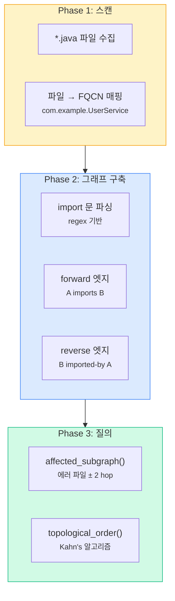

### 핵심 API

```python
# core/pipelines/dep_graph.py
class ImportGraph:
    def build(self) -> None:
        """*.java 파일에서 import 문을 파싱해 양방향 그래프 구축."""

    def affected_subgraph(self, error_files: list[str], depth: int = 2) -> list[str]:
        """에러 파일에서 N-hop 이내의 모든 관련 파일을 BFS로 수집."""

    def topological_order(self, files: list[str] | None = None) -> list[str]:
        """의존성 leaf-first 위상정렬. Kahn's 알고리즘. 순환 의존성은 끝에 배치."""
```

> `depth=2`는 경험적 선택입니다. 1-hop은 직접 의존만 잡고, 3-hop은 대규모 프로젝트에서 전체 소스의 절반을 끌고 옵니다. 2-hop이 "에러 영향 범위를 파악하되 노이즈를 억제하는" 균형점이었습니다.

### fix_node에서의 활용 흐름

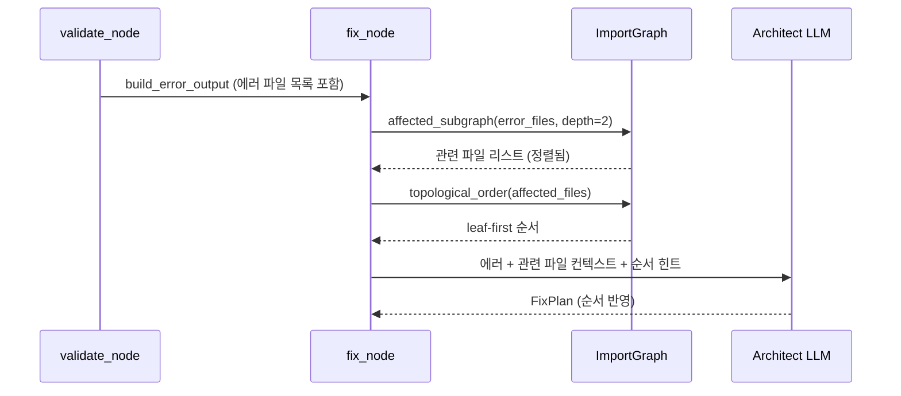

Architect LLM에게 "이 파일들은 이 순서로 고쳐야 합니다"라는 의존성 컨텍스트를 제공함으로써, LLM이 의존성 역순으로 수정하는 실수를 방지합니다.

### 순환 의존성 처리

```python
# Kahn's 알고리즘으로 처리할 수 없는 순환 멤버는 끝에 배치
remaining = [f for f in target if f not in set(result)]
result.extend(sorted(remaining))
```

> Java에서 순환 의존성은 흔합니다 (Service ↔ Repository 상호 참조). Kahn's 알고리즘은 in-degree가 0인 노드부터 처리하므로, 순환에 갇힌 노드는 큐에 들어가지 않습니다. 이들을 `sorted()`로 결정론적 순서를 부여하여 끝에 추가합니다. 순환 내부의 순서는 어차피 무의미하므로, 안정적인 출력만 보장하면 됩니다.

---

## 5. 병렬 검증 디스패치: SubAgentManager

55번 포스트에서 validate_node는 순차적으로 build → test → lint → e2e를 실행했습니다. v0.17에서 4개 검증 페르소나를 **병렬로 디스패치**하는 구조가 도입되었습니다.

### 전/후 비교

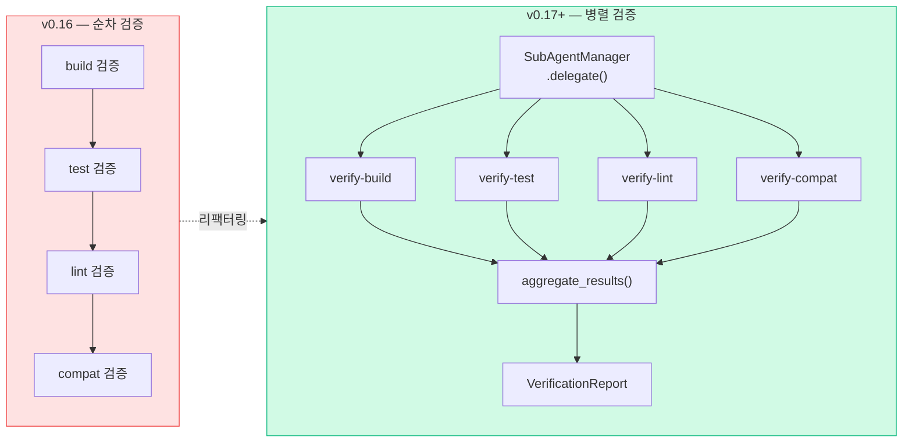

### 구현

```python
# core/pipelines/migration.py — _dispatch_verification_parallel()
def _dispatch_verification_parallel(verify_tasks):
    manager = get_sub_agent_manager()
    if manager is None:
        return None  # fallback to sequential

    sub_tasks = [
        SubTask(
            task_id=t["task_id"],
            description=t["description"],
            task_type=t["task_type"],
            agent=t.get("agent"),
        )
        for t in verify_tasks
    ]

    results = manager.delegate(sub_tasks)  # parallel execution
    report = aggregate_results([r.to_dict() for r in results])
    return report
```

> **Graceful degradation**: `get_sub_agent_manager()`가 `None`을 반환하면 (CLI 모드에서 SubAgentManager가 주입되지 않은 경우) 기존 순차 검증으로 자동 폴백합니다. 병렬 디스패치는 **옵트인** 최적화이지, 필수 의존성이 아닙니다.

### SubAgentManager 내부 아키텍처

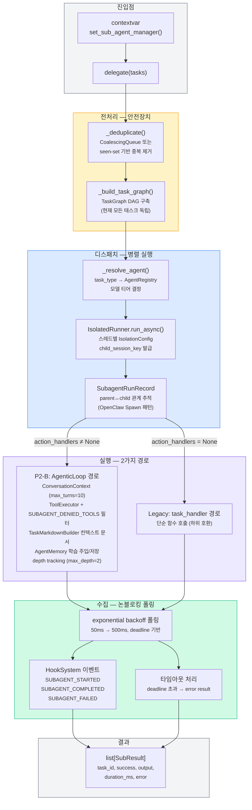

### P2-B AgenticLoop 상속 — 무엇이 전파되는가

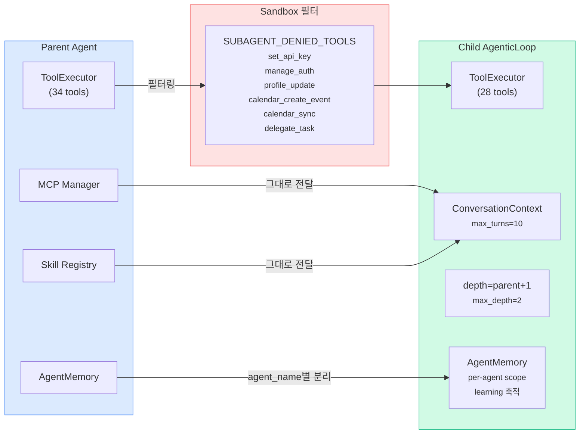

> P2-B 프로토콜의 핵심: 자식 에이전트는 부모와 **동일한 도구 세트**를 상속받되, 6개의 위험 도구(`set_api_key`, `delegate_task` 등)는 샌드박스에서 차단됩니다. `delegate_task` 차단은 재귀 위임을 방지하기 위함이고, depth tracking(max_depth=2)과 이중 안전장치를 형성합니다. 자식이 `auto_approve=True`로 생성되어 HITL 프롬프트를 건너뛰는 것도 중요합니다 — 병렬 실행 중 사용자 입력을 기다리면 전체가 블로킹됩니다.

### 결과 수집: 논블로킹 폴링

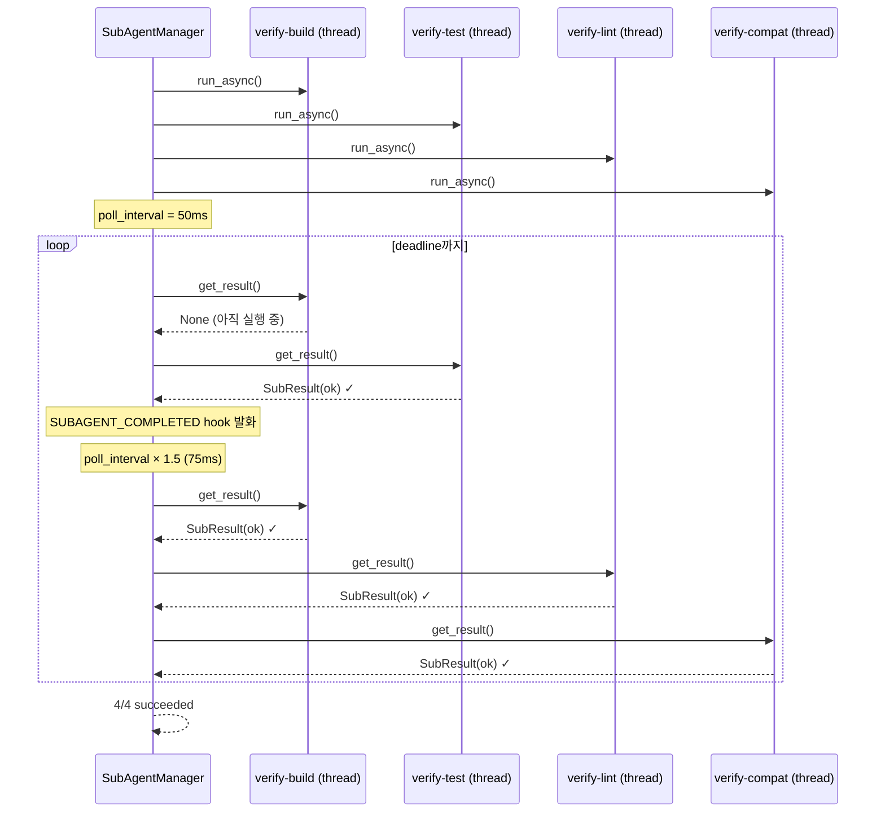

> 결과 수집 순서가 **제출 순서와 다릅니다**. 먼저 끝나는 태스크부터 수집하여 `SUBAGENT_COMPLETED` hook을 즉시 발화합니다. 제출 순서대로 기다리면 가장 느린 태스크 뒤에 있는 빠른 태스크의 hook이 지연됩니다.
>
> polling interval은 50ms에서 시작해 × 1.5씩 증가하며 500ms에서 캡됩니다. 짧은 태스크에 빠르게 반응하면서도 긴 태스크에서 CPU를 낭비하지 않는 적응적 전략입니다.

| 컴포넌트 | 역할 | 핵심 설계 결정 |
|---------|------|--------------|
| `CoalescingQueue` | 동일 task_id 중복 제거 | 시간 윈도우 기반 중복 억제 |
| `TaskGraph` | SubTask 간 DAG 의존성 | 현재 모든 태스크 독립 (확장 대비) |
| `IsolatedRunner` | 스레드 격리 실행 | session_id로 결과 매칭 |
| `HookSystem` | 3종 lifecycle 이벤트 | STARTED/COMPLETED/FAILED |
| `AgentRegistry` | 에이전트 정의 조회 | task_type → agent 매핑 |
| `SubagentRunRecord` | parent↔child 추적 | OpenClaw Spawn 패턴 |
| `SUBAGENT_DENIED_TOOLS` | 위험 도구 차단 | 6종 도구 샌드박스 |
| `AgentMemory` | per-agent 학습 축적 | task 완료 시 learning 저장 |

---

## 6. JAR E2E: 비-웹 프로젝트의 동치성 검증

57번 포스트에서 다룬 API Blackbox Testing은 **웹 프로젝트**(Spring Boot)에서 HTTP 응답을 비교합니다. 하지만 CLI 도구, 배치 프로세서, 라이브러리는 HTTP 엔드포인트가 없습니다. JAR E2E는 이 간극을 메웁니다.

### 프로젝트 타입 감지

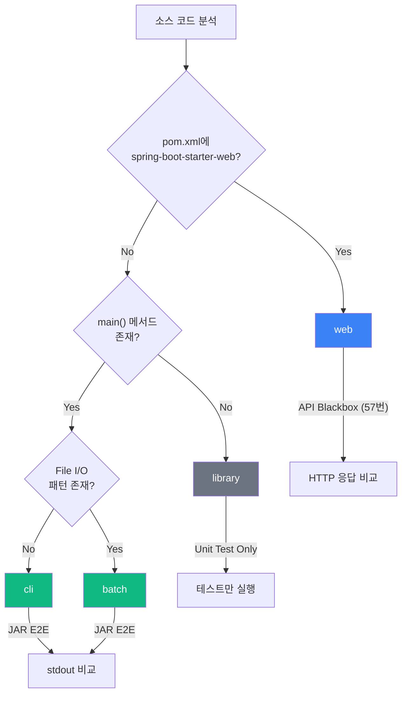

```python
# core/tools/jar_e2e.py — detect_jar_type()
def detect_jar_type(source_path):
    # 1. pom.xml에 spring-boot-starter-web → "web"
    # 2. main() 없음 → "library"
    # 3. main() + FileInputStream/BufferedReader → "batch"
    # 4. main() only → "cli"
```

> 프로젝트 타입 감지에 LLM을 사용하지 않습니다. pom.xml 키워드 + main() 메서드 존재 + File I/O 패턴이라는 3단계 휴리스틱으로 충분합니다. 비용 $0, 지연 0ms.

### 비교 전략: Old stdout = Ground Truth

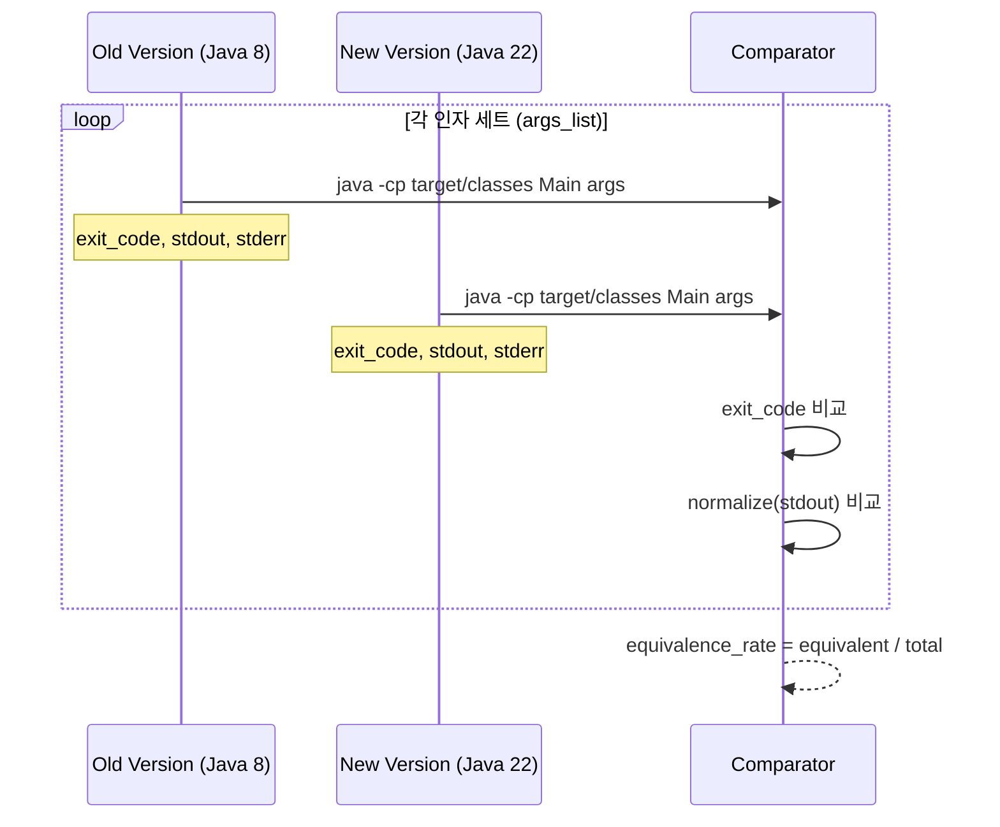

```python
# core/tools/jar_e2e.py — 핵심 제약
"""
CAN NOT constraints:
- CAN NOT let LLM judge pass/fail — comparison is deterministic string match
- CAN NOT let LLM generate expected output — Old version output is ground truth
- CAN NOT exceed 5-minute timebox
- CAN NOT use --privileged or --network=host on Docker containers
"""
```

> `CAN NOT` 제약이 4개 명시되어 있습니다. 핵심은 **LLM이 pass/fail을 판단하지 못한다**는 것입니다. Old 버전의 stdout이 ground truth이고, 비교는 결정론적 문자열 매칭입니다. LLM이 "이 출력은 의미적으로 동등합니다"라고 판단하는 것을 허용하면, 미묘한 행동 변화를 놓칠 수 있습니다.

### 출력 정규화

```python
def _normalize_output(output: str) -> str:
    lines = output.strip().splitlines()
    return "\n".join(line.rstrip() for line in lines)
```

후행 공백과 개행만 정규화합니다. 타임스탬프나 랜덤 값은 정규화하지 않습니다. 이것은 의도적인 선택입니다 — 타임스탬프가 달라지면 그것도 행동 변화이므로, 검출되어야 합니다.

---

## 7. 비용 예측과 ContextBudget 직렬화

### Budget Gate 진화

55번 포스트의 Budget Gate는 단순했습니다:

```python
# v0.16: 단순 비교
if budget_usd > 0 and fix_total_cost >= budget_usd:
    return  # skip LLM
```

v0.20에서는 **ContextBudget** 객체가 그래프 상태에 포함되어, Checkpoint를 통한 중단/재개 시에도 예산 상태가 보존됩니다.

### 직렬화 문제와 해결

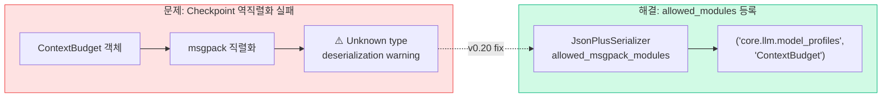

```python
# core/graph.py — compile_graph()
_allowed_modules: list[tuple[str, ...]] = [
    ("core.state", "ReodeState"),
    ("core.state", "MigrationState"),
    ("core.state", "PortingState"),
    ("core.llm.model_profiles", "ContextBudget"),  # v0.20 추가
]
_serde = JsonPlusSerializer(
    allowed_json_modules=_allowed_modules,
    allowed_msgpack_modules=_allowed_modules,
)
```

> LangGraph의 Checkpoint는 State를 msgpack으로 직렬화합니다. 커스텀 타입이 State에 포함되면 `allowed_msgpack_modules`에 명시적으로 등록해야 합니다. 등록하지 않으면 역직렬화 시 타입 정보가 소실되어 dict로 복원됩니다. `ContextBudget`은 속성 접근(`.remaining`, `.used`)을 사용하므로 dict 복원 시 `AttributeError`가 발생합니다.

---

## 8. v0.17 → v0.20: 그래프가 달라진 전후 비교

### 토폴로지 변화

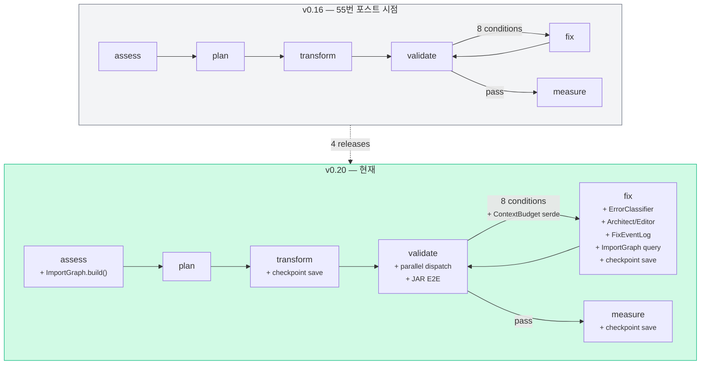

### 모듈 적층 구조

노드 수와 엣지 수는 변하지 않았습니다. 바뀐 것은 **각 노드 내부에 적층된 모듈**입니다.

### fix_node 실행 흐름 — 8단계 적층

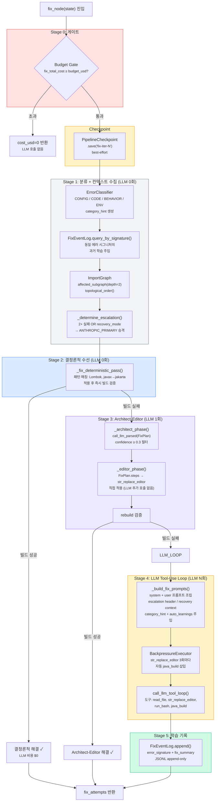

fix_node의 핵심 설계 원칙은 **비용 단계적 증가(cost escalation)**입니다.

| Stage | LLM 호출 | 비용 | 해결 범위 |
|-------|---------|------|----------|
| 0. Budget Gate | 0 | $0 | 예산 초과 시 즉시 차단 |
| 1. 분류 + 컨텍스트 | 0 | $0 | 에러 유형 판별, 과거 학습/의존성 수집 |
| 2. 결정론적 수선 | 0 | $0 | Lombok 버전, javax→jakarta 등 알려진 패턴 |
| 3. Architect-Editor | **1** | ~$0.01 | 구조화된 진단(FixPlan) + 직접 편집 |
| 4. LLM Tool-Use | **N** | ~$0.05-0.30 | 자유 도구 사용 루프, 에스컬레이션 포함 |
| 5. 학습 기록 | 0 | $0 | 다음 iteration을 위한 JSONL 기록 |

> **Stage 2에서 끝나면 LLM 비용 $0입니다.** 실제 마이그레이션에서 `javax.annotation → jakarta.annotation` 같은 패턴은 빈번히 발생하며, 이를 LLM 없이 regex 기반으로 처리합니다. Stage 3의 Architect-Editor는 LLM을 **1회만** 호출하여 FixPlan을 생성하고, Editor가 이를 기계적으로 적용합니다. Stage 4(자유 도구 루프)에 도달하는 경우는 비정형 에러뿐입니다.

### BackpressureExecutor 상세

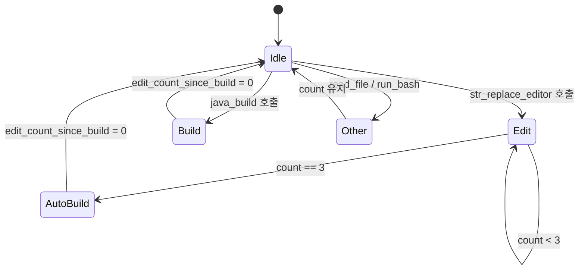

> LLM이 10개 파일을 연속 수정하고 마지막에 빌드를 돌리면, 7번째 수정이 컴파일 에러를 만들었어도 3개 파일을 더 수정한 후에야 발견합니다. `BackpressureExecutor`는 **3번 편집마다 자동으로 `java_build`를 삽입**하여 에러를 조기에 발견합니다. Docker 모드일 때는 Docker 컨테이너 내에서 빌드를 실행합니다.

### validate_node 실행 흐름 — 4단계 적층

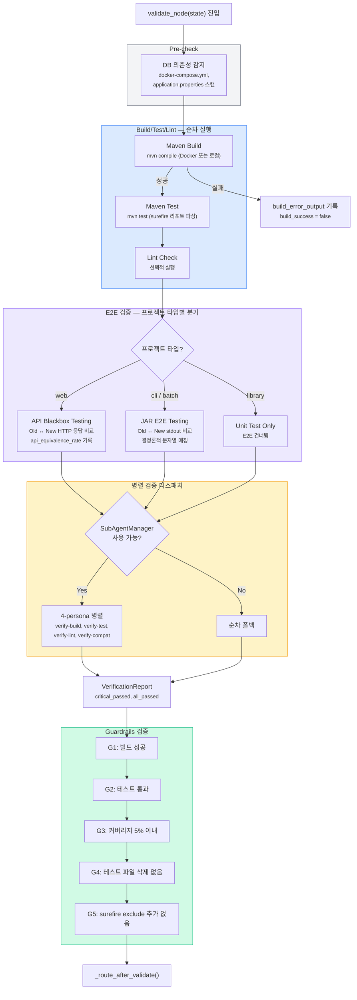

validate_node의 설계는 fix_node와 대비됩니다.

| 차원 | fix_node | validate_node |
|------|---------|--------------|
| 실행 모드 | 단계적 비용 증가 | 모든 검증 항상 실행 |
| LLM 사용 | 0~N회 (비용 최소화) | **0회** (완전 결정론적) |
| 분기 | 에러 카테고리별 | 프로젝트 타입별 |
| 실패 시 행동 | 다음 stage로 진행 | 즉시 에러 기록 후 라우터에 위임 |
| 병렬화 | 없음 (순차 적층) | SubAgentManager 병렬 (옵트인) |

> validate_node에서 LLM을 **한 번도 호출하지 않는 것**이 의도적 설계입니다. 검증은 결정론적이어야 합니다. Maven build가 통과했는지, 테스트가 통과했는지, 커버리지가 떨어졌는지는 LLM의 "판단"이 아니라 도구의 "사실"입니다. LLM이 "이 빌드 에러는 무시해도 됩니다"라고 말하는 것을 허용하면 검증의 의미가 없어집니다.

### Guardrails — 5개 게이트

| 게이트 | 검증 대상 | 실패 시 |
|--------|----------|--------|
| **G1** | 빌드 성공 | build_success=false → fix 라우팅 |
| **G2** | 테스트 100% 통과 | test_pass_rate<100 → fix 라우팅 |
| **G3** | 커버리지 5% 이내 감소 | 경고 로그 (현재 soft gate) |
| **G4** | 테스트 파일 삭제 감지 | 경고 + fix_node에 힌트 전달 |
| **G5** | surefire exclude 추가 감지 | 경고 + fix_node에 힌트 전달 |

> G4와 G5는 "테스트를 지워서 통과시키는" LLM의 꼼수를 방지합니다. fix_node가 `src/test/java/FooTest.java`를 삭제하면 당연히 해당 테스트는 "통과"합니다. G4가 이를 감지하고, fix_node에 "테스트 파일을 삭제하지 말 것"이라는 명시적 힌트를 전달합니다.

### 버전별 릴리스 타임라인

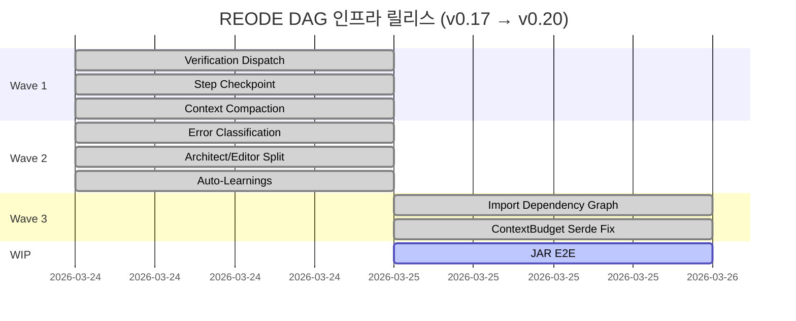

---

## 9. 설계 결정 요약 + 체크리스트

### 설계 결정

| 결정 | 선택 | 대안 | 이유 |
|------|------|------|------|
| Checkpoint L2 저장소 | git tag | tarball / rsync | 대상이 이미 git 저장소, diff 가능, `tag -f`로 덮어쓰기 |
| Checkpoint 실패 정책 | best-effort (로그 후 진행) | 실패 시 중단 | 체크포인트 실패가 마이그레이션을 막아서는 안 됨 |
| Pipeline Template 주입 | contextvars | 상속 / DI 프레임워크 | LangGraph graph 빌드 시점에 런타임 결정 필요 |
| ImportGraph 파서 | regex | tree-sitter | Phase 1은 regex로 충분, tree-sitter는 의존성 추가 |
| ImportGraph depth | 2-hop | 1 / 3 | 1=직접 의존만, 3=노이즈 과다, 2=경험적 균형 |
| 순환 의존성 처리 | sorted()로 끝에 배치 | 예외 발생 / 무시 | 순환 내부 순서는 무의미, 결정론적 출력만 보장 |
| 병렬 검증 | SubAgentManager + graceful fallback | 무조건 병렬 | CLI 모드에서는 SubAgent 없음, 폴백 필수 |
| JAR E2E 판정 | 결정론적 문자열 비교 | LLM 의미 비교 | LLM 판정 허용 시 미묘한 행동 변화 누락 위험 |
| 타임스탬프 정규화 | 안 함 | 정규화 | 타임스탬프 변화도 행동 변화이므로 검출 대상 |
| ContextBudget 직렬화 | allowed_modules 명시 등록 | State에서 제외 | 중단/재개 시 예산 상태 보존 필수 |

### 체크리스트

- [ ] **Checkpoint 전략 결정**: 대상 프로젝트가 git 저장소인지 확인. 아니면 L2 checkpoint 비활성화
- [ ] **Pipeline Template 선택**: 마이그레이션(6-node) vs 포팅(4-node) vs Spring 특화(6-node)
- [ ] **ImportGraph 적용 범위**: Java 외 언어는 별도 파서 필요 (현재 Java only)
- [ ] **SubAgentManager 주입 여부**: 병렬 검증이 필요하면 CLI 시작 시 contextvar 설정
- [ ] **JAR E2E vs API Blackbox**: 프로젝트 타입(web/cli/batch/library)에 따라 자동 선택됨
- [ ] **ContextBudget 직렬화**: 커스텀 타입을 State에 추가할 때 `allowed_modules` 등록 확인
- [ ] **순환 의존성 대비**: ImportGraph가 순환을 끝에 배치하므로, fix 결과 검증 시 순환 파일 주의

---

*이 글은 [55번 포스트](https://rooftopsnow.tistory.com/351)의 후속입니다. fix_node 내부 구조는 [56번](https://rooftopsnow.tistory.com/352), API Blackbox Testing은 [57번](https://rooftopsnow.tistory.com/353)을 참고하세요.*

---

*Source: `blog/posts/reode/58-reode-migration-dag-state-machine-2.md` | Category: [[blog-reode]]*

## Related

- [[blog-reode]]
- [[blog-hub]]
- [[geode]]
- [[geode-architecture]]
