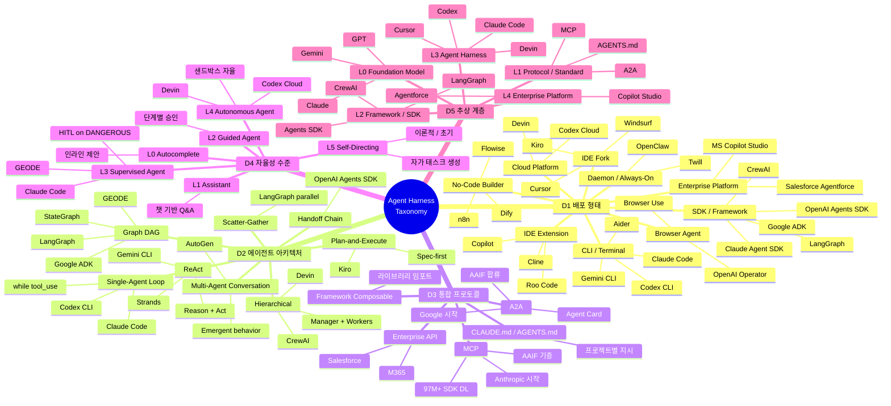
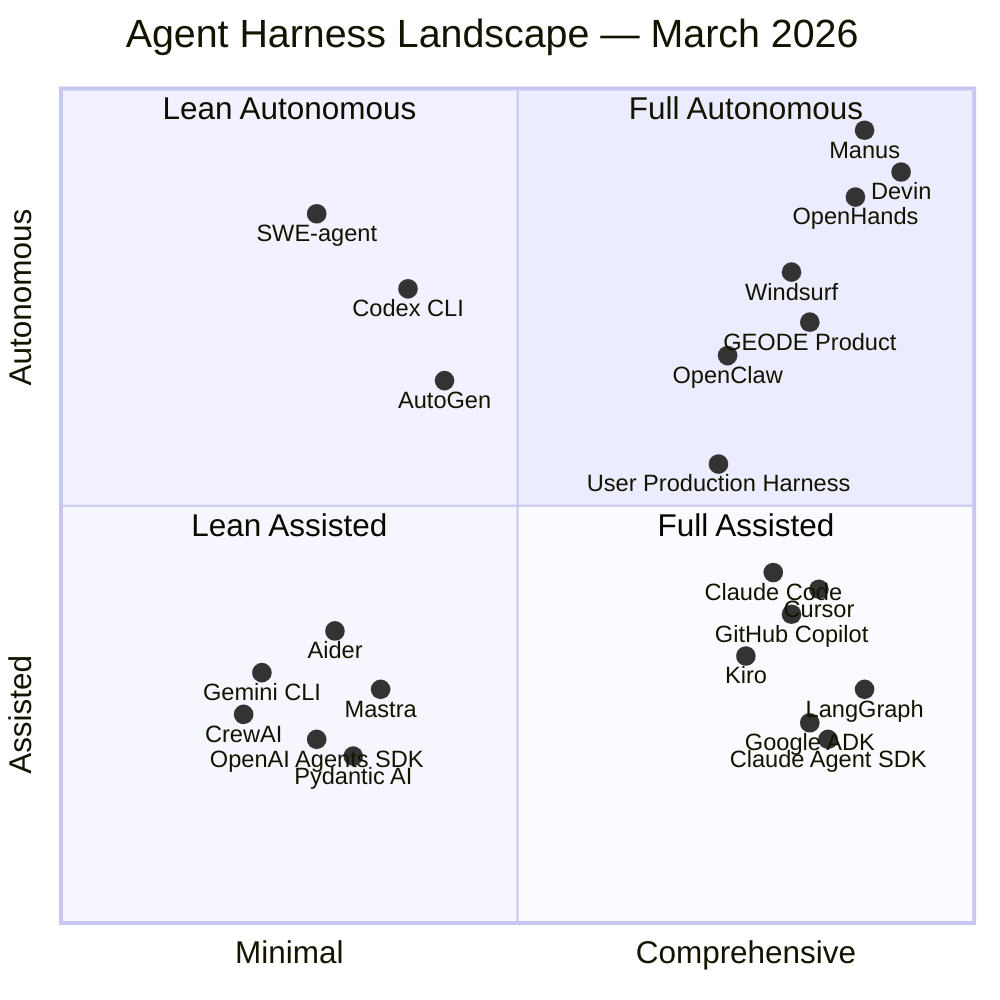
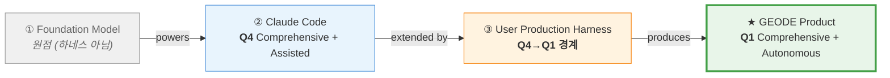
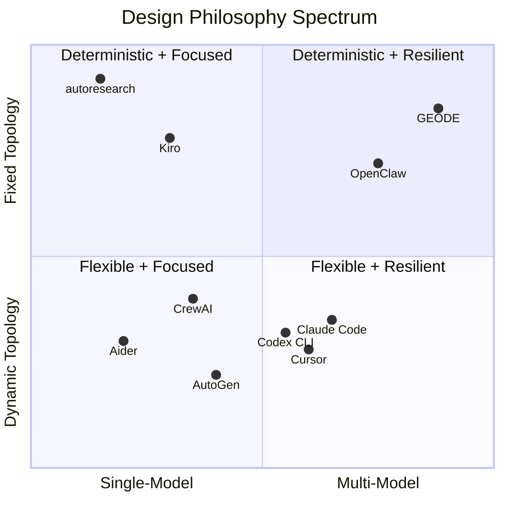
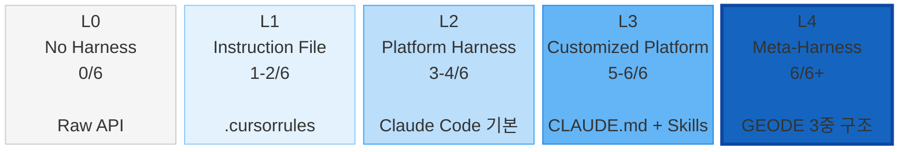

# 에이전트 하네스 랜드스케이프 회고 — 2026년 3월, 3중 하네스 구조의 발견

> Date: 2026-03-26 | Author: rooftopsnow | Tags: harness-engineering, agent-landscape, retrospective, claude-code, codex-cli, geode, meta-harness, context-engineering

---

## 목차

1. 서론: 하네스와 모델의 기여도 추이
2. 하네스 정의와 6요소 프레임워크
3. 프론티어 하네스 전수 조사 (2026-03 기준)
4. 벤치마크 정량 분석
5. 3중 하네스 구조의 발견
6. Soft Harness vs Hard Harness — 제약의 스펙트럼
7. 4사분면 포지셔닝
8. 구현 성향 레이더 분석
9. 횡단 트렌드 7선
10. 관측된 실패 모드 12유형
11. 결론: 하네스 성숙도 모델

---

## 1. 서론: 하네스와 모델의 기여도 추이

2026년 3월 현재, 글로벌 AI 에이전트 시장 규모는 약 $10.9B (MarketsAndMarkets, CAGR 46.3%)입니다. Gartner는 2026년 말까지 엔터프라이즈 애플리케이션의 40%가 태스크-특화 AI 에이전트를 내장할 것으로 전망합니다.

이 시장에서 관측되는 구조적 추이가 있습니다. 에이전트 성능에서 **모델 자체의 기여도**와 **모델을 감싸는 인프라(하네스)의 기여도** 사이의 비중 이동이 관측됩니다.

- LangChain은 모델(GPT-5.2-Codex)을 고정한 채 하네스만 교체하여 Terminal Bench 2.0 점수를 52.8% → 66.5%로 개선했습니다.
- SWE-bench Pro에서 동일 Opus 4.5 모델이 scaffold에 따라 45.9% vs 57.5%로 11.6%p 차이를 보였습니다.
- 프론티어 모델 가격은 1년 간 $15/M tokens에서 $3/M 이하로 하락했습니다.

이 데이터는 하네스의 기여도가 상승 추세에 있음을 시사하지만, 모델 자체의 능력 향상도 지속되고 있어 양자의 관계는 상호 보완적으로 보는 것이 적절합니다.

본 리포트는 세 가지 질문을 다룹니다:

1. 2026년 3월 기준 프론티어 하네스들의 분류와 포지셔닝은 어떠합니까?
2. 하네스 위에 하네스를 쌓는 "메타-하네스" 패턴은 어떻게 작동합니까?
3. GEODE 프로젝트의 3중 하네스 구조는 이 랜드스케이프에서 어떤 좌표에 있습니까?

---

## 2. 하네스 정의와 6요소 프레임워크

**하네스(Harness)**: AI 에이전트의 행동을 제약(Constraint), 유도(Guidance), 증폭(Amplification)하는 인프라 전체를 지칭합니다. Phil Schmid의 정의를 확장하면, 프로덕션 하네스는 6개 요소로 구성됩니다:

| # | 요소 | 정의 | 대표 구현 |
|---|------|------|----------|
| H1 | **Context Engineering** | 에이전트가 보는 정보의 선택·배제·순서·압축 | CLAUDE.md, 1M 윈도우, auto-compaction |
| H2 | **Verification Loop** | 출력 품질을 검증하고 재시도하는 피드백 루프 | lint/type/test 게이트, SWE-bench scaffolding |
| H3 | **State Management** | 세션·태스크·워크플로우의 상태 추적과 지속 | ConversationContext, Tasks DAG, 칸반 보드 |
| H4 | **Tool Orchestration** | 도구 선택, 권한 제어, 병렬 실행 | ToolRegistry, PolicyChain, MCP 카탈로그 |
| H5 | **Human-in-the-Loop** | 사람의 승인·감독·개입 메커니즘 | DANGEROUS 도구 승인, Socratic Gate |
| H6 | **Lifecycle Management** | 에이전트의 생성부터 종료까지 전체 수명 주기 관리 | Hook 이벤트, 세션 격리, 리소스 정리 |

이 6요소는 하네스 비교의 공통 좌표계로 사용됩니다.

### 2.1 하네스 분류도 (Taxonomy)

하네스를 7차원으로 분류합니다. 학술 기반(arXiv 2601.12560, OECD Paper No. 56, INTERFACE EU)과 산업 기반(Schmid, Fowler, Swarmia, StackOne)의 분류 체계를 종합했습니다.



#### 정의 출처

| 출처 | 핵심 비유 | 인용 |
|------|---------|------|
| **Schmid (2026)** | Model = CPU, Harness = OS, Agent = Application | "Harness governs how the agent runs" |
| **Fowler / ThoughtWorks** | SDK·Framework = how you **build**, Harness = how it **runs** | "Build vs Run distinction" |
| **arXiv 2601.12560** | 6차원 분류: Perception, Brain, Planning, Action, Tool Use, Collaboration | 3 패러다임: Symbolic, Neural, Hybrid |
| **OECD Paper No. 56** | AI Agent vs Agentic AI 구분 | "Extended autonomy + multi-agent coordination" |
| **INTERFACE EU** | 자율 주행 레벨 모델 차용, 5단계 자율성 | "Higher autonomy → higher provider liability" |
| **Swarmia** | 코딩 에이전트 5단계: Autocomplete → Self-Directing | "Higher is not always better" |

#### GEODE의 분류 좌표

| 차원 | GEODE 위치 |
|------|-----------|
| D1 배포 형태 | CLI + SDK (하이브리드) |
| D2 아키텍처 | Graph DAG (LangGraph StateGraph) + Hierarchical (SubAgentManager) |
| D3 통합 프로토콜 | MCP (43 카탈로그) + DomainPort (자체 프로토콜) + CLAUDE.md |
| D4 자율성 수준 | L3 (Supervised Agent — HITL on DANGEROUS) |
| D5 추상 계층 | L3 (Agent Harness) — L4로의 확장 경로 보유 |
| D6 대상 사용자 | Individual Developer + Framework Developer |
| D7 오픈소스 | Private (프로토콜은 공개) |

---

## 3. 프론티어 하네스 전수 조사 (2026-03 기준)

### 3.1 개발자 에이전트 하네스 (CLI/IDE)

#### Claude Code (Anthropic)

단일 스레드 마스터 루프(`while stop_reason == "tool_use"`)에 기반한 터미널-퍼스트 CLI입니다. IDE에 종속되지 않고 모든 워크플로우와 조합 가능합니다.

| 요소 | 구현 |
|------|------|
| H1 | 1M 토큰 윈도우(Opus 4.6), 자동 컴팩션, CLAUDE.md 시스템 프롬프트 주입 |
| H2 | 도구 실행→결과 확인→재시도 루프 |
| H3 | ConversationContext(deepcopy), AutoMemory(자동 습관 학습), Tasks DAG |
| H4 | 46+ 빌트인 도구, MCP 네이티브, PolicyChain(STANDARD/WRITE/DANGEROUS) |
| H5 | 권한별 승인, Agent Teams로 자율 확장 가능 |
| H6 | 세션 시작/종료, 서브에이전트 상속(tools/MCP/skills/memory), 백그라운드 태스크 |

**핵심 차별점**: Agent Teams(병렬 서브에이전트), AutoMemory(자동 습관 학습), Claude Agent SDK(동일 하네스의 프로그래매틱 노출)입니다. Xcode 26.3 네이티브 통합을 지원합니다.

#### Codex CLI (OpenAI)

Rust 구현의 레이어드 아키텍처(ThreadManager → CodexThread → Session)입니다. 오픈소스입니다.

| 요소 | 구현 |
|------|------|
| H1 | 400K 토큰(GPT-5.4), Diff 기반 포겟팅(요약 대신 구조적 diff 보존) |
| H2 | 샌드박스 내 테스트 실행, TDD 루프 |
| H3 | TOML 설정, 세션 관리 |
| H4 | MCP 확장, 샌드박스 정책(파일시스템/네트워크 접근 제어) |
| H5 | 커널 레벨 샌드박싱(Claude Code의 애플리케이션 레이어 훅과 대비) |
| H6 | 클라우드 비동기 태스크 위임, 멀티에이전트 워크플로우 |

**핵심 차별점**: Rust 구현(속도), 커널 샌드박싱(보안), Terminal-Bench 75.1%(Claude Code 65.4% 대비 우위), 클라우드 비동기 위임입니다.

#### Cursor

VS Code 포크(플러그인이 아닌 완전한 포크)입니다. IDE-네이티브 에이전트 아키텍처입니다.

| 요소 | 구현 |
|------|------|
| H1 | @Codebase/@Docs/@Git 심볼 기반 프로젝트 의존성 그래프 컨텍스트 |
| H2 | Composer/Agent 모드에서 자율적 터미널 명령, 에러 분석, 수정 제안 |
| H3 | Memory 도구(반복 학습), .cursor/rules/ 디렉토리(glob 매칭) |
| H4 | MCP 통합(2026-03), 의존성 설치, 테스트 실행, 컴파일 에러 분석 |
| H5 | Automations(Slack/Linear/GitHub/PagerDuty 이벤트 트리거) |
| H6 | Composer 모드 멀티 파일 아키텍처 변경, 이벤트 트리거 always-on 에이전트 |

**핵심 차별점**: $2B ARR, IDE-네이티브 경험, Automations(이벤트 트리거 상시 에이전트)입니다. LogRocket AI Dev Tool Power Rankings #1 (2026-02)입니다.

#### Windsurf (Cognition AI)

IDE+Agent 퓨전입니다. Cognition AI(Devin)가 2025년 12월 인수했습니다. Cascade AI 시스템으로 멀티파일 편집을 지원합니다.

#### Gemini CLI (Google)

오픈소스입니다. ReAct 루프 + Google Search 그라운딩을 지원합니다. 무료 티어(60 req/min), 1M 컨텍스트(Gemini 3)로 가장 낮은 진입 장벽을 제공합니다.

#### Aider

오픈소스입니다. Architect/Editor 듀얼 모델 접근(하나는 계획, 하나는 편집)을 사용합니다. 100+ LLM 호환(Ollama 포함)이며, Repository Map으로 효율적 컨텍스트 관리를 합니다. 멀티모달 입력(이미지, 웹, 음성)을 지원합니다.

#### Kiro (AWS)

VS Code 포크입니다. Spec-driven 개발 철학을 가지고 있습니다. Agent Client Protocol(ACP)로 크로스 에디터 호환(JetBrains, Zed)을 지원합니다. Amazon Bedrock 기반이며, FedRAMP High 인증을 추진 중입니다.

#### GitHub Copilot (Agent Mode)

Fleet 모드(병렬 서브에이전트)를 지원합니다. Agentic 코드 리뷰(도구 호출로 리포지토리 컨텍스트 수집)가 가능합니다. 4.7M 유료 구독자를 보유하고 있으며, Fortune 100의 90%가 사용합니다.

#### OpenClaw

상시 작동 Node.js 데몬/서비스입니다. Gateway(제어 플레인) + Agent Runtime(실행 플레인) 분리 구조입니다. 메시징 앱 통합(Telegram, Slack)과 로컬-퍼스트 아키텍처를 갖추고 있습니다. NVIDIA NemoClaw 통합(GTC 2026)을 지원합니다.

### 3.2 에이전트 프레임워크/SDK

| 프레임워크 | 아키텍처 | 핵심 차별점 | PyPI/npm 월간 DL |
|-----------|---------|------------|-----------------|
| **LangGraph** | 그래프 기반 워크플로우, 노드=에이전트 | 프로덕션 최다 실적, LangSmith 관측성 | 34.5M |
| **OpenAI Agents SDK** | 5 프리미티브(Agents/Handoffs/Guardrails/Sessions/Tracing) | 최소 멘탈 모델, 프로바이더 무관(Swarm 후속) | — |
| **Claude Agent SDK** | Claude Code 동일 하네스의 프로그래매틱 노출 | 프로덕션 검증된 루프를 SDK화, Xcode 26.3 네이티브 | — |
| **Google ADK** | 코드-퍼스트 모듈러 프레임워크, 2.0 Alpha 그래프 도입 | Vertex AI 네이티브 배포, 광범위 파트너 에코시스템 | — |
| **CrewAI** | 역할 기반(Role/Goal/Backstory), YAML 설정 | 최저 진입 장벽, 비-ML 엔지니어 친화 | 856K |
| **AutoGen** (→MS Agent Framework) | 대화형 멀티에이전트 협업 | Semantic Kernel과 통합 진행(유지보수 모드) | — |
| **Pydantic AI** | 타입 안전 에이전트, Durable Execution | 개발 시점 에러 탐지, 스트림드 구조화 출력 | 15.1K stars |
| **Mastra** | TypeScript-퍼스트, Gatsby 팀 출신, YC W25 | JS 에이전트 프레임워크 최고 성장(22.3K stars, 300K npm/week) | 300K |

### 3.3 자율 에이전트 플랫폼

| 플랫폼 | SWE-bench | 핵심 특성 |
|--------|-----------|----------|
| **Devin** (Cognition AI) | ~55-60% Verified | 복합 AI 시스템(다중 특화 모델 스웜), 멀티 인스턴스 병렬, 레거시 코드베이스 리팩토링 |
| **Manus** (Meta 인수, $2-3B) | — | 완전 자율(명시적 지시 불요), $100M+ ARR, 22M+ 월간 방문, 메시징 앱 개인 에이전트 |
| **OpenHands** | 77.6% Verified | CodeAct 2.1, 오픈소스 표준, 1000+ 클라우드 에이전트 스케일링, 69.6K stars |
| **SWE-agent** | — | Princeton 연구 기반, 학술 확장에 최적화된 클린 아키텍처, 18.8K stars |

---

## 4. 벤치마크 정량 분석

### 4.1 SWE-bench Verified (2026-03)

상위 에이전트 간 점수 수렴이 관측됩니다. 모델이 아닌 scaffold(하네스)가 10-15%의 분산을 설명합니다.

| 모델/에이전트 | 점수 | 비고 |
|-------------|------|------|
| Claude Opus 4.5 | **80.9%** | 최고 |
| Gemini 3.1 Pro | 80.6% | |
| GPT-5.2 | 80.0% | |
| Claude Sonnet 4.6 | 79.6% | |
| Sonar Foundation Agent | 79.2% | 자율 수정 에이전트 |
| DeepSeek V3.2 | 68.0% | $0.028/M tokens |
| 77개 모델 평균 | 62.2% | |

### 4.2 SWE-bench Pro (난이도 상향)

모델-하네스 조합의 분산이 더 명확하게 드러납니다.

| 모델/에이전트 | 점수 |
|-------------|------|
| GPT-5.4 | **57.7%** |
| Claude Opus 4.6 + WarpGrep v2 | 57.5% |
| GPT-5.3-Codex | 56.8% |
| Claude Opus 4.5 (SEAL scaffold) | 45.9% |

동일 Opus 4.5가 scaffold 차이로 45.9% vs 57.5% — **11.6%p 격차**입니다. 하네스 구성이 성능 분산의 유의미한 변수임을 보여주는 데이터 포인트입니다.

### 4.3 Terminal-Bench 2.0 (CLI 에이전트, 89태스크)

| 모델/에이전트 | 점수 |
|-------------|------|
| GPT-5.3-Codex | **77.3%** |
| Gemini 3.1 Pro Preview | 67.4% |
| Claude Sonnet 4.6 | 59.55% |
| Claude Opus 4.5 | 58.43% |
| Deep Agents CLI (Sonnet 4.5) | ~42.5% |

프론티어 모델의 해결률은 65% 미만입니다. 터미널 태스크에서 Codex CLI(GPT-5.3 기반)가 가장 높은 점수를 기록했습니다.

### 4.4 생산성 역설

| 연구 | 결과 |
|------|------|
| **METR RCT** (16명 숙련 개발자, 246 이슈) | AI 사용 시 **19% 느려짐** (CI: +2%~+39%) |
| 개발자 자기 평가 | AI가 24% 빠르게 할 것이라 예측, 사용 후에도 20% 빨라졌다고 착각 |
| **Faros AI** | AI 고도 채택 팀: 태스크 +21%, PR 머지 +98%, **PR 리뷰 시간 +91%** |
| **DORA 2024** | AI 도구 도입 후 배포 안정성 **-7.2%** 감소 |
| Stack Overflow 2025 | 84% 개발자 AI 사용/계획, **33%만** AI 출력 신뢰, **45%** AI 코드 디버깅이 더 오래 걸린다 |

**관측**: AI가 코드 생성량을 늘리는 반면, 리뷰·디버깅·통합 비용이 증가하여 전체 생산성 이득이 제한됩니다. 하네스의 검증 루프(H2)가 이 비용을 줄이는 접근으로 주목받고 있습니다.

### 4.5 보안 정량 데이터

| 지표 | 수치 | 출처 |
|------|------|------|
| AI 생성 코드 보안 결함 | **45%** | Veracode |
| 3개 에이전트, 30 PR 중 취약점 포함 비율 | **87%** | HelpNetSecurity |
| AI 코드 결함 배수 (vs 인간) | **1.7x** | Opsera |
| XSS 방어 실패율 | **86%** | 동일 연구 |

Broken Access Control이 Claude Code, Codex, Gemini 세 에이전트 모두에서 가장 보편적인 취약점으로 관측되었습니다.

### 4.6 시장·채택 정량

| 지표 | 수치 |
|------|------|
| MCP SDK 월간 다운로드 | **97M+** |
| 가용 MCP 서버 | **5,800+** |
| MCP 클라이언트 | **300+** |
| GitHub Copilot 유료 구독자 | **4.7M** |
| Cursor ARR | **$2B** |
| Claude Code ARR | **$2.5B** |
| Codex 주간 활성 사용자 | **1.6M** |
| Anthropic 전체 ARR | **$14B** |
| AI 작성 코드 비율 | **41%** |

---

## 5. 3중 하네스 구조의 발견

GEODE 프로젝트 32일간의 생산 이력을 분석하면서, 단일 하네스가 아닌 **3중 적층 구조**가 작동하고 있음을 발견했습니다.

```
┌──────────────────────────────────────────────────────────────┐
│  ③ User Production Harness (CLAUDE.md Ecosystem)             │
│     CANNOT/CAN 규칙 17+5, Socratic Gate 5Q, GAP Audit,       │
│     7-Step Workflow, 21 Skills, Memory Index,                 │
│     Quality Gates 3종, Gitflow 규약, 칸반 3-Checkpoint         │
│  ┌──────────────────────────────────────────────────────────┐ │
│  │  ② Platform Harness (Claude Code)                        │ │
│  │     while(tool_use) 루프, Sub-agents, MCP,                │ │
│  │     PolicyChain, Context Compaction,                      │ │
│  │     AutoMemory, Read/Edit/Bash/Grep/Agent                │ │
│  │  ┌────────────────────────────────────────────────────┐  │ │
│  │  │  ① Foundation Model (Claude Opus 4.6)              │  │ │
│  │  │     Raw reasoning + tool_use + structured output    │  │ │
│  │  └────────────────────────────────────────────────────┘  │ │
│  └──────────────────────────────────────────────────────────┘ │
│                              ↓ produces                       │
│                    ★ GEODE (Product Harness)                   │
└──────────────────────────────────────────────────────────────┘
```

각 층이 하네스 6요소를 독립적으로 충족합니다:

| 하네스 요소 | ① Foundation | ② Platform (Claude Code) | ③ User Production |
|------------|-------------|------------------------|-------------------|
| **H1 Context** | 학습 데이터 + 시스템 프롬프트 | 1M 윈도우, auto-compaction, CLAUDE.md 주입 | Skills 트리거, Memory 로드, GAP Audit |
| **H2 Verification** | Self-consistency | 도구 실행→결과 확인 루프 | Quality Gate 3종 + E2E + Socratic 5Q |
| **H3 State** | 컨텍스트 윈도우 내 상태 | ConversationContext, AutoMemory, Tasks | 7-Step 워크플로우 상태, 칸반, progress.md |
| **H4 Tools** | tool_use 프로토콜 | 46+ 도구, MCP, ToolSearch | GAP Audit(grep/Explore), Worktree, HEREDOC PR |
| **H5 HITL** | — | DANGEROUS 도구 승인 | Socratic Gate 사용자 승인, PR CI 루프 |
| **H6 Lifecycle** | — | 세션 시작/종료 | Board→GAP→Plan→Impl→Verify→Docs→PR→Board |

### 5.1 ③의 진화 타임라인

GEODE v0.1(2026-02-21)부터 v0.27.1(2026-03-26)까지 32일간의 하네스 성숙도 추이입니다:

```
Phase 1 (v0.1-v0.14, 2/21-3/9)     Phase 2 (v0.15-v0.20, 3/10-19)
───────────────────────────         ─────────────────────────────
Ad-hoc, CLAUDE.md 부재               6-Layer 형식화, CANNOT/CAN 도입
Anthropic 단일 프로바이더             Port/Adapter DI, MCP 레지스트리
750 tests, 0 skills                  1500+ tests, 18 skills
하네스 요소: 1/6 충족                  하네스 요소: 4/6 충족

Phase 3 (v0.21-v0.24, 3/19-25)     Phase 4 (v0.25-v0.27, 3/25-26)
───────────────────────────         ─────────────────────────────
REODE 패턴 역수입 (5 skills)          Memory 4-tier 시스템 프롬프트 주입
Quality Gate 3종 형식화               MCP 병렬 스타트업 (110s→15s)
3-Provider fallback chain             Model-switch context guard
하네스 요소: 6/6 충족                  6/6 + 적응형 컨텍스트 방어
21 skills, 36 hook events             3109+ tests, 221 modules
```

| 시점 | 테스트 | 모듈 | 스킬 | 훅 이벤트 | 프로바이더 | 하네스 6요소 |
|------|--------|------|------|----------|-----------|------------|
| v0.1 | 750 | ~50 | 0 | 0 | 1 | 1/6 |
| v0.14 | 1000+ | ~120 | 0 | 10 | 1 | 2/6 |
| v0.20 | 1500+ | ~180 | 18 | 25 | 1 | 4/6 |
| v0.22 | 2500+ | ~200 | 25 | 30 | 3 | 6/6 |
| v0.27.1 | 3109+ | 221 | 21 | 36 | 3 | 6/6+ |

### 5.2 메타-하네스 패턴의 선행 사례

GEODE의 3중 구조가 고립된 현상이 아님을 보여주는 선행 사례입니다:

| 프로젝트 | 기반 하네스 | 커스텀 레이어 | 성격 |
|---------|-----------|------------|------|
| **Karpathy autoresearch** | Raw LLM API | program.md + git 상태 머신 + ratchet | 극단적 단순 메타-하네스 |
| **Ralphton 우승팀** | Coding agent (미공개) | 133회 Socratic 라운드 + 모호성 점수 0.05 | 대회 특화 메타-하네스 |
| **OpenClaw** | LLM API + TS 런타임 | Gateway(제어 플레인) + Agent Runtime(실행 플레인) | 인프라 메타-하네스 |
| **GEODE** | Claude Code | CLAUDE.md + 21 Skills + 7-Step Workflow | 풀-스택 메타-하네스 |

이 사례들의 공통 관측: **기반 하네스의 자유도를 제약함으로써 출력 품질이 향상됩니다.**

---

## 6. Soft Harness vs Hard Harness — 제약의 스펙트럼

하네스 설계의 핵심 설계 변수는 제약의 강도(hardness)입니다. 네 가지 유형이 관측됩니다:

| 유형 | 강제 방식 | 위반 가능성 | 대표 구현 |
|------|---------|-----------|----------|
| **Hard Constraint** | 코드 강제, 우회 불가 | 없음 | 샌드박스 파일시스템 제한, PolicyChain deny-list, 컨텍스트 윈도우 물리적 한계 |
| **Ratchet Constraint** | Soft 강제 + 자동 롤백 | 시도 가능, 실패 시 되돌림 | autoresearch P4 (`if better: keep, else: revert`) |
| **Gated Constraint** | 기본 Soft, 탐지 시 Hard | 탐지 전까지 가능 | GEODE HITL(DANGEROUS 도구만 Hard) |
| **Soft Constraint** | 프롬프트 기반, LLM 자기 규율 | 컨텍스트 압박 하에서 위반 가능 | CLAUDE.md CANNOT 규칙, .cursorrules |

**관측**: 가장 효과적인 하네스는 **피라미드 구조**를 사용합니다:

```
        ╱ Soft: 50+ 스타일·컨벤션 가이드라인 ╲
       ╱  Gated: 20-30 조건부 제약              ╲
      ╱   Ratchet: 5-10 자동 롤백 규칙            ╲
     ╱    Hard: 3-5 절대 불가 (코드 강제)            ╲
    └──────────────────────────────────────────────┘
```

②(Claude Code)와 ③(User Production Harness)의 제약 성격 차이:

| 차원 | ② Claude Code | ③ User Production Harness |
|------|--------------|--------------------------|
| 제약 방식 | 코드(PolicyChain, 샌드박스) | 텍스트(CANNOT 규칙, Socratic Gate) |
| 실행 주체 | 런타임 강제 | LLM 자기 규율 |
| 검증 | 도구 결과 파싱 | 품질 게이트 + 실측값 대조 |
| 상태 저장 | ContextVar, 인메모리 | 파일(progress.md, MEMORY.md) |
| 확장 | MCP/도구 코드 추가 | Skill .md 파일 추가 |
| 스코프 | 범용 | 프로젝트 특화 |

**관측**: ③은 Hard Constraint가 아닌 **Soft+Ratchet 혼합**이지만, GEODE의 최근 972 커밋에서 CANNOT 규칙 위반은 0건이었습니다. 이 사례에서는 구조화(명시적 테이블, 장애 시나리오 문서화, 3-Checkpoint)가 Soft Constraint의 준수율을 높이는 데 기여한 것으로 보입니다.

---

## 7. 4사분면 포지셔닝

### 축 정의

- **X축**: Minimal ↔ Comprehensive — 추상 레이어 수, 모델 수, 도구 수, 오케스트레이션 깊이
- **Y축**: Assisted ↔ Autonomous — 사람 주도 vs 에이전트 주도, 자율 의사결정 수준

### 전체 맵



### 사분면별 특성

| 사분면 | 특성 | 대표 하네스 | 적합 시나리오 |
|--------|------|-----------|-------------|
| **Q1** (Comprehensive + Autonomous) | 풀-피처 자율 플랫폼. 멀티 도구, 멀티 모델, 자율 의사결정. | Devin, Manus, OpenHands, Windsurf, **GEODE** | 대규모 자율 파이프라인, 무인 분석, 레거시 리팩토링 |
| **Q2** (Minimal + Autonomous) | 경량 자율 에이전트. 좁은 스코프, 높은 자율성. | SWE-agent, Codex CLI, AutoGen | CLI 태스크 자동화, 연구용 벤치마킹, CI/CD 통합 |
| **Q3** (Minimal + Assisted) | 가벼운 인간-AI 협업 도구. 빠른 프로토타이핑. | Aider, Gemini CLI, CrewAI, OpenAI SDK, Pydantic AI, Mastra | 페어 프로그래밍, 학습, MVP 개발 |
| **Q4** (Comprehensive + Assisted) | 피처-리치 환경에서 인간이 주도. AI는 강력한 협업자. | **Claude Code**, Cursor, Copilot, Kiro, LangGraph, ADK | 프로덕션 개발, 엔터프라이즈 코딩, 팀 협업 |

### 3중 하네스의 사분면 궤적



**Producer-Product Inversion**: ②(Claude Code)는 Q4(Assisted)인데, 그것이 생산한 GEODE는 Q1(Autonomous)입니다. 생산 도구보다 제품이 더 자율적입니다. ③(User Production Harness)은 이 역전을 가능하게 하는 **변환기(transformer)**입니다 — Q4의 도구에 자율 워크플로우를 씌워 Q1 제품을 만들어냅니다.

---

## 8. 구현 성향 레이더 분석

### 8.1 주요 하네스 7축 비교

| 축 | Claude Code (②) | User Harness (③) | GEODE (제품) | Codex CLI | OpenClaw | autoresearch |
|---|---|---|---|---|---|---|
| **단순성** | ████████░░ | ██████░░░░ | ████░░░░░░ | ████████░░ | ██████░░░░ | ██████████ |
| **결정론적 실행** | ███░░░░░░░ | ████████░░ | █████████░ | ████░░░░░░ | ██████░░░░ | ██████████ |
| **멀티 모델 회복력** | ████░░░░░░ | █████░░░░░ | █████████░ | ██████░░░░ | ████████░░ | ██░░░░░░░░ |
| **도메인 특화** | ██░░░░░░░░ | ████████░░ | ████████░░ | ██░░░░░░░░ | ████░░░░░░ | ██████████ |
| **개발자 경험** | █████████░ | █████░░░░░ | █████░░░░░ | ████████░░ | ██████░░░░ | ███░░░░░░░ |
| **자율 오케스트레이션** | █████░░░░░ | ███████░░░ | █████████░ | ██████░░░░ | ████████░░ | ████████░░ |
| **컨텍스트 공학** | ████████░░ | ████████░░ | ████████░░ | ██████░░░░ | ██████░░░░ | ██████████ |

### 8.2 설계 철학 스펙트럼

각 하네스의 설계 철학을 **토폴로지 결정론** × **모델 다양성** 두 축으로 분류하면 다음과 같습니다:



**GEODE**는 **Fixed Topology + Multi-Model** 조합입니다. LangGraph StateGraph로 파이프라인 토폴로지를 컴파일 타임에 고정하되, 3사 9모델의 런타임 폴백으로 실행 회복력을 확보합니다. 이는 **결정론적 실행 + 확률적 회복**의 하이브리드 구조로, autoresearch(결정론 극단)와 Claude Code(동적 극단) 사이에 위치합니다.

---

## 9. 횡단 트렌드 7선

2026년 3월 기준, 주요 프론티어 하네스들에서 공통적으로 관측되는 트렌드입니다:

### Trend 1: MCP의 유니버설 프로토콜화

Anthropic이 시작한 MCP(Model Context Protocol)가 OpenAI, Google, Microsoft에 의해 채택되었습니다. 97M 월간 SDK 다운로드, 5,800+ 서버를 기록하고 있습니다. 2025년 12월 Linux Foundation(AAIF)에 기증되었습니다. 2026 로드맵: Transport 확장성, Agent 간 통신(Tasks primitive), 거버넌스, 엔터프라이즈 준비(SSO, 감사 추적, 게이트웨이)입니다.

### Trend 2: 하네스 기여도에 대한 인식 확산

커뮤니티 내에서 "모델 성능이 수렴할수록 하네스의 상대적 기여도가 높아진다"는 인식이 확산되고 있습니다. LangChain의 Terminal Bench 사례(하네스만 변경, +13.7%p), SWE-bench Pro의 scaffold 분산(±11.6%p)이 이를 뒷받침하는 데이터 포인트로 인용됩니다. 다만 이 인식이 모든 태스크 유형에 일반화 가능한지는 추가 검증이 필요합니다.

### Trend 3: Sub-agent 아키텍처의 표준화

Claude Code(Agent Teams), GitHub Copilot(Fleet), Codex CLI(멀티에이전트), Devin(멀티인스턴스) 등 주요 하네스들이 병렬 서브에이전트를 지원합니다. 공통 패턴: 메모리 격리, 도구 상속, 결과 요약 머지입니다.

Anthropic 내부 평가에 따르면 멀티에이전트가 싱글에이전트 대비 **90.2%** 성능 향상을 보였습니다. 병렬화 가능 태스크에서 **+81%**, 순차 태스크에서 **-70%**입니다 (Google Research).

### Trend 4: 메모리의 계층화

3단계 메모리 전략이 다수 하네스에서 관측됩니다:
- **Ephemeral**: 세션 내 (ConversationContext)
- **Persistent Project**: 프로젝트 수준 (CLAUDE.md, specs)
- **Learned/Adaptive**: 자동 학습 (AutoMemory, Cursor Memory Tool)

GEODE는 4-Tier(Organization > Project > Session + UserProfile)로 이를 확장했습니다.

### Trend 5: TypeScript 생태계의 부상

Mastra(22K stars, 300K npm/week), Claude Agent SDK(TS), OpenAI Agents SDK(TS), Google ADK(TS) — TypeScript 기반 에이전트 프레임워크가 증가하며 Python 중심이었던 생태계의 다변화 추이가 관측됩니다.

### Trend 6: Spec-driven vs Vibe Coding의 분기

Kiro(AWS)의 Spec-driven 철학, GEODE의 Socratic Gate, Ralphton 우승팀의 모호성 점수 0.05이 있습니다. 프로덕션 하네스는 "코딩 전에 명세"로 수렴합니다.

```
Vibe Coding ←─────────────────────────────→ Spec-driven
  │                                               │
  단일 프롬프트                         Socratic Gate 5Q
  테스트 없음                          3109+ tests, 3-gate
  No CLAUDE.md                   Comprehensive CLAUDE.md
  프로토타이핑                          프로덕션 시스템
```

### Trend 7: 안전 아키텍처의 분기

| 접근 | 위협 모델 | 대표 하네스 |
|------|---------|-----------|
| 애플리케이션 레이어 훅 | "과잉 확신하지만 선의의 에이전트" | Claude Code |
| 커널 레벨 샌드박싱 | "잠재적 적대적 에이전트" | Codex CLI |
| 6-Layer PolicyChain | "계층적 권한 분리" | GEODE |

양쪽 모두 정당한 신뢰 가정에 기반하며, 배포 환경에 따라 선택이 갈립니다.

---

## 10. 관측된 실패 모드 12유형

프론티어 하네스들에서 반복적으로 관측되는 실패 패턴을 분류합니다:

| # | 실패 모드 | 원인 | 하네스 해법 | 관측 빈도 |
|---|----------|------|-----------|----------|
| F1 | **Context Explosion** | 대형 도구 결과가 윈도우를 가득 채움 | 토큰 인지 프루닝, 도구 결과 요약 | 매우 높음 |
| F2 | **Model Switch Overflow** | 큰 모델→작은 모델 전환 시 컨텍스트 미적응 | 선제적 컨텍스트 축소 (GEODE v0.27.1) | 중간 |
| F3 | **Hallucinated Architecture** | 존재하지 않는 프로젝트 패턴 생성 | CLAUDE.md 명시적 아키텍처 문서 | 높음 |
| F4 | **Rework Loop** | 동일 변경을 되돌리고 다시 적용 반복 | Ratchet(P4), 테스트-퍼스트 워크플로우 | 높음 |
| F5 | **Constraint Drift** | 컨텍스트 압박 하에 soft 제약 무시 | Hard constraint 코드화, 피라미드 구조 | 중간 |
| F6 | **Over-engineering** | 불필요한 복잡성 추가 | Simplicity Selection(P10), Socratic Gate | 매우 높음 |
| F7 | **Stale Context** | 만료된 정보로 의사결정 | 세션 TTL, 메모리 갱신 훅 | 중간 |
| F8 | **Anchoring Bias** | 이전 분석 결과에 고정 | Clean Context(이전 분석 배제) | 높음 (파이프라인) |
| F9 | **Cost Explosion** | 통제 없는 API 호출, live 테스트 무단 실행 | 고정 시간 예산(P3), 비용 가드 | 높음 |
| F10 | **Multi-agent Conflict** | 동시 에이전트의 동일 리소스 수정 | 세션 키 격리, .owner 파일, Lane Queue | 중간 |
| F11 | **Version Desync** | 버전 번호가 파일별로 불일치 | 명시적 동기화 가드 (GEODE 4곳 필수) | 높음 |
| F12 | **Fake Success** | 테스트 실패를 성공으로 보고 | Anti-deception checklist, 실측 검증 | 중간 |

**JetBrains NeurIPS 2025 발견**: LLM 생성 요약이 에이전트 궤적을 13-15% 연장시킵니다. 결정론적 관측 마스킹(코드 기반, LLM 비사용)이 동등 성능에서 50% 비용 절감을 달성했습니다. GEODE의 "Tier 1: 결정론적 요약, Tier 2: LLM 내러티브(opt-in)" 접근을 지지하는 외부 증거입니다.

---

## 11. 결론: 하네스 성숙도 모델

### 5단계 성숙도 모델

본 리포트에서 관측한 패턴들을 종합하면, 하네스 성숙도를 5단계로 분류할 수 있습니다:

| 단계 | 명칭 | H1-H6 충족 | 대표 사례 | 적합 단계 |
|------|------|-----------|----------|----------|
| **L0** | No Harness | 0/6 | Raw LLM API 호출 | 실험 |
| **L1** | Instruction File | 1-2/6 | .cursorrules, 기본 AGENTS.md | 프로토타입 |
| **L2** | Platform Harness | 3-4/6 | Claude Code 기본, Codex CLI 기본 | MVP |
| **L3** | Customized Platform | 5-6/6 | Claude Code + CLAUDE.md + Skills | 프로덕션 |
| **L4** | Meta-Harness | 6/6 + 적응형 | GEODE 3중 구조, autoresearch | 성숙 시스템 |



### GEODE의 좌표

| 차원 | 위치 |
|------|------|
| 하네스 성숙도 | **L4** (Meta-Harness) |
| 사분면 위치 | **Q1** (Comprehensive + Autonomous) |
| 설계 철학 | **Fixed Topology + Multi-Model Hybrid** |
| 제약 구조 | 피라미드 (Hard 5 + Ratchet 3 + Gated 20 + Soft 50+) |
| 생산 도구 위치 | **Q4 → Q1 변환기** (③ User Production Harness) |

### 최종 관측

1. **하네스는 3중입니다.** Foundation Model → Platform Harness → User Production Harness. 각 층은 독립적 하네스 6요소를 충족하며, 상위 층이 하위 층의 자유도를 제약합니다.

2. **Producer-Product Inversion이 관측됩니다.** Assisted(Q4) 도구로 Autonomous(Q1) 제품을 만드는 구조에서, ③(User Production Harness)이 변환 레이어로 기능하고 있습니다.

3. **Soft Constraint의 준수율이 예상보다 높습니다.** GEODE의 972 커밋에서 CANNOT 위반 0건이 관측되었습니다. 구조화된 명시적 테이블과 Checkpoint를 동반할 때, 프롬프트 기반 제약이 높은 준수율을 보이는 것으로 나타났습니다. 단, 이는 단일 프로젝트의 관측이며 일반화에는 추가 검증이 필요합니다.

4. **엔지니어링 관심사의 이동이 관측됩니다.** 프롬프트 엔지니어링(2025 초) → 컨텍스트 엔지니어링(2025 중) → 하네스 엔지니어링(2026)으로 커뮤니티의 초점이 이동하는 추세가 Schmid, Fowler, Gupta 등에 의해 보고되고 있습니다.

5. **벤치마크에서 하네스 변수의 영향이 유의미합니다.** SWE-bench Pro에서 동일 모델의 scaffold 차이가 11.6%p를 만들었습니다. 모델 선택과 하네스 설계 모두 성능에 기여하며, 특히 모델 성능이 수렴하는 구간에서 하네스의 상대적 기여도가 높아지는 경향이 관측됩니다.

---

### 참고 문헌

- Epoch AI, "SWE-bench Verified Leaderboard" (2026)
- Scale Labs, "SWE-bench Pro Public Leaderboard" (2026)
- Vals AI, "Terminal-Bench 2.0" (2026)
- METR, "Early 2025 AI Experienced OS Developer Productivity Study" (2025)
- METR, "Uplift Update" (2026-02)
- Stack Overflow, "2025 Developer Survey — AI Section" (2025)
- Faros AI, "AI Software Engineering Productivity Analysis" (2026)
- Google, "2024 DORA Report" (2024)
- Veracode, "AI-Generated Code Security Risks" (2026)
- HelpNetSecurity, "AI Coding Agent Security: Claude Code, Codex, Gemini" (2026-03)
- Gartner, "40% Enterprise Apps AI Agents by 2026" (2025-08)
- Gartner, "40% Agentic AI Project Cancellations by 2027" (2025-06)
- MarketsAndMarkets, "AI Agents Market $52.62B by 2030" (2026)
- LangChain, "Evaluating Deep Agents CLI on Terminal-Bench 2.0" (2026)
- Anthropic, "Building Agents with Claude Agent SDK" (2026)
- OpenAI, "Agents SDK Documentation" (2026)
- Google, "Agent Development Kit Documentation" (2026)
- JetBrains, "LLM-Generated Summaries Cause Trajectory Elongation" (NeurIPS 2025, arXiv 2508.21433)
- Phil Schmid, "The Importance of Agent Harness in 2026" (2026)
- MCP Manager, "MCP Adoption Statistics" (2026)
- Builder.io, "Codex vs Claude Code: Architecture Deep Dive" (2026)
- Google Research, "Towards a Science of Scaling Agent Systems" (2026)
- Arunkumar et al., "Agentic AI: Architectures, Taxonomies, and Evaluation" (arXiv 2601.12560, 2026-01)
- "AI Agents vs. Agentic AI: A Conceptual Taxonomy" (arXiv 2505.10468, 2025)
- OECD, "The Agentic AI Landscape and Its Conceptual Foundations" (Paper No. 56, 2026-02)
- INTERFACE EU, "An Autonomy-Based Classification of AI Agents" (2026)
- Swarmia, "Five Levels of AI Coding Agent Autonomy" (2026)
- Martin Fowler / ThoughtWorks, "Harness Engineering" (2026)
- OpenAI, "Harness Engineering: Leveraging Codex in an Agent-First World" (2026)
- Aakash Gupta, "2025 Was Agents. 2026 Is Agent Harnesses." (2026)
- StackOne, "The AI Agent Tools Landscape: 120+ Tools Mapped" (2026)
- Microsoft Azure, "AI Agent Design Patterns" (2026)
- Linux Foundation AAIF, "MCP + A2A Protocol Governance" (2025-12)

---

*Source: `blog/posts/harness-frontier/59-harness-landscape-retrospective-march-2026.md` | Category: [[blog-harness-frontier]]*

## Related

- [[blog-harness-frontier]]
- [[blog-hub]]
- [[geode]]
