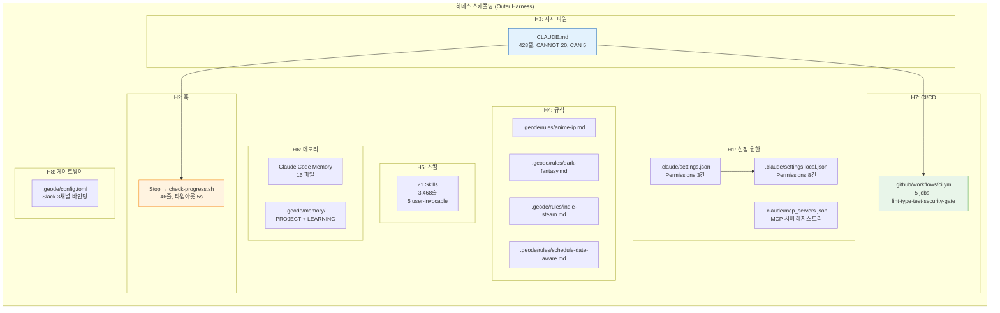
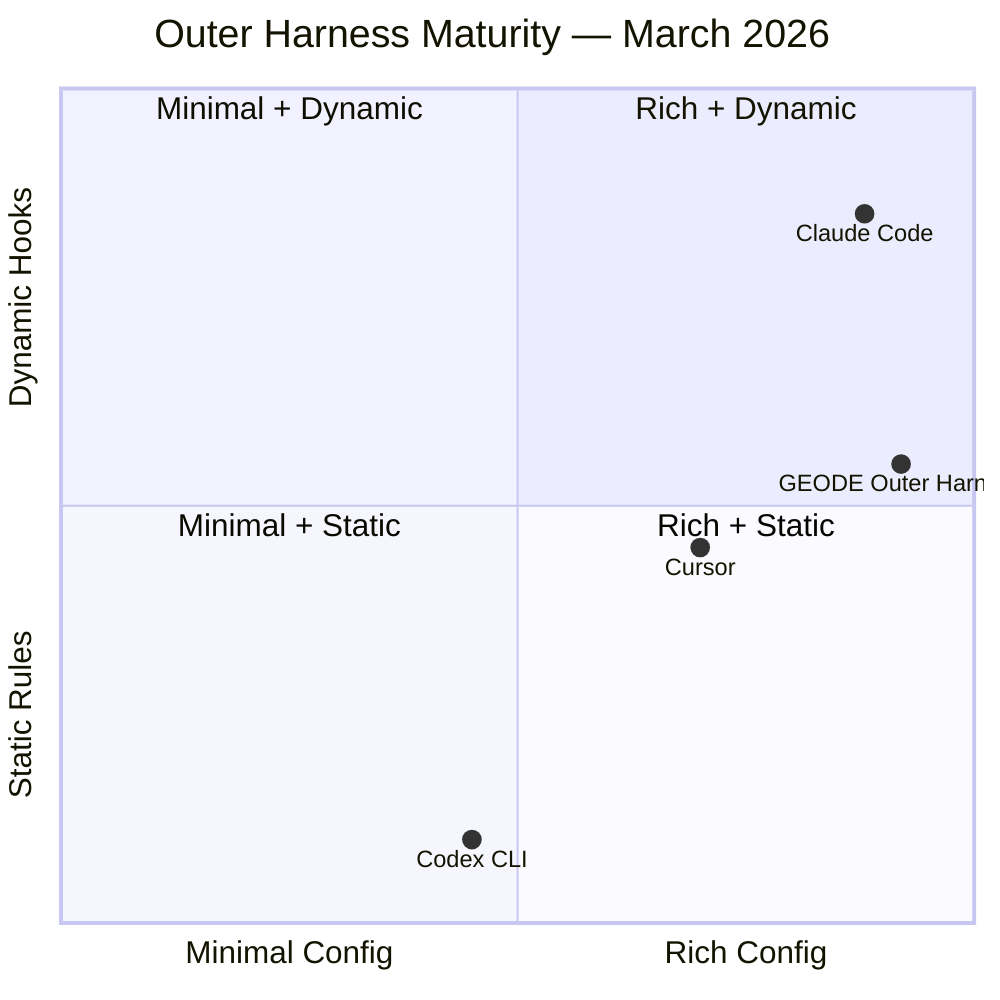

# Scaffolding: Harness Configuration Points — GEODE 프로젝트의 Claude Code 구성 레이어 실측

> Date: 2026-03-26 | Author: rooftopsnow | Tags: scaffolding, harness-configuration-points, hooks, claude-code, settings, skills, memory, rules, ci-cd, harness-engineering

---

## 목차

1. 서론: 하네스 스캐폴딩의 정의
2. Claude Code 훅 시스템 — 이벤트·핸들러·제어 프로토콜
3. GEODE 하네스 스캐폴딩 실측
4. 크로스 플랫폼 비교 (Claude Code / Codex CLI / Cursor)
5. 구성 요소별 하네스 6요소 매핑
6. 프로덕션 하네스 스캐폴딩 패턴 7선
7. 관측된 제약과 한계

---

## 1. 서론: Scaffolding — Harness Configuration Points

Scaffolding은 기반 에이전트 플랫폼(Claude Code, Codex CLI, Cursor 등) **위에** 사용자가 구성하는 제어 레이어를 지칭합니다. 제품 코드 자체가 아니라, 에이전트의 행동을 제약·유도하는 **설정, 훅, 지시 파일, 스킬, 메모리, 규칙, CI/CD** 전체를 포괄합니다. 이 레이어 안의 개별 조작점을 **Harness Configuration Points**라 부릅니다.

업계에서 이 개념을 지칭하는 공식 단일 용어는 아직 부재합니다. OpenDev(arXiv:2603.05344)는 Scaffolding을 "실행 전 조립: 시스템 프롬프트 컴파일, 도구 스키마 등록, 서브에이전트 설정"으로 정의하고, OpenAI는 "Customization Levers", HumanLayer는 "Configuration Points", Fowler는 "Specifications + Quality Checks + Workflow Guidance"로 각각 지칭합니다. 본 리포트에서는 레이어를 **Scaffolding**, 그 안의 조작점을 **Configuration Points**로 구분하여 사용합니다.

Schmid의 정의를 차용하면:

> "에이전트 자체가 아니라, 에이전트가 **어떻게 작동하는지**를 통제하는 시스템."

하네스 스캐폴딩는 세 가지 축으로 구성됩니다:

| 축 | 역할 | 구현 수단 |
|---|------|----------|
| **컨텍스트 공학** | 적절한 정보를 적절한 시점에 주입 | CLAUDE.md, Skills, Memory, Rules |
| **아키텍처 제약** | 결정론적 가드레일 | Hooks, Settings, Permissions, CI/CD |
| **엔트로피 관리** | 컨텍스트 윈도우 간 드리프트 방지 | Memory 파일, 칸반 체크포인트, Stop 훅 |

본 리포트는 GEODE 프로젝트(v0.27.1, 2026-03-26)에 적용된 하네스 스캐폴딩를 실측하고, Claude Code·Codex CLI·Cursor 간 크로스 플랫폼 비교를 수행합니다.

---

## 2. Claude Code 훅 시스템 — 이벤트·핸들러·제어 프로토콜

### 2.1 라이프사이클 이벤트 (21종)

Claude Code는 2026년 3월 기준 21개 라이프사이클 이벤트를 지원합니다.

| 카테고리 | 이벤트 | 블로킹 | 매처 |
|---------|--------|-------|------|
| **Session** | `SessionStart`, `SessionEnd` | No | 없음 |
| **Prompt** | `UserPromptSubmit` | No | 없음 |
| **Tool** | `PreToolUse` | **Yes** | tool_name 정규식 |
| | `PostToolUse` | No | tool_name 정규식 |
| | `PostToolUseFailure` | No | tool_name 정규식 |
| | `PermissionRequest` | No | tool_name 정규식 |
| **Agent** | `SubagentStart`, `SubagentStop` | No | 없음 |
| | `TeammateIdle` | No | 없음 |
| | `TaskCompleted` | No | 없음 |
| **Stop** | `Stop` | No | 없음 |
| | `StopFailure` | No | 없음 |
| **Notification** | `Notification` | No | 없음 |
| **Context** | `PreCompact`, `PostCompact` | No | 없음 |
| **Config** | `ConfigChange`, `InstructionsLoaded` | No | 없음 |
| **Worktree** | `WorktreeCreate`, `WorktreeRemove` | No | 없음 |
| **Elicitation** | `Elicitation`, `ElicitationResult` | No | 없음 |

**블로킹 가능 이벤트**: `PreToolUse`만 에이전트 동작을 차단할 수 있습니다. `hookSpecificOutput`으로 `permissionDecision: "allow" | "deny" | "ask"`를 반환하며, `updatedInput`으로 도구 입력을 투명하게 재작성할 수 있습니다.

### 2.2 핸들러 유형 (4종)

| 유형 | 동작 | 용도 |
|------|------|------|
| `command` | 셸 스크립트 실행, stdin JSON → stdout JSON | 린터, 포맷터, 진행 상태 점검 |
| `http` | POST 이벤트 JSON을 URL 엔드포인트에 전송 | 외부 시스템 알림, 로깅 |
| `prompt` | 단일 턴 Claude 평가, yes/no 판정 반환 | 의미론적 검증 ("이 변경이 보안 규칙을 위반하는가?") |
| `agent` | 서브에이전트 스폰 (Read, Grep, Glob 도구 접근) | 다단계 검증 로직 |

`command` 핸들러는 `async: true` 옵션으로 백그라운드 실행이 가능합니다 (비블로킹).

### 2.3 출력 프로토콜

| 종료 코드 | 동작 |
|----------|------|
| 0 + JSON stdout | 구조화된 제어 (허용/거부/컨텍스트 주입) |
| 0 + 빈 stdout | 통과 (기본 동작) |
| 2 | 강제 블로킹 (레거시, JSON 무시) |
| `"continue": false` (JSON) | 모든 처리 중단 (최종 오버라이드) |

### 2.4 설정 계층 (5단계 우선순위)

| 우선순위 | 스코프 | 경로 | 특성 |
|---------|-------|------|------|
| 1 (최고) | Enterprise Managed | `/etc/claude-code/managed-settings.json` | 하위 스코프 오버라이드 불가 |
| 2 | Session | CLI 인자 | 세션 한정 |
| 3 | Project Local | `.claude/settings.local.json` | gitignored, 개인 오버라이드 |
| 4 | Project Shared | `.claude/settings.json` | 버전 관리, 팀 공유 |
| 5 (최저) | User Global | `~/.claude/settings.json` | 전역 기본값 |

---

## 3. GEODE 하네스 스캐폴딩 실측

### 3.1 전체 구성도



### 3.2 설정·권한 (Settings)

**기반 권한** (`.claude/settings.json`, 팀 공유):

```
Bash(uv run *)      — 패키지 매니저 실행
Bash(uv sync*)      — 의존성 동기화
Bash(python3 *)     — Python 직접 실행
```

**로컬 확장 권한** (`.claude/settings.local.json`, gitignored):

```
Bash(uv run geode version)    — 버전 조회
Bash(git fetch *)              — 원격 동기화
Bash(git worktree *)           — 워크트리 관리
Bash(gh pr *)                  — GitHub PR 조작
WebSearch                      — 웹 검색
```

**패턴**: 최소 기반 + 로컬 확장입니다. 파일 직접 조작 명령은 허용 목록에 부재하며, Claude Code 빌트인 도구(Read/Edit/Write)로만 접근 가능합니다.

### 3.3 훅 (Hooks)

현재 구성된 훅: **1건** (Stop 이벤트).

| 항목 | 값 |
|------|---|
| 이벤트 | `Stop` |
| 핸들러 | `command` |
| 스크립트 | `.claude/hooks/check-progress.sh` |
| 타임아웃 | 5초 |
| 줄 수 | 46줄 |

**스크립트 로직**:

```
Check 1: 오늘 커밋 존재 + docs/progress.md에 오늘 날짜 부재
  → "progress.md 갱신 필요" 리마인더

Check 2: develop이 main보다 앞서 있음
  → "PR/머지 필요" 리마인더
```

**역할**: 칸반 3-Checkpoint(시작/PR/머지) 중 세션 종료 시점의 진행 상태 동기화를 검증합니다. 블로킹하지 않고 리마인더만 출력합니다.

**미사용 이벤트**: 21개 이벤트 중 20개가 미구성 상태입니다. 특히 `PreToolUse`(블로킹 가능), `PostToolUse`(도구 실행 후 자동화), `PreCompact`(컨텍스트 압축 전 처리)가 활용 가능하나 현재 미적용입니다.

### 3.4 지시 파일 (CLAUDE.md)

| 지표 | 수치 |
|------|------|
| 총 줄 수 | 428 |
| H2 섹션 | 13 |
| H3 섹션 | 15 |
| 테이블 행 | 95 |
| CANNOT 규칙 | 20 |
| CAN 규칙 | 5 |
| 장애 시나리오 | 7 |
| 워크플로우 단계 | 8 (0-7) |
| 품질 게이트 | 4 |

**CANNOT 규칙 분류**:

| 영역 | 건수 | 대표 규칙 |
|------|------|----------|
| Git | 6 | worktree 없이 작업 금지, main 직접 push 금지 |
| 계획 | 1 | Socratic Gate 없이 구현 착수 금지 |
| 품질 | 4 | lint/type/test 실패 커밋 금지, live 테스트 무단 실행 금지 |
| 문서 | 3 | CHANGELOG 누락 금지, 버전 4곳 불일치 금지 |
| PR | 3 | HEREDOC 없이 PR body 금지, CI 미통과 머지 금지 |
| **제약 수준** | | Soft Constraint (LLM 자기 규율) |

**CAN 규칙** (5건): 단순 버그/문서 수정 시 Plan 생략, 테스트 선별 실행, 커밋 메시지 언어 자유, 도구 자유 선택, 개선 발견 시 다음 이터레이션 처리입니다.

**워크플로우** (8단계):

```
0. Board + Worktree → 1. GAP Audit → 2. Plan + Socratic Gate
→ 3. Implement + Test → 4. E2E Verify → 5. Docs-Sync
→ 6. PR & Merge → 7. Board
```

**장애 시나리오** (7종): 네트워크 다운, .owner 부재, CI 타임아웃, 메모리 파일 부패, Confidence 미달, LLM 전체 장애, MCP 스폰 실패입니다. 각각 감지 방법과 조치가 명시되어 있습니다.

### 3.5 도메인 규칙 (Rules)

`.geode/rules/` 디렉토리에 4개의 glob 매칭 규칙 파일이 존재합니다.

| 파일 | glob 패턴 | 역할 |
|------|----------|------|
| `anime-ip.md` | `*cowboy*`, `*ghost*` | YouTube > Reddit 데이터 우선, 방영 시기 보정 |
| `dark-fantasy.md` | `*berserk*`, `*dark*soul*` | 코어 팬 충성도 가중, 폭력/고어 라이선싱 리스크 플래그 |
| `indie-steam.md` | `*balatro*`, `*celeste*`, `*hades*` | Steam DAU/Revenue 직접 활용, K(Social Resonance) 핵심 |
| `schedule-date-aware.md` | `*schedule*`, `*cron*`, `*batch*` | 현재 날짜 확인 의무화 (LLM 학습 컷오프 보정) |

**작동 방식**: 에이전트가 매칭 경로의 파일을 읽을 때 해당 규칙이 자동 로딩되어 시스템 프롬프트에 추가됩니다.

### 3.6 스킬 시스템 (Skills)

`.geode/skills/` 디렉토리에 21개 스킬이 등록되어 있습니다. 총 3,468줄입니다.

| 분류 | 건수 | 스킬명 |
|------|------|--------|
| **제품 패턴** | 5 | geode-pipeline, geode-scoring, geode-analysis, geode-verification, geode-analysts |
| **프레임워크 패턴** | 3 | karpathy-patterns (212줄), openclaw-patterns (354줄), architecture-patterns (495줄) |
| **품질 패턴** | 5 | code-review-quality, dependency-review, codebase-audit, kent-beck-review, agent-ops-debugging |
| **방법론** | 4 | explore-reason-act, anti-deception-checklist, frontier-harness-research, verification-team |
| **워크플로우** | 3 | geode-gitflow (547줄, 최대), geode-changelog, geode-e2e |
| **문서** | 1 | tech-blog-writer |

| 지표 | 수치 |
|------|------|
| User-invocable | 5 (gitflow, changelog, verification-team, tech-blog-writer, geode-analysts) |
| Internal pattern | 16 (시스템 참조용, 트리거 매칭으로 자동 로딩) |
| 최대 스킬 | geode-gitflow (547줄) |
| 최소 스킬 | tech-blog-writer |

**발견 메커니즘**: Claude가 세션 시작 시 모든 SKILL.md의 description을 읽고, 사용자 입력의 키워드/의도와 매칭하여 자동 선택합니다. `"키워드로 트리거"` 패턴으로 트리거 키워드가 description 말미에 명시됩니다.

### 3.7 메모리 (Memory)

**Claude Code 프로젝트 메모리** (`~/.claude/projects/.../memory/`):

| 유형 | 건수 | 대표 파일 |
|------|------|----------|
| Project | 6 | project_identity_pivot.md, project_session14_handoff.md |
| Feedback | 8 | feedback_ci_guardrail.md, feedback_test_cost.md, feedback_no_main_direct_push.md |
| Reference | 2 | research_karpathy_autoresearch_agenthub.md, reference_api_keys_mcp_tools.md |
| **합계** | **16** | |

**GEODE 시스템 메모리** (`.geode/memory/`):

| 파일 | 역할 |
|------|------|
| `PROJECT.md` | 프로젝트 상태 (티어 점수, 최근 인사이트) |
| `MEMORY.md` | 하네스 인덱스 (규칙, 스킬 자동 로딩 경로) |
| `LEARNING.md` | 에이전트 학습 (패턴, 수정사항, 도메인 지식) |

**추가 상태 파일**:

| 경로 | 건수 | 역할 |
|------|------|------|
| `.geode/session/` | 20 | 세션 스냅샷 (messages, state, tools) |
| `.geode/snapshots/` | 59 | 파이프라인 실행 스냅샷 |
| `.geode/journal/transcripts/` | 18 | 트랜스크립트 JSONL + 인덱스 |
| `.geode/result_cache/` | 8 | IP 분석 결과 캐시 |

### 3.8 CI/CD (GitHub Actions)

`.github/workflows/ci.yml` — 5개 필수 잡입니다.

| # | 잡 | 명령 | 기준 |
|---|---|------|------|
| 1 | Lint & Format | `uv run ruff check core/ tests/` | 0 errors |
| 2 | Type Check | `uv run mypy core/` | 0 errors |
| 3 | Test | `uv run pytest --cov=core` | 테스트 수 ≥ 2900 (래칫) |
| 4 | Security | `uv run bandit -r core/` | 0 findings |
| 5 | Gate | 1-4 전체 통과 필수 | 모두 green |

**트리거**: `push` (main, develop) + `pull_request` (main, develop)
**동시성**: `cancel-in-progress: true`
**호스트**: self-hosted 러너

**래칫 메커니즘**: 테스트 수가 2900 미만이면 CI 실패합니다. 테스트 수는 단조 증가만 허용됩니다.

### 3.9 게이트웨이 바인딩

`.geode/config.toml` — Slack 채널 3개 바인딩입니다.

| 설정 | 값 |
|------|---|
| 채널 수 | 3 |
| auto_respond | true |
| require_mention | true |
| max_rounds | 50 |

---

## 4. 크로스 플랫폼 비교 (Claude Code / Codex CLI / Cursor)

### 4.1 훅 시스템

| 기능 | Claude Code | Codex CLI | Cursor |
|------|-----------|-----------|--------|
| 이벤트 수 | **21** | 0 | 5 |
| 핸들러 유형 | 4 (command, http, prompt, agent) | N/A | 1 (command) |
| 블로킹 가능 | PreToolUse (allow/deny/ask + 입력 재작성) | 샌드박스만 | beforeShellExecution, beforeMCPExecution |
| 도구 실행 후 자동화 | PostToolUse | N/A | afterFileEdit |
| 서브에이전트 훅 | SubagentStart/Stop, TeammateIdle | N/A | N/A |
| 컨텍스트 관리 훅 | PreCompact/PostCompact | N/A | N/A |
| 비동기 실행 | `async: true` | N/A | N/A |

Codex CLI는 훅 시스템이 부재하며, 안전성을 커널 레벨 샌드박스에 의존합니다.

### 4.2 지시 파일

| 기능 | Claude Code | Codex CLI | Cursor |
|------|-----------|-----------|--------|
| 파일명 | CLAUDE.md | AGENTS.md | .cursorrules → .cursor/rules/ |
| 탐색 | 디렉토리 트리 상향 탐색 | 리포 루트 | 리포 루트 |
| 계층화 | `~/.claude/CLAUDE.md` > 프로젝트 | 단일 파일 | 단일 → 디렉토리 (v2) |
| 조건부 규칙 | `.claude/rules/` (paths: frontmatter) | N/A | `.cursor/rules/` (globs, alwaysApply) |
| 스킬 시스템 | `.claude/skills/` (SKILL.md, 자동 발견) | N/A | N/A |

### 4.3 설정·권한

| 기능 | Claude Code | Codex CLI | Cursor |
|------|-----------|-----------|--------|
| 설정 형식 | JSON | TOML | JSON + MDC |
| 권한 모델 | allow/deny/ask + Tool(specifier) | approval_policy + sandbox_mode | IDE 내장 |
| 엔터프라이즈 정책 | managed-settings.json (오버라이드 불가) | 프로젝트 신뢰 레벨 | 팀 설정 |
| MCP 설정 | .mcp.json + settings.json | codex.toml | IDE 내장 |
| 환경변수 확장 | `${VAR}`, `${VAR:-default}` | N/A | N/A |

### 4.4 메모리

| 기능 | Claude Code | Codex CLI | Cursor |
|------|-----------|-----------|--------|
| 자동 메모리 | MEMORY.md (AutoMemory) | N/A | Memory 도구 (반복 학습) |
| 프로젝트 메모리 | `~/.claude/projects/.../memory/` | N/A | N/A |
| 세션 간 지속 | 메모리 파일 + Tasks | TOML 설정 | Memory 도구 |

### 4.5 종합 성숙도



GEODE는 Claude Code의 훅 이벤트 21종 중 1종만 사용하고 있어, 구성 풍부도(X축)는 높지만 동적 훅 활용도(Y축)는 Claude Code 플랫폼 잠재력 대비 낮은 위치에 있습니다.

---

## 5. 구성 요소별 하네스 6요소 매핑

| 하네스 요소 | 하네스 스캐폴딩 구성 요소 | GEODE 실측 |
|------------|-------------------|-----------|
| **H1 Context Engineering** | CLAUDE.md, Skills, Memory, Rules | 428줄 지시 + 21 스킬(3,468줄) + 16 메모리 + 4 규칙 |
| **H2 Verification Loop** | CI/CD 게이트, 품질 게이트 명세 | 5 CI 잡 + CLAUDE.md 품질 게이트 4종 + 래칫 |
| **H3 State Management** | Memory 파일, 세션 스냅샷, 칸반 보드 | 16 CC 메모리 + 3 GEODE 메모리 + 20 세션 + 59 스냅샷 |
| **H4 Tool Orchestration** | Settings 권한, MCP 설정 | 11 허용 명령 + MCP 레지스트리 |
| **H5 Human-in-the-Loop** | Hooks(Stop), CLAUDE.md(Socratic Gate) | 1 Stop 훅 + CANNOT 20건 (Soft) |
| **H6 Lifecycle Management** | CI 트리거, 게이트웨이 바인딩, 워크플로우 | 5 CI 잡 + 3 Slack 채널 + 8단계 워크플로우 |

### 정량 요약

| 구성 요소 | 건수 | 줄 수 |
|----------|------|------|
| 지시 파일 (CLAUDE.md) | 1 | 428 |
| 스킬 | 21 | 3,468 |
| 메모리 (CC + GEODE) | 19 | ~800 |
| 도메인 규칙 | 4 | ~120 |
| CI 잡 | 5 | ~100 |
| 훅 스크립트 | 1 | 46 |
| 설정 파일 | 3 | ~70 |
| 게이트웨이 설정 | 1 | 20 |
| **합계** | **55 파일** | **~5,050줄** |

하네스 스캐폴딩 전체가 약 5,000줄의 텍스트로 구성되어 있으며, 이 중 69%를 스킬이 차지합니다.

---

## 6. 프로덕션 하네스 스캐폴딩 패턴 7선

프론티어 프로젝트들에서 관측되는 하네스 스캐폴딩 패턴을 정리합니다.

### Pattern 1: Stop-Hook 상태 검증

세션 종료 시 Stop 이벤트에서 진행 상태를 검증합니다. GEODE의 `check-progress.sh`가 이 패턴의 구현입니다. 칸반 보드 갱신 누락, 브랜치 동기화 격차를 세션 단위로 탐지합니다.

### Pattern 2: PreToolUse 보안 게이트

`PreToolUse`에서 위험 명령을 결정론적으로 차단합니다. `curl`(데이터 유출 방지), `.env` 접근 차단, `git push --force` 차단 등이 해당됩니다. GEODE는 이 패턴을 현재 미적용하며, CLAUDE.md의 Soft Constraint로 대체하고 있습니다.

### Pattern 3: PostToolUse 자동 포맷팅

파일 편집 후 `PostToolUse`(또는 Cursor의 `afterFileEdit`)에서 포맷터/린터를 자동 실행합니다. 수 초 이내 완료되는 검사는 매 도구 실행 후 실행하는 것이 효과적입니다. 에러 메시지가 에이전트 컨텍스트에 주입되어 자기 수정을 유도합니다.

### Pattern 4: 지시 파일을 목차로 사용

CLAUDE.md/AGENTS.md를 100-200줄의 목차(Table of Contents)로 유지하고, 상세 지시는 `.claude/rules/` 또는 `docs/`에 분산합니다. 200줄을 초과하면 준수율이 하락한다는 관측이 보고되어 있습니다 (Anthropic). GEODE의 CLAUDE.md는 428줄로, 이 권장 범위를 초과한 상태입니다.

### Pattern 5: 초기화 에이전트 패턴 (멀티 컨텍스트)

긴 작업이 여러 컨텍스트 윈도우에 걸칠 때, 첫 번째 컨텍스트에서 별도의 초기화 프롬프트를 사용합니다. Anthropic 권장: `claude-progress.txt` 파일과 git 히스토리 요약을 세션 시작 시 읽도록 구성합니다.

### Pattern 6: 커스텀 린터 에러 메시지

린터 에러 메시지에 수정 지침을 포함하여, 에이전트가 추가 프롬프팅 없이 자기 수정할 수 있게 합니다. 에러 메시지 자체가 컨텍스트 엔지니어링의 일부가 됩니다.

### Pattern 7: 동적 제약 시스템

지시 파일을 정적 문서가 아닌 피드백 루프로 취급합니다. 에이전트가 실패를 경험할 때 CLAUDE.md/AGENTS.md를 갱신합니다. GEODE의 CANNOT 규칙은 실제 장애 경험에서 도출된 것으로, 이 패턴의 산출물입니다.

---

## 7. 관측된 제약과 한계

### 7.1 GEODE 하네스 스캐폴딩의 미활용 영역

| 미활용 기능 | 잠재적 용도 | 현재 대체 수단 |
|-----------|-----------|-------------|
| `PreToolUse` 훅 | DANGEROUS 명령 결정론적 차단 | CLAUDE.md Soft CANNOT 규칙 |
| `PostToolUse` 훅 | 편집 후 자동 lint/format | 수동 품질 게이트 실행 |
| `PreCompact` 훅 | 컨텍스트 압축 전 핵심 정보 보존 | GEODE 내부 context_monitor |
| `prompt` 핸들러 | 의미론적 보안 검증 | PolicyChain (제품 코드) |
| `agent` 핸들러 | 다단계 변경 검증 | Socratic Gate (Soft) |
| `http` 핸들러 | 외부 시스템 이벤트 알림 | 미구현 |

### 7.2 플랫폼 수준 제약

| 제약 | 상세 | 영향 |
|------|------|------|
| `paths:` frontmatter 불안정 | Claude Code GitHub issues #17204, #13905, #21858 | glob 매칭 규칙의 신뢰성 저하; `globs:` 필드가 대안 |
| path-scoped rules가 Write에 미트리거 | Issue #23478 | Read 시에만 규칙 로딩, Write 시 미적용 |
| CLAUDE.md 200줄 권장 초과 | GEODE 428줄 | 준수율 하락 가능성 (Anthropic 보고) |
| Stop 훅의 비블로킹 특성 | 리마인더만 가능, 강제 차단 불가 | 칸반 체크포인트가 Soft 제약으로 남음 |
| 21 이벤트 중 1개만 사용 | 하네스 스캐폴딩의 동적 제어 잠재력 미실현 | 대부분의 제약이 Soft(CLAUDE.md)에 의존 |

### 7.3 Soft vs Hard 제약 분포

현재 GEODE 하네스 스캐폴딩의 제약 분포입니다:

| 유형 | 건수 | 비율 | 구현 수단 |
|------|------|------|----------|
| **Hard** (코드 강제) | 5 | 16% | CI 게이트 5잡 (lint, type, test, security, gate) |
| **Ratchet** (자동 롤백) | 1 | 3% | CI 테스트 수 래칫 (≥2900) |
| **Gated** (탐지 시 Hard) | 1 | 3% | Stop 훅 (리마인더, 블로킹은 아님) |
| **Soft** (LLM 자기 규율) | 25 | 78% | CLAUDE.md CANNOT 20 + CAN 5 |
| **합계** | **32** | 100% | |

하네스 스캐폴딩 제약의 78%가 Soft Constraint입니다. `PreToolUse` 훅의 활용, PostToolUse 자동 검증 등으로 Hard 비율을 높이는 것이 가능한 확장 경로로 관측됩니다.

---

### 참고 문헌

- Anthropic, "Hooks Reference — Claude Code Docs" (2026)
- Anthropic, "Claude Code Settings" (2026)
- Anthropic, "Extend Claude with Skills" (2026)
- Anthropic, "Effective Harnesses for Long-Running Agents" (2026)
- Anthropic, "Equipping Agents for the Real World with Agent Skills" (2026)

---

*Source: `blog/posts/harness-frontier/60-outer-harness-anatomy-geode-march-2026.md` | Category: [[blog-harness-frontier]]*

## Related

- [[blog-harness-frontier]]
- [[blog-hub]]
- [[geode]]
