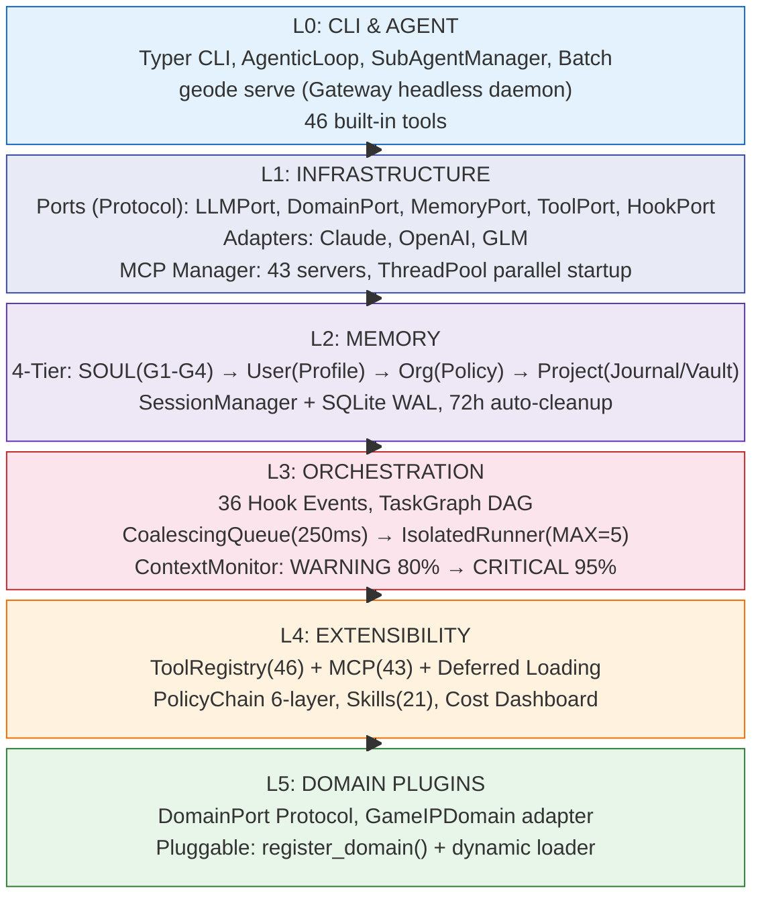

# GEODE 자율 실행 하네스 회고 — 32일, 32 릴리스, 47K LoC의 기록

> Date: 2026-03-26 | Author: rooftopsnow | Tags: geode, inner-harness, retrospective, langgraph, port-adapter, domain-plugin, multi-provider, autonomous-agent

---

## 목차

1. 서론: 이 리포트의 목적
2. 프로젝트 개요
3. 버전 타임라인 — 6개 페이즈
4. 6-Layer 아키텍처의 형성
5. 핵심 설계 결정 10선
6. 정량 지표
7. 해결한 문제와 접근
8. 관측된 교훈 8선
9. 미해결 프론티어
10. 결론

---

## 1. 서론: 이 리포트의 목적

본 리포트는 GEODE의 **내부 하네스(Inner Harness)** — 즉 제품 코드 자체 — 에 대한 회고입니다. 하네스 스캐폴딩(CLAUDE.md, 훅, 스킬, CI/CD)는 별도 리포트(#60)에서 다루었으며, 하네스 랜드스케이프 전체 조망은 #59에서 수행했습니다.

GEODE는 게임 IP 분석 도구로 시작하여 범용 자율 실행 하네스로 전환된 프로젝트입니다. v0.1(2025-03-10)부터 v0.27.1(2026-03-26)까지의 여정을 아키텍처 결정, 정량 지표, 교훈 중심으로 기록합니다.

---

## 2. 프로젝트 개요

| 항목 | 값 |
|------|---|
| 버전 | 0.27.1 |
| Python | >= 3.12 |
| 패키지 매니저 | uv |
| 총 LoC | 47,155 |
| 모듈 | 221 |
| 테스트 | 3,109+ |
| 빌트인 도구 | 46 |
| MCP 서버 | 43 |
| 훅 이벤트 | 36 |
| 커스텀 스킬 | 21 |
| 릴리스 수 | 32 |
| 개발 기간 | 32일 |
| 진입점 | `geode.cli:app` (Typer) |
| 코어 프레임워크 | LangGraph StateGraph |

---

## 3. 버전 타임라인 — 6개 페이즈

```mermaid
timeline
    title GEODE Release Timeline (v0.1 → v0.27.1)
    section Phase 1: Pipeline + 첫 HITL
        v0.1-v0.7 : Game IP StateGraph
                   : 4 Analysts, 3 Evaluators
                   : HITL Phase 1 — 3-tier 안전 게이트 (v0.6)
    section Phase 2: 에이전트 전환
        v0.8-v0.11 : AgenticLoop 도입 (v0.9)
                    : Skill System + MCP 카탈로그 (v0.9)
                    : SubAgent 병렬 + Full Inheritance
                    : Port/Adapter DI
    section Phase 3: 보안 성숙
        v0.12-v0.14 : HITL 6-Level 보안 매트릭스 (v0.12)
                     : WRITE/DANGEROUS auto_approve 무시
                     : Token Guard
                     : LangSmith → 자체 추적 전환
    section Phase 4: 자율 루프 확립
        v0.15-v0.20 : .geode/ Context Hub 5-Layer
                     : Anthropic + OpenAI + ZhipuAI
                     : NL Router 완전 제거 (v0.19)
                     : 6-Layer PolicyChain + 36 Hook
    section Phase 5: 게이트웨이 + 품질
        v0.21-v0.26 : 샌드박스 하드닝 (PolicyChain L1-2)
                     : Slack Gateway + geode serve
                     : MCP 병렬 스타트업 -95s
                     : ToolCallProcessor 추출 -477줄
    section Phase 6: Context Guard
        v0.27-v0.27.1 : Model-switch 컨텍스트 가드
                       : adaptive_prune()
                       : summarize_tool_results()
                       : 3,109+ tests
```

### Phase 1: Game IP 파이프라인 + 첫 HITL (v0.1 – v0.7)

게임 IP 저평가 분석을 위한 LangGraph StateGraph로 시작했습니다. 4명의 애널리스트(Send API 병렬), 3명의 이밸류에이터, 14축 Pydantic 루브릭, PSM 기반 스코어링, 결정 트리 분류가 초기 구현의 전부였습니다. 단일 프로바이더(Claude Opus), 픽스처 기반 테스트로 운영했습니다.

**v0.6 — 첫 HITL 안전 게이트**: SAFE/STANDARD/DANGEROUS 3-tier 도구 분류가 도입되었습니다. `run_bash`만 사용자 승인을 요구하는 최소한의 안전 경계였지만, 이후 자율 실행의 전제 조건이 되었습니다.

### Phase 2: 에이전트 전환 — AgenticLoop · Skills · SubAgent (v0.8 – v0.11)

프로젝트의 가장 큰 **패러다임 전환**이 이 구간에서 일어났습니다.

**v0.8 — Port/Adapter 도입**: 파이프라인 노드가 특정 LLM에 직접 의존하는 문제를 인식하고, Protocol 포트(LLMPort, DomainPort, MemoryPort)를 추출했습니다. NL Router가 단발성 의도 분류기(`classify()` → 하나의 인텐트)로 동작했습니다.

**v0.9 — 에이전트 탄생**: `AgenticLoop`가 도입되어 `while(stop_reason == "tool_use")` 패턴의 자율 루프가 시작되었습니다. NL Router의 역할이 "의사결정자"에서 "의사결정 인프라"로 전환되었습니다. 동시에 **Skill System**이 도입되어 `.claude/skills/*/SKILL.md` 기반 동적 스킬 로딩, `/skills add` 런타임 등록, MCP 서버 카탈로그가 추가되었습니다. 파이프라인이 에이전트가 된 시점입니다.

**v0.10–v0.11 — 병렬 자율성**: SubAgentManager + IsolatedRunner(MAX_CONCURRENT=5) + CoalescingQueue(250ms dedup)로 서브에이전트 병렬 실행이 가능해졌습니다. v0.11에서 서브에이전트가 부모의 전체 AgenticLoop을 상속(Full Inheritance)하면서, 46개 도구 + MCP + Skills + 메모리에 접근하는 재귀적 위임이 가능해졌습니다.

### Phase 3: 보안 성숙 + 인프라 완성 (v0.12 – v0.14)

**v0.12 — HITL 6-Level 매트릭스**: SubAgent의 `auto_approve=True`가 Phase 1의 안전 게이트를 우회하는 문제가 발견되었습니다. 이에 대응하여 도구를 6등급(SAFE · STANDARD · WRITE · EXPENSIVE · DANGEROUS · MCP)으로 재분류하고, WRITE/DANGEROUS 도구는 `auto_approve`를 무시하도록 강제했습니다. 단순 3-tier에서 **서브에이전트 시대에 맞는 세분화된 보안 매트릭스**로 진화한 시점입니다.

같은 구간에서 **LangSmith 의존을 제거하고 자체 추적 시스템으로 전환**했습니다. 3-Layer 비용 추적(Per-Call → Real-time Display → Session Summary), JSONL 기반 UsageStore(월별 로테이션), ProjectJournal(append-only 감사 추적)이 구축되어 외부 SaaS 없이 관측성을 확보했습니다.

v0.14에서 Token Guard(모듈 레벨 컨텍스트 예산)와 멀티 프로바이더 폴백 체인의 기초가 마련되었습니다. 테스트 2,946+개로 래칫이 확립되었습니다.

### Phase 4: 멀티 프로바이더 + 자율 루프 확립 (v0.15 – v0.20)

가장 큰 확장기입니다. `.geode/` 컨텍스트 허브(5-Layer), 3사 LLM 폴백(Anthropic → OpenAI → ZhipuAI), SessionManager + SQLite 체크포인트, ProjectJournal(append-only 감사 추적), Vault(영속 출력 저장소)가 추가되었습니다.

**v0.19 — NL Router 완전 제거**: Phase 2에서 AgenticLoop과 공존하던 NL Router가 완전 삭제되었습니다(1,224줄 레거시 제거). 모든 자유 텍스트가 AgenticLoop으로 직행합니다. v0.9에서 시작된 에이전트 전환이 v0.19에서 **완결**된 것입니다 — 분류기 없이 에이전트가 도구를 자율 선택하는 구조가 확정되었습니다.

v0.20에서 6-Layer PolicyChain과 36 Hook 이벤트가 완성되었습니다.

### Phase 5: 게이트웨이 + 샌드박스 + 품질 (v0.21 – v0.26)

하네스가 외부 세계와 연결되고, 보안이 하드닝되는 구간입니다.

**v0.21–v0.23 — 샌드박스 하드닝**: PolicyChain L1-2 와이어링, SubAgent denied_tools(6개 민감 도구 차단), Bash setrlimit(CPU 30s, FSIZE 50MB), 8패턴 시크릿 리댁션이 구현되었습니다. 인라인 프로바이더 코드를 `AgenticLLMPort` Protocol + 3개 어댑터로 추출했습니다.

**v0.24–v0.26 — 외부 연결 + 품질**: Slack Gateway 양방향 통합, `geode serve` 헤드리스 데몬, MCPServerManager 싱글톤(병렬 스타트업 110s → 15s)이 도입되었습니다. 코드 품질 스프린트로 스레드 안전성(HookSystem/ResultCache/Stats 락 추가), ToolCallProcessor 추출(agentic_loop -477줄), 테스트 격리(SnapshotManager tmp_path 리다이렉트)가 완료되었습니다.

### Phase 6: 모델 전환 가드 (v0.27 – v0.27.1)

Opus(1M) → GLM-5(80K)로 모델 전환 시 컨텍스트 오버플로우가 발생하는 문제에 대응했습니다. 2-Phase 적응형 수축: Phase 1 `summarize_tool_results()`(5% 초과분 요약 교체) + Phase 2 `adaptive_prune()`(토큰 예산 70%, 최신 우선 보존)을 구현했습니다.

### 핵심 분기점 — 5대 전환

| # | 분기점 | 버전 | Before | After | 임팩트 |
|---|--------|------|--------|-------|--------|
| 1 | 첫 HITL 안전 게이트 | v0.6 | 도구 실행에 제한 없음 | 3-tier 안전 분류 | 자율 실행의 전제 조건 확보 |
| 2 | AgenticLoop + Skills | v0.9 | 단발성 의도 분류기 | 자율 도구 선택 루프 + 동적 스킬 | **파이프라인 → 에이전트** |
| 3 | HITL 6-Level 매트릭스 | v0.12 | SubAgent가 안전 게이트 우회 | 도구 등급별 승인 강제 | 서브에이전트 시대의 보안 확립 |
| 4 | NL Router 완전 제거 | v0.19 | 분류기+루프 이중 구조 | AgenticLoop 단일 진입점 | **자율 루프 구조 확정** |
| 5 | 6-Layer PolicyChain | v0.20 | 단일 레벨 정책 | 6-Layer 다층 정책 체인 | 거버넌스 완성 |

---

## 4. 6-Layer 아키텍처의 형성



**레이어 간 의존성 규칙**: 상위 레이어만 하위 레이어를 참조합니다. L5(Domain)는 L0-L4를 모릅니다. L1(Infrastructure)의 Protocol 포트가 레이어 간 계약으로 기능합니다.

**코드 분포**:

| 레이어 | 경로 | 대략적 LoC |
|--------|------|-----------|
| L0 | core/cli/, core/agent/ | ~3,100 |
| L1 | core/infrastructure/ | ~1,300 |
| L2 | core/memory/ | ~3,200 |
| L3 | core/orchestration/ | ~800 |
| L4 | core/tools/ | ~1,200 |
| L5 | core/domains/ | ~1,800 |
| 공통 | core/llm/, core/verification/, etc. | ~1,800 |

---

## 5. 핵심 설계 결정 11선

### D1: Port/Adapter DI (Hexagonal Architecture)

모든 외부 시스템(LLM, MCP, 메모리, 훅)을 Protocol 포트를 통해 접근합니다. 어댑터는 contextvars + 팩토리 함수로 주입됩니다. 파이프라인 노드에 구체 구현의 import가 없습니다.

**효과**: Claude 단일 프로바이더에서 3사 9모델 지원으로의 전환이 어댑터 파일 추가만으로 이루어졌습니다.

### D2: LangGraph StateGraph + Send API

`graph.stream(input)`으로 단계별 진행을 추적합니다 (invoke가 아닌 stream). 각 노드는 자신의 출력 키만 포함한 dict를 반환합니다. Reducer 필드(`analyses`, `errors`)는 `Annotated[list, operator.add]`를 사용합니다.

**효과**: 증분 결과, 중간 검사, 부분 실패 격리가 가능합니다.

### D3: Sub-Agent 토큰 가드

SubAgentManager → CoalescingQueue(250ms dedup) → TaskGraph(DAG) → IsolatedRunner(MAX_CONCURRENT=5). 서브에이전트는 부모 스냅샷을 읽기 전용으로 상속하며, task_id 스코프 버퍼에 기록합니다. 부모는 `summary` 필드만 머지합니다.

**효과**: 15개 서브에이전트까지 컨텍스트 폭발 없이 병렬 실행이 가능합니다. 결과당 최대 8,192 토큰.

### D4: 멀티 프로바이더 폴백 체인

```
Primary:     Anthropic (claude-opus-4-6, 1M ctx)
Fallback 1:  OpenAI (gpt-5.4, 1M ctx)
Fallback 2:  ZhipuAI (glm-5, 80K ctx)
```

프로바이더별 회로 차단기 + 지수 백오프. 모델 ID로 프로바이더를 자동 추론(`_resolve_provider()`). 전체 소진 시 degraded response(is_degraded=True) 반환, 파이프라인은 중단하지 않습니다.

### D5: 6-Layer PolicyChain

```
L1 Profile → L2 Org → L3 Domain → L4 Mode → L5 HITL → L6 Approval
```

도구 실행이 체인 해결을 거칩니다. SubAgent에는 6개 민감 도구(bash, memory_update, delegate 등)가 denied_tools로 차단됩니다. Bash에는 리소스 제한(CPU 30s, FSIZE 50MB, NPROC 64)이 적용됩니다. 8패턴 API 키 자동 마스킹이 작동합니다.

### D6: Domain Plugin (DomainPort Protocol)

파이프라인은 도메인에 무관합니다. `set_domain()` contextvars로 주입합니다. GameIPDomain은 identity, analyst 설정, evaluator 설정, scoring 가중치, decision tree, fixture 경로를 구현합니다.

**효과**: 게임 IP 분석기에서 범용 하네스로의 정체성 전환이 코어 코드 변경 없이 이루어졌습니다.

### D7: 4-Tier 메모리 계층 + 시스템 프롬프트 주입

```
G1: GEODE.md     — 에이전트 정체성
G2: MEMORY.md    — 학습 패턴
G3: LEARNING.md  — 반성, 오류 패턴
G4: Domain       — 도메인 특화 규칙
```

`system_prompt.py`에서 자동 조립되어 모든 LLM 호출에 주입됩니다. SessionManager + SQLite WAL: 세션 체크포인트/복원, 72h 자동 정리. ProjectJournal: append-only 감사 추적.

### D8: 36 Hook 이벤트

Pipeline, Node, Analysis, Verification, Automation, Memory, SubAgent, Tool Recovery, Gateway, MCP, Context 카테고리로 분류된 36개 라이프사이클 이벤트입니다. 이벤트 + 우선순위 기반 핸들러 등록으로 확장합니다.

**효과**: 느슨한 결합, 플러그인 친화, 감사 로깅이 가능합니다.

### D9: Confidence Gate + BiasBuster

이밸류에이터가 (score, confidence) 튜플을 생성합니다. confidence < 0.7이면 SIGNALS로 루프백(최대 5회). BiasBuster가 6종 편향(anchoring, availability, confirmation, herding, groupthink, illusory truth)을 탐지합니다. 교차 LLM 합의에 Krippendorff's α ≥ 0.67을 적용합니다.

### D10: Model-Switch 컨텍스트 가드 (v0.27.1)

`update_model()` 호출 시 컨텍스트 오버플로우를 선제적으로 감지하고 적응합니다. Phase 1: `summarize_tool_results()`로 5% 초과분 요약 교체. Phase 2: `adaptive_prune()`로 토큰 예산 70% 내 유지. `usage_pct`는 상한 없이 실제 포화율을 반영합니다.

**알려진 한계**: 10x 이상 축소(1M → 80K) 시 프루닝만으로 불충분할 수 있으며, 추가 연구가 필요합니다 (ADR-013).

### D11: 자체 추적 시스템 — LangSmith 탈피

LangSmith 트레이싱을 환경 변수 게이트(`LANGCHAIN_TRACING_V2`) 뒤로 후퇴시키고, 자체 3-Layer 추적 스택을 구축했습니다.

```
L1: Per-Call Recording  — get_tracker().record(model, in_tok, out_tok)
L2: Real-time Display   — ✢ claude-opus-4-6 · ↓1.2k ↑350 · $0.0353 · 2.1s
L3: Session Summary     — render_session_cost_summary() + /cost 커맨드
```

영속 계층은 두 축으로 운영됩니다:

- **UsageStore**: `~/.geode/usage/YYYY-MM.jsonl` 월별 로테이션. 모델별·일별·월별 집계 API. `threading.Lock()` + `os.fsync()`로 동시성 안전.
- **ProjectJournal**: `.geode/journal/` 아래 4개 JSONL 파일(runs, costs, errors, learned). Append-only 설계로 불변성 보장. `get_context_summary()`로 시스템 프롬프트에 최근 실행 요약을 주입.

**LangSmith가 남아 있는 곳**: `router.py`의 `maybe_traceable()` 데코레이터가 LangSmith 활성 시 도메인/검증 레이어에 스팬을 발행합니다. 비활성 시 passthrough이므로 런타임 비용 0.

**효과**: 외부 SaaS 의존 없이 비용 추적, 감사 추적, 컨텍스트 모니터링이 자립합니다. LangSmith 429 rate-limit 스팸도 해소되었습니다.

---

## 6. 정량 지표

### 6.1 릴리스 추이

| 페이즈 | 버전 | 핵심 전환 | 기간 | 테스트 | 모듈 | 프로바이더 |
|--------|------|----------|------|--------|------|-----------|
| 1 | v0.1-v0.7 | 첫 HITL (v0.6) | 2일 | ~750 | ~50 | 1 |
| 2 | v0.8-v0.11 | AgenticLoop · Skills · SubAgent | 3일 | ~1,800 | ~120 | 1 |
| 3 | v0.12-v0.14 | HITL 6-Level 매트릭스 | 2일 | 2,946 | 184 | 1 |
| 4 | v0.15-v0.20 | NL Router 제거 · 3사 폴백 | 4일 | 3,058 | 184 | 3 |
| 5 | v0.21-v0.26 | Gateway · 샌드박스 | 7일 | 3,109 | 221 | 3 |
| 6 | v0.27-v0.27.1 | 컨텍스트 가드 | 1일 | 3,109+ | 221 | 3 |

### 6.2 성능 개선

| 지표 | Before | After | 개선 |
|------|--------|-------|------|
| MCP 서버 스타트업 | ~110s (순차) | ~15s (병렬) | -86% |
| REPL 초기화 | ~10s | ~2s (lazy MCP) | -80% |
| Opus→GLM 전환 시 컨텍스트 사용률 | 240% (오버플로우) | <95% (adaptive prune) | 안전 전환 |
| AgenticLoop 코드량 | ~1,500줄 | ~1,032줄 (ToolCallProcessor 추출) | -31% |

### 6.3 기술 스택

| 컴포넌트 | 도구 | 역할 |
|----------|------|------|
| CLI | Typer 0.15+ | 명령 디스패치, TUI |
| LLM 프레임워크 | LangGraph 1.1+ | StateGraph, 체크포인팅 |
| LLM 클라이언트 | anthropic 0.84+, openai 2.0+, httpx(GLM) | 멀티 프로바이더 |
| 데이터 | Pydantic 2.10+ | 타입 안전 I/O |
| 스토리지 | sqlite3 (stdlib, WAL) | 세션 관리, 감사 추적 |
| UI | rich 14.0+ | 프로그레스 바, 마크다운 |
| 테스트 | pytest 9.0+, pytest-cov | 3,109+ 테스트 |
| 린팅 | ruff 0.15+, mypy 1.19+, bandit 1.8+ | 품질 게이트 |

---

## 7. 해결한 문제와 접근

### P1: 도메인 특화 → 범용 전환

**문제**: 게임 IP 분석 전용 파이프라인에서 범용 에이전트로 전환해야 했습니다.

**접근**: DomainPort Protocol 도입. IP 특화 로직(애널리스트, 이밸류에이터, 스코어링)을 교체 가능한 플러그인으로 래핑했습니다. 파이프라인 노드가 `get_domain().get_analyst_types()`를 호출하므로, 도메인 교체 시 코어 코드를 수정할 필요가 없습니다.

### P2: LLM 컨텍스트 오버플로우

**문제**: 멀티 모델 폴백에서 큰 모델(1M) → 작은 모델(80K) 전환 시 컨텍스트가 넘쳤습니다.

**접근**: 다층 방어 구현. (1) 모델별 동적 tool_result max_chars 계산. (2) 토큰 예산 + CRITICAL 트리거(95%) → adaptive_prune(). (3) Phase 1 summarize_tool_results() + Phase 2 adaptive_prune(70% 예산).

### P3: 서브에이전트 메모리 폭발

**문제**: 병렬 서브에이전트가 부모 컨텍스트에 전체 결과를 쓰면 토큰이 폭발했습니다.

**접근**: Task-scoped 버퍼 격리. 서브에이전트는 task_id 네임스페이스에 기록하고, 부모는 summary만 머지합니다. 결과당 8,192 토큰 상한으로 15개 서브에이전트까지 안전하게 스케일링됩니다.

### P4: 멀티 프로바이더 복잡성

**문제**: 프로바이더별 메시지 포맷, 에러 처리, 스트리밍 방식이 모두 달랐습니다.

**접근**: `AgenticLLMPort` Protocol + 3개 어댑터(Claude/OpenAI/GLM). 프로바이더 추가가 어댑터 파일 1개로 귀결됩니다.

### P5: 플레이키 테스트

**문제**: SnapshotManager, MCP 초기화가 테스트 간 상태 오염을 일으켰습니다.

**접근**: conftest에서 `.geode/`를 tmp_path로 리다이렉트. ContextVar 설정 모킹. MCP ThreadPoolExecutor 병렬 스타트업. 결과: 3,109 테스트, CI에서 flake 0건.

---

## 8. 관측된 교훈 8선

### L1: Port/Adapter는 스케일링된다

단일 프로바이더(Opus)에서 3사 9모델로의 확장이 Protocol 경계 덕분에 어댑터 파일 추가만으로 이루어졌습니다. 10파일 리팩토링이 아닌 1파일 추가로 귀결된 것은 초기 추상화 비용이 후기에 회수되었음을 보여줍니다.

### L2: 도메인 플러그인은 일반성을 부여한다

DomainPort 추상화로 동일 코드가 다른 도메인을 서빙할 수 있게 되었습니다. 도메인 로직을 플러그인으로 밀어내는 결정은 가능한 한 이른 시점에 하는 것이 유리합니다.

### L3: 래칫이 영웅적 노력을 대체한다

lint/type/test all-or-nothing 정책이 침묵 속 파손을 방지했습니다. 32일간 32 릴리스에서 회귀 0건. 제약(CANNOT)이 가이드라인보다 품질 보장에 효과적이었습니다.

### L4: 토큰 가드는 경계에서 강제해야 한다

summary 필드 필수 보존 없이는 병렬 서브에이전트의 컨텍스트 폭발을 막을 수 없었습니다. 요청이 아닌 강제가 필요한 지점입니다.

### L5: 이벤트 드리븐이 확장 가능하다

36개 훅 이벤트가 플러그인(스킬, 자동화, 모니터링)에 깨끗한 삽입점을 제공합니다. 모놀리식 if-statement 분기 대비 느슨한 결합이 유지됩니다.

### L6: 단일 프로바이더는 취약성이다

3-체인 폴백(Anthropic → OpenAI → GLM)이 프로바이더 장애, 비용 최적화, 모델 EOL에 대응합니다. 단일 프로바이더 의존은 프로덕션에서 리스크입니다.

### L7: 메모리 계층이 자율성을 가능하게 한다

4-Tier(SOUL → User → Org → Project → Session) + 시스템 프롬프트 주입으로 에이전트가 세션 간 패턴을 기억합니다. Vault(출력 저장) + Journal(감사 추적)이 지속적 학습을 가능하게 합니다. 영속 메모리가 상태 없는 챗봇과 에이전트를 구분하는 요소입니다.

### L8: 워크플로우 규율이 아키텍처를 보호한다

코드 품질도 중요하지만, 워크플로우 규율이 더 심각한 문제를 방지합니다. main-only progress.md, 기능 구현에 Plan 필수, PR에 CHANGELOG 필수, CI가 머지를 게이트. 프로세스가 아키텍처를 강제합니다.

---

## 9. 미해결 프론티어

### 9.1 현재 백로그 (progress.md)

| 태스크 | 우선순위 | 설명 |
|--------|---------|------|
| action-summary | P1 | 결정론적 Tier1 + 선택적 LLM 내러티브 Tier2 |
| portfolio-carousel | P1 | REPL 유스케이스 쇼케이스 |
| graph-partial-state | P2 | 재시도 전 상태 스냅샷 (Karpathy P2) |
| e2e-phase6 | P2 | Live LLM 테스트 (서브에이전트, 스케줄러, 모델 전환, 세션 복원) |

### 9.2 아키텍처 GAP

| GAP | 설명 | 패턴 참조 |
|-----|------|----------|
| atomic-write | 모든 상태 파일에 tmp+rename 적용 | OpenClaw 패턴 |
| webhook | HTTP Webhook 엔드포인트 풀 구현 | 원격 트리거용 |
| model-switch >10x | 1M → 80K 이상 축소 시 프루닝 불충분 | ADR-013 오픈 |

### 9.3 하네스 스캐폴딩 미활용 영역

하네스 스캐폴딩 리포트(#60)에서 관측된 바와 같이, Claude Code 21개 훅 이벤트 중 1개(Stop)만 사용 중입니다. `PreToolUse`(블로킹), `PostToolUse`(자동 검증), `PreCompact`(컨텍스트 보존) 등이 활용 가능한 확장 경로입니다.

---

## 10. 결론

GEODE는 32일간 32 릴리스를 거치며 다음의 구조를 갖춘 자율 실행 하네스로 성장했습니다:

1. **원칙적 아키텍처**: Port/Adapter DI, 6-Layer 분리, 도메인 플러그인, 훅 확장성
2. **멀티 프로바이더 회복력**: 3-체인 폴백 + 회로 차단기, 프로바이더 장애 대응
3. **스케일의 안전성**: 6-Layer PolicyChain, 시크릿 리댁션, Bash 샌드박싱, CANNOT 래칫
4. **영속적 자율성**: 4-Tier 메모리 + Vault + Journal → 패턴 학습, 감사 가능한 실행
5. **빠른 반복**: 32 릴리스 / 32일, 회귀 0건, 3,109 테스트

이 프로젝트의 여정은 하나의 구조적 궤적을 보여줍니다:

```
도메인 특화 → 범용
단발성 분류기 → 자율 루프
단일 프로바이더 → 멀티 프로바이더
모놀리식 → 컴포저블
상태 없음 → 상태 있음
파이프라인 → 하네스
```

47K LoC, 221 모듈, 3,109 테스트 위에 서 있는 이 하네스는, 동시에 5,050줄의 하네스 스캐폴딩(#60)와 프론티어 랜드스케이프(#59)의 좌표 위에 위치합니다. 내부와 외부, 제품과 생산 도구가 하나의 3중 하네스 구조로 작동해온 32일의 기록입니다.

---

### 참고 문헌

- CHANGELOG.md — 전체 버전 히스토리 (v0.1 – v0.27.1)
- CLAUDE.md — 아키텍처 개요, 컨벤션
- docs/progress.md — 칸반 보드, 지표, GAP 레지스트리
- docs/architecture/ — 레이어 계획, ADR, 오케스트레이션 설계
- pyproject.toml — 의존성, 버전
- #59: 에이전트 하네스 랜드스케이프 회고 (2026-03)
- #60: Scaffolding: Harness Configuration Points — GEODE의 Claude Code 구성 레이어 실측

---

*Source: `blog/posts/harness-frontier/61-geode-inner-harness-retrospective-march-2026.md` | Category: [[blog-harness-frontier]]*

## Related

- [[blog-harness-frontier]]
- [[blog-hub]]
- [[geode]]
