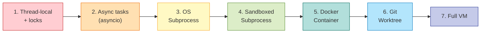

# 서브에이전트 병렬화의 실제 — 프로세스, 스레드, 이벤트 루프의 선택

> Date: 2026-03-26 | Author: rooftopsnow | Tags: sub-agent, parallelism, process, thread, concurrency, claude-code, codex-cli, openclaw, devin, langgraph, harness-engineering

---

## 목차

1. 서론: 왜 병렬화 모델이 중요한가
2. 프론티어 하네스별 실측
3. 격리 스펙트럼 — 7단계
4. IPC 패턴 비교
5. 종합 비교 매트릭스
6. 관측된 아키텍처 원칙 4선
7. GEODE의 현재 위치와 확장 경로

---

## 1. 서론: 왜 병렬화 모델이 중요한가

서브에이전트를 병렬로 실행할 때 **프로세스로 뺄 것인가, 스레드로 뺄 것인가**는 단순한 성능 문제가 아닙니다. 이 선택이 결정하는 것은 격리 수준, 장애 전파 범위, 보안 경계, 디버깅 가시성입니다.

2026년 3월 기준 프론티어 하네스들의 선택은 명확한 패턴을 보입니다. 본 리포트에서 Claude Code, Codex CLI, OpenClaw, Devin, Manus, GitHub Copilot Squad, LangGraph, SWE-Agent, Augment Code의 실제 구현을 조사했습니다.

---

## 2. 프론티어 하네스별 실측

### 2.1 Claude Code (Anthropic)

| 항목 | 실측 |
|------|------|
| **동시성 모델** | OS 서브프로세스 (`child_process.spawn()`) |
| **언어/런타임** | TypeScript / Node.js (단일 스레드 이벤트 루프) |
| **마스터 루프** | 단일 스레드 (Node.js async/await) |
| **서브에이전트 스폰** | 새 `claude` CLI 프로세스를 spawn |
| **최대 동시성** | 10 (Agent Teams) |

**Agent Teams 아키텍처**: 리드 에이전트가 `Task` 도구로 팀원을 스폰합니다. 각 팀원은 독립 OS 프로세스이며, 스폰 백엔드로 in-process, tmux split-pane, iTerm2 split-pane 세 가지를 지원합니다.

**격리**: Git worktree(`.claude/worktrees/<name>/`)로 파일시스템을 격리합니다. 모든 워크트리가 동일 `.git` 오브젝트 DB를 공유하므로 리포지토리 복제는 발생하지 않습니다.

**IPC**: **파일 기반 JSON 메일박스**입니다. 각 에이전트가 `~/.claude/teams/{team-name}/inboxes/{agent-name}.json`에 인박스를 가집니다. 송신자가 수신자의 인박스 파일에 JSON 엔트리를 append하고, 수신자가 폴링합니다. `flock()`으로 원자적 클레이밍을 수행합니다. 백그라운드 데몬 프로세스가 없으며, 공유 파일 접근에서 조정이 발생합니다.

**대규모 검증 사례**: C 컴파일러 프로젝트에서 16개의 병렬 Claude가 10만 줄 Rust 컴파일러를 구축했습니다. 각 Claude는 자체 **Docker 컨테이너**에서 실행되었으며, `current_tasks/` 디렉토리의 락 파일로 조정했습니다.

### 2.2 Codex CLI (OpenAI)

| 항목 | 실측 |
|------|------|
| **동시성 모델** | Tokio async 런타임 + OS 서브프로세스 (도구 실행) |
| **언어/런타임** | Rust (v0.106.0, 2026-02 리라이트) |
| **마스터 루프** | Tokio 8 워커 스레드 (async executor) |
| **서브에이전트 스폰** | 동일 프로세스 내 CodexThread (논리적 스레드) |
| **최대 동시성** | 6 (agents.max_threads 기본값) |

**아키텍처 3계층**: ThreadManager → CodexThread → Session. "Thread"는 OS 스레드가 아닌 **대화 스레드**(논리적)를 의미합니다. ThreadManager가 동일 Tokio async 런타임 내에서 여러 대화 스레드를 관리합니다.

**격리**: 도구 실행(셸 명령)은 **샌드박스된 서브프로세스**에서 실행됩니다.
- Linux: `codex-linux-sandbox` 바이너리 → Landlock(파일시스템) + seccomp(시스콜 필터링)
- macOS: Apple Seatbelt
- Windows: Restricted Tokens

샌드박스 정책이 직렬화되어 자식 프로세스에 전달됩니다. 제한은 자식에만 적용되며 부모 Codex 프로세스에는 미적용됩니다.

**IPC**: Tokio async 채널 + 이벤트 리스너 패턴. 논리적 스레드가 동일 프로세스 내에 있으므로 인메모리 통신이 가능합니다. `Op::UserTurn`, `Op::Compact`, `Op::SteerInput` 등의 enum으로 오퍼레이션을 제출합니다.

### 2.3 OpenClaw

| 항목 | 실측 |
|------|------|
| **동시성 모델** | 단일 Node.js 프로세스, Promises (스레드 없음) |
| **언어/런타임** | TypeScript / Node.js |
| **마스터 루프** | 단일 이벤트 루프 |
| **서브에이전트 스폰** | Lane Queue 내 태스크 |
| **최대 동시성** | main 4, subagent 8 (Lane 설정) |

**Lane Queue**: 레인별 FIFO 큐로 **기본 직렬 실행**을 강제합니다. 세션 키(`lane session:<key>`)로 세션당 하나의 활성 실행만 보장합니다. 병렬은 명시적으로 마킹된 저위험 태스크에만 허용됩니다.

**설계 철학**: 병렬성보다 **신뢰성**을 우선합니다. 단일 프로세스 모델이 공유 상태 버그, 레이스 컨디션, IPC 오버헤드를 모두 제거합니다. 외부 CLI 도구(Claude Code 포함)를 오케스트레이션하는 시스템에서 병목은 API 레이턴시이지 CPU가 아니므로, Node.js 단일 스레드 async 모델이 자연스러운 선택입니다.

### 2.4 Devin (Cognition)

| 항목 | 실측 |
|------|------|
| **동시성 모델** | 격리된 가상 머신 (클라우드 VM) |
| **격리** | 전체 VM 격리 |
| **서브에이전트 스폰** | API 통해 별도 VM에 태스크 위임 |
| **최대 동시성** | 제한 없음 (과금 기반) |

각 세션이 자체 VM에서 실행됩니다. bash 프롬프트, VS Code 스타일 에디터, Chrome 브라우저 인스턴스가 포함된 "클라우드 랩톱"입니다. 메인 Devin 세션이 코디네이터 역할을 하며, 서브 태스크를 자식 세션(별도 VM)에 디스패치합니다.

### 2.5 Manus AI (Meta)

| 항목 | 실측 |
|------|------|
| **동시성 모델** | 격리된 클라우드 VM |
| **격리** | 태스크당 VM |
| **내부 구조** | Planner, Execution, Verification 서브에이전트 (VM 내) |

Devin과 유사한 모델입니다. Manus Sandbox(2026-01)가 각 태스크에 전용 Linux 환경을 프로비저닝합니다.

### 2.6 GitHub Copilot Squad

| 항목 | 실측 |
|------|------|
| **동시성 모델** | 다중 에이전트 프로세스 + 클라우드 러너 |
| **격리** | `.squad/` 디렉토리 (리포지토리 네이티브) |
| **IPC** | 파일 기반 (decisions.md, .squad/ 파일) |

코디네이터 + 전문가(리드, 프론트엔드, 백엔드, 테스터)를 스폰합니다. 각 전문가가 자체 컨텍스트 윈도우를 가지며, `.squad/` 내 마크다운 파일이 팀의 공유 브레인으로 기능합니다.

### 2.7 LangGraph

| 항목 | 실측 |
|------|------|
| **동시성 모델** | asyncio supersteps (Python async) |
| **격리** | Send별 상태 스코핑 |
| **IPC** | State graph reducers |
| **최대 동시성** | `max_concurrency` 파라미터로 설정 |

Google Pregel에서 영감을 받은 **superstep** 모델입니다. 단일 노드에서 여러 목적지로의 엣지가 자동 fan-out을 생성합니다. 모든 노드가 동시에 실행되고, 전부 완료되어야 다음 superstep으로 진행합니다 (barrier synchronization). 내부적으로 `asyncio.gather()`를 사용합니다.

### 2.8 SWE-Agent / SWE-ReX

| 항목 | 실측 |
|------|------|
| **동시성 모델** | `subprocess.run()` + Docker exec (무상태) |
| **격리** | Docker 컨테이너 또는 로컬 서브프로세스 |
| **IPC** | 무상태 (IPC 없음) |

Mini-SWE-Agent가 `subprocess.run()`으로 **무상태 bash 실행**을 수행합니다. 각 명령이 독립적으로 실행되어 영속적 셸 세션이 없습니다. `subprocess.run`을 `docker exec`로 교체하는 것만으로 샌드박싱이 가능합니다.

### 2.9 Augment Code (Intent)

| 항목 | 실측 |
|------|------|
| **동시성 모델** | Kubernetes 파드 + multiprocessing |
| **격리** | 에이전트당 Git worktree |
| **최대 동시성** | 80 (SWE-bench 평가 모드: 10 샤드 × 8 프로세스) |

OS 레벨 프로세스 병렬성입니다. 각 Implementor 에이전트가 격리된 git worktree에서 실행됩니다. 충돌은 실행 중이 아닌 의도적 머지 포인트에서 해결합니다.

---

## 3. 격리 스펙트럼 — 7단계

약한 격리에서 강한 격리 순으로 정리합니다:

| 단계 | 격리 수준 | 장애 전파 | 보안 경계 | 대표 사례 |
|------|---------|---------|---------|----------|
| 1. Thread-local + locks | 메모리 공유 | 크래시 시 전체 프로세스 종료 | 없음 | **GEODE** (현재) |
| 2. Async tasks | 단일 프로세스 내 협력적 | 예외 전파 | 없음 | **LangGraph** supersteps |
| 3. OS Subprocess | 별도 메모리 공간 | 격리됨 | 프로세스 경계 | **Claude Code** 서브에이전트 |
| 4. Sandboxed Subprocess | 파일시스템 + 시스콜 제한 | 격리됨 | 커널 레벨 | **Codex CLI** 도구 실행 |
| 5. Docker Container | 네임스페이스 + cgroup | 격리됨 | 컨테이너 경계 | **SWE-Agent**, Claude C 컴파일러 |
| 6. Git Worktree | 코드 변경 격리 | 파일시스템 격리 | 브랜치 경계 | **Claude Code** Agent Teams, **Augment** |
| 7. Full VM | 완전한 하드웨어 격리 | 완전 격리 | VM 경계 | **Devin**, **Manus** |

**관측**: 프로덕션 시스템은 여러 단계를 **조합**합니다. Codex CLI는 LLM 호출에 async(2단계) + 도구 실행에 sandboxed subprocess(4단계)를 사용합니다. Claude Code는 에이전트에 subprocess(3단계) + 코드 격리에 worktree(6단계)를 사용합니다.

---

## 4. IPC 패턴 비교

| 패턴 | 사용 하네스 | 장점 | 단점 |
|------|-----------|------|------|
| **파일 기반 JSON 메일박스** | Claude Code, GitHub Squad | 디버깅 용이 (`cat`으로 확인), 크래시 내성, Git 추적 가능 | 폴링 오버헤드, 레이턴시 |
| **인메모리 async 채널** | Codex CLI (Tokio), LangGraph (asyncio) | 저레이턴시, 타입 안전 | 크래시 시 소실, 프로세스 경계 불가 |
| **인프로세스 Promises** | OpenClaw | 오버헤드 제로, 단순 | 확장성 제한, 단일 프로세스 종속 |
| **API 오케스트레이션** | Devin, Manus | 완전 격리, 무제한 스케일링 | 높은 레이턴시, 인프라 비용 |
| **무상태 (IPC 없음)** | SWE-Agent | 최대 단순성, 완벽한 격리 | 상태 공유 불가 |
| **Git 머지 포인트** | Augment Code | 자연스러운 충돌 해결 | 머지 컨플릭트 가능성 |

**파일 기반 IPC가 지배적입니다.** 직관에 반하지만 에이전트 오케스트레이션에서 파일 IPC가 선호되는 이유:
- 에이전트 간 통신 빈도가 낮습니다 (턴당 1회, 밀리초 레이턴시 불필요)
- `cat inbox.json`으로 즉시 디버깅이 가능합니다
- 프로세스 크래시에도 메시지가 보존됩니다
- Git으로 의사결정 히스토리를 추적할 수 있습니다

---

## 5. 종합 비교 매트릭스

| 하네스 | 동시성 모델 | 격리 단계 | IPC | 최대 동시성 | 언어 |
|--------|-----------|---------|-----|-----------|------|
| **Claude Code** | OS 서브프로세스 | 3+6 (프로세스+워크트리) | 파일 JSON 메일박스 | 10 | TS/Node.js |
| **Codex CLI** | Tokio async + 서브프로세스(도구) | 2+4 (async+샌드박스) | 인메모리 async 채널 | 6 | Rust |
| **OpenClaw** | 단일 프로세스 이벤트 루프 | Lane Queue 직렬화 | 인프로세스 Promises | main 4 / sub 8 | TS/Node.js |
| **Devin** | 격리 VM | 7 (Full VM) | API 오케스트레이션 | 무제한 (과금) | 독점 |
| **Manus** | 격리 VM | 7 (Full VM) | API 오케스트레이션 | 무제한 (과금) | 독점 |
| **GitHub Squad** | 다중 프로세스 | 3+파일 | 파일 마크다운 | 다수 | 다양 |
| **LangGraph** | asyncio supersteps | 2 (상태 스코핑) | State graph reducers | 설정 가능 | Python |
| **SWE-Agent** | subprocess/docker | 3-5 | 무상태 | 대규모 병렬 | Python |
| **Augment** | K8s + multiprocessing | 3+6 (프로세스+워크트리) | Git 머지 포인트 | 80 | Python |
| **GEODE** | threading.Thread | 1 (thread-local+locks) | 스레드 안전 dict | 5 | Python |

---

## 6. 관측된 아키텍처 원칙 4선

### 원칙 1: 에이전트 병렬화에서 프로세스가 스레드를 대체합니다

조사한 모든 프로덕션 시스템이 **OS 프로세스**(또는 더 강한 격리: VM)를 사용합니다. 이유:

1. **진정한 격리**: 프로세스는 별도 메모리 공간을 가집니다. 한 에이전트의 크래시가 다른 에이전트를 오염시키지 않습니다.
2. **컨텍스트 윈도우 독립**: 각 에이전트 프로세스가 자체 LLM 대화 상태를 보유합니다.
3. **보안 경계**: 샌드박싱(Landlock, seccomp, Seatbelt)이 프로세스 레벨에서 작동합니다.
4. **GIL 무관**: Python에서 GIL은 스레드의 CPU 병렬성을 차단하지만, 별도 프로세스에서는 무관합니다. Node.js에서는 전통적 스레드 자체가 부재합니다. Rust(Codex)에서는 GIL이 없지만, 도구 실행에는 여전히 프로세스 격리를 사용합니다.

### 원칙 2: 마스터 루프는 단일 스레드입니다

모든 시스템에서 **오케스트레이터/코디네이터 루프**는 단일 스레드입니다:

| 하네스 | 마스터 루프 |
|--------|-----------|
| Claude Code | Node.js 이벤트 루프 |
| Codex CLI | Tokio async 런타임 (세션당 논리적 단일 스레드) |
| OpenClaw | 단일 Node.js 프로세스 |
| LangGraph | Python asyncio 이벤트 루프 |

에이전트 루프는 본질적으로 순차적입니다 (LLM 호출 → 응답 → 도구 실행 → 관측 → 반복). 병렬성은 에이전트 **내부**가 아닌 에이전트 **간**에 존재합니다.

### 원칙 3: 파일 기반 IPC가 에이전트 조정에서 지배적입니다

Claude Code, GitHub Squad, OpenClaw 모두 파일 기반 조정을 사용합니다. 메시지 큐, gRPC, 공유 메모리 대신 파일을 선택한 것은 에이전트 오케스트레이션의 고유한 특성 때문입니다: 통신 빈도가 낮고, 디버깅 가시성과 크래시 내성이 레이턴시보다 중요합니다.

### 원칙 4: 격리 단계를 조합합니다

단일 격리 메커니즘만 사용하는 시스템은 없습니다. 프로덕션 시스템은 태스크 유형에 따라 격리 수준을 달리합니다:

| 태스크 유형 | 적절한 격리 | 이유 |
|-----------|-----------|------|
| LLM API 호출 | Async (2단계) | I/O 바운드, 격리 불필요 |
| 도구 실행 (셸) | Sandboxed subprocess (4단계) | 임의 코드 실행 보안 |
| 코드 변경 | Git worktree (6단계) | 파일시스템 충돌 방지 |
| 전체 에이전트 세션 | OS subprocess (3단계) | 크래시 격리 + 컨텍스트 독립 |

---

## 7. GEODE의 현재 위치와 확장 경로

### 현재 구현

GEODE는 `threading.Thread`를 사용합니다 (`core/agent/sub_agent.py`의 `IsolatedRunner`).

| 항목 | 현재 값 |
|------|--------|
| 동시성 모델 | `threading.Thread` |
| 격리 단계 | 1 (thread-local + locks) |
| 동시성 제한 | `threading.Semaphore(MAX_CONCURRENT=5)` |
| 공유 상태 보호 | `threading.Lock` (`_results`, `_active`, `_cancel_flags`) |
| IPC | 스레드 안전 dict + `_announce_queue` |

이 모델이 **현재 작동하는 이유**: 서브에이전트 작업이 I/O 바운드(LLM API 호출)이므로 GIL을 릴리스합니다. CPU 바운드 작업이 없어 스레드 병렬성으로 충분합니다.

### 프론티어 대비 GAP

| 차원 | GEODE (현재) | 프론티어 |
|------|------------|---------|
| 크래시 격리 | 서브에이전트 크래시 → 전체 프로세스 영향 가능 | 프로세스 격리로 완전 차단 |
| 보안 경계 | PolicyChain (소프트웨어 레벨) | 커널 레벨 샌드박싱 (Landlock/seccomp) |
| 코드 격리 | 없음 (동일 파일시스템) | Git worktree 격리 |
| 디버깅 | 스레드 내 로그 | 파일 기반 메일박스 (`cat`으로 확인) |

### 관측되는 확장 경로

| 단계 | 변경 | 효과 |
|------|------|------|
| **유지** | 현재 threading 모델 | 경량 서브에이전트(I/O 바운드)에 충분 |
| **1단계** | `subprocess` + 파일 기반 IPC | 크래시 격리 + 디버깅 가시성 확보 |
| **2단계** | Git worktree 격리 추가 | 병렬 코드 변경 시 파일 충돌 방지 |
| **3단계** | OS 레벨 샌드박싱 | `run_bash` 도구의 보안 경계 강화 |

Python 3.13의 선택적 GIL 제거(free-threaded 모드)는 이론적으로 CPU 바운드 에이전트 작업에 도움이 되지만, 에이전트 병렬성이 I/O 바운드인 현 상황에서는 실질적 영향이 제한적입니다.

---

### 참고 문헌

- Anthropic, "Claude Code Sub-Agents Documentation" (2026)
- Anthropic, "Building a C Compiler with a Team of Parallel Claudes" (2026)
- dev.to, "Reverse-Engineering Claude Code Agent Teams: Architecture and Protocol" (2026)
- claudefa.st, "Claude Code Worktree Isolation Guide" (2026)
- OpenAI, "Codex CLI Subagents" (2026)
- OpenAI, "Unlocking the Codex Harness: How We Built the App Server" (2026)
- DeepWiki, "Codex Sandboxing Implementation" (2026)
- DeepWiki, "Codex Thread and Turn Management API" (2026)
- Pierce Freeman, "A Deep Dive on Agent Sandboxes" (2026)
- InfoQ, "Another Rust Rewrite: Codex CLI Goes Native" (2026)
- TheAgentStack, "OpenClaw Architecture Part 1: Control Plane, Sessions, and Event Loop" (2026)
- Medium, "OpenClaw's Working Mechanism: Message Concurrency and Session Boundaries" (2026)
- OpenClaw, "Command Queue Documentation" (2026)
- Medium, "Agent-Native Development: A Deep Dive into Devin 2.0's Technical Design" (2026)
- Manus, "Context Engineering for AI Agents: Lessons from Building Manus" (2026)
- GitHub Blog, "How Squad Runs Coordinated AI Agents Inside Your Repository" (2026)
- Substack, "Scaling LangGraph Agents: Parallelization" (2026)
- dev.to, "Leveraging LangGraph's Send API for Dynamic and Parallel Workflow Execution" (2026)
- GitHub, "SWE-ReX: Sandboxed Code Execution" (2026)
- GitHub, "Augment SWE-bench Agent" (2026)
- Augment Code, "How to Run a Multi-Agent Coding Workspace" (2026)

---

*Source: `blog/posts/harness-frontier/62-subagent-parallelism-process-vs-thread.md` | Category: [[blog-harness-frontier]]*

## Related

- [[blog-harness-frontier]]
- [[blog-hub]]
- [[geode]]
