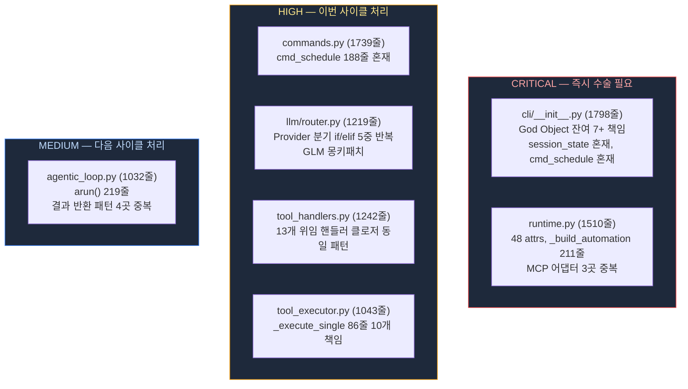
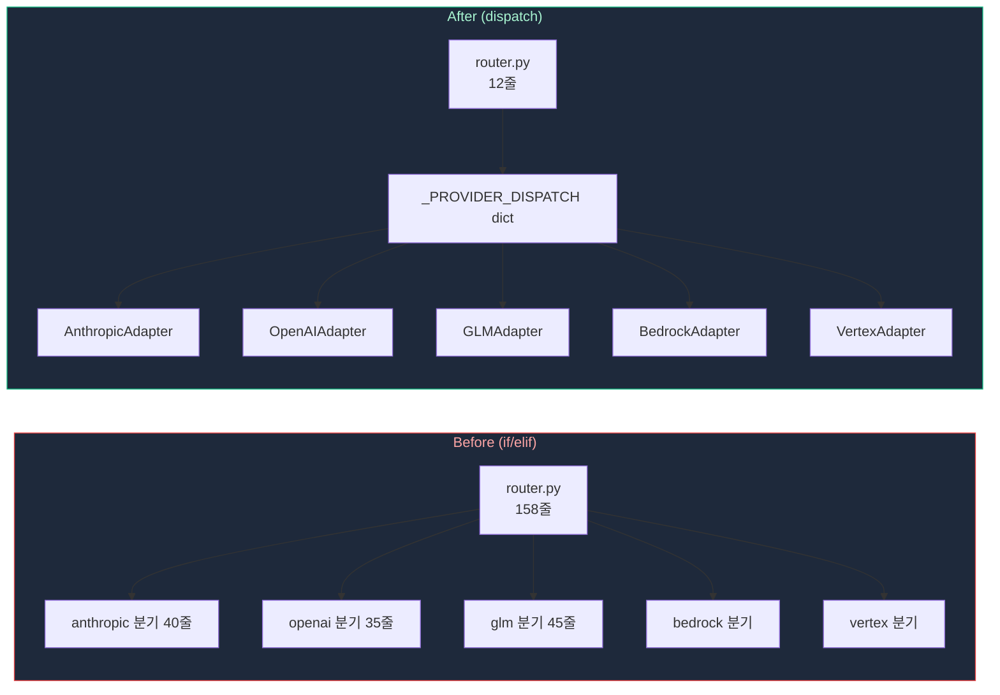
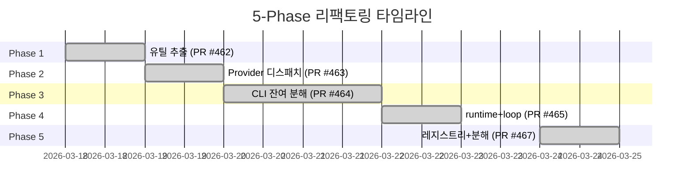

# Kent Beck Simple Design으로 에이전트 코드베이스를 수술하다 — 5-Phase 리팩토링 기록

> God Object 하나를 분해했더니 나머지 여섯 개가 보였습니다.
> 이 글은 7개 파일 48K줄에 숨어있던 Kent Beck Simple Design 위반을 5개 Phase로 제거하고,
> 835줄을 절감하며 전체 테스트 3,224개를 유지한 과정을 기록합니다.

> Date: 2026-03-26 | Author: geode-team | Tags: refactoring, kent-beck, simple-design, dry, srp, python, clean-architecture

---

## 목차

1. 도입: God Object 한 개를 잡으면 여섯 개가 나온다
2. 감사(Audit) 결과: 7개 파일 위반 지도
3. Kent Beck Simple Design 4규칙과 소크라틱 게이트
4. Phase 1 — 유틸 추출: dry-run 5곳을 1곳으로 (PR #462)
5. Phase 2 — Provider 디스패치 딕셔너리: if/elif 5중 분기 제거 (PR #463)
6. Phase 3 — CLI God Object 잔여 분해: session_state + cmd_schedule 추출 (PR #464)
7. Phase 4 — runtime + agentic_loop 추출: 3개 extract 메서드 (PR #465)
8. Phase 5 — 핸들러 레지스트리 + Executor 분해 (PR #467)
9. 최종 수치와 교훈

---

## 1. 도입: God Object 한 개를 잡으면 여섯 개가 나온다

[이전 포스트](https://rooftopsnow.tistory.com/346)에서 `core/cli/__init__.py`의 2,554줄 God Object를 분해하고 3,991줄을 삭제했습니다. 44개 도구 핸들러를 `tool_handlers.py`로 단일 소스화하고, 마지막 체크리스트 항목에는 이렇게 남겨뒀습니다.

```
- [ ] serve-repl-unify — Backlog P0
```

그런데 감사(Audit)를 돌리자 곧바로 보였습니다. `__init__.py`를 분해하면서 **7개 파일에 동일한 문제가 남아있었습니다.** 총 48K줄. God Object 분해가 끝난 것이 아니라 막 시작된 것이었습니다.

이 글은 그 후속 기록입니다. 5개 Phase, 5개 PR, 835줄 절감. 전체 테스트는 3,224개로 불변입니다.

---

## 2. 감사(Audit) 결과: 7개 파일 위반 지도

감사는 Kent Beck Simple Design 4규칙 기준으로 파일별 위반 심각도를 분류했습니다.



> 감사 결과를 보면 "이미 분해한" God Object가 실제로는 **위반을 다른 파일들로 분산시켰을 뿐**임을 알 수 있습니다.
> `tool_handlers.py`는 이전 포스트에서 단일 소스화의 목적지였는데, 막상 모아놓고 보니 13개 클로저가 동일 패턴을 반복하고 있었습니다.

| Severity | 파일 | 줄 수 | 핵심 위반 |
|----------|------|------|----------|
| CRITICAL | `cli/__init__.py` | 1798 | God Object 잔여 7+ 책임, session_state 혼재 |
| CRITICAL | `runtime.py` | 1510 | 48 attrs, `_build_automation` 211줄, MCP 어댑터 3곳 중복 |
| HIGH | `commands.py` | 1739 | `cmd_schedule` 188줄이 범용 명령어들과 혼재 |
| HIGH | `llm/router.py` | 1219 | Provider 분기 if/elif 5중 반복, GLM 몽키패치 |
| HIGH | `tool_handlers.py` | 1242 | 13개 위임 핸들러 클로저 동일 패턴 반복 |
| HIGH | `tool_executor.py` | 1043 | `_execute_single` 86줄 10개 책임 |
| MEDIUM | `agentic_loop.py` | 1032 | `arun()` 219줄, 결과 반환 패턴 4곳 중복 |

---

## 3. Kent Beck Simple Design 4규칙과 소크라틱 게이트

### Kent Beck Simple Design 4규칙

Kent Beck이 Extreme Programming에서 정의한 Simple Design 4규칙입니다. 우선순위 순입니다.

| 순위 | 규칙 | 이번 리팩토링에서의 위반 예시 |
|------|------|------------------------------|
| 1 | **Passes Tests** — 변경 후 전체 테스트 통과 | CI 5/5가 각 Phase 통과 기준 |
| 2 | **Reveals Intent** — 코드가 의도를 드러낸다 | `_execute_single` 86줄: 무엇을 하는지 읽기 어려움 |
| 3 | **No Duplication** — 중복을 제거한다 (DRY) | `dry_run` 파싱 5곳, Provider 분기 5중 반복 |
| 4 | **Fewest Elements** — 불필요한 요소는 없다 | 13개 클로저가 전달하는 것: 단순 위임 |

> 이 4규칙의 순서가 중요합니다. "코드를 예쁘게 만드는" 작업은 항상 **테스트 통과(1번)**가 먼저입니다.
> 중복 제거(3번)를 위해 테스트가 깨지면 안 됩니다. 우리는 각 Phase마다 `pytest -m "not live"`를 CI 기준으로 삼았습니다.

### 소크라틱 5문 게이트

각 Phase 착수 전에 다음 5문을 통과해야 구현 대상이 됩니다. 실패 항목은 제거하거나 보류합니다.

| 번호 | 질문 | 실패 시 처리 |
|------|------|-------------|
| Q1 | 코드에 이미 있는가? (`grep` 실측) | 제거 |
| Q2 | 안 하면 무엇이 깨지는가? | 답 없으면 제거 |
| Q3 | 효과를 어떻게 측정하는가? | 측정 불가 → 보류 |
| Q4 | 가장 단순한 구현은? | 최소 변경만 채택 |
| Q5 | 프론티어 3종 이상에서 동일 패턴인가? | 1종만이면 재검증 |

> 소크라틱 게이트의 역할은 "하면 좋을 것 같은" 개선을 차단하는 것입니다.
> Phase 5의 `_execute_single` 분해는 줄 수가 늘었지만 **단일 책임 달성**을 Q3에서 측정 근거로 삼아 통과했습니다.

---

## 4. Phase 1 — 유틸 추출: dry-run 5곳을 1곳으로 (PR #462)

Phase 1의 목표는 **코드베이스 전반에 흩어진 유틸성 로직을 한 곳으로 모으는 것**입니다. 소크라틱 Q3 기준: "grep으로 측정 가능한 중복 제거."

### dry-run 파싱 5곳 → 1곳

`cli/__init__.py`, `commands.py` 등 5개 파일에서 동일한 환경변수 파싱 로직이 반복되고 있었습니다.

```python
# Before — cli/__init__.py, commands.py 등 5곳에서 각각
dry_run = dry_run or os.environ.get("GEODE_DRY_RUN", "").lower() in ("1", "true", "yes")
```

> 이 한 줄이 5곳에 흩어져 있으면, 환경변수 이름이 바뀌거나 "yes" 외에 "on"을 지원해야 할 때 5곳을 모두 찾아야 합니다.
> `_helpers.py`로 추출하면 변경 지점이 1곳으로 줄어듭니다.

```python
# core/cli/_helpers.py
def resolve_dry_run(flag: bool) -> bool:
    """CLI --dry-run 플래그와 GEODE_DRY_RUN 환경변수를 통합 해석합니다."""
    return flag or os.environ.get("GEODE_DRY_RUN", "").lower() in ("1", "true", "yes")
```

### Safety 상수 4곳 → 1곳

`DANGEROUS_TOOLS` 집합 정의도 4개 파일에 분산되어 있었습니다. `agent/safety_constants.py`로 단일화합니다.

```python
# Before — 4곳에서 각각 정의 (리터럴 집합)
DANGEROUS_TOOLS = {"run_bash", "delegate_task", ...}
```

```python
# core/agent/safety_constants.py
DANGEROUS_TOOL_NAMES: frozenset[str] = frozenset({
    "run_bash",
    "delegate_task",
    # ... 전체 목록
})
```

> `frozenset`을 쓰는 이유는 두 가지입니다. 불변성(실수로 `.add()` 호출 방지)과 `O(1)` 멤버십 검사입니다.
> `set`이 아니라 `frozenset`이고 타입 힌트가 명시적인 것이 "Reveals Intent"에 해당합니다.

**Phase 1 절감: ~80줄**

---

## 5. Phase 2 — Provider 디스패치 딕셔너리: if/elif 5중 분기 제거 (PR #463)

Phase 2는 이번 리팩토링에서 **가장 극적인 변환**입니다. `llm/router.py`의 `call_llm_with_tools` 메서드 내부에는 Provider별로 if/elif가 5중으로 반복되고 있었습니다.

### Before: if/elif 5중 분기 158줄

```python
# core/llm/router.py — Phase 2 전 (call_llm_with_tools 내부)
if provider == "anthropic":
    response = await self._call_anthropic(messages, tools, model, ...)
    # Anthropic 전용 파싱 로직 40줄
elif provider == "openai":
    response = await self._call_openai(messages, tools, model, ...)
    # OpenAI 전용 파싱 로직 35줄
elif provider == "glm":
    response = await self._call_glm(messages, tools, model, ...)
    # GLM 전용 파싱 로직 + 몽키패치 45줄
elif provider == "bedrock":
    # ...
elif provider == "vertex":
    # ...
```

> 이 구조의 문제는 **새 Provider를 추가할 때 메서드 중간에 elif를 끼워야 한다**는 것입니다.
> 158줄 메서드를 탐색해야 하고, 기존 분기에 영향을 줄 수 있습니다. Open/Closed Principle 위반입니다.

### After: 디스패치 딕셔너리

```python
# core/llm/router.py — Phase 2 후
_PROVIDER_DISPATCH: dict[str, type[BaseProviderAdapter]] = {
    "anthropic": AnthropicAdapter,
    "openai": OpenAIAdapter,
    "glm": GLMAdapter,
    "bedrock": BedrockAdapter,
    "vertex": VertexAdapter,
}

async def call_llm_with_tools(
    self,
    messages: list[dict],
    tools: list[dict],
    model: str,
    provider: str,
    **kwargs: object,
) -> LLMResponse:
    adapter_cls = _PROVIDER_DISPATCH.get(provider)
    if adapter_cls is None:
        raise ValueError(f"Unknown provider: {provider}")
    adapter = adapter_cls(self._config)
    return await adapter.call(messages, tools, model, **kwargs)
```

> `_PROVIDER_DISPATCH`는 모듈 레벨 상수입니다. 새 Provider를 추가할 때는 **딕셔너리에 1줄을 추가하고 `BaseProviderAdapter`를 구현**하면 됩니다. `call_llm_with_tools`는 건드리지 않습니다.
> GLM 몽키패치는 `GLMAdapter` 내부로 이동해 캡슐화됩니다.



**Phase 2 절감: ~200줄. 신규 Provider 추가 비용: 딕셔너리 1줄 + 어댑터 클래스 1개.**

---

## 6. Phase 3 — CLI God Object 잔여 분해: session_state + cmd_schedule 추출 (PR #464)

Phase 1과 2가 "명확한 중복"을 제거했다면, Phase 3은 **책임의 분리**입니다. `cli/__init__.py`에는 God Object 분해 이후에도 두 개의 이질적 책임이 남아있었습니다.

### session_state.py 추출 (115줄)

`__init__.py`에는 ContextVar 기반 싱글턴 3개와 `_ResultCache` 클래스, 액세서 함수 8개가 파이프라인 실행 코드와 뒤섞여 있었습니다. 이것들을 `session_state.py`로 분리합니다.

```python
# core/cli/session_state.py (추출 후)
from contextvars import ContextVar
from dataclasses import dataclass, field

_search_engine_ctx: ContextVar[SearchEngine | None] = ContextVar(
    "_search_engine_ctx", default=None
)
_readiness_ctx: ContextVar[ReadinessResult | None] = ContextVar(
    "_readiness_ctx", default=None
)
_scheduler_service_ctx: ContextVar[SchedulerService | None] = ContextVar(
    "_scheduler_service_ctx", default=None
)


@dataclass
class _ResultCache:
    """CLI 세션 내 분석 결과를 캐싱합니다."""
    _cache: dict[str, AnalysisResult] = field(default_factory=dict)
    _max_size: int = 50

    def get(self, key: str) -> AnalysisResult | None: ...
    def set(self, key: str, value: AnalysisResult) -> None: ...


def _get_search_engine() -> SearchEngine | None:
    return _search_engine_ctx.get()


# ... 액세서 함수 8개
```

> ContextVar는 **스레드·코루틴 안전한 컨텍스트 로컬 스토리지**입니다. 파이프라인 실행 코드와 같은 파일에 있으면, ContextVar가 "세션 전체에서 공유되는 상태"라는 사실이 묻힙니다.
> `session_state.py`라는 이름이 이 파일의 역할을 즉시 드러냅니다. "Reveals Intent."

### mypy + Ruff를 통과하는 re-export 패턴

`session_state.py`로 옮긴 뒤, 기존 `__init__.py`를 참조하던 코드들이 있어서 re-export가 필요했습니다. 여기서 예상치 못한 장벽을 만났습니다.

```python
# core/cli/__init__.py — 잘못된 re-export (mypy F401)
from core.cli.session_state import _ResultCache          # mypy: "imported but unused"
from core.cli.session_state import _get_readiness        # Ruff: F401
```

mypy와 Ruff 모두 "사용되지 않는 import"로 오류를 냅니다. 해법은 `import X as X` 관용구입니다.

```python
# core/cli/__init__.py — 올바른 re-export (mypy + Ruff 통과)
from core.cli.session_state import _ResultCache as _ResultCache
from core.cli.session_state import _get_readiness as _get_readiness
from core.cli.session_state import _get_search_engine as _get_search_engine
```

> `import X as X` 구문은 mypy에게 **"이 import는 의도적으로 public re-export용입니다"**라는 신호입니다.
> Ruff의 F401 규칙도 이 패턴을 의도적 re-export로 인식해 통과시킵니다.
> Python 생태계의 관용구이지만 처음 마주치면 당황스럽습니다. Phase 3 CI가 처음에 실패한 원인이 여기였습니다.

### cmd_schedule.py 추출 (220줄)

`commands.py`는 사용자가 입력하는 `/` 명령어들의 모음입니다. 그런데 스케줄러 관련 명령어 `cmd_schedule`(188줄)이 파일 검색, 메모리 조회, 도구 실행 같은 **도메인이 다른 명령어들과 혼재**하고 있었습니다.

```python
# Before: commands.py에서 cmd_schedule 위치
# line 450: cmd_search(...)
# line 520: cmd_memory(...)
# line 610: cmd_schedule(...)   <-- 스케줄러 전용 188줄
# line 800: cmd_tool(...)
```

```python
# core/cli/cmd_schedule.py (추출 후)
def _format_schedule_desc(job: ScheduledJob) -> str:
    """스케줄 항목의 사람이 읽기 쉬운 설명을 반환합니다."""
    ...


def _print_job_status(jobs: list[ScheduledJob], console: Console) -> None:
    """실행 중인 잡 목록을 Rich 테이블로 출력합니다."""
    ...


async def cmd_schedule(
    action: str,
    args: list[str],
    *,
    scheduler: SchedulerService,
    console: Console,
) -> None:
    """스케줄러 명령어 진입점."""
    ...
```

> 스케줄러 명령어는 `SchedulerService`에만 의존하며, 다른 명령어들과 공유하는 상태가 없습니다.
> 이를 `cmd_schedule.py`로 분리하면 **"스케줄러 명령어를 수정하려면 `cmd_schedule.py`를 열면 된다"**는 것이 자명해집니다.

**Phase 3 절감: `cli/__init__.py` -115줄 + `commands.py` -220줄 = 합계 -335줄**

---

## 7. Phase 4 — runtime + agentic_loop 추출: 3개 extract 메서드 (PR #465)

Phase 4는 **긴 메서드를 읽을 수 있는 단위로 분해**하는 작업입니다. 두 파일에서 총 3개의 메서드를 추출합니다.

### `_wire_automation_hooks` static method 추출 (runtime.py)

`_build_automation` (211줄) 내부에 115줄짜리 이벤트 핸들러 와이어링 블록이 있었습니다. 이 블록은 `_build_automation`의 나머지 로직(객체 생성, 번들 반환)과 책임이 다릅니다.

```python
# Before: _build_automation 내부에 혼재
def _build_automation(
    self, ip: str, session_key: str, project_memory: ProjectMemory
) -> AutomationBundle:
    snapshot_manager = SnapshotManager(...)
    trigger_manager = TriggerManager(...)

    # 다음 115줄: 이벤트 핸들러 와이어링
    hooks.on(HookEvent.SESSION_START, lambda e: snapshot_manager.on_session_start(e))
    hooks.on(HookEvent.TOOL_CALL, lambda e: trigger_manager.check_drift(e))
    hooks.on(HookEvent.AGENT_COMPLETE, lambda e: snapshot_manager.snapshot(e))
    # ... 110줄 더

    return AutomationBundle(snapshot_manager, trigger_manager, ...)
```

```python
# After: 와이어링 책임을 static method로 분리
@staticmethod
def _wire_automation_hooks(
    hooks: HookSystemPort,
    *,
    snapshot_manager: SnapshotManager,
    trigger_manager: TriggerManager,
    session_key: str,
    ip_name: str,
    project_memory: ProjectMemory,
) -> None:
    """L4.5 자동화 이벤트 핸들러를 훅 시스템에 와이어링합니다."""
    hooks.on(HookEvent.SESSION_START, lambda e: snapshot_manager.on_session_start(e))
    hooks.on(HookEvent.TOOL_CALL, lambda e: trigger_manager.check_drift(e))
    hooks.on(HookEvent.AGENT_COMPLETE, lambda e: snapshot_manager.snapshot(e))
    # ... (응집된 단일 책임)


def _build_automation(
    self, ip: str, session_key: str, project_memory: ProjectMemory
) -> AutomationBundle:
    snapshot_manager = SnapshotManager(...)
    trigger_manager = TriggerManager(...)
    self._wire_automation_hooks(
        self._core.hooks,
        snapshot_manager=snapshot_manager,
        trigger_manager=trigger_manager,
        session_key=session_key,
        ip_name=ip,
        project_memory=project_memory,
    )
    return AutomationBundle(snapshot_manager, trigger_manager, ...)
```

> `static method`로 만든 이유: 이 함수는 `self`의 어떤 상태도 읽지 않습니다. `staticmethod`는 **"이 메서드는 인스턴스 상태에 의존하지 않는다"**는 의도를 코드에 새깁니다.
> keyword-only 인수(`*,`)를 사용한 이유: 6개 매개변수를 순서로 구분하면 오류가 발생하기 쉽습니다. `snapshot_manager=...` 형태로 호출을 강제합니다.

### `_load_mcp_manager_for_plugin` helper 추출 (runtime.py)

`NotificationAdapter`와 `CalendarAdapter` 빌더에서 동일한 MCPManager 로드 패턴이 반복되고 있었습니다.

```python
# Before — notification + calendar 빌더에 각각 중복
def _build_notification_adapter(self) -> NotificationAdapter | None:
    try:
        config = MCPManager.load_config()
        if config is None:
            self._core.hooks.mark_plugin_unavailable("notification_adapter")
            return None
        return NotificationAdapter(config)
    except Exception:
        self._core.hooks.mark_plugin_unavailable("notification_adapter")
        return None


def _build_calendar_adapter(self) -> CalendarAdapter | None:
    try:
        config = MCPManager.load_config()          # 동일
        if config is None:                          # 동일
            self._core.hooks.mark_plugin_unavailable("calendar_adapter")  # 이름만 다름
            return None
        return CalendarAdapter(config)
    except Exception:
        self._core.hooks.mark_plugin_unavailable("calendar_adapter")
        return None
```

```python
# After — helper 추출 후
@staticmethod
def _load_mcp_manager_for_plugin(
    plugin_name: str,
    setter_fn: Callable[[None], None],
) -> MCPConfig | None:
    """MCPManager 설정을 로드하거나, 플러그인을 unavailable로 마크하고 None을 반환합니다."""
    try:
        config = MCPManager.load_config()
        if config is None:
            setter_fn(None)
            return None
        return config
    except Exception:
        setter_fn(None)
        return None


def _build_notification_adapter(self) -> NotificationAdapter | None:
    config = self._load_mcp_manager_for_plugin(
        "notification_adapter",
        self._core.hooks.mark_plugin_unavailable,
    )
    return NotificationAdapter(config) if config else None
```

### `_finalize_and_return` 메서드 추출 (agentic_loop.py)

`agentic_loop.py`에서 루프 종료 시 결과를 반환하는 패턴이 4곳에서 중복되었습니다.

```python
# Before — 4곳에서 각각 4줄 반복
log.info("AgenticLoop: reason=%s rounds=%d ...", result.termination_reason, ...)
self._record_transcript_end(result)
self._save_checkpoint(user_input, round_idx=round_idx)
return result
```

```python
# After — 메서드 추출
def _finalize_and_return(
    self,
    result: AgenticResult,
    user_input: str,
    round_idx: int,
) -> AgenticResult:
    """로그 기록, 트랜스크립트 종료, 체크포인트 저장 후 결과를 반환합니다 (DRY)."""
    log.info(
        "AgenticLoop: reason=%s rounds=%d/%d tools=%d",
        result.termination_reason,
        round_idx,
        self._max_rounds,
        result.tool_call_count,
    )
    self._record_transcript_end(result)
    self._save_checkpoint(user_input, round_idx=round_idx)
    return result


# 4곳 모두 → 1줄
return self._finalize_and_return(result, user_input, round_idx)
```

> 메서드 이름 `_finalize_and_return`은 동사 두 개를 연결합니다. "두 가지를 한다"는 의미이므로 단일 책임 위반처럼 보일 수 있습니다.
> 그러나 이 메서드의 책임은 "결과 반환 전 항상 수행해야 하는 후처리 묶음"이며, 묶음 자체가 응집성 있는 단일 개념입니다.
> 중요한 것은 **4곳에서 이 순서를 각자 기억하던 것을 한 곳에서만 기억하게 됐다**는 점입니다.

**Phase 4 절감: `runtime.py` -115줄 + `agentic_loop.py` -40줄 = 합계 -155줄**

---

## 8. Phase 5 — 핸들러 레지스트리 + Executor 분해 (PR #467)

Phase 5는 **데이터와 행동을 분리**하는 작업입니다.

### 핵심 변환: 13개 클로저 → 데이터 테이블 + 팩토리

`tool_handlers.py`에는 3개의 빌더 함수가 있었고, 각 빌더는 4~5개의 클로저를 만들었습니다. 합계 13개. 모든 클로저가 동일한 패턴이었습니다: "해당 모듈을 임포트하고 `_safe_delegate`로 위임한다."

```python
# core/cli/tool_handlers.py — Phase 5 전 (3개 빌더, 112줄, 패턴 13번 반복)
def _build_delegated_handlers() -> dict[str, Any]:
    def handle_web_fetch(**kwargs: Any) -> dict[str, Any]:
        from core.tools.web_tools import WebFetchTool
        return _safe_delegate(WebFetchTool, kwargs)

    def handle_general_web_search(**kwargs: Any) -> dict[str, Any]:
        from core.tools.web_tools import GeneralWebSearchTool
        return _safe_delegate(GeneralWebSearchTool, kwargs)

    def handle_read_document(**kwargs: Any) -> dict[str, Any]:
        from core.tools.document_tools import ReadDocumentTool
        return _safe_delegate(ReadDocumentTool, kwargs)

    # ... 2개 더, 동일 패턴
    return {
        "web_fetch": handle_web_fetch,
        "general_web_search": handle_general_web_search,
        "read_document": handle_read_document,
        ...
    }


def _build_profile_handlers() -> dict[str, Any]:
    # profile 전용 4개, 동일 패턴


def _build_signal_handlers() -> dict[str, Any]:
    # signal 전용 4개, 동일 패턴
```

> 13개 클로저의 내용은 오직 두 가지 정보입니다: **어떤 모듈에서 어떤 클래스를 불러오는가.**
> 나머지는 모두 동일한 보일러플레이트입니다. "데이터(어디서 무엇을)와 행동(어떻게 호출)이 혼재"한 상태입니다.

```python
# core/cli/tool_handlers.py — Phase 5 후 (레지스트리 + 팩토리, 48줄)

# 데이터: 어떤 도구가 어디에 있는가
_DELEGATED_TOOLS: dict[str, tuple[str, str]] = {
    # web / document / note
    "web_fetch":            ("core.tools.web_tools",     "WebFetchTool"),
    "general_web_search":   ("core.tools.web_tools",     "GeneralWebSearchTool"),
    "read_document":        ("core.tools.document_tools", "ReadDocumentTool"),
    "note_save":            ("core.tools.memory_tools",  "NoteSaveTool"),
    "note_read":            ("core.tools.memory_tools",  "NoteReadTool"),
    # profile
    "profile_show":         ("core.tools.profile_tools", "ProfileShowTool"),
    "profile_update":       ("core.tools.profile_tools", "ProfileUpdateTool"),
    "profile_preference":   ("core.tools.profile_tools", "ProfilePreferenceTool"),
    "profile_learn":        ("core.tools.profile_tools", "ProfileLearnTool"),
    # signals
    "youtube_search":       ("core.tools.signal_tools",  "YouTubeSearchTool"),
    "reddit_sentiment":     ("core.tools.signal_tools",  "RedditSentimentTool"),
    "steam_info":           ("core.tools.signal_tools",  "SteamInfoTool"),
    "google_trends":        ("core.tools.signal_tools",  "GoogleTrendsTool"),
}


# 행동: 어떻게 호출하는가 (한 번만 정의)
def _make_delegate_handler(
    module_path: str,
    class_name: str,
) -> Callable[..., dict[str, Any]]:
    def _handler(**kwargs: Any) -> dict[str, Any]:
        import importlib
        mod = importlib.import_module(module_path)
        tool_cls = getattr(mod, class_name)
        return _safe_delegate(tool_cls, kwargs)
    return _handler


# 조합: 데이터 테이블을 팩토리로 변환
def _build_delegated_handlers() -> dict[str, Any]:
    return {
        name: _make_delegate_handler(mod_path, cls_name)
        for name, (mod_path, cls_name) in _DELEGATED_TOOLS.items()
    }
```

> `importlib.import_module`을 런타임에 호출하는 이유: **지연 임포트(lazy import)**입니다.
> 각 핸들러가 실제로 호출될 때만 해당 모듈을 로드합니다. CLI 시작 시 모든 도구 모듈을 로드하면 시작 시간이 늘어납니다.
> 팩토리 패턴 덕분에 이 최적화가 13개 핸들러에 자동으로 적용됩니다.

**신규 도구 추가 전후 비교:**

| 항목 | Before | After |
|------|--------|-------|
| 수정해야 할 파일 | 3개 (빌더 함수 위치에 따라) | 1개 (`_DELEGATED_TOOLS`) |
| 추가 코드 줄 수 | 6~8줄 (클로저 정의 + dict 항목) | 1줄 |
| 패턴 일관성 | 빌더마다 다를 수 있음 | 테이블이 강제 |

### `_execute_single` 분해 (tool_executor.py)

`_execute_single` (86줄)는 10개의 책임을 순서대로 처리하는 메서드였습니다.

```python
# Before: _execute_single 86줄 내부 책임 목록
# 책임 1: 로그
# 책임 2: failure count 체크
# 책임 3: recovery 또는 실행 분기
# 책임 4: failure 추적
# 책임 5: clarification 가드
# 책임 6: op_logger 기록
# 책임 7: transcript 기록
# 책임 8: tool_log append
# 책임 9: token guard 적용
# 책임 10: JSON 직렬화
```

> 86줄을 읽으면서 "지금 어떤 책임의 코드를 보고 있는가?"를 추적해야 합니다.
> 주석으로 구분할 수도 있지만, **메서드 분리가 주석보다 강한 의도 표현**입니다.

```python
# After: 40줄 오케스트레이터 + 2개 서브메서드

def _record_tool_activity(
    self,
    tool_name: str,
    tool_input: dict[str, Any],
    result: ToolResult,
    visible: bool,
) -> None:
    """관찰성 기록 (op_logger + transcript + tool_log) — 단일 책임."""
    if visible:
        self._op_logger.record(tool_name, tool_input, result)
    self._transcript.append_tool_result(tool_name, result)
    self._tool_log.append(ToolLogEntry(name=tool_name, result=result))


def _serialize_tool_result(
    self,
    result: ToolResult,
    block_id: str,
) -> dict[str, Any]:
    """출력 포맷 (token guard + JSON 직렬화) — 단일 책임."""
    guarded = self._token_guard.apply(result)
    return {
        "type": "tool_result",
        "tool_use_id": block_id,
        "content": json.dumps(guarded, ensure_ascii=False),
    }


async def _execute_single(self, block: ToolUseBlock) -> dict[str, Any]:
    """오케스트레이터 — 실행 흐름만 관리합니다."""
    log.debug("tool_executor: executing %s", block.name)

    if self._failure_count >= self._max_failures:
        return self._make_failure_result(block, "max_failures_exceeded")

    try:
        result = await self._run_or_recover(block)
    except Exception as exc:
        self._failure_count += 1
        result = self._make_error_result(block, exc)

    if result.requires_clarification:
        return self._make_clarification_result(block, result)

    self._record_tool_activity(block.name, block.input, result, visible=True)
    return self._serialize_tool_result(result, block.id)
```

> `_execute_single`이 40줄로 줄었지만 **전체 코드는 늘었습니다.** 이것이 소크라틱 Q3 "효과 측정"의 답입니다.
> 줄 수 감소가 아니라 **각 메서드가 하나의 책임을 가짐**이 목표입니다.
> `_record_tool_activity`를 테스트할 때 실행 흐름 전체를 셋업할 필요가 없습니다. 관찰성 로직만 격리해서 단위 테스트할 수 있습니다.

**Phase 5 절감: `tool_handlers.py` -65줄, `tool_executor.py` 가독성 개선**

---

## 9. 최종 수치와 교훈

### Phase별 결과 요약



| Phase | PR | 절감 | 핵심 변환 |
|-------|-----|------|---------|
| P1 유틸 추출 | #462 | ~80줄 | dry-run 5→1, Safety 상수 4→1 |
| P2 Provider 디스패치 | #463 | ~200줄 | if/elif 5중 → 딕셔너리 |
| P3 CLI 잔여 분해 | #464 | ~335줄 | session_state + cmd_schedule 추출 |
| P4 runtime + loop | #465 | ~155줄 | 3 extract 메서드 |
| P5 레지스트리 + 분해 | #467 | ~65줄 | 13클로저→레지스트리, 86줄→40줄 |
| **합계** | **5 PR** | **~835줄** | |

### 변하지 않은 것들

| 항목 | 결과 |
|------|------|
| 전체 테스트 | 3,224 passed (불변) |
| E2E dry-run | Cowboy Bebop A (68.4) (불변) |
| CI 통과율 | 5/5 (전 Phase) |

### 교훈 4가지

**1. 소크라틱 게이트가 "하면 좋은" 개선을 차단합니다.**

Phase 5의 `_execute_single` 분해는 줄 수가 늘었습니다. 소크라틱 Q3("효과를 어떻게 측정하는가")에 "줄 수 감소 없음, 하지만 단일 책임 달성으로 격리 테스트 가능"으로 답변해 통과했습니다. Q3 없이 진행했다면 "줄이 늘어나니 하지 말자"거나 반대로 "뭔가 더 분해하자"는 방향으로 흘렀을 것입니다.

**2. 데이터와 행동을 분리하면 확장이 1줄이 됩니다.**

`_DELEGATED_TOOLS` 레지스트리가 대표적 사례입니다. 13개 클로저는 "어디서 무엇을 가져오는가(데이터)"와 "어떻게 호출하는가(행동)"이 뒤섞인 상태였습니다. 분리하고 나면 신규 도구 추가는 테이블 1줄입니다. Provider 디스패치 딕셔너리도 마찬가지입니다.

**3. `import X as X`는 mypy + Ruff 통과용 re-export 관용구입니다.**

Phase 3에서 `session_state.py`를 추출하고 `__init__.py`에서 re-export할 때 CI가 실패했습니다. `from module import X as X` 구문이 Python 생태계에서 "의도적 public re-export"를 선언하는 방법입니다. 처음 마주치면 이상해 보이지만, mypy 공식 문서에 명시된 패턴입니다.

**4. 래칫 패턴: 각 Phase가 CI를 통과해야 머지됩니다.**

Phase 3에서 E501(줄 길이) 오류 1개, Phase 4에서 순환 참조 1건이 발생했습니다. CI가 차단했고 수정 후 머지했습니다. 문제는 main에 들어오지 않았습니다. 5개 Phase를 한 번에 진행했다면 어느 Phase에서 오류가 발생했는지 추적하기 어려웠을 것입니다. **작은 PR, 빠른 CI, 래칫 방지.**

---

### 마무리 체크리스트

이 시리즈(God Object 분해 → 5-Phase 리팩토링)에서 적용한 패턴 체크리스트입니다.

- [x] God Object 식별: 책임 수 = 변경 이유 수
- [x] 감사 선행: 구현 전에 "이미 있는가?" 코드 실측
- [x] 소크라틱 게이트: Q1-Q5 통과 항목만 구현 대상
- [x] 래칫 패턴: 각 Phase = 독립 PR = CI 통과 후 머지
- [x] 중복 제거: 5곳 → 1곳, if/elif 5중 → 딕셔너리
- [x] 데이터-행동 분리: 레지스트리 테이블 + 팩토리
- [x] `import X as X`: re-export 모듈의 mypy/Ruff 통과 관용구
- [x] 단일 책임 메서드: 서브메서드 추출 후 격리 테스트 가능 여부 확인
- [x] 불변 기준: 테스트 수, E2E 결과 변화 없음 확인

> Note: 이 포스트의 이전 편은 [God Object 해체 — 2,554줄 __init__.py를 분해하고 3,000줄을 삭제한 기록](https://rooftopsnow.tistory.com/346)입니다.

---

*Source: `blog/posts/architecture/63-kent-beck-simple-design-5phase-refactoring.md` | Category: [[blog-architecture]]*

## Related

- [[blog-architecture]]
- [[blog-hub]]
- [[geode]]
- [[geode-architecture]]
