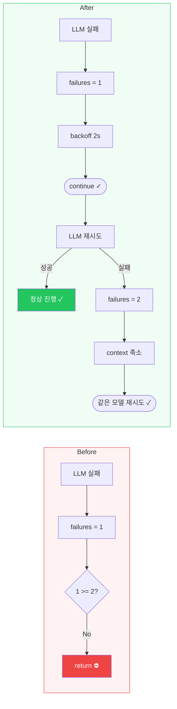
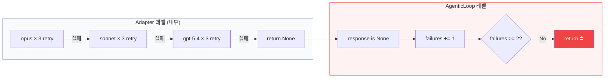
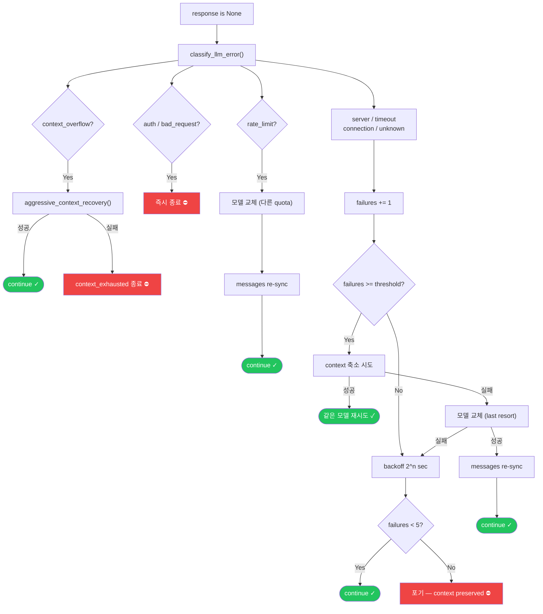
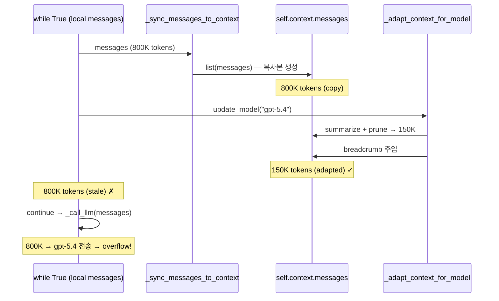
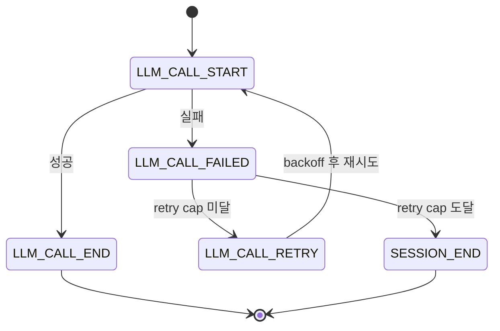

# Context-First Recovery — 루프는 죽지 않는다

> Date: 2026-04-02 | Author: rooftopsnow | Tags: resilience, retry, context-management, model-escalation, error-handling, agentic-loop, geode, claude-code

## 목차

1. 도입 — "All anthropic models exhausted"
2. 문제 분석: 왜 루프가 죽었는가
3. Claude Code는 어떻게 살아남는가
4. Context-First Recovery 설계
5. Stale Messages 버그 — 보이지 않는 동기화 균열
6. Error-Type Routing — 에러를 알아야 올바른 대응을 한다
7. Hook Lifecycle 완성 — 블라인드 스팟 제거
8. 구현 결과와 회고

---

## 1. 도입 — "All anthropic models exhausted"

GEODE의 AgenticLoop에서 LLM 호출이 실패했습니다. 화면에 표시된 메시지는 이것이었습니다:

```
LLM call failed (All anthropic models exhausted).
Your conversation context is preserved — try again.
```

5분 39초 동안 대기한 끝에 세션이 종료되었습니다. Context는 "preserved"라고 했지만, 사용자에게 남은 선택은 새 세션을 시작하는 것뿐이었습니다.

문제는 단순한 API 장애가 아니었습니다. **루프의 첫 번째 실패에서 즉시 `return`이 호출되어 agentic loop 전체가 종료되는 구조적 결함**이었습니다.

---

## 2. 문제 분석: 왜 루프가 죽었는가

### 2.1 사망 경로 추적

AgenticLoop의 `response is None` 블록은 이렇게 동작했습니다:

```python
self._consecutive_llm_failures += 1              # failures = 1
if self._consecutive_llm_failures >= 2:           # 1 >= 2? → False
    escalated = self._try_model_escalation()      # 도달 불가
    ...
    continue

# Escalation threshold에 도달하지 못하면 바로 return
detail = self._last_llm_error or "unknown error"
return self._finalize_and_return(...)             # 루프 종료
```

**첫 번째 실패에서 즉시 루프가 종료됩니다.** Escalation threshold는 2로 설정되어 있었지만, threshold에 도달할 기회조차 없었습니다. 1회 실패 → `return` → 세션 사망.

수정 후에는 동일한 시나리오에서 루프가 유지됩니다:



### 2.2 5분 39초의 정체

LLM 호출 자체에는 내부 retry 로직이 있었습니다. `fallback.py`의 `retry_with_backoff_generic()`가 모델당 3회 retry + exponential backoff를 수행합니다. opus 3회 실패 → sonnet 3회 실패 → cross-provider 시도 → 전부 실패. 이 과정에서 backoff 누적만 수 분이 소요되었습니다.

문제는 이 모든 retry가 **adapter 레벨에서만 발생**하고, **agentic loop 레벨에서는 단 1회의 기회만 주어진다**는 것이었습니다. Adapter가 포기한 순간 loop도 함께 죽었습니다.



Adapter가 내부에서 9회(3모델 × 3회) 재시도하는 동안 수 분이 흘렀지만, 그 결과를 받는 loop 레벨에서는 **단 1회의 판단**만 합니다. 그리고 그 판단은 `return`이었습니다.

---

## 3. Claude Code는 어떻게 살아남는가

Claude Code의 소스코드(`query.ts`)를 분석한 결과, 근본적으로 다른 설계를 발견했습니다.

### 3.1 Generator Yield 패턴

Claude Code의 conversation loop는 async generator입니다. `while (true)` 루프 안에서 에러가 발생하면 `continue`로 다음 iteration으로 넘어갑니다. **루프가 끊기는 경로 자체가 극히 제한적**입니다.

```typescript
// query.ts — 7개의 continue site
while (true) {
    try {
        // streaming API call
    } catch (innerError) {
        if (innerError instanceof FallbackTriggeredError) {
            currentModel = fallbackModel
            continue  // 모델만 바꾸고 루프 유지
        }
    }
    // prompt_too_long → collapse drain → continue
    // max_output_tokens → escalate 64k → continue
    // stop hook blocking → inject message → continue
}
```

### 3.2 핵심 차이: Error Withholding

Claude Code는 recovery 가능한 에러를 **caller에게 노출하지 않습니다**. 413(prompt_too_long) 에러가 발생하면 내부적으로 context를 compact하고, 성공 시 에러를 표시하지 않습니다. Recovery가 실패한 경우에만 에러가 surface됩니다.

GEODE는 에러 발생 즉시 UI에 표시하고 루프를 종료했습니다. 사용자 관점에서는 "에러 메시지 → 세션 종료"가 한 번에 일어납니다.

### 3.3 비교 요약

| | Claude Code | GEODE (수정 전) |
|--|-------------|----------------|
| 첫 실패 | backoff → 같은 모델 retry | `return` (루프 종료) |
| 모델 교체 트리거 | 529 × 3회 연속만 | threshold 도달 불가 |
| Context 관리 | 7개 recovery pathway | context_overflow 1개 |
| 에러 노출 | recovery 실패 시에만 | 즉시 노출 |

---

## 4. Context-First Recovery 설계

Claude Code의 패턴을 참조하되, GEODE의 multi-provider 환경에 맞는 전략을 설계했습니다.

### 4.1 핵심 원칙: 모델 다운그레이드보다 Context 축소가 우선

기존 설계는 실패 시 하위 모델로 교체(escalation)하는 것이 기본 전략이었습니다. 하지만 이 접근에는 근본적 문제가 있습니다:

```
Anthropic chain:  opus (1M, $25/M) → sonnet (1M, $15/M) → [chain 소진]
Cross-provider:   → gpt-5.4 (1M, $15/M)
                        ↓                    ↓                    ↓
                     최고 품질           품질 저하            provider 변경
```

실제 fallback chain에 haiku는 포함되지 않습니다(`ANTHROPIC_FALLBACK_CHAIN = [opus, sonnet]`). 같은 1M window 모델 간 이동이라 context 크기 문제는 적지만, **품질 저하는 확실합니다.** Cross-provider로 넘어가면 tool_use 프로토콜 차이까지 더해집니다.

**상위 모델에서 실패한 이유가 rate limit이 아니라면, 하위 모델로 바꾸는 것은 품질만 떨어뜨리고 문제를 해결하지 못합니다.** Timeout은 context가 클수록 처리 시간이 길어지므로, 같은 모델에서 context를 줄이고 재시도하는 것이 더 합리적입니다.

모델 교체가 유효한 유일한 경우는 **rate limit**(다른 모델은 다른 quota를 사용)입니다.

### 4.2 최종 Recovery Pipeline



### 4.3 에러 타입별 전략 매트릭스

| 에러 타입 | 모델 교체 | Context 축소 | Backoff Retry | 즉시 종료 |
|-----------|----------|-------------|---------------|----------|
| rate_limit | ✓ (즉시) | | | |
| server | (last resort) | ✓ (threshold) | ✓ | |
| timeout | (last resort) | ✓ (threshold) | ✓ | |
| connection | (last resort) | ✓ (threshold) | ✓ | |
| unknown | (last resort) | ✓ (threshold) | ✓ | |
| auth | | | | ✓ |
| bad_request | | | | ✓ |
| context_overflow | | ✓ (즉시) | | ✓ (실패 시) |

---

## 5. Stale Messages 버그 — 보이지 않는 동기화 균열

구현 과정에서 모델 교체보다 더 심각한 구조적 버그를 발견했습니다.

### 5.1 이중 메시지 구조

AgenticLoop의 `arun()`은 루프 시작 시 `messages = self.context.get_messages()`로 local 변수를 생성합니다. 이후 모든 LLM 호출과 tool result는 이 local `messages`에 append됩니다.

```python
messages = self.context.get_messages()   # 루프 시작 전 1회
while True:
    response = await self._call_llm(system, messages)  # local 사용
    messages.append(assistant_content)                  # local에 추가
    messages.append(tool_results)                       # local에 추가
```

### 5.2 동기화 단절

모델 교체 시 `update_model()`이 호출되면:

1. `_sync_messages_to_context(messages)` → `self.context.messages = list(messages)` — **복사본 생성**
2. `_adapt_context_for_model(target)` → 복사본에 대해 summarize + prune 수행
3. Breadcrumb 주입 → `self.context.add_user_message("Model switched: X → Y")`

이 모든 수정은 **`self.context.messages`(복사본)**에만 적용됩니다. 루프가 `continue`로 돌아가면 **원본 local `messages`**가 그대로 사용됩니다.

```
self.context.messages  →  adapted, pruned, breadcrumb 포함  (사용 안 됨)
local messages         →  stale, adaptation 미적용           (실제 사용됨)
```

### 5.3 실패 시나리오

Anthropic chain이 소진되면 cross-provider로 넘어갑니다(`opus → sonnet → gpt-5.4`). 하지만 극단적 경우를 가정해 봅시다 — context가 800K 토큰인 상태에서 모델이 교체됩니다:

- `_adapt_context_for_model()`이 새 모델의 window에 맞게 summarize + adaptive prune 수행
- 이 작업은 `self.context.messages`(복사본)에만 적용됨
- 루프 재개 시 local `messages`(800K)가 그대로 전송 → context overflow 또는 200K ceiling 초과



### 5.4 수정

```python
# Escalation 성공 후, continue 전에
messages[:] = self.context.messages  # in-place re-sync
```

`messages[:] =` 은 리스트 객체를 교체하지 않고 내용만 덮어씁니다. 루프 내 다른 코드가 같은 리스트를 참조하고 있어도 안전합니다.

---

## 6. Error-Type Routing — 에러를 알아야 올바른 대응을 한다

### 6.1 기존: 에러 무차별 처리

수정 전 코드는 에러 타입을 분류하지만(`classify_llm_error()`), 분류 결과를 **UI 표시에만** 사용했습니다. 실제 recovery 경로는 에러 타입과 무관하게 동일한 흐름을 탔습니다.

### 6.2 수정: 에러 타입이 전략을 결정한다

```python
if _et == "context_overflow":
    # Context 문제 → context recovery → 실패 시 종료
    ...

if _et in ("auth", "bad_request"):
    # Non-retryable → 즉시 종료 (retry 예산 낭비 방지)
    return ...

if _et == "rate_limit":
    # Rate limit → 모델 교체 (다른 모델 = 다른 quota)
    self._try_model_escalation()
    ...

# server / timeout / connection / unknown
# → backoff → threshold에서 context 축소 → 실패 시 모델 교체
```

### 6.3 model escalation reason 구분

기존 `update_model()`은 reason이 항상 `"user_switch"`였습니다. 사용자가 `/model` 명령으로 바꾼 것인지, rate limit으로 자동 교체된 것인지 구분할 수 없었습니다.

```python
# Before
def update_model(self, model, provider=None):
    emit_model_switched(old, new, "user_switch")  # 항상 동일

# After
def update_model(self, model, provider=None, reason="user_switch"):
    emit_model_switched(old, new, reason)
```

`_try_model_escalation()`에서는 `reason="failure_escalation"` 또는 `"cross_provider_escalation"`으로 호출합니다. Hook 소비자와 LangSmith tracer가 교체 원인을 정확히 추적할 수 있습니다.

---

## 7. Hook Lifecycle 완성 — 블라인드 스팟 제거

### 7.1 문제: LLM 실패가 보이지 않는다

GEODE의 HookSystem은 46개 이벤트를 제공했지만, LLM call lifecycle에 빈 구간이 있었습니다:

```
LLM_CALL_START → (성공) → LLM_CALL_END     ← 관찰 가능
LLM_CALL_START → (실패) → ???              ← 블라인드 스팟
                           → ??? (재시도)   ← 블라인드 스팟
```

`LLM_CALL_START`와 `LLM_CALL_END` 사이에 실패가 발생하면, hook 소비자(모니터링, tracer, cost tracker)는 해당 호출이 어떻게 되었는지 알 수 없었습니다.

### 7.2 수정: 2개 이벤트 추가 (46 → 48)

```python
class HookEvent(str, Enum):
    LLM_CALL_START = "llm_call_start"
    LLM_CALL_END = "llm_call_end"
    LLM_CALL_FAILED = "llm_call_failed"    # NEW
    LLM_CALL_RETRY = "llm_call_retry"      # NEW
```

완성된 lifecycle:



### 7.3 이벤트 페이로드

```python
# LLM_CALL_FAILED
{
    "model": "claude-opus-4-6",
    "provider": "anthropic",
    "error_type": "rate_limit",     # classify_llm_error() 결과
    "severity": "warning",
    "attempt": 2,
}

# LLM_CALL_RETRY
{
    "model": "claude-opus-4-6",
    "provider": "anthropic",
    "error_type": "timeout",
    "delay_s": 4,                   # backoff 대기 시간
    "attempt": 2,
    "max_attempts": 5,
}
```

---

## 8. 구현 결과와 회고

### 8.1 변경 규모

| 파일 | 변경 |
|------|------|
| `core/agent/agentic_loop.py` | +145 lines — retry, error routing, context recovery, re-sync |
| `core/cli/ui/agentic_ui.py` | +16 lines — `emit_llm_retry()` |
| `core/hooks/system.py` | +2 lines — `LLM_CALL_FAILED`, `LLM_CALL_RETRY` |
| 테스트 7개 | hook event count 46 → 48 |
| 테스트 2개 | retry 동작 반영 (`quiet=True`, mock 보강) |

### 8.2 Claude Code와의 최종 비교

| | Claude Code | GEODE (수정 후) |
|--|-------------|----------------|
| 기본 전략 | 같은 모델 retry (10회) | 같은 모델 retry (5회) |
| 모델 교체 | 529 × 3 → fallback | rate_limit만 즉시 교체 |
| Context 축소 | 413 이후 reactive | threshold에서 proactive |
| Non-retryable | token refresh → retry | 즉시 종료 |
| Cross-provider | 없음 (단일 provider) | 3-provider fallback |
| Error withholding | recovery 중 숨김 | 즉시 표시 (향후 개선) |

### 8.3 교훈

**"모델을 바꾸면 해결된다"는 착각입니다.** LLM 호출 실패의 대부분은 rate limit을 제외하면 모델과 무관합니다. Timeout은 context가 크면 어떤 모델에서든 발생하고, server error는 같은 인프라의 모든 모델에 영향을 미칩니다.

올바른 순서는:
1. 같은 모델에서 backoff retry (일시적 장애 해소)
2. Context를 줄이고 같은 모델에서 재시도 (성능 유지)
3. 모든 방법이 실패한 경우에만 모델 교체 (last resort)

그리고 **messages 동기화는 반드시 검증해야 합니다.** Local 변수와 context 객체 사이의 복사/참조 관계는 코드를 읽는 것만으로는 직관적이지 않습니다. 모델 교체 후 adapted context가 실제로 사용되는지 확인하지 않았다면, adaptation 코드는 존재하지만 동작하지 않는 dead code나 다름없었습니다.

---

*Source: `blog/posts/llm-resilience/71-context-first-recovery-loop-never-dies.md` | Category: [[blog-llm-resilience]]*

## Related

- [[blog-llm-resilience]]
- [[blog-hub]]
- [[geode]]
- [[geode-llm-models]]
- [[geode-memory-system]]
