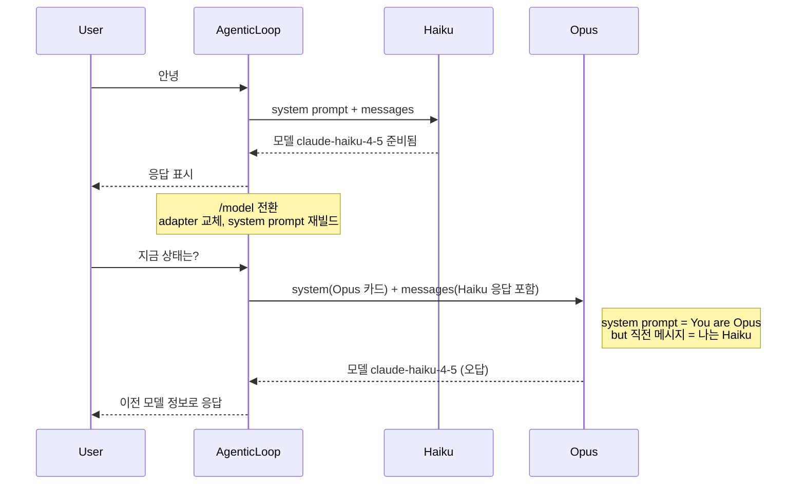
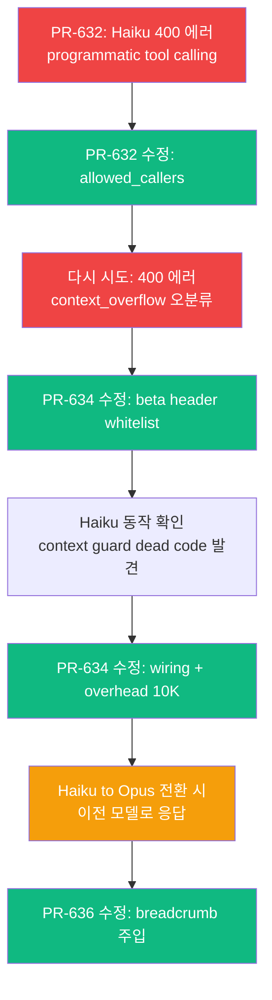
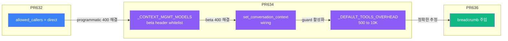
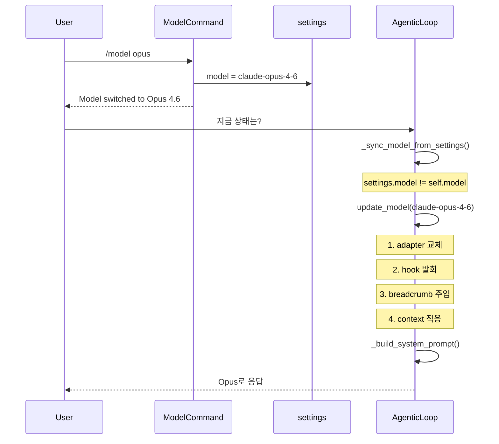

# 모델 전환 시 대화 연속성 문제 — Breadcrumb 패턴으로 해결하기

> Date: 2026-04-02 | Author: geode-team | Tags: model-switch, breadcrumb, context-management, claude-code, agentic-loop, frontier-pattern

---

## 목차

1. 도입: 모델을 바꿨는데 이전 모델인 척 한다
2. 근본 원인: 대화 컨텍스트의 관성
3. 디버깅 과정: 4개의 버그가 겹쳐 있었다
4. Claude Code는 어떻게 해결했나
5. GEODE 적용: Breadcrumb 주입
6. 마무리

---

## 1. 도입: 모델을 바꿨는데 이전 모델인 척 한다

멀티 모델을 지원하는 에이전트 시스템에서 `/model` 명령으로 모델을 전환하는 것은 흔한 기능입니다. Opus로 복잡한 분석을 하다가, 간단한 질문에는 Haiku로 전환해서 비용을 줄이는 식입니다.

GEODE에서 이런 시나리오를 테스트하던 중 이상한 현상을 발견했습니다.

```
> /model Haiku
  Model  claude-opus-4-6 → Haiku 4.5

> 안녕
  모든 도구가 준비되어 있습니다. 무엇을 도와드릴까요?   ← Haiku 정상 응답

> /model Opus
  Model  Haiku 4.5 → Opus 4.6

> 지금 상태는?
  ✢ claude-opus-4-6 · $0.2460                            ← Opus 가격 청구됨
  모델: claude-haiku-4-5 (single mode)                    ← 그런데 Haiku라고 답함
```

인프라 지표를 확인하면 전환 자체는 정상입니다. `claude-opus-4-6` 가격이 청구되었고, adapter도 교체되었습니다. 하지만 **응답 내용**이 이전 모델의 자기소개를 그대로 인용하고 있었습니다.

하지만 이 문제에 도달하기까지, 먼저 Haiku 전환 자체를 불가능하게 만드는 4개의 버그를 순서대로 해결해야 했습니다. 이 글은 그 디버깅 과정과 최종적으로 Claude Code의 Breadcrumb 패턴을 적용한 기록입니다.

---

## 2. 근본 원인: 대화 컨텍스트의 관성

먼저 최종 문제(모델 정체성 혼동)의 구조적 원인을 설명합니다. GEODE의 모델 전환 시 내부 동작은 다음과 같습니다.



문제의 핵심은 **대화 메시지가 모델 전환 후에도 그대로 보존**된다는 점입니다. Opus는 system prompt에서 자신이 Opus임을 알 수 있지만, 직전 assistant 메시지에 Haiku가 작성한 자기소개도 함께 봅니다.

LLM은 system prompt보다 **직전 대화 맥락에 더 강하게 앵커링**되는 특성이 있습니다. "지금 상태는?"이라는 질문에 "방금 확인한 것과 동일합니다"라고 답하면서 Haiku의 응답을 그대로 인용한 것입니다.

```
┌──────────────────────────────────────────────────────────┐
│  System Prompt: "You are claude-opus-4-6..."             │  ← 약한 신호
├──────────────────────────────────────────────────────────┤
│  [assistant] "모델: claude-haiku-4-5, 준비됨"             │  ← 강한 신호
│  [user] "지금 상태는?"                                    │
├──────────────────────────────────────────────────────────┤
│  [assistant] "모델: claude-haiku-4-5..."                  │  ← 앵커링된 오답
└──────────────────────────────────────────────────────────┘
```

> 이것은 LLM의 결함이 아니라, 대화 맥락 속에 모델 전환이라는 **메타 이벤트**가 기록되지 않기 때문에 발생하는 구조적 문제입니다. 모델은 대화의 연속성을 가정하고 있고, 전환이 일어났다는 사실을 알 방법이 없습니다.

---

## 3. 디버깅 과정: 4개의 버그가 겹쳐 있었다

모델 정체성 문제에 도달하기까지, Haiku 전환 자체를 가로막는 더 심각한 버그들을 먼저 해결해야 했습니다. 버그들이 겹쳐 있어서 하나를 고치면 다음 것이 드러나는 양파 구조였습니다.



### Layer 1: Server Tool `allowed_callers` 미설정 (PR #632)

첫 번째 증상은 Haiku로 전환하자마자 400 에러가 발생하는 것이었습니다.

```
Error code: 400 — 'claude-haiku-4-5-20251001' does not support programmatic
tool calling. The following tools have allowed_callers that require it:
web_search. Explicitly set allowed_callers=["direct"] on these tools.
```

원인은 Anthropic의 server-side tool(Server Tool) 주입 코드에 있었습니다. GEODE는 `web_search`와 `web_fetch`를 Anthropic native tool로 모든 모델에 자동 주입합니다.

```python
# core/llm/providers/anthropic.py — 수정 전
_ANTHROPIC_NATIVE_TOOLS: list[dict[str, Any]] = [
    {"type": "web_search_20260209", "name": "web_search"},
    {"type": "web_fetch_20260209", "name": "web_fetch"},
]
```

Anthropic Server Tool에는 두 가지 호출 방식이 있습니다.

| 방식 | 설명 | Haiku 지원 |
|------|------|-----------|
| `direct` | 모델이 호출 → Anthropic이 서버에서 실행 → 결과 자동 반환 | O |
| `programmatic` | 모델이 호출 → 개발자가 tool_result를 직접 제공 | X |

`allowed_callers`를 명시하지 않으면 기본값에 `programmatic`이 포함되어 Haiku에서 거부됩니다. GEODE 용도상 `direct`만 필요하므로 명시적으로 설정합니다.

```python
# core/llm/providers/anthropic.py — 수정 후
_ANTHROPIC_NATIVE_TOOLS: list[dict[str, Any]] = [
    {"type": "web_search_20260209", "name": "web_search", "allowed_callers": ["direct"]},
    {"type": "web_fetch_20260209", "name": "web_fetch", "allowed_callers": ["direct"]},
]
```

> Server Tool의 `allowed_callers`는 Anthropic API에서 비교적 최근에 추가된 파라미터입니다. 기존에 Opus/Sonnet만 사용할 때는 기본값으로 문제가 없었지만, Haiku처럼 programmatic calling을 지원하지 않는 모델을 추가하면서 명시적 설정이 필요해졌습니다.

### Layer 2: Context Management Beta 비호환 (PR #634)

`allowed_callers` 수정 후 Haiku를 다시 시도했지만, 이번엔 다른 에러가 나타났습니다.

```
{'type': 'llm_error', 'error_type': 'context_overflow', 'severity': 'error',
 'model': 'claude-haiku-4-5-20251001', 'elapsed_s': 0.0}
```

`elapsed_s: 0.0`이 단서였습니다. API가 요청을 처리하기도 전에 즉시 거부했다는 뜻입니다. 토큰 수 문제라면 최소한 토큰 카운팅 시간이 있어야 합니다.

원인은 `ClaudeAgenticAdapter._do_call()` 내부에서 **모든 Anthropic 모델에** 동일한 beta header를 전송하고 있었기 때문입니다.

```python
# core/llm/providers/anthropic.py — 수정 전: 모든 모델에 동일 적용
async def _do_call(m: str) -> Any:
    return await self._client.messages.create(
        model=m,
        ...
        extra_headers={
            "anthropic-beta": "context-management-2025-06-27,compact-2026-01-12",
        },
        extra_body={
            "context_management": {
                "edits": [
                    {"type": "clear_tool_uses_20250919", "keep": {"type": "tool_uses", "value": 5}},
                    {"type": "compact_20260112", "trigger": {"type": "input_tokens", "value": compact_trigger}},
                ]
            }
        },
    )
```

`compact-2026-01-12`는 2026년 1월에 출시된 beta feature입니다. Haiku 4.5(`claude-haiku-4-5-20251001`)는 2025년 10월 출시로, 이 beta보다 **3개월 앞서** 출시되어 지원하지 않습니다.

더 문제를 복잡하게 만든 것은 **에러 오분류**였습니다. API 에러 메시지에 "context"라는 단어가 포함되면서, GEODE의 에러 분류기가 이를 `context_overflow`로 잘못 분류했습니다.

```python
# core/llm/router.py — call_with_failover 내부
except _NON_RETRYABLE_ERRORS as exc:
    error_msg = str(exc).lower()
    if "token" in error_msg or "context" in error_msg:  # ← "context" 매칭
        raise  # context_overflow로 전파
```

이로 인해 토큰 수를 계속 확인하게 되는 **잘못된 디버깅 방향**으로 유도되었습니다. 실측 결과 system prompt(~2,688 토큰) + 56개 tool definitions(~7,274 토큰) = 약 10,000 토큰으로, 200K 창의 5%에 불과했습니다. 토큰 overflow가 아니었던 것입니다.

수정은 모델별 whitelist를 도입하여 beta header를 조건부 주입하는 것입니다.

```python
# core/llm/providers/anthropic.py — 수정 후

# 1M context 모델만 server-side compaction 지원
_CONTEXT_MGMT_MODELS: frozenset[str] = frozenset(
    {
        "claude-opus-4-6",
        "claude-opus-4-5",
        "claude-sonnet-4-6",
        "claude-sonnet-4-5",
    }
)

async def _do_call(m: str) -> Any:
    extra_h: dict[str, str] = {}
    extra_b: dict[str, Any] = {}
    if m in _CONTEXT_MGMT_MODELS:
        m_window = MODEL_CONTEXT_WINDOW.get(m, 200_000)
        m_trigger = max(50_000, int(m_window * 0.8))
        extra_h["anthropic-beta"] = "context-management-2025-06-27,compact-2026-01-12"
        extra_b["context_management"] = {
            "edits": [
                {"type": "clear_tool_uses_20250919", "keep": {"type": "tool_uses", "value": 5}},
                {"type": "compact_20260112", "trigger": {"type": "input_tokens", "value": m_trigger}},
            ]
        }

    return await self._client.messages.create(
        model=m, ...,
        extra_headers=extra_h if extra_h else None,
        extra_body=extra_b if extra_b else None,
    )
```

> Haiku처럼 server-side compaction을 지원하지 않는 모델은 GEODE의 client-side `_adapt_context_for_model()`이 대신합니다. 이 함수는 모델 전환 시 tool result 요약 + adaptive pruning으로 대화를 target model의 context window에 맞춥니다.

### Layer 3: `/model` Context Guard — Dead Code (PR #634)

Beta header를 수정하면서 `/model` 명령의 Context Window Guard 코드를 발견했는데, **한 번도 실행된 적 없는 dead code**였습니다.

```python
# core/cli/commands.py:309-328 — /model 명령 내부
ctx = get_conversation_context()       # ← 항상 None 반환
if ctx is not None and ctx.messages:   # ← 항상 False → guard 전체 skip
    current_tokens = estimate_message_tokens(ctx.messages)
    target_window = MODEL_CONTEXT_WINDOW.get(selected.id, 200_000)
    threshold = int(target_window * 0.8)

    if current_tokens > threshold:
        console.print(f"  Context guard: {current_tokens:,} tokens exceeds ...")
        console.print("  Run /compact or /clear first, then retry /model.")
        return  # 전환 차단
```

이 guard는 대화량이 target model의 context window 80%를 초과하면 전환을 차단하도록 설계되어 있었습니다. 하지만 `set_conversation_context()` 함수가 **정의만 되어 있고 호출하는 곳이 0개**였습니다.

```python
# core/cli/commands.py — 정의는 있으나
def set_conversation_context(ctx: Any) -> None:
    _conversation_ctx.set(ctx)

# 호출하는 곳: 0개 (grep 결과 없음)
```

수정은 `AgenticLoop.arun()` 진입 시 context를 wire하는 1줄 추가입니다.

```python
# core/agent/agentic_loop.py — arun() 진입부
async def arun(self, user_input: str) -> AgenticResult:
    self._tool_processor.reset()
    self._op_logger.reset()

    # Wire conversation context so /model command guard can check size
    from core.cli.commands import set_conversation_context
    set_conversation_context(self.context)
```

### Layer 4: `check_context()` Overhead 과소 추정 (PR #634)

Guard를 wire하면서 `check_context()` 함수도 점검했는데, system prompt + tool definitions 크기를 **500 토큰으로 하드코딩**하고 있었습니다.

```python
# core/orchestration/context_monitor.py — 수정 전
def check_context(messages, model, *, system_prompt=""):
    system_tokens = len(system_prompt) // CHARS_PER_TOKEN if system_prompt else 0
    message_tokens = estimate_message_tokens(messages)
    response_overhead = 500  # ← system prompt + tool definitions 합산으로 500?
    estimated = system_tokens + message_tokens + response_overhead
```

실측 결과:

| 구성 요소 | 문자 수 | 토큰 (chars/4) |
|-----------|---------|----------------|
| System prompt (router.md + suffix + injected contexts) | ~10,753 | ~2,688 |
| 56 base tool definitions (definitions.json) | ~29,098 | ~7,274 |
| **합계** | **~39,851** | **~9,962** |
| 기존 `response_overhead` | — | **500** |

20배 과소 추정이었습니다. 이로 인해 `_adapt_context_for_model()`이 "80% 미만 → compaction 불필요"로 오판할 수 있습니다.

```python
# core/orchestration/context_monitor.py — 수정 후
_DEFAULT_TOOLS_OVERHEAD = 10_000  # 실측: system ~2.7K + 56 tools ~7.3K

def check_context(
    messages: list[dict[str, Any]],
    model: str,
    *,
    system_prompt: str = "",
    tools_tokens: int = 0,    # 외부에서 실측값 전달 가능
) -> ContextMetrics:
    system_tokens = len(system_prompt) // CHARS_PER_TOKEN if system_prompt else 0
    message_tokens = estimate_message_tokens(messages)
    overhead = tools_tokens if tools_tokens > 0 else _DEFAULT_TOOLS_OVERHEAD
    estimated = system_tokens + message_tokens + overhead
```

> `tools_tokens` 파라미터를 추가하여, 호출자가 실제 tool definitions 크기를 전달할 수 있도록 했습니다. 기본값은 실측 기반 10,000 토큰입니다. Claude Code도 `roughTokenCountEstimation()`으로 tool definitions를 동적 측정하는 패턴을 사용합니다.

### 전체 수정 흐름



---

## 4. Claude Code는 어떻게 해결했나

Layer 1~4를 해결하고 나서, 마침내 원래 문제(모델 정체성 혼동)에 도달했습니다. Claude Code 소스를 조사한 결과, **두 가지 모드에서 다른 전략**을 사용하고 있었습니다.

### REPL 모드 (interactive)

대화 메시지를 수정하지 않습니다. `/model` 명령은 `setAppState`로 모델만 변경하고, system prompt를 다음 쿼리 시 재빌드합니다. 이전 메시지는 그대로 유지됩니다.

```typescript
// claude-code/commands/model/model.tsx:53-56
setAppState(prev => ({
  ...prev,
  mainLoopModel: model,
  mainLoopModelForSession: null,  // session override 해제
}));
// shouldQuery: false — 메시지 추가 없음, 쿼리 미발생
```

### SDK 모드 (non-interactive, `--print`)

`createModelSwitchBreadcrumbs()` 함수로 **전환 마커를 대화에 주입**합니다.

```typescript
// claude-code/utils/messages.ts:590-601
export function createModelSwitchBreadcrumbs(
  modelArg: string,
  resolvedDisplay: string,
): UserMessage[] {
  return [
    createSyntheticUserCaveatMessage(),                    // 컨텍스트 경계
    createUserMessage({
      content: formatCommandInputTags('model', modelArg),  // "/model sonnet"
    }),
    createUserMessage({
      content: `<local-command-stdout>Set model to ${resolvedDisplay}</local-command-stdout>`,
    }),
  ]
}
```

호출 지점에서 `mutableMessages.push()` 로 대화 배열에 직접 삽입합니다.

```typescript
// claude-code/cli/print.ts:1222-1247
function injectModelSwitchBreadcrumbs(modelArg: string, resolvedModel: string): void {
  const breadcrumbs = createModelSwitchBreadcrumbs(
    modelArg,
    modelDisplayString(resolvedModel),
  )
  mutableMessages.push(...breadcrumbs)     // 대화 배열에 직접 push
  for (const crumb of breadcrumbs) { ... } // SDK 이벤트 스트림에도 전송
}
```

> 핵심 아이디어는 단순합니다. 모델 전환이라는 메타 이벤트를 **대화 메시지로 변환**하여, LLM이 컨텍스트 안에서 전환 사실을 인식할 수 있게 하는 것입니다. Breadcrumb(빵 부스러기)이라는 이름이 적절합니다 — 대화 속에 남긴 흔적입니다.

### Claude Code REPL vs SDK 비교

| 항목 | REPL 모드 | SDK 모드 |
|------|-----------|----------|
| 대화 메시지 보존 | 그대로 | 그대로 |
| 전환 마커 | 없음 | breadcrumb 3개 주입 |
| System prompt 재빌드 | 매 쿼리마다 | 매 쿼리마다 |
| 모델 인식 정확도 | system prompt에 의존 (약함) | 대화 내 명시적 전환 기록 (강함) |
| Context 압축 | 없음 (auto-compact에 위임) | 없음 |

---

## 5. GEODE 적용: Breadcrumb 주입

GEODE의 모델 전환은 2단계로 동작합니다. 먼저 `/model` 명령이 `settings.model`을 변경하고, 다음 라운드에서 `_sync_model_from_settings()`가 변경을 감지하여 `update_model()`을 호출합니다.



> `/model` 명령이 직접 `update_model()`을 호출하지 않는 이유가 있습니다. 이전에는 tool handler 내부에서 `update_model()`을 호출했는데, 현재 라운드가 tool result를 처리하는 도중에 adapter가 교체되어 crash가 발생했습니다. 이를 방지하기 위해 deferred sync 패턴을 도입했습니다.

Breadcrumb은 `update_model()` 내에서 모델이 실제로 변경된 경우에만 주입됩니다. 전체 `update_model()` 코드입니다.

```python
# core/agent/agentic_loop.py:415-464
def update_model(self, model: str, provider: str | None = None) -> None:
    """Update model and provider without reconstructing the loop."""
    old_model = self.model
    new_provider = provider or _resolve_provider(model)

    # Provider가 변경되면 adapter 교체 (anthropic → openai 등)
    if new_provider != self._provider:
        self._provider = new_provider
        self._adapter = resolve_agentic_adapter(new_provider)
    self.model = model
    self._tool_processor._model = model

    # UI status line 동기화
    from core.cli.ui.agentic_ui import update_session_model
    update_session_model(model)

    # MODEL_SWITCHED hook + IPC event
    if old_model != model:
        from core.cli.ui.agentic_ui import emit_model_switched
        emit_model_switched(old_model, model, "user_switch")
        if self._hooks:
            from core.hooks import HookEvent
            self._hooks.trigger(HookEvent.MODEL_SWITCHED, {
                "from_model": old_model,
                "to_model": model,
                "reason": "user_switch",
            })

        # Breadcrumb 주입 (Claude Code SDK pattern)
        if not self.context.is_empty:
            self.context.add_user_message(
                f"[system] Model switched: {old_model} -> {model}. "
                "You are now the new model. Do not reference the previous "
                "model's responses as current state."
            )
            self.context.add_assistant_message(f"Understood. I am now {model}.")

    # Context window 적응 (Phase 1: tool result 요약, Phase 2: pruning)
    self._adapt_context_for_model(model)
```

> Claude Code SDK는 3개의 synthetic user message(caveat + command input + stdout)를 사용하지만, GEODE는 **user+assistant 쌍 1개**로 단순화했습니다. Anthropic API의 메시지 규칙상 user-assistant가 번갈아야 하므로, assistant 응답을 함께 넣어 대화 구조를 유지합니다. 핵심은 동일합니다 — **전환을 대화 레코드로 남기는 것**.

적용 후 대화 흐름:

```
┌───────────────────────────────────────────────────────────────┐
│  System Prompt: "You are claude-opus-4-6..."                  │
├───────────────────────────────────────────────────────────────┤
│  [assistant] "모델: claude-haiku-4-5, 준비됨"                  │
│  [user] "[system] Model switched: haiku → opus. You are..."   │  ← breadcrumb
│  [assistant] "Understood. I am now claude-opus-4-6."          │  ← breadcrumb
│  [user] "지금 상태는?"                                         │
├───────────────────────────────────────────────────────────────┤
│  [assistant] "현재 claude-opus-4-6으로 동작 중입니다."          │  ← 정답
└───────────────────────────────────────────────────────────────┘
```

---

## 6. 마무리

### 전체 수정 요약

| PR | Layer | 수정 | 근본 원인 |
|----|-------|------|-----------|
| #632 | Server Tool | `allowed_callers=["direct"]` | Haiku programmatic tool calling 미지원 |
| #634 | Beta Header | `_CONTEXT_MGMT_MODELS` whitelist | `compact-2026-01-12` Haiku 미지원 → 400 오분류 |
| #634 | Context Guard | `set_conversation_context()` wiring | Dead code (caller 0개) |
| #634 | Overhead | `_DEFAULT_TOOLS_OVERHEAD = 10_000` | 500 하드코딩 (20x 과소) |
| #636 | Breadcrumb | user+assistant pair 주입 | 모델 전환 후 이전 모델 정보 참조 |

### 멀티 모델 에이전트를 위한 설계 원칙

이번 작업에서 확인한 원칙을 정리합니다.

**1. 메타 이벤트를 대화로 변환하라.** 모델 전환, 컨텍스트 압축 등 시스템 이벤트는 LLM이 볼 수 없습니다. 대화 메시지로 남겨야 합니다.

**2. 모델별 기능 차이를 코드로 관리하라.** 같은 provider의 모델이라도 지원하는 API feature가 다릅니다. `_CONTEXT_MGMT_MODELS` 같은 whitelist로 명시적 관리가 필요합니다.

**3. Dead code는 단위 테스트가 잡지 못한다.** `set_conversation_context()`는 함수 자체는 존재했고 단위 테스트도 통과했지만, 호출하는 곳이 없었습니다. 통합 테스트에서 실제 경로를 검증해야 합니다.

**4. 에러 분류기의 오분류가 디버깅을 가장 어렵게 만든다.** Beta header 비호환이 `context_overflow`로 분류되면서, 토큰 수를 계속 확인하게 되는 잘못된 방향으로 유도했습니다. 에러 메시지 내 키워드 매칭은 편리하지만, 예상치 못한 에러를 삼킬 수 있습니다.

### Checklist

- [x] Haiku `/model` 전환 후 정상 응답
- [x] Opus → Haiku → Opus 전환 시 breadcrumb 주입 확인
- [x] 전환 후 "현재 모델은?" 질문에 정확한 모델 응답
- [x] CI 전체 통과 (3615 tests, lint, type check)
- [x] Claude Code SDK 패턴 소스 확인 및 적용

---

*Source: `blog/posts/harness-frontier/71-model-switch-breadcrumb-context-continuity.md` | Category: [[blog-harness-frontier]]*

## Related

- [[blog-harness-frontier]]
- [[blog-hub]]
- [[geode]]
