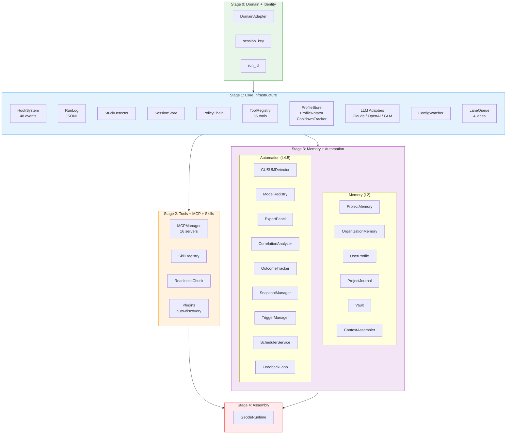
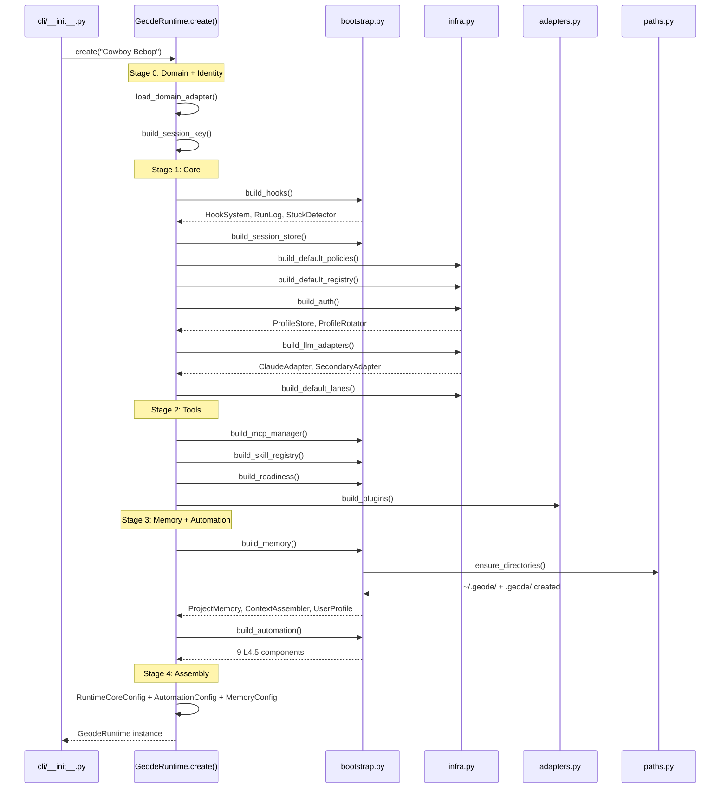

# 의존성 맵 분석에서 Lazy Init까지 — 5계층 아키텍처 정비 기록

> 209개 모듈의 import 관계를 매트릭스로 그리고, 3건의 레이어 위반을 수정하고,
> 클린 설치 시 발생하는 `FileNotFoundError`를 Claude Code 패턴으로 해소한 과정을 기록합니다.

> Date: 2026-04-08 | Author: geode-team | Tags: dependency-map, layered-architecture, lazy-init, claude-code-pattern, refactoring

---

## 목차

1. 도입: 왜 의존성 맵을 그려야 하는가
2. 5계층 아키텍처와 의존성 매트릭스
3. 런타임 조립 — 4-Stage Bootstrap 시각화
4. 레이어 위반 3건 — 진단과 수정
5. 클린 설치 문제 — 디렉토리 체계 부재
6. Claude Code의 Lazy Creation 패턴
7. ensure_directories() 구현
8. 결과와 교훈

---

## 1. 도입: 왜 의존성 맵을 그려야 하는가

209개 모듈, 28,000줄 이상의 코드베이스에서 "어떤 레이어가 어떤 레이어를 import하는가"는 코드를 읽는 것만으로 파악할 수 없습니다. 실제로 `grep -r "from core\." core/`를 실행하면 100개 이상의 교차 모듈 import가 나옵니다.

문제는 **방향**입니다. 상위 레이어(CLI, Runtime)가 하위 레이어(LLM, Tools)를 import하는 것은 정상이지만, 하위 레이어가 상위 레이어를 import하면 순환 의존성과 결합도 증가로 이어집니다.

이 글은 전체 의존성 맵을 구축하고, 발견한 3건의 레이어 위반을 수정한 과정을 기록합니다.

---

## 2. 5계층 아키텍처와 의존성 매트릭스

GEODE는 5계층 스택으로 구성됩니다.

```
L5  cli, runtime, runtime_wiring, graph       ← Entry Points
L4  orchestration, automation, agent           ← Orchestration
L3  tools, verification                        ← Tool & Safety
L2  domains, llm, memory, mcp, skills          ← Core Services
L1  config, hooks, state, gateway              ← Interfaces
L0  paths, utils                               ← Foundation
```

> 의존성 방향 규칙: **위에서 아래로만 허용됩니다.** L2 모듈이 L5 모듈을 import하면 위반입니다.

### Hub 모듈 — 결합 중심점

전체 import를 분석한 결과, 가장 많이 참조되는 Hub 모듈 4개가 식별되었습니다.

| Module | 참조 횟수 | 레이어 | 역할 |
|--------|:---------:|:------:|------|
| config | 9개 모듈 | L1 | 중앙 설정 |
| hooks | 8개 모듈 | L1 | 이벤트 분배 |
| llm | 6개 모듈 | L2 | LLM 오케스트레이션 |
| tools | 6개 모듈 | L2 | 도구 시스템 |

Hub 모듈이 하위 레이어에 위치하는 것은 올바른 설계입니다. 상위 레이어들이 공통 인터페이스를 참조하는 자연스러운 패턴입니다.

### 의존성 매트릭스

각 모듈이 어떤 모듈을 import하는지를 매트릭스로 정리합니다.

| Module | → config | → hooks | → llm | → tools | → memory | → gateway | → orch | → agent |
|--------|:--------:|:-------:|:-----:|:-------:|:--------:|:---------:|:------:|:-------:|
| **cli** (L5) | O | O | O | O | O | O | O | O |
| **runtime_wiring** (L5) | O | O | O | O | O | O | O | O |
| **agent** (L4) | O | O | O | O | O | | O | |
| **orchestration** (L4) | O | O | O | O | | | | |
| **tools** (L3) | O | O | | | O | | | |
| **domains** (L2) | O | | O | | | | | |
| **llm** (L2) | O | O | | | | O | | |
| **memory** (L2) | O | | | | | | | |
| **gateway** (L1) | O | O | | | | | | |
| **paths** (L0) | | | | | | | | |

> L5→L1, L4→L2, L3→L1 방향 모두 정상입니다. 문제는 이 매트릭스에서 **역방향 화살표**가 3건 발견되었다는 점입니다.

---

## 3. 런타임 조립 — 4-Stage Bootstrap 시각화

GEODE의 런타임은 `GeodeRuntime.create()` 팩토리 메서드에서 4단계에 걸쳐 조립됩니다. 각 단계에서 생성되는 컴포넌트와 레이어 간 의존성 방향을 시각화합니다.

### 전체 조립 흐름



> Stage 1(Core)이 가장 무겁습니다. hooks, auth, LLM, lanes 등 모든 인프라가 여기서 생성됩니다. Stage 2와 Stage 3은 Stage 1의 hooks에 의존하지만 서로는 독립적입니다.

### 레이어별 컴포넌트 매핑

각 Stage에서 생성되는 컴포넌트가 어떤 레이어에 속하는지 시각화합니다.

```mermaid
graph LR
    subgraph L0["L0: Foundation"]
        paths["paths.py<br/>ensure_directories()"]
    end

    subgraph L1["L1: Interfaces"]
        config["config.py<br/>Settings"]
        hooks_l1["hooks/<br/>HookSystem"]
        state["state.py<br/>GeodeState"]
        gw["gateway/<br/>Auth + Pollers"]
    end

    subgraph L2["L2: Core Services"]
        llm_l2["llm/<br/>Router + Adapters<br/>+ AgenticResponse"]
        mem_l2["memory/<br/>Project + Org<br/>+ Profile + Vault"]
        mcp_l2["mcp/<br/>Manager + Catalog"]
        skills_l2["skills/<br/>SkillRegistry"]
        domains_l2["domains/<br/>GameIP Plugin"]
    end

    subgraph L3["L3: Tools & Safety"]
        tools_l3["tools/<br/>56 handlers"]
        verify_l3["verification/<br/>G1-G4 + BiasBuster"]
    end

    subgraph L4["L4: Orchestration"]
        orch_l4["orchestration/<br/>LaneQueue + Monitor"]
        auto_l4["automation/<br/>Scheduler + Drift"]
        agent_l4["agent/<br/>AgenticLoop<br/>+ ToolExecutor"]
    end

    subgraph L5["L5: Entry Points"]
        cli_l5["cli/<br/>Typer + IPC"]
        runtime_l5["runtime.py<br/>GeodeRuntime"]
        bootstrap_l5["runtime_wiring/<br/>bootstrap + infra"]
    end

    L5 --> L4
    L4 --> L3
    L4 --> L2
    L3 --> L2
    L3 --> L1
    L2 --> L1
    L1 --> L0

    style L0 fill:#ECEFF1,stroke:#607D8B
    style L1 fill:#E8EAF6,stroke:#3F51B5
    style L2 fill:#E3F2FD,stroke:#2196F3
    style L3 fill:#E8F5E9,stroke:#4CAF50
    style L4 fill:#FFF3E0,stroke:#FF9800
    style L5 fill:#FFEBEE,stroke:#F44336
```



> 화살표가 항상 아래를 향합니다. 이것이 의존성 방향 규칙입니다. 위반이 발생하면 (L2→L5 같은 역방향 화살표) 즉시 감지하고 수정해야 합니다.

### Bootstrap 시퀀스 다이어그램

실제 `GeodeRuntime.create()` 호출 시 각 함수가 어떤 순서로 실행되는지 시퀀스로 표현합니다.



> `ensure_directories()`는 Stage 3(Memory) 시작 시점에 호출됩니다. 메모리 시스템이 디렉토리에 가장 많이 의존하기 때문입니다. Stage 1-2는 디렉토리 접근이 필요하지 않으므로 이 시점이 최적입니다.

---

## 4. 레이어 위반 3건 — 진단과 수정

### 위반 1: `llm/router.py` → `cli/agentic_response.py` (L2 → L5)

```python
# core/llm/providers/anthropic.py (L2)
from core.cli.agentic_response import normalize_anthropic   # L5 참조!
```

`AgenticResponse`는 LLM 응답의 provider-agnostic 정규화 타입입니다. 이 타입이 CLI 레이어에 위치할 이유가 없습니다. LLM 레이어의 모든 provider adapter가 CLI를 import하는 역전 구조가 발생했습니다.

**수정**: `core/cli/agentic_response.py` → `core/llm/agentic_response.py`로 이동. 원래 파일은 re-export stub으로 유지하여 하위 호환성을 보장합니다.

```python
# core/cli/agentic_response.py — re-export stub
"""Backward-compatible re-export — canonical module moved to core.llm.agentic_response."""
from core.llm.agentic_response import (
    AgenticResponse,
    normalize_anthropic,
    normalize_openai,
    normalize_openai_responses,
)
```

> 이 패턴은 Python의 표준적인 모듈 이동 전략입니다. 기존 import 경로를 유지하면서 canonical 위치를 변경합니다. `from core.cli.agentic_response import AgenticResponse`는 여전히 동작하지만, core/ 내부에서는 `core.llm.agentic_response`를 직접 참조합니다.

### 위반 2: `config.py` → `llm/token_tracker.MODEL_PRICING` (L1 → L2)

```python
# core/config.py (L1)
from core.llm.token_tracker import MODEL_PRICING as MODEL_PRICING  # L2 참조!
```

조사 결과 `core.config.MODEL_PRICING`을 import하는 코드가 **0건**이었습니다. backward-compat re-export였지만 소비자가 없는 dead code였습니다.

**수정**: 3줄 삭제. 가장 간단한 해결책입니다.

### 위반 3: `state.py` → `verification/rights_risk.RightsRiskResult` (L1 → L3)

```python
# core/state.py (L1)
from core.verification.rights_risk import RightsRiskResult   # L3 참조!
```

`GeodeState` TypedDict에서 `rights_risk: RightsRiskResult` 필드로 사용됩니다. 처음에는 `TYPE_CHECKING` guard로 해결하려 했으나, LangGraph가 `get_type_hints()`로 런타임에 타입을 평가하기 때문에 `NameError`가 발생했습니다.

```python
# 실패한 접근 — LangGraph TypedDict는 런타임 타입 해석 필요
if TYPE_CHECKING:
    from core.verification.rights_risk import RightsRiskResult
# → NameError: name 'RightsRiskResult' is not defined
```

**수정**: `RightsRiskResult`, `RightsStatus`, `LicenseInfo` 3개 타입을 `state.py`에 직접 정의하고, `rights_risk.py`에서 re-export합니다.

```python
# core/state.py (L1) — 타입 정의의 canonical 위치
class RightsStatus(StrEnum):
    CLEAR = "clear"
    NEGOTIABLE = "negotiable"
    ...

class RightsRiskResult(BaseModel):
    status: RightsStatus
    risk_score: int = Field(ge=0, le=100)
    license_info: LicenseInfo
    ...
```

```python
# core/verification/rights_risk.py (L3) — re-export
from core.state import LicenseInfo as LicenseInfo
from core.state import RightsRiskResult as RightsRiskResult
from core.state import RightsStatus as RightsStatus
```

> `as X` 재할당 패턴은 mypy의 explicit re-export를 만족시킵니다. 단순 `from core.state import RightsStatus`는 `--strict` 모드에서 "Module does not explicitly export" 경고를 발생시킵니다.

---

## 5. 클린 설치 문제 — 디렉토리 체계 부재

레이어 위반을 수정한 후, 또 다른 구조적 결함이 발견되었습니다. **클린 설치 시 실행이 불가능**합니다.

```bash
# 새 머신에서 실행
git clone ... && cd geode && uv sync
uv run geode
# → FileNotFoundError: ~/.geode/runs/... 또는 .geode/memory/...
```

GEODE는 `~/.geode/` (글로벌)과 `.geode/` (프로젝트) 두 계층의 디렉토리를 사용합니다. 문제는 이 디렉토리들을 **아무도 생성하지 않는다**는 점입니다.

| 디렉토리 | 용도 | 자동 생성? |
|----------|------|:----------:|
| `~/.geode/` | 글로벌 루트 | X |
| `~/.geode/runs/` | 실행 로그 | X |
| `~/.geode/vault/` | artifact 저장소 | O (bootstrap) |
| `.geode/` | 프로젝트 루트 | X |
| `.geode/memory/` | 프로젝트 메모리 | X (write 시) |
| `.geode/skills/` | 스킬 레지스트리 | X |
| `.geode/rules/` | 룰 체계 | X |
| `.geode/reports/` | 리포트 저장 | X |

개발 환경에서는 점진적으로 디렉토리가 생성되어 문제가 보이지 않았지만, 클린 설치 시 여러 경로에서 crash가 발생합니다.

---

## 6. Claude Code의 Lazy Creation 패턴

Claude Code의 디렉토리 관리 전략을 분석했습니다.

```typescript
// utils/config.ts:1125 — 설정 저장 시 디렉토리 생성
fs.mkdirSync(dir, { recursive: true })
```

핵심 원칙:

1. **별도 `init` 커맨드 없음** — `claude init`은 프로젝트 CLAUDE.md 생성 전용이며, `~/.claude/` 디렉토리 초기화용이 아닙니다.
2. **Lazy Creation** — 파일을 쓸 때 `mkdir(recursive: true)`로 부모 디렉토리를 함께 생성합니다.
3. **멱등성** — 이미 존재하면 무시합니다. 별도 존재 여부 체크 없이 항상 `mkdir`을 호출합니다.
4. **최소 footprint** — 필요하지 않은 디렉토리는 생성하지 않습니다.

> Claude Code는 개별 write 경로마다 `mkdir`을 분산 호출합니다. GEODE는 bootstrap 시점에 한 번 호출하는 방식을 선택했습니다. 이유: GEODE의 디렉토리 의존성이 더 많고(21개), 분산 호출 시 누락 위험이 있습니다.

---

## 7. ensure_directories() 구현

`core/paths.py`에 중앙 디렉토리 생성 함수를 추가합니다.

```python
# core/paths.py
def ensure_directories() -> None:
    """Create all required directories if missing.

    Called once at bootstrap. mkdir(parents=True, exist_ok=True)
    — no error if present, creates full tree if absent.
    """
    created: list[str] = []

    # --- Global tier (~/.geode/) ---
    global_dirs = [
        GEODE_HOME, GLOBAL_RUNS_DIR, GLOBAL_VAULT_DIR,
        GLOBAL_MODELS_DIR, GLOBAL_USAGE_DIR, GLOBAL_MCP_DIR,
        GLOBAL_SCHEDULER_DIR, GLOBAL_PROJECTS_DIR,
        GLOBAL_IDENTITY_DIR, GLOBAL_USER_PROFILE_DIR,
    ]
    for d in global_dirs:
        if not d.exists():
            d.mkdir(parents=True, exist_ok=True)
            created.append(str(d))

    # --- Project-scoped user data (~/.geode/projects/{id}/) ---
    project_data = get_project_data_dir()
    for sub in ["journal", "sessions", "snapshots", "result_cache"]:
        d = project_data / sub
        if not d.exists():
            d.mkdir(parents=True, exist_ok=True)
            created.append(str(d))

    # --- Project tier (.geode/) ---
    project_dirs = [
        PROJECT_GEODE_DIR, PROJECT_MEMORY_DIR, PROJECT_RULES_DIR,
        PROJECT_SKILLS_DIR, PROJECT_REPORTS_DIR, PROJECT_SCHEDULER_LOG_DIR,
    ]
    for d in project_dirs:
        if not d.exists():
            d.mkdir(parents=True, exist_ok=True)
            created.append(str(d))

    # --- .gitignore entry ---
    _ensure_geode_gitignore()

    if created:
        log.info("Created %d directories", len(created))
```

> `if not d.exists()` 체크는 로깅 목적입니다. `mkdir(exist_ok=True)`이 멱등성을 보장하므로 체크 없이 호출해도 동작합니다. 하지만 첫 실행 시 "Created 21 directories" 로그가 초기화 상태를 확인하는 데 유용합니다.

### Bootstrap 호출

```python
# core/runtime_wiring/bootstrap.py
def build_memory(...):
    from core.paths import ensure_directories
    ensure_directories()
    ...
```

`build_memory()`는 bootstrap에서 가장 이른 시점에 호출되는 함수입니다. 여기서 `ensure_directories()`를 호출하면 이후의 모든 메모리, 저널, 볼트, 프로필 초기화가 안전하게 동작합니다.

### .gitignore 자동 엔트리

```python
def _ensure_geode_gitignore() -> None:
    gitignore = Path(".gitignore")
    entry = ".geode/"
    try:
        if gitignore.exists():
            content = gitignore.read_text(encoding="utf-8")
            if entry in content:
                return
        else:
            content = ""
        content += f"\n# GEODE\n{entry}\n"
        gitignore.write_text(content, encoding="utf-8")
    except OSError:
        pass  # read-only filesystem, CI
```

> `OSError` catch는 CI 환경이나 read-only 파일시스템에서의 graceful degradation입니다. `.gitignore`에 쓸 수 없어도 GEODE 실행 자체는 차단하지 않습니다.

---

## 8. 결과와 교훈

### 수정 결과

| 항목 | Before | After |
|------|--------|-------|
| 레이어 위반 | 3건 (L2→L5, L1→L2, L1→L3) | 0건 |
| 클린 설치 | `FileNotFoundError` crash | 21개 디렉토리 자동 생성 |
| .gitignore | 수동 추가 필요 | 자동 엔트리 |
| 테스트 | — | +7건 (ensure_directories) |

### 교훈

**1. 의존성 맵은 정기적으로 그려야 합니다.** 100+개 import의 방향을 코드 리뷰만으로 파악하는 것은 불가능합니다. `grep "from core\." | awk` 한 줄이면 매트릭스를 생성할 수 있습니다.

**2. `TYPE_CHECKING` guard의 한계.** LangGraph TypedDict처럼 런타임에 `get_type_hints()`를 호출하는 프레임워크에서는 `TYPE_CHECKING` guard가 `NameError`를 유발합니다. 이 경우 타입 정의를 하위 레이어로 이동하는 것이 올바른 해결책입니다.

**3. 개발 환경의 함정.** 점진적으로 생성된 디렉토리는 "항상 있던 것"처럼 보입니다. 클린 설치 테스트(새 디렉토리에서 `uv sync && uv run geode`)를 정기적으로 수행해야 합니다.

**4. Claude Code 패턴의 적용.** Claude Code는 `mkdir(recursive: true)`를 각 write 경로에 분산 배치합니다. GEODE는 디렉토리 의존성이 더 많아 bootstrap 시점에 중앙 호출하는 방식을 선택했습니다. 두 접근 모두 유효하며, 코드베이스 크기와 디렉토리 수에 따라 선택합니다.

---

*Source: `blog/posts/architecture/80-dependency-map-layer-violations-lazy-init.md` | Category: [[blog-architecture]]*

## Related

- [[blog-architecture]]
- [[blog-hub]]
- [[geode]]
- [[geode-architecture]]
