# GEODE Architecture

> [README](../README.md) | **Architecture** | [Workflow](workflow.md) | [Setup](setup.md)

이 문서는 **GEODE Runtime(에이전트)** 의 내부 아키텍처를 다룹니다. 생산 체계(Scaffold)는 [Workflow](workflow.md)를 참고하세요.

- **Scaffold (생산)**: Claude Code + CLAUDE.md + 개발 Skills + CI Hooks → GEODE를 만드는 외부 하네스
- **Runtime (에이전트)**: 아래 6-Layer 구조 — 47 Tools · 20 Runtime Skills · 36 Runtime Hooks · 5-Layer Verification

## 6-Layer Architecture

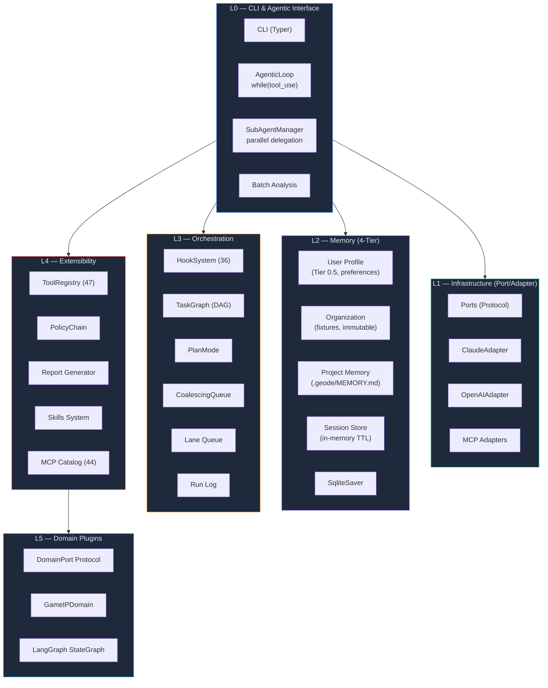

| Layer | 구성 요소 | 설명 |
|-------|----------|------|
| **L0** CLI & Agent | Typer CLI, AgenticLoop, SubAgentManager, Batch, Gateway | 사용자 인터페이스 + 자율 실행 코어 |
| **L1** Infra | Ports (Protocol), ClaudeAdapter, OpenAIAdapter, MCP Adapters | Port/Adapter DI — `contextvars` 주입 |
| **L2** Memory | SOUL → User Profile → Organization → Project → Session (4-Tier), SqliteSaver | 계층적 메모리 + LangGraph 체크포인트 |
| **L3** Orchestration | HookSystem (36 events), TaskGraph DAG, PlanMode, CoalescingQueue | 라이프사이클 이벤트, 동시성 제어 |
| **L4** Extensibility | ToolRegistry (47), PolicyChain, Skills, MCP Catalog (44) | 런타임 tool/skill 확장, MCP 자동설치 |
| **L5** Domain Plugins | DomainPort Protocol, GameIPDomain, LangGraph StateGraph | 도메인별 파이프라인 플러그인 교체 |

---

## Agentic Loop

모든 자율 실행의 핵심 프리미티브. LLM이 `tool_use`를 반환하는 한 루프를 계속합니다.

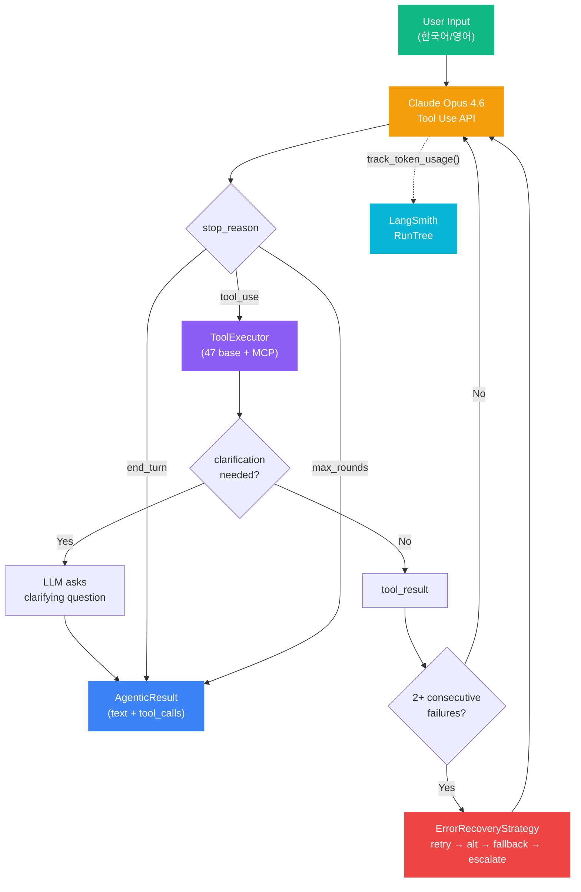

| 구성 요소 | 설명 |
|----------|------|
| **LLM Tool Use** | Claude Opus 4.6 — base 47 + MCP 20+ tool 정의 전달, `stop_reason` 기반 루프 제어 |
| **ToolExecutor** | 4-tier safety: SAFE / STANDARD / WRITE / DANGEROUS (bash 사용자 승인 필수) |
| **Clarification** | 필수 파라미터 누락 시 LLM이 사용자에게 되묻기 |
| **max_rounds** | 기본 50 라운드 — 마지막 2라운드에서 텍스트 응답 강제 (1M 컨텍스트 + `clear_tool_uses` 활용) |
| **Multi-turn** | 슬라이딩 윈도우 (max 200 turns) — 서버측 `clear_tool_uses`가 주 컨텍스트 관리, 클라이언트 제한은 안전망 |
| **LangSmith** | 토큰 수/비용을 RunTree에 기록, 세션 합산 |

---

## Tool Execution Hierarchy

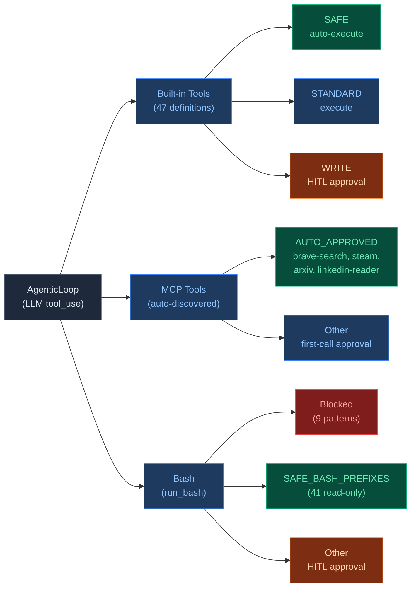

| 경로 | 도구 수 | 승인 방식 |
|------|--------|----------|
| Built-in Tools | 47 | SAFE 자동승인, STANDARD 실행, WRITE HITL 승인 |
| MCP Tools | 카탈로그 44종 | AUTO_APPROVED 서버 4종 자동승인, 그 외 초회 승인 |
| Bash | shell 명령 | SAFE_BASH_PREFIXES 41종 자동승인, 9종 차단, 그 외 HITL |

---

## Goal Decomposition

복합 요청을 하위 목표 DAG로 자동 분해합니다. 단순 요청은 LLM 호출 없이 통과시켜 비용을 최소화합니다.

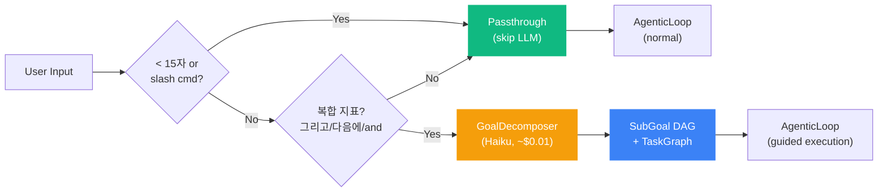

| 단계 | 동작 | 비용 |
|------|------|------|
| **Heuristic 1** | `_is_clearly_simple()` — slash 명령, 15자 미만 → 즉시 패스스루 | 0 |
| **Heuristic 2** | `_has_compound_indicators()` — "그리고", "다음에", "and then" 등 복합 지표 탐지 | 0 |
| **LLM Decompose** | Haiku 모델로 SubGoal 리스트 생성, 의존관계 포함 | ~$0.01 |
| **TaskGraph 변환** | SubGoal → TaskGraph DAG, 의존성 기반 실행 순서 결정, 실패 전파 | 0 |

---

## Error Recovery

도구 실행 연속 실패 시 4단계 전략 체인으로 자동 복구합니다.

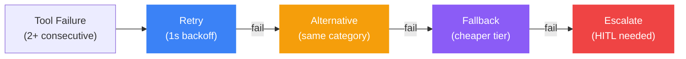

| 전략 | 동작 | 예시 |
|------|------|------|
| **Retry** | 동일 도구 재실행 (1s backoff) | `web_fetch` 재시도 |
| **Alternative** | 같은 `category` 다른 도구 (`definitions.json`) | `web_fetch` → `general_web_search` |
| **Fallback** | 더 낮은 `cost_tier` 도구 | `expensive` → `cheap` → `free` |
| **Escalate** | 사용자 개입 요청 (terminal) | HITL 승인 |

**안전 제외**: `run_bash`, `memory_save`, `set_api_key` 등 DANGEROUS/WRITE 도구는 자동 복구 대상에서 제외.

Hook: `TOOL_RECOVERY_ATTEMPTED` / `SUCCEEDED` / `FAILED` — 복구 수명주기 관측.

---

## Sub-Agent System

부모 AgenticLoop의 전체 역량(tools, MCP, skills, memory)을 상속받아 독립 컨텍스트에서 병렬 실행합니다.

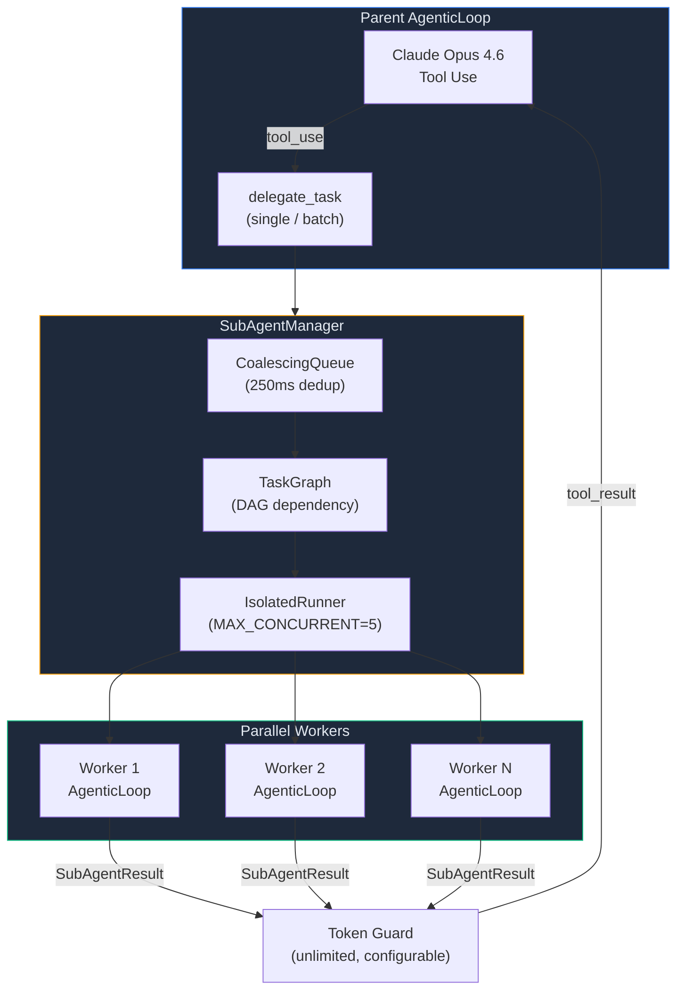

### CoalescingQueue + TaskGraph: 왜 둘 다 필요한가

직교하는 두 문제를 각각 해결합니다.

**TaskGraph (DAG)** — 구조적 관심사.
태스크 간 의존성을 모델링하여 "무엇을 어떤 순서로" 실행할지 결정합니다.
독립적인 태스크는 병렬로, 의존성이 있는 태스크는 순차로 스케줄링합니다.
DAG만 있으면 5개 에이전트가 같은 웹페이지를 동시에 요청해도 5번 실행됩니다.

**CoalescingQueue** — 시간적 관심사.
250ms 윈도우 내 동일 요청을 병합하여 "언제, 몇 번" 실행할지 제어합니다.
Queue만 있으면 중복은 제거하지만 실행 순서를 보장하지 못합니다.

#### 전체 디스패치 흐름

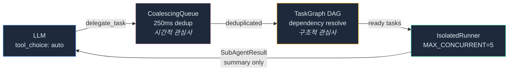

#### CoalescingQueue 내부

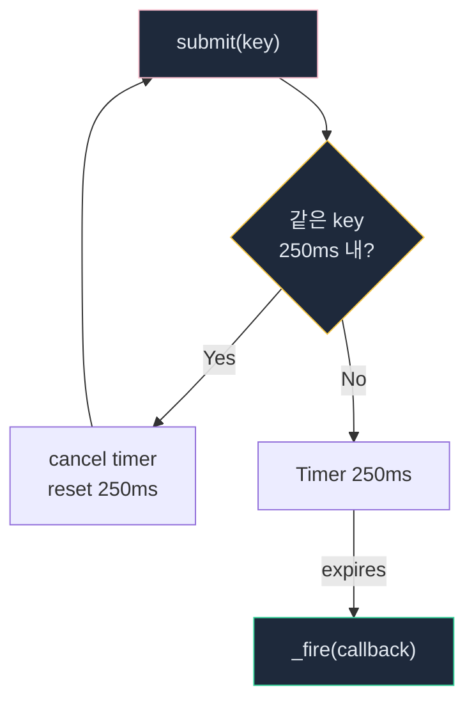

#### TaskGraph 내부

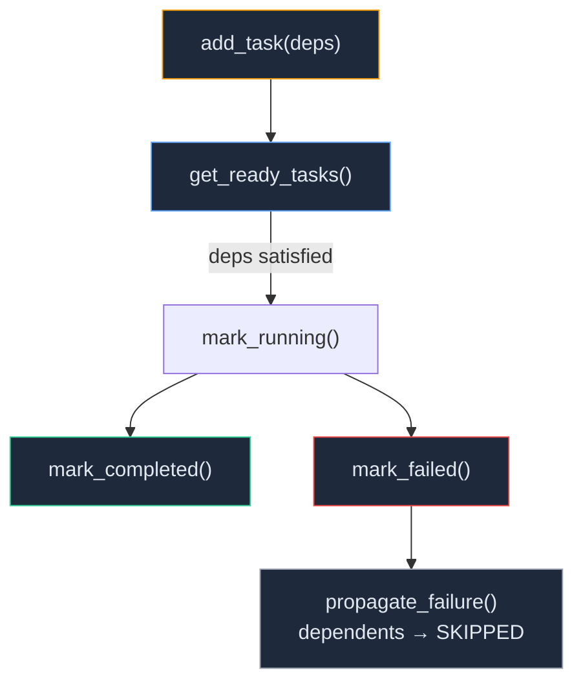

#### TaskGraph: IP 분석 DAG 예시 (13 tasks)

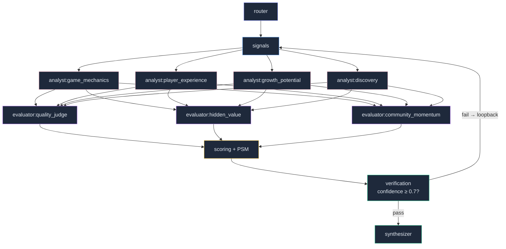

#### CoalescingQueue: 내부 구조

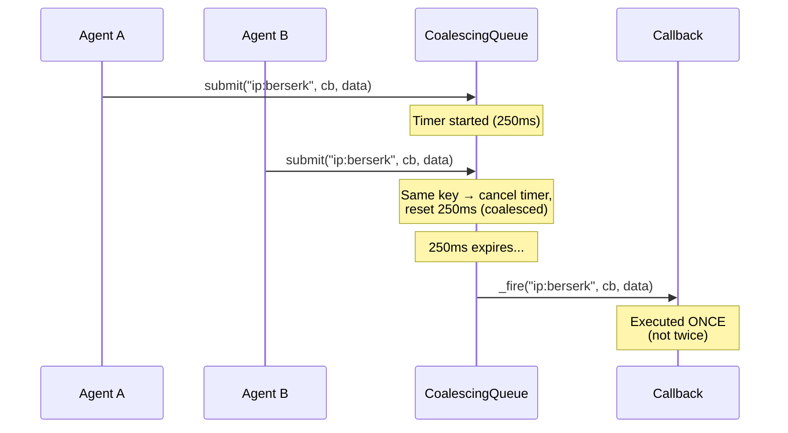

#### TaskGraph: 상태 전이

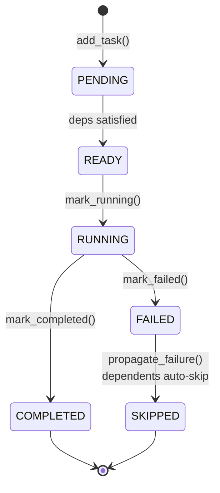

**Karpathy "Dumb Platform" 원칙**: Queue/DAG는 외부 시스템 제약(rate limit, 타임아웃)을 다루므로 가장 마지막에 LLM으로 이전되는 레이어입니다. 현재는 코드로 강제하지만, 모델이 자원 한계를 이해하게 되면 프롬프트 기반 소프트 제어로 전환할 수 있습니다.

| 제어 | 값 | 설명 |
|------|-----|------|
| **max_depth** | 2 | 재귀 위임 최대 깊이 (Root=0 → depth 2) |
| **max_total** | 15 | 세션당 최대 서브에이전트 수 |
| **MAX_CONCURRENT** | 5 | 동시 병렬 워커 수 |
| **timeout_s** | 120s | 개별 태스크 타임아웃 |
| **Token Guard** | unlimited (0), configurable via GEODE_MAX_TOOL_RESULT_TOKENS | tool_result 제한 시 `summary`만 보존 |
| **as_completed** | polling round-robin | 먼저 끝난 태스크 결과 즉시 반환 |

에러 분류: `TIMEOUT`, `API_ERROR` (retryable) / `VALIDATION`, `RESOURCE`, `DEPTH_EXCEEDED` (non-retryable).

---

## Memory Architecture (5-Layer + System Prompt G1-G4)

두 가지 메모리 체계가 동시에 동작합니다.

### Context Assembly (5-Layer)

계층적 메모리 시스템으로 분석 맥락을 조합합니다. 상위 tier의 값은 하위 tier에 의해 override됩니다.

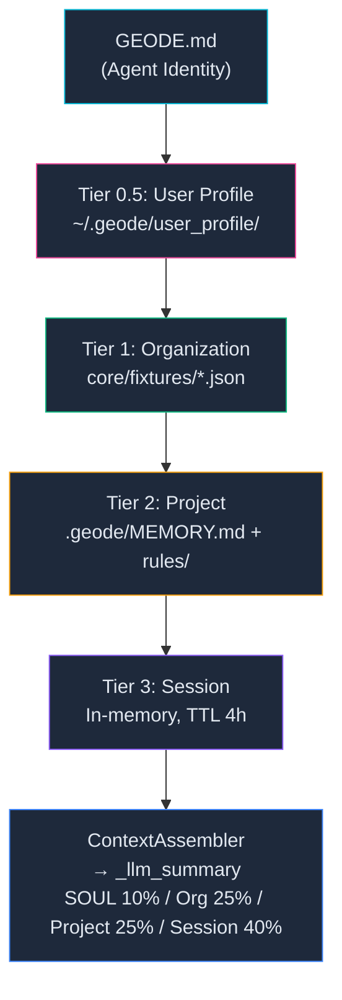

| Layer | 소스 | 영속성 | 용도 |
|-------|------|--------|------|
| **Identity** (Tier 0) | `./GEODE.md` (프로젝트 루트) | 영구 | 에이전트 정체성, Core Principles, CANNOT |
| **User Profile** (Tier 0.5) | `~/.geode/user_profile/` | 파일 기반 | profile.md, preferences.json, learned.md |
| **Organization** (Tier 1) | `core/fixtures/*.json` | Read-only | IP context, rubric, 기대 결과 |
| **Project** (Tier 2) | `.geode/MEMORY.md`, `.geode/rules/` | 파일 기반 | 학습된 규칙, 인사이트 |
| **Session** (Tier 3) | In-memory dict | TTL 4h | 현재 분석 컨텍스트, 체크포인트 |

### System Prompt Injection (G1-G4)

`build_system_prompt()`이 LLM에 주입하는 4개 메모리 섹션입니다. Context Assembly와는 별도 체계입니다.

> **주의**: Guardrails의 G1-G4(Schema/Range/Grounding/Consistency)와는 다른 체계입니다.

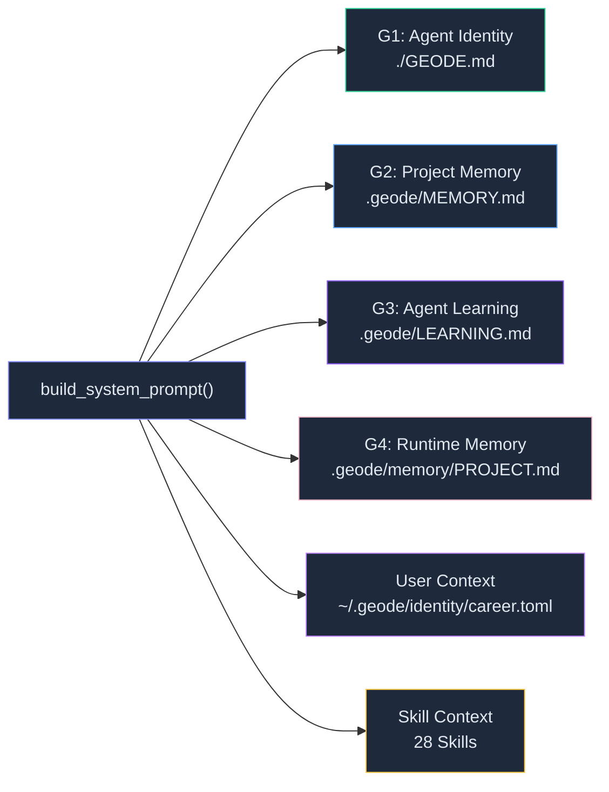

| Section | 파일 | 최대 줄 수 | 역할 |
|---------|------|-----------|------|
| **G1** | `./GEODE.md` | 20줄 | Core Principles, CANNOT, Defaults |
| **G2** | `.geode/MEMORY.md` | 20줄 | 아키텍처, 파이프라인 메타 인덱스 |
| **G3** | `.geode/LEARNING.md` | 20줄 | 패턴, 교정, 도메인 지식 |
| **G4** | `.geode/memory/PROJECT.md` | 20줄 | 런타임 인사이트 + rules/*.md |

`_MAX_SECTION_LINES = 20`. User Context는 profile 1줄 + career 1줄 + learned 5건.

---

## Prompt Assembly Pipeline (ADR-007)

LLM을 직접 호출하는 노드(Analyst, Evaluator, Synthesizer, BiasBuster)는 동일한 5단계 조합 파이프라인을 거칩니다. Router, Signals, Scoring, Verification 등 비-LLM 노드는 이 파이프라인을 거치지 않습니다.

```mermaid
graph LR
    T["Base Template<br/>prompts/*.md<br/>(10 templates)"] --> P0["Phase 0<br/>.format(**kwargs)"]
    P0 --> P1["Phase 1<br/>Prompt Override"]
    P1 --> P2["Phase 2<br/>Skill Injection<br/>(top 3, ≤500c)"]
    P2 --> P3["Phase 3<br/>Memory Context<br/>(_llm_summary, ≤300c)"]
    P3 --> P4["Phase 4<br/>Bootstrap Extra<br/>(5 × 100c)"]
    P4 --> Budget["Token Budget<br/>(hard limit 6000c)"]
    Budget --> AP["AssembledPrompt<br/>+ SHA-256[:12] hash"]
    AP --> Cache["cache_control:<br/>ephemeral"]
    Cache --> LLM["call_llm_parsed()<br/>→ Pydantic model"]

    style T fill:#1e293b,stroke:#3b82f6,color:#e2e8f0
    style P0 fill:#1e293b,stroke:#3b82f6,color:#e2e8f0
    style P1 fill:#1e293b,stroke:#8b5cf6,color:#e2e8f0
    style P2 fill:#1e293b,stroke:#10b981,color:#e2e8f0
    style P3 fill:#1e293b,stroke:#f59e0b,color:#e2e8f0
    style P4 fill:#1e293b,stroke:#06b6d4,color:#e2e8f0
    style Budget fill:#7c2d12,stroke:#f97316,color:#fed7aa
    style AP fill:#1e293b,stroke:#ec4899,color:#e2e8f0
    style Cache fill:#064e3b,stroke:#10b981,color:#6ee7b7
    style LLM fill:#f59e0b,stroke:#f59e0b,color:#fff
```

| 단계 | 입력 | 제한 | 설명 |
|------|------|------|------|
| **Phase 0** | `prompts/*.md` (9개 `.md` + `axes.py`) | — | `=== SYSTEM ===` / `=== USER ===` 구분자로 분리, `.format(**kwargs)` 렌더링 |
| **Phase 1** | `state._prompt_overrides` | append-only (기본) | 노드별 프롬프트 오버라이드. full replace opt-in |
| **Phase 2** | `SkillRegistry` | top 3, 500c/skill | `.geode/skills/` YAML frontmatter 기반 자동 발견, `node` + `role_type` 필터, priority 정렬 |
| **Phase 3** | `ContextAssembler._llm_summary` | 300c | 4-tier 메모리 압축 요약 주입 |
| **Phase 4** | `BootstrapManager._extra_instructions` | 5개 × 100c | 노드 사전 실행 컨텍스트 (pre-execution injection) |
| **Budget** | 전체 조합 결과 | hard limit 6000c, warning 4000c | 초과 시 truncation, 이벤트 기록 |

**무결성 보장**: 모든 템플릿에 SHA-256[:12] 핀 해시 저장. CI `verify_prompt_integrity()`로 의도치 않은 변경 감지 (Karpathy P4 Ratchet).

---

## Safety & HITL

자율 에이전트의 안전을 보장하는 다층 게이트 시스템.

| 계층 | 메커니즘 | 설명 |
|------|----------|------|
| **Tool 분류** | SAFE / STANDARD / WRITE / DANGEROUS | 4-tier safety classification (`definitions.json`) |
| **HITL 승인** | DANGEROUS 도구 실행 전 사용자 확인 | `run_bash` 등 위험 명령 차단 |
| **MCP 세션 승인** | 서버별 최초 1회 승인, 세션 내 캐시 | `_mcp_approved_servers` |
| **Bash 차단** | 9종 위험 패턴 자동 거부 | `rm -rf /`, `sudo`, fork bomb 등 |
| **서브에이전트** | `auto_approve=True`이나 DANGEROUS/WRITE 제외 | 자식도 위험 도구는 승인 필수 |
| **Error Recovery 제외** | DANGEROUS/WRITE 도구 자동 복구 안 함 | 안전 게이트 우회 방지 |
| **Grounding Truth** | tool_result 기반 출처 인용 강제 | 미확인 정보 생성 금지 |

---

## Extensibility

### Tool Dispatch: 6-Path Execution

LLM이 `tool_choice: auto`로 도구를 선택하면, ToolExecutor가 6가지 경로로 디스패치합니다.

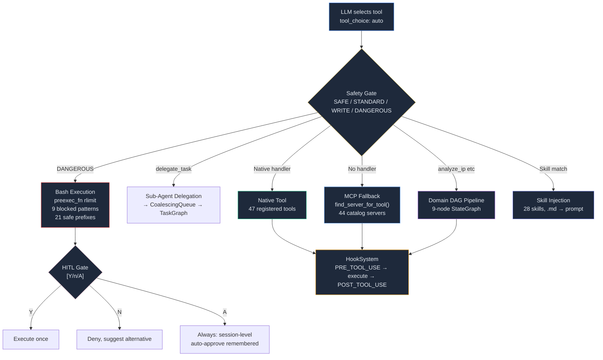

| 경로 | 소스 | 트리거 | HITL |
|------|------|--------|------|
| **Bash** | `core/cli/bash_tool.py` | `run_bash` tool | Y/N/A (DANGEROUS), 21 safe prefixes auto |
| **Sub-Agent** | `core/agent/sub_agent.py` | `delegate_task` tool | STANDARD auto, WRITE escalate |
| **Domain DAG** | `core/graph.py` | `analyze_ip`, Planner full_pipeline | N/A (pipeline 내부) |
| **Native Tool** | `core/tools/registry.py` | handler dict lookup hit | SAFE auto, WRITE Y/N/A |
| **MCP Fallback** | `core/mcp/manager.py` | handler miss + server found | 첫 호출 Y/N/A, AUTO_APPROVED 서버 auto |
| **Skill** | `core/llm/skill_registry.py` | node+role_type match | N/A (prompt injection) |

**HITL 승인 3단계** (`tool_executor.py:217`):
- **Y** (Yes): 이번 1회만 승인
- **N** (No): 거부. LLM에 거부 사유 전달, 대안 제안 유도
- **A** (Always): 세션 레벨 자동 승인. 해당 카테고리 전체를 기억하여 이후 동일 유형 자동 통과

**Hook 연동**: 모든 도구 실행은 `PRE_TOOL_USE` → 실행 → `POST_TOOL_USE` Hook을 거칩니다. 실패 시 `TOOL_RECOVERY_START` → retry/fallback → `TOOL_RECOVERY_SUCCESS/FAIL`.

### Observability

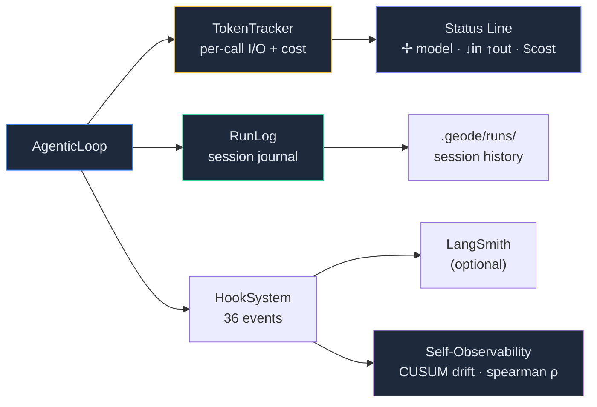

- **TokenTracker** — 매 LLM 호출마다 input/output 토큰 + 비용을 추적. Status Line(`✢ model · ↓in ↑out · $cost`)으로 실시간 표시
- **RunLog** — 세션 전체 실행 이력을 `.geode/runs/`에 저장. Hook priority 50으로 등록
- **Self-Observability** — LangSmith 의존 없이 자체 관측. CUSUM 누적합으로 4개 메트릭(spearman ρ, human-LLM α, precision@10, tier accuracy) 드리프트 감지. WARNING(≥2.5) / CRITICAL(≥4.0) 임계

### Domain Plugin

`DomainPort` Protocol로 도메인별 분석 파이프라인을 플러그인으로 교체합니다.

```python
# DomainPort Protocol — 도메인 플러그인 인터페이스
class DomainPort(Protocol):
    name: str; version: str; description: str
    def get_analyst_types(self) -> list[str]: ...
    def get_evaluator_types(self) -> list[str]: ...
    def get_scoring_weights(self) -> dict[str, float]: ...
    def get_tier_thresholds(self) -> dict[str, float]: ...
    def get_cause_values(self) -> list[str]: ...
    # ... 12 methods total
```

- **ContextVar 주입**: `set_domain()` / `get_domain()` — 런타임에 도메인 교체
- **동적 로딩**: `load_domain_adapter(name)` — 레지스트리 기반 임포트
- **확장**: `register_domain(name, path)` 후 `DomainPort` Protocol 구현체 교체

---

## Game IP Domain (Default Plugin)

기본 탑재된 게임 IP 가치 평가 파이프라인. LangGraph StateGraph 기반 9-node 토폴로지.

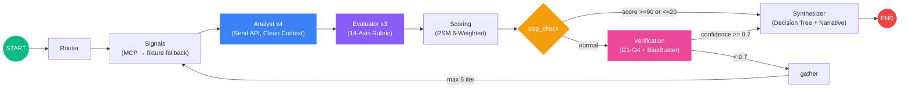

### 4 Analysts (Send API 병렬)

| Analyst | 역할 | Clean Context |
|---------|------|---------------|
| `game_mechanics` | 게임 메커니즘 적합성 평가 | `analyses` 필드 제외 (앵커링 방지) |
| `player_experience` | 플레이어 경험/감성 분석 | 동일 |
| `growth_potential` | 성장 잠재력/시장 확장성 | 동일 |
| `discovery` | 발견 가능성/접근성 분석 | 동일 |

### 3 Evaluators (14-Axis Rubric)

| Evaluator | 축 | 축 ID |
|-----------|-----|-------|
| `quality_judge` | 8축 | A, B, C, B1, C1, C2, M, N |
| `hidden_value` | 3축 | D (Discovery), E (Exposure), F (Fandom) |
| `community_momentum` | 3축 | J, K, L |

Prospect Mode (비게임화 IP): `prospect_judge` 1개 (9축: G, H, I, O, P, Q, R, S, T).

### Scoring Formula

```
Final = (0.25*PSM + 0.20*Quality + 0.18*Recovery + 0.12*Growth + 0.20*Momentum + 0.05*Dev)
        * (0.7 + 0.3 * Confidence/100)

Tier: S >= 80, A >= 60, B >= 40, C < 40
```

### Cause Classification (Decision Tree)

D-E-F 축 기반 코드 분류 (LLM이 아닌 룰 기반):

| 조건 | 분류 | 권장 조치 |
|------|------|----------|
| D>=3, E>=3 | `conversion_failure` | 전환 최적화 |
| D>=3, E<3 | `undermarketed` | 마케팅 강화 |
| D<=2, E>=3 | `monetization_misfit` | 수익 모델 재설계 |
| D<=2, E<=2, F>=3 | `niche_gem` | 니치 커뮤니티 육성 |
| D<=2, E<=2, F<=2 | `discovery_failure` | 노출 확대 |

### Verification (5-Layer)

| Layer | 메커니즘 | 기준 |
|-------|----------|------|
| **G1-G4** | Schema, Range, Grounding, 2sigma Consistency | 구조적 무결성 |
| **BiasBuster** | 6 bias types (REAE framework), CV-based fast path | CV < 0.05 → anchoring flag |
| **Cross-LLM** | Claude Opus 4.6 + GPT-5.4, Krippendorff's alpha | agreement >= 0.67 |
| **Confidence Gate** | 신뢰도 판정 | >= 0.7 → proceed, else loopback (max 5) |
| **Rights Risk** | IP 권리 리스크 | CLEAR / NEGOTIABLE / RESTRICTED |

### Core Fixtures (golden set)

| IP | Tier | Score | Cause | Genre |
|----|------|-------|-------|-------|
| Berserk | S | 81.3 | conversion_failure | Dark Fantasy |
| Cowboy Bebop | A | 68.4 | undermarketed | SF Noir |
| Ghost in the Shell | B | 51.6 | discovery_failure | Cyberpunk |

**Steam Fixtures**: 201개 추가 게임 데이터 (`core/fixtures/steam/`).

---

## Dynamic Graph

파이프라인 토폴로지를 분석 결과에 따라 실행 시점에 동적으로 변형합니다.

| 점수 범위 | 동작 | 이유 |
|-----------|------|------|
| >= 90 또는 <= 20 | verification 건너뛰기 → 바로 synthesizer | 극단 점수는 검증 불필요 |
| 40 ~ 80 | `enrichment_needed=True`, confidence 임계값 +0.1 | 모호한 중간 점수 → 재평가 유도 |
| 그 외 | 정상 verification 경로 | 표준 흐름 |

---

## Signal Liveification

MCP 어댑터 우선 호출 → fixture fallback 전략으로 시그널을 수집합니다.

| signal_source | 조건 | 설명 |
|---------------|------|------|
| `live` | MCP 반환 데이터 키 >= 2개 | 충분한 라이브 데이터 |
| `mixed` | MCP 반환 1개 + fixture 존재 | live 값이 fixture를 override |
| `fixture` | MCP 미연결/에러 | 자동 fallback |

---

## LangSmith Observability

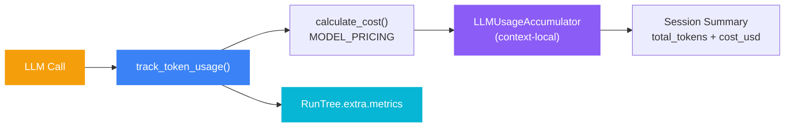

- **Prompt Caching**: Anthropic `cache_control: {"type": "ephemeral"}` 적용. 시스템 프롬프트와 루브릭 캐시로 40-60% 비용 절감.
- **Checkpoint**: `SqliteSaver`로 파이프라인 상태 영속화. 장애 시 마지막 체크포인트부터 재개.
- **Dynamic Tools**: `ToolRegistry` + `get_agentic_tools()` — 플러그인 런타임 등록. MCP 자동설치 후 `refresh_tools()` 핫 리로드.

---

## Project Structure

```
core/
├── cli/                        # CLI + Agentic Loop + Sub-Agent
│   ├── __init__.py             # Typer app, REPL, pipeline execution
│   ├── agentic_loop.py         # while(tool_use) multi-round execution + Token Guard
│   ├── error_recovery.py       # ErrorRecoveryStrategy (retry → alternative → fallback → escalate)
│   ├── sub_agent.py            # SubAgentManager + SubAgentResult + ErrorCategory
│   ├── tool_executor.py        # Tool dispatch + HITL approval gate
│   ├── system_prompt.py        # System prompt builder for AgenticLoop
│   ├── conversation.py         # Multi-turn sliding-window (max 200 turns, server-side clear_tool_uses)
│   ├── bash_tool.py            # Shell execution + HITL safety gate
│   ├── batch.py                # Batch analysis (ThreadPoolExecutor)
│   ├── commands.py             # Slash command dispatch (21 commands)
│   ├── project_detect.py       # Project type auto-detection (7 types)
│   ├── search.py               # IP search engine (synonym expansion)
│   └── startup.py              # Readiness check, Graceful Degradation
├── config.py                   # Settings (pydantic-settings, 57 vars)
├── state.py                    # GeodeState (TypedDict + Pydantic models)
├── graph.py                    # LangGraph StateGraph + skip_check node
├── runtime.py                  # GeodeRuntime (production DI wiring)
├── infrastructure/
│   ├── ports/                  # LLMClientPort, SignalEnrichmentPort, DomainPort
│   └── adapters/
│       ├── llm/                # ClaudeAdapter, OpenAIAdapter
│       └── mcp/                # Steam, Brave, LinkedIn + CompositeSignalAdapter + catalog (42)
├── llm/                        # LLM client (prompt caching, streaming, cost tracking)
├── memory/                     # 4-Tier: SOUL → User Profile → Organization → Project → Session
├── nodes/                      # Pipeline nodes (router, signals, analyst, evaluator, scoring, verification, gather, synthesizer)
├── orchestration/
│   ├── hooks.py                # HookSystem (36 events + async atrigger)
│   ├── goal_decomposer.py      # GoalDecomposer (compound request → sub-goal DAG)
│   ├── plan_mode.py            # DRAFT → APPROVED → EXECUTING (MANUAL / AUTO)
│   ├── task_system.py          # TaskGraph DAG (dependency, cycle detection)
│   ├── coalescing.py           # CoalescingQueue (250ms dedup window)
│   ├── isolated_execution.py   # IsolatedRunner (MAX_CONCURRENT=5)
│   └── ...                     # planner, bootstrap, lane_queue, run_log, etc.
├── automation/                 # Feedback loop, drift detection, scheduler, triggers
├── domains/                    # Domain plugin adapters (GameIPDomain)
├── tools/                      # Tool Protocol + Registry + Policy + definitions.json
├── verification/               # Guardrails (G1-G4) + BiasBuster + Rights Risk
├── extensibility/              # Report generation + Skills + AgentRegistry
├── fixtures/                   # Fixture data (3 core IPs + 201 Steam)
├── auth/                       # API key rotation, cooldown, profiles
├── ui/                         # Rich console + Claude Code-style agentic UI
└── mcp_server.py               # FastMCP server (6 tools, 2 resources)
```

---

## Design Choices

- **Natural language first.** 자연어 한 줄이 입력이고, 에이전트가 도구 선택부터 결과 종합까지 자율적으로 수행한다.
- **`while(tool_use)` as primitive.** 모든 자율 행동은 하나의 루프에서 나온다. 서브에이전트도, 계획 실행도, 배치 분석도 전부 AgenticLoop 인스턴스.
- **Port/Adapter DI.** 모든 인프라는 `Protocol` 포트 + `contextvars` 주입. LLM, 메모리, MCP 전부 교체 가능.
- **도메인은 플러그인.** `DomainPort` Protocol 구현체를 교체하면 어떤 도메인이든 동일한 자율 하네스 위에 탑재할 수 있다.
- **Safety by default.** DANGEROUS 도구는 항상 사용자 승인, Error Recovery에서도 제외, 서브에이전트에서도 제외.
- **Graceful degradation.** API 키 없으면 dry-run, MCP 미연결이면 fixture fallback, LLM 실패하면 retry chain.

---

*Source: `blog/legacy/docs/architecture.md` | Category: [[blog-legacy]]*

## Related

- [[blog-legacy]]
- [[blog-hub]]
- [[geode]]
- [[geode-architecture]]
