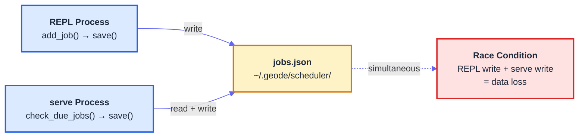
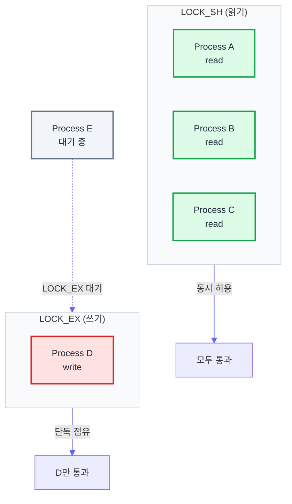

# fcntl.flock으로 에이전트 간 파일 경합 해결하기

> Date: 2026-03-30 | Author: geode-team | Tags: python, concurrency, file-locking, agent-system

## Table of Contents

1. [문제 상황 — 2개 프로세스가 같은 파일을 쓴다](#1-문제-상황)
2. [threading.Lock vs fcntl.flock](#2-threading-lock-vs-fcntl-flock)
3. [LOCK_EX vs LOCK_SH — 쓰기와 읽기의 분리](#3-lock_ex-vs-lock_sh)
4. [구현 — Lock File 분리 + Atomic Write](#4-구현)
5. [실제 코드 — scheduler.py의 save/load](#5-실제-코드)
6. [주의점 — 플랫폼 차이와 Advisory Lock의 한계](#6-주의점)

---

## 1. 문제 상황

GEODE는 두 개의 프로세스가 동시에 실행됩니다. 사용자가 직접 대화하는 **REPL** 프로세스(`uv run geode`)와, 백그라운드에서 Slack/Discord 메시지를 수신하고 스케줄을 실행하는 **serve** 프로세스(`geode serve`)입니다.

두 프로세스 모두 `~/.geode/scheduler/jobs.json`에 접근합니다. REPL에서 `/schedule add "매일 9시 AI 뉴스 조사"`를 실행하면 jobs.json에 새 잡을 추가하고, serve 프로세스의 스케줄러는 매 틱(60초)마다 같은 파일을 읽어 due 잡을 확인하고 상태를 갱신합니다.



구체적인 시나리오는 다음과 같습니다.

1. REPL이 `/schedule add`로 새 잡을 추가합니다. `save()`가 jobs.json을 쓰기 시작합니다.
2. 거의 동시에 serve의 스케줄러 틱이 발생합니다. `check_due_jobs()`가 jobs.json을 읽고, 잡 상태를 갱신한 뒤 `save()`를 호출합니다.
3. serve의 `save()`가 REPL의 `save()`보다 늦게 완료되면, REPL이 추가한 새 잡이 사라집니다.

이것이 고전적인 **lost update** 문제입니다. 파일 시스템 수준의 동기화 없이는 해결할 수 없습니다.

---

## 2. threading.Lock vs fcntl.flock

Python 개발자가 동시성 문제를 만나면 가장 먼저 떠올리는 것은 `threading.Lock`입니다. GEODE의 `SchedulerService`도 내부적으로 `threading.Lock`을 사용합니다.

```python
# core/automation/scheduler.py
class SchedulerService:
    def __init__(self, ...):
        self._lock = threading.Lock()

    def add_job(self, job: ScheduledJob) -> None:
        with self._lock:
            # ... 잡 추가 로직
```

하지만 `threading.Lock`은 **같은 프로세스 내의 스레드 간 동기화**만 보장합니다. 서로 다른 프로세스는 각각 독립된 메모리 공간을 가지므로, 한 프로세스의 Lock 객체가 다른 프로세스에 영향을 줄 수 없습니다.

| 속성 | `threading.Lock` | `fcntl.flock` |
|------|:-----------------:|:-------------:|
| 동기화 범위 | 프로세스 내 스레드 | 프로세스 간 (OS 커널) |
| 메커니즘 | 유저스페이스 뮤텍스 | 파일 디스크립터 기반 커널 락 |
| 교착 감지 | 없음 | 없음 (advisory) |
| 자동 해제 | 스레드 종료 시 | 파일 디스크립터 close 시 |
| 플랫폼 | 모든 OS | Unix/macOS (Windows는 `msvcrt.locking`) |

프로세스 간 동기화가 필요할 때 Unix 계열에서 가장 가벼운 선택지는 `fcntl.flock`입니다. 커널이 파일 디스크립터 수준에서 락을 관리하므로, 두 프로세스가 같은 lock file을 열면 커널이 직접 중재합니다.

---

## 3. LOCK_EX vs LOCK_SH

`fcntl.flock`은 두 가지 모드의 락을 제공합니다.

```python
import fcntl

# Exclusive lock (쓰기) — 한 번에 하나의 프로세스만 획득 가능
fcntl.flock(fd, fcntl.LOCK_EX)

# Shared lock (읽기) — 여러 프로세스가 동시에 획득 가능
# 단, LOCK_EX가 걸려 있으면 대기
fcntl.flock(fd, fcntl.LOCK_SH)

# Non-blocking — 즉시 획득 실패 시 BlockingIOError
fcntl.flock(fd, fcntl.LOCK_EX | fcntl.LOCK_NB)
```

이 모델은 데이터베이스의 read/write lock과 동일합니다.



| 현재 상태 | LOCK_SH 요청 | LOCK_EX 요청 |
|:---------:|:------------:|:------------:|
| 락 없음 | 즉시 획득 | 즉시 획득 |
| LOCK_SH 보유 (1개 이상) | 즉시 획득 | 대기 (모든 SH 해제까지) |
| LOCK_EX 보유 | 대기 | 대기 |

스케줄러의 경우, `save()`는 `LOCK_EX`를, `load()`는 `LOCK_SH`를 사용합니다. 여러 프로세스가 동시에 잡 목록을 읽는 것은 안전하지만, 쓰기는 반드시 단독으로 수행되어야 합니다.

---

## 4. 구현

### Lock File 분리 패턴

데이터 파일 자체에 락을 거는 대신, 별도의 `.lock` 파일을 사용합니다. 이유는 두 가지입니다.

1. **Atomic write와의 충돌 방지**: `os.replace(tmp, target)`은 target 파일을 교체하므로, target에 직접 락을 걸면 교체 시점에 파일 디스크립터가 무효화됩니다.
2. **락 파일의 수명 분리**: 데이터 파일은 교체되지만, 락 파일은 항상 존재합니다.

```
~/.geode/scheduler/
  jobs.json          # 데이터 (atomic write로 교체됨)
  jobs.json.lock     # 락 파일 (항상 존재, 내용 없음)
```

### Atomic Write (tmp + rename)

파일을 직접 덮어쓰면 쓰기 중 프로세스가 죽었을 때 파일이 반쪽짜리가 됩니다. `tmp + rename` 패턴은 이를 방지합니다.

GEODE의 `core/utils/atomic_io.py`가 이 패턴을 구현합니다.

```python
# core/utils/atomic_io.py
def atomic_write_text(path: Path, content: str, *, encoding: str = "utf-8") -> None:
    path = Path(path)
    path.parent.mkdir(parents=True, exist_ok=True)

    fd, tmp_path = tempfile.mkstemp(
        dir=path.parent,
        prefix=f".{path.name}.",
        suffix=".tmp",
    )
    try:
        with os.fdopen(fd, "w", encoding=encoding) as f:
            f.write(content)
            f.flush()
            os.fsync(f.fileno())
        os.replace(tmp_path, str(path))
    except BaseException:
        import contextlib
        with contextlib.suppress(OSError):
            os.unlink(tmp_path)
        raise
```

핵심은 세 단계입니다.

1. **같은 디렉토리에 임시 파일 생성** — `tempfile.mkstemp(dir=path.parent)`. 같은 파일시스템이어야 `os.replace`가 atomic합니다.
2. **쓰기 + fsync** — `os.fsync(f.fileno())`로 커널 버퍼까지 디스크에 플러시합니다.
3. **원자적 교체** — `os.replace(tmp_path, str(path))`. POSIX에서 rename은 같은 파일시스템 내에서 atomic입니다.

### fcntl.flock + Atomic Write 조합

두 패턴을 결합하면 다음과 같습니다.

```python
import fcntl
import json
import os
import tempfile
from pathlib import Path


def save_with_lock(data: dict, path: Path) -> None:
    """프로세스 간 안전한 atomic write."""
    lock_path = path.with_suffix(path.suffix + ".lock")
    lock_path.parent.mkdir(parents=True, exist_ok=True)
    lock_path.touch(exist_ok=True)

    with open(lock_path) as lock_fd:
        fcntl.flock(lock_fd, fcntl.LOCK_EX)  # 배타적 락 획득 (대기)
        try:
            payload = json.dumps(data, ensure_ascii=False, indent=2)
            fd, tmp = tempfile.mkstemp(dir=path.parent, suffix=".tmp")
            with os.fdopen(fd, "w") as f:
                f.write(payload)
                f.flush()
                os.fsync(f.fileno())
            os.replace(tmp, str(path))
        finally:
            fcntl.flock(lock_fd, fcntl.LOCK_UN)  # 락 해제


def load_with_lock(path: Path) -> dict:
    """프로세스 간 안전한 read."""
    lock_path = path.with_suffix(path.suffix + ".lock")
    if not path.exists():
        return {}

    with open(lock_path) as lock_fd:
        fcntl.flock(lock_fd, fcntl.LOCK_SH)  # 공유 락 획득
        try:
            with open(path) as f:
                return json.load(f)
        finally:
            fcntl.flock(lock_fd, fcntl.LOCK_UN)
```

`LOCK_EX`가 걸린 동안에는 다른 프로세스의 `LOCK_SH`도 `LOCK_EX`도 대기합니다. `LOCK_SH`가 걸린 동안에는 다른 프로세스의 `LOCK_SH`는 통과하지만, `LOCK_EX`는 대기합니다. 이것만으로 lost update 문제가 해결됩니다.

---

## 5. 실제 코드

### scheduler.py의 save()와 load()

현재 GEODE의 `SchedulerService`는 프로세스 내 `threading.Lock`과 atomic write를 사용합니다.

```python
# core/automation/scheduler.py
class SchedulerService:
    def save(self) -> None:
        """Atomically persist the job store to disk (tmp + rename)."""
        path = Path(self._store_path)
        path.parent.mkdir(parents=True, exist_ok=True)
        data = {jid: _job_to_dict(j) for jid, j in self._jobs.items()}
        payload = json.dumps(data, ensure_ascii=False, indent=2)
        tmp_path = path.with_suffix(".json.tmp")
        with open(tmp_path, "w", encoding="utf-8") as f:
            f.write(payload)
        os.replace(str(tmp_path), str(path))

    def load(self) -> None:
        """Load job store from disk."""
        path = Path(self._store_path)
        if not path.exists():
            return
        with open(path, encoding="utf-8") as f:
            data: dict[str, Any] = json.load(f)
        loaded = 0
        for _jid, jdata in data.items():
            try:
                job = _job_from_dict(jdata)
                self._jobs[job.job_id] = job
                loaded += 1
            except Exception as exc:
                log.warning("Skipping malformed job entry: %s", exc)
```

`save()`는 이미 tmp + rename 패턴을 사용하고 있으므로, 쓰기 중 크래시로 인한 파일 손상은 방지됩니다. 하지만 두 프로세스가 동시에 `save()`를 호출하면 여전히 lost update가 발생합니다. `os.replace`는 atomic이지만, 두 프로세스가 각각 "읽기 → 수정 → 쓰기"를 독립적으로 수행하면 나중에 쓴 쪽이 먼저 쓴 쪽의 변경을 덮어씁니다.

### fcntl.flock 적용 시

`save()`와 `load()`를 프로세스 간 안전하게 만들려면 `fcntl.flock`을 추가합니다.

```python
import fcntl

class SchedulerService:
    def save(self) -> None:
        path = Path(self._store_path)
        path.parent.mkdir(parents=True, exist_ok=True)
        lock_path = path.with_suffix(".json.lock")
        lock_path.touch(exist_ok=True)

        with open(lock_path) as lock_fd:
            fcntl.flock(lock_fd, fcntl.LOCK_EX)
            try:
                data = {jid: _job_to_dict(j) for jid, j in self._jobs.items()}
                payload = json.dumps(data, ensure_ascii=False, indent=2)
                tmp_path = path.with_suffix(".json.tmp")
                with open(tmp_path, "w", encoding="utf-8") as f:
                    f.write(payload)
                    f.flush()
                    os.fsync(f.fileno())
                os.replace(str(tmp_path), str(path))
            finally:
                fcntl.flock(lock_fd, fcntl.LOCK_UN)

    def load(self) -> None:
        path = Path(self._store_path)
        if not path.exists():
            return
        lock_path = path.with_suffix(".json.lock")
        lock_path.touch(exist_ok=True)

        with open(lock_path) as lock_fd:
            fcntl.flock(lock_fd, fcntl.LOCK_SH)
            try:
                with open(path, encoding="utf-8") as f:
                    data = json.load(f)
            finally:
                fcntl.flock(lock_fd, fcntl.LOCK_UN)
        # 파싱은 락 해제 후 수행 (락 점유 시간 최소화)
        for _jid, jdata in data.items():
            job = _job_from_dict(jdata)
            self._jobs[job.job_id] = job
```

`load()`에서 JSON 파싱을 락 해제 후 수행하는 것이 포인트입니다. 락 점유 시간을 최소화하면 다른 프로세스의 대기 시간이 줄어듭니다.

---

## 6. 주의점

### macOS vs Linux 동작 차이

`fcntl.flock`은 두 플랫폼 모두에서 동작하지만, 내부 구현이 다릅니다.

| 동작 | macOS | Linux |
|------|:-----:|:-----:|
| 구현 | BSD `flock()` syscall | POSIX `flock()` 또는 `fcntl()` 에뮬레이션 |
| `fork()` 후 자식 | 부모의 락 공유 | 부모의 락 공유 |
| `dup()/dup2()` | 같은 락 공유 | 같은 락 공유 |
| `open()` 두 번 | **별개의 락** | **별개의 락** |
| NFS 지원 | 없음 | 일부 (NLM 프로토콜) |

가장 주의할 점은 **`open()`을 두 번 호출하면 별개의 락**이라는 것입니다. 같은 프로세스 내에서도 같은 파일을 두 번 열면 서로 다른 file description이 되어 독립적인 락이 됩니다. 이것이 lock file을 `with open(lock_path)` 한 번만 여는 이유입니다.

### Advisory Lock의 한계

`fcntl.flock`은 **advisory lock**입니다. 커널이 락을 무시하는 프로세스의 파일 접근을 차단하지 않습니다. 즉, `flock`을 호출하지 않는 프로세스가 jobs.json을 직접 열어 쓰면 락이 무의미합니다.

```python
# 이 코드는 flock을 무시하고 직접 쓸 수 있음 — advisory이므로 막을 수 없음
with open("~/.geode/scheduler/jobs.json", "w") as f:
    json.dump(data, f)
```

이것이 **mandatory lock** (Linux의 `mount -o mand` + `chmod g+s,-x`)과의 차이입니다. 하지만 mandatory lock은 대부분의 현대 파일시스템에서 deprecated이며, macOS에서는 지원하지 않습니다. Advisory lock만으로 충분한 이유는, 동일한 코드베이스의 프로세스들이 **모두 같은 규약(protocol)**을 따르도록 강제할 수 있기 때문입니다.

### NFS에서의 문제

`fcntl.flock`은 **로컬 파일시스템에서만 신뢰할 수 있습니다.** NFS v3에서 `flock`은 로컬 락으로만 동작하며, NFS v4에서는 서버에 위임될 수 있지만 네트워크 파티션 시 보장이 없습니다.

네트워크 파일시스템에서 프로세스 간 동기화가 필요하면 다음을 고려해야 합니다.

- **`fcntl.lockf`** (POSIX record locks) — NFS에서 더 잘 동작하지만, `fork()` 시 자식에게 상속되지 않음
- **`O_EXCL` + `mkdir`** — 디렉토리 생성의 원자성을 이용한 고전적 패턴
- **외부 코디네이터** — Redis, etcd, ZooKeeper 등

GEODE의 `~/.geode/` 디렉토리는 항상 로컬 파일시스템에 존재하므로, `fcntl.flock`이 가장 적합한 선택입니다.

### Context Manager 패턴

실무에서는 `try/finally`보다 context manager로 감싸는 것이 안전합니다. 파일 객체의 `with` 블록이 끝나면 `close()`가 호출되고, `close()` 시 커널이 해당 file description의 모든 `flock` 락을 자동 해제합니다.

```python
from contextlib import contextmanager
from collections.abc import Generator

@contextmanager
def file_lock(path: Path, *, shared: bool = False) -> Generator[None, None, None]:
    """프로세스 간 파일 락 context manager."""
    lock_path = path.with_suffix(path.suffix + ".lock")
    lock_path.parent.mkdir(parents=True, exist_ok=True)
    lock_path.touch(exist_ok=True)

    mode = fcntl.LOCK_SH if shared else fcntl.LOCK_EX
    with open(lock_path) as lock_fd:
        fcntl.flock(lock_fd, mode)
        try:
            yield
        finally:
            fcntl.flock(lock_fd, fcntl.LOCK_UN)
```

사용부는 한 줄이 됩니다.

```python
with file_lock(store_path):
    atomic_write_json(store_path, data)

with file_lock(store_path, shared=True):
    data = json.loads(store_path.read_text())
```

---

## Wrap-up

| Item | Description |
|------|-------------|
| Problem | 2개 프로세스(REPL + serve)가 동일한 jobs.json을 동시에 읽고 쓰는 lost update |
| Why not threading.Lock | 프로세스 내 동기화만 지원 -- 별개 프로세스에 영향 없음 |
| Solution | `fcntl.flock` (LOCK_EX/LOCK_SH) + lock file 분리 + atomic write (tmp + rename) |
| Key decisions | Lock file을 데이터 파일과 분리, 읽기에 LOCK_SH 사용 (동시 읽기 허용), 파싱은 락 해제 후 수행 |
| Limitations | advisory lock (비협조적 프로세스 차단 불가), NFS 미지원, macOS/Linux 구현 차이 |

### Checklist

- [x] `threading.Lock`은 프로세스 간 동기화에 사용할 수 없음을 확인
- [x] `fcntl.flock`의 LOCK_EX/LOCK_SH 시맨틱 이해
- [x] Lock file 분리 패턴 — atomic write와 충돌 방지
- [x] `os.replace`가 같은 파일시스템에서만 atomic임을 확인
- [x] `os.fsync`로 커널 버퍼 플러시 필수
- [x] advisory lock의 한계 인지 — 코드베이스 내 규약 준수 필요

---

*Source: `blog/posts/technical/fcntl-flock-interprocess-locking.md` | Category: [[blog-technical]]*

## Related

- [[blog-technical]]
- [[blog-hub]]
- [[geode]]
