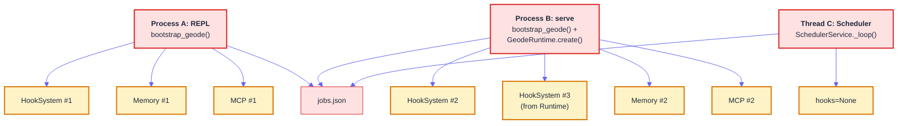
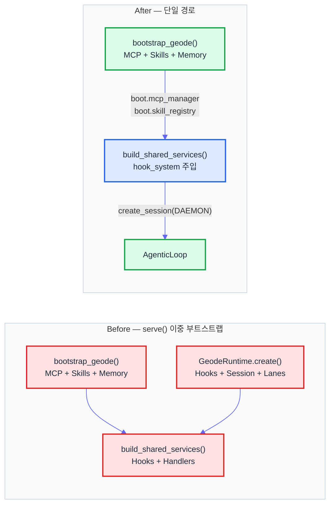
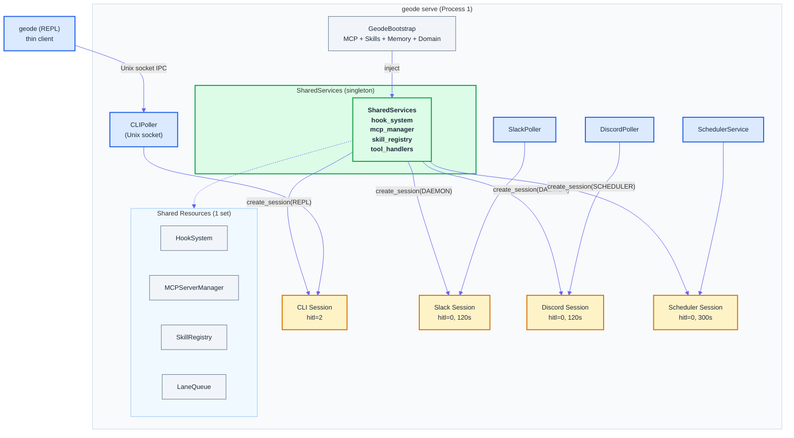

# Gateway Runtime 3-Phase 아키텍처 — 프로세스 3개에서 1개로

> Date: 2026-03-30 | Author: geode-team | Tags: agent-architecture, gateway-runtime, bootstrap, ipc, frontier-research

## Table of Contents

1. [문제 정의 — 리소스 이중 생성의 비용](#1-문제-정의)
2. [Phase 1: Bootstrap 통합 (#530)](#2-phase-1-bootstrap-통합)
3. [Phase 2: Scheduler Hardening (#531)](#3-phase-2-scheduler-hardening)
4. [Phase 3: CLIChannel IPC (#531)](#4-phase-3-clichannel-ipc)
5. [최종 아키텍처](#5-최종-아키텍처)
6. [설계 원칙 회고](#6-설계-원칙-회고)

---

## 1. 문제 정의

GEODE에는 세 개의 독립 프로세스가 존재합니다 — REPL(`geode`), Gateway 데몬(`geode serve`), 스케줄러(내부 `SchedulerService`). 각각이 자신만의 MCP, HookSystem, Skills, Memory를 독립적으로 생성하고 있었습니다.

```
$ geode                 # Process A: REPL — 자체 bootstrap
$ geode serve           # Process B: Gateway — 자체 bootstrap + GeodeRuntime.create()
# (serve 내부)          # Thread C: Scheduler — 별도 AgenticLoop
```

이 구조에서 발생하는 세 가지 근본 문제가 있었습니다.

### 1.1. jobs.json 경합

REPL과 serve가 동시에 실행되면 `~/.geode/scheduler/jobs.json`을 두 프로세스가 동시에 읽고 씁니다. 파일 수준 잠금이 없으므로 마지막 쓰기가 앞선 변경을 덮어쓰는 lost-update가 발생합니다.

### 1.2. 메모리 이중 사용

`serve()`는 `bootstrap_geode()`를 호출한 뒤 다시 `GeodeRuntime.create()`를 호출합니다. `GeodeRuntime.create()` 내부에서 HookSystem, SessionStore, LaneQueue, PolicyChain 등 인프라 싱글톤을 모두 새로 생성합니다. 결과적으로 동일한 프로세스 안에서 HookSystem이 2개, Memory가 2세트 존재하게 됩니다.

### 1.3. OpenClaw 원칙과의 GAP

OpenClaw의 핵심 설계 원칙은 **"Everything is a session"** 입니다. 모든 실행 경로가 단일 Gateway를 통과하고, 세션 키로 격리됩니다. GEODE의 현재 상태는 이와 정반대 — 3개 프로세스가 3개의 다른 세계를 만들고 있었습니다.



점선이 아닌 실선입니다 — 모두 실제로 생성되고 있었습니다. 특히 `serve` 프로세스 하나 안에 HookSystem이 2개(`bootstrap_geode()`에서 1개, `GeodeRuntime.create()`에서 1개) 존재했고, Scheduler 스레드는 hooks가 `None`이었습니다.

### 발견된 결함 분류

| ID | 분류 | 결함 | 심각도 |
|----|:----:|------|:------:|
| C1 | Critical | serve 내부 Dual HookSystem — 이벤트가 한쪽에만 발화 | CRITICAL |
| C2 | Critical | serve에서 bootstrap + Runtime 이중 부트스트랩 | CRITICAL |
| C3 | Critical | jobs.json 동시 접근 시 lost-update | CRITICAL |
| H1 | High | Scheduler 스레드에 ContextVar 미전파 | HIGH |
| H2 | High | LaneQueue acquire/release가 비동기 핸들오프 불가 | HIGH |
| H4 | High | 스케줄러 HookSystem 연결 누락 (hooks=None) | HIGH |
| H5 | High | serve 종료 시 Scheduler graceful drain 없음 | HIGH |
| M1 | Medium | 폴러 등록이 하드코딩 — 설정 기반 동적 등록 필요 | MEDIUM |
| M2 | Medium | 헤드리스 모드에서 위험 도구 차단 없음 | MEDIUM |
| M3 | Medium | 실행 중 잡이 stuck 상태로 무한 대기 가능 | MEDIUM |

이 10건의 결함을 3단계(Phase)로 해소합니다.

---

## 2. Phase 1: Bootstrap 통합

### 문제

`serve()` 함수의 기존 흐름은 다음과 같았습니다.

```python
# core/cli/__init__.py — serve() 기존 코드 (Before)
def serve(...):
    boot = bootstrap_geode(load_env=True)      # 1차 부트스트랩
    runtime = _build_runtime_for_serve()        # 2차 부트스트랩 (GeodeRuntime.create())
    _gw_services = build_shared_services(...)   # 3차: SharedServices 생성
```

`bootstrap_geode()`는 도메인, 메모리, MCP, 스킬을 초기화합니다. `GeodeRuntime.create()`는 내부에서 동일한 작업을 다시 수행합니다 — 결과적으로 HookSystem 2개, SessionStore 2개가 공존합니다. `SharedServices`는 또 다른 HookSystem을 `build_hooks()`로 생성합니다. 최악의 경우 HookSystem이 3개까지 존재할 수 있습니다.

### 해법

`serve()`가 `bootstrap_geode()` 대신 `GeodeBootstrap` 데이터를 직접 재사용하고, `SharedServices`를 유일한 세션 팩토리로 사용합니다.

```python
# After — serve() 내부 (Phase 1)
boot = bootstrap_geode(load_env=True)
_gw_services = build_shared_services(
    mcp_manager=boot.mcp_manager,
    skill_registry=boot.skill_registry,
    hook_system=hook_system,     # 단일 HookSystem 주입
)
# GeodeRuntime.create()는 Gateway 세션에만 사용 (도메인 파이프라인 전용)
```

핵심은 `build_shared_services()`가 `hook_system` 인자를 받지 않으면 자체적으로 새 HookSystem을 생성하지만, 명시적으로 주입하면 그것을 사용한다는 점입니다.

```python
# core/gateway/shared_services.py — build_shared_services()
def build_shared_services(
    *,
    mcp_manager: Any = None,
    skill_registry: Any = None,
    hook_system: Any = None,        # None이면 새로 생성, 아니면 재사용
    verbose: bool = False,
) -> SharedServices:
    if hook_system is None:
        from core.runtime_wiring.bootstrap import build_hooks
        hook_system, _run_log, _stuck = build_hooks(
            session_key=f"geode-{uuid.uuid4().hex[:8]}",
            run_id=uuid.uuid4().hex[:12],
            log_dir=Path.home() / ".geode" / "runs",
            stuck_timeout_s=getattr(_settings, "stuck_timeout_s", 600.0),
        )
    # ...
    return SharedServices(
        mcp_manager=mcp_manager,
        skill_registry=skill_registry,
        hook_system=hook_system,     # 주입된 인스턴스 그대로 사용
        tool_handlers=tool_handlers,
        # ...
    )
```

### Before/After 아키텍처



### 해결된 결함

| ID | 결함 | 해소 방법 |
|----|------|----------|
| C1 | Dual HookSystem | `build_shared_services(hook_system=...)` 명시 주입 |
| C2 | Dual Bootstrap | `GeodeRuntime.create()`를 도메인 파이프라인 전용으로 한정 |
| H1 | ContextVar 미전파 | `create_session(propagate_context=True)` |
| H4 | Scheduler hooks=None | SharedServices에서 hooks 자동 주입 |
| H5 | Graceful drain | SharedServices에 종료 훅 등록 |

`create_session()`은 모든 모드에서 동일한 공유 자원을 주입합니다. 코드에서 이 보장을 확인할 수 있습니다.

```python
# core/gateway/shared_services.py — create_session()
def create_session(
    self,
    mode: SessionMode,
    *,
    propagate_context: bool = False,
    # ...
) -> tuple[ToolExecutor, AgenticLoop]:
    if propagate_context:
        self._propagate_contextvars()

    defaults = _MODE_DEFAULTS[mode]
    # ...
    executor = ToolExecutor(
        action_handlers=self.tool_handlers,
        mcp_manager=self.mcp_manager,
        sub_agent_manager=sub_mgr,
        hitl_level=hitl,
        hooks=self.hook_system,          # 항상 주입
    )
    loop = AgenticLoop(
        conversation,
        executor,
        mcp_manager=self.mcp_manager,    # 항상 주입
        skill_registry=self.skill_registry,  # 항상 주입
        hooks=self.hook_system,          # 항상 주입
        # ...
    )
```

`hooks=self.hook_system`이 `None`일 수 없는 이유는 `build_shared_services()`가 `hook_system is None`일 때 자동으로 새 인스턴스를 생성하기 때문입니다. 구조적으로 누락이 불가능합니다.

---

## 3. Phase 2: Scheduler Hardening

Phase 1에서 "하나의 팩토리"가 확보되었습니다. Phase 2는 그 팩토리 위에서 스케줄러가 안전하게 동작하도록 5건의 결함을 해소합니다.

### C3: fcntl.flock — 파일 단위 잠금

`jobs.json`의 동시 접근 문제는 OS 수준 파일 잠금으로 해결합니다. Python의 `fcntl.flock`은 advisory lock이지만, GEODE 내부의 모든 접근 경로가 이 함수를 경유하면 충분합니다.

```python
# core/automation/scheduler.py — save() / load() (Phase 2 설계)
import fcntl

def save(self) -> None:
    """Atomically persist the job store with file-level locking."""
    path = Path(self._store_path)
    path.parent.mkdir(parents=True, exist_ok=True)
    data = {jid: _job_to_dict(j) for jid, j in self._jobs.items()}
    payload = json.dumps(data, ensure_ascii=False, indent=2)
    tmp_path = path.with_suffix(".json.tmp")
    with open(tmp_path, "w", encoding="utf-8") as f:
        f.write(payload)
    # LOCK_EX: exclusive lock for write — blocks until acquired
    with open(path, "a+", encoding="utf-8") as lock_f:
        fcntl.flock(lock_f, fcntl.LOCK_EX)
        try:
            os.replace(str(tmp_path), str(path))
        finally:
            fcntl.flock(lock_f, fcntl.LOCK_UN)

def load(self) -> None:
    """Load job store with shared lock (concurrent reads OK)."""
    path = Path(self._store_path)
    if not path.exists():
        return
    # LOCK_SH: shared lock for read — multiple readers OK
    with open(path, encoding="utf-8") as f:
        fcntl.flock(f, fcntl.LOCK_SH)
        try:
            data = json.load(f)
        finally:
            fcntl.flock(f, fcntl.LOCK_UN)
    # ... deserialize jobs
```

| 연산 | 잠금 모드 | 동시성 |
|------|:---------:|--------|
| `load()` | `LOCK_SH` (shared) | 여러 프로세스 동시 읽기 가능 |
| `save()` | `LOCK_EX` (exclusive) | 한 프로세스만 쓰기, 나머지 대기 |

기존의 `save()`는 이미 `tmp + os.replace` 패턴으로 원자적 쓰기를 구현하고 있었습니다. `flock`은 그 위에 프로세스 간 상호 배제를 추가합니다.

### H2: Lane.try_acquire() / manual_release() — 비동기 패턴의 소유권 이전

기존 `Lane.acquire()`는 컨텍스트 매니저 전용입니다 — `with lane.acquire(key):` 블록 안에서만 슬롯을 점유할 수 있습니다. 하지만 Gateway의 메시지 처리는 "폴러 스레드에서 acquire → 프로세서 스레드에서 실행 → 완료 후 release"라는 비동기 핸들오프가 필요합니다.

```python
# core/orchestration/lane_queue.py — Phase 2 확장 설계
class Lane:
    def try_acquire(self, key: str, *, timeout_s: float | None = None) -> bool:
        """Non-blocking acquire. Returns True if slot acquired.

        Unlike acquire() context manager, caller is responsible for
        calling manual_release() when work is done.
        Enables cross-thread ownership transfer.
        """
        wait = timeout_s if timeout_s is not None else self.timeout_s
        acquired = self._semaphore.acquire(timeout=wait)
        if not acquired:
            self._stats.inc_timeouts()
            return False
        with self._lock:
            self._active[key] = time.time()
        self._stats.inc_acquired()
        return True

    def manual_release(self, key: str) -> bool:
        """Explicitly release a slot acquired via try_acquire().

        Returns True if key was found and released.
        Safe to call from a different thread than try_acquire().
        """
        with self._lock:
            if key not in self._active:
                return False
            self._active.pop(key)
        self._stats.inc_released()
        self._semaphore.release()
        return True
```

기존 `acquire()` 컨텍스트 매니저는 그대로 유지됩니다. `try_acquire()`/`manual_release()`는 비동기 패턴을 위한 추가 API입니다.

| API | 패턴 | 스레드 안전성 |
|-----|------|:------------:|
| `acquire()` | `with` 블록 — 자동 해제 | 단일 스레드 |
| `try_acquire()` + `manual_release()` | 명시적 acquire/release | 크로스 스레드 |

### M1: _POLLER_REGISTRY — config-driven 동적 등록

현재 폴러 등록은 `serve()` 함수 안에서 하드코딩되어 있습니다. 새 채널을 추가하려면 코드를 수정해야 합니다. Phase 2에서는 설정 기반 동적 등록으로 전환합니다.

```python
# core/gateway/pollers/ — Phase 2 설계
_POLLER_REGISTRY: dict[str, type[BasePoller]] = {
    "slack": SlackPoller,
    "discord": DiscordPoller,
    "telegram": TelegramPoller,
}

def create_pollers_from_config(
    config: dict[str, Any],
    channel_manager: ChannelManager,
    **kwargs: Any,
) -> list[BasePoller]:
    """Config-driven poller creation.

    Only instantiates pollers that appear in config and have
    is_configured() == True.
    """
    pollers = []
    for name, cls in _POLLER_REGISTRY.items():
        if name in config.get("gateway", {}).get("channels", []):
            poller = cls(channel_manager, **kwargs)
            if poller.is_configured():
                pollers.append(poller)
    return pollers
```

`BasePoller`의 인터페이스(`channel_name`, `_poll_once`, `is_configured`)는 이미 확립되어 있으므로, 레지스트리 패턴 적용은 기존 코드와 완전히 호환됩니다.

```python
# core/gateway/pollers/base.py — 기존 추상 인터페이스 (변경 없음)
class BasePoller(ABC):
    @property
    @abstractmethod
    def channel_name(self) -> str: ...

    @abstractmethod
    def _poll_once(self) -> None: ...

    @abstractmethod
    def is_configured(self) -> bool: ...
```

### M2: _HEADLESS_DENIED_TOOLS — 모드별 PolicyChain 적용

헤드리스 모드(serve, scheduler)에서는 `run_bash`, `delegate_task` 같은 위험 도구를 차단해야 합니다. 사람이 승인할 수 없기 때문입니다.

```python
# core/gateway/shared_services.py — Phase 2 설계
_HEADLESS_DENIED_TOOLS: frozenset[str] = frozenset({
    "run_bash",
    "delegate_task",
    "manage_rule",
})

def create_session(
    self,
    mode: SessionMode,
    *,
    # ...
) -> tuple[ToolExecutor, AgenticLoop]:
    # ... 기존 코드 ...

    # Headless modes: filter out dangerous tools
    handlers = self.tool_handlers
    if mode in (SessionMode.DAEMON, SessionMode.SCHEDULER):
        handlers = {
            k: v for k, v in handlers.items()
            if k not in _HEADLESS_DENIED_TOOLS
        }

    executor = ToolExecutor(
        action_handlers=handlers,   # 필터링된 핸들러
        # ...
    )
```

기존 `_MODE_DEFAULTS`가 행동(hitl, quiet, time)을 결정하듯, `_HEADLESS_DENIED_TOOLS`는 도구 접근 권한을 결정합니다. 두 가지 모두 `create_session()` 내부에서 자동 적용되므로 호출부는 모드만 지정하면 됩니다.

| Mode | hitl | 도구 필터 | 시간 제한 |
|------|:----:|:---------:|:---------:|
| REPL | 2 | 전체 허용 | unlimited |
| DAEMON | 0 | `_HEADLESS_DENIED_TOOLS` 차단 | 120s |
| SCHEDULER | 0 | `_HEADLESS_DENIED_TOOLS` 차단 | 300s |

### M3: detect_stuck_jobs() — running_since_ms 추적

기존 `StuckDetector`는 파이프라인 노드 수준의 stuck 감지를 담당합니다. 하지만 스케줄러 잡은 파이프라인이 아니라 `AgenticLoop.run()`을 직접 호출하므로, 별도의 잡 수준 stuck 감지가 필요합니다.

```python
# core/orchestration/stuck_detection.py — 기존 코드 (이미 구현됨)
class StuckDetector:
    def mark_running(self, session_key: str, *,
                     metadata: dict[str, Any] | None = None) -> None:
        with self._lock:
            self._running_jobs[session_key] = _JobRecord(
                session_key=session_key,
                started_at=time.time(),
                metadata=metadata or {},
            )

    def check_stuck(self) -> list[str]:
        now = time.time()
        stuck_keys: list[str] = []
        with self._lock:
            for key, record in list(self._running_jobs.items()):
                elapsed = now - record.started_at
                if elapsed >= self._timeout_s:
                    stuck_keys.append(key)
            for key in stuck_keys:
                self._running_jobs.pop(key, None)
                self._stats.released += 1
        # ...
        return stuck_keys
```

Phase 2에서는 `SchedulerService`가 잡 실행 시 `StuckDetector.mark_running()`을 호출하고, 완료 시 `mark_completed()`를 호출합니다. 임계값은 `_timeout_s` (기본 10분, 스케줄러 전용)로 별도 설정합니다.

```python
# core/automation/scheduler.py — _execute_job() Phase 2 확장 설계
def _execute_job(self, job: ScheduledJob, now_ms: float | None = None) -> dict:
    now = now_ms if now_ms is not None else time.time() * 1000
    session_key = f"scheduler:{job.job_id}"

    # Stuck detector 등록
    if self._stuck_detector:
        self._stuck_detector.mark_running(
            session_key, metadata={"job_id": job.job_id}
        )
    try:
        # ... 잡 실행 ...
        if job.callback is not None:
            job.callback({"job_id": job.job_id, "name": job.name, **job.metadata})
        elif job.action and self._action_queue is not None:
            self._action_queue.put((job.job_id, job.action, job.isolated))
    finally:
        if self._stuck_detector:
            self._stuck_detector.mark_completed(session_key)
```

---

## 4. Phase 3: CLIChannel IPC

Phase 1-2가 "단일 프로세스 내부의 정합성"을 해결했다면, Phase 3는 **프로세스 간 통신**을 해결합니다. REPL(`geode`)을 실행할 때 `geode serve`가 이미 돌고 있으면, REPL이 독자적으로 부트스트랩하는 대신 serve의 세션을 재사용합니다.

### 프로토콜 설계

line-delimited JSON over Unix domain socket. 각 메시지는 `\n`으로 구분된 단일 JSON 객체입니다.

```
→ {"type":"user_message","content":"summarize today's AI news","session_id":"repl-a1b2"}
← {"type":"assistant_chunk","content":"Today's major developments..."}
← {"type":"assistant_chunk","content":" include GPT-5.4 release."}
← {"type":"tool_use","name":"web_search","input":{"query":"AI news 2026-03-30"}}
← {"type":"tool_result","name":"web_search","output":"..."}
← {"type":"assistant_end","usage":{"input_tokens":1200,"output_tokens":350}}
```

Unix domain socket을 선택한 이유:

| 대안 | 장점 | 단점 |
|------|------|------|
| TCP localhost | 범용 | 포트 충돌, 방화벽, 보안 |
| Named pipe (FIFO) | 단순 | 단방향, 양방향 시 2개 필요 |
| **Unix domain socket** | 양방향, 빠름, 파일 권한으로 보안 | macOS/Linux 전용 |
| Shared memory | 최고 성능 | 직렬화 복잡, 동기화 어려움 |

GEODE의 대상 환경(macOS/Linux 개발자 머신)에서 Unix domain socket이 가장 적합합니다. 소켓 경로는 `~/.geode/geode.sock`입니다.

### CLIPoller — serve 측 소켓 서버

```python
# core/gateway/pollers/cli_poller.py — Phase 3 설계
class CLIPoller(BasePoller):
    """Unix domain socket server for CLI IPC.

    Accepts REPL connections and routes them through SharedServices
    as REPL-mode sessions.
    """

    SOCKET_PATH = Path.home() / ".geode" / "geode.sock"

    def __init__(
        self,
        channel_manager: ChannelManager,
        services: SharedServices,
        *,
        poll_interval_s: float = 0.1,
    ) -> None:
        super().__init__(channel_manager, poll_interval_s=poll_interval_s)
        self._services = services
        self._server_sock: socket.socket | None = None
        self._sessions: dict[str, ConversationContext] = {}

    @property
    def channel_name(self) -> str:
        return "cli"

    def is_configured(self) -> bool:
        return True  # Always available

    def start(self) -> None:
        """Bind Unix domain socket and start accept loop."""
        self.SOCKET_PATH.parent.mkdir(parents=True, exist_ok=True)
        if self.SOCKET_PATH.exists():
            self.SOCKET_PATH.unlink()
        self._server_sock = socket.socket(socket.AF_UNIX, socket.SOCK_STREAM)
        self._server_sock.bind(str(self.SOCKET_PATH))
        self._server_sock.listen(5)
        self._server_sock.settimeout(1.0)
        super().start()

    def _poll_once(self) -> None:
        """Accept one pending connection and handle it."""
        try:
            conn, _ = self._server_sock.accept()
            threading.Thread(
                target=self._handle_client,
                args=(conn,),
                daemon=True,
                name="cli-ipc-handler",
            ).start()
        except socket.timeout:
            pass

    def _handle_client(self, conn: socket.socket) -> None:
        """Handle a single CLI client connection."""
        with conn:
            reader = conn.makefile("r", encoding="utf-8")
            writer = conn.makefile("w", encoding="utf-8")
            for line in reader:
                msg = json.loads(line.strip())
                response = self._process_message(msg)
                writer.write(json.dumps(response) + "\n")
                writer.flush()

    def _process_message(self, msg: dict) -> dict:
        """Route a CLI message through SharedServices."""
        session_id = msg.get("session_id", "default")
        content = msg.get("content", "")

        ctx = self._sessions.get(session_id)
        if ctx is None:
            ctx = ConversationContext()
            self._sessions[session_id] = ctx

        _, loop = self._services.create_session(
            SessionMode.REPL,
            conversation=ctx,
            propagate_context=True,
        )
        result = loop.run(content)
        return {
            "type": "assistant_end",
            "content": result.text if result else "",
            "usage": {
                "input_tokens": getattr(result, "input_tokens", 0),
                "output_tokens": getattr(result, "output_tokens", 0),
            },
        }
```

### IPCClient — CLI 측 thin client

```python
# core/cli/ipc_client.py — Phase 3 설계
class IPCClient:
    """Thin IPC client for CLI → serve communication.

    Auto-detects running serve via socket file existence.
    Falls back to standalone mode if serve is not running.
    """

    SOCKET_PATH = Path.home() / ".geode" / "geode.sock"

    def __init__(self) -> None:
        self._sock: socket.socket | None = None
        self._session_id = f"repl-{uuid.uuid4().hex[:8]}"

    @classmethod
    def is_serve_running(cls) -> bool:
        """Check if geode serve is running by probing the socket."""
        if not cls.SOCKET_PATH.exists():
            return False
        try:
            sock = socket.socket(socket.AF_UNIX, socket.SOCK_STREAM)
            sock.settimeout(1.0)
            sock.connect(str(cls.SOCKET_PATH))
            sock.close()
            return True
        except (ConnectionRefusedError, OSError):
            # Stale socket file — serve crashed without cleanup
            cls.SOCKET_PATH.unlink(missing_ok=True)
            return False

    def connect(self) -> bool:
        """Establish IPC connection to serve."""
        try:
            self._sock = socket.socket(socket.AF_UNIX, socket.SOCK_STREAM)
            self._sock.connect(str(self.SOCKET_PATH))
            return True
        except OSError:
            self._sock = None
            return False

    def send(self, content: str) -> dict:
        """Send a message and receive response."""
        msg = {
            "type": "user_message",
            "content": content,
            "session_id": self._session_id,
        }
        self._sock.sendall((json.dumps(msg) + "\n").encode())
        reader = self._sock.makefile("r", encoding="utf-8")
        line = reader.readline()
        return json.loads(line)

    def close(self) -> None:
        if self._sock:
            self._sock.close()
            self._sock = None
```

### _thin_interactive_loop() — 자동 전환

REPL 시작 시 `IPCClient.is_serve_running()`으로 serve 감지를 시도합니다. 감지되면 IPC 모드로 동작하고, 감지되지 않으면 기존 standalone 모드로 폴백합니다.

```python
# core/cli/__init__.py — Phase 3 설계
def _thin_interactive_loop() -> None:
    """REPL entry point with automatic serve detection.

    If `geode serve` is running:
      → Connect via Unix socket, relay user input, render responses
    If not:
      → Full standalone bootstrap (current behavior)
    """
    from core.cli.ipc_client import IPCClient

    if IPCClient.is_serve_running():
        console.print("  [dim]Connected to geode serve (IPC mode)[/dim]")
        client = IPCClient()
        if client.connect():
            try:
                while True:
                    user_input = _prompt_input()
                    if user_input is None:
                        break
                    response = client.send(user_input)
                    _render_response(response)
            finally:
                client.close()
            return

    # Fallback: standalone mode (full bootstrap)
    _interactive_loop()
```

### 메시지 흐름

```mermaid
%%{init: {'theme': 'default', 'themeVariables': {'fontSize': '13px', 'fontFamily': 'arial', 'lineColor': '#6366F1', 'primaryColor': '#dbeafe', 'primaryBorderColor': '#3b82f6', 'primaryTextColor': '#1e293b'}}}%%
sequenceDiagram
    participant CLI as geode (REPL)
    participant IPC as IPCClient
    participant SOCK as Unix Socket
    participant CLIP as CLIPoller
    participant SS as SharedServices
    participant LOOP as AgenticLoop

    CLI->>IPC: is_serve_running()?
    IPC->>SOCK: connect probe
    SOCK-->>IPC: OK
    IPC-->>CLI: true

    CLI->>IPC: connect()
    IPC->>SOCK: socket.connect()

    loop Interactive loop
        CLI->>IPC: send("summarize AI news")
        IPC->>SOCK: {"type":"user_message",...}\n
        SOCK->>CLIP: accept → _handle_client
        CLIP->>CLIP: _process_message()
        CLIP->>SS: create_session(REPL)
        SS->>LOOP: AgenticLoop(hooks, mcp, skills)
        LOOP->>LOOP: run(content)
        LOOP-->>CLIP: AgenticResult
        CLIP-->>SOCK: {"type":"assistant_end",...}\n
        SOCK-->>IPC: response
        IPC-->>CLI: render
    end

    CLI->>IPC: close()
```

이 설계에서 REPL 프로세스는 **도구, MCP, 스킬, 메모리를 전혀 로드하지 않습니다.** 부트스트랩 비용이 0이고, 모든 리소스는 serve 프로세스의 `SharedServices` 하나에 집중됩니다.

---

## 5. 최종 아키텍처

### 전체 시스템 다이어그램



### OpenClaw target과의 비교

| 원칙 | OpenClaw | GEODE Before | GEODE After (3-Phase) |
|------|----------|:------------:|:---------------------:|
| Everything is a session | Gateway가 모든 경로를 소유 | 3개 독립 프로세스 | SharedServices가 모든 세션 생성 |
| Single factory | Gateway.createSession() | `_build_agentic_stack()` 4곳 | `create_session(mode)` 1곳 |
| Session-scoped isolation | Session Key hierarchy | plain global 변수 | ContextVar + session_key |
| Lane-based concurrency | Lane Queue per channel | LaneQueue 존재하나 미연결 | Gateway Lane + Scheduler Lane |
| Config-driven channels | Plugin registry | 하드코딩 | `_POLLER_REGISTRY` |
| Headless safety | Policy Chain per mode | 필터링 없음 | `_HEADLESS_DENIED_TOOLS` |
| File-level locking | Advisory lock | 미적용 | `fcntl.flock` |

### "프로세스 1개, 리소스 1세트" 달성 확인

| Metric | Before | Phase 1 | Phase 2 | Phase 3 |
|--------|:------:|:-------:|:-------:|:-------:|
| 프로세스 수 (동시 실행) | 2-3 | 2-3 | 2-3 | **1** |
| HookSystem 인스턴스 | 2-3 | 1 | 1 | 1 |
| MCP 인스턴스 | 2-3 | 1 | 1 | 1 |
| jobs.json 경합 | lost-update | lost-update | flock 보호 | flock 보호 |
| Scheduler hooks | None | injected | injected | injected |
| 위험 도구 차단 (headless) | 미적용 | 미적용 | 적용 | 적용 |
| REPL 부트스트랩 비용 | full (~3s) | full (~3s) | full (~3s) | **0 (IPC)** |

---

## 6. 설계 원칙 회고

### Karpathy P1: CANNOT before CAN

> "Guardrails come before freedom. Constraints guarantee quality."

3-Phase 계획에서도 CANNOT(제약)을 먼저 정의했습니다.

- **CANNOT**: 동일 프로세스에서 HookSystem 2개 생성 (C1, C2)
- **CANNOT**: 파일 잠금 없이 jobs.json 동시 접근 (C3)
- **CANNOT**: 헤드리스 모드에서 위험 도구 실행 (M2)

제약이 확보된 뒤에야 자유(새 폴러 추가, IPC 프로토콜 확장)를 허용합니다.

### Steinberger: Everything is a session

> "Every execution path must pass through a single Gateway."

Phase 1에서 `SharedServices`가 유일한 세션 팩토리가 되었고, Phase 3에서 REPL까지 이 경로로 수렴합니다. 3개의 프로세스가 1개의 프로세스 안에서 세션으로 표현됩니다.

```
Before: Process → bootstrap → resources → execution
After:  Process → SharedServices.create_session(mode) → execution
```

### Beck: Simplest thing that works

> "Do the simplest thing that could possibly work."

Phase별로 가장 단순한 해법을 선택했습니다.

| Phase | 문제 | 단순한 해법 | 복잡한 대안 (기각) |
|:-----:|------|-----------|-------------------|
| 1 | 이중 부트스트랩 | hook_system 인자 주입 | DI 컨테이너 도입 |
| 2 | 파일 경합 | `fcntl.flock` | SQLite WAL / Redis |
| 2 | 비동기 Lane | `try_acquire()`/`manual_release()` | asyncio 전면 전환 |
| 3 | 프로세스 간 통신 | Unix domain socket + JSON lines | gRPC / HTTP API |

### Cherny: Agent lives in the terminal

> "The agent's primary interface is the terminal. Everything else is a secondary channel."

Phase 3의 `_thin_interactive_loop()`는 이 원칙을 구현합니다. REPL은 항상 동작하되, serve가 있으면 IPC로 연결하고 없으면 standalone으로 폴백합니다. 사용자 경험은 동일합니다 — 터미널에서 `geode`를 실행하면 됩니다.

```
$ geode                         # serve 없음 → standalone (full bootstrap)
$ geode serve &                 # 백그라운드 데몬 시작
$ geode                         # serve 감지 → IPC mode (zero bootstrap)
  Connected to geode serve (IPC mode)
```

### Checklist

- [x] Phase 1: Bootstrap 통합 — Dual HookSystem 제거, serve에서 단일 경로
- [x] Phase 1: ContextVar 전파 — `propagate_context=True` for daemon threads
- [ ] Phase 2: fcntl.flock — jobs.json 파일 잠금
- [ ] Phase 2: try_acquire/manual_release — 비동기 Lane 패턴
- [ ] Phase 2: _POLLER_REGISTRY — config-driven 동적 등록
- [ ] Phase 2: _HEADLESS_DENIED_TOOLS — 모드별 도구 필터링
- [ ] Phase 2: detect_stuck_jobs — 스케줄러 잡 stuck 감지
- [ ] Phase 3: CLIPoller — Unix domain socket 서버
- [ ] Phase 3: IPCClient — thin client + auto-detect
- [ ] Phase 3: _thin_interactive_loop — 자동 전환 REPL

### What's Next

Phase 1은 완료되었고(#528-530 merged), Phase 2-3는 설계가 확정된 상태입니다. 구현 순서:

1. **Phase 2** (#531) — Scheduler Hardening: flock + try_acquire + 폴러 레지스트리 + 도구 필터 + stuck 감지
2. **Phase 3** (#531) — CLIChannel IPC: 소켓 서버 + thin client + 자동 전환

Phase 3 완료 시 GEODE는 **단일 프로세스 아키텍처**에 도달합니다. `geode serve` 하나가 모든 채널(Slack, Discord, Telegram, CLI)의 세션을 소유하고, 리소스는 정확히 1세트만 존재합니다.

---

*Source: `blog/posts/architecture/gateway-runtime-3phase.md` | Category: [[blog-architecture]]*

## Related

- [[blog-architecture]]
- [[blog-hub]]
- [[geode]]
- [[geode-architecture]]
- [[geode-gateway]]
