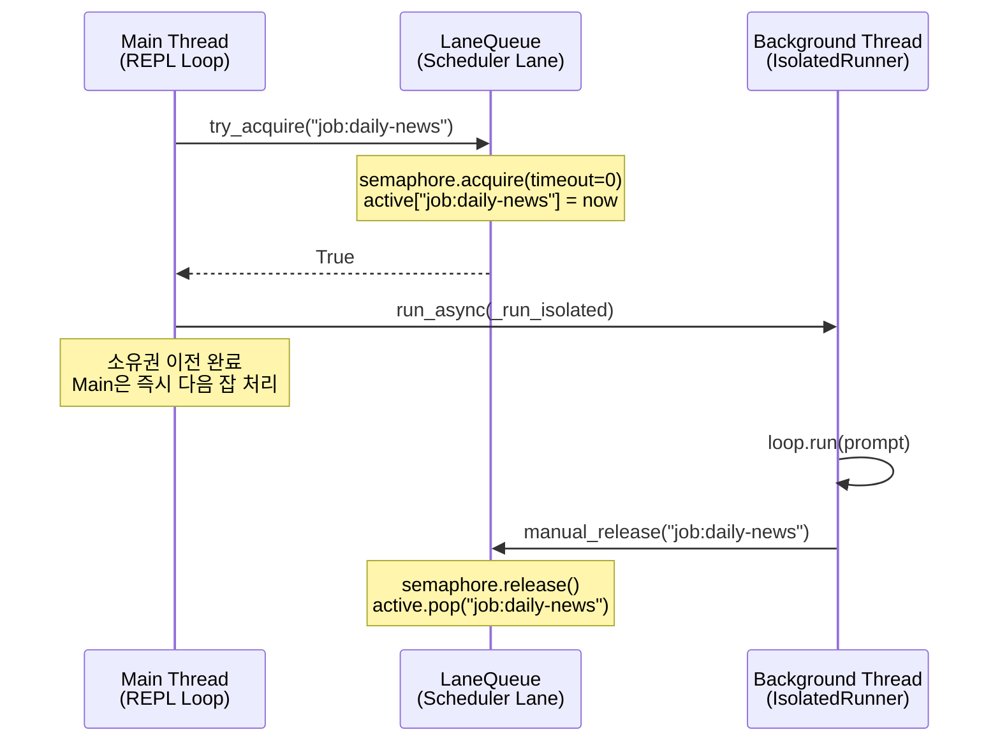
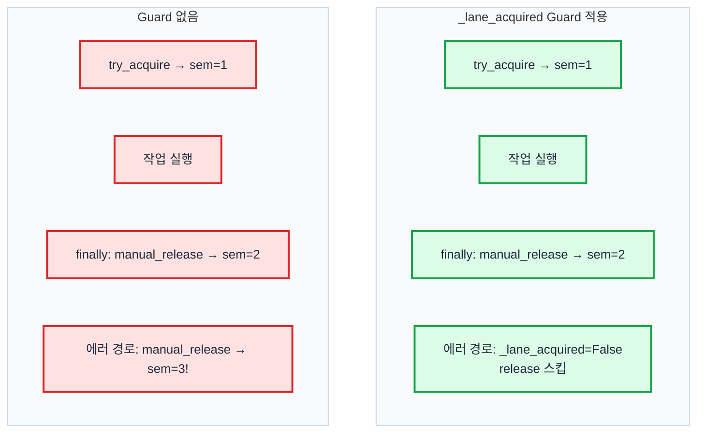

# Lane Queue에서 비동기 소유권 이전 패턴 구현하기

> Date: 2026-03-30 | Author: geode-team | Tags: python, concurrency, semaphore, ownership-transfer, agent-system

## Table of Contents

1. [문제 — 애드혹 Semaphore의 한계](#1-문제)
2. [Context Manager vs Manual Release](#2-context-manager-vs-manual-release)
3. [try_acquire 구현 — Non-Blocking Acquire](#3-try_acquire-구현)
4. [manual_release 구현 — 비동기 해제](#4-manual_release-구현)
5. [소유권 이전 패턴 — Closure Capture](#5-소유권-이전-패턴)
6. [이중 해제 방지 — _lane_acquired Guard](#6-이중-해제-방지)
7. [실제 코드 — _drain_scheduler_queue](#7-실제-코드)
8. [검증 — Stats와 Active Tracking](#8-검증)

---

## 1. 문제

GEODE의 스케줄러는 REPL 메인 루프 안에서 예약된 잡을 비동기로 디스패치합니다. 현재 구현은 다음과 같습니다.

```python
# core/cli/__init__.py (현재)
_sched_semaphore = threading.Semaphore(2)  # Max 2 concurrent scheduled jobs

# REPL 메인 루프 내부
while True:
    job_id, fired_action, isolated = _action_queue.get_nowait()
    # ...
    if not _sched_semaphore.acquire(timeout=0):
        log.warning("Scheduler slots full (max 2), skipping job %s", job_id)
        continue

    def _run_isolated(*, _sem=_sched_semaphore, ...):
        try:
            r = _loop.run(_p)
            return r.text if r and r.text else ""
        finally:
            _sem.release()

    _sched_runner.run_async(_run_isolated, config=...)
```

이 코드에는 두 가지 문제가 있습니다.

**문제 1: 중앙 LaneQueue와의 단절.** GEODE에는 이미 `core/orchestration/lane_queue.py`에 중앙 동시성 제어 시스템이 있습니다. `Lane` 클래스가 세마포어, active tracking, 통계를 통합 관리합니다. 하지만 스케줄러는 이를 사용하지 않고 독자적인 `threading.Semaphore(2)`를 쓰고 있습니다.

**문제 2: 소유권 이전의 비표준 패턴.** `_sched_semaphore.acquire()`는 REPL 메인 스레드에서 호출되고, `_sched_semaphore.release()`는 `IsolatedRunner`가 생성한 백그라운드 스레드에서 호출됩니다. acquire 스레드와 release 스레드가 다릅니다. 이 패턴은 `with` 문으로 표현할 수 없습니다.



핵심은 `try_acquire`와 `manual_release`가 서로 다른 스레드에서 호출된다는 것입니다. 이것이 **비동기 소유권 이전 패턴**(async ownership transfer)이며, `with` 블록의 context manager로는 구현할 수 없습니다.

---

## 2. Context Manager vs Manual Release

기존 `Lane.acquire()`는 context manager입니다.

```python
# core/orchestration/lane_queue.py
class Lane:
    @contextmanager
    def acquire(self, key: str) -> Generator[None, None, None]:
        acquired = self._semaphore.acquire(timeout=self.timeout_s)
        if not acquired:
            raise TimeoutError(...)
        with self._lock:
            self._active[key] = time.time()
        self._stats.inc_acquired()
        try:
            yield
        finally:
            with self._lock:
                self._active.pop(key, None)
            self._stats.inc_released()
            self._semaphore.release()
```

이 패턴은 **동기 작업**에 적합합니다. `with lane.acquire("key"):` 블록 안에서 작업을 수행하면, 블록을 나올 때 자동으로 해제됩니다.

```python
# 동기: acquire와 release가 같은 스레드, 같은 스코프
with lane.acquire("job:daily-news"):
    result = loop.run(prompt)  # 이 스레드에서 완료될 때까지 대기
# ← 자동 release
```

하지만 스케줄러의 비동기 패턴에서는 이렇게 쓸 수 없습니다.

```python
# 비동기: acquire는 메인, release는 백그라운드 — with 사용 불가
with lane.acquire("job:daily-news"):
    runner.run_async(fn)  # 즉시 반환 — 작업은 백그라운드에서 계속
# ← 여기서 release됨 — 작업이 끝나기 전에 해제!
```

`run_async()`는 즉시 반환되므로, `with` 블록이 끝나면 작업이 아직 진행 중인데 세마포어가 해제됩니다. 동시성 제한의 의미가 사라집니다.

| 패턴 | acquire 스레드 | release 스레드 | 적합한 API |
|------|:--------------:|:--------------:|:----------:|
| 동기 작업 | Thread A | Thread A | `with lane.acquire()` |
| 비동기 작업 | Thread A (Main) | Thread B (Worker) | `try_acquire()` + `manual_release()` |

---

## 3. try_acquire 구현

`try_acquire()`는 non-blocking으로 세마포어를 획득하고, active tracking에 등록합니다.

```python
class Lane:
    def try_acquire(self, key: str) -> bool:
        """Non-blocking acquire. Returns True if slot acquired.

        반드시 manual_release()와 쌍으로 사용해야 합니다.
        context manager가 아니므로, 호출자가 해제 책임을 집니다.
        """
        acquired = self._semaphore.acquire(timeout=0)  # non-blocking
        if not acquired:
            self._stats.inc_timeouts()
            log.debug(
                "Lane '%s' try_acquire failed for %s (%d/%d active)",
                self.name, key, self.active_count, self.max_concurrent,
            )
            return False

        with self._lock:
            self._active[key] = time.time()
        self._stats.inc_acquired()

        log.debug(
            "Lane '%s' try_acquired by %s (%d/%d active)",
            self.name, key, self.active_count, self.max_concurrent,
        )
        return True
```

`timeout=0`은 세마포어를 즉시 시도하고, 실패하면 대기 없이 `False`를 반환합니다. 스케줄러의 메인 루프가 블록되면 안 되기 때문입니다.

기존 `acquire()` context manager와의 차이점은 다음과 같습니다.

| 속성 | `acquire()` (context manager) | `try_acquire()` (manual) |
|------|:-----------------------------:|:------------------------:|
| 블록킹 | timeout까지 대기 | 즉시 반환 |
| 해제 방식 | `with` 블록 종료 시 자동 | `manual_release()` 명시 호출 |
| 에러 시 | 자동 정리 (finally) | 호출자 책임 |
| 용도 | 동기 작업 | 비동기 소유권 이전 |

---

## 4. manual_release 구현

`manual_release()`는 `try_acquire()`의 쌍입니다. 다른 스레드에서 호출될 수 있습니다.

```python
class Lane:
    def manual_release(self, key: str) -> bool:
        """수동 해제. try_acquire()의 쌍으로 호출.

        Returns True if the key was actually active (정상 해제).
        Returns False if the key was not found (이중 해제 또는 잘못된 key).
        """
        with self._lock:
            was_active = self._active.pop(key, None) is not None

        if was_active:
            self._stats.inc_released()
            self._semaphore.release()
            log.debug("Lane '%s' manual_released by %s", self.name, key)
        else:
            log.warning(
                "Lane '%s' manual_release called for inactive key '%s' "
                "(double release or wrong key)",
                self.name, key,
            )
        return was_active
```

**핵심: `_active.pop()`과 `_semaphore.release()`의 순서.**

1. 먼저 `_active`에서 key를 제거합니다. key가 없으면 이미 해제된 것이므로 `release()`를 호출하지 않습니다.
2. key가 있었다면 `_semaphore.release()`를 호출합니다.

이 순서가 중요합니다. `_semaphore.release()`를 먼저 호출하면, 다른 스레드가 즉시 `try_acquire()`에 성공할 수 있고, 아직 `_active`에 이전 key가 남아있으면 active_count가 부정확해집니다.

---

## 5. 소유권 이전 패턴

### Closure Capture

비동기 소유권 이전의 핵심은 **클로저 캡처**입니다. `try_acquire()`로 획득한 뒤, 해제 책임을 백그라운드 함수의 클로저에 넘깁니다.

```python
# 패턴: acquire → closure capture → run_async → finally release
lane = lane_queue.get_lane("scheduler")
key = f"job:{job_id}"

if not lane.try_acquire(key):
    log.warning("Scheduler lane full, skipping %s", job_id)
    continue

# 클로저 캡처: 현재 시점의 lane과 key를 고정
_captured_key = key
_captured_lane = lane

def _run_isolated(
    *,
    _lane: Lane = _captured_lane,
    _key: str = _captured_key,
) -> str:
    try:
        r = loop.run(prompt)
        return r.text if r and r.text else ""
    finally:
        _lane.manual_release(_key)

runner.run_async(_run_isolated, config=config)
```

Python의 클로저는 **변수의 레퍼런스**를 캡처합니다. 루프 안에서 클로저를 생성하면, 루프 변수(`key`, `lane`)가 다음 반복에서 바뀔 수 있습니다. 이를 방지하기 위해 **기본 인자(default argument)** 패턴을 사용합니다.

```python
# 잘못된 캡처: key가 루프 변수를 참조 → 마지막 값만 캡처됨
for job_id, action, isolated in jobs:
    key = f"job:{job_id}"
    def _run():
        # key는 루프 종료 시점의 마지막 job_id를 가리킴!
        lane.manual_release(key)

# 올바른 캡처: 기본 인자로 현재 값을 고정
for job_id, action, isolated in jobs:
    key = f"job:{job_id}"
    def _run(*, _key=key):
        lane.manual_release(_key)  # 생성 시점의 key 값이 고정됨
```

이것은 GEODE의 기존 코드에서도 동일하게 사용되는 패턴입니다. `_captured_job_id = job_id` 후 `_run_isolated(*, _jid=_captured_job_id)`로 캡처합니다.

---

## 6. 이중 해제 방지

### _lane_acquired Guard

에러 경로에서 이중 해제가 발생할 수 있습니다. 예를 들어 `IsolatedRunner`가 타임아웃으로 인해 콜백을 중단하고, 별도 경로에서 정리를 시도하는 경우입니다.

```python
def _run_isolated(*, _lane=lane, _key=key) -> str:
    _lane_acquired = True
    try:
        r = loop.run(prompt)
        return r.text if r and r.text else ""
    except Exception:
        return ""
    finally:
        if _lane_acquired:
            _lane.manual_release(_key)
            _lane_acquired = False
```

이 guard가 없으면, `manual_release()`가 두 번 호출될 때 세마포어 카운트가 초기값을 초과합니다. `Semaphore`는 `BoundedSemaphore`와 달리 release 초과를 허용하므로, `max_concurrent=2`인데 세마포어 카운트가 3이 되는 문제가 발생합니다.



더 근본적인 방어는 `BoundedSemaphore`를 사용하는 것입니다. 하지만 `BoundedSemaphore`는 초과 release 시 `ValueError`를 발생시키므로, 에이전트 시스템처럼 예외를 최소화해야 하는 환경에서는 guard 패턴이 더 적합합니다.

---

## 7. 실제 코드

### 현재 스케줄러 드레인 로직

REPL 메인 루프의 스케줄러 드레인 부분을 전체적으로 보겠습니다.

```python
# core/cli/__init__.py — 스케줄러 드레인 (현재 구현)
_sched_runner = IsolatedRunner()
_sched_semaphore = threading.Semaphore(2)

while True:
    # Drain scheduled actions
    try:
        while True:
            job_id, fired_action, isolated = _action_queue.get_nowait()
            if not fired_action:
                continue
            prompt = f"[scheduled-job:{job_id}] {fired_action}"
            if isolated:
                if not _sched_semaphore.acquire(timeout=0):
                    log.warning("Scheduler slots full (max 2), skipping job %s", job_id)
                    console.print(f"  [dim]scheduled:{job_id} → skipped (slots full)[/dim]")
                    continue

                _iso_conv = ConversationContext()
                _, _iso_loop = services.create_session(
                    SessionMode.SCHEDULER,
                    conversation=_iso_conv,
                    propagate_context=True,
                )
                _captured_job_id = job_id
                _captured_prompt = prompt
                _captured_loop = _iso_loop
                _captured_sem = _sched_semaphore

                def _run_isolated(
                    *,
                    _loop: Any = _captured_loop,
                    _p: str = _captured_prompt,
                    _jid: str = _captured_job_id,
                    _sem: threading.Semaphore = _captured_sem,
                ) -> str:
                    try:
                        r = _loop.run(_p)
                        _on_sched_complete(r, job_id=_jid)
                        return r.text if r and r.text else ""
                    finally:
                        _sem.release()

                _sched_runner.run_async(
                    _run_isolated,
                    config=IsolationConfig(
                        prefix=f"scheduled:{job_id}",
                        post_to_main=False,
                        timeout_s=300.0,
                    ),
                )
    except _queue_mod.Empty:
        pass
```

### LaneQueue 적용 시

`threading.Semaphore(2)` 대신 중앙 `LaneQueue`의 "scheduler" Lane을 사용하면 다음과 같습니다.

```python
# LaneQueue 적용 후 (설계)
from core.orchestration.lane_queue import LaneQueue

lane_queue = LaneQueue()
lane_queue.add_lane("scheduler", max_concurrent=2, timeout_s=300.0)
sched_lane = lane_queue.get_lane("scheduler")

while True:
    try:
        while True:
            job_id, fired_action, isolated = _action_queue.get_nowait()
            if not fired_action:
                continue
            prompt = f"[scheduled-job:{job_id}] {fired_action}"
            key = f"sched:{job_id}"

            if isolated:
                if not sched_lane.try_acquire(key):
                    log.warning("Scheduler lane full, skipping %s", job_id)
                    continue

                _iso_conv = ConversationContext()
                _, _iso_loop = services.create_session(
                    SessionMode.SCHEDULER,
                    conversation=_iso_conv,
                    propagate_context=True,
                )
                _cap_key = key
                _cap_loop = _iso_loop
                _cap_prompt = prompt
                _cap_jid = job_id
                _cap_lane = sched_lane

                def _run_isolated(
                    *,
                    _loop=_cap_loop,
                    _p=_cap_prompt,
                    _jid=_cap_jid,
                    _lane=_cap_lane,
                    _key=_cap_key,
                ) -> str:
                    try:
                        r = _loop.run(_p)
                        _on_sched_complete(r, job_id=_jid)
                        return r.text if r and r.text else ""
                    finally:
                        _lane.manual_release(_key)

                _sched_runner.run_async(
                    _run_isolated,
                    config=IsolationConfig(
                        prefix=f"scheduled:{job_id}",
                        post_to_main=False,
                        timeout_s=300.0,
                    ),
                )
    except _queue_mod.Empty:
        pass
```

달라진 점은 세 가지입니다.

1. `_sched_semaphore.acquire(timeout=0)` → `sched_lane.try_acquire(key)` — active tracking 추가
2. `_sem.release()` → `_lane.manual_release(_key)` — 이중 해제 방어 내장
3. 중앙 `lane_queue.status()`로 모든 Lane의 상태를 한 눈에 확인 가능

---

## 8. 검증

### Lane Stats

`Lane._stats`가 acquire/release/timeout 횟수를 추적합니다.

```python
# core/orchestration/lane_queue.py
class _LaneStats:
    def __init__(self) -> None:
        self.acquired: int = 0
        self.released: int = 0
        self.timeouts: int = 0
        self._lock = threading.Lock()

    def to_dict(self) -> dict[str, int]:
        with self._lock:
            return {
                "acquired": self.acquired,
                "released": self.released,
                "timeouts": self.timeouts,
            }
```

정상 상태에서는 항상 `acquired == released + active_count`입니다. 이 불변식(invariant)이 깨지면 세마포어 leak이 있다는 의미입니다.

```python
def verify_lane_health(lane: Lane) -> bool:
    """Lane 건강 상태 검증."""
    stats = lane.stats.to_dict()
    active = lane.active_count
    expected_released = stats["acquired"] - active

    if stats["released"] != expected_released:
        log.error(
            "Lane '%s' invariant broken: acquired=%d, released=%d, active=%d "
            "(expected released=%d)",
            lane.name,
            stats["acquired"],
            stats["released"],
            active,
            expected_released,
        )
        return False
    return True
```

### Active Tracking

`Lane.get_active()`는 현재 진행 중인 작업과 경과 시간을 반환합니다.

```python
# Lane.get_active() — 현재 활성 작업 + 경과 시간
lane = lane_queue.get_lane("scheduler")
active = lane.get_active()
# {"sched:daily-news": 45.2, "sched:weekly-report": 12.8}
```

이것을 이용해 stuck 작업을 감지할 수 있습니다.

```python
def detect_stuck_jobs(lane: Lane, threshold_s: float = 600.0) -> list[str]:
    """timeout_s를 초과한 stuck 작업 감지."""
    return [
        key
        for key, elapsed in lane.get_active().items()
        if elapsed > threshold_s
    ]
```

### LaneQueue.status() — 통합 뷰

모든 Lane의 상태를 한 번에 확인합니다.

```python
queue = LaneQueue()
queue.add_lane("scheduler", max_concurrent=2)
queue.add_lane("subagent", max_concurrent=5)

print(queue.status())
# {
#   "scheduler": {"active": 1, "max": 2, "available": 1},
#   "subagent":  {"active": 3, "max": 5, "available": 2}
# }
```

이것이 애드혹 `threading.Semaphore(2)`에는 없는 것입니다. 독립적인 세마포어는 자신의 카운트만 알 뿐, 누가 점유하고 있는지, 얼마나 오래 점유했는지, 전체 시스템에서 어떤 Lane이 병목인지 알 수 없습니다.

---

## Wrap-up

| Item | Description |
|------|-------------|
| Problem | 스케줄러의 `Semaphore(2)` 애드혹 패턴 -- active tracking 없음, 중앙 LaneQueue와 단절 |
| Core pattern | 비동기 소유권 이전: `try_acquire()` (Main) → closure capture → `manual_release()` (Worker) |
| Why not context manager | `with lane.acquire()` 블록은 동기 작업 전용 -- `run_async()`의 즉시 반환과 호환 불가 |
| Key safeguards | `_lane_acquired` guard (이중 해제 방지), `_active.pop()` 선행 후 `semaphore.release()` |
| Observability | `lane.stats.to_dict()`, `lane.get_active()`, `lane_queue.status()` — 통합 모니터링 |

### Checklist

- [x] `try_acquire()` — non-blocking, timeout=0, active tracking 포함
- [x] `manual_release()` — 다른 스레드에서 호출 가능, 이중 해제 시 False 반환
- [x] 클로저 캡처 — 기본 인자 패턴으로 루프 변수 고정
- [x] `_lane_acquired` guard — finally에서 이중 해제 방지
- [x] 불변식: `acquired == released + active_count`
- [x] stuck 감지: `get_active()` + threshold 비교
- [x] `BoundedSemaphore` 대안 검토 — ValueError 발생이 에이전트 시스템에 부적합

---

*Source: `blog/posts/technical/lane-queue-async-ownership.md` | Category: [[blog-technical]]*

## Related

- [[blog-technical]]
- [[blog-hub]]
- [[geode]]
