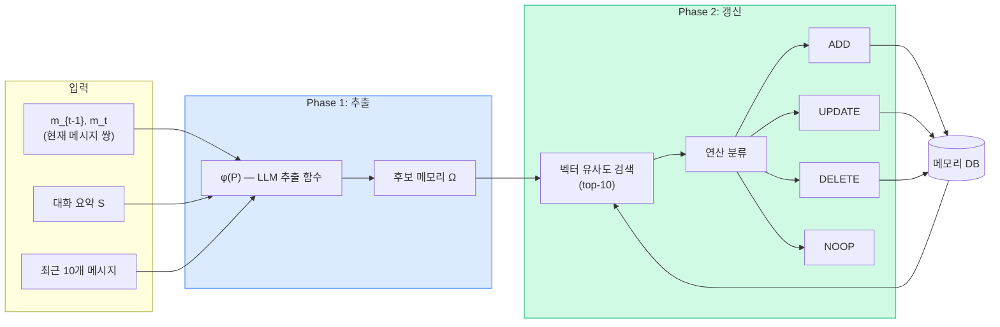
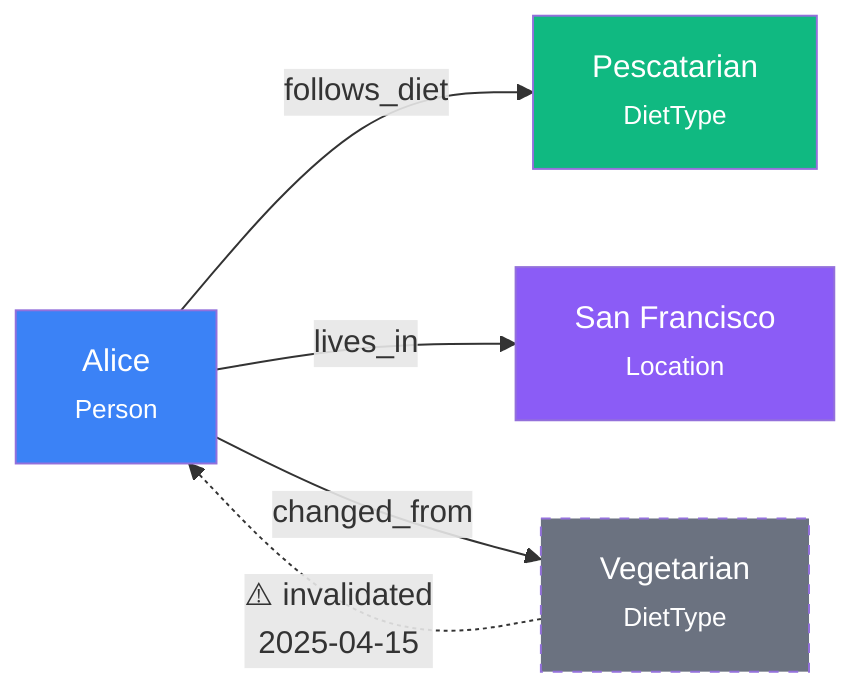
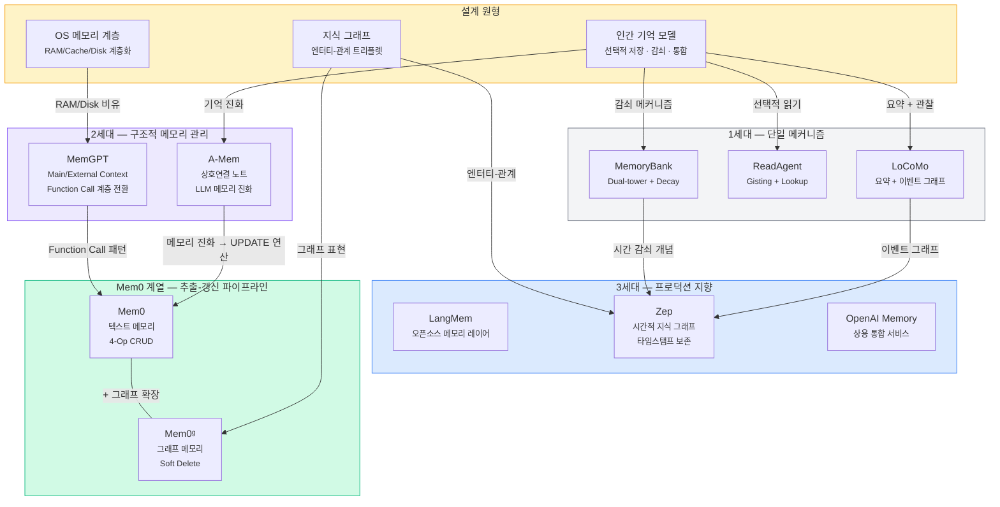

# Mem0 — AI Agent의 장기 기억을 프로덕션에 올리는 방법

사용자가 "저는 채식주의자이고 유제품도 안 먹어요"라고 말한 지 3시간 후, AI에게 저녁 추천을 요청합니다. 메모리 없는 시스템은 치킨 샐러드를 제안합니다. 이 글에서는 이 문제를 **프로덕션 레벨**에서 해결하기 위해 설계된 Mem0 아키텍처를 분석합니다. 논문(arXiv:2504.19413)의 핵심 설계 결정, 벤치마크 수치, 그리고 실환경 적용 시 고려해야 할 트레이드오프를 다룹니다.

## 목차

1. [왜 컨텍스트 확장만으로는 부족한가](#1-왜-컨텍스트-확장만으로는-부족한가)
2. [Mem0 아키텍처: 추출-갱신 2단계 파이프라인](#2-mem0-아키텍처-추출-갱신-2단계-파이프라인)
3. [Mem0ᵍ: 그래프로 확장한 관계형 메모리](#3-mem0ᵍ-그래프로-확장한-관계형-메모리)
4. [벤치마크 결과: 10개 방법의 정면 비교](#4-벤치마크-결과-10개-방법의-정면-비교)
5. [프로덕션 트레이드오프: 정확도 vs 비용 vs 레이턴시](#5-프로덕션-트레이드오프-정확도-vs-비용-vs-레이턴시)
6. [기존 메모리 시스템과의 비교 분석](#6-기존-메모리-시스템과의-비교-분석)
7. [한계와 열린 질문](#7-한계와-열린-질문)
8. [핵심 정리 + 체크리스트](#8-핵심-정리--체크리스트)

---

## 1. 왜 컨텍스트 확장만으로는 부족한가

LLM의 컨텍스트 윈도우는 계속 커지고 있습니다.

| 모델 | 컨텍스트 길이 |
|------|-------------|
| GPT-4 | 128K tokens |
| Claude 3.7 Sonnet | 200K tokens |
| Gemini 1.5 | 10M+ tokens |

Mem0 논문의 핵심 주장은 명확합니다: **컨텍스트 확장은 문제를 지연시킬 뿐 해결하지 못합니다.**

200K 컨텍스트가 있어도, 수일에 걸친 멀티세션 대화는 그 한계를 넘깁니다. 설령 넘지 않더라도 전체 대화를 매번 주입하면 p95 레이턴시가 17초에 달하고, 토큰 비용은 선형으로 증가합니다. 프로덕션 시스템에서는 허용하기 어려운 수치입니다.

인간의 기억 시스템이 시사하는 해결 방향은 세 가지입니다:

1. **선택적 저장** — 모든 것을 기억하지 않고, 중요한 것만 보존
2. **개념 통합** — 관련된 정보를 연결하여 구조화
3. **적시 검색** — 필요한 순간에 관련 기억만 꺼냄

> Mem0는 이 세 가지를 각각 Extraction(추출), Update(갱신), Retrieval(검색)이라는 명시적 단계로 구현합니다. 인간 인지의 비유가 아니라, 엔지니어링 파이프라인으로 번역한 것입니다.

---

## 2. Mem0 아키텍처: 추출-갱신 2단계 파이프라인

Mem0의 핵심은 놀라울 정도로 단순합니다. 모든 메시지 쌍을 받아 **추출(Extraction)** 하고, 기존 메모리와 비교하여 **갱신(Update)** 합니다.

### 전체 흐름



### Phase 1: Extraction — 무엇을 기억할 것인가

입력 메시지 쌍 `(m_{t-1}, m_t)`에 대해 두 가지 컨텍스트를 결합합니다:

```
P = (S, {m_{t-m}, ..., m_{t-2}}, m_{t-1}, m_t)
    │         │                    │
    │         │                    └─ 현재 대화 턴
    │         └─ 최근 m=10개 메시지 (recency window)
    └─ DB에서 가져온 전체 대화 요약
```

LLM 기반 추출 함수 `φ(P)`가 이 프롬프트를 처리하여 후보 메모리 집합 `Ω = {ω₁, ω₂, ..., ωₙ}`을 생성합니다.

> 대화 요약 S는 **비동기 모듈**이 주기적으로 갱신합니다. 실시간 추출 경로와 분리함으로써, 요약 품질이 추출 레이턴시에 영향을 주지 않도록 설계한 것입니다. 이 분리는 CQRS 패턴과 유사한 사고방식입니다.

### Phase 2: Update — 어떻게 갱신할 것인가

추출된 각 사실 `ωᵢ`에 대해:

1. 벡터 임베딩으로 기존 메모리에서 **top-10 유사 메모리**를 검색
2. 후보 사실과 유사 메모리들을 LLM에 전달
3. LLM이 **function-calling**으로 4가지 원자적 연산 중 하나를 결정

| 연산 | 트리거 조건 | 동작 |
|------|-----------|------|
| **ADD** | 의미적으로 동등한 기존 메모리 없음 | 새 메모리 생성 |
| **UPDATE** | 기존 메모리와 보완 관계 | 기존 메모리 내용 보강 |
| **DELETE** | 기존 메모리와 모순 | 모순 메모리 제거 |
| **NOOP** | 이미 저장된 정보와 동일 | 아무 작업 안 함 |

> 이 4가지 연산은 메모리의 **CRUD**에 해당합니다. 중요한 점은 LLM이 "어떤 연산을 수행할지"를 function-calling으로 **구조화된 출력**으로 결정한다는 것입니다. 자유 텍스트 응답이 아니라 명시적 도구 호출이므로, 파싱 오류 없이 안정적으로 동작합니다.

### 구현 사양

| 파라미터 | 값 | 설계 의도 |
|---------|---|----------|
| 추론 엔진 | GPT-4o-mini | 비용 효율 (full 모델 대비 수십 배 저렴) |
| recency window (m) | 10 | 직전 대화 맥락 보존 |
| 유사 메모리 비교 수 (s) | 10 | 중복/모순 감지 범위 |
| 임베딩 모델 | text-embedding-3-small | 검색 정확도 vs 비용 균형 |
| 요약 생성 | 비동기, 주기적 갱신 | 실시간 경로 레이턴시 격리 |

---

## 3. Mem0ᵍ: 그래프로 확장한 관계형 메모리

Mem0의 자연어 텍스트 메모리는 "Alice는 채식주의자다"처럼 독립적 사실을 잘 저장합니다. 하지만 "Alice가 **지난 화요일에** 채식에서 **페스코 채식으로** 바꿨다"처럼 **시간적 변화**와 **엔터티 간 관계**를 추론해야 하는 질의에는 한계가 있습니다.

Mem0ᵍ는 이 문제를 **방향성 레이블 그래프** `G = (V, E, L)`로 해결합니다.

### 그래프 구조



| 구성 요소 | 설명 | 예시 |
|----------|------|------|
| **노드 (V)** | 엔터티 + 타입 + 임베딩 + 타임스탬프 | `Alice (Person, t=2025-04-01)` |
| **엣지 (E)** | 관계 트리플렛 `(source, relation, dest)` | `(Alice, follows_diet, Pescatarian)` |
| **레이블 (L)** | 노드의 의미적 타입 | Person, Location, Event, DietType |

### 추출과 갱신

**2단계 추출**:
1. **Entity Extractor** — 비정형 텍스트에서 엔터티 식별
2. **Relationship Generator** — 엔터티 간 관계를 트리플렛으로 구조화

**갱신의 핵심 — Soft Delete**:

새 정보가 기존 관계와 충돌할 때, Mem0ᵍ는 **물리적으로 삭제하지 않고 무효(invalid)로 표시**합니다.

> 이것이 Mem0ᵍ의 가장 중요한 설계 결정입니다. "Alice는 채식주의자였다"를 지워버리면 "Alice의 식단이 어떻게 바뀌었나요?"라는 시간적 질의에 답할 수 없습니다. Soft delete는 **시간적 추론**을 가능하게 하는 전제 조건입니다. 관계형 DB의 논리적 삭제(logical delete)와 같은 패턴이지만, 여기서는 지식 그래프의 시간 축을 보존하기 위한 목적입니다.

### 이중 검색 메커니즘

| 방식 | 작동 원리 | 적합한 질의 유형 |
|------|----------|----------------|
| **Entity-centric** | 쿼리에서 엔터티 추출 → 그래프 노드 매칭 → 연결된 관계 탐색 | "Alice의 식단은?" |
| **Semantic triplet** | 전체 쿼리를 임베딩 → 트리플렛 인코딩과 유사도 매칭 | "최근에 생활 습관이 바뀐 사람은?" |

구현에는 **Neo4j**를 그래프 DB로, **GPT-4o-mini + function calling**을 추출/갱신 LLM으로 사용합니다.

### Mem0 vs Mem0ᵍ 한눈에 비교

| 차원 | Mem0 | Mem0ᵍ |
|------|------|-------|
| 메모리 표현 | 자연어 텍스트 | 방향성 레이블 그래프 |
| 토큰 소비 | ~7k / 대화 | ~14k / 대화 |
| 검색 레이턴시 (p50) | 0.148s | 0.476s |
| 강점 | 단순 질의, 빠른 검색 | 시간적 추론, 관계형 질의 |
| 추가 인프라 | 벡터 DB | 벡터 DB + Neo4j |
| 삭제 전략 | 물리적 삭제 | Soft delete (무효 표시) |

---

## 4. 벤치마크 결과: 10개 방법의 정면 비교

### 평가 환경: LOCOMO 벤치마크

| 속성 | 값 |
|------|---|
| 대화 수 | 10개 (멀티세션) |
| 대화당 다이얼로그 | ~600개 |
| 대화당 평균 토큰 | ~26,000 |
| 대화당 질문 수 | ~200개 (ground truth 포함) |
| 질문 유형 | Single-hop, Multi-hop, Temporal, Open-domain |

**평가 메트릭**:
- **F1 Score** / **BLEU-1** — 어휘 수준 매칭
- **LLM-as-a-Judge (J)** — 사실 정확성, 관련성, 완전성, 문맥 적절성 종합 평가 (10회 실행 평균 ± 1σ)

### 질의 유형별 J Score 비교

#### Single-Hop — "Alice의 직업은?"

| 방법 | J Score (±σ) |
|------|-------------|
| MemoryBank | J 미측정 (F1=5.00) |
| MemGPT | J 미측정 (F1=26.65) |
| A-Mem* | 39.79 ± 0.38 |
| Zep | 61.70 ± 0.32 |
| LangMem | 62.23 ± 0.75 |
| OpenAI Memory | 63.79 ± 0.46 |
| Mem0ᵍ | 65.71 ± 0.45 |
| **Mem0** | **67.13 ± 0.65** |

#### Multi-Hop — "Alice의 직장 동료 중 같은 취미를 가진 사람은?"

| 방법 | J Score (±σ) |
|------|-------------|
| A-Mem* | 18.85 ± 0.31 |
| Zep | 41.35 ± 0.48 |
| OpenAI Memory | 42.92 ± 0.63 |
| Mem0ᵍ | 47.19 ± 0.67 |
| LangMem | 47.92 ± 0.47 |
| **Mem0** | **51.15 ± 0.31** |

#### Temporal — "Alice가 마지막으로 이사한 건 언제?"

| 방법 | J Score (±σ) |
|------|-------------|
| OpenAI Memory | 21.71 ± 0.20 |
| LangMem | 23.43 ± 0.39 |
| Zep | 49.31 ± 0.50 |
| A-Mem* | 49.91 ± 0.31 |
| Mem0 | 55.51 ± 0.34 |
| **Mem0ᵍ** | **58.13 ± 0.44** |

> **Temporal의 격차가 압도적입니다.** OpenAI(21.71)와 LangMem(23.43)은 시간적 추론에서 사실상 붕괴합니다. Mem0ᵍ(58.13)는 이들 대비 **155~148% 상대 개선**을 달성합니다. 시간적 맥락을 명시적으로 관리하지 않으면 이 질의 유형에서는 의미 있는 성능을 낼 수 없다는 것을 보여줍니다.

#### Open-Domain — "Alice에 대해 알려줘"

| 방법 | J Score (±σ) |
|------|-------------|
| A-Mem* | 54.05 ± 0.22 |
| OpenAI Memory | 62.29 ± 0.12 |
| LangMem | 71.12 ± 0.20 |
| Mem0 | 72.93 ± 0.11 |
| Mem0ᵍ | 75.71 ± 0.21 |
| **Zep** | **76.60 ± 0.13** |

> 질의 유형에 따라 승자가 달라집니다. **Mem0는 단순 질의(single-hop, multi-hop)**, **Mem0ᵍ는 시간적 추론(temporal)**, **Zep는 열린 질의(open-domain)**에서 각각 최강입니다. 특히 temporal에서 OpenAI/LangMem의 급격한 성능 저하(J≈21~23)와 Mem0 계열의 강세(J≈55~58)가 가장 주목할 만한 발견입니다.

### RAG 구성별 상세 — 청크 크기가 성능에 미치는 영향

14가지 RAG 구성(7 chunk sizes × k∈{1,2})을 테스트한 결과입니다:

| 청크 크기 | k=1 J(%) | k=2 J(%) | 차이 |
|----------|---------|---------|------|
| 128 | 47.77 | 59.56 | +11.79 |
| 256 | 50.15 | **60.97** | +10.82 |
| 512 | 46.05 | 58.19 | +12.14 |
| 1024 | 40.74 | 50.68 | +9.94 |
| 2048 | 37.93 | 48.57 | +10.64 |
| 4096 | 36.84 | 51.79 | +14.95 |
| 8192 | 44.53 | 60.53 | +16.00 |

세 가지 패턴이 관찰됩니다:

1. **k=2가 k=1보다 항상 10~16% 높음** — 더 많은 컨텍스트가 일관되게 성능 향상
2. **최적 청크 크기는 256 (k=2 기준)** — 그러나 8192와 불과 0.44% 차이
3. **중간 크기(1024~2048)가 최악** — 너무 크면 노이즈 포함, 너무 작으면 맥락 부족의 경계 지점

> 최적 RAG(J=60.97%)도 Mem0(J=66.88%)에 6% 뒤처집니다. RAG는 "대화에서 관련 부분을 잘라서 보여주는" 수동적 접근인 반면, Mem0는 "핵심 사실을 추출하고 갱신하는" 능동적 접근입니다. 이 차이가 성능 격차를 만듭니다.

---

## 5. 프로덕션 트레이드오프: 정확도 vs 비용 vs 레이턴시

프로덕션 배포에서 정확도만큼 중요한 것이 레이턴시와 비용입니다.

### 레이턴시 비교

| 방법 | Search p50 | Search p95 | Total p50 | Total p95 | Overall J(%) |
|------|-----------|-----------|----------|----------|-------------|
| **Mem0** | **0.148s** | **0.200s** | **0.708s** | **1.440s** | 66.88 ± 0.15 |
| Mem0ᵍ | 0.476s | 0.657s | 1.091s | 2.590s | **68.44 ± 0.17** |
| Zep | 0.513s | 0.778s | 1.292s | 2.926s | 65.99 ± 0.16 |
| OpenAI Memory | — | — | **0.466s** | **0.889s** | 52.90 ± 0.14 |
| A-Mem | 0.668s | 1.485s | 1.410s | 4.374s | 48.38 ± 0.15 |
| Best RAG (256,k=2) | 0.255s | 0.699s | 0.802s | 1.907s | 60.97 ± 0.20 |
| Full-context | — | — | 9.870s | **17.117s** | 72.90 ± 0.19 |
| LangMem | **17.99s** | **59.82s** | 18.53s | 60.40s | 58.10 ± 0.21 |

> OpenAI Memory가 total 레이턴시에서는 **최저**(p95=0.889s)입니다. 하지만 Overall J가 52.90%로 Mem0(66.88%) 대비 크게 뒤처집니다. 빠르지만 정확하지 않은 것입니다.

### 토큰 소비 비교

| 방법 | 토큰 소비 | Raw 대화 대비 | 구축 시간 |
|------|----------|-------------|----------|
| **Mem0** | ~7k | **0.27x** (73% 절감) | < 1분 |
| Mem0ᵍ | ~14k | 0.54x | — |
| Raw conversation | ~26k | 1x (기준) | — |
| Zep | 600k+ | **23x** (2200% 증가) | 수 시간 |

### 3차원 트레이드오프 맵

```
정확도 (J%)    │
               │
  73% ─────────┤·································· Full-context
               │                                    (17.1s, 26k tok)
  68% ─────────┤···· Mem0ᵍ
               │     (2.6s, 14k tok)
  67% ─────────┤··· Mem0 ◀── 프로덕션 최적해
               │    (1.4s, 7k tok)
  66% ─────────┤·· Zep
               │   (2.9s, 600k+ tok)
  61% ─────────┤· Best RAG
               │  (1.9s, ~5k tok)
  58% ─────────┤ LangMem
               │ (60.4s)
  53% ─────────┤ OpenAI Memory
               │ (0.9s, 내부)
               │
               └──┬──────┬──────┬──────┬──────── p95 total 레이턴시
                  1s     5s    10s    17s   60s
```

> **Mem0는 정확도 6% 포인트를 양보하고, 레이턴시 91%와 토큰 비용 73%를 절감합니다.** 대부분의 프로덕션 환경에서 이 트레이드오프는 합리적입니다. Full-context의 17초 p95는 사용자 경험에 직접적 타격을 주며, 비용은 대화 길이에 비례하여 선형 증가합니다. 반면 Mem0의 비용은 대화 길이와 **무관하게 일정**합니다. OpenAI Memory는 레이턴시(0.9s)만 보면 최선이지만, 정확도(52.90%)가 Mem0 대비 14pt 낮아 품질-속도 균형에서 밀립니다.

---

## 6. 기존 메모리 시스템과의 비교 분석

논문은 6개 카테고리의 베이스라인을 비교합니다. 각 시스템의 접근 방식과 관찰 결과를 정리합니다.

### 아키텍처 계보 — 설계 아이디어의 흐름

단순한 시간순 나열이 아니라, 각 시스템이 **어떤 설계 아이디어를 계승하고 어떤 것을 새로 도입했는지**를 추적합니다.



> 핵심 흐름: MemGPT의 **function-call 기반 메모리 관리**와 A-Mem의 **메모리 진화** 개념이 Mem0의 4가지 원자적 연산(ADD/UPDATE/DELETE/NOOP)으로 수렴합니다. Zep의 시간적 지식 그래프 아이디어는 Mem0ᵍ의 soft-delete 그래프 설계에 반영되었습니다.

### 설계 축 비교 — 5가지 차원으로 해부

각 시스템이 메모리의 **표현**, **저장**, **검색**, **갱신**, **삭제** 전략에서 어떤 선택을 했는지 비교합니다.

| 시스템 | 표현 형식 | 저장 전략 | 검색 방식 | 갱신 메커니즘 | 삭제 전략 |
|--------|----------|----------|----------|-------------|----------|
| **LoCoMo** | 요약 + 이벤트 그래프 | 단기/장기 분리 | 그래프 순회 | 수동 | 물리 삭제 |
| **ReadAgent** | Gist 요약 | 페이지 단위 | Interactive Lookup | 없음 (읽기 전용) | N/A |
| **MemoryBank** | 자연어 텍스트 | Dual-tower 인코딩 | Dense retrieval | **시간 감쇠** (Decay) | 감쇠로 자연 소멸 |
| **MemGPT** | 자연어 텍스트 | RAM/Disk 2계층 | **Function call** 기반 | 수동 (에이전트 판단) | 수동 |
| **A-Mem** | 상호연결 노트 | 키워드/태그 인덱스 | 태그 + 임베딩 | **LLM 메모리 진화** | 수동 |
| **LangMem** | 자연어 텍스트 | 벡터 DB | Semantic search | LLM 기반 | 물리 삭제 |
| **Zep** | 시간적 지식 그래프 | 그래프 DB + 캐시 | 그래프 순회 + 임베딩 | 타임스탬프 기반 | 물리 삭제 |
| **OpenAI** | 자연어 텍스트 | 내부 서비스 | 내부 서비스 | 내부 서비스 | 내부 서비스 |
| **Mem0** | 자연어 텍스트 | 벡터 DB | **Semantic top-k** | **4-Op CRUD** (ADD/UPDATE/DELETE/NOOP) | **물리 삭제** |
| **Mem0ᵍ** | 방향성 레이블 그래프 | Neo4j + 벡터 DB | **Entity-centric + Semantic triplet** | **4-Op + 충돌 감지** | **Soft delete** (무효 표시) |

> Mem0가 기존 시스템과 가장 크게 차별화되는 지점은 **갱신 메커니즘**입니다. 다른 시스템이 수동 관리, 시간 감쇠, 또는 암묵적 덮어쓰기에 의존하는 반면, Mem0는 매 메시지마다 LLM이 **명시적으로 연산을 분류**합니다. 이것이 "추출하고 잊는" RAG와 "추출하고 관리하는" Mem0의 근본적 차이입니다.

### 질의 유형별 강점 지형도

```
                    Single-hop        Multi-hop        Temporal         Open-domain
                   ┌─────────────┬──────────────┬──────────────┬──────────────┐
  J=76+ ███████████│             │              │              │■■■ Zep       │
                   │             │              │              │▒▒▒ Mem0ᵍ     │
  J=67  ███████████│■■■ Mem0     │              │              │░░░ Mem0      │
                   │▒▒▒ Mem0ᵍ   │              │              │    LangMem   │
                   │░░░ OpenAI   │              │              │              │
  J=62  ███████████│    LangMem  │              │              │    OpenAI    │
                   │    Zep      │              │              │              │
  J=58  ███████████│             │              │■■■ Mem0ᵍ     │              │
                   │             │              │▒▒▒ Mem0      │░░░ A-Mem*   │
  J=51  ███████████│             │■■■ Mem0      │              │              │
                   │             │▒▒▒ LangMem   │░░░ A-Mem*    │              │
                   │             │░░░ Mem0ᵍ     │    Zep       │              │
  J=42  ███████████│             │    OpenAI     │              │              │
                   │    A-Mem*   │    Zep        │              │              │
  J=21  ███████████│             │    A-Mem*     │    OpenAI ▼  │              │
                   │             │              │    LangMem ▼ │              │
                   └─────────────┴──────────────┴──────────────┴──────────────┘

                   ■■■ 1위       ▒▒▒ 2위       ░░░ 3위       ▼ 붕괴 (J<25)
```

네 가지 패턴이 선명합니다:

1. **Mem0 = 사실 검색의 왕** — Single-hop(67.13)과 Multi-hop(51.15) 모두 1위. 자연어 텍스트 메모리가 "특정 사실을 정확히 꺼내는" 작업에 최적화되어 있습니다.

2. **Mem0ᵍ = 시간의 전문가** — Temporal(58.13) 1위. Soft delete로 관계 변화 이력을 보존한 그래프 구조가 "언제, 어떻게 바뀌었는가"에 답할 수 있습니다.

3. **Zep = 넓은 맥락의 승자** — Open-domain(76.60) 1위. 600k+ 토큰의 풍부한 컨텍스트가 열린 질의에 유리합니다. 다만 Single-hop(61.70)과 Multi-hop(41.35)에서도 중위권으로, 기존 블로그에서 주장한 것처럼 "하위권"은 아닙니다.

4. **OpenAI/LangMem의 Temporal 붕괴** — 가장 주목할 만한 발견입니다. OpenAI(21.71)와 LangMem(23.43)은 temporal에서 **사실상 무용합니다.** 다른 질의 유형에서 60+ 성능을 내는 시스템이 temporal에서만 20대로 급락합니다. 시간적 맥락을 명시적으로 관리하지 않으면 이 유형에서 의미 있는 답을 생성할 수 없습니다.

> 이 지형도의 실무적 시사점은 명확합니다. **서비스의 주요 질의 유형을 먼저 분석**하고, 그에 맞는 메모리 시스템을 선택해야 합니다. 특히 temporal 질의가 있다면 OpenAI Memory나 LangMem은 사실상 선택지에서 제외됩니다.

### 시스템별 핵심 관찰

**MemGPT** — OS에서 영감을 받은 RAM/Disk 계층 구조. Function call로 메모리 계층을 관리하는 참신한 접근이지만, LOCOMO Single-hop에서 F1=26.65에 그칩니다. 에이전트가 "언제 메모리를 swap할지" 판단하는 부담이 오히려 성능을 저해한 것으로 보입니다.

**A-Mem** — LLM이 기존 노트를 개선하는 "메모리 진화" 개념을 제안. Mem0의 UPDATE 연산과 유사한 사고방식이지만, Mem0는 이를 ADD/UPDATE/DELETE/NOOP의 명시적 연산 체계로 정형화하여 비정형 진화를 구조적 CRUD로 전환했습니다. Overall J=48.38%로 Mem0(66.88%) 대비 크게 뒤처지며, 특히 Multi-hop(J=18.85)에서 극히 약합니다.

**Zep** — 시간적 지식 그래프 기반으로 **open-domain에서 최고 성능**(J=76.60). Overall J=65.99%로 Mem0(66.88%)에 근접하며, Temporal(J=49.31)에서도 중상위권입니다. 하지만 대가가 큽니다:
- 토큰 소비 600k+ (raw 대화의 23배)
- 구축에 **수 시간** 소요
- 즉각 메모리 검색 시도가 자주 실패
- 노드 간 중복 캐싱으로 인한 과도한 오버헤드

**LangMem** — 오픈소스 솔루션으로 Multi-hop(J=47.92)과 Open-domain(J=71.12)에서 준수한 성능. 하지만 **Temporal에서 J=23.43으로 OpenAI와 함께 붕괴**하며, 검색 레이턴시가 **p95 = 59.82초, total p95 = 60.40초**에 달하여 프로덕션 사용이 어렵습니다. Overall J는 58.10%입니다.

**OpenAI Memory** — Single-hop에서 준수(J=63.79)하고 total 레이턴시는 최저(p95=0.889s)이지만, **Temporal에서 J=21.71로 붕괴**합니다. Mem0(55.51) 대비 155% 뒤처지는 수치입니다. 시간적 맥락을 구조적으로 관리하지 않는 한계가 극명하게 드러납니다.

### 상대적 개선 요약

| 비교 | 상대 개선 | 의미 |
|------|----------|------|
| Mem0 vs Best RAG (overall) | ~10% | 능동적 추출이 수동적 청킹보다 우수 (66.88 vs 60.97) |
| Mem0ᵍ vs Best RAG (overall) | ~12% | 그래프 구조화의 추가 이점 (68.44 vs 60.97) |
| Mem0 vs OpenAI (overall) | **26%** | 전체 J 기준 (66.88 vs 52.90) |
| Mem0ᵍ vs OpenAI (temporal) | **168%** | 시간적 추론에서 압도적 (58.13 vs 21.71) |
| Mem0ᵍ vs Mem0 (overall) | ~2% | 그래프의 이점은 제한적 (68.44 vs 66.88) |
| Mem0 vs Full-context (latency) | **91% 감소** | 1.4s vs 17.1s |
| Mem0 vs Full-context (tokens) | **73% 절감** | 7k vs 26k |

---

## 7. 한계와 열린 질문

### 논문에서 관찰된 한계

1. **Full-context가 여전히 최고 정확도** (J=72.90%) — 메모리 시스템에는 아직 **정보 손실**이 존재합니다. 추출 과정에서 LLM이 중요하지 않다고 판단한 정보가 나중에 필요할 수 있습니다.

2. **Mem0ᵍ의 비용 대비 효과가 제한적** — Overall J에서 Mem0 대비 불과 2% 개선이지만, 레이턴시는 ~2배, 인프라 복잡도(Neo4j 추가)는 크게 증가합니다. Single-hop과 multi-hop에서는 오히려 Mem0보다 낮은 성능을 보입니다.

3. **Zep의 운영 비용** — Open-domain 최강자이지만, 600k+ 토큰 소비와 수 시간의 구축 시간은 실시간 시스템에서 허용하기 어렵습니다.

### 논문이 다루지 않은 열린 질문

**스케일**: LOCOMO 벤치마크는 대화당 ~26k 토큰입니다. 실제 프로덕션 에이전트는 수일~수주에 걸쳐 수십만 토큰의 대화를 축적합니다. 이 규모에서 Mem0의 추출 품질과 메모리 DB 크기가 어떻게 변화하는지는 검증되지 않았습니다.

**메모리 격리**: 멀티유저 환경에서 사용자 간 메모리 격리, 또는 프로젝트별 메모리 범위(scoping) 전략이 논의되지 않았습니다.

**메모리 블로트**: 메모리가 계속 누적되면 유사도 검색의 노이즈가 증가합니다. 인간의 망각 곡선(MemoryBank의 decay 메커니즘)과 같은 장기적 메모리 관리 전략이 필요합니다.

**LLM 일반화**: 모든 실험이 GPT-4o-mini 기반입니다. 다른 LLM(Claude, Gemini, 오픈소스 모델)에서의 추출/갱신 품질 변화는 검증되지 않았습니다.

**향후 연구 방향**으로 논문은 두 가지를 제시합니다:
1. Mem0ᵍ 그래프 연산의 레이턴시 최적화
2. 효율성과 관계적 표현을 결합하는 **계층적 메모리 아키텍처** 탐색

---

## 8. 핵심 정리 + 체크리스트

### 핵심 정리

| 항목 | 값/설명 |
|------|--------|
| 핵심 아이디어 | 대화에서 사실을 추출하고 4가지 원자적 연산(ADD/UPDATE/DELETE/NOOP)으로 메모리를 관리 |
| Mem0 토큰 절감 | ~7k / 대화 (raw 26k 대비 73% 절감) |
| Mem0 레이턴시 | p95 = 1.44s (full-context 17.1s 대비 91% 감소) |
| Mem0 vs OpenAI (overall) | J 26% 상대 개선 (66.88 vs 52.90) |
| Mem0ᵍ 차별점 | 방향성 그래프 + soft delete → 시간적 추론에서 Mem0 대비 +5% (temporal J: 58.13 vs 55.51) |
| Temporal 핵심 발견 | OpenAI(21.71), LangMem(23.43)이 temporal에서 붕괴 — Mem0ᵍ(58.13)가 155%+ 상대 개선 |
| 프로덕션 최적해 | Mem0 (텍스트 기반) — 정확도 6pt 양보로 레이턴시·비용 대폭 절감 |
| Full-context 여전히 최강 | J=72.90% — 메모리 시스템의 정보 손실은 미해결 과제 |
| 그래프의 대가 | Mem0ᵍ = +2% 정확도, +80% 레이턴시, +Neo4j 인프라 |

### 설계 선택 체크리스트

- [ ] **질의 유형 분석**: 서비스의 주요 질의가 단순 검색(→ Mem0)인가, 시간적 추론(→ Mem0ᵍ)인가
- [ ] **레이턴시 예산 확인**: p95 1.4초(Mem0) vs 2.6초(Mem0ᵍ) vs 17초(full-context) 중 허용 범위는
- [ ] **인프라 복잡도 평가**: Neo4j 운영 역량이 있는가 (없으면 Mem0 텍스트 기반 선택)
- [ ] **메모리 스케일 예측**: 예상 대화 길이와 메모리 누적량에 대한 부하 테스트 계획
- [ ] **추출 LLM 선택**: GPT-4o-mini 외 대안 모델의 추출 품질 검증 필요 여부
- [ ] **메모리 수명 정책**: 무기한 보존 vs decay 메커니즘 도입 vs 주기적 정리 전략 결정
- [ ] **멀티유저 격리**: 사용자/프로젝트별 메모리 네임스페이스 분리 설계

---

*이 글은 Chhikara et al.의 "Mem0: Building Production-Ready AI Agents with Scalable Long-Term Memory" (arXiv:2504.19413, 2025)를 분석한 것입니다.*

---

*Source: `blog/posts/memory-context/mem0-production-agent-memory.md` | Category: [[blog-memory-context]]*

## Related

- [[blog-memory-context]]
- [[blog-hub]]
- [[geode]]
- [[geode-memory-system]]
