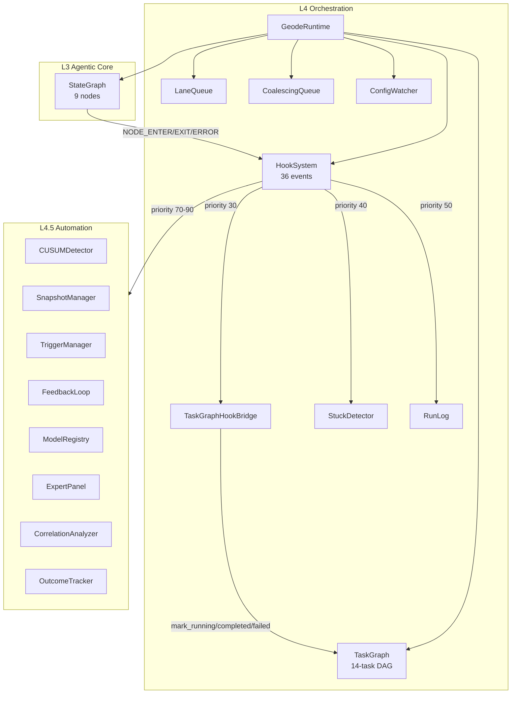
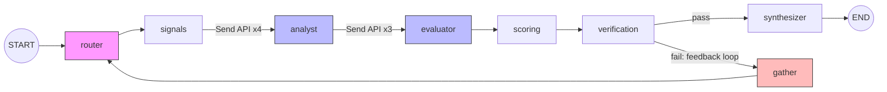
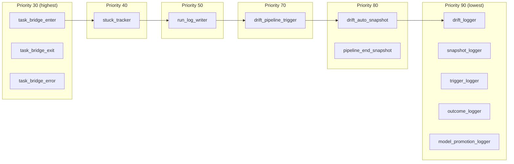
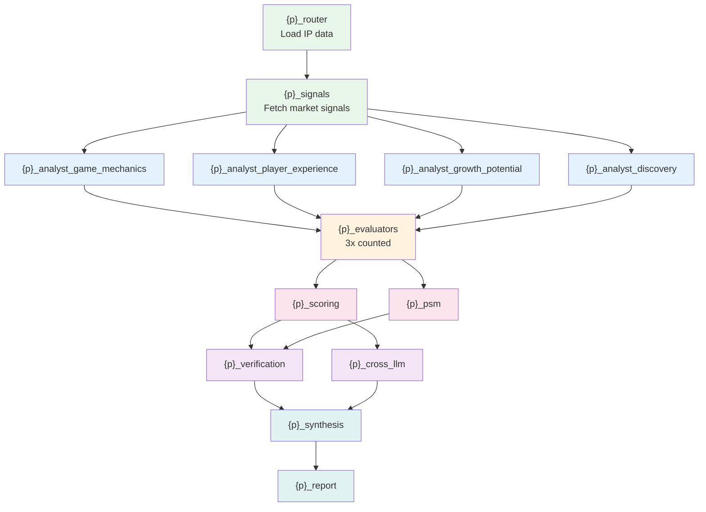
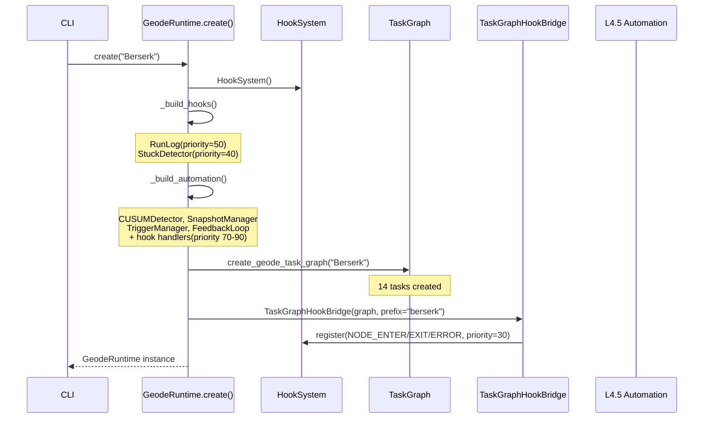
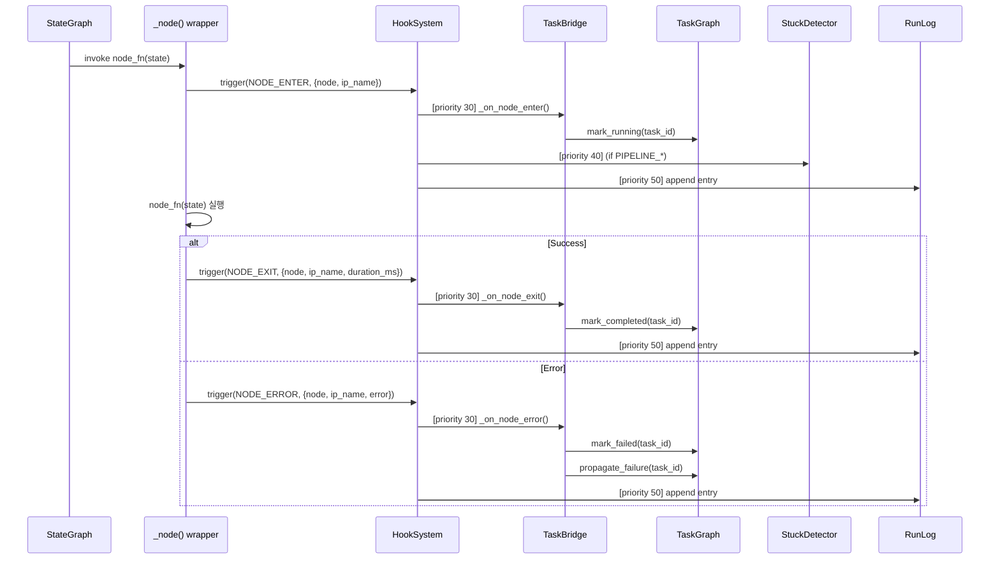
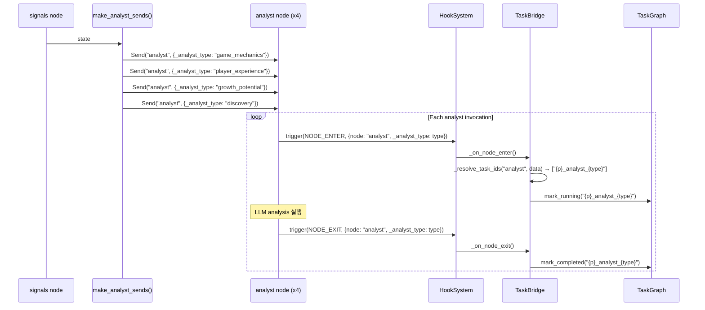
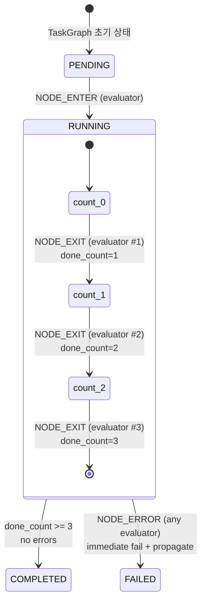
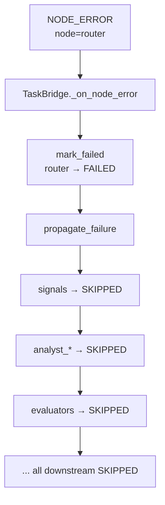

# Geode Orchestration Layer — Operation Guide

> L4 Orchestration + L4.5 Automation 동작 과정 및 아키텍처
>
> **Note**: 이 문서는 초기 설계 버전 기준으로 작성됨. `cortex` 노드는 폐기되어 `router`로 대체됨. 정확한 수치는 `CLAUDE.md` 참조.

## 1. Overview

Geode의 오케스트레이션 레이어는 **L4 Orchestration**과 **L4.5 Automation** 두 계층으로 구성된다.

- **L4**: LangGraph StateGraph 실행, HookSystem 이벤트, TaskGraph DAG 상태 추적
- **L4.5**: 드리프트 감지, 자동 스냅샷, 트리거 체인, 피드백 루프

핵심 설계 원칙: **TaskGraph는 observer** — LangGraph 실행을 제어하지 않으며, HookSystem 이벤트를 수신하여 상태만 추적한다.

---

## 2. Component Architecture



---

## 3. LangGraph StateGraph Topology

### 3.1 Node-Edge Diagram



### 3.2 Node Inventory (9 nodes)

| Node | 호출 횟수 | Send API | Hook Wrapping |
|------|----------|----------|---------------|
| `router` | 1x | No | `_node()` |
| `signals` | 1x | No | `_node()` |
| `analyst` | 4x | Yes (`make_analyst_sends`) | `_node()` + `_analyst_type` injection |
| `evaluator` | 3x | Yes (`make_evaluator_sends`) | `_node()` + `_evaluator_type` injection |
| `scoring` | 1x | No | `_node()` |
| `verification` | 1x | No | `_node()` |
| `synthesizer` | 1x | No | `_node()` |
| `gather` | 0-Nx | No | `_node()` |

### 3.3 Edge Definitions

```
START → router                           (direct)
router → signals                         (direct)
signals → analyst[]                      (conditional: make_analyst_sends, Send API)
analyst → evaluator[]                    (conditional: make_evaluator_sends, Send API)
evaluator → scoring                      (direct)
scoring → verification                   (direct)
verification → synthesizer | gather      (conditional: _configured_should_continue)
gather → router                          (direct, feedback loop)
synthesizer → END                        (direct)
```

---

## 4. HookSystem Event Flow

### 4.1 HookEvent Enum (36 events)

| Category | Event | 설명 |
|----------|-------|------|
| Pipeline | `PIPELINE_START` | 파이프라인 시작 |
| Pipeline | `PIPELINE_END` | 파이프라인 정상 종료 |
| Pipeline | `PIPELINE_ERROR` | 파이프라인 에러 종료 |
| Node | `NODE_ENTER` | 노드 실행 시작 |
| Node | `NODE_EXIT` | 노드 실행 완료 |
| Node | `NODE_ERROR` | 노드 실행 에러 |
| Analysis | `ANALYST_COMPLETE` | 개별 Analyst 완료 |
| Analysis | `EVALUATOR_COMPLETE` | 개별 Evaluator 완료 |
| Analysis | `SCORING_COMPLETE` | 스코어링 완료 |
| Verification | `VERIFICATION_PASS` | 검증 통과 |
| Verification | `VERIFICATION_FAIL` | 검증 실패 |
| Automation | `DRIFT_DETECTED` | 드리프트 감지 |
| Automation | `OUTCOME_COLLECTED` | 결과 수집 |
| Automation | `MODEL_PROMOTED` | 모델 승격 |
| Automation | `SNAPSHOT_CAPTURED` | 스냅샷 캡처 |
| Automation | `TRIGGER_FIRED` | 트리거 발동 |

### 4.2 Handler Priority Ordering



| Priority | Handler | Event(s) | 역할 |
|----------|---------|----------|------|
| **30** | `task_bridge_enter` | NODE_ENTER | TaskGraph → RUNNING |
| **30** | `task_bridge_exit` | NODE_EXIT | TaskGraph → COMPLETED |
| **30** | `task_bridge_error` | NODE_ERROR | TaskGraph → FAILED + propagate |
| **40** | `stuck_tracker` | PIPELINE_START/END/ERROR | StuckDetector 추적 |
| **50** | `run_log_writer` | ALL 36 events | RunLog append |
| **70** | `drift_pipeline_trigger` | DRIFT_DETECTED | 재실행 트리거 |
| **80** | `drift_auto_snapshot` | DRIFT_DETECTED | 자동 스냅샷 캡처 |
| **80** | `pipeline_end_snapshot` | PIPELINE_END | 완료 시 스냅샷 |
| **90** | `drift_logger` | DRIFT_DETECTED | 로깅 |
| **90** | `snapshot_logger` | SNAPSHOT_CAPTURED | 로깅 |
| **90** | `trigger_logger` | TRIGGER_FIRED | 로깅 |
| **90** | `outcome_logger` | OUTCOME_COLLECTED | 로깅 |
| **90** | `model_promotion_logger` | MODEL_PROMOTED | 로깅 |

---

## 5. TaskGraph DAG (13 Tasks)

### 5.1 Task Dependency Diagram



### 5.2 Topological Batches (병렬 실행 가능 단위)

| Batch | Tasks | 병렬도 |
|-------|-------|--------|
| 0 | `router` | 1 |
| 1 | `signals` | 1 |
| 2 | `analyst_game_mechanics`, `analyst_player_experience`, `analyst_growth_potential`, `analyst_discovery` | **4** |
| 3 | `evaluators` | 1 (내부 3x counted) |
| 4 | `scoring`, `psm` | **2** |
| 5 | `verification`, `cross_llm` | **2** |
| 6 | `synthesis` | 1 |
| 7 | `report` | 1 |

### 5.3 Node → Task Mapping

| LangGraph Node | 매핑 패턴 | TaskGraph task_id(s) |
|----------------|----------|---------------------|
| `router` | 1:1 | `{p}_router` |
| `signals` | 1:1 | `{p}_signals` |
| `analyst` | subtype 분기 | `{p}_analyst_{_analyst_type}` |
| `evaluator` | 카운팅 (3회) | `{p}_evaluators` |
| `scoring` | 1:N | `{p}_scoring` + `{p}_psm` |
| `verification` | 1:N | `{p}_verification` + `{p}_cross_llm` |
| `synthesizer` | 1:N | `{p}_synthesis` + `{p}_report` |
| `gather` | **무시** | (없음) |

---

## 6. End-to-End Execution Flow

### 6.1 Runtime Initialization



### 6.2 Pipeline Execution — Per-Node Hook Flow



### 6.3 Analyst Send API — Subtype Propagation



### 6.4 Evaluator Counting Pattern



**규칙**:
- `_evaluator_done_count`: NODE_EXIT + NODE_ERROR 합산
- 3회 도달 시 COMPLETED (에러 없을 때)
- 에러 발생 시: 즉시 FAILED + `propagate_failure()` → 하위 task SKIPPED
- 나머지 evaluator의 EXIT도 `done_count`에 반영 (추적 목적)

---

## 7. L4.5 Reactive Chains

### 7.1 Drift Detection → Auto-Snapshot → Trigger

```mermaid
graph LR
    subgraph "Event Source"
        SC[SCORING_COMPLETE]
    end

    subgraph "Priority 50"
        DS[drift_scan_on_scoring<br/>CUSUMDetector.scan_all()]
    end

    subgraph "Drift Detected"
        DD[DRIFT_DETECTED]
    end

    subgraph "Priority 70"
        DPT[drift_pipeline_trigger<br/>TriggerManager.make_event_handler()]
    end

    subgraph "Priority 80"
        DAS[drift_auto_snapshot<br/>SnapshotManager.capture()]
    end

    subgraph "Priority 90"
        DL[drift_logger]
    end

    subgraph "Cascading"
        SNC[SNAPSHOT_CAPTURED]
        TF[TRIGGER_FIRED]
    end

    SC --> DS
    DS -->|"severity >= warning"| DD
    DD --> DPT
    DD --> DAS
    DD --> DL
    DAS --> SNC
    DPT --> TF
```

### 7.2 Pipeline End → Snapshot

```mermaid
graph LR
    PE[PIPELINE_END] -->|priority 40| ST[stuck_tracker<br/>mark_completed]
    PE -->|priority 50| RL[run_log_writer]
    PE -->|priority 80| PES[pipeline_end_snapshot<br/>SnapshotManager.capture()]
    PES --> SC2[SNAPSHOT_CAPTURED]
```

### 7.3 Error Propagation



---

## 8. Runtime Initialization Order

```mermaid
graph TD
    subgraph "Phase 1: Core Infrastructure"
        A1[session_key + run_id]
        A2[HookSystem]
        A3[RunLog → priority 50]
        A4[StuckDetector → priority 40]
    end

    subgraph "Phase 2: Services"
        B1[SessionStore]
        B2[PolicyChain + ToolRegistry]
        B3[Auth: ProfileStore, Rotator, Cooldown]
        B4[LLM Adapters: Claude, OpenAI]
    end

    subgraph "Phase 3: Infra"
        C1[CoalescingQueue]
        C2[ConfigWatcher]
        C3[LaneQueue]
        C4[Memory: Project, Org, ContextAssembler]
    end

    subgraph "Phase 4: Automation (L4.5)"
        D1[CUSUMDetector]
        D2[ModelRegistry]
        D3[ExpertPanel + CorrelationAnalyzer]
        D4[OutcomeTracker]
        D5[SnapshotManager]
        D6[TriggerManager → scheduler start]
        D7[FeedbackLoop]
        D8["Hook handlers → priority 70-90"]
    end

    subgraph "Phase 5: Task Tracking"
        E1[TaskGraph: 14 tasks]
        E2[TaskGraphHookBridge → priority 30]
    end

    subgraph "Phase 6: Assembly"
        F1[GeodeRuntime instance]
    end

    A1 --> A2 --> A3 --> A4
    A4 --> B1 --> B2 --> B3 --> B4
    B4 --> C1 --> C2 --> C3 --> C4
    C4 --> D1 --> D2 --> D3 --> D4 --> D5 --> D6 --> D7 --> D8
    D8 --> E1 --> E2 --> F1
```



---

## 9. Summary Statistics

| Metric | Count |
|--------|-------|
| HookEvent types | 16 |
| Hook handlers registered | 14 |
| LangGraph nodes | 9 |
| LangGraph edges | 11 (6 direct + 5 conditional) |
| TaskGraph tasks | 13 |
| TaskGraph topological batches | 8 |
| L4.5 automation components | 8 |
| Runtime initialization phases | 6 |

---

## 10. Key Source Files

| File | 역할 | Line Count |
|------|------|-----------|
| `geode/runtime.py` | Runtime wiring, hook registration | ~660 |
| `geode/graph.py` | LangGraph StateGraph 정의 | ~340 |
| `geode/orchestration/hooks.py` | HookSystem + HookEvent enum | ~180 |
| `geode/orchestration/task_system.py` | TaskGraph DAG executor | ~470 |
| `geode/orchestration/task_bridge.py` | Hook → TaskGraph bridge | ~210 |
| `geode/orchestration/stuck_detection.py` | Stuck pipeline detector | ~150 |
| `geode/orchestration/run_log.py` | Run log persistence | ~120 |
| `geode/automation/drift.py` | CUSUM drift detector | ~200 |
| `geode/automation/snapshot.py` | Snapshot capture/restore | ~170 |
| `geode/automation/triggers.py` | Event/scheduled triggers | ~250 |
| `geode/automation/feedback_loop.py` | Adaptive feedback cycle | ~180 |

---

*Source: `blog/legacy/architecture/orchestration-operation.md` | Category: [[blog-legacy]]*

## Related

- [[blog-legacy]]
- [[blog-hub]]
- [[geode]]
