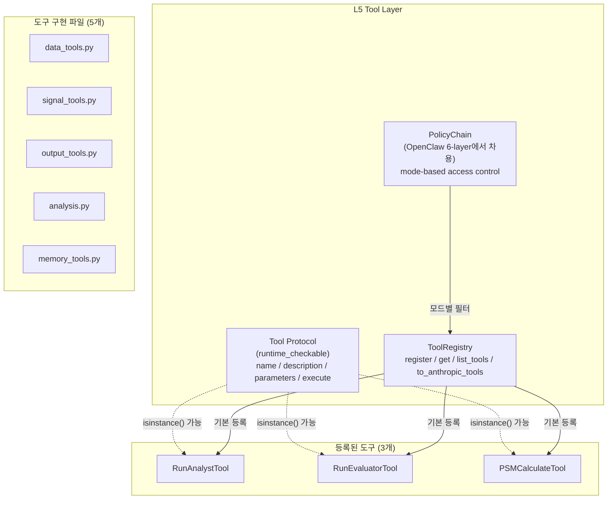
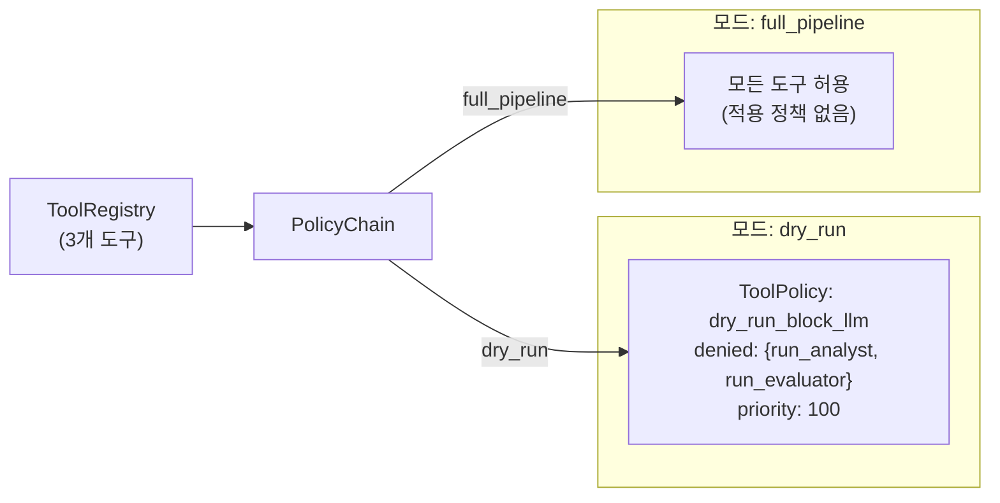
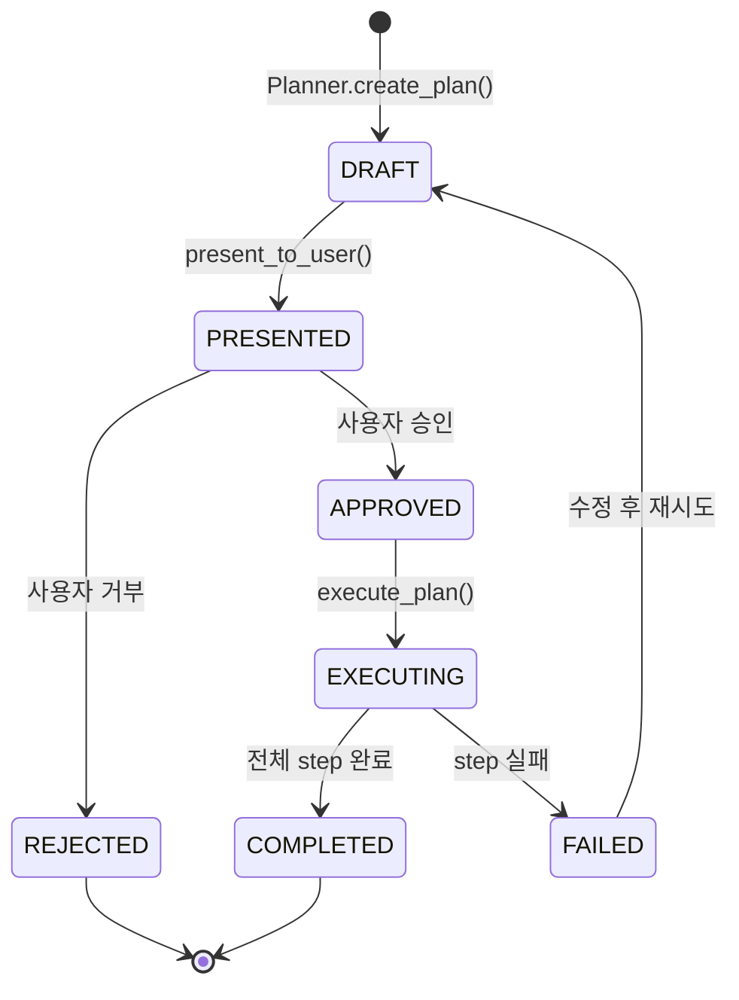
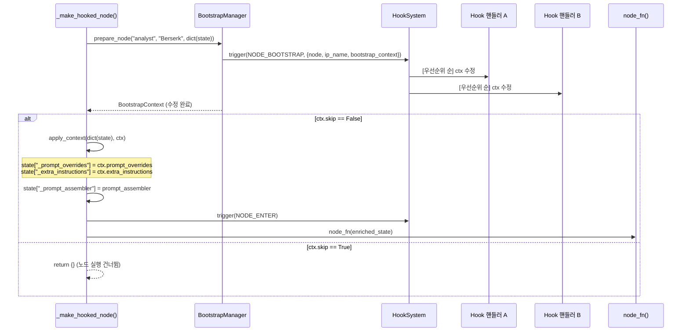
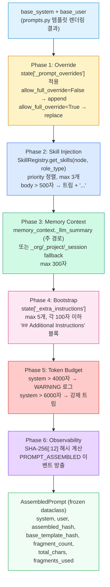
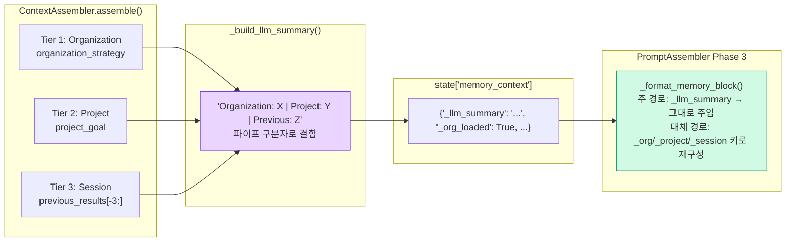
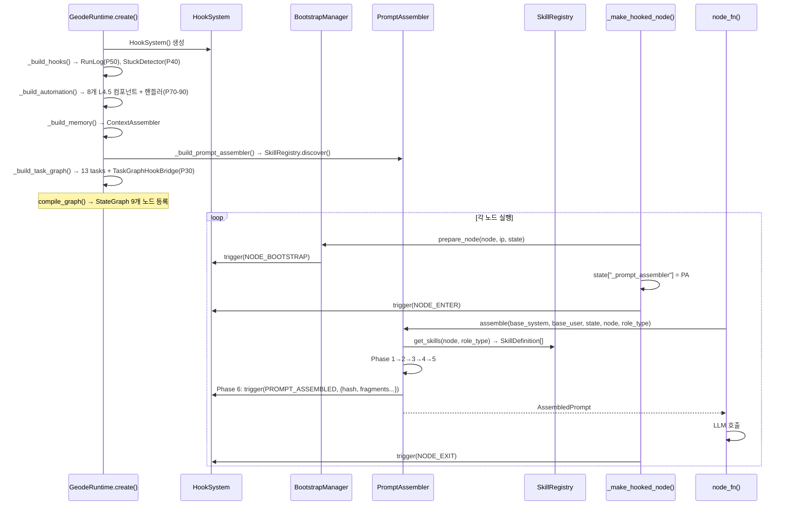

# GEODE 오케스트레이션 레이어 — 도구, 훅, 계획, 프롬프트 조립 기술 리포트

> L4 Orchestration 핵심 하위 시스템에 대한 기술 리포트입니다.
> ADR-007 Prompt & Skill Injection 반영 기준 (2026-02-27)
>
> **Note**: 이 문서는 초기 설계 버전 기준. 이벤트/도구 수 등 수치는 `CLAUDE.md` 참조.

---

## 1. 개요

GEODE 오케스트레이션 레이어는 LangGraph `StateGraph` 위에 구축된 5개의 핵심 하위 시스템으로 구성되어 있습니다.

| 하위 시스템 | 역할 | 핵심 파일 |
|---|---|---|
| **HookSystem** | 이벤트 기반 확장 포인트 (36개 이벤트) | `core/hooks/` → [hook-system.md](hook-system.md) |
| **ToolSystem** | LLM-driven 도구 사용 및 정책 기반 접근 제어 | `tools/base.py`, `tools/registry.py`, `tools/policy.py` |
| **PlanMode** | 복합 분석 요청의 plan-before-execute 패턴 | `orchestration/plan_mode.py`, `orchestration/planner.py` |
| **BootstrapManager** | 노드 실행 전 구성 주입 (`NODE_BOOTSTRAP`) | `orchestration/bootstrap.py` |
| **PromptAssembler** | 6-phase 프롬프트 조립 (ADR-007) | `llm/prompt_assembler.py`, `llm/skill_registry.py` |

본 문서는 각 시스템의 구현 세부사항, 시스템 간 상호작용, 그리고 소스 코드에 기반한 정확한 데이터 흐름을 기술합니다.

---

## 2. HookSystem

> **별도 문서로 분리됨**: [hook-system.md](hook-system.md)
>
> HookSystem은 `core/hooks/`로 독립 모듈화 (cross-cutting concern). L0~L5 전 레이어에서 접근.
> 36개 이벤트, 14+ 핸들러, 우선순위 기반 실행.

---

## 3. Tool System — LLM 도구 사용 및 정책 기반 접근 제어

### 3.1 계층 구조



**참고**: `_build_default_registry()`에서 실제로 등록되는 도구는 `RunAnalystTool`, `RunEvaluatorTool`, `PSMCalculateTool` 3개입니다 (`runtime.py:146-152`). `data_tools.py`, `signal_tools.py`, `output_tools.py`, `memory_tools.py`는 도구 구현을 포함하지만, 현 시점에서 ToolRegistry에는 자동 등록되지 않습니다.

### 3.2 Tool Protocol

`tools/base.py`에 정의된 도구 프로토콜입니다.

```python
@runtime_checkable
class Tool(Protocol):
    @property
    def name(self) -> str: ...           # snake_case 고유 이름
    @property
    def description(self) -> str: ...     # LLM 도구 선택을 위한 설명
    @property
    def parameters(self) -> dict: ...     # JSON Schema
    def execute(self, **kwargs) -> dict:  # {"result": ...} 반환
```

`@runtime_checkable` 데코레이터를 사용하여 `isinstance(obj, Tool)` 검사가 가능합니다. 이를 통해 동적 도구 등록 시에도 타입 안전성을 확보하실 수 있습니다.

### 3.3 PolicyChain — 모드별 접근 제어

PolicyChain은 **OpenClaw의 6-layer Policy Resolution Chain** 패턴에서 차용한 설계입니다 (`policy.py:1-6` 주석 참조). GEODE에서는 파이프라인 모드(`full_pipeline`, `evaluation`, `scoring`, `dry_run`)에 맞춰 적용합니다.



핵심 동작 규칙:
- 도구는 **모든** 적용 가능한 정책을 통과해야 허용됩니다 (`all(p.is_allowed(name) for p in applicable)`)
- `mode="*"` 정책은 모든 모드에 적용됩니다
- `allowed_tools`가 설정되면 whitelist 모드로 동작합니다 (allowed가 denied보다 우선)
- `audit_check()` 메서드로 평가 추적이 가능합니다 (`PolicyAuditResult` 반환)

---

## 4. PlanMode — Plan-Before-Execute

### 4.1 라이프사이클



### 4.2 핵심 데이터 모델

`plan_mode.py`에 정의된 데이터 모델입니다. `PlanStep`은 `frozen=True`로 불변(immutable)합니다.

| 클래스 | 핵심 필드 | 특성 |
|---|---|---|
| `PlanStatus` | 7개 상태 (DRAFT, PRESENTED, APPROVED, EXECUTING, COMPLETED, REJECTED, FAILED) | Enum |
| `PlanStep` | `step_id`, `description`, `node_name`, `estimated_time_s`, `dependencies`, `metadata` | frozen dataclass |
| `AnalysisPlan` | `plan_id`, `ip_name`, `steps`, `status`, `total_estimated_time_s`, `total_estimated_cost`, `created_at`, `metadata` | mutable dataclass |

### 4.3 실행 순서 계산

`AnalysisPlan.execution_order()` 메서드는 위상 정렬(topological sort) 기반으로 병렬 실행 가능한 배치를 계산합니다. `TaskGraph.topological_order()`와 동일한 알고리즘을 사용합니다.

---

## 5. BootstrapManager — 노드 실행 전 구성 주입

### 5.1 데이터 흐름

`_make_hooked_node()` 래퍼 내부에서 BootstrapManager가 호출되는 정확한 순서입니다 (`graph.py:80-88` 참조).



### 5.2 BootstrapContext 필드

| 필드 | 타입 | 용도 | PromptAssembler 연결 |
|---|---|---|---|
| `node_name` | `str` | 대상 노드 이름 | — |
| `ip_name` | `str` | 분석 대상 IP | — |
| `prompt_overrides` | `dict[str, str]` | 프롬프트 오버라이드 (`{node}_system` 키) | Phase 1 |
| `extra_instructions` | `list[str]` | 추가 지시사항 | Phase 4 |
| `parameters` | `dict[str, Any]` | 노드 파라미터 오버라이드 | — |
| `skip` | `bool` | 노드 실행 건너뛰기 | — |

---

## 6. PromptAssembler — 6-Phase 프롬프트 조립 (ADR-007)

### 6.1 해결하는 5가지 단절(Disconnection)

ADR-007에서 식별된 단절과 각 해결 Phase의 대응입니다.

| # | 단절 | 해결 Phase |
|---|---|---|
| 1 | Bootstrap 오버라이드가 LLM 노드에 도달하지 않음 | Phase 1 (Override) + Phase 4 (Bootstrap) |
| 2 | 메모리 컨텍스트가 LLM에 도달하지 않음 | Phase 3 (Memory Context) |
| 3 | Hook 메타데이터가 프롬프트에 영향 없음 | Phase 6 (`PROMPT_ASSEMBLED` 이벤트) |
| 4 | 프롬프트가 `prompts.py`에 하드코딩 | Phase 2 (Skill Fragment Injection) |
| 5 | 프롬프트 변경 추적 불가 | Phase 6 (SHA-256 해시 + fragment 메타데이터) |

### 6.2 6-Phase 조립 파이프라인

`prompt_assembler.py:89-204`에 구현된 정확한 Phase 순서입니다.



### 6.3 Token Budget 설정값

`PromptAssembler.__init__()` 시그니처에서 확인한 정확한 기본값입니다.

| 파라미터 | 기본값 | 적용 Phase | 초과 시 동작 |
|---|---|---|---|
| `max_skill_chars` | 500 | Phase 2 | body 트림 + `"..."` + WARNING 로그 |
| `max_skills_per_node` | 3 | Phase 2 | priority 상위 3개만 사용 |
| `max_memory_chars` | 300 | Phase 3 | 블록 트림 + `"..."` + WARNING 로그 |
| `max_extra_instructions` | 5 | Phase 4 | 앞 5개만 사용 |
| `max_extra_instruction_chars` | 100 | Phase 4 | 개별 지시사항 트림 |
| `prompt_warning_chars` | 4000 | Phase 5 | WARNING 로그 |
| `prompt_hard_limit_chars` | 6000 | Phase 5 | `system[:6000]` 강제 트림 + ERROR 로그 |

### 6.4 SkillRegistry — .md 기반 스킬 확장

`skill_registry.py`에 구현된 스킬 시스템입니다.

**Discovery 우선순위** (OpenClaw Progressive Disclosure 패턴에서 차용):

| 순위 | 경로 | 설명 |
|---|---|---|
| 1 | `geode/skills/*.md` | 패키지 번들 |
| 2 | `./skills/*.md` | 프로젝트 루트 |
| 3 | `~/.geode/skills/*.md` | 사용자 글로벌 |
| 4 | `extra_dirs` 파라미터 | CLI `--skills-dir` |

**Frontmatter 파서**: PyYAML 의존성 없이 정규식 기반으로 구현되어 있습니다 (`_FRONTMATTER_RE`, `_KV_RE`). 단순 `key: value` 쌍만 지원하며, 중첩이나 리스트는 지원하지 않습니다.

**ANALYST_SPECIFIC 마이그레이션** (ADR-007 Phase 2 Step 16): 스킬 `.md`가 특정 analyst type에 존재하면, 기존 `prompts.py`의 `ANALYST_SPECIFIC[analyst_type]` 하드코딩 가이던스가 억제됩니다 (`analysts.py:36-43`).

### 6.5 노드 통합 패턴

모든 LLM 호출 노드에서 동일한 패턴을 사용합니다.

| 노드 | 소스 파일 | `node` 인자 | `role_type` 인자 |
|---|---|---|---|
| Analyst (4종) | `nodes/analysts.py` | `"analyst"` | `analyst_type` (game_mechanics 등) |
| Evaluator (3종) | `nodes/evaluators.py` | `"evaluator"` | `evaluator_type` (quality_judge 등) |
| Synthesizer | `nodes/synthesizer.py` | `"synthesizer"` | `"synthesis"` |
| BiasBuster | `verification/biasbuster.py` | `"biasbuster"` | `"bias_detection"` |

통합 패턴 (`state.get("_prompt_assembler")` → fallback):

```python
assembler = state.get("_prompt_assembler")
if assembler is not None:
    result = assembler.assemble(
        base_system=base_system,
        base_user=base_user,
        state=dict(state),  # dict() 복사 — GeodeState 타입 호환
        node="analyst",
        role_type=analyst_type,
    )
    return result.system, result.user
return base_system, base_user  # _prompt_assembler가 None이면 기존 동작
```

`_prompt_assembler`가 `None`이면 기존 동작과 100% 호환됩니다 (zero-impact migration).

---

## 7. 시스템 간 상호작용

### 7.1 Send API Key Propagation

Send API를 통한 병렬 노드 실행 시, ADR-007 키가 정확히 전파되는 경로입니다. `make_analyst_sends()`와 `make_evaluator_sends()` 모두 동일한 패턴을 따릅니다.

```python
# analysts.py:306-320 (make_analyst_sends 내부)
send_state = {
    "ip_name": state["ip_name"],
    "ip_info": state["ip_info"],
    "monolake": state["monolake"],
    "signals": state["signals"],
    "_analyst_type": atype,
    "analyses": [],         # Clean Context — 다른 analyst 결과 격리
    # ADR-007 키 전파:
    "_prompt_overrides": state.get("_prompt_overrides", {}),
    "_extra_instructions": state.get("_extra_instructions", []),
    "memory_context": state.get("memory_context"),
}
```

**주의**: `_prompt_assembler` 자체는 Send state에 포함되지 않습니다. `_make_hooked_node()` 래퍼가 closure를 통해 주입합니다 (`graph.py:91-93`). 이는 Send API의 worker thread에서 `contextvars`가 기본값으로 초기화되는 문제를 회피하기 위함입니다.

### 7.2 3-Tier Memory → PromptAssembler 경로



**대체 경로**: `_llm_summary`가 없을 경우, `_format_memory_block()`은 `_org_loaded`, `_project_loaded`, `_session_loaded` 플래그를 확인하여 개별 키에서 메모리 블록을 재구성합니다 (`prompt_assembler.py:224-254`, fallback 구간은 237행부터).

### 7.3 전체 실행 흐름



---

## 8. Observability 메트릭

### 8.1 PROMPT_ASSEMBLED 이벤트 페이로드

`prompt_assembler.py:191-202`에서 방출하는 정확한 페이로드입니다.

```python
{
    "node": "analyst",                          # 노드 이름
    "role_type": "game_mechanics",              # 역할 타입
    "assembled_hash": "a1b2c3d4e5f6",          # SHA-256[:12] (최종 프롬프트)
    "base_template_hash": "f6e5d4c3b2a1",      # SHA-256[:12] (원본 템플릿)
    "fragment_count": 3,                        # 주입된 fragment 수
    "total_chars": 2847,                        # len(system) + len(user)
    "fragments_used": [                         # fragment 식별자 배열
        "analyst-game-mechanics:1.0",           # 스킬 (name:version)
        "memory-context",                        # 메모리 컨텍스트
        "bootstrap-extra:2"                     # 추가 지시사항 (key:count)
    ]
}
```

**프롬프트 변경 감지**: `assembled_hash != base_template_hash`이면 스킬, 메모리, 또는 오버라이드에 의해 프롬프트가 수정된 것입니다. `fragment_count == 0`일 경우 두 해시는 동일합니다.

### 8.2 Override fragment 식별자 명명 규칙

| fragment 패턴 | 의미 |
|---|---|
| `override:{node}_system` | 전체 교체 (`allow_full_override=True`) |
| `override-append:{node}_system` | 추가 모드 (기본) |
| `{skill_name}:{version}` | 스킬 주입 |
| `memory-context` | 메모리 컨텍스트 주입 |
| `bootstrap-extra:{count}` | 추가 지시사항 (`count`개 주입) |

---

## 9. Summary Statistics (소스 코드 기준)

| 항목 | 수치 | 근거 |
|---|---|---|
| HookEvent 타입 | **36** | `hooks.py` HookEvent 열거형 |
| 등록 핸들러 (기본) | **14** (drift_scan 조건부 포함) | `runtime.py` + `graph.py` |
| Tool Protocol 구현 파일 | **5** (data, signal, output, analysis, memory) | `tools/*.py` |
| ToolRegistry 기본 등록 | **3** (RunAnalyst, RunEvaluator, PSMCalculate) | `_build_default_registry()` |
| PolicyChain 기본 정책 | **1** (dry_run_block_llm) | `_build_default_policies()` |
| PromptAssembler Phase | **6** | `prompt_assembler.py` |
| SkillRegistry 탐색 경로 | **4** | `_resolve_skill_dirs()` |
| 번들 스킬 `.md` 파일 | **4** (analyst 4종) | `geode/skills/` |
| Token budget 파라미터 | **7** | `PromptAssembler.__init__()` |
| PlanStatus 상태 | **7** | `plan_mode.py` PlanStatus 열거형 |
| TaskStatus 상태 | **6** (PENDING, READY, RUNNING, COMPLETED, FAILED, SKIPPED) | `task_system.py` |
| TaskGraph 기본 task | **13** | `create_geode_task_graph()` |
| GeodeState reducer 필드 | **4** (analyses, evaluations, errors, iteration_history) | `state.py` |
| ADR-007 전파 키 | **3** (_prompt_overrides, _extra_instructions, memory_context) | `make_analyst_sends()` / `make_evaluator_sends()` |

---

## 10. 핵심 소스 파일 참조

| 파일 | 역할 | 핵심 요소 |
|---|---|---|
| `orchestration/hooks.py` | HookSystem + HookEvent(36) | `HookSystem`, `HookEvent`, `HookResult`, `_RegisteredHook` |
| `orchestration/bootstrap.py` | 노드 실행 전 구성 | `BootstrapManager`, `BootstrapContext` |
| `orchestration/plan_mode.py` | Plan-before-execute | `PlanStatus`(7), `PlanStep`, `AnalysisPlan` |
| `orchestration/task_system.py` | TaskGraph DAG | `TaskGraph`, `Task`, `TaskStatus`(6), `_TaskGraphStats` |
| `orchestration/task_bridge.py` | Hook → TaskGraph 브릿지 | `TaskGraphHookBridge`, `_EVALUATOR_EXPECTED_COUNT=3` |
| `llm/prompt_assembler.py` | 6-phase 프롬프트 조립 | `PromptAssembler`, `AssembledPrompt` |
| `llm/skill_registry.py` | .md 스킬 관리 | `SkillRegistry`, `SkillDefinition`, `_parse_frontmatter()` |
| `tools/base.py` | Tool Protocol | `Tool` (Protocol, runtime_checkable) |
| `tools/registry.py` | 도구 등록/조회 | `ToolRegistry.to_anthropic_tools()` |
| `tools/policy.py` | 모드별 접근 제어 | `PolicyChain`, `ToolPolicy`, `PolicyAuditResult` |
| `memory/context.py` | 3-tier 메모리 조립 | `ContextAssembler`, `_build_llm_summary()` |
| `graph.py` | StateGraph 정의 + 컴파일 | `build_graph()`, `compile_graph()`, `_make_hooked_node()` |
| `runtime.py` | 전체 인프라 와이어링 | `GeodeRuntime.create()`, 7개 `_build_*()` 메서드 |

---

*Source: `blog/legacy/architecture/orchestration-tools-hooks-plans.md` | Category: [[blog-legacy]]*

## Related

- [[blog-legacy]]
- [[blog-hub]]
- [[geode]]
