# Paperclip 리서치 — 자율 AI 에이전트 오케스트레이션 플랫폼

> Date: 2026-04-01 | Repo: `paperclipai/paperclip`
> Status: 리서치 완료

---

## 0. 개요

Paperclip은 **자율 AI 에이전트들을 하나의 "회사"로 조직하고 운영하는 오픈소스 컨트롤 플레인**입니다. 단일 인간 운영자(Board)가 20+ AI 에이전트를 조직도, 예산, 거버넌스, 목표 체계를 통해 감독합니다.

핵심 철학: *"If OpenClaw is an employee, Paperclip is the company."*

| 항목 | 내용 |
|------|------|
| Repo | [paperclipai/paperclip](https://github.com/paperclipai/paperclip) |
| License | MIT |
| 언어 | TypeScript (Node.js 20+, pnpm monorepo) |
| DB | PostgreSQL 17 (Drizzle ORM) + Embedded PGlite |
| UI | React 19 + Vite 6 + Tailwind 4 |
| 어댑터 | 7종 (Claude, Codex, Cursor, Gemini, OpenCode, Pi, OpenClaw) |
| 스키마 | 61 테이블 |
| 플러그인 | SDK + 4 예제 (Linear, Slack 등 연동 가능) |

이 프로젝트가 흥미로운 이유는 **추상화 계층의 점프** 때문입니다. 지금까지 에이전트 도구들은 "하나의 에이전트를 더 잘 동작시키는 것"에 집중했습니다 — LangChain은 워크플로우를, CrewAI는 역할 기반 협업을, Claude Code는 코딩 실행을 최적화합니다. Paperclip은 이 모든 것을 **"직원"으로 간주하고, 그 위에 "회사"를 세우는** 접근입니다. 개별 에이전트의 품질이 아무리 높아도, 20개가 동시에 서로 다른 방향으로 달리면 가치가 상쇄됩니다. Paperclip은 바로 이 **조율 공백(Coordination Gap)**을 타겟합니다.

---

## 1. 문제 정의 — 왜 에이전트에게 "회사"가 필요한가

AI 에이전트 하나를 실행하는 것은 쉽습니다. **20개 에이전트를 동시에 비즈니스 목표 방향으로 조율**하는 것이 어렵습니다. 2026년 4월 현재, 프론티어 모델의 코딩 능력은 SWE-bench Verified 기준 70%를 넘었고, 단일 에이전트에 수십 시간짜리 태스크를 맡기는 것이 일상이 되었습니다. 그 결과, 실무에서 **동시 에이전트 수가 급증**하면서 새로운 문제가 수면 위로 올라왔습니다:

| 문제 | 설명 | Paperclip의 해법 |
|------|------|-----------------|
| **조율 부재** | 에이전트 간 작업 중복, 충돌, 우선순위 불일치 | 조직도 + 계층적 목표 + atomic checkout |
| **예산 폭주** | 토큰 비용 통제 없이 에이전트가 무한 실행 | Agent-level budget hard-stop |
| **감독 불가** | 무엇을 하고 있는지, 얼마를 쓰고 있는지 실시간 파악 불가 | 실시간 Dashboard + WebSocket 로그 |
| **거버넌스 공백** | 고영향 결정(채용, 전략 변경)에 인간 승인 부재 | Approval gates (Board 승인) |
| **이식성 부재** | 조직 구성을 다른 환경으로 복제·공유 불가 | Company template export/import/fork |

이 문제들의 공통 근원은 **에이전트를 "도구"가 아니라 "조직 구성원"으로 다루는 프레임이 없었다**는 것입니다. Paperclip은 이 프레임을 최초로 소프트웨어로 구현합니다.

---

## 2. 아키텍처

### 2.1 시스템 레이어

Paperclip의 핵심 설계 결정은 **Control Plane과 Execution Plane의 분리**입니다. Kubernetes가 컨테이너를 직접 실행하지 않고 kubelet에게 위임하듯, Paperclip은 에이전트를 직접 실행하지 않고 어댑터를 통해 외부 런타임에 위임합니다. 이 분리가 BYOA(Bring Your Own Agent) 철학의 기술적 토대입니다.

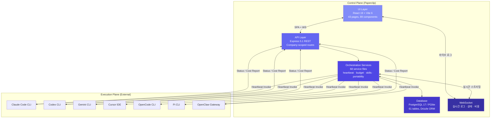

이 구조에서 주목할 점은 **화살표의 방향**입니다. Paperclip → 에이전트 방향은 "하트비트 호출"이고, 에이전트 → Paperclip 방향은 "상태/비용 보고"입니다. 에이전트는 자기가 Paperclip에 의해 관리되고 있다는 사실을 몰라도 됩니다 — 어댑터가 이 간극을 메웁니다.

### 2.2 핵심 원칙

| 원칙 | 설명 | 왜 이렇게 했는가 |
|------|------|-----------------|
| **Company-First** | 모든 엔티티가 `company_id`로 스코핑 | 멀티 테넌시: 한 서버에서 여러 AI 회사를 격리 운영 |
| **BYOA** | 특정 런타임에 종속하지 않음 | 모델 가격/성능이 빠르게 변하므로 교체 비용을 0으로 |
| **Control ≠ Execution** | 오케스트레이션만 담당 | 에이전트 런타임 다양성 수용, 장애 격리 |
| **Atomic Execution** | DB 레벨 atomic checkout | 20개 에이전트가 동시에 같은 태스크를 잡는 것을 방지 |
| **Immutable Audit** | 모든 mutation append-only 기록 | 에이전트 행동의 사후 추적·디버깅·컴플라이언스 |

### 2.3 모노레포 패키지 구조

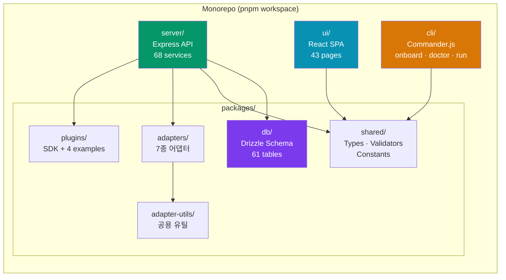

**왜 모노레포인가**: 어댑터, 스키마, 공유 타입이 서버·UI·CLI 전체에 걸쳐 사용됩니다. pnpm workspace로 묶어 타입 안전성을 보장하면서도 패키지 간 경계를 명확히 유지합니다. `@paperclipai/shared`의 타입 하나를 변경하면 서버와 UI가 동시에 타입 체크에 실패하므로, 스키마 드리프트를 빌드 타임에 잡아냅니다.

---

## 3. 데이터 모델 — 61 테이블의 설계 의도

Paperclip의 DB 스키마는 단순한 CRUD 테이블이 아니라 **조직 운영의 개념 모델**을 그대로 반영합니다. "회사에 직원이 있고, 직원이 태스크를 맡고, 태스크에 비용이 발생하고, 고영향 결정은 이사회 승인이 필요하다" — 이 문장이 곧 스키마입니다.

### 3.1 ER 다이어그램 (핵심 엔티티)

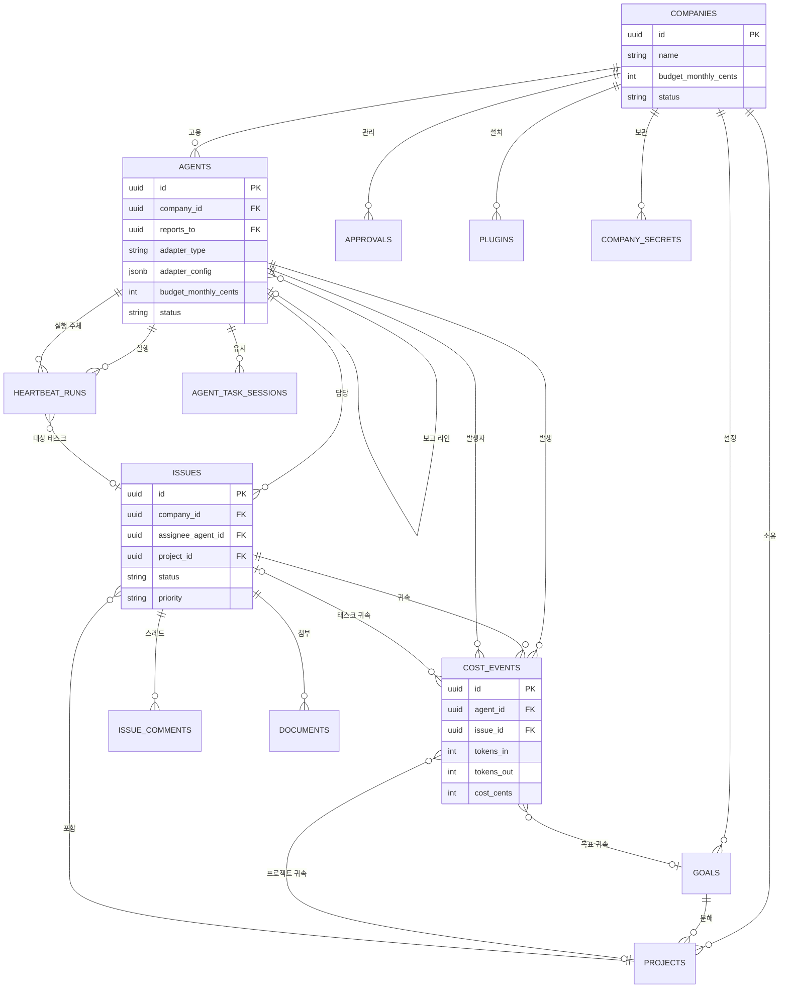

### 3.2 테이블 그룹별 역할

**조직 구조 (5 테이블)**: `companies` → `agents` → `goals` → `projects` → `issues`. 이 체인이 "왜 이 작업을 하는가"의 추적 경로입니다. 모든 태스크는 프로젝트에, 프로젝트는 목표에, 목표는 회사에 귀속됩니다.

**실행·추적 (5 테이블)**: `heartbeat_runs`(실행 기록), `cost_events`(비용), `activity_log`(감사), `execution_workspaces`(격리 환경), `agent_task_sessions`(세션 영속). 에이전트가 "무엇을 했고, 얼마를 썼고, 어디서 실행됐는가"를 빠짐없이 기록합니다.

**거버넌스·보안 (4 테이블)**: `approvals`(승인 게이트), `company_secrets`(시크릿 메타), `company_secret_versions`(암호화 버전), `agent_api_keys`(해시된 토큰). 에이전트에게 권한을 부여하되, 고영향 결정에는 반드시 인간이 개입하도록 강제합니다.

**플러그인 (3 테이블)**: `plugins`, `plugin_jobs`, `plugin_webhooks`. 외부 시스템(Linear, Slack, GitHub) 연동의 런타임 상태를 관리합니다.

### 3.3 상태 머신

에이전트와 태스크는 명시적 상태 머신으로 관리됩니다. "상태가 뭔지 모르겠다"는 상황이 구조적으로 불가능합니다:

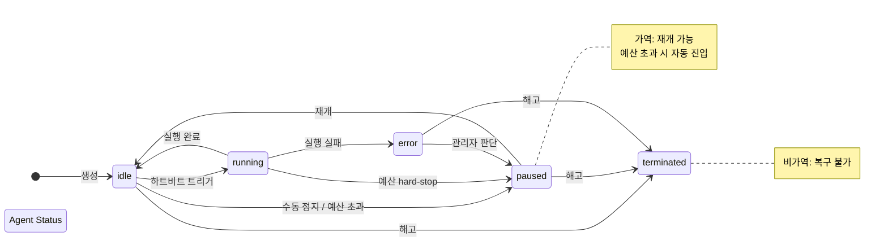

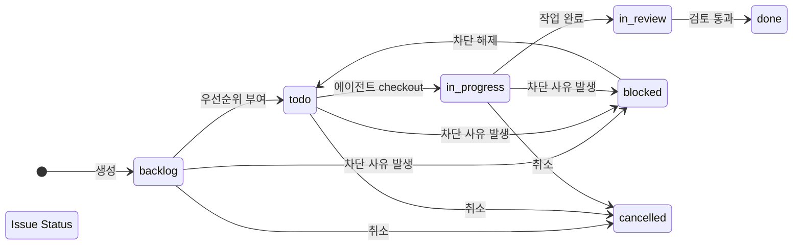

### 3.4 Atomic Checkout

태스크 이중 배정 방지를 위한 DB 레벨 원자적 checkout입니다. 20개 에이전트가 동시에 같은 태스크를 잡으려 할 때, 정확히 1개만 성공하고 나머지는 409 Conflict를 받습니다:

```
POST /issues/:id/checkout
{
  "agentId": "uuid",
  "expectedStatuses": ["todo", "backlog", "blocked"]
}
```

내부적으로는 PostgreSQL의 `SELECT ... FOR UPDATE SKIP LOCKED` 패턴을 사용하여, 락 경합 없이 원자성을 보장합니다.

---

## 4. 어댑터 시스템 — BYOA의 구현

어댑터는 Paperclip과 외부 에이전트 런타임 사이의 **번역 계층**입니다. Kubernetes의 CRI(Container Runtime Interface)와 유사한 역할을 합니다 — containerd든 CRI-O든 상관없이 같은 인터페이스로 소통하듯, claude_local이든 gemini_local이든 같은 프로토콜로 호출됩니다.

### 4.1 지원 어댑터 (7종)

| 어댑터 | 타입 | 대상 | 모델 예시 |
|--------|------|------|----------|
| `claude_local` | Process | Claude Code CLI | claude-opus-4-6, claude-sonnet-4-6 |
| `codex_local` | Process | Codex CLI | codex-1 |
| `cursor_local` | Process | Cursor IDE | cursor-agent |
| `gemini_local` | Process | Google Gemini CLI | gemini-2.5-pro |
| `opencode_local` | Process | OpenCode CLI | opencode-latest |
| `pi_local` | Process | Pi CLI | pi-latest |
| `openclaw_gateway` | HTTP/WS | OpenClaw 게이트웨이 | 다중 모델 |

6개는 로컬 프로세스 기반(CLI 호출), 1개는 HTTP/WebSocket 기반(원격 게이트웨이)입니다. Process 어댑터는 `child_process.spawn`으로 CLI를 실행하고, stdout/stderr을 WebSocket으로 스트리밍합니다.

### 4.2 하트비트 실행 흐름

하트비트(Heartbeat)는 Paperclip의 핵심 실행 프리미티브입니다. "에이전트를 깨워서, 컨텍스트를 주고, 일을 시키고, 결과를 수거하는" 전체 사이클을 의미합니다:

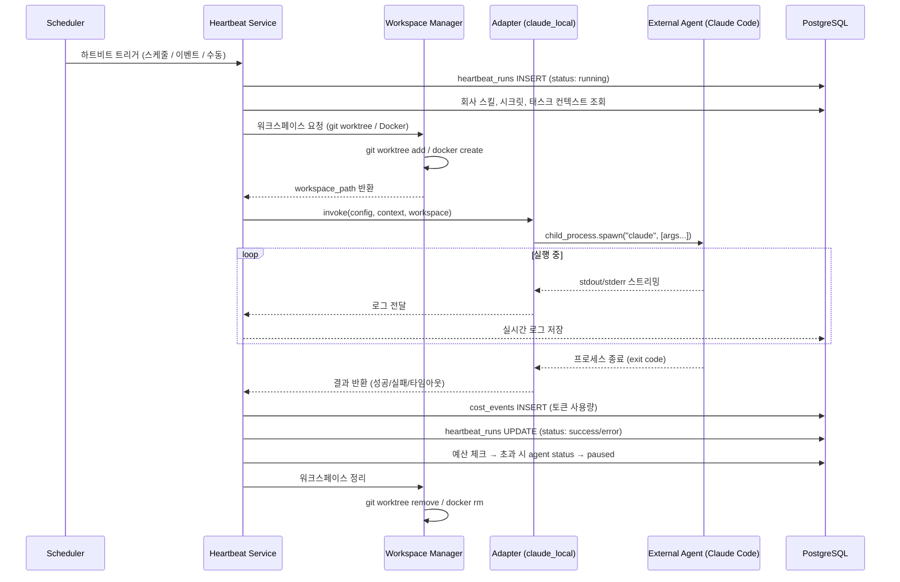

이 흐름에서 **heartbeat.ts**가 3000+ LOC인 이유가 드러납니다. 단순 프로세스 실행이 아니라, 워크스페이스 격리 → 컨텍스트 주입 → 실시간 스트리밍 → 비용 수거 → 예산 판정 → 정리까지의 **전체 수명 주기를 하나의 트랜잭션**으로 관리하기 때문입니다.

### 4.3 claude_local 설정 예시

```json
{
  "adapterType": "claude_local",
  "adapterConfig": {
    "model": "claude-opus-4-6",
    "effort": "high",
    "chrome": true,
    "cwd": "/path/to/workspace",
    "instructionsFilePath": "/path/to/instructions.md",
    "env": {
      "ANTHROPIC_API_KEY": "sk-..."
    },
    "workspaceStrategy": {
      "type": "git_worktree",
      "baseRef": "main"
    },
    "timeoutSec": 300,
    "graceSec": 10
  }
}
```

`workspaceStrategy`가 중요합니다. `git_worktree` 전략은 에이전트마다 독립적인 worktree를 생성하여 **파일 충돌 없이 동시 작업**을 가능하게 합니다. `graceSec`은 타임아웃 후 graceful shutdown까지 대기하는 시간으로, 에이전트가 커밋을 완료할 여유를 줍니다.

---

## 5. 예산 및 비용 추적 — 에이전트 자율성의 안전장치

에이전트 자율성이 높아질수록 비용 폭주 리스크도 비례합니다. GPT-5.2-Codex 기준 1시간 에이전트 세션이 $5-15를 소비하는 환경에서, 20개 에이전트가 24시간 돌면 **하루 $2,400-$7,200**입니다. 예산 없이 운영하면, 한 달 후 청구서를 보고 놀라게 됩니다.

### 5.1 예산 모델

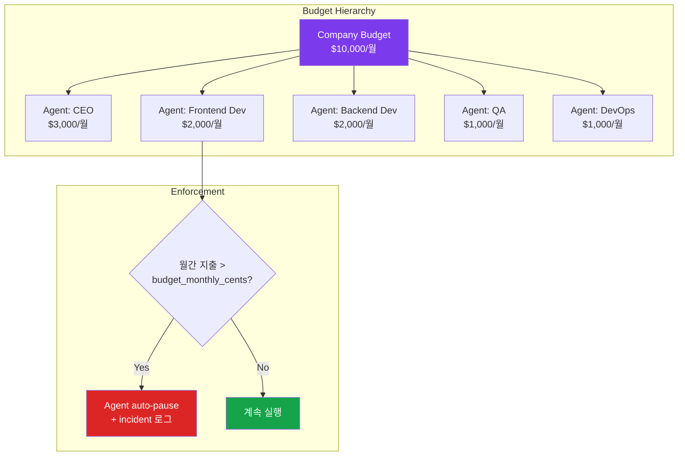

**Hard Stop**: `agent.budget_monthly_cents`를 초과하면, 해당 에이전트는 **즉시 pause 상태로 전환**됩니다. 현재 실행 중인 하트비트가 있더라도 다음 하트비트부터 차단됩니다. Board가 수동으로 해제하거나 다음 달 1일에 리셋될 때까지 에이전트는 동작하지 않습니다.

### 5.2 비용 귀속 (Cost Attribution)

모든 cost_event는 다중 차원으로 귀속됩니다:

```
cost_event
  ├── agent_id      — 누가 발생시켰는가
  ├── issue_id      — 어떤 태스크를 위해
  ├── project_id    — 어떤 프로젝트에서
  ├── goal_id       — 어떤 목표를 위해
  └── billing_code  — 커스텀 코드 (교차 팀 귀속)
```

이 다차원 귀속 덕분에 "Frontend 프로젝트에 이번 달 얼마를 썼는가", "Q2 목표 대비 비용 효율은 어떤가" 같은 질문에 쿼리 하나로 답할 수 있습니다. 전통적 클라우드 비용 관리(AWS Cost Explorer, GCP Billing)의 태그 기반 귀속과 동일한 패턴이지만, **AI 에이전트 비용에 특화**되어 있습니다.

---

## 6. 거버넌스 및 승인 — 인간이 루프에 남는 방법

자율 에이전트에게 모든 것을 맡기면, 에이전트가 "새 에이전트를 채용하겠다", "전략을 바꾸겠다"는 결정을 내릴 수 있습니다. 이 결정들은 **비가역적이고 비용이 높으므로** 인간 승인이 필수입니다. Paperclip은 이를 **Approval Gate**로 구현합니다.

### 6.1 승인 흐름

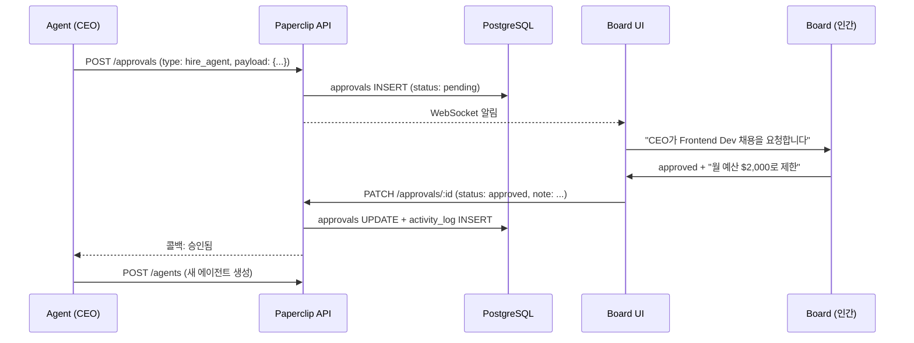

| 승인 유형 | 트리거 | 승인자 | 예시 |
|-----------|--------|--------|------|
| **Hire Agent** | 에이전트가 신규 채용 요청 | Board | "QA 전담 에이전트 필요" |
| **CEO Strategy** | CEO가 전략 분해 제안 | Board | "Q2 목표를 3개 프로젝트로 분해" |

### 6.2 계획된 거버넌스 확장 (Post-V1)

현재는 Board가 모든 승인을 직접 처리하지만, Post-V1에서는 **위임 권한** 모델이 계획되어 있습니다:
- 채용 예산 (월 $X 이내 자동 승인)
- 멀티 보드 거버넌스 (여러 인간 운영자)
- CEO에게 한도 내 자율 채용 권한 위임

---

## 7. 플러그인 시스템

Paperclip의 플러그인은 외부 시스템과의 **양방향 브리지**입니다. Linear에서 이슈가 생기면 Paperclip 태스크로 동기화하고, Paperclip에서 태스크가 완료되면 Slack에 알림을 보내는 식입니다.

### 7.1 아키텍처

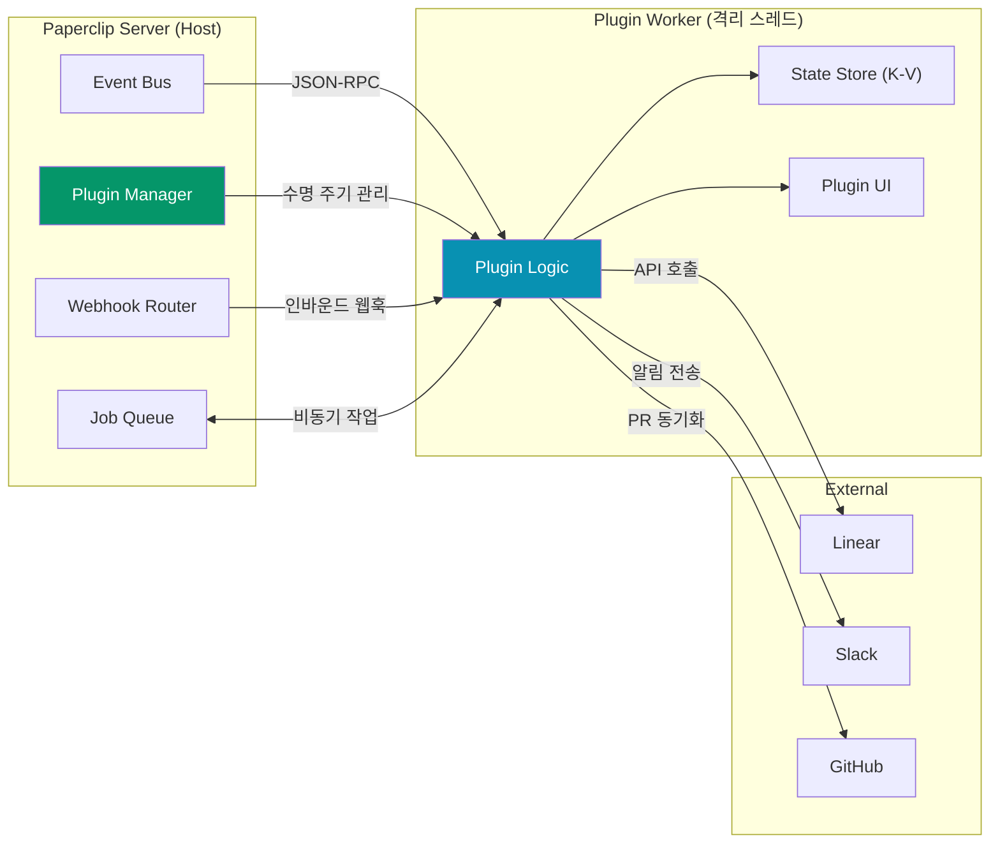

**Host-Worker 모델**: 플러그인은 메인 서버와 격리된 Worker 스레드에서 실행됩니다. 통신은 양방향 JSON-RPC로, 플러그인이 크래시해도 메인 서버에 영향을 주지 않습니다.

### 7.2 플러그인 기능 매트릭스

| 기능 | 용도 | 예시 |
|------|------|------|
| **Events** | 시스템 이벤트에 반응 | `issue.created` → Linear 티켓 생성 |
| **Jobs** | 비동기 핸들러 등록 | 전체 데이터 동기화 |
| **Webhooks** | 인바운드 POST 수신 | Linear → Paperclip 이슈 동기화 |
| **State** | 회사별 영속 K-V 스토어 | 마지막 동기화 timestamp |
| **Secrets** | 회사 시크릿에서 API 키 해석 | Linear API 토큰 |
| **Data** | 커스텀 데이터 등록 (UI 표시용) | 동기화 상태 뱃지 |
| **UI** | 커스텀 사이드패널/설정 페이지 렌더링 | 플러그인 설정 화면 |

### 7.3 플러그인 정의 예시

```typescript
import { definePlugin } from "@paperclipai/plugin-sdk";

export default definePlugin({
  async setup(ctx) {
    ctx.events.on("issue.created", async (event) => {
      const config = await ctx.config.get();
      await ctx.http.fetch("https://api.linear.app/...", {
        headers: {
          Authorization: `Bearer ${await ctx.secrets.resolve(config.apiKeyRef)}`
        },
        body: JSON.stringify({ title: event.payload.title }),
      });
    });

    ctx.jobs.register("full-sync", async (job) => {
      // 전체 동기화 로직
    });
  },

  async onHealth() {
    return { status: "ok", message: "Connected to Linear" };
  },
});
```

---

## 8. UI 대시보드

React 19 기반 SPA로, 43개 페이지로 구성되어 있습니다. UI의 설계 철학은 **"AI 회사의 경영진 대시보드"**입니다. 실시간 KPI, 조직도, 비용 추세, 승인 큐까지 — Board(인간 운영자)가 한 화면에서 전체 조직 상태를 파악하도록 설계되었습니다.

### 8.1 주요 페이지

| 페이지 | 기능 | 비유 |
|--------|------|------|
| **Dashboard** | 실시간 KPI (에이전트 수, 태스크, 비용, 승인 대기) | CEO 대시보드 |
| **Inbox** | 칸반 스타일 태스크 보드 + 필터링 | Jira/Linear 보드 |
| **Agents** | 조직 디렉토리, 채용 인터페이스 | HR 시스템 |
| **Agent Detail** | 개별 에이전트 설정, 상태, 로그, 하트비트 이력 | 직원 프로필 |
| **OrgChart** | SVG 조직도 (드릴다운) | 조직도 |
| **Costs** | 지출 대시보드, 추세 차트, 프로젝션 | CFO 보고서 |
| **Approvals** | 거버넌스 큐 (채용/전략 요청) | 이사회 안건 |
| **Company Skills** | 스킬 매니페스트 편집기 + 주입 미리보기 | 사내 교육 자료 |
| **Plugins** | 플러그인 관리, 설치/제거 | IT 관리 |
| **Settings** | 회사 브랜딩, 배포 모드, 시크릿 | 관리자 콘솔 |

### 8.2 실시간 업데이트

WebSocket으로 라이브 스트리밍합니다:
- 에이전트 상태 변경 (idle → running → done)
- 하트비트 로그 스트리밍 (터미널 출력 그대로)
- 비용 이벤트 수집 (토큰 단위 실시간)
- 승인 결과 전달

---

## 9. CLI

`paperclipai` 커맨드라인 인터페이스입니다. UI를 열지 않고도 에이전트 운영의 핵심 작업을 수행할 수 있습니다.

### 9.1 주요 명령

| 명령 | 기능 | 용도 |
|------|------|------|
| `onboard` | 인터랙티브 초기 설정 | 최초 1회 |
| `doctor` | 진단 체크 + 자동 수리 | 문제 해결 |
| `run` | bootstrap + doctor + 서버 시작 | 일상 실행 |
| `configure` | 설정 섹션별 업데이트 | db, storage, secrets 등 |
| `heartbeat run` | 수동 에이전트 하트비트 트리거 + 로그 스트리밍 | 디버깅, 테스트 |
| `db:backup` | 일회성 DB 백업 | 안전망 |
| `company *` | 회사 CRUD | 자동화 |
| `agent *` | 에이전트 CRUD | CI/CD 연동 |
| `issue *` | 이슈 CRUD | 외부 트리거 |

---

## 10. 배포 모델

### 10.1 3가지 모드

Paperclip은 **보안 요구 수준에 따라 3단계 배포 모드**를 제공합니다. Local Trusted에서 시작해서, 필요에 따라 Authenticated로 전환하는 점진적 경로입니다:

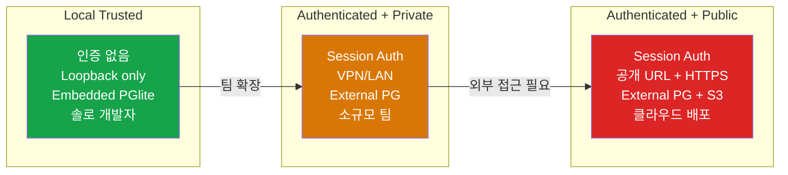

### 10.2 Docker

```bash
docker compose up  # PostgreSQL 17 + Paperclip 서버
```

이미지에는 Node.js LTS, Claude Code CLI, Codex CLI, OpenCode CLI, Embedded PostgreSQL이 포함되어 있습니다. 볼륨은 `/paperclip`이며, 영속 데이터를 저장합니다.

---

## 11. 기술 스택 정리

### 11.1 Backend

| 레이어 | 기술 | 선택 이유 |
|--------|------|----------|
| Runtime | Node.js 20+, TypeScript, ESM | 에이전트 어댑터가 CLI 프로세스 관리에 적합 |
| Framework | Express 5.1 | 안정성, 생태계 |
| Database | PostgreSQL 17 (Drizzle 0.38) | 타입 안전 ORM, 복잡한 관계 모델링 |
| Embedded DB | PGlite 18.1-beta | 제로 설정 로컬 개발 |
| Auth | Better Auth 1.4 | 세션 기반, 간결한 API |
| Logging | Pino 9.6 | 구조화된 JSON, 고성능 |
| Storage | Local disk / S3 | 점진적 확장 경로 |
| Realtime | WebSocket (ws 8.19) | 라이브 로그 스트리밍 |

### 11.2 Frontend

| 레이어 | 기술 | 선택 이유 |
|--------|------|----------|
| Framework | React 19 | 컴포넌트 생태계 |
| Build | Vite 6.1 | 빠른 HMR |
| State | TanStack Query 5.90 | 서버 상태 캐싱·무효화 |
| Styling | Tailwind CSS 4.0 | 유틸리티 퍼스트, 디자인 시스템 일관성 |
| Components | Radix UI, Lucide | WCAG 접근성 |
| Rich Text | MDXEditor 3.52 | 마크다운 편집 (태스크 문서) |
| Diagrams | Mermaid 11.12 | 조직도 시각화 |

---

## 12. 보안

### 12.1 인증·인가

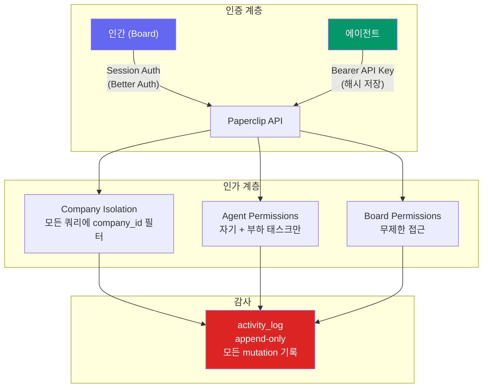

### 12.2 시크릿 관리

- **Local Encrypted**: `~/.paperclip/instances/default/secrets/master.key` 기반 암호화
- **Redaction**: 로그/내보내기에서 민감 값을 자동으로 마스킹합니다
- **Secret Versions**: 불변 이력 + 버전 관리. 키 로테이션 시 이전 버전이 보존됩니다

---

## 13. 하네스 프레임워크 관점 분석

Paperclip을 6요소 하네스 프레임워크로 매핑하면 다음과 같습니다:

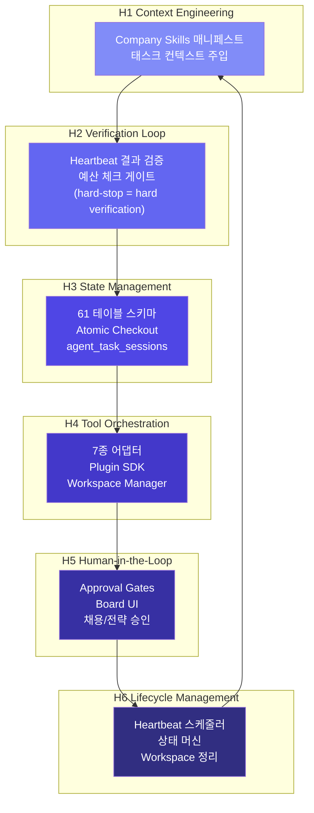

**포지셔닝**: Paperclip은 **메타-하네스(Meta-Harness)** 계층에 해당합니다. 개별 에이전트의 하네스(Claude Code의 CLAUDE.md, Codex의 프롬프트 등)를 감싸는 **조직 수준의 오케스트레이션 하네스**입니다. 이것은 3중 하네스 구조의 2층에 해당합니다:

| 계층 | 역할 | 예시 |
|------|------|------|
| **1차 (Agent Harness)** | 개별 에이전트의 행동 제약·유도 | CLAUDE.md, .cursorrules, 프롬프트 |
| **2차 (Meta-Harness)** | 조직 수준 오케스트레이션 | **Paperclip**: Skills, Budget, Approvals |
| **3차 (Human Override)** | 최종 인간 감독 | Board UI, 승인 게이트 |

---

## 14. 경쟁 및 비교

### 14.1 포지셔닝 맵

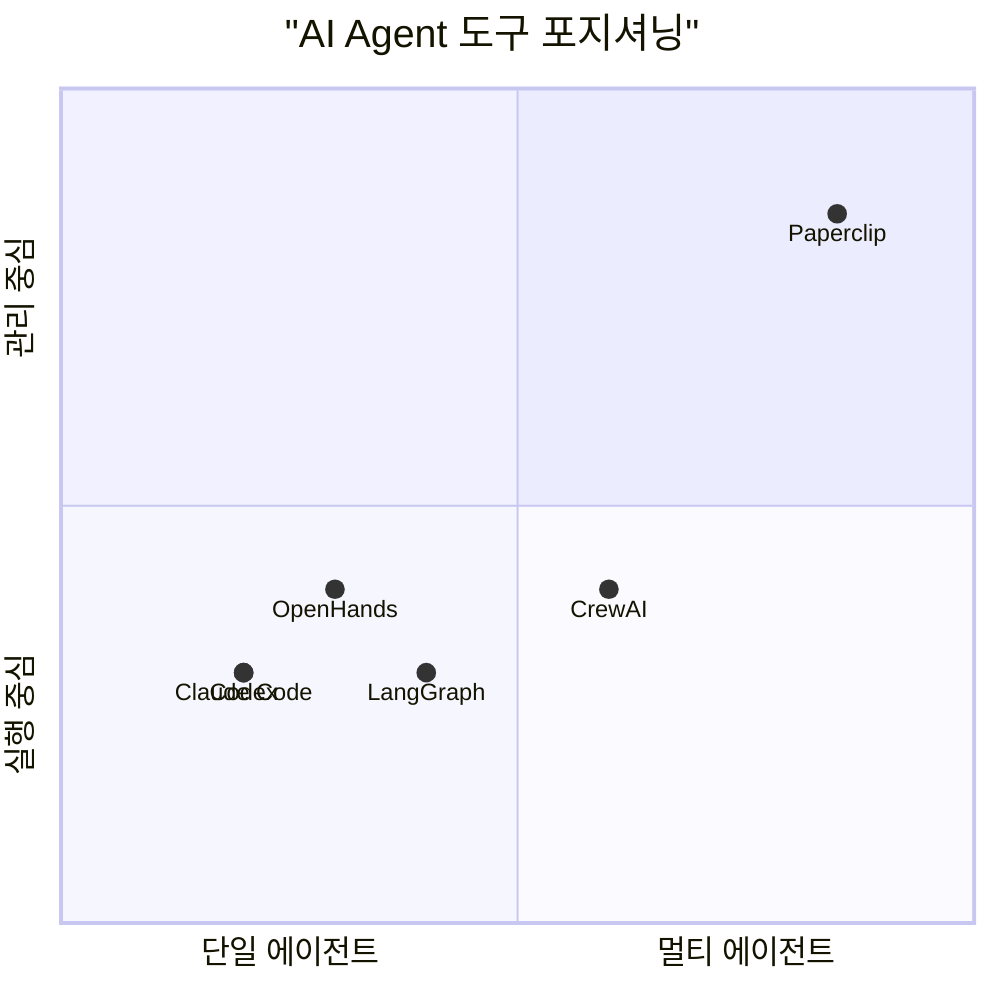

Paperclip은 **다른 도구들과 경쟁하지 않고 그 위에 올라탑니다**. Claude Code, Codex, Gemini 등이 "직원"이라면, Paperclip은 직원들이 소속된 "회사"입니다.

### 14.2 차별점 요약

| 차원 | Paperclip | 대안 |
|------|-----------|------|
| 범위 | 전체 회사 (조직도 + 예산 + 거버넌스) | 단일 에이전트 또는 워크플로우 |
| 실행 | BYOA (어떤 런타임이든 어댑터로 연결) | 프레임워크 특정 |
| 거버넌스 | Board 승인 게이트, 예산 hard-stop | 없거나 기본적 |
| 멀티 테넌시 | 단일 배포, 격리된 회사들 | 인스턴스당 하나 |
| 이식성 | 회사 템플릿 내보내기/가져오기/포크 | 없음 |

---

## 15. 성능 특성

| 항목 | 수치 | 비고 |
|------|------|------|
| 동시 하트비트 | 기본 1, 최대 10 | 서버 인스턴스당, 설정 가능 |
| API 응답 | 50-200ms | PostgreSQL 인덱스 쿼리 |
| 하트비트 실행 | 5-30분 | 어댑터 의존 (Claude Code 기준) |
| 실시간 로그 지연 | <1초 | WebSocket 전파 |
| DB 크기 | 100MB-1GB | cost_event 볼륨에 비례 |
| 비용 이벤트 벌크 | 요청당 최대 1,000건 | 배치 인제스트 |

---

## 16. V1 제한사항

- 단일 부모 보고 라인만 지원합니다 (매트릭스 조직 미지원)
- 월간 예산 윈도우만 지원합니다 (커스텀 기간 불가)
- Board는 단일 인간 운영자로 제한됩니다 (멀티 유저 계획 중)
- 실패 시 자동 재배정이 없습니다
- 플러그인은 별도 프로세스에서 실행됩니다 (인라인 실행 불가)
- 최대 동시 에이전트 실행은 10개입니다

---

## 17. 로드맵

### 현재 출시 (V1)

- [x] 멀티 회사 지원
- [x] 조직도 + 역할 계층
- [x] 계층적 목표 → 프로젝트 → 태스크
- [x] Atomic 태스크 checkout
- [x] 하트비트 스케줄링
- [x] 예산 강제 + 비용 추적
- [x] 거버넌스 승인 (채용, 전략)
- [x] 플러그인 시스템
- [x] 회사 이식성 (내보내기/가져오기)
- [x] 스킬 주입
- [x] 실행 워크스페이스 (worktree, Docker)
- [x] 루틴 스케줄링
- [x] 7종 어댑터

### 계획 중 (Post-V1)

- [ ] Artifacts & Deployments — 산출물 버전 관리, 프리뷰 링크
- [ ] CEO Chat — Board 대화형 인터페이스
- [ ] MAXIMIZER MODE — 하트비트 스케줄 없는 연속 에이전트 자율 운영
- [ ] 멀티 유저 Board — 역할 기반 접근 제어
- [ ] Cloud/Sandbox Agents — e2b, Cursor, 관리형 컴퓨트
- [ ] ClipHub/ClipMart — 회사 템플릿 마켓플레이스
- [ ] Desktop App — 네이티브 macOS/Windows/Linux

---

## 18. 시사점

### 18.1 에이전트 조율 문제의 현실화

2026년 4월 기준, AI 에이전트를 "쓰는" 단계를 넘어 "관리하는" 단계로 진입했습니다. Paperclip은 이 전환의 초기 신호입니다. 개별 에이전트의 능력이 아무리 높아도, 10-20개가 동시에 다른 방향으로 달리면 가치가 상쇄됩니다. **개별 에이전트의 IQ보다, 조직의 EQ가 병목이 되는 시점**에 도달한 것입니다.

### 18.2 메타-하네스 계층의 출현

Paperclip의 존재는 **하네스 위의 하네스** 패턴이 실제로 필요하다는 증거입니다. Claude Code의 CLAUDE.md가 1차 하네스, Paperclip의 Company Skills + Budget Gates가 2차 하네스, 인간 Board가 3차 하네스입니다.

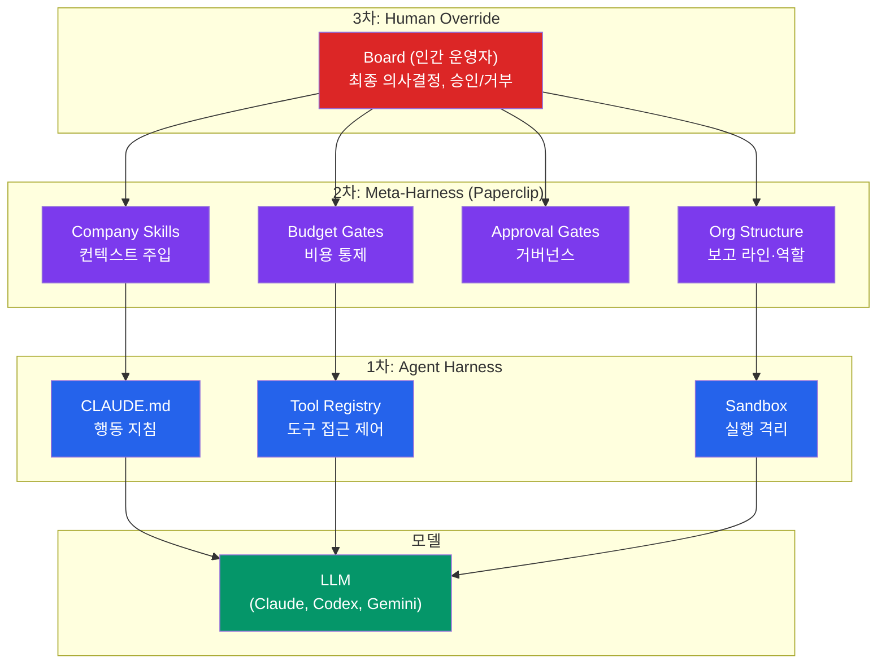

이 구조에서 각 계층은 **하위 계층이 감당하지 못하는 실패 모드**를 커버합니다. 1차 하네스(CLAUDE.md)가 "이 파일을 지우지 마라"를 제어하고, 2차 하네스(Paperclip)가 "이 에이전트가 월 $3,000 이상 쓰지 못하게 하라"를 제어하고, 3차 하네스(Board)가 "이 전략이 맞는가"를 판단합니다. 스위스 치즈 모델과 동일한 원리입니다.

### 18.3 BYOA의 전략적 의미

특정 에이전트에 종속하지 않는 BYOA 접근은 **어댑터 교체 비용을 0에 수렴**시킵니다. Claude가 비싸지면 Gemini로, Codex가 느리면 OpenCode로 — 조직 구조와 태스크 히스토리는 그대로 유지하면서 실행 엔진만 교체할 수 있습니다. 이는 2024-2025년의 "모델 가격 전쟁"이 가르쳐 준 교훈입니다: **특정 모델에 올인하면, 가격 인하나 경쟁 모델 출현 시 조직 전체가 리스크에 노출됩니다.** Paperclip의 어댑터 레이어는 이 리스크를 구조적으로 해지합니다.

### 18.4 예산 거버넌스의 필수성

에이전트 자율성이 높아질수록 비용 폭주 리스크도 비례합니다. Paperclip의 agent-level hard-stop 모델은 최소한의 안전장치입니다. 그러나 현재 모델은 **월간 고정 한도**라는 단순한 접근이며, 향후에는 다음이 필요할 것입니다:
- **시간대별 동적 한도** (업무 시간에는 높게, 야간에는 낮게)
- **태스크 복잡도 기반 예산** (간단한 버그 수정 vs 아키텍처 리팩터링)
- **ROI 기반 자동 조정** (높은 가치를 만드는 에이전트에게 자동으로 예산 증액)

### 18.5 Kubernetes와의 구조적 유사성

Paperclip의 아키텍처를 Kubernetes와 비교하면, 설계 의도가 더 명확해집니다:

| K8s 개념 | Paperclip 대응 | 역할 |
|----------|----------------|------|
| **Control Plane** | Paperclip Server | 오케스트레이션 |
| **kubelet** | Agent Adapter | 실행 위임 |
| **Pod** | Heartbeat Run | 실행 단위 |
| **CRI** | Adapter Protocol | 런타임 추상화 |
| **Namespace** | Company | 리소스 격리 |
| **ResourceQuota** | Budget | 리소스 제한 |
| **RBAC** | Approvals + Permissions | 접근 제어 |
| **etcd** | PostgreSQL | 상태 저장소 |

K8s가 "컨테이너를 직접 실행하지 않고 관리만 한다"는 통찰에서 시작했듯, Paperclip은 "에이전트를 직접 실행하지 않고 관리만 한다"는 통찰에서 시작합니다. 인프라 오케스트레이션의 패턴이 **에이전트 오케스트레이션으로 이식**된 사례입니다.

---

*Source: `blog/research/paperclip-ai-agent-orchestration.md` | Category: [[blog-research]]*

## Related

- [[blog-research]]
- [[blog-hub]]
- [[geode]]
