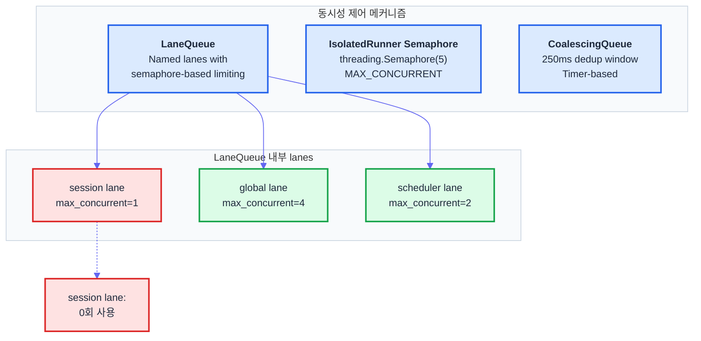
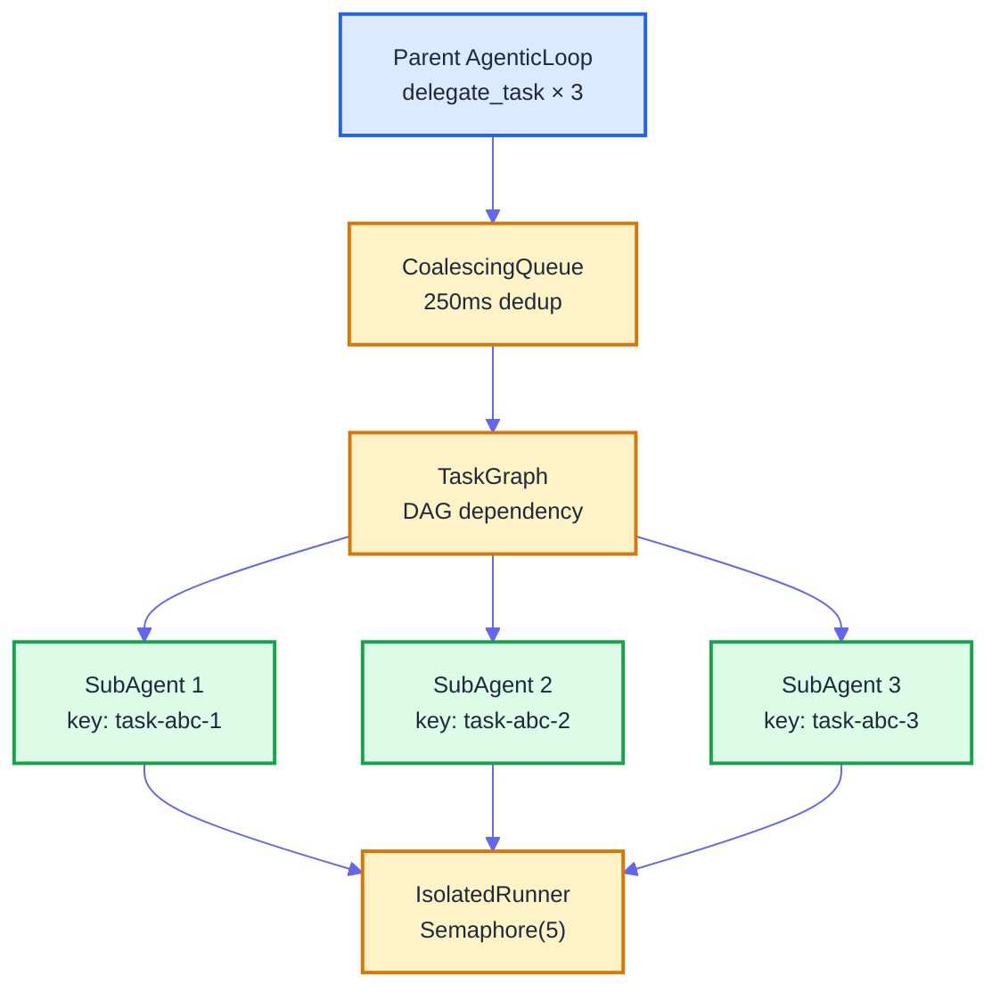
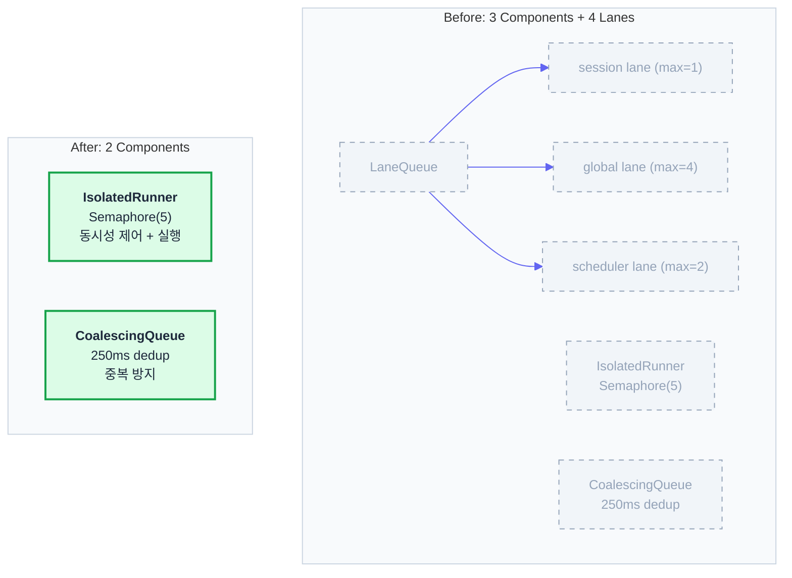

# 3중 게이트에서 2 Components까지 — 큐 단순화의 여정

> Date: 2026-03-30 | Author: geode-team | Tags: refactoring, simplicity, agent-architecture, decision-making

## Table of Contents

1. [시작 — "지금 큐잉 아키텍처 구조가 어떻게 돼?"](#1-시작)
2. [현실 직시 — 실사용 현황 점검](#2-현실-직시)
3. [Option A vs B — SRP 관점의 선택](#3-option-a-vs-b)
4. ["지금도 좀 많다" — SessionLane 아이디어](#4-지금도-좀-많다)
5. [OpenClaw GAP 분석 — Session Lane의 진짜 의미](#5-openclaw-gap-분석)
6. [서브에이전트는 어떻게? — 고유 key의 자연스러운 병렬](#6-서브에이전트는-어떻게)
7. ["REPL이랑 serve 차이가 뭐야?" — thin-only 결정](#7-repl이랑-serve-차이가-뭐야)
8. [5-persona 검증 — TOCTOU race, depth guard](#8-5-persona-검증)
9. [교훈 — 가장 강력한 리팩토링 도구](#9-교훈)

---

## 1. 시작

v0.36.0 릴리스 직후였습니다. Gateway Runtime 3-Phase 계획의 마지막 조각인 CLIChannel IPC를 머지하고, 11개 구조적 결함을 전수 해소한 뒤, 잠시 숨을 돌릴 때였습니다.

유저가 물었습니다.

> "지금 큐잉 아키텍처 구조가 어떻게 돼?"

단순한 질문이었습니다. 현재 상태를 설명하면 될 일이었습니다. 하지만 설명을 시작하는 순간, 무언가 불편해졌습니다. 코드에는 3개의 동시성 제어 메커니즘이 있었고, 그것들이 어떻게 맞물리는지 한 문장으로 설명할 수 없었습니다.

설명할 수 없다는 것은 이해하지 못했다는 것이 아닙니다. 코드를 작성한 사람이 한 문장으로 설명할 수 없다면, 그 구조가 불필요하게 복잡하다는 뜻입니다.

---

## 2. 현실 직시

현황을 정리했습니다.

### 3개의 동시성 제어 메커니즘



| Component | 위치 | 역할 | 실사용 현황 |
|-----------|------|------|:-----------:|
| **LaneQueue** | `core/orchestration/lane_queue.py` | Named lane 기반 동시성 제어. `acquire_all()`로 다중 lane 동시 획득 | global: 사용, scheduler: 사용, **session: 0회** |
| **IsolatedRunner Semaphore** | `core/orchestration/isolated_execution.py` | 서브에이전트/스케줄러 잡 실행 시 `MAX_CONCURRENT=5` 제한 | 모든 비동기 실행에서 사용 |
| **CoalescingQueue** | `core/orchestration/coalescing.py` | 250ms 윈도우 내 중복 요청 병합. `SubAgentManager`가 사용 | 서브에이전트 위임 시 사용 |

문제가 보이기 시작했습니다. **LaneQueue의 global lane(max=4)과 IsolatedRunner의 Semaphore(max=5)가 같은 자원에 대해 이중으로 제한을 걸고 있었습니다.** 그리고 session lane은 생성만 되고 한 번도 `acquire()`가 호출된 적이 없었습니다.

`build_default_lanes()` 코드를 보겠습니다.

```python
# core/runtime_wiring/infra.py
def build_default_lanes() -> LaneQueue:
    """Build default LaneQueue with session + global lanes."""
    queue = LaneQueue()
    queue.add_lane("session", max_concurrent=1)   # Serial per session
    queue.add_lane("global", max_concurrent=4)     # Max 4 concurrent
    return queue
```

"Serial per session" -- 같은 세션의 요청은 직렬로 처리한다는 의미입니다. OpenClaw에서 가져온 패턴입니다. 하지만 GEODE에서 이 lane을 실제로 사용하는 코드가 없었습니다. `acquire_all(key, ["session", "global"])`을 호출하는 곳이 존재하지 않았습니다.

---

## 3. Option A vs B

이중 제한을 해소하는 두 가지 방법이 있었습니다.

### Option A: Runner에 Lane 넣기

IsolatedRunner의 `threading.Semaphore(5)`를 제거하고, 대신 `LaneQueue.global` lane을 사용합니다. Runner가 실행 전에 `lane.acquire("global")`을 호출하고, 완료 후 해제합니다.

```python
# Option A: IsolatedRunner가 LaneQueue를 사용
class IsolatedRunner:
    def __init__(self, *, lane_queue: LaneQueue, hooks: HookSystem | None = None):
        self._lane_queue = lane_queue
        # Semaphore 제거

    def run_async(self, fn: Callable, *, config: IsolationConfig) -> str:
        lane = self._lane_queue.get_lane("global")
        with lane.acquire(config.session_id):
            return self._execute(fn, config)
```

### Option B: Lane에서 Runner Semaphore 빼기

LaneQueue에서 `global` lane의 동시성 제어를 제거하고, IsolatedRunner의 기존 Semaphore를 유지합니다. LaneQueue는 "정책 기반 라우팅"만 담당하고, 실제 동시성 제한은 Runner가 책임집니다.

두 옵션의 차이는 **책임 소재**입니다.

| 기준 | Option A | Option B |
|------|----------|----------|
| 동시성 제어 위치 | LaneQueue (중앙) | IsolatedRunner (실행 단위) |
| LaneQueue 역할 | 동시성 + 라우팅 | 라우팅만 |
| IsolatedRunner 역할 | 실행만 | 실행 + 동시성 |
| SRP 위반 | Runner가 Lane 의존 | Lane이 Semaphore 포함 (현재 상태) |

**SRP(Single Responsibility Principle) 관점에서 B를 선택했습니다.** 이유는 다음과 같습니다.

LaneQueue의 본래 설계 의도는 "Named lane으로 작업을 분류하고, lane별 정책을 적용하는 것"이었습니다. Semaphore 기반 동시성 제한은 그 위에 얹은 부가 기능입니다. 반면 IsolatedRunner는 "격리된 환경에서 함수를 실행하고, 동시 실행 수를 제한하는 것"이 핵심 역할입니다. 동시성 제한이 Runner의 본래 책임에 더 가깝습니다.

Option A는 Runner가 LaneQueue에 의존하게 만들고, 이는 L3 계층 내부에 불필요한 결합을 추가합니다. Option B는 기존 구조를 유지하면서 이중 제한만 제거합니다.

결론: **LaneQueue에서 global lane의 Semaphore를 제거하고, 동시성 제어는 IsolatedRunner에 위임합니다.** LaneQueue의 global lane은 "현재 몇 개가 실행 중인지" 추적하는 역할만 남깁니다.

---

## 4. "지금도 좀 많다"

Option B를 적용한 뒤 구조를 다시 정리했습니다.

| Component | 역할 |
|-----------|------|
| LaneQueue | 3개 lane (session, global, scheduler) — 라우팅 + 추적 |
| IsolatedRunner | Semaphore(5) — 실제 동시성 제어 |
| CoalescingQueue | 250ms dedup — 중복 방지 |

유저가 다시 물었습니다.

> "지금도 좀 많다. session lane은 아직도 0회 사용이잖아."

맞는 지적이었습니다. session lane은 `max_concurrent=1`로 설정되어 있지만, 이 lane을 `acquire()`하는 코드가 없었습니다. 삭제해도 동작에 영향이 없습니다.

하지만 여기서 단순히 삭제하기 전에 생각해 볼 것이 있었습니다. **OpenClaw에서 session lane이 존재하는 이유**가 무엇이었는지. 코드를 가져올 때 그 이유를 이해하지 못한 채 가져온 것이 아닌지.

---

## 5. OpenClaw GAP 분석

OpenClaw의 Session Lane 설계를 다시 분석했습니다.

### OpenClaw의 Session Lane

OpenClaw에서 session lane은 **per-key serialization**을 구현합니다. 같은 세션 키를 가진 요청은 직렬로 처리하고, 다른 세션 키의 요청은 병렬로 처리합니다.

```
Session A: ─── req1 ──── req2 ──── req3 ───  (직렬)
Session B: ─── req1 ──── req2 ───            (직렬)
                                              (A와 B는 병렬)
```

이 패턴이 필요한 이유: Slack에서 같은 채널의 연속 메시지가 동시에 도착하면, 첫 번째 메시지의 응답이 두 번째 메시지의 컨텍스트를 오염시킬 수 있습니다. 세션 단위 직렬화가 이를 방지합니다.

### GEODE의 현재 구현과의 GAP

| 측면 | OpenClaw | GEODE (현재) |
|------|----------|-------------|
| Session key | 요청마다 세션 키 기반 lane 할당 | `build_default_lanes()`에서 `session` lane 1개 생성 |
| per-key serialization | key별 독립 큐 | 전체 session lane이 max=1 → **모든 세션이 직렬** |
| 사용 코드 | Gateway handler가 `acquire("session:" + key)` | **호출 코드 없음** |

GEODE의 session lane은 OpenClaw의 설계를 **잘못 번역**한 것이었습니다. OpenClaw은 세션 키마다 lane을 동적으로 할당합니다 (`session:slack-C123`). GEODE는 `session`이라는 이름의 lane 1개를 만들고 `max_concurrent=1`로 설정했습니다. 이 lane을 사용하면 모든 세션이 하나의 Semaphore(1)을 공유하여 전체 직렬화가 됩니다 -- OpenClaw의 의도와 정반대입니다.

### SessionLane 아이디어

올바르게 구현하려면 `Lane` 클래스 자체를 확장해야 합니다.

```python
class SessionLane:
    """Per-key serialization lane.

    각 key마다 독립된 Semaphore(1)을 동적으로 할당합니다.
    같은 key의 요청은 직렬, 다른 key는 병렬.
    """

    def __init__(self, *, timeout_s: float = 300.0) -> None:
        self._locks: dict[str, threading.Semaphore] = {}
        self._meta_lock = threading.Lock()
        self.timeout_s = timeout_s

    @contextmanager
    def acquire(self, key: str) -> Generator[None, None, None]:
        with self._meta_lock:
            if key not in self._locks:
                self._locks[key] = threading.Semaphore(1)
            sem = self._locks[key]

        acquired = sem.acquire(timeout=self.timeout_s)
        if not acquired:
            raise TimeoutError(f"SessionLane timeout for key={key}")
        try:
            yield
        finally:
            sem.release()
```

### 양측 결함 비교

하지만 `SessionLane`을 구현하기 전에, 이것이 실제로 필요한지 물어야 합니다.

| 질문 | 답 |
|------|-----|
| GEODE에서 같은 세션 키의 동시 요청이 발생하는가? | Slack 폴러에서 가능. 동일 채널에 빠르게 2개 메시지 전송 시. |
| 동시 요청이 실제 문제를 일으키는가? | `ConversationContext`가 세션별로 독립이므로 오염 없음. 하지만 LLM 호출이 중복 발생. |
| 빈도는? | 매우 낮음. Slack 폴링 간격(3초) 안에 같은 사용자가 2개 메시지를 보내야 함. |
| CoalescingQueue가 이미 처리하는가? | 아니오. CoalescingQueue는 서브에이전트 위임 단위이고, 폴러 메시지 단위가 아님. |

결론: **SessionLane은 올바른 패턴이지만, 현재 GEODE의 사용 빈도에서는 과잉입니다.** 기존의 잘못된 `session` lane을 제거하고, SessionLane은 Slack 동시 메시지가 실제 문제를 일으킬 때 도입합니다.

---

## 6. 서브에이전트는 어떻게?

session lane 제거를 결정한 뒤, 다음 질문이 떠올랐습니다. 서브에이전트의 동시성은 어떻게 제어되고 있는가?



서브에이전트의 실행 흐름은 다음과 같습니다.

1. **CoalescingQueue**: 250ms 윈도우 내 중복 `delegate_task` 요청 병합.
2. **TaskGraph**: DAG 기반 의존성 추적. 의존 태스크가 완료될 때까지 대기.
3. **IsolatedRunner**: `Semaphore(MAX_CONCURRENT=5)`로 동시 실행 제한.

각 서브에이전트는 고유한 `task_id`를 key로 사용합니다 (`task-{uuid[:8]}-{index}`). 이 key는 CoalescingQueue에서 dedup key로, TaskGraph에서 노드 ID로, IsolatedRunner에서 세션 ID로 사용됩니다.

SessionLane이 있다면, 서브에이전트는 어떻게 될까요? 각 서브에이전트의 key가 고유하므로, SessionLane의 per-key Semaphore(1)은 서브에이전트마다 독립된 잠금을 할당합니다. 결과적으로 **모든 서브에이전트가 병렬로 실행됩니다** -- SessionLane이 있든 없든 동작이 동일합니다.

```
SessionLane 관점:
  key "task-abc-1": Semaphore(1) → SubAgent 1 alone → 직렬 (1개뿐)
  key "task-abc-2": Semaphore(1) → SubAgent 2 alone → 직렬 (1개뿐)
  key "task-abc-3": Semaphore(1) → SubAgent 3 alone → 직렬 (1개뿐)

  → 3개 key가 독립 → 사실상 병렬
  → SessionLane이 없을 때와 동일
```

이것이 SessionLane 패턴의 투명성(transparency)입니다. 고유 key를 사용하는 작업은 SessionLane의 존재를 인식하지 않아도 됩니다. 직렬화가 필요한 것은 **같은 key의 반복 요청**뿐이며, 서브에이전트는 그 조건에 해당하지 않습니다.

---

## 7. "REPL이랑 serve 차이가 뭐야?"

큐 구조를 정리하면서, 더 근본적인 질문이 떠올랐습니다.

> "지금 REPL이랑 serve 차이가 뭐야? 왜 두 개가 따로 있어?"

v0.36.0에서 CLIChannel IPC를 도입했지만, standalone REPL은 여전히 남아 있었습니다. serve가 없으면 REPL이 자체 부트스트랩으로 fallback하는 구조였습니다.

이 "fallback" 경로가 존재하는 한, LaneQueue의 보호, PolicyChain의 제어, HookSystem의 관찰 -- 모든 보장이 무력화됩니다. 큐 아키텍처를 아무리 단순화해도, standalone REPL이 큐를 우회하면 의미가 없습니다.

큐 단순화에서 시작한 대화가 **코드 경로 통합**의 필요성을 발견한 순간이었습니다.

```mermaid
%%{init: {
  'theme': 'default',
  'themeVariables': {
    'fontSize': '13px',
    'fontFamily': 'arial',
    'lineColor': '#6366F1',
    'primaryColor': '#dbeafe',
    'primaryBorderColor': '#3b82f6',
    'primaryTextColor': '#1e293b'
  }
}}%%
graph LR
    classDef question fill:#fef3c7,stroke:#d97706,color:#1e293b,stroke-width:2px
    classDef decision fill:#dcfce7,stroke:#16a34a,color:#1e293b,stroke-width:2px

    Q1["큐잉 구조가<br/>어떻게 돼?"]:::question
    Q2["session lane은<br/>왜 0회 사용?"]:::question
    Q3["이중 Semaphore를<br/>어떻게 해소?"]:::question
    Q4["SessionLane이<br/>정말 필요해?"]:::question
    Q5["REPL이랑 serve<br/>차이가 뭐야?"]:::question
    D1["thin-only<br/>아키텍처 결정"]:::decision

    Q1 --> Q2
    Q2 --> Q3
    Q3 --> Q4
    Q4 --> Q5
    Q5 --> D1
```



"지금 큐잉 아키텍처 구조가 어떻게 돼?"라는 질문 하나가, 5단계의 연쇄적 발견을 거쳐 thin-only 아키텍처 결정으로 이어졌습니다.

### thin-only 결정

standalone REPL을 제거하고, `uv run geode`가 항상 serve 프로세스를 경유하도록 변경합니다. serve가 없으면 background daemon으로 자동 시작합니다.

이 결정의 근거:

| 기준 | standalone 유지 | thin-only |
|------|:--------------:|:---------:|
| 코드 경로 수 | 2 | 1 |
| PolicyChain 보장 | 부분적 | 전체 |
| LaneQueue 적용 | standalone 우회 | 전체 |
| Cleanup 누락 위험 | 있음 | 없음 (serve `finally`) |
| 구현 복잡도 | fallback 분기 | auto-start 로직 |

---

## 8. 5-persona 검증

thin-only 설계를 구현하기 전에, 5-persona 검증을 실행했습니다. GEODE의 검증팀은 각자 다른 관점에서 설계를 리뷰합니다.

### 발견 1: TOCTOU race (Karpathy persona)

> "serve auto-start에서 `is_serve_running()` 체크와 `subprocess.Popen()` 사이에 race가 있다. 두 REPL 인스턴스가 동시에 뜨면 serve가 2개 생성된다."

맞는 지적이었습니다. 해법으로 `fcntl.flock`을 사용한 PID 파일 잠금을 도입했습니다. `LOCK_EX | LOCK_NB`로 non-blocking 배타적 잠금을 시도하고, 실패하면 다른 인스턴스가 이미 시작 중이라고 판단하여 소켓 대기만 합니다.

```python
# TOCTOU 방지: double-check with flock
with open(PIDFILE, "a+") as f:
    try:
        fcntl.flock(f, fcntl.LOCK_EX | fcntl.LOCK_NB)
    except BlockingIOError:
        return _wait_for_socket(timeout_s=10.0)

    # 잠금 획득 후 재확인
    if is_serve_running():
        fcntl.flock(f, fcntl.LOCK_UN)
        return True

    # serve 시작
    proc = subprocess.Popen(...)
```

### 발견 2: depth guard 누락 (Steinberger persona)

> "서브에이전트가 IPC를 통해 다시 서브에이전트를 위임하면 무한 재귀가 가능하다. max_depth=1 제한이 IPC 경계를 넘을 때도 적용되는가?"

현재 `max_depth=1`은 `SubAgentManager` 인스턴스 내부에서만 적용됩니다. IPC 요청은 새로운 `create_session()`을 호출하므로 depth가 0으로 리셋됩니다. 이론적으로 `REPL → IPC → serve → SubAgent → IPC → serve → SubAgent → ...` 무한 체인이 가능합니다.

해법: IPC 메시지에 `depth` 필드를 추가하고, 서버 측에서 depth 상한을 검사합니다.

```python
# Client side
def _send(self, msg: dict) -> None:
    msg["depth"] = self._depth  # 현재 깊이 전파
    line = json.dumps(msg, ensure_ascii=False) + "\n"
    self._sock.sendall(line.encode("utf-8"))

# Server side — CLIPoller
def _process_message(self, conn: socket.socket, msg: dict) -> None:
    depth = msg.get("depth", 0)
    if depth >= MAX_IPC_DEPTH:  # MAX_IPC_DEPTH = 2
        self._send(conn, {
            "type": "error",
            "message": f"IPC depth limit exceeded (max={MAX_IPC_DEPTH})",
        })
        return
    # ... depth + 1로 세션 생성
```

### 발견 3: Socket 정리 타이밍 (Beck persona)

> "serve가 비정상 종료하면 `~/.geode/geode.sock`이 남는다. 다음 serve 시작 시 `bind()` 실패."

기존에도 `_create_socket()`에서 잔여 소켓을 `unlink()`하는 코드가 있었지만, PID 파일과 소켓 파일의 정합성 검증이 없었습니다. PID 파일의 프로세스가 존재하지 않으면 소켓도 정리하도록 auto-start 로직에 추가했습니다.

```python
def _cleanup_stale_socket() -> None:
    """좀비 PID 감지 시 잔여 소켓 정리."""
    if not PIDFILE.exists():
        return
    try:
        pid = int(PIDFILE.read_text().strip())
        os.kill(pid, 0)  # 프로세스 존재 확인 (signal 0)
    except (ProcessLookupError, ValueError):
        # 프로세스 없음 → 좀비 PID
        PIDFILE.unlink(missing_ok=True)
        SOCKET_PATH.unlink(missing_ok=True)
        log.info("Cleaned up stale pidfile and socket (pid=%s)", pid)
```

---

## 9. 교훈

### 최종 구조

"지금 큐잉 아키텍처 구조가 어떻게 돼?"라는 질문으로 시작하여, 최종적으로 2 Components 구조에 도달했습니다.



| 변경 | 이유 |
|------|------|
| LaneQueue global lane → 제거 | IsolatedRunner Semaphore와 이중 제한 |
| LaneQueue session lane → 제거 | 0회 사용, OpenClaw 패턴 오역 |
| LaneQueue scheduler lane → IsolatedRunner로 이관 | Lane 불필요, Semaphore가 동일 역할 |
| LaneQueue 자체 → Gateway 라우팅 전용으로 축소 | 동시성 제어 책임 분리 |

### 복잡성은 점진적으로 쌓인다

3중 게이트 구조는 한 번에 만들어진 것이 아닙니다.

1. v0.25.0: `IsolatedRunner`에 `Semaphore(5)` 도입 -- 서브에이전트 동시성 제한.
2. v0.26.0: `LaneQueue` 도입 -- OpenClaw 패턴 도입. session, global lane 생성.
3. v0.32.1: `_sched_semaphore` 추가 -- 스케줄러 잡 동시성 제한.
4. v0.35.0: `SharedServices` 도입 -- LaneQueue를 Gateway로 이관.

각 단계는 그 시점에서 합리적인 결정이었습니다. 하지만 전체를 조망하면, 같은 문제를 세 번 해결한 것이었습니다. 새 기능을 추가할 때 "이미 동시성 제어가 있는데, 어디에 있지?"를 묻지 않고 "여기에 새 Semaphore를 추가하면 되겠다"로 진행한 결과입니다.

### "이거 필요해?"가 가장 강력한 리팩토링 도구다

이 여정에서 가장 효과적이었던 것은 복잡한 리팩토링 기법이 아니었습니다. 반복된 질문이었습니다.

> - "session lane이 0회 사용인데, 왜 있어?"
> - "global lane과 Semaphore(5)가 동시에 필요해?"
> - "standalone REPL과 serve가 왜 따로 있어?"
> - "이 fallback이 정말 필요해?"

각 질문은 하나의 컴포넌트를 제거하거나 단순화했습니다. 코드를 추가하는 것보다, 코드가 존재하는 이유를 묻는 것이 더 많은 줄을 삭제했습니다.

Kent Beck의 Simple Design 규칙 중 네 번째가 "fewest elements" -- 최소한의 요소를 유지하라 -- 입니다. 이번 여정은 그 규칙의 실천 기록입니다. 3 Components + 4 Lanes에서 2 Components로, 2개 코드 경로에서 1개로. 각각의 축소가 보호 범위를 넓히고, 설명을 쉽게 만들었습니다.

한 문장으로 설명할 수 있는 구조가 좋은 구조입니다. 지금의 큐잉 아키텍처는 이렇게 설명할 수 있습니다.

> "CoalescingQueue가 중복을 걸러내고, IsolatedRunner가 동시 실행 수를 제한한다."

시작할 때 한 문장으로 설명할 수 없었던 구조가, 끝에서는 한 문장이 되었습니다. 그것이 이 여정의 전부입니다.

---

*Source: `blog/posts/narrative/queue-simplification-journey.md` | Category: [[blog-narrative]]*

## Related

- [[blog-narrative]]
- [[blog-hub]]
- [[geode]]
