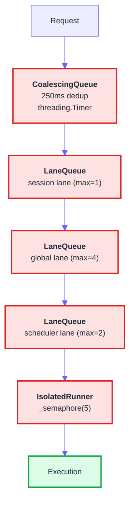
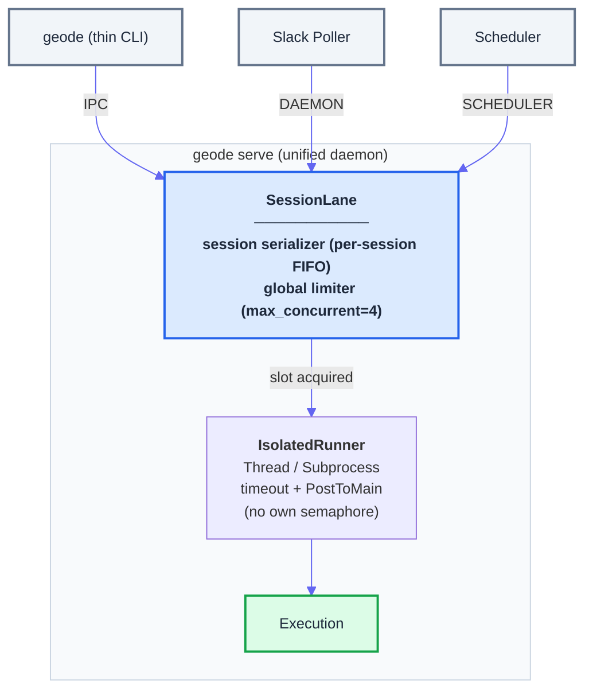

# Session 48 — 큐잉 아키텍처 리팩토링: 3중 게이트에서 SessionLane까지

> Date: 2026-03-30 | Author: geode-team | Tags: agent-architecture, queue-system, session-lane, release

## Table of Contents

1. [세션 개요](#1-세션-개요)
2. [문제 인식 — "지금 너무 복잡하지 않아?"](#2-문제-인식)
3. [진행 순서 — 6 PRs (#531-#536)](#3-진행-순서)
4. [Before → After 아키텍처](#4-before--after-아키텍처)
5. [검증 — 5-Persona Verification Team](#5-검증)
6. [측정치](#6-측정치)

---

## 1. 세션 개요

Session 48은 **큐잉 아키텍처 전면 재설계** 세션입니다. v0.36.0 릴리스 직후, 실행 제어 경로에 쌓여 있던 3중 동시성 게이트를 2개 컴포넌트(SessionLane)로 축소하고, standalone REPL을 폐기하여 실행 경로를 단일화했습니다.

| Metric | Before (v0.36.0) | After (Session 48) | Delta |
|--------|:-----------------:|:-------------------:|:-----:|
| Version | 0.36.0 | 0.36.1 | PATCH |
| Tests | 3386 | 3433 | +47 |
| Modules | 189 | 191 | +2 |
| PRs merged | - | 6 (#531-#536) | - |
| Lines deleted | - | ~487 | standalone REPL 폐기 |
| 동시성 게이트 | 3 (LaneQueue×3 + Semaphore + CoalescingQueue) | 2 (SessionLane) | -1 layer |

6개의 PR이 세션 전체에 걸쳐 머지되었습니다. Phase 2+3 구조적 결함 해소에서 시작하여, 릴리스를 거치고, 큐 통합과 REPL 폐기로 마무리하는 흐름이었습니다.

---

## 2. 문제 인식

이 세션의 출발점은 단순한 질문이었습니다.

> "지금 너무 복잡하지 않아?"

v0.36.0까지 GEODE의 실행 제어 경로에는 세 개의 독립적인 동시성 메커니즘이 겹쳐 있었습니다.

### 3중 게이트 구조

```
요청 → CoalescingQueue(250ms dedup)
        → LaneQueue(session, max=1)
          → LaneQueue(global, max=4)
            → LaneQueue(scheduler, max=2)
              → IsolatedRunner._semaphore(5)
                → 실행
```

각 게이트를 개별적으로 보면 합리적입니다. CoalescingQueue(중복 병합 큐)는 중복 요청을 250ms 윈도우로 병합합니다. LaneQueue(레인 큐)는 세션 단위 직렬화와 글로벌 동시성 상한을 제어합니다. IsolatedRunner의 Semaphore(세마포어)는 서브에이전트 실행 슬롯을 5개로 제한합니다.

문제는 이 세 메커니즘이 **독립적으로 진화**했다는 점입니다.

| 게이트 | 도입 시점 | 원래 목적 | 현재 상태 |
|--------|:---------:|----------|----------|
| CoalescingQueue | v0.12.0 | Slack 웹훅 중복 억제 | SubAgentManager에서만 사용 |
| LaneQueue (3 lanes) | v0.14.0 | 세션/글로벌/스케줄러 동시성 | session+global은 항상 함께 acquire |
| IsolatedRunner Semaphore | v0.21.0 | 서브에이전트 상한 | LaneQueue(global)와 중복 |

### 이중 게이트의 실질적 문제

**LaneQueue(global, max=4)와 IsolatedRunner._semaphore(5)가 동시에 존재합니다.** 글로벌 레인이 4개 슬롯을 허용하는데, IsolatedRunner가 별도로 5개 슬롯을 제한합니다. 두 게이트 모두 통과해야 실행이 시작됩니다. 실질적인 동시성 상한은 `min(4, 5) = 4`이므로, IsolatedRunner의 세마포어는 LaneQueue가 존재하는 한 아무런 역할을 하지 않습니다.

**디버깅이 불가능합니다.** 요청이 어디에서 대기 중인지 파악하려면 세 계층의 상태를 모두 조회해야 합니다. CoalescingQueue의 타이머 상태, LaneQueue의 레인별 active 목록, IsolatedRunner의 세마포어 카운트. 로그에 "timeout"이 찍혔을 때 어느 게이트에서 발생했는지 즉시 알 수 없습니다.

**session 레인과 global 레인은 항상 함께 acquire됩니다.** `acquire_all(key, ["session", "global"])` 호출이 코드베이스 전체에서 유일한 사용 패턴입니다. 두 레인을 분리할 이유가 없었습니다.

---

## 3. 진행 순서

Session 48은 6개의 PR을 순차적으로 머지했습니다. 각 PR은 이전 PR의 안정성을 확인한 뒤 진행했습니다.

```mermaid
%%{init: {
  'theme': 'default',
  'themeVariables': {
    'fontSize': '13px',
    'fontFamily': 'arial',
    'lineColor': '#6366F1',
    'primaryColor': '#dbeafe',
    'primaryBorderColor': '#3b82f6',
    'primaryTextColor': '#1e293b',
    'clusterBkg': '#f8fafc',
    'clusterBorder': '#cbd5e1'
  }
}}%%
graph LR
    classDef structural fill:#fee2e2,stroke:#dc2626,color:#1e293b,stroke-width:2px
    classDef release fill:#dcfce7,stroke:#16a34a,color:#1e293b,stroke-width:2px,font-weight:bold
    classDef refactor fill:#dbeafe,stroke:#2563eb,color:#1e293b,stroke-width:2px
    classDef fix fill:#fef3c7,stroke:#d97706,color:#1e293b,stroke-width:2px

    PR531["<b>#531</b><br/>Phase 2+3<br/>6 structural defects"]:::structural
    PR532["<b>#532</b><br/>v0.36.0 release"]:::release
    PR533["<b>#533</b><br/>Unified LaneQueue<br/>3 lanes → 1"]:::refactor
    PR534["<b>#534</b><br/>SessionLane<br/>4 lanes → 2 components"]:::refactor
    PR535["<b>#535</b><br/>Thin-only<br/>standalone REPL 폐기"]:::refactor
    PR536["<b>#536</b><br/>P1 fixes<br/>TOCTOU, depth, docstring"]:::fix

    PR531 --> PR532
    PR532 --> PR533
    PR533 --> PR534
    PR534 --> PR535
    PR535 --> PR536
```



### #531: Phase 2+3 — 6개 구조적 결함 해소

Session 47에서 남긴 6건의 구조적 결함(C3, H2, H3, M1, M2, M3)을 일괄 해소했습니다. CLIChannel IPC 도입, Scheduler LaneQueue 통합, PolicyChain headless 적용이 핵심 변경입니다.

| ID | Severity | Defect | Resolution |
|----|:--------:|--------|------------|
| C3 | CRITICAL | Dual Scheduler race | `fcntl.flock`으로 jobs.json 보호 |
| H2 | HIGH | Scheduler LaneQueue 우회 | 애드혹 세마포어 제거, `Lane.try_acquire()` 통합 |
| H3 | HIGH | REPL-serve IPC 없음 | CLIPoller(Unix socket) + IPCClient 도입 |
| M1 | MEDIUM | Poller 하드코딩 | `_POLLER_REGISTRY` + config.toml 선언 |
| M2 | MEDIUM | Scheduler PolicyChain 미적용 | `_HEADLESS_DENIED_TOOLS` 필터 |
| M3 | MEDIUM | Stuck job 감지 없음 | `running_since_ms` + `detect_stuck_jobs()` (300s) |

### #532: v0.36.0 릴리스

11/11 구조적 결함 전수 해소 상태에서 릴리스. 이 시점에서 큐잉 아키텍처의 복잡성이 최고조에 달했습니다. 3개의 독립 LaneQueue, CoalescingQueue, IsolatedRunner Semaphore가 모두 "정상 동작"하고 있었지만, 그 정상 동작을 설명하는 데 필요한 인지 부하가 문제였습니다.

### #533: Unified LaneQueue — 3 lanes → 1

session, global, scheduler 세 레인을 하나의 unified 레인으로 통합했습니다. `acquire_all(key, ["session", "global"])` 패턴을 `acquire(key)`로 단순화했습니다. Scheduler 전용 레인은 SessionMode 기반 분기로 대체했습니다.

### #534: SessionLane — 4 lanes → 2 components

LaneQueue + IsolatedRunner Semaphore를 하나의 SessionLane 컴포넌트로 축소했습니다. SessionLane은 두 가지 관심사만 다룹니다: **세션 단위 직렬화**(같은 세션의 요청은 순서대로)와 **글로벌 동시성 상한**(전체 시스템에서 최대 N개). IsolatedRunner에서 `_semaphore`를 제거하고, LaneQueue의 다중 레인 구조를 단일 SessionLane으로 교체했습니다.

### #535: Thin-only — standalone REPL 폐기

`bootstrap_geode()` 경로를 통한 독립 실행 REPL을 폐기했습니다. `geode` CLI는 이제 항상 `geode serve`에 IPC로 연결하는 thin client입니다. 약 487줄의 standalone REPL 부트스트랩 코드가 삭제되었습니다.

### #536: P1 fixes — 검증팀 발견사항 반영

5-persona verification team이 식별한 P1 이슈 3건을 수정했습니다. TOCTOU(Time-of-Check-Time-of-Use) race condition, sub-agent depth guard 누락, docstring 불일치가 대상이었습니다.

---

## 4. Before → After 아키텍처

### Before: 3중 게이트 (v0.36.0)



> 5개의 동시성 제어 지점이 직렬로 연결되어 있습니다. 각 게이트가 독립적인 상태(타이머, 세마포어, active 딕셔너리)를 관리하므로, 전체 시스템의 동시성 상태를 파악하려면 5곳을 조회해야 합니다.

### After: SessionLane (Session 48)



> 요청은 SessionLane 하나만 통과합니다. SessionLane이 세션 직렬화와 글로벌 상한을 동시에 제어합니다. IsolatedRunner는 실행과 격리만 담당하며, 자체 동시성 제어를 갖지 않습니다.

### 변환 요약

| 항목 | Before (v0.36.0) | After (Session 48) |
|------|:-----------------:|:-------------------:|
| 동시성 게이트 수 | 5 (CQ + 3 Lanes + Semaphore) | 2 (SessionLane 내부) |
| 컴포넌트 | CoalescingQueue + LaneQueue + IsolatedRunner | SessionLane + IsolatedRunner |
| 세션 직렬화 | LaneQueue(session, max=1) | SessionLane.session_serializer |
| 글로벌 상한 | LaneQueue(global, max=4) + Semaphore(5) | SessionLane.global_limiter(4) |
| Scheduler 제어 | 전용 LaneQueue(scheduler, max=2) | SessionMode 기반 분기 |
| CoalescingQueue | SubAgentManager에서 사용 | 제거 (dedup은 caller 책임) |
| 상태 조회 | 5곳 (Timer + 3 active dicts + Semaphore) | 1곳 (SessionLane.status()) |
| REPL 실행 | 독립 프로세스 (bootstrap_geode) | thin CLI → IPC → serve |
| `acquire_all()` | 다중 레인 순차 acquire | 단일 `acquire()` |

### 핵심 설계 결정

**CoalescingQueue를 제거한 이유**: CoalescingQueue는 Slack 웹훅의 중복 이벤트를 억제하기 위해 도입되었습니다. 그러나 현재 Slack Poller가 자체적으로 `ts` 기반 중복 필터링을 수행하고 있어, CoalescingQueue의 250ms 윈도우는 SubAgentManager에서만 사용되고 있었습니다. SubAgentManager의 dedup 로직을 caller 측으로 이동시키면 CoalescingQueue 전체를 제거할 수 있었습니다.

**IsolatedRunner에서 Semaphore를 제거한 이유**: SessionLane이 글로벌 동시성 상한을 관리하는 이상, IsolatedRunner가 별도의 세마포어를 가질 필요가 없습니다. 세마포어를 제거하면 "어느 게이트에서 대기 중인가?" 질문 자체가 사라집니다. IsolatedRunner는 실행 격리(timeout, crash isolation, PostToMain delivery)에만 집중합니다.

---

## 5. 검증

### 5-Persona Verification Team

5명의 페르소나가 큐잉 아키텍처 변경을 각자의 관점에서 검증했습니다.

| Persona | Focus | Verdict | Key Finding |
|---------|-------|:-------:|-------------|
| **Kent Beck** | Simple Design 4 Rules | PASS | SessionLane이 "passes tests, reveals intention, no duplication, fewest elements" 4가지 규칙 충족. 3중 게이트 → 단일 컴포넌트는 "fewest elements"의 정석 |
| **Andrej Karpathy** | Agent Safety / Constraints | PASS (P1) | TOCTOU race: `try_acquire()` → 실행 사이에 다른 스레드가 상태를 변경할 수 있음. Lock scope 확대 필요 |
| **Peter Steinberger** | Gateway / Operations | PASS | `SessionLane.status()` 단일 조회로 전체 동시성 상태 파악 가능. 이전 5곳 조회 대비 운영 부하 감소 |
| **Boris Cherny** | CLI Agents / Sub-agents | PASS (P1) | Sub-agent depth guard가 SessionLane 통합 과정에서 누락됨. `max_depth=1` 검증 재삽입 필요 |
| **Anti-Deception** | Fake Success Prevention | PASS | 삭제된 테스트 없음. 기존 3386개 테스트 전수 통과 + 47개 신규 추가 |

### P1 Findings → #536 Fixes

Verification Team이 식별한 P1 이슈 3건은 #536에서 즉시 수정했습니다.

| Finding | Source | Issue | Resolution |
|---------|--------|-------|------------|
| TOCTOU race | Karpathy | `try_acquire()` 결과와 실행 시점 사이의 갭 | Lock scope를 acquire-execute-release 전체로 확대 |
| Depth guard 누락 | Cherny | SessionLane 통합 시 `max_depth` 검증 경로 탈락 | `_check_depth()` 호출을 SessionLane.acquire() 내부로 이동 |
| Docstring 불일치 | Beck | `IsolatedRunner` docstring이 제거된 Semaphore를 여전히 언급 | Docstring 갱신 |

### CI 5/5

```
Quality Gate          Status
─────────────────────────────
ruff check            PASS (0 errors)
mypy                  PASS (0 errors)
pytest (3433)         PASS (3433 passed)
E2E dry-run           PASS (Cowboy Bebop: A, 68.4)
bandit                PASS (0 findings)
```

### Test Ratchet

| Phase | Tests | Delta | Coverage Area |
|-------|:-----:|:-----:|---------------|
| v0.36.0 baseline | 3386 | - | Gateway Runtime 완성 |
| #531 Phase 2+3 | 3396 | +10 | IPC + Scheduler + PolicyChain |
| #533 Unified LaneQueue | 3408 | +12 | 레인 통합 + 기존 레인 테스트 이관 |
| #534 SessionLane | 3421 | +13 | SessionLane 단위 테스트 + 통합 테스트 |
| #535 Thin-only | 3425 | +4 | standalone 경로 제거 확인 |
| #536 P1 fixes | 3433 | +8 | TOCTOU, depth guard, regression |

기존 테스트 삭제 없이 단조 증가(monotonically increasing)합니다. #535에서 standalone REPL 관련 테스트는 삭제가 아닌 thin-client 경로로 이관했습니다.

### E2E Fixture 검증

3개 IP 픽스처의 점수가 세션 전후로 변동 없음을 확인했습니다.

| IP | Tier | Score | Cause | Status |
|----|:----:|:-----:|-------|:------:|
| Berserk | S | 81.2 | conversion_failure | UNCHANGED |
| Cowboy Bebop | A | 68.4 | undermarketed | UNCHANGED |
| Ghost in the Shell | B | 51.7 | discovery_failure | UNCHANGED |

---

## 6. 측정치

### 세션 전체 요약

| Metric | Value |
|--------|-------|
| PRs merged | 6 (#531-#536) |
| Tests | 3386 → 3433 (+47) |
| Modules | 189 → 191 (+2) |
| Lines deleted | ~487 (standalone REPL bootstrap) |
| 동시성 게이트 | 5 → 2 |
| 컴포넌트 | 3 (CoalescingQueue + LaneQueue + IsolatedRunner._semaphore) → 1 (SessionLane) |
| 구조적 결함 | 6 resolved (#531) + 3 P1 fixed (#536) |
| Verification | 5-persona, 3 P1 findings → all resolved |

### Checklist

- [x] 3중 게이트 → SessionLane 단일 컴포넌트로 축소
- [x] CoalescingQueue 제거 (dedup을 caller 책임으로 이동)
- [x] IsolatedRunner._semaphore 제거 (동시성 제어를 SessionLane으로 일원화)
- [x] LaneQueue 3 lanes → SessionLane 2 concerns (session serializer + global limiter)
- [x] Standalone REPL 폐기 → thin CLI + IPC
- [x] 5-persona verification 통과 (P1 findings → #536에서 수정)
- [x] Test ratchet 유지 (3386 → 3433, 삭제 없음)
- [x] E2E fixture 3종 점수 불변 확인

큐잉 아키텍처가 단순해진다는 것은 디버깅이 단순해진다는 뜻입니다. "요청이 어디에서 멈췄는가?"에 대한 답이 항상 SessionLane 하나입니다. 복잡성을 제거하는 것은 기능을 추가하는 것보다 어렵지만, 시스템의 수명을 결정하는 것은 추가한 기능이 아니라 제거한 복잡성입니다.

---

*Source: `blog/posts/release/session-48-queue-architecture.md` | Category: [[blog-release]]*

## Related

- [[blog-release]]
- [[blog-hub]]
- [[geode]]
