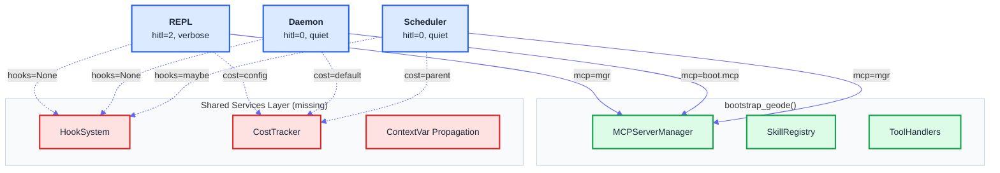
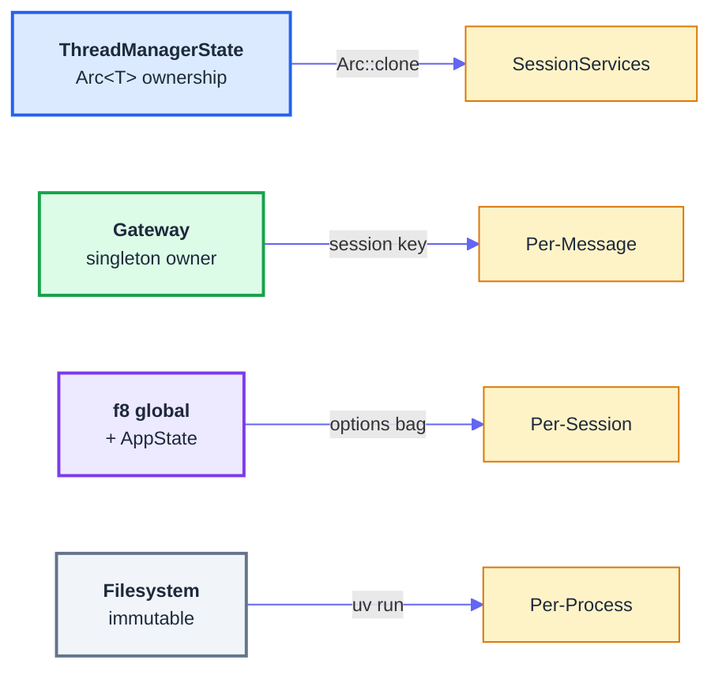
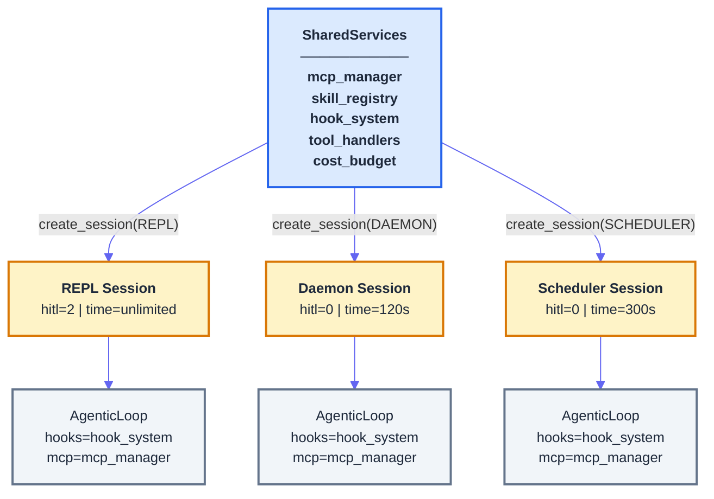
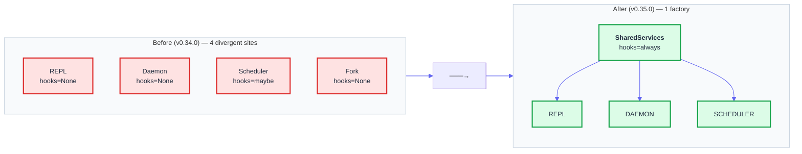

# SharedServices Gateway — 에이전트 시스템의 3-Entry-Point 리소스 정합 문제와 해법

> Date: 2026-03-29 | Author: geode-team | Tags: agent-architecture, shared-services, contextvar, frontier-research

## Table of Contents

1. [문제 발견 — "왜 Hooks가 안 되지?"](#1-문제-발견)
2. [현상 분석 — 3개 입구, 3개의 다른 세계](#2-현상-분석)
3. [프론티어 리서치 — 남들은 어떻게 하는가](#3-프론티어-리서치)
4. [설계 결정 — SharedServices Gateway](#4-설계-결정)
5. [구현 — 3 Phase 점진 마이그레이션](#5-구현)
6. [검증 — 5 GAP 전수 해소 확인](#6-검증)
7. [Wrap-up](#7-wrap-up)

---

## 1. 문제 발견

GEODE는 범용 자율 실행 에이전트입니다. 사용자는 세 가지 방법으로 에이전트를 호출할 수 있습니다 — 터미널 REPL, Slack/Discord 데몬, 그리고 크론 스케줄러. 문제는, 이 세 입구가 **같은 에이전트를 다른 방식으로 조립하고 있었다**는 것입니다.

"매일 9시에 AI 뉴스를 조사해"를 스케줄링하면 MCP(Model Context Protocol) 도구들이 실행되지 않았습니다. HookSystem은 코드에 존재했지만 실제로 한 번도 발화된 적이 없었습니다. 비용 추적? 세 입구 중 하나에서만 작동했습니다.

근본 원인은 단순했습니다. **동일한 팩토리 함수를 3곳에서 서로 다른 파라미터로 호출하고 있었고, 누락이 눈에 보이지 않았습니다.**

---

## 2. 현상 분석

### 3개 입구의 자원 공유 맵



점선은 **연결이 불안정하거나 누락**된 경로입니다. 핵심 발견 5건을 정리하면 다음과 같습니다.

### 발견된 5건의 결함

| # | 결함 | 심각도 | 증상 |
|---|------|:------:|------|
| 1 | HookSystem이 3곳 모두 `hooks=None` | CRITICAL | 비용 추적, 턴 로깅, stuck 감지 전부 미작동 |
| 2 | `_project_memory`, `_user_profile`이 plain global | HIGH | 데몬 스레드에서 race condition |
| 3 | 스케줄러에 ContextVar 미전파 | HIGH | 예약 잡에서 도메인/메모리 접근 실패 |
| 4 | `_readiness`에 동기화 없음 | MEDIUM | 멀티스레드 레이스 |
| 5 | `_result_cache` 프로세스 공유 | LOW | 동시 실행 시 캐시 충돌 (이미 Lock 보호) |

> `_hooks_ctx`라는 모듈 레벨 변수가 선언되어 있었지만, **단 한 번도 값이 설정된 적이 없었습니다.** `_fire_hook()` 함수는 매번 `None`을 읽고 조용히 아무것도 하지 않았습니다. 46개 Hook 이벤트가 정의되어 있었지만 프로덕션에서 단 하나도 발화되지 않은 것입니다.

---

## 3. 프론티어 리서치

"우리만의 문제인가, 아니면 알려진 패턴이 있는가?"를 확인하기 위해 프론티어 에이전트 하네스(harness) 4종을 조사했습니다.

### 4종 비교



4종 모두 **process-level shared → session-level isolated** 2-tier 구조입니다. 차이는 소유권 강제 방식(타입 시스템 / 단일 gateway / 암묵적 global / 프로세스 격리)뿐입니다.

| 하네스 | Shared Services 계층 | 패턴 | GEODE 적용 |
|--------|:--------------------:|------|:----------:|
| **Codex CLI** | `ThreadManagerState` | `Arc<T>` 명시적 소유권, 타입 시스템 강제 | 주 참조 모델 |
| **OpenClaw** | Gateway singleton | 모든 실행 경로가 Gateway를 통과 | 단일 팩토리 개념 |
| **Claude Code** | `f8` 암묵적 global | Options Bag DI + 4x AsyncLocalStorage | ContextVar 패턴 |
| **autoresearch** | 없음 (불필요) | 프로세스 격리 + immutable 파일 | 직렬 실행이라 해당 없음 |

> **3종 공통 원칙이 도출되었습니다.** (1) Process-level shared + Session-level isolated의 2-tier 구조는 필수. (2) Hook/Event 시스템은 반드시 실행 경로에 연결되어야 합니다. (3) 승인(approval)과 대화 컨텍스트는 반드시 session-scoped여야 합니다. autoresearch만 예외인데, 직렬 실행 + 프로세스 격리라 공유 계층이 구조적으로 불필요하기 때문입니다.

### Codex CLI의 2-Tier 소유권

Codex CLI의 구조가 GEODE와 가장 정합합니다. `ThreadManagerState`가 process-level singleton을 소유하고, 각 세션은 `SessionServices`를 통해 공유 자원의 `Arc::clone`을 받습니다.

```rust
// codex-rs/core/src/thread_manager.rs
pub(crate) struct ThreadManagerState {
    auth_manager: Arc<AuthManager>,      // shared
    models_manager: Arc<ModelsManager>,  // shared
    skills_manager: Arc<SkillsManager>,  // shared
    mcp_manager: Arc<McpManager>,        // shared
    // ...
}
```

> Rust의 `Arc<T>`는 컴파일 타임에 소유권을 강제합니다. Python에는 이 수준의 보장이 없으므로, 우리는 **단일 팩토리 함수**를 통해 런타임에 동일한 보장을 구현해야 합니다.

---

## 4. 설계 결정

### 핵심 아이디어: 단일 팩토리

기존에는 `_build_agentic_stack()`을 4곳에서 서로 다른 파라미터로 호출했습니다. 파라미터 하나를 빠뜨려도 컴파일러가 잡아주지 않으므로 silent failure가 발생했습니다.

해법: **SharedServices 클래스가 모든 공유 자원을 소유하고, `create_session(mode)` 하나로 세션을 생성합니다.** 모드별로 다른 것(hitl, quiet, time)만 내부에서 분기하고, 공유 자원(hooks, MCP, skills, cost)은 자동 주입됩니다.



모든 모드가 동일한 `hook_system`, `mcp_manager`, `skill_registry`를 받습니다. 누락이 **구조적으로 불가능**합니다.

### SessionMode — 모드는 행동을 결정하고, 자원을 결정하지 않는다

```python
# core/gateway/shared_services.py
class SessionMode(StrEnum):
    REPL = "repl"           # Interactive — hitl=2, time=unlimited
    DAEMON = "daemon"       # Slack/Discord — hitl=0, time=config
    SCHEDULER = "scheduler" # Cron jobs — hitl=0, time=300s cap
```

> **왜 GATEWAY가 아니라 DAEMON인가?** "Gateway"는 이제 SharedServices 계층 자체를 지칭합니다. Slack/Discord 폴러는 데몬 프로세스이므로 `DAEMON`이 정확한 이름입니다. Codex CLI도 `SessionSource` enum으로 실행 모드를 구분하고, OpenClaw도 Gateway(인프라)와 Channel(모드)을 분리합니다.

### max_rounds 제거 — 시간이 유일한 제약

기존에는 `max_rounds=50`이 기본이었습니다. 하지만 50라운드가 30초일 수도 300초일 수도 있습니다. 도구 호출 복잡도에 따라 달라지기 때문입니다.

프론티어 3종 모두 시간 기반 제약을 사용합니다 — Claude Code는 cost budget, Codex는 sandbox timeout, OpenClaw는 Lane timeout. GEODE도 `time_budget_s`를 유일한 제약으로 전환했습니다.

| Mode | Before | After |
|------|--------|-------|
| REPL | max_rounds=50, time=0 | max_rounds=0, time=0 (unlimited) |
| Daemon | max_rounds=30, time=0 | max_rounds=0, time=120s (config) |
| Scheduler | max_rounds=50, time=300s | max_rounds=0, time=300s |

---

## 5. 구현

3 Phase로 점진 마이그레이션했습니다. 각 Phase마다 품질 게이트(lint + type + test 3344+)를 통과한 후 다음으로 진행했습니다.

### Phase 1: Gateway Foundation

`SharedServices` 클래스를 생성하고, 4개의 `_build_agentic_stack()` 호출을 `services.create_session(mode)`로 수렴시켰습니다.

```python
# core/gateway/shared_services.py
@dataclass
class SharedServices:
    mcp_manager: Any = None
    skill_registry: Any = None
    hook_system: Any = None       # never None after init
    tool_handlers: dict[str, Any] = field(default_factory=dict)
    agentic_ref: list[Any] = field(default_factory=lambda: [None])

    def create_session(
        self,
        mode: SessionMode,
        *,
        conversation: Any | None = None,
        system_suffix: str = "",
        time_budget_override: float | None = None,
        verbose: bool = False,
        propagate_context: bool = False,
    ) -> tuple[ToolExecutor, AgenticLoop]:
        # ... mode defaults 적용, shared resources 자동 주입
```

> `agentic_ref`는 `[loop]` 형태의 mutable list입니다. 도구 핸들러 클로저가 이 ref를 캡처하고, `create_session()`이 `ref[0] = loop`을 갱신합니다. 이렇게 하면 핸들러를 매번 재생성하지 않아도 최신 loop를 참조할 수 있습니다. 이 패턴은 기존 코드에서 이미 사용 중이었으며, SharedServices로 옮기면서 보존했습니다.

호출부 변경은 단순합니다:

```python
# Before (REPL — core/cli/__init__.py)
agentic_ref, executor, agentic = _build_agentic_stack(
    conversation,
    mcp_manager=mcp_mgr,
    skill_registry=skill_registry,
    verbose=verbose,
)

# After
executor, agentic = services.create_session(
    SessionMode.REPL,
    conversation=conversation,
    verbose=verbose,
)
```

스케줄러는 8줄이 3줄로 줄었습니다:

```python
# Before (Scheduler)
_, _, _iso_loop = _build_agentic_stack(
    _iso_conv,
    mcp_manager=mcp_mgr,
    skill_registry=skill_registry,
    verbose=False, quiet=True, hitl_level=0,
    cost_budget=agentic._cost_budget,
    time_budget_s=min(agentic._time_budget_s or 300.0, 300.0),
    hooks=agentic._hooks if hasattr(agentic, "_hooks") else None,
)

# After
_, _iso_loop = services.create_session(
    SessionMode.SCHEDULER,
    conversation=_iso_conv,
    propagate_context=True,
)
```

> `propagate_context=True`는 데몬 스레드에서 ContextVar를 재주입합니다. Python의 `contextvars`는 스레드 간 자동 상속이 되지 않으므로, 데몬/스케줄러 모드에서는 반드시 이 플래그를 설정해야 합니다.

### Phase 2: Time-Based Constraints

`DEFAULT_MAX_ROUNDS=0`으로 전환하고, `ChannelBinding.max_rounds`를 `time_budget_s`로 교체했습니다. 레거시 config는 자동 변환됩니다:

```python
# core/gateway/channel_manager.py
if "time_budget_s" in gw:
    self.gateway_time_budget_s = float(gw["time_budget_s"])
elif "max_rounds" in gw:
    # Legacy: convert max_rounds to approximate time (10s/round)
    self.gateway_time_budget_s = float(int(gw["max_rounds"]) * 10)
```

### Phase 3: ContextVar Migration

`_project_memory`, `_user_profile`, `_readiness` 세 globals를 `ContextVar`로 전환했습니다. 외부 API(setter/getter 함수)는 변경 없이 내부만 교체했습니다.

```python
# Before (core/tools/memory_tools.py)
_project_memory: ProjectMemory | None = None

def set_project_memory(mem: ProjectMemory | None) -> None:
    global _project_memory
    _project_memory = mem

# After
_project_memory_ctx: ContextVar[ProjectMemory | None] = ContextVar(
    "project_memory_tools", default=None
)

def set_project_memory(mem: ProjectMemory | None) -> None:
    _project_memory_ctx.set(mem)
```

> 같은 패턴의 ContextVar가 이미 코드베이스에 4개 존재했습니다(`_session_store_ctx`, `_search_engine_ctx` 등). `_project_memory`와 `_user_profile`만 예외적으로 plain global이었고, 이번에 일관성을 맞췄습니다.

---

## 6. 검증

### 전체 흐름 — Before vs After



### 5 GAP 해소 확인

| # | GAP | Severity | Before | After | Verification |
|---|-----|:--------:|:------:|:-----:|--------------|
| 1 | HookSystem | CRITICAL | hooks=None | hook_system injected | `assert loop._hooks is not None` |
| 2 | Globals thread-unsafe | HIGH | plain global | ContextVar | `_project_memory_ctx.get()` |
| 3 | Scheduler ContextVar | HIGH | missing | propagate_context=True | Scheduled job: `get_domain()` works |
| 4 | _readiness race | MEDIUM | no lock | ContextVar | `_readiness_ctx.get()` |
| 5 | _result_cache | LOW | - | Already had Lock | No change needed |

### 수치 검증

| Metric | Before | After |
|--------|:------:|:-----:|
| Tests | 3344 | 3369 (+25 new) |
| Modules | 188 | 189 (+1: shared_services.py) |
| Call sites | 4 (divergent) | 1 (converged) |
| hooks=None in production | 3/4 | 0/3 |
| E2E Cowboy Bebop | A (68.4) | A (68.4) |

---

## 7. Wrap-up

### Summary

| Item | Description |
|------|-------------|
| Problem | 3 entry points calling the same factory with different params — hooks/cost/context silently missing |
| Frontier evidence | Codex `ThreadManagerState`, OpenClaw Gateway, Claude Code `f8` — 3/3 have single-factory pattern |
| Solution | `SharedServices.create_session(mode)` — 1 factory, 3 modes, auto-injected shared resources |
| Key decisions | GATEWAY renamed to DAEMON, max_rounds=0 (time-only), globals to ContextVar |
| Impact | 5 CRITICAL/HIGH gaps resolved, 0 regressions |

### Checklist

- [x] 단일 팩토리로 수렴 — `grep "_build_agentic_stack" core/cli/__init__.py` returns 0
- [x] hooks 항상 연결 — `assert loop._hooks is not None` for all modes
- [x] max_rounds 하드코딩 제거 — time_budget_s가 유일한 제약
- [x] ContextVar 전환 — _project_memory, _user_profile, _readiness
- [x] 테스트 회귀 없음 — 3369 pass
- [x] E2E 변동 없음 — A (68.4) maintained

### What's Next

SharedServices는 GEODE의 "Gateway"가 되었습니다. 다음 단계는:

- **concurrency-redesign (P1)** — 워크로드별 세마포어 분리. 현재 DAEMON과 SCHEDULER가 같은 동시성 제어를 사용합니다.
- **e2e-phase6 (P2)** — SharedServices를 통한 서브에이전트/스케줄러/모델 전환의 live E2E 검증.

단일 팩토리가 확보되었으므로, 앞으로 새로운 모드(예: Batch, Webhook)를 추가할 때는 `SessionMode`에 enum 값 하나와 `_MODE_DEFAULTS`에 기본값 한 줄만 추가하면 됩니다. 나머지는 SharedServices가 보장합니다.

---

*Source: `blog/posts/architecture/shared-services-gateway.md` | Category: [[blog-architecture]]*

## Related

- [[blog-architecture]]
- [[blog-hub]]
- [[geode]]
- [[geode-architecture]]
- [[geode-gateway]]
