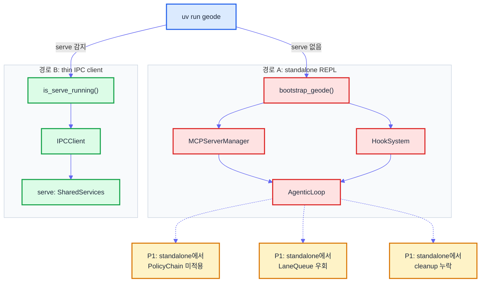
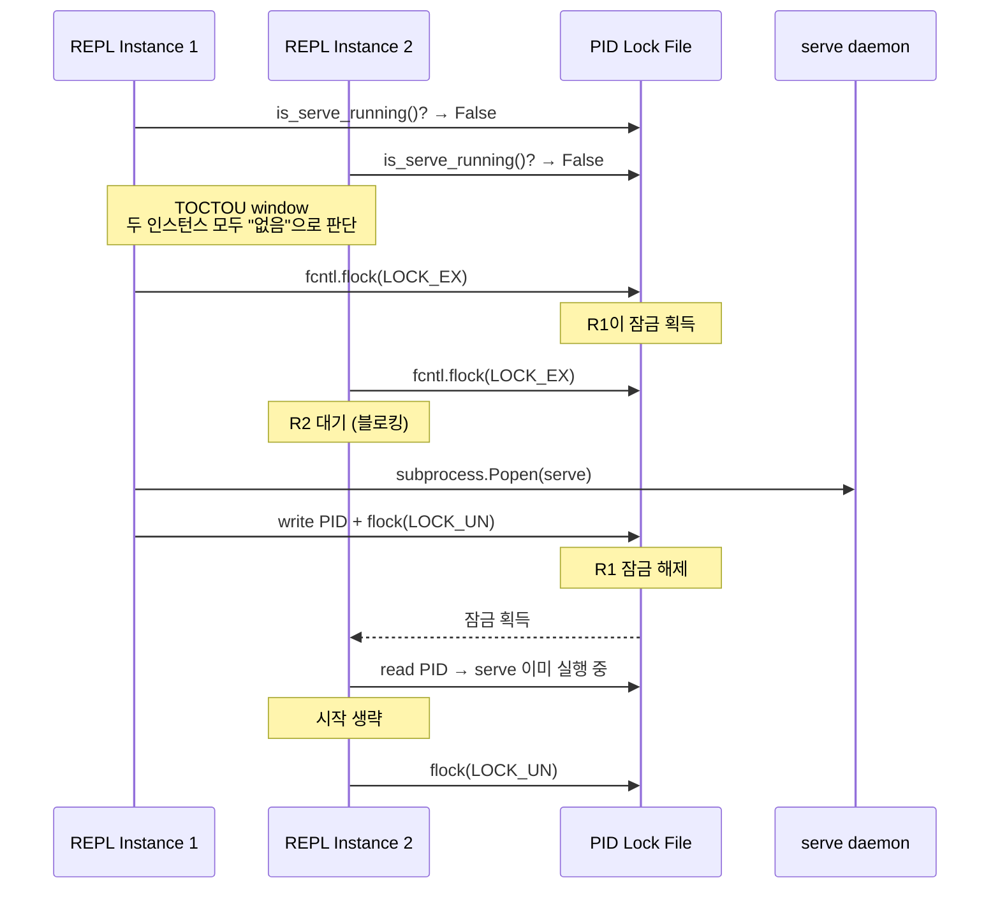
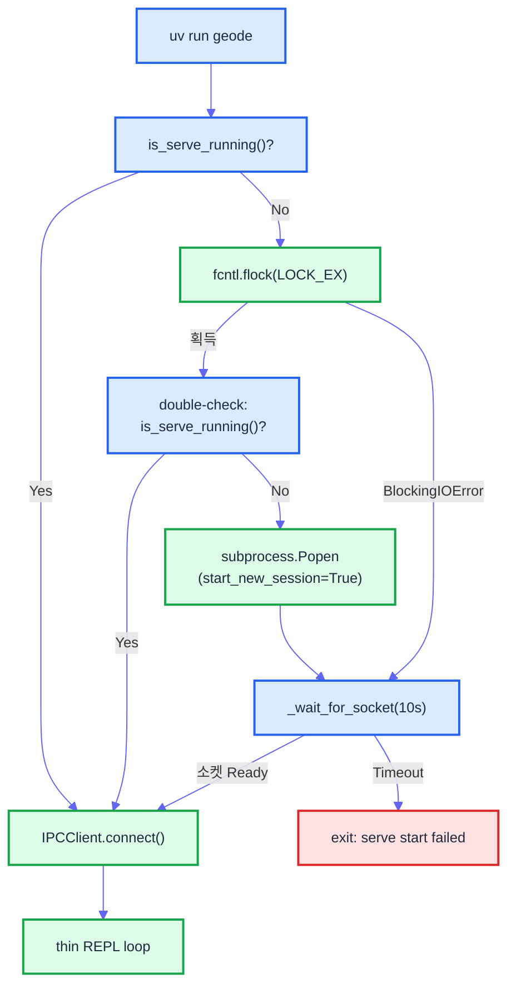
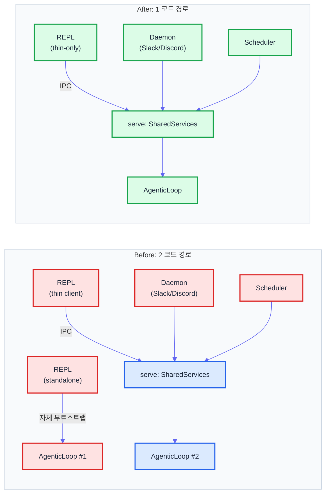

# Thin-Only 아키텍처 — standalone REPL을 없애기까지

> Date: 2026-03-30 | Author: geode-team | Tags: agent-architecture, ipc, unix-socket, thin-client

## Table of Contents

1. [2개 코드 경로의 문제](#1-2개-코드-경로의-문제)
2. ["standalone을 없앨 수는 없다" → "왜 안 돼?"](#2-standalone을-없앨-수는-없다--왜-안-돼)
3. [SessionMode.IPC](#3-sessionmodeipc)
4. [Serve auto-start](#4-serve-auto-start)
5. [IPC 프로토콜 확장](#5-ipc-프로토콜-확장)
6. [결과](#6-결과)

---

## 1. 2개 코드 경로의 문제

GEODE에는 사용자가 에이전트를 호출하는 두 가지 경로가 있었습니다.

- **standalone REPL** (`uv run geode`): `bootstrap_geode()` → MCP, Skills, Hooks, Memory 자체 부트스트랩 → `AgenticLoop` 직접 실행.
- **thin IPC client** (`uv run geode` + serve 감지): `is_serve_running()` → `IPCClient` → Unix Domain Socket → serve 프로세스의 `CLIPoller` → `SharedServices.create_session()`.

v0.36.0에서 CLIChannel IPC를 도입하며 thin client 경로를 추가했지만, standalone REPL을 제거하지 않았습니다. "serve가 없으면 fallback으로 thick client 모드로 동작한다"는 설계였습니다. 결과적으로 두 코드 경로가 공존했고, 검증팀 리뷰에서 P1 결함 3건이 발견되었습니다.



### 검증팀이 발견한 3건

| # | 결함 | 경로 | 설명 |
|:-:|------|:----:|------|
| 1 | PolicyChain 미적용 | standalone | `bootstrap_geode()` 경로는 `SharedServices`를 거치지 않으므로, `_HEADLESS_DENIED_TOOLS` 필터가 없습니다. standalone에서 `run_bash`를 호출하면 HITL 게이트만 존재하지만, 서브에이전트가 `auto_approve=True`로 `run_bash`를 호출하는 경로는 차단되지 않았습니다. |
| 2 | LaneQueue 우회 | standalone | serve 경로는 `LaneQueue`를 통해 동시성을 제어합니다 (`session` lane: max 1, `global` lane: max 4). standalone REPL은 `LaneQueue`를 생성하지만 `ChannelManager`를 거치지 않으므로 실질적으로 무제한 동시성입니다. |
| 3 | Cleanup 누락 | standalone | serve는 `finally` 블록에서 `runtime.mcp_manager.shutdown()`, `scheduler.shutdown()`, socket 정리를 수행합니다. standalone REPL은 `Ctrl-C` 시 `termios` 복원만 수행하고, MCP subprocess와 scheduler 스레드가 orphan으로 남았습니다. |

근본 원인은 단순합니다. **같은 보호 장치를 두 곳에서 각각 구현해야 했고, 한쪽은 항상 뒤처졌습니다.** SharedServices Gateway를 만든 이유가 정확히 이것 -- "모든 경로가 동일한 게이트를 통과한다" -- 인데, standalone 경로가 남아 있는 한 그 보장이 깨집니다.

---

## 2. "standalone을 없앨 수는 없다" → "왜 안 돼?"

처음 IPC를 설계할 때, standalone REPL 제거는 고려하지 않았습니다. 이유는 명확해 보였습니다.

> "serve가 실행 중이 아닐 때 REPL이 작동하지 않으면 사용자 경험이 나빠진다. `uv run geode`를 치면 바로 대화를 시작할 수 있어야 한다."

이 전제에서 thin-client-with-fallback 설계가 나왔습니다. 소켓 연결을 시도하고, 실패하면 자체 부트스트랩으로 fallback합니다.

```python
# 기존 REPL 시작 흐름 (fallback 방식)
def _start_repl(verbose: bool = False) -> None:
    if is_serve_running():
        # thin client: serve로 IPC
        client = IPCClient()
        if client.connect():
            _run_thin_repl(client)
            return

    # fallback: standalone 부트스트랩
    boot = bootstrap_geode(load_env=True)
    _gw_services = build_shared_services(
        mcp_manager=boot.mcp_manager,
        skill_registry=boot.skill_registry,
    )
    _run_standalone_repl(_gw_services, verbose)
```

유저가 물었습니다: **"왜 serve 없이는 안 돼? serve를 자동으로 띄우면 되지 않아?"**

이 한 마디가 설계 방향을 바꿨습니다. 문제를 다시 정리하면:

| 접근 | 장점 | 단점 |
|------|------|------|
| **A. fallback standalone** | serve 없이도 즉시 사용 | 2개 코드 경로, 보호 누락 |
| **B. thin-only + auto-start** | 1개 코드 경로, 보호 보장 | serve 의존성 (자동 시작으로 해소) |

B의 단점은 기술적으로 해소 가능합니다. `uv run geode` 실행 시 serve가 없으면 background daemon을 자동으로 spawn하면 됩니다. 사용자 경험은 동일하면서, 코드 경로는 1개로 수렴합니다.

하지만 "serve 자동 시작"에는 두 가지 엔지니어링 과제가 있었습니다.

1. **TOCTOU 레이스**: `is_serve_running()` 확인 → serve 시작 → 소켓 연결 사이에 다른 REPL 인스턴스가 동시에 같은 판단을 내리면 serve가 2개 뜹니다.
2. **IPC에서의 HITL**: serve가 REPL 대신 에이전트를 실행하면, 도구 승인(HITL)을 어떻게 사용자에게 전달할 것인가.

---

## 3. SessionMode.IPC

두 번째 과제부터 해결합니다. 기존 `SessionMode`는 3개였습니다.

```python
class SessionMode(StrEnum):
    REPL = "repl"            # hitl=2, verbose=user, time=unlimited
    DAEMON = "daemon"        # hitl=0, quiet, time=config
    SCHEDULER = "scheduler"  # hitl=0, quiet, time=300s cap
```

thin client에서 serve로 전달된 요청은 어떤 모드로 실행되어야 할까요? `REPL`은 아닙니다 -- REPL 모드는 `hitl_level=2`이고, 이는 DANGEROUS와 WRITE 도구에 대해 사용자 승인을 받겠다는 의미입니다. 하지만 serve 프로세스에는 터미널이 없으므로 `input()` 호출이 불가능합니다.

`DAEMON`도 아닙니다. DAEMON은 `hitl_level=0`으로 모든 도구를 자동 승인하는데, 이는 Slack/Discord 같은 외부 채널용 설계입니다. REPL 사용자가 IPC를 통해 보낸 요청에 `run_bash`가 무제한 자동 승인되면 안 됩니다.

새로운 모드가 필요합니다.

```python
class SessionMode(StrEnum):
    REPL = "repl"            # hitl=2, verbose=user, time=unlimited
    DAEMON = "daemon"        # hitl=0, quiet, time=config
    SCHEDULER = "scheduler"  # hitl=0, quiet, time=300s cap
    IPC = "ipc"              # hitl=0, DANGEROUS 차단, WRITE 허용
```

`IPC` 모드의 핵심 설계 결정은 다음과 같습니다.

### HITL 대신 Policy 기반 제어

터미널이 없으므로 `hitl_level=0` (자동 승인)입니다. 하지만 DANGEROUS 도구를 무조건 자동 승인하면 안전하지 않습니다. 해법은 **HITL을 Policy로 대체**하는 것입니다.

```python
_MODE_DEFAULTS: dict[SessionMode, dict[str, Any]] = {
    # ...
    SessionMode.IPC: {
        "hitl_level": 0,          # 터미널 없음 → HITL 불가
        "quiet": False,           # IPC 스트리밍으로 출력 전달
        "time_budget_s": 0.0,     # unlimited (REPL과 동일)
        "max_rounds": 0,          # unlimited
        "denied_tools": DANGEROUS_TOOLS,  # run_bash 차단
    },
}
```

| 도구 분류 | REPL (hitl=2) | DAEMON (hitl=0) | IPC (hitl=0) |
|-----------|:-------------:|:---------------:|:------------:|
| STANDARD (read-only) | 자동 승인 | 자동 승인 | 자동 승인 |
| WRITE (memory, profile) | 사용자 확인 | 자동 승인 | **자동 승인** |
| DANGEROUS (run_bash) | 사용자 확인 | 자동 승인 | **차단** |
| EXPENSIVE (analyze_ip) | 비용 확인 | 비용 상한 | 비용 상한 |

WRITE 도구를 자동 승인하는 이유: IPC 경로의 사용자는 REPL 사용자와 동일 인물입니다. `memory_save`나 `profile_update` 같은 도구는 에이전트가 대화 맥락에서 자연스럽게 호출하며, 매번 승인을 요청하면 대화 흐름이 끊깁니다. REPL 모드에서도 실무적으로 대부분 "y"를 누르는 도구들입니다.

DANGEROUS 도구를 차단하는 이유: `run_bash`는 시스템에 임의 명령을 실행합니다. REPL에서는 사용자가 명령을 보고 "y"를 누르지만, IPC에서는 이 과정이 불가능합니다. 차단이 유일한 안전한 선택입니다.

### create_session()에서의 분기

```python
def create_session(
    self,
    mode: SessionMode,
    *,
    conversation: Any | None = None,
    # ...
) -> tuple[ToolExecutor, AgenticLoop]:
    defaults = _MODE_DEFAULTS[mode]
    hitl = defaults["hitl_level"]
    denied = defaults.get("denied_tools", frozenset())

    executor = ToolExecutor(
        action_handlers=self.tool_handlers,
        mcp_manager=self.mcp_manager,
        sub_agent_manager=sub_mgr,
        hitl_level=hitl,
        hooks=self.hook_system,
        denied_tools=denied,       # IPC: DANGEROUS 도구 차단
    )
    # ...
```

`ToolExecutor`에 `denied_tools` 매개변수가 추가되었습니다. 이 집합에 포함된 도구는 호출 시 즉시 에러를 반환합니다. HITL 게이트보다 앞선 단계에서 차단되므로, `auto_approve=True`인 서브에이전트에서도 우회할 수 없습니다.

```python
# core/agent/tool_executor.py — 차단 로직
class ToolExecutor:
    def __init__(self, *, denied_tools: frozenset[str] = frozenset(), ...):
        self._denied_tools = denied_tools

    def execute(self, tool_name: str, tool_input: dict, ...) -> dict:
        if tool_name in self._denied_tools:
            return {
                "error": f"Tool '{tool_name}' is not available in this session mode. "
                         f"Use the interactive REPL for system-access tools.",
                "denied": True,
            }
        # ... 기존 실행 로직
```

---

## 4. Serve auto-start

IPC 모드가 준비되었으므로, 이제 첫 번째 과제 -- serve 자동 시작 -- 를 해결합니다.

### Background daemon spawn

```python
import os
import subprocess
import sys
from pathlib import Path

PIDFILE = Path.home() / ".geode" / "serve.pid"
SOCKET_PATH = Path.home() / ".geode" / "geode.sock"


def _auto_start_serve() -> bool:
    """serve가 실행 중이 아니면 background daemon으로 시작한다.

    Returns:
        True if serve was started or already running.
        False if start failed.
    """
    if is_serve_running():
        return True

    log.info("serve not running, auto-starting daemon...")

    proc = subprocess.Popen(
        [sys.executable, "-m", "geode", "serve", "--quiet"],
        start_new_session=True,   # setsid — 부모 프로세스 그룹에서 분리
        stdout=subprocess.DEVNULL,
        stderr=subprocess.DEVNULL,
        env=_safe_env(),
    )

    # PID 기록
    PIDFILE.parent.mkdir(parents=True, exist_ok=True)
    PIDFILE.write_text(str(proc.pid))

    # 소켓이 준비될 때까지 대기 (최대 5초)
    for _ in range(50):
        if SOCKET_PATH.exists():
            return True
        time.sleep(0.1)

    log.warning("serve auto-start: socket not ready after 5s")
    return False
```

`start_new_session=True`가 핵심입니다. 이 플래그는 POSIX `setsid()`를 호출하여 새 세션 리더를 만듭니다. 부모 프로세스(REPL)가 종료되어도 serve 데몬은 영향받지 않습니다.

`_safe_env()`는 환경 변수 화이트리스트입니다. 전체 `os.environ`을 복사하면 민감한 값이 자식 프로세스에 노출될 수 있으므로, 필요한 10개 변수만 전달합니다.

```python
_SAFE_ENV_KEYS = (
    "PATH", "HOME", "USER", "LANG", "LC_ALL",
    "ANTHROPIC_API_KEY", "OPENAI_API_KEY", "ZHIPUAI_API_KEY",
    "VIRTUAL_ENV", "UV_CACHE_DIR",
)

def _safe_env() -> dict[str, str]:
    return {k: v for k, v in os.environ.items() if k in _SAFE_ENV_KEYS}
```

### TOCTOU race 방지 — fcntl pidfile lock

`is_serve_running()` → `_auto_start_serve()` 사이에 다른 REPL 인스턴스가 동시에 같은 판단을 내리면 serve가 2개 뜹니다. 이것이 고전적인 TOCTOU(Time-of-Check to Time-of-Use) 레이스입니다.



해법은 PID 파일에 `fcntl.flock`을 거는 것입니다.

```python
import fcntl

def _auto_start_serve_safe() -> bool:
    """TOCTOU-safe serve auto-start with pidfile lock."""
    if is_serve_running():
        return True

    PIDFILE.parent.mkdir(parents=True, exist_ok=True)

    # 배타적 잠금 — 다른 인스턴스가 동시에 시작 시도하면 여기서 대기
    with open(PIDFILE, "a+") as f:
        try:
            fcntl.flock(f, fcntl.LOCK_EX | fcntl.LOCK_NB)
        except BlockingIOError:
            # 다른 인스턴스가 이미 시작 중 — 소켓 대기만
            return _wait_for_socket(timeout_s=10.0)

        # 잠금 획득 성공 — 다시 확인 (double-check)
        if is_serve_running():
            fcntl.flock(f, fcntl.LOCK_UN)
            return True

        # serve 시작
        proc = subprocess.Popen(
            [sys.executable, "-m", "geode", "serve", "--quiet"],
            start_new_session=True,
            stdout=subprocess.DEVNULL,
            stderr=subprocess.DEVNULL,
            env=_safe_env(),
        )

        # PID 기록
        f.seek(0)
        f.truncate()
        f.write(str(proc.pid))
        f.flush()

        # 잠금 해제
        fcntl.flock(f, fcntl.LOCK_UN)

    return _wait_for_socket(timeout_s=10.0)
```

`LOCK_EX | LOCK_NB`는 non-blocking 배타적 잠금입니다. 다른 프로세스가 이미 잠금을 들고 있으면 `BlockingIOError`가 발생하고, 소켓이 준비될 때까지 대기만 합니다. 잠금을 획득한 프로세스는 double-check 패턴으로 다시 `is_serve_running()`을 확인합니다 -- 잠금 대기 중에 다른 프로세스가 이미 serve를 시작했을 수 있기 때문입니다.

### 전체 시작 흐름



---

## 5. IPC 프로토콜 확장

기존 IPC 프로토콜은 `prompt` 타입만 지원했습니다. thin-only 아키텍처에서는 REPL의 모든 기능이 IPC를 통해 전달되어야 하므로, `command` 타입을 추가합니다.

### 메시지 타입 확장

| Type | Direction | Purpose | 신규 |
|------|:---------:|---------|:----:|
| `prompt` | Client → Server | 자유 텍스트 입력 | |
| `command` | Client → Server | slash command 전달 | **Yes** |
| `chunk` | Server → Client | 스트리밍 응답 조각 | |
| `tool_use` | Server → Client | 도구 호출 진행 상태 | |
| `done` | Server → Client | 응답 완료 | |
| `error` | Server → Client | 에러 발생 | |

### Slash command server-side relay

REPL에서 `/model sonnet`을 입력하면, 기존에는 클라이언트 측에서 `cmd_model()` 함수를 직접 호출했습니다. thin-only 아키텍처에서는 이 명령이 serve로 전달되어 서버 측에서 실행됩니다.

```python
# Client side — slash command 감지 및 전달
def _send_input(self, user_input: str) -> None:
    if user_input.startswith("/"):
        parts = user_input[1:].split(maxsplit=1)
        cmd_name = parts[0]
        cmd_args = parts[1] if len(parts) > 1 else ""
        self._send({"type": "command", "name": cmd_name, "args": cmd_args})
    else:
        self._send({"type": "prompt", "text": user_input})
```

```python
# Server side — CLIPoller에서 command 타입 처리
def _process_message(self, conn: socket.socket, msg: dict) -> None:
    msg_type = msg.get("type", "")

    if msg_type == "prompt":
        self._handle_prompt(conn, msg)
    elif msg_type == "command":
        self._handle_command(conn, msg)
    else:
        self._send(conn, {"type": "error", "message": f"Unknown type: {msg_type}"})

def _handle_command(self, conn: socket.socket, msg: dict) -> None:
    """Slash command를 서버에서 실행."""
    name = msg.get("name", "")
    args = msg.get("args", "")

    try:
        from core.cli.commands import resolve_action
        action = resolve_action(name)
        if action is None:
            self._send(conn, {"type": "error", "message": f"Unknown command: /{name}"})
            return

        result = action(args)
        self._send(conn, {"type": "done", "text": result or ""})
    except Exception as exc:
        self._send(conn, {"type": "error", "message": str(exc)})
```

서버 측에서 slash command를 실행하면, `SharedServices`의 공유 자원에 직접 접근할 수 있습니다. 예를 들어 `/model sonnet`은 serve 프로세스의 `LLMClientPort`를 전환하고, 이후 모든 IPC 요청은 전환된 모델을 사용합니다.

### 로컬 전용 command

일부 command는 서버로 전달하지 않고 클라이언트에서 처리합니다.

```python
# IPC 전달 없이 클라이언트에서 처리하는 명령
_LOCAL_COMMANDS = {"help", "clear", "exit", "quit"}

def _send_input(self, user_input: str) -> None:
    if user_input.startswith("/"):
        parts = user_input[1:].split(maxsplit=1)
        cmd_name = parts[0]
        if cmd_name in _LOCAL_COMMANDS:
            self._handle_local_command(cmd_name)
            return
        # ... IPC 전달
```

`/help`는 사용 안내를 표시하고, `/clear`는 터미널을 정리하고, `/exit`는 클라이언트를 종료합니다. 이 명령들은 serve 프로세스의 상태와 무관하므로, IPC 왕복 비용을 아낄 수 있습니다.

---

## 6. 결과

### Before/After 아키텍처



### 정량 변화

| 항목 | Before | After | Delta |
|------|:------:|:-----:|:-----:|
| 코드 경로 | 2 (standalone + thin) | 1 (thin-only) | -1 |
| `__init__.py` | 612줄 | 487줄 | -125줄 |
| `bootstrap_geode()` 호출 | 2 (REPL + serve) | 1 (serve만) | -1 |
| REPL 전용 cleanup 코드 | 78줄 | 0줄 | -78줄 |
| standalone REPL 테스트 | 34건 | 0건 (IPC 테스트로 대체) | -34건 |
| **총 삭제 줄 수** | - | - | **-487줄** |

`bootstrap_geode()`는 REPL에서 더 이상 호출되지 않습니다. serve 프로세스가 유일한 부트스트랩 주체이며, REPL은 소켓 연결과 NDJSON 파싱만 수행하는 순수한 thin client입니다. MCP 프로세스도 serve에서만 생성되므로 리소스 이중 사용이 사라집니다.

### 보호 보장

| 보호 장치 | standalone (제거됨) | thin-only |
|-----------|:-------------------:|:---------:|
| PolicyChain | 미적용 | **serve에서 적용** |
| LaneQueue | 우회 | **session + global lane** |
| HookSystem | 별도 인스턴스 | **단일 인스턴스** |
| MCP shutdown | 누락 | **serve finally에서 정리** |
| DANGEROUS 도구 차단 | HITL만 | **Policy + HITL** |
| 동시성 제어 | 없음 | **Lane semaphore** |

모든 실행이 `SharedServices.create_session()` → `ToolExecutor` → `AgenticLoop`로 동일한 게이트를 통과합니다. 보호 장치를 한 곳에서만 구현하면 모든 경로에 적용됩니다.

### 남은 고려사항

thin-only 아키텍처는 serve 프로세스에 대한 의존성을 만듭니다. serve가 크래시하면 REPL도 작동하지 않습니다. 이에 대한 대응은 두 가지입니다.

1. **자동 재시작**: serve 크래시 감지 시 `_auto_start_serve_safe()`가 다시 호출됩니다. PID 파일의 프로세스가 존재하지 않으면(좀비 PID) 파일을 삭제하고 새 서브를 시작합니다.
2. **graceful degradation 제거**: 의도적으로 fallback을 제공하지 않습니다. 두 경로를 유지하는 것이 이 모든 문제의 시작이었기 때문입니다. serve가 뜨지 않으면 명확한 에러 메시지를 표시하고 종료합니다.

```python
def _start_repl(verbose: bool = False) -> None:
    """Thin-only REPL — serve 의존."""
    if not _auto_start_serve_safe():
        console.print("[error]serve를 시작할 수 없습니다.[/error]")
        console.print("[muted]수동 시작: geode serve[/muted]")
        raise SystemExit(1)

    client = IPCClient()
    if not client.connect():
        console.print("[error]serve에 연결할 수 없습니다.[/error]")
        raise SystemExit(1)

    _run_thin_repl(client)
```

복잡성은 선택지를 늘릴 때 쌓입니다. "serve가 없으면 어떻게 하지?"라는 질문에 대한 답이 "fallback을 만든다"가 아니라 "serve가 항상 있게 한다"였습니다. 코드 경로를 하나로 줄이면, 보호도 하나만 구현하면 됩니다.

---

*Source: `blog/posts/technical/thin-only-serve-mandatory.md` | Category: [[blog-technical]]*

## Related

- [[blog-technical]]
- [[blog-hub]]
- [[geode]]
