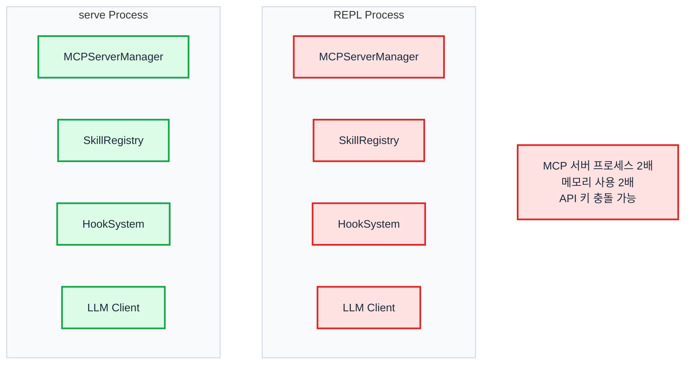
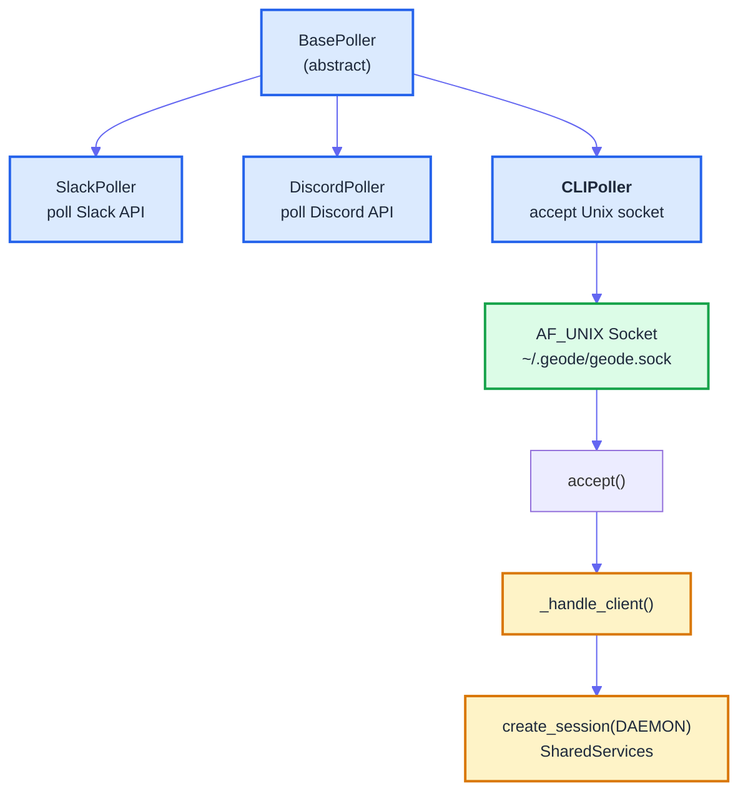
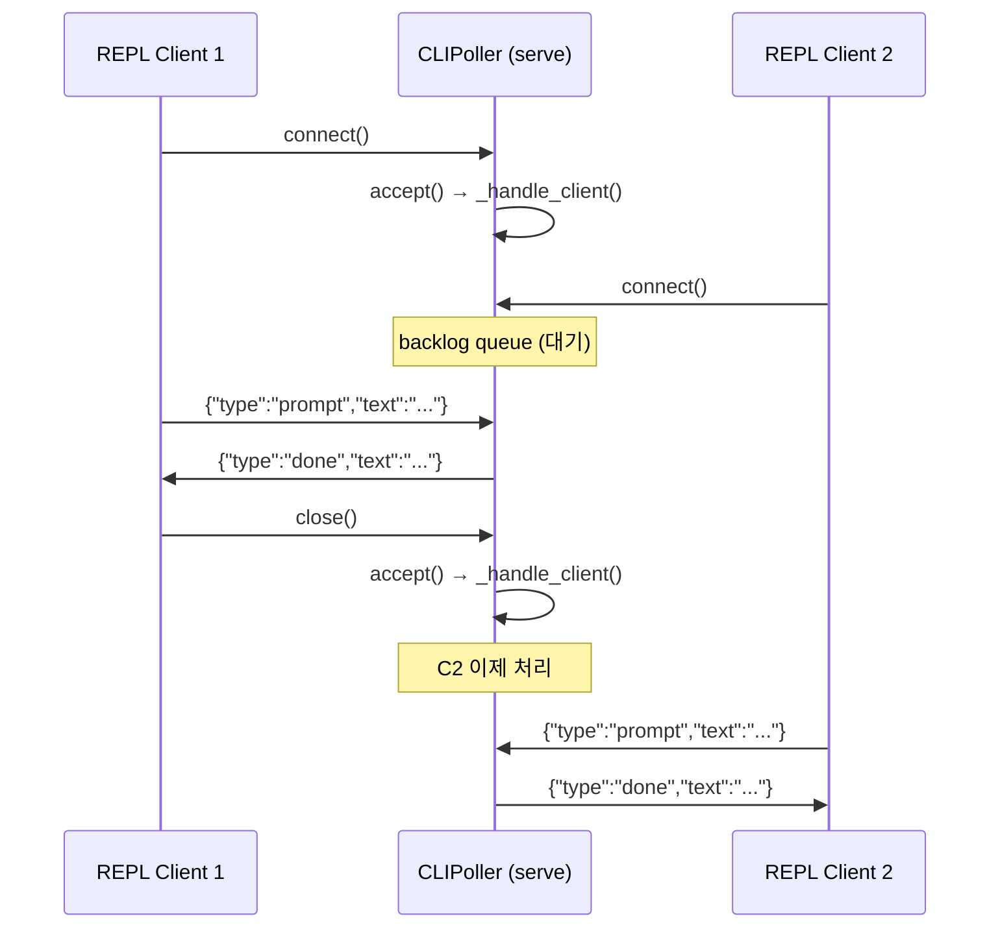

# Unix Domain Socket으로 CLI 에이전트 IPC 구현하기

> Date: 2026-03-30 | Author: geode-team | Tags: python, ipc, unix-socket, agent-system, cli

## Table of Contents

1. [왜 IPC인가 — Thick Client의 문제점](#1-왜-ipc인가)
2. [프로토콜 설계 — Line-Delimited JSON](#2-프로토콜-설계)
3. [서버 구현 — CLIPoller](#3-서버-구현)
4. [클라이언트 구현 — IPCClient](#4-클라이언트-구현)
5. [Auto-Detect 패턴 — is_serve_running()](#5-auto-detect-패턴)
6. [에러 처리 — 연결 끊김과 부분 읽기](#6-에러-처리)
7. [설계 결정 — 직렬 처리와 그 이유](#7-설계-결정)

---

## 1. 왜 IPC인가

GEODE는 두 가지 모드로 실행됩니다.

- **REPL** (`uv run geode`): 사용자가 직접 대화하는 인터랙티브 모드. LLM 클라이언트, MCP 서버, SkillRegistry, HookSystem을 모두 자체 부트스트랩합니다.
- **serve** (`geode serve`): 백그라운드 데몬. Slack/Discord 폴러, 스케줄러, 동일한 부트스트랩 자원을 소유합니다.

문제는 REPL과 serve가 **동시에 실행될 때** 발생합니다.



**Thick Client** 방식에서 REPL은 serve와 독립적으로 모든 자원을 직접 부트스트랩합니다. 결과적으로 MCP 서버 프로세스가 2배로 뜨고, 메모리 사용량이 불필요하게 증가하며, Slack 토큰 같은 자원에서 충돌이 발생할 수 있습니다.

**Thin Client** 방식에서는 REPL이 자체 부트스트랩을 하지 않고, 이미 실행 중인 serve 프로세스에 메시지를 보내고 응답을 받습니다. serve가 없으면 fallback으로 thick client 모드로 동작합니다.

| 비교 | Thick Client (기존) | Thin Client (IPC) |
|------|:-------------------:|:-----------------:|
| MCP 프로세스 수 | N (프로세스당) | 1 (serve만) |
| 메모리 | O(N) | O(1) |
| 부트스트랩 시간 | 2-5초 | 즉시 (socket connect) |
| serve 의존성 | 없음 | serve 실행 필수 (or fallback) |
| 세션 격리 | 완전 분리 | serve 내부에서 격리 |

---

## 2. 프로토콜 설계

### 왜 gRPC/HTTP가 아닌가

| 선택지 | 장점 | 단점 | 적합도 |
|--------|------|------|:------:|
| gRPC | 타입 안전, 스트리밍 | protobuf 의존성, 빌드 단계 | 과잉 |
| HTTP (localhost) | 범용, 도구 풍부 | TCP 오버헤드, 포트 충돌 | 중간 |
| Unix Domain Socket + JSON | 제로 네트워크, 파일 권한 기반 보안 | Unix 전용 | 최적 |

Unix Domain Socket은 커널 내 IPC이므로 TCP 스택을 거치지 않습니다. 파일시스템 경로를 주소로 사용하므로 포트 충돌이 없고, 파일 권한(`0o600`)으로 접근 제어가 가능합니다.

### Line-Delimited JSON (NDJSON)

프로토콜은 의도적으로 단순합니다. 각 메시지는 **한 줄의 JSON + `\n`**입니다.

```
→ Client: {"type":"prompt","text":"오늘 날씨 알려줘","session_id":"abc123"}\n
← Server: {"type":"chunk","text":"서울의 현재 기온은"}\n
← Server: {"type":"chunk","text":" 15도이며 맑습니다."}\n
← Server: {"type":"done","session_id":"abc123"}\n
```

**왜 NDJSON인가:**

- 파싱이 단순합니다. `readline()` + `json.loads()`로 끝납니다.
- 스트리밍과 호환됩니다. 한 줄이 도착할 때마다 즉시 처리 가능합니다.
- 디버깅이 쉽습니다. `socat`이나 `nc -U`로 소켓에 직접 JSON을 보내 테스트할 수 있습니다.

메시지 타입은 최소한으로 유지합니다.

| Type | Direction | Purpose |
|------|:---------:|---------|
| `prompt` | Client → Server | 사용자 입력 전달 |
| `chunk` | Server → Client | 스트리밍 응답 조각 |
| `tool_use` | Server → Client | 도구 호출 진행 상태 |
| `done` | Server → Client | 응답 완료 |
| `error` | Server → Client | 에러 발생 |

---

## 3. 서버 구현

### CLIPoller의 구조

CLIPoller는 기존 `BasePoller`를 확장합니다. Slack/Discord 폴러가 외부 API를 폴링하는 것과 달리, CLIPoller는 Unix Domain Socket에서 로컬 클라이언트의 연결을 기다립니다.



### Socket 생성과 Bind

```python
import os
import socket
from pathlib import Path

SOCKET_PATH = Path.home() / ".geode" / "geode.sock"

def _create_socket() -> socket.socket:
    """Unix Domain Socket 생성 및 바인딩."""
    # 이전 세션의 잔여 소켓 정리
    if SOCKET_PATH.exists():
        SOCKET_PATH.unlink()

    sock = socket.socket(socket.AF_UNIX, socket.SOCK_STREAM)
    sock.bind(str(SOCKET_PATH))
    # 소유자만 접근 가능 (보안)
    os.chmod(str(SOCKET_PATH), 0o600)
    sock.listen(1)  # backlog=1: 한 번에 1 client만
    sock.settimeout(1.0)  # poll loop에서 stop_event 확인용
    return sock
```

`socket.AF_UNIX`는 Unix Domain Socket을, `SOCK_STREAM`은 TCP-like 스트림 시맨틱을 의미합니다. `listen(1)`은 의도적으로 backlog를 1로 제한합니다 -- 이유는 [7장](#7-설계-결정)에서 설명합니다.

### _handle_client() 구현

클라이언트가 연결되면 `_handle_client()`가 메시지를 읽고, SharedServices로 세션을 생성하여 에이전트를 실행합니다.

```python
import json

def _handle_client(self, conn: socket.socket) -> None:
    """단일 클라이언트 연결 처리."""
    try:
        buf = b""
        while True:
            chunk = conn.recv(4096)
            if not chunk:
                break  # 클라이언트 연결 종료
            buf += chunk
            while b"\n" in buf:
                line, buf = buf.split(b"\n", 1)
                msg = json.loads(line.decode("utf-8"))
                self._process_message(conn, msg)
    except (ConnectionResetError, BrokenPipeError):
        log.debug("CLI client disconnected")
    except json.JSONDecodeError as exc:
        self._send(conn, {"type": "error", "message": f"Invalid JSON: {exc}"})
    finally:
        conn.close()

def _process_message(self, conn: socket.socket, msg: dict) -> None:
    """메시지 타입에 따라 분기 처리."""
    msg_type = msg.get("type", "")
    if msg_type == "prompt":
        text = msg.get("text", "")
        if not text:
            self._send(conn, {"type": "error", "message": "Empty prompt"})
            return
        # SharedServices로 세션 생성
        _, loop = self._services.create_session(
            SessionMode.DAEMON,
            propagate_context=True,
        )
        result = loop.run(text)
        self._send(conn, {
            "type": "done",
            "text": result.text if result else "",
        })

def _send(self, conn: socket.socket, data: dict) -> None:
    """NDJSON 한 줄 전송."""
    line = json.dumps(data, ensure_ascii=False) + "\n"
    conn.sendall(line.encode("utf-8"))
```

`recv(4096)` + 버퍼 관리 패턴이 핵심입니다. TCP 스트림은 메시지 경계를 보장하지 않으므로, 한 번의 `recv`에 메시지가 잘려서 올 수 있습니다. `\n`을 구분자로 사용하여 완전한 줄이 도착할 때까지 버퍼에 누적합니다.

---

## 4. 클라이언트 구현

### IPCClient의 역할

REPL이 serve 프로세스를 감지하면, 자체 부트스트랩 대신 `IPCClient`를 통해 serve에 메시지를 전달합니다.

```python
import json
import socket
from pathlib import Path

SOCKET_PATH = Path.home() / ".geode" / "geode.sock"


class IPCClient:
    """Unix Domain Socket을 통해 serve 프로세스와 통신하는 thin client."""

    def __init__(self, socket_path: Path | None = None) -> None:
        self._path = socket_path or SOCKET_PATH
        self._sock: socket.socket | None = None

    def connect(self) -> bool:
        """소켓 연결 시도. 성공 시 True."""
        try:
            self._sock = socket.socket(socket.AF_UNIX, socket.SOCK_STREAM)
            self._sock.connect(str(self._path))
            return True
        except (ConnectionRefusedError, FileNotFoundError):
            self._sock = None
            return False

    def send_prompt(self, text: str) -> str:
        """프롬프트 전송 후 응답 수신."""
        if self._sock is None:
            raise ConnectionError("Not connected")

        msg = json.dumps({"type": "prompt", "text": text}) + "\n"
        self._sock.sendall(msg.encode("utf-8"))

        # 응답 수신 (버퍼 관리)
        buf = b""
        while True:
            chunk = self._sock.recv(4096)
            if not chunk:
                break
            buf += chunk
            while b"\n" in buf:
                line, buf = buf.split(b"\n", 1)
                response = json.loads(line.decode("utf-8"))
                if response.get("type") == "done":
                    return response.get("text", "")
                elif response.get("type") == "error":
                    raise RuntimeError(response.get("message", "Unknown error"))
                # chunk 타입이면 계속 누적 (스트리밍)
        return ""

    def close(self) -> None:
        if self._sock:
            self._sock.close()
            self._sock = None
```

서버와 동일한 버퍼 관리 패턴을 사용합니다. `sendall()`은 `send()`와 달리 모든 바이트가 전송될 때까지 반복합니다 -- 부분 전송(partial send)을 방지합니다.

---

## 5. Auto-Detect 패턴

### is_serve_running() — Socket Probe

REPL이 시작될 때 serve가 이미 실행 중인지 감지해야 합니다. PID 파일, 프로세스 목록 파싱 등 여러 방법이 있지만, 가장 신뢰할 수 있는 방법은 **실제로 소켓에 연결을 시도**하는 것입니다.

```python
def is_serve_running(socket_path: Path | None = None) -> bool:
    """serve 프로세스가 실행 중인지 소켓 probe로 확인."""
    path = socket_path or SOCKET_PATH
    if not path.exists():
        return False

    try:
        sock = socket.socket(socket.AF_UNIX, socket.SOCK_STREAM)
        sock.settimeout(1.0)
        sock.connect(str(path))
        sock.close()
        return True
    except (ConnectionRefusedError, OSError):
        # 소켓 파일은 있지만 서버가 죽은 경우 (stale socket)
        return False
```

**왜 PID 파일이 아닌가:**

- PID 파일은 프로세스가 비정상 종료하면 잔류합니다 (stale PID).
- PID가 재사용되면 다른 프로세스를 serve로 오인할 수 있습니다.
- Socket probe는 실제 연결 가능 여부를 확인하므로 false positive가 없습니다.

소켓 파일이 존재하지만 연결이 거부되면(`ConnectionRefusedError`) 이전 serve가 비정상 종료한 것입니다. 이 경우 REPL은 thick client 모드로 fallback합니다.

### REPL 진입 시 분기

```python
def _start_repl(verbose: bool = False) -> None:
    """REPL 시작 — serve 감지 시 thin client, 아니면 thick client."""
    if is_serve_running():
        log.info("serve detected — using thin client mode")
        client = IPCClient()
        if client.connect():
            _run_thin_repl(client)
            return
        log.warning("serve socket exists but connect failed — fallback to thick")

    # Thick client: 자체 부트스트랩
    _run_thick_repl(verbose=verbose)
```

---

## 6. 에러 처리

### 연결 끊김

Unix Domain Socket에서 가장 빈번한 에러는 상대방이 먼저 연결을 끊는 경우입니다.

| 상황 | 예외 | 처리 |
|------|------|------|
| 서버가 `conn.close()` | `recv()` → `b""` (EOF) | 정상 종료, 루프 탈출 |
| 서버 프로세스 크래시 | `ConnectionResetError` | 클라이언트에서 감지, 재연결 or 종료 |
| 클라이언트가 먼저 종료 | 서버 `send()` → `BrokenPipeError` | 서버에서 감지, 세션 정리 |
| serve가 SIGKILL 수신 | 소켓 파일 잔류 (stale) | `is_serve_running()` probe로 감지 |

```python
# 서버 측: BrokenPipe 방어
def _handle_client(self, conn: socket.socket) -> None:
    try:
        # ... 메시지 처리 ...
        pass
    except BrokenPipeError:
        log.debug("Client disconnected during response")
    except ConnectionResetError:
        log.debug("Client connection reset")
    finally:
        conn.close()
```

### 부분 읽기 (Partial Read)

`recv(4096)`이 JSON 메시지의 중간에서 잘릴 수 있습니다. 이것이 버퍼 관리가 필수인 이유입니다.

```python
# 잘못된 구현 (부분 읽기 미처리)
data = conn.recv(4096)
msg = json.loads(data)  # JSONDecodeError 가능!

# 올바른 구현 (줄 단위 버퍼)
buf = b""
while True:
    chunk = conn.recv(4096)
    if not chunk:
        break
    buf += chunk
    while b"\n" in buf:
        line, buf = buf.split(b"\n", 1)
        msg = json.loads(line)
        # ... 처리 ...
```

`split(b"\n", 1)`로 첫 번째 줄만 분리하고, 나머지는 버퍼에 보존합니다. 한 번의 `recv`에 여러 줄이 포함되어 있을 수 있으므로, `while b"\n" in buf` 루프가 필요합니다.

---

## 7. 설계 결정

### 한 번에 1 Client만 (Serial)

`listen(1)` + 동시에 1개 클라이언트만 처리하는 것은 의도적인 결정입니다.



**이유 1: OpenClaw의 Session Lane 원칙.** 같은 세션은 직렬 처리되어야 합니다. CLI REPL은 하나의 세션이므로, 동시에 두 개의 프롬프트가 에이전트에 도달하면 대화 컨텍스트가 꼬입니다.

**이유 2: 리소스 보호.** LLM API 호출은 비용이 발생합니다. 동시 요청을 허용하면 의도치 않은 비용 폭증이 일어날 수 있습니다. 직렬 처리는 자연스러운 rate limit입니다.

**이유 3: 단순성.** 동시 처리를 하려면 세션 격리, 대화 컨텍스트 관리, 비용 분배 등 복잡성이 기하급수적으로 증가합니다. 직렬 처리로 충분한 사용 패턴(CLI REPL)에서 이 복잡성은 불필요합니다.

### Stale Socket 정리

serve 프로세스가 비정상 종료하면 소켓 파일이 남습니다. 다음 `serve` 시작 시 `bind()`가 `OSError: [Errno 48] Address already in use`로 실패합니다. 해결책은 `bind()` 전에 stale 소켓을 감지하고 삭제하는 것입니다.

```python
if SOCKET_PATH.exists():
    # Probe: 실제 서버가 살아있는지 확인
    if is_serve_running():
        raise RuntimeError("Another serve instance is already running")
    # Stale socket — 안전하게 삭제
    SOCKET_PATH.unlink()
```

`atexit.register`로 정상 종료 시 소켓 파일을 삭제하는 것도 추가합니다.

```python
import atexit

def _cleanup_socket() -> None:
    if SOCKET_PATH.exists():
        SOCKET_PATH.unlink()

atexit.register(_cleanup_socket)
```

하지만 `SIGKILL`이나 전원 차단 시에는 `atexit`이 실행되지 않으므로, 시작 시 stale 감지가 반드시 필요합니다.

---

## Wrap-up

| Item | Description |
|------|-------------|
| Problem | REPL + serve 동시 실행 시 리소스(MCP, 메모리) 이중 생성 |
| Why Unix Socket | 제로 네트워크 오버헤드, 포트 충돌 없음, 파일 권한 기반 보안 |
| Protocol | Line-Delimited JSON (NDJSON) -- `readline()` + `json.loads()` |
| Key decisions | Serial (1 client), backlog=1, socket probe로 auto-detect |
| Error handling | 버퍼 관리 (partial read), BrokenPipe/ConnectionReset 방어, stale socket 정리 |

### Checklist

- [x] `AF_UNIX` + `SOCK_STREAM` — TCP-like 스트림 소켓
- [x] NDJSON 프로토콜 — `\n` 구분, 한 줄 = 한 메시지
- [x] 버퍼 관리 — `split(b"\n", 1)` 패턴으로 partial read 처리
- [x] `sendall()` — partial send 방지
- [x] Socket probe — PID 파일보다 신뢰할 수 있는 서버 감지
- [x] Stale socket 정리 — `bind()` 전 probe + `atexit` 등록
- [x] `os.chmod(0o600)` — 소유자만 접근 가능

---

*Source: `blog/posts/technical/unix-socket-ipc-cli-agents.md` | Category: [[blog-technical]]*

## Related

- [[blog-technical]]
- [[blog-hub]]
- [[geode]]
- [[geode-domain-plugin]]
