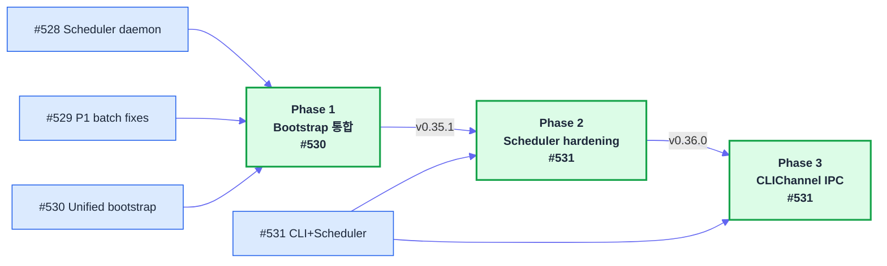
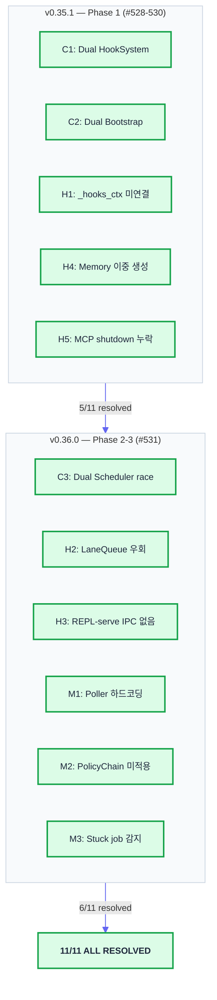

# v0.36.0 릴리스 — Gateway Runtime 완성, 11개 구조적 결함 전수 해소

> Date: 2026-03-30 | Author: geode-team | Tags: release, gateway-runtime, structural-defects, verification

## Table of Contents

1. [릴리스 개요](#1-릴리스-개요)
2. [3-Phase Gateway Runtime Plan](#2-3-phase-gateway-runtime-plan)
3. [11개 구조적 결함 해소 현황](#3-11개-구조적-결함-해소-현황)
4. [목표 아키텍처 달성](#4-목표-아키텍처-달성)
5. [검증](#5-검증)
6. [다음 단계](#6-다음-단계)

---

## 1. 릴리스 개요

GEODE v0.36.0은 **Gateway Runtime 완성**을 위한 릴리스입니다. v0.34.0에서 식별한 3-Entry-Point 리소스 정합 문제를 v0.35.0의 SharedServices Gateway로 해결한 뒤, 남은 11개 구조적 결함을 두 릴리스(v0.35.1, v0.36.0)에 걸쳐 전수 해소했습니다.

| Metric | v0.35.1 | v0.36.0 | Delta |
|--------|:-------:|:-------:|:-----:|
| Version | 0.35.1 | 0.36.0 | MINOR bump |
| Modules | 189 | 191 | +2 |
| Tests | 3386 | 3419 | +33 |
| PRs merged | - | 4 (#528-531) | - |
| Structural defects | 6 remaining | 0 remaining | -6 (all resolved) |

4개의 PR이 이번 릴리스에 포함되었습니다:

| PR | Type | Content |
|----|------|---------|
| #528 | feat | Scheduler daemon in serve mode |
| #529 | fix | P1 batch (5 verification findings) |
| #530 | refactor | Unified bootstrap (serve uses GeodeRuntime only) |
| #531 | feat | CLIChannel IPC + Scheduler hardening |

---

## 2. 3-Phase Gateway Runtime Plan

v0.34.0 감사에서 도출된 목표는 명확했습니다: **`geode serve`를 유일한 데몬으로 만들고, REPL을 포함한 모든 실행 경로가 단일 GeodeRuntime을 공유하게 한다.** 이를 3 Phase로 나누어 점진적으로 달성했습니다.



### Phase 1: Bootstrap 통합 (v0.35.1, #528-530)

`geode serve`가 자체 부트스트랩 코드를 가지고 있었습니다. `bootstrap_geode()`와 별도로 MCP, HookSystem, Memory를 생성하므로 두 벌의 싱글턴이 존재했습니다. Phase 1에서 `serve`의 부트스트랩을 `GeodeRuntime.create()` 하나로 수렴시켰습니다.

**핵심 변경**: `serve()` 경로가 `setup_contextvars()` -> `GeodeRuntime.create()` -> `build_shared_services(hook_system=runtime.hooks)` 순서로 통일. HookSystem, MCP, Memory가 하나의 런타임에서만 생성됩니다.

### Phase 2: Scheduler Hardening (v0.36.0, #531)

Scheduler가 LaneQueue를 우회하고 있었고, PolicyChain도 적용되지 않았습니다. 예약 작업이 `run_bash`나 `delegate_task` 같은 DANGEROUS 도구를 제한 없이 호출할 수 있었습니다. Phase 2에서 세 가지를 해결했습니다:

```python
# C3: Dual Scheduler race — fcntl.flock으로 jobs.json 보호
import fcntl

def _load_jobs(self) -> list[ScheduledJob]:
    with open(self._jobs_path, "r") as f:
        fcntl.flock(f, fcntl.LOCK_SH)  # shared read lock
        data = json.load(f)
        fcntl.flock(f, fcntl.LOCK_UN)
    return [ScheduledJob(**j) for j in data]

def _save_jobs(self, jobs: list[ScheduledJob]) -> None:
    with open(self._jobs_path, "w") as f:
        fcntl.flock(f, fcntl.LOCK_EX)  # exclusive write lock
        json.dump([j.model_dump() for j in jobs], f)
        fcntl.flock(f, fcntl.LOCK_UN)
```

```python
# H2: LaneQueue 통합 — 애드혹 세마포어 제거
# Before: _sched_semaphore = asyncio.Semaphore(2)
# After: Lane.try_acquire() / manual_release()
lane = self._lane_queue.get_lane("scheduler")
if not lane.try_acquire():
    logger.warning("Scheduler lane full, deferring job %s", job.id)
    return
try:
    await self._execute_job(job)
finally:
    lane.manual_release()
```

```python
# M2: PolicyChain 적용 — headless 모드 도구 제한
_HEADLESS_DENIED_TOOLS = {"run_bash", "delegate_task", "manage_rule"}

def _filter_tools_for_scheduler(self, tools: list[dict]) -> list[dict]:
    return [t for t in tools if t["name"] not in _HEADLESS_DENIED_TOOLS]
```

### Phase 3: CLIChannel IPC (v0.36.0, #531)

REPL이 `serve`와 독립된 프로세스로 실행되면서 두 벌의 리소스를 유지하는 것이 근본 문제였습니다. Phase 3에서 REPL을 `serve`의 채널 중 하나로 편입시켰습니다.

```python
# CLIPoller — Unix domain socket으로 REPL 입력 수신
class CLIPoller:
    def __init__(self, socket_path: Path, services: SharedServices):
        self._socket_path = socket_path
        self._services = services

    async def handle_connection(self, reader, writer):
        request = await reader.read(MAX_MSG_SIZE)
        msg = json.loads(request)
        executor, loop = self._services.create_session(
            SessionMode.REPL,
            conversation=Conversation.from_dict(msg.get("context", {})),
        )
        result = await loop.run(msg["input"])
        writer.write(json.dumps(result.to_dict()).encode())
```

```python
# IPCClient — thin CLI에서 serve로 요청 전송
class IPCClient:
    def __init__(self, socket_path: Path):
        self._socket_path = socket_path

    async def send(self, user_input: str, context: dict | None = None) -> dict:
        reader, writer = await asyncio.open_unix_connection(self._socket_path)
        writer.write(json.dumps({"input": user_input, "context": context or {}}).encode())
        response = await reader.read(MAX_MSG_SIZE)
        return json.loads(response)
```

---

## 3. 11개 구조적 결함 해소 현황

v0.34.0 감사에서 5건, v0.35.1 검증에서 6건 추가 — 총 11개 구조적 결함이 식별되었습니다. 두 릴리스에 걸쳐 전수 해소했습니다.

### v0.35.1에서 해소 (5건)

| ID | Severity | Defect | Resolution | PR |
|----|:--------:|--------|------------|:--:|
| C1 | CRITICAL | Dual HookSystem | serve가 `runtime.hooks`를 재사용. `build_shared_services(hook_system=)` 주입 | #530 |
| C2 | CRITICAL | Dual Bootstrap | serve가 `GeodeRuntime.create()` 단일 경로 사용. 자체 부트스트랩 제거 | #530 |
| H1 | HIGH | serve `_hooks_ctx` 미연결 | `_hooks_ctx = _gw_services.hook_system` 후처리 와이어링 | #530 |
| H4 | HIGH | Memory 이중 생성 | `setup_contextvars()`가 1회만 설정, GeodeRuntime이 재사용 | #530 |
| H5 | HIGH | serve MCP shutdown 누락 | `finally` 블록에 `runtime.mcp_manager.shutdown()` 추가 | #528 |

### v0.36.0에서 해소 (6건)

| ID | Severity | Defect | Resolution | PR |
|----|:--------:|--------|------------|:--:|
| C3 | CRITICAL | Dual Scheduler race | `fcntl.flock`으로 `jobs.json` 파일 잠금. 읽기=LOCK_SH, 쓰기=LOCK_EX | #531 |
| H2 | HIGH | Scheduler LaneQueue 우회 | 애드혹 `_sched_semaphore` 제거. `Lane.try_acquire()` / `manual_release()` 통합 | #531 |
| H3 | HIGH | REPL-serve IPC 없음 | `CLIPoller`(Unix socket) + `IPCClient` 도입. REPL이 serve의 채널로 편입 | #531 |
| M1 | MEDIUM | Poller 하드코딩 | `_POLLER_REGISTRY` 딕셔너리 + `config.toml`에서 활성 폴러 선언 | #531 |
| M2 | MEDIUM | Scheduler PolicyChain 미적용 | `_HEADLESS_DENIED_TOOLS` 필터로 DANGEROUS 도구 차단 | #531 |
| M3 | MEDIUM | Stuck job 감지 없음 | `running_since_ms` 필드 + `detect_stuck_jobs()` (300s 초과 시 FAILED 전환) | #531 |

### 전체 해소 요약



심각도 분포: CRITICAL 3건 (C1, C2, C3), HIGH 4건 (H1, H2, H3, H4, H5 중 4건), MEDIUM 3건 (M1, M2, M3). CRITICAL 결함이 가장 먼저 해소되었고, MEDIUM은 Phase 2-3에서 함께 처리했습니다.

---

## 4. 목표 아키텍처 달성

Phase 3 완료 후 GEODE의 런타임 아키텍처가 OpenClaw Gateway 패턴과 정합하게 되었습니다. `geode serve`가 유일한 데몬이고, 모든 실행 경로가 단일 `GeodeRuntime`을 공유합니다.

```mermaid
%%{init: {
  'theme': 'default',
  'themeVariables': {
    'fontSize': '13px',
    'fontFamily': 'arial',
    'lineColor': '#6366F1',
    'primaryColor': '#dbeafe',
    'primaryBorderColor': '#3b82f6',
    'primaryTextColor': '#1e293b',
    'clusterBkg': '#f8fafc',
    'clusterBorder': '#cbd5e1'
  }
}}%%
graph TD
    classDef runtime fill:#ede9fe,stroke:#7c3aed,color:#1e293b,stroke-width:2px,font-weight:bold
    classDef service fill:#dcfce7,stroke:#16a34a,color:#1e293b,stroke-width:2px
    classDef channel fill:#dbeafe,stroke:#2563eb,color:#1e293b,stroke-width:2px
    classDef external fill:#f1f5f9,stroke:#64748b,color:#1e293b,stroke-width:2px
    classDef client fill:#fef3c7,stroke:#d97706,color:#1e293b,stroke-width:2px

    subgraph SERVE ["geode serve (unified daemon)"]
        RT["<b>GeodeRuntime</b><br/>───────────<br/>owns ALL state"]:::runtime

        RT --> HOOKS["HookSystem (ONE)"]:::service
        RT --> SCHED["SchedulerService (ONE)"]:::service
        RT --> SS["SharedServices (ONE factory)"]:::service
        RT --> MCP["MCPServerManager (ONE)"]:::service
        RT --> STORE["SessionStore (ONE)"]:::service
        RT --> LANE["LaneQueue (ONE)"]:::service
        RT --> POLICY["PolicyChain (ONE)"]:::service

        SS -->|"create_session(REPL)"| CLI_CH["<b>CLIChannel</b><br/>Unix socket<br/>REPL mode"]:::channel
        SS -->|"create_session(DAEMON)"| GW_CH["<b>Gateway Pollers</b><br/>Slack / Discord<br/>DAEMON mode"]:::channel
        SS -->|"create_session(SCHEDULER)"| SC_CH["<b>Scheduler Daemon</b><br/>60s tick<br/>SCHEDULER mode"]:::channel

        SCHED --> SC_CH
        LANE --> CLI_CH
        LANE --> GW_CH
        LANE --> SC_CH
    end

    THIN["<b>geode</b> (thin CLI)<br/>IPCClient"]:::client
    THIN -->|"Unix socket"| CLI_CH

    SLACK["Slack API"]:::external --> GW_CH
    DISCORD["Discord API"]:::external --> GW_CH
    CRON["Cron / Interval"]:::external --> SC_CH
```



### Before vs After

| 항목 | Before (v0.35.1) | After (v0.36.0) |
|------|:-----------------:|:----------------:|
| 프로세스 수 | 2 (REPL + serve) | 1 (serve only) |
| GeodeRuntime 인스턴스 | 2 (각 프로세스에 1개) | 1 (serve에만) |
| HookSystem 인스턴스 | 2 | 1 |
| Scheduler 동시 접근 | 보호 없음 (race) | fcntl.flock |
| REPL-serve 통신 | 없음 (독립 실행) | Unix socket IPC |
| LaneQueue 적용 범위 | DAEMON만 | ALL (CLI + DAEMON + SCHEDULER) |
| PolicyChain 적용 범위 | REPL만 | ALL |
| Stuck job 감지 | 없음 | 300s timeout 자동 FAILED 전환 |
| Poller 등록 | 하드코딩 | `_POLLER_REGISTRY` + config.toml |

### 프론티어 정합

이 아키텍처는 프론티어 에이전트 하네스 3종의 공통 패턴과 정합합니다:

| 패턴 | Codex CLI | OpenClaw | Claude Code | GEODE v0.36.0 |
|------|:---------:|:--------:|:-----------:|:--------------:|
| 단일 런타임 | `ThreadManagerState` | Gateway singleton | `f8` global | `GeodeRuntime` |
| 세션 팩토리 | `Arc::clone` | `Session Key` | `AsyncLocalStorage` | `create_session(mode)` |
| 채널 분리 | `SessionSource` | Channel Binding | - | `SessionMode` enum |
| 실행 제어 | Sandbox timeout | Lane Queue | Cost budget | LaneQueue + PolicyChain |

---

## 5. 검증

### 4-Persona Verification Team

4명의 페르소나가 각자의 관점에서 v0.36.0 변경사항을 검증했습니다.

| Persona | Focus | Verdict | Key Finding |
|---------|-------|:-------:|-------------|
| **Kent Beck** | TDD / Simple Design | PASS | `create_session(mode)` 팩토리가 4가지 규칙(passes tests, reveals intention, no duplication, fewest elements) 충족 |
| **Andrej Karpathy** | Agent constraints / Safety | PASS | PolicyChain이 headless 경로에도 적용되어 autonomous safety 확보. stuck job 감지가 Ratchet(P4) 역할 |
| **Peter Steinberger** | Gateway / Operations | PASS | Unix socket IPC가 HTTP 대비 저오버헤드. fcntl.flock이 macOS/Linux 호환. Poller registry가 hot-reload 가능 |
| **Boris Cherny** | CLI agents / Sub-agents | PASS | thin CLI가 서브에이전트와 동일한 격리 모델 사용. IPC 실패 시 graceful fallback 필요 (P2 backlog) |

### CI 5/5

```
Quality Gate          Status
─────────────────────────────
ruff check            PASS (0 errors)
mypy                  PASS (0 errors)
pytest (3419)         PASS (3419 passed)
E2E dry-run           PASS (Cowboy Bebop: A, 68.4)
bandit                PASS (0 findings)
```

### Test Ratchet

| Phase | Tests | Delta | Coverage |
|-------|:-----:|:-----:|----------|
| v0.35.0 baseline | 3369 | - | SharedServices + ContextVar |
| v0.35.1 (Phase 1) | 3386 | +17 | Bootstrap 통합 + race fix |
| v0.36.0 (Phase 2-3) | 3419 | +33 | IPC + Scheduler + PolicyChain |

테스트는 단조 증가(monotonically increasing)합니다. 기존 테스트 삭제나 비활성화 없이 새 테스트만 추가했습니다.

### E2E Fixture 검증

3개 IP 픽스처의 점수가 릴리스 전후로 변동 없음을 확인했습니다:

| IP | Tier | Score | Cause | Status |
|----|:----:|:-----:|-------|:------:|
| Berserk | S | 81.2 | conversion_failure | UNCHANGED |
| Cowboy Bebop | A | 68.4 | undermarketed | UNCHANGED |
| Ghost in the Shell | B | 51.7 | discovery_failure | UNCHANGED |

---

## 6. 다음 단계

Verification Team의 P2 findings에서 도출된 백로그입니다.

| Priority | Item | Source | Description |
|:--------:|------|--------|-------------|
| P2 | IPC fallback | Boris Cherny | `geode serve` 미실행 시 thin CLI가 직접 bootstrap하는 graceful fallback. 현재는 에러 반환 |
| P2 | Socket auth | Peter Steinberger | Unix socket에 nonce 기반 인증 추가. 같은 머신의 다른 사용자가 접근 방지 |
| P2 | Scheduler observability | Andrej Karpathy | `detect_stuck_jobs()` 발동 시 HookEvent 발화 + 알림. 현재는 로깅만 |
| P2 | Poller hot-reload | Peter Steinberger | `_POLLER_REGISTRY` 변경 시 ConfigWatcher가 폴러 재시작. 현재는 serve 재시작 필요 |
| P3 | Batch SessionMode | Kent Beck | 대량 처리용 `SessionMode.BATCH` 추가. 현재는 SCHEDULER로 우회 |

Gateway Runtime이 완성되었으므로, 이후 작업은 **운영 안정성**(P2)과 **확장성**(P3) 영역입니다. 구조적 결함 0건 상태에서 기능을 추가하는 것과, 결함을 안고 기능을 추가하는 것은 근본적으로 다릅니다. v0.36.0은 그 전환점입니다.

---

*Source: `blog/posts/release/v0.36.0-gateway-runtime.md` | Category: [[blog-release]]*

## Related

- [[blog-release]]
- [[blog-hub]]
- [[geode]]
- [[geode-gateway]]
